## 一、基本概念

### 1. 进程与线程

**进程（Process）**：计算机中正在运行的程序的实例，是操作系统分配资源的基本单位。每个进程拥有自己的内存空间、文件描述符、数据栈等。

**线程（Thread）**：进程中的一个执行单元。一个进程中至少有一个线程，通常称为主线程。线程是 **CPU 调度和执行的最小单位。** 线程共享进程的资源,一个进程中的多个线程可以并发执行，线程之间的通信比进程之间的通信更高效。

### 2. 并发与并行

**并发（Concurrency）**：系统能够在同一**时间段**内处理多个任务，但这些任务可能并不同时执行。每个任务轮询持有cpu的时间片，在时间片内可以使用cpu，犹豫时间片很短，宏观上看是并行执行。

**并行（Parallelism）**：在同一**时刻**有多个任务（线程、协程、事件驱动...）同时执行。通常需要多个 CPU 或多核处理器支持，可以在物理上同时执行多个任务。

在实际中往往是并行和并发同时存在。

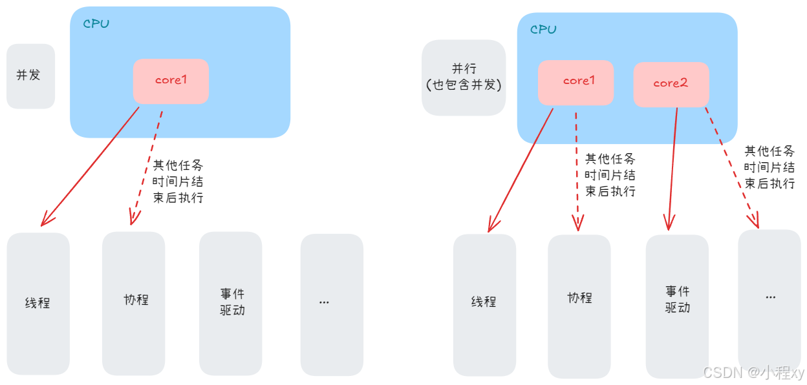


### 3. 同步与异步

**同步（Synchronous）**：任务之间的执行是按照顺序进行的，一个任务必须等待另一个任务完成后才能开始执行。

**异步（Asynchronous）**：任务之间的执行不需要等待，可以在任务执行的同时进行其他操作。任务之间可以独立进行，不需要等待。

注意：**同步**在多线程中是指 在多个线程访问共享资源时，通过某种机制来确保同一时间只有一个线程可以访问该资源，以防止数据不一致或竞争条件

### 4. 准备工作

引入下面依赖，查看更多输出信息
```xml
<dependency>
   <groupId>ch.qos.logback</groupId>
    <artifactId>logback-classic</artifactId>
    <version>1.5.11</version>  <!-- 或者使用其他版本 -->  
</dependency>
```
resources下创建一个 logback.xml
```xml
<configuration>
    <appender name="console" class="ch.qos.logback.core.ConsoleAppender">
        <encoder>
            <!-- 只输出时间和线程名称 -->
            <pattern>%d{HH:mm:ss.SSS} [%thread] - %msg%n</pattern>
        </encoder>
    </appender>

    <root level="DEBUG">
        <appender-ref ref="console" />
    </root>
</configuration>
```
```java
private static final Logger log = LoggerFactory.getLogger(Main.class);
```
## 二、java的线程

### 1. 创建线程

1. 继承 **Thread** 类并重写 `run()` 方法来定义线程的执行逻辑。然后，通过调用 `start()` 方法来启动线程。
	```java
	Thread t1 = new Thread("threadName") {	// 这里我们通过匿名类创建线程。（匿名类在创建时同时定义和实例化）
	   @Override
	   public void run() {
	       System.out.println("hello world");
	   }
	};
	
	t1.start();  // 启动 threadName 线程
	```
2. 实现 **Runnable** 接口，重写 `run()` 方法来定义线程要执行的代码。然后将该 **Runnable** 实现传递给一个 **Thread** 对象，调用 `start()` 启动线程。
	```java
	class Work1 implements Runnable {
	    @Override
	    public void run() {
	        System.out.println("hello world");
	    }
	}
	
	public class Main {
	    public static void main(String[] args) {
	        Runnable work1 = new Work1();
	        Thread t1 = new Thread(work1, "threadName");	// 创建线程
	        t1.start();
	    }
	}
	```

	下面是通过 **Lambda** 表达式优化创建过程
	```java
	Runnable work1 = () -> System.out.println("hello world");
	Thread t1 = new Thread(work1, "threadName");
	t1.start();
	// Thread t1 = new Thread(() -> System.out.println("hello world"), "threadName");
	// t1.start();
	```
3. **FutureTask** 是一个既可以作为任务执行器又可以获取**任务结果**。它实现了 **Runnable** 和 **Future** 接口，因此可以用来创建和管理线程任务，同时可以获取任务的执行结果。
	
	```java
	// 创建任务
	FutureTask<Integer> task = new FutureTask<>(new Callable<Integer>() {
	    @Override
	    public Integer call() throws Exception {
	        System.out.println("hello world");
	        Thread.sleep(1000);
	        return 1;
	    }
	});
	
	// 创建线程并且任务
	Thread t1 = new Thread(task, "t1");
	t1.start();
	
	Integer returnValue = task.get();   // 会阻塞在这里，直到获取到返回值
	System.out.println(returnValue);
	```

### 2. 常用方法


| **方法名**                      | **描述**                                                     |
| ------------------------------- | ------------------------------------------------------------ |
| `start()`                       | 启动线程，使线程进入 **就绪状态**，由 CPU 调度运行。         |
| `run()`                         | 线程的执行逻辑，通常不直接调用，而是通过 `start()` 间接调用，调用 `run()` 不会开启新线程。 |
| `sleep(long millis)` (静态方法) | 使当前线程休眠指定的时间（毫秒），在此期间不会占用 CPU。**（阻塞状态）** |
| `join()`                        | 等待线程执行完成后再继续执行后续代码。                       |
| `interrupt()`                   | 中断线程的执行，设置中断状态，但线程是否停止取决于代码逻辑（需手动检测或处理中断状态）。 |
| `isInterrupted()`               | 检查线程是否被中断（不中断状态时返回 `false`）。             |
| `interrupted()`  (静态方法)     | 返回当前线程是否为中断状态，并把中断状态改为 `false`         |
| `currentThread()` (静态方法)    | 获取当前执行的线程对象。                                     |
| `getName()` / `setName(String)` | 获取或设置线程的名称，用于调试或标识线程。                   |
| `getId()`                       | 获取线程的唯一 ID。                                          |
| `setPriority(int)`              | 设置线程优先级（取值范围 1~10，默认值 5，优先级高的线程更容易被 CPU 调度）。 |
| `getPriority()`                 | 获取线程优先级。                                             |
| `isAlive()`                     | 检查线程是否还在运行状态。                                   |
| `yield()` (静态方法)            | 提示线程调度器让出 CPU，使当前线程由 **运行状态** 转为 **就绪状态**（可能会再次被立即调度）。 |
| `setDaemon(boolean)`            | 设置线程为守护线程（后台线程），当所有非守护线程结束时，守护线程自动终止。必须在线程启动前调用。 |
| `getState()`                    | 返回线程的当前状态，结果为 `Thread.State` 枚举类型，可能的状态包括：`NEW`、`RUNNABLE`、`BLOCKED`、`WAITING`、`TIMED_WAITING` 和 `TERMINATED`。 |

#### 2.1 基本方法的使用:

下面代码用不同方法创建了两个线程、设置了线程名 `setName`，启动线程 `start`，通过 `Thread.sleep` 让线程阻塞，通过 `join` 方法阻塞等待线程执行完毕
```java
public class Main {
    private static final Logger logger = LoggerFactory.getLogger(Main.class);

    public static void main(String[] args) throws InterruptedException {
        Thread t1 = new Thread(() -> {
            try {
                logger.debug("t1 start");
                Thread.sleep(1000);
            } catch (InterruptedException e) {
                throw new RuntimeException(e);
            }
        },"t1");


        Thread t2 = new Thread() {
            @Override
            public void run() {
                try {
                    logger.debug("t2 start");
                    Thread.sleep(2000);
                } catch (InterruptedException e) {
                    throw new RuntimeException(e);
                }
            }
        };
        t2.setName("t2"); // 设置线程名

        t1.start();
        t2.start();

        logger.debug("主线程在工作");

        t2.join(5000);  // 最多等待5秒, 因为t2线程实际大概只有2秒，所以这个2秒就不阻塞了
        logger.debug("t2 join end");

        t1.join();  // 阻塞等待t1线程结束
        logger.debug("t1 join end");
    }
}
// 输出, 观察输出可以看到，因为t2.join阻塞main线程，即使t1比t2先执行完，也没法输出
10:21:38.202 [t1] - t1 start
10:21:38.202 [t2] - t2 start
10:21:38.202 [main] - 主线程在工作
10:21:40.208 [main] - t2 join end
10:21:40.208 [main] - t1 join end
```
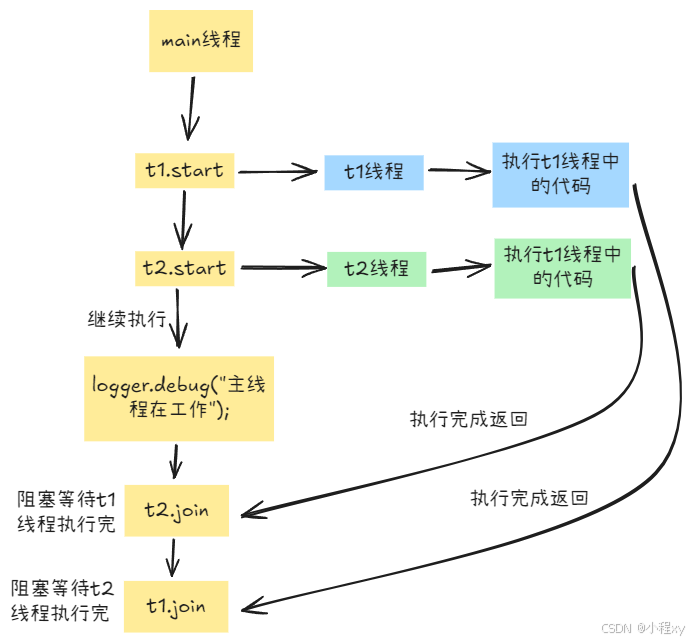

#### 2.2 interrupt 的使用

**interrupt** 并不会让打断线程，而是让 **isInterrupted** 为 true，但是对处于在 sleep 或 wait 的线程（也就是等待的线程），并不会让 **isInterrupted** 为 true，而是抛出一个 `InterruptedException ` 异常

观察下面代码可以看到 t1，t2的 **isInterrupted** 都是 false，t3的为 true。这里看不懂t2的代码没关系，下面会讲，只要明白上面那句话就可以。

```java
public class Main {
    private static final Logger logger = LoggerFactory.getLogger(Main.class);
    static Object obj = new Object();

    public static void main(String[] args) throws InterruptedException {
    	// 创建线程 t1
        Thread t1 = new Thread(() -> {
            try {
                Thread.sleep(3000);
            } catch (InterruptedException e) {
                e.printStackTrace();
                Thread curThread = Thread.currentThread();
                logger.debug("t1 isInterrupted = {}", curThread.isInterrupted());
            }
        }, "t1");
		
		// 创建线程 t2
        Thread t2 = new Thread(() -> {
            synchronized (obj) {
                try {
                    obj.wait(3000);
                } catch (InterruptedException e) {
                    e.printStackTrace();
                    Thread curThread = Thread.currentThread();
                    logger.debug("t2 isInterrupted = {}", curThread.isInterrupted());
                }
            }
        }, "t2");

        Thread t3 = new Thread(() -> {
            while (true) {
                boolean isInter = Thread.currentThread().isInterrupted();
                if (isInter) {
                    logger.debug("t3 isInterrupted = true");
                    break;
                }
            }
        }, "t3");

        t1.start();
        t2.start();
        t3.start();

        Thread.sleep(1000);

        logger.debug("interrupt thread");
        t1.interrupt();	// 打断t1
        t2.interrupt();	// 打断t2
        t3.interrupt();	// 打断t3
    }
}
// 输出
11:04:51.551 [main] - interrupt thread
11:04:51.552 [t3] - t3 isInterrupted = true
11:04:51.552 [t2] - t2 isInterrupted = false
11:04:51.553 [t1] - t1 isInterrupted = false
```

#### 2.3 守护线程

**普通线程**启动后一定会执行完整个线程中的代码，只要存在普通线程没有执行完，整个项目就不会结束。而守护线程却不是这样，守护线程不一定会执行完整个线程中的代码，当所有的普通线程都执行完后，即使守护线程还有未执行的代码，它也会被 JVM 强制终止。

 守护线程通常用于后台的辅助任务，例如垃圾回收（GC）线程、定时任务等。

1. 普通线程
	观察下面的输出可以看到，即使main线程的代码已经执行完了，但是会等待t1线程执行完，然后整个应用结束
	```java
	public class Main {
	    private static final Logger logger = LoggerFactory.getLogger(Main.class);
	
	    public static void main(String[] args) throws InterruptedException {
	        Thread t1 = new Thread(() -> {
	            try {
	                Thread.sleep(3000);
	            } catch (InterruptedException e) {
	                throw new RuntimeException(e);
	            }
	            logger.info("t1 线程");
	        }, "t1");
	        t1.start();
	
	        Thread.sleep(1000);
	        logger.info("执行完成");
	    }
	}
	// 输出
	20:39:32.587 [main] - 执行完成
	20:39:34.587 [t1] - t1 线程
	```
2. 守护线程
	当main线程执行完后，守护线程t1 也结束，没有输出 "t1 线程"。
	```java
	public class Main {
	    private static final Logger logger = LoggerFactory.getLogger(Main.class);
	
	    public static void main(String[] args) throws InterruptedException {
	        Thread t1 = new Thread(() -> {
	            try {
	                Thread.sleep(3000);
	            } catch (InterruptedException e) {
	                throw new RuntimeException(e);
	            }
	            logger.info("t1 线程");
	        }, "t1");
	        t1.setDaemon(true); // 设置t1为守护线程
	        t1.start();
	
	        Thread.sleep(1000);
	        logger.info("执行完成");
	    }
	}
	// 输出
	20:42:02.762 [main] - 执行完成
	```

### 3. 线程的状态(java)
上面线程常用方法讲到 `getState()` 会返回java线程的6种状态，下面说明下各个状态。

**`New`**：线程对象已被创建，但没有调用了 start() 方法

**`Runnable`**：线程已启动，并且能够被调度执行，处于可运行状态。线程处于 RUNNABLE 状态时，可能正在执行，也可能处于操作系统的就绪队列中等待 CPU 时间片分配。

**`Blocked`**：当线程试图访问某个对象的锁，而该锁已经被其他线程持有时，会从就绪队列移除，进入等待队列(阻塞队列)，直到获取锁，阻塞状态下不会占用cpu，也不会分到时间片。但会进入等待队列时会有线程上下文切换会带来额外的 CPU 开销

**`Waiting`**：线程因某些条件不满足而无限期挂起，直到它被唤醒。通常通过 `Object.wait()` 或 `Thread.join()` 进入此状态。等待状态下不会占用cpu，也不会分到时间片。

**`Timed Waiting`**：线程进入此状态是为了等待某些条件发生，但与等待状态不同，超时等待是有时间限制的。通常通过 `Thread.sleep(long millis)`、`Object.wait(long timeout)` 或 `Thread.join(long millis)` 等方法进入超时等待状态。不占用cpu

**`Terminated`**：线程在执行完所有任务后进入 TERMINATED 状态，意味着线程已完成执行，或者因异常退出。

一些细节问题和证明：

1. java线程的 `Runnable` 状态包含 调用start方法后进入就绪队列后、占用cpu时、文件的读取时。虽然文件的读取在系统层面上看是阻塞的，但是java认为读取文件时依然是 **Runnable** 状态

	下面代码主线程会一直打印 t1 线程的状态，t1线程在 sleep 1秒后，读取文件。但是观察代码的输出可以看到 `Timed Waiting` 和 `Terminated` 之间只有 `Runnable` 状态，并没有 `Blocked` 状态。可以证明读取文件的线程成语 Runnable 状态
	```java
	public class Main {
	    private static final Logger logger = LoggerFactory.getLogger(Main.class);
	
	    public static void main(String[] args) throws InterruptedException, IOException {
	        Thread t1 = new Thread(() -> {
	            try {
	                Thread.sleep(1000);
	            } catch (InterruptedException e) {
	                throw new RuntimeException(e);
	            }
	
	            Path path = Paths.get("test.txt");
	            try {
	                byte[] bytes = Files.readAllBytes(path);
	            } catch (IOException e) {
	                throw new RuntimeException(e);
	            }
	            logger.info("t1 线程");
	        }, "t1");
	
	        t1.start();
	        Path path = Paths.get("out.txt");
	        while (true) {
	            System.out.println(t1.getState());
	            Files.write(path, t1.getState().toString().getBytes(), StandardOpenOption.APPEND);
	        }
	    }
	}
	// 输出
	TIMED_WAITING
	TIMED_WAITING
	RUNNABLE
	RUNNABLE
	RUNNABLE
	...(全是RUNNABLE)
	RUNNABLE
	TERMINATED
	TERMINATED
	```

## 三、多线程常见内容

**临界区**：在并发编程中，一段需要访问共享资源的代码区域，并且这个代码区存在多个线程的写操作。

**竞态条件**：在并发程序中，多个线程并发访问共享资源时，在没有正确同步控制的情况下并发地访问共享资源，从而导致不可预测的结果。

### 1. synchronized 

观察下面代码，我们在两个线程中同时访问 静态变量 cnt，并对它进行写操作，导致输出结果并不是预期的0，是不确定的。

这是由于 cnt ++ 这个操作不具有原子性。cnt ++ 被jvm编译成字节码时有四步操作，分别是 getstatic (获取cnt)，iconst_1 (准备常量1)，iadd (执行 cnt + 1)，putstatic (把cnt + 1赋值给cnt)。而这四个步骤可能在执行期间被打断，比如时间片不足线程切换。
```java
public class Main {
    private static final Logger logger = LoggerFactory.getLogger(Main.class);
    static int cnt = 0;

    public static void main(String[] args) throws InterruptedException, IOException {
        Thread t1 = new Thread(() -> {
            for (int i = 0; i < 100000; i++) {
                cnt++;
            }
        });
        Thread t2 = new Thread(() -> {
            for (int i = 0; i < 100000; i++) {
                cnt--;
            }
        });
        
        t1.start();t2.start();

        t1.join();t2.join();
        System.out.println(cnt);
    }
}
// 输出
26026
```

####  1.1 synchronized 的概念

`synchronized` 关键字用于修饰代码块或方法。被修饰的代码块或方法需要传入一个对象锁，synchronized 可以确保同一时刻只有一个线程可以获取到这个锁，其他没有获取到这个锁的线程会进入阻塞状态，只有获取到这个锁的才可以执行这个代码块，执行完代码块后会自动释放这个锁，保证了代码块的原子性。可以解决竞态条件的问题。

#### 1.2 synchronized 修饰代码块

引入 synchronized 修饰代码块 cnt ++ 和 cnt --，传入的锁是一个静态变量 lock，线程t1和t2共享一个 lock, 所以t1和t2线程不会同时执行代码块中的内容。
```java
public class Main {
    private static final Logger logger = LoggerFactory.getLogger(Main.class);
    static int cnt = 0;
    static Object lock = new Object();
    public static void main(String[] args) throws InterruptedException, IOException {
        Thread t1 = new Thread(() -> {
            for (int i = 0; i < 100000; i++) {
                synchronized (lock) {	// 确保 cnt ++ 的原子性
                    cnt++;
                }
            }
        });
        Thread t2 = new Thread(() -> {
            for (int i = 0; i < 100000; i++) {
                synchronized (lock) {	// 同一时刻只会有一个线程获取到 lock 这个锁
                    cnt--;
                }
            }
        });

        t1.start();t2.start();

        t1.join();t2.join();
        System.out.println(cnt);
    }
}
// 输出
0
```
#### 1.3 synchronized 修饰方法

synchronized 用于方法上时，分为两种，实例方法和静态方法

1. 实例方法

当 synchronized 用于**实例方法**时，它会 锁住调用该方法的实例对象。也就是说，同一个类的不同线程对同一个对象调用同步实例方法时，会排队等候执行，不能同时执行该方法。

当我多个线程都用 t1 这个实例调用 test 时，会排队等候执行。因为实例方法上加上synchronized 相当于锁住 当前实例 this
```java
Test t1 = new Test();
t1.test();

class Test {
    public synchronized void test() {
    }
// 上面代码相当于下面注释这个，锁住的是 this, 这个示例中锁住的是 t1 这个实例
//    public void test() {
//        synchronized (this) {
//        }
//    }
}
```
2. 静态方法

当 synchronized 用于**静态方法**时，它会 锁住类的 Class 对象（class对象对所有实例都共享，只有一份），即锁住整个类的类级别的资源，所有实例共享同一个锁。

当我多个线程都通过 `Test.test()` 调用时，会排队等候执行。
```java
Test.test();

class Test {
    public static synchronized void test() {
    }
// 上面代码相当于下面注释这个，锁住的是Class对象
//    public static void Test() {
//        synchronized (Test.class) {
//        }
//    }
}
```

### 2. 线程安全性

在 Java 中，线程安全性通常是 多个线程 共享访问同一资源时，不会导致数据错误或程序崩溃。

#### 2.1 **线程不安全的原因**

线程不安全通常是由于以下原因引起的：

- **竞态条件（Race Condition）**：
  竞态条件发生在多个线程同时访问共享资源时，且至少有一个线程会修改资源。这时不同线程的执行顺序可能会导致不一致的结果。

- **不可见性（Visibility）**：
  一个线程对共享变量的修改可能在其他线程中不可见。因为线程可能会缓存局部变量或共享变量的副本，导致线程间的修改不能及时传播。

- **原子性（Atomicity）**：
  原子性是指操作在执行过程中不能被中断。多个线程访问共享资源时，如果没有适当的同步机制，可能会导致非原子的操作，进而引发不一致的结果。

#### 2.2 引用类型局部变量线程安全性分析

list **线程不安全**，会出现下标越界。因为有两个线程都在用 test 实例的 test1方法对同一个 list 对象进行修改，不同线程的执行顺序导致了删除执行的次数比添加多，出现越界。（竞态条件、原子性）
```java
public class Main {
    public static void main(String[] args) {
        Test test = new Test();

        new Thread(() -> test.test1()).start();
        new Thread(() -> test.test1()).start();
    }
}

class Test {
    List<Integer> list = new ArrayList<>();
    void test1() {
        for (int i = 0; i < 10000; i++) {
            test2();
            test3();
        }
        System.out.println(list.size());
    }

    void test2() {
        list.add(1);
    }
    void test3() {
        list.remove(0);
    }
}
```

list **线程安全**。虽然同一个实例 test 的两个线程都在对 list 进行修改，但是 list 是局部变量，当调用test1时会创建新的list变量，两个线程修改的list不是同一个
```java
public class Main {
    public static void main(String[] args) {
        Test test = new Test();

        new Thread(() -> test.test1()).start();
        new Thread(() -> test.test1()).start();
    }
}

class Test {
    void test1() {
        List<Integer> list = new ArrayList<>();	// 不同点
        for (int i = 0; i < 10000; i++) {
            test2(list);
            test3(list);
        }
        System.out.println(list.size());
    }

    void test2(List<Integer> list) {
        list.add(1);
    }

    void test3(List<Integer> list) {
        list.remove(0);
    }
}
```
list **线程不安全**。虽然 main 线程中创建的两个线程的 list 变量是两个不同的，但是test1中调用test3方法时把list传递了过去，test3创建了新的线程，这个新的线程共享了list，而且进行了修改。（竞态条件、原子性）
```java
public class Main {
    public static void main(String[] args) {
        Test test = new Test();

        new Thread(() -> test.test1()).start();
        new Thread(() -> test.test1()).start();
    }
}

class Test {
    void test1() {
        List<Integer> list = new ArrayList<>();
        for (int i = 0; i < 100; i++) {
            test2(list);
            test3(list);
        }
        System.out.println(list.size());
    }

    void test2(List<Integer> list) {
        list.add(1);
    }

    void test3(List<Integer> list) {
        new Thread(() -> list.remove(0)).start();
    }
}
```

#### 2.3 传统线程安全的类

传统线程安全的类一般包含 通过 `synchronized` 关键字来保证线程安全和通过不可变的性质，保证多个线程中不会出现并发修改的情况
##### 1. 通过 `synchronized` 来保证线程安全
**`Vector`**

- **描述**：`Vector` 是线程安全的动态数组，它的实现类似于 `ArrayList`，但每个方法都通过 `synchronized` 关键字来保证线程安全。
- **特点**：虽然 `Vector` 是线程安全的，但由于 `synchronized` 操作可能会造成性能瓶颈，现在更推荐使用 `ArrayList` 或 `CopyOnWriteArrayList`，并手动加锁。

 **`Hashtable`**

- **描述**：`Hashtable` 是一个线程安全的哈希表实现，每个方法都通过 `synchronized` 来保证线程安全。类似于 `ConcurrentHashMap`，但效率较低。
- **特点**：`Hashtable` 的性能较差，因为它对每个方法调用都加了同步锁，限制了并发性能。推荐使用 `ConcurrentHashMap` 替代。

查看他们方法的源码可以看到方法上有 synchronized，使得他们的方法具有了原子性。可以保证单个方法的原子性，但是多个方法组合不具有原子性
##### 2. **不可变类**

不可变类天生是线程安全的，因为它们的状态一旦创建就无法改变。这种类的对象在多个线程中共享时，不会出现并发修改的问题。

**`String`**

- **描述**：`String` 是不可变类。一旦创建后，`String` 对象的内容无法被修改，因此它是线程安全的。
- **特点**：由于 `String` 的不可变性，多个线程可以同时共享同一个 `String` 实例。

**`Integer`, `Long`, `Double` 等包装类**

- **描述**：这些数值包装类是不可变的，因此它们也是线程安全的。
- **特点**：与 `String` 类似，这些包装类的对象在创建后无法修改，因此它们可以安全地被多个线程共享。

### 3. 锁
#### 3.1 java对象头

每个 Java 对象都有一个对象头，通常由 JVM 自动维护，用于实现对象的生命周期管理、垃圾回收、线程同步等功能。

HotSpot JVM 中，对象头的结构大致可以分为以下两部分：

1. Mark Word
2. Class Pointer（对象的类指针）

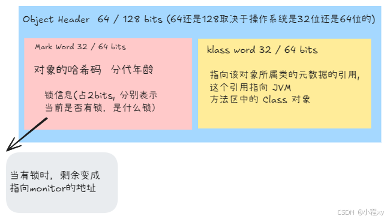

#### 3.2 重量级锁 monitor

每个对象都有一个与之关联的 Monitor。当线程进入 synchronized 同步代码块时，它会尝试获取该对象的 Monitor 锁，只有获取到锁的线程才能执行同步代码块。

当一个线程执行完 synchronized 代码块后，会释放锁，owner 不再指向该线程。如果阻塞队列中有线程等待锁，则会唤醒其中一个线程。没有线程等待时，markWord 不再表示锁信息，会恢复为原始的哈希码和 GC 分代年龄等信息。
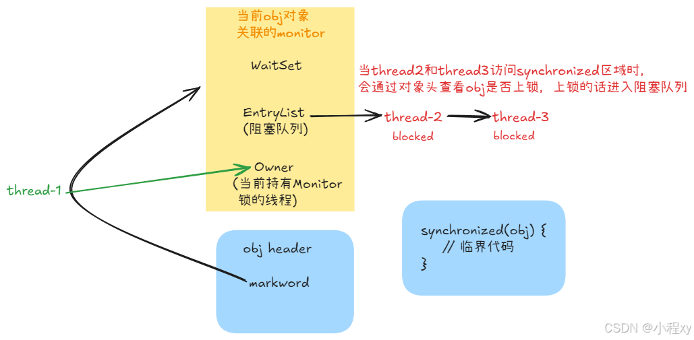
如果 synchronized 代码块出现了异常，jvm 也会自动释放该锁，避免其他线程一直无法获取到锁
下面是编译后的 .class 二进制文件，我们通过 `javap -c Main.class` 反编译弄成可读性更强的jvm指令。观察可以看到编译后的指令确实可以在代码块出现异常时自动释放锁

```java
 public static void main(java.lang.String[]);
    Code:
       0: getstatic     #7                  // Field lock:Ljava/lang/Object;
       3: dup
       4: astore_1
       5: monitorenter		// 将obj对象的markword置为 monitor 地址，加锁
       6: getstatic     #13                 // Field cnt:I		// 执行代码块中的代码
       9: iconst_1
      10: iadd
      11: putstatic     #13                 // Field cnt:I
      14: aload_1
      15: monitorexit			// 将obj对象的markword重置，解锁
      16: goto          24		// 执行完 synchronized 代码块后跳转到 return
      19: astore_2
      20: aload_1
      21: monitorexit		// 出现异常的话，解锁
      22: aload_2
      23: athrow
      24: return
    Exception table:		// 监控代码块中是否出现异常
       from    to  target type
           6    16    19   any	// 从 6 到 16，出现异常的会 跳到 19
          19    22    19   any
```


#### 3.3 轻量级锁

轻量级锁（Lightweight Lock）是针对传统的重量级锁的优化，用于减少锁竞争和避免不必要的阻塞来提高性能

##### 1. 锁的实现
Java 中的轻量级锁主要依赖于 Java 的内存模型和 CAS 操作。其核心思想是，在没有线程竞争的情况下，尽量避免使用传统的锁机制，而通过原子操作来控制共享资源的访问。具体过程如下：

###### 1.1 **锁升级过程**
轻量级锁的实现依赖于 **对象头** 中的 `Mark Word`，该对象头保存了对象的元数据和锁的状态。当一个线程要获取锁时，会通过 CAS 操作来尝试修改对象头中的 `Mark Word`，从而表示该对象被该线程持有。

- **无锁状态**：当一个对象没有被锁定时，它的 `Mark Word` 处于无锁状态，线程可以直接进入代码块而不需要阻塞。
- **轻量级锁状态**：当一个线程进入同步代码块时，首先会通过 CAS 尝试将对象的 `Mark Word` 中的状态设置为“轻量级锁状态”，如果成功，线程就持有锁。如果 CAS 操作失败，说明有其他线程已经获得了锁，线程需要进入阻塞状态。
- **重量级锁状态**：当多个线程竞争同一把锁，或者轻量级锁无法成功通过 CAS 设置时，锁会升级为重量级锁，导致线程的阻塞和上下文切换。

######  1.2 **锁的状态**

Java 对象的 `Mark Word` 存储了锁的信息，它有多个状态：
- **无锁状态**：表示对象没有被任何线程持有锁。
- **轻量级锁**：表示有一个线程持有锁，其他线程正在竞争锁时会失败。
- **重量级锁**：表示有多个线程竞争锁，导致线程被阻塞。

##### 2. 轻量级锁的工作原理
轻量级锁的工作原理可以分为以下几个步骤：
1. **尝试获取锁**：线程在进入同步代码块时，首先通过 CAS 操作尝试将对象的 `Mark Word` 状态从无锁状态改为轻量级锁状态。
   - 如果 CAS 成功，线程就能持有锁，进入同步代码块。
   - 如果 CAS 失败，说明其他线程已经获得锁，当前线程需要进行锁的自旋等待。
   
2. **自旋操作**：在获取锁失败时，线程会进入自旋状态，不断尝试使用 CAS 操作获取锁。自旋会不断检查锁的状态，直到获得锁或者达到最大自旋次数。
   - 自旋是轻量级锁的核心。它通过在等待过程中不断尝试 CAS 操作来避免线程的阻塞，从而减少上下文切换的开销。

3. **锁升级**：如果多个线程都在自旋阶段争抢同一把锁，或者自旋的次数超过了限制，轻量级锁会升级为重量级锁。此时，线程会进入阻塞状态，直到锁被释放。

4. **释放锁**：当持有锁的线程退出同步代码块时，它会释放锁，其他线程可以继续尝试获取锁。

##### 3. 锁的优化：自旋锁与CAS
轻量级锁的优化主要体现在 **自旋锁** 和 **CAS** 两个方面：

- **自旋锁**：当线程无法获取锁时，会通过自旋等待而不是进入阻塞状态。自旋会让线程不断检查锁的状态，如果锁被释放，线程会立刻尝试获取锁。
  - 自旋的好处是，如果线程竞争不激烈，获取锁的线程可能很快就能获得锁，从而避免了线程的上下文切换，减少了操作系统调度的开销。
  - 自旋锁是自适应的，比如对象刚刚的一次自旋操作成功过，那么认为这次自旋成功的可能性会高，就多自旋几次；反之，就少自旋甚至不自旋，总之，比较智能，由jvm自己控制。
  
- **CAS（Compare-And-Swap）**：CAS 是一种原子操作，用于比较内存中的值与给定值是否相等，如果相等则将其修改为新的值，否则不做任何操作。CAS 是轻量级锁的核心，它保证了在多线程并发环境下，锁的状态能够安全地修改。

#### 3.4 偏向锁

Java 中的偏向锁（Biased Locking）是 JVM 实现的一种优化锁机制，目的是减少在 **单线程** 执行情况下的同步开销。它通过“偏向”一个线程来加速锁的获取，避免在 **没有竞争** 的情况下该线程进行不必要的加锁和解锁操作。(java15之后弃用，默认情况下不开启，可通过jvm参数 `-XX:+UseBiasedLocking`手动开启(java18之后好像也不可通过jvm参数开启))
##### 1. 流程详解：

1. **初次获取锁**：
   - 当一个线程第一次访问同步方法或同步块时，它会尝试获取锁，并且在对象的 **Mark Word** 中记录这个线程的 ID，将锁标记为偏向锁。（偏向锁的实现）
   
2. **没有竞争的情况下**：
   - 如果其他线程没有争用这个锁，那么偏向锁不会进行升级，锁会一直保持偏向锁的状态，当前线程每次访问都可以绕过加锁过程。
   
3. **竞争发生**：
   - 如果在偏向锁状态下另一个线程尝试获取锁，JVM 会将偏向锁转换为轻量级锁或重量级锁，具体升级的过程如下：
     - **轻量级锁**：如果竞争不激烈，会将锁升级为轻量级锁。轻量级锁使用 CAS（Compare-And-Swap）操作来确保锁的获取和释放的高效性。
     - **重量级锁**：如果存在严重的竞争，轻量级锁会被升级为重量级锁，此时会发生线程阻塞，性能大幅下降。

批量重偏向：正常情况下，当一个线程获取了某个对象一些实例的偏向锁，另一个线程访问时，并且竞争不激烈的情况下会撤销偏向锁，升级成轻量级锁，但是如果这个撤销次数超过了一定次数(默认是20)，那么剩余的对象都会直接偏向这个线程。因为jvm认为自己偏向错了

批量撤销：当撤销偏向锁阈值超过40次后，jvm会这样觉得，自己确实偏向错了，根本就不该偏向。于是整个类的所有
对象都会变为不可偏向的，新建的对象也是不可偏向的，即使没有竞争也会直接加轻量级锁，而不是偏向锁。

#### 3.5 查看当前对象是什么锁

###### 1. 准备工作

java对象头的信息，主要观察后三位， 001表示正常无锁的变量、101表示偏向锁、00表示轻量级锁、10表示重量级锁
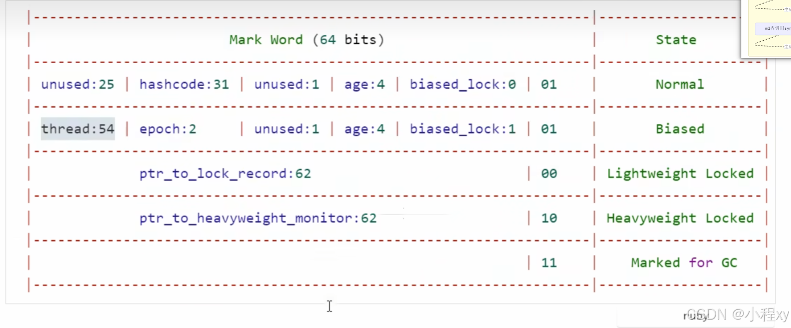
引入 jol 依赖，这个依赖可以帮我们获取header的头信息

```xml
<dependency>
    <groupId>org.openjdk.jol</groupId>
    <artifactId>jol-core</artifactId>
    <version>0.17</version>
</dependency>
```
上面依赖的方法会打印出很多多余的信息，我们对他的方法进行封装，封装后的方法可以只获取对象头markword的二进制。
```java
public static String getMarkWord(Object obj) {
    String input = ClassLayout.parseInstance(obj).toPrintable();
    Pattern pattern = Pattern.compile("0x[0-9a-fA-F]{16}");
    Matcher matcher = pattern.matcher(input);
    if (matcher.find()) {
        String hexValue = matcher.group();
        hexValue = hexValue.substring(2);
        long decimalValue = Long.parseLong(hexValue, 16);
        String binaryValue = String.format("%64s", Long.toBinaryString(decimalValue)).replace(' ', '0');  // 转换为64位二进制
        StringBuilder binaryWithSpaces = new StringBuilder();
        for (int i = 0; i < binaryValue.length(); i += 8) {
            binaryWithSpaces.append(binaryValue, i, i + 8).append(" ");
        }
        return binaryWithSpaces.toString().trim();
    } else {
        return "none";
    }
}
```

查看 obj 对象不同时期的markword。这里我的java版本是17， 在没有竞争的条件下 synchronized 上锁用的轻量级锁，但是在java8等一些老版本 创建的对象默认就是 偏向锁，并且 synchronized 在没有竞争的条件下用的也是偏向锁，java15已经弃用了偏向锁
```java
public static void main(String[] args) throws InterruptedException {
   // 创建一个对象
    Object obj = new Object();
    System.out.println(getMarkWord(obj));

    synchronized (obj) {
        System.out.println(getMarkWord(obj));
    }
    System.out.println(getMarkWord(obj));
}
// 输出
00000000 00000000 00000000 00000000 00000000 00000000 00000000 00000001	// 正常对象的markword
00000000 00000000 00000000 11101100 00000011 10011111 11110010 01100000	// 轻量级锁
00000000 00000000 00000000 00000000 00000000 00000000 00000000 00000001	// 正常对象的markword

// -XX:+UseBiasedLocking 这里我通过前面的 jvm 参数开启偏向锁, 输出结果如下
00000000 00000000 00000000 00000000 00000000 00000000 00000000 00000101	// 对象一开始就是偏向锁
00000000 00000000 00000010 11000100 01001111 00111110 00111000 00000101	// 偏向锁保存 threadid
00000000 00000000 00000010 11000100 01001111 00111110 00111000 00000101	// 即使释放了锁，也保存的是之前的threadid
```

### 4. wait 和 notify

**`wait()`** 和 **`notify()`** 是 Java 中用于线程间通信和同步的两个关键方法，属于 **Object 类** 的一部分。它们常常与 **synchronized** 关键字一起使用，用于控制多个线程在共享资源上的访问。


1. 调用 `wait()` 的线程会释放当前对象的锁，并进入一个等待队列，直到被其他线程调用 `notify()` 或 `notifyAll()` 唤醒。被唤醒后的线程会进入阻塞队列中，等当前锁可用时跟阻塞队列中的其他线程竞争锁


2. `notify()` 方法用于 **唤醒** 在该对象上等待队列中的随机一个线程。被唤醒的线程并不会立即获得锁，它需要等到当前线程释放锁后，才有机会获得锁。(被唤醒的线程是不可控的，如果要唤醒所有线程，可以使用`notifyAll()`)

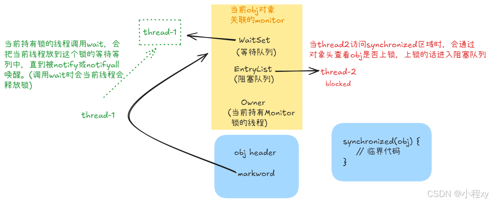

#### 4.1 示例代码

```java
private static final Logger logger = LoggerFactory.getLogger(Main.class);
public static void main(String[] args) throws InterruptedException {
    Object lock = new Object();

    Thread t1 = new Thread(() -> {
        synchronized (lock) {
            logger.info("wait 等待其他资源");
            try {
                lock.wait();	// wait 时 会释放当前的锁
            } catch (InterruptedException e) {
                throw new RuntimeException(e);
            }
            logger.info("wait结束，获取到所需资源");
        }
    });
    t1.start();

    sleep(1000);
    synchronized (lock) {
        lock.notify();
    }
}
```

**`wait()` 和 `notify()` 必须在同步块中调用**：这些方法需要在 `synchronized` 块中调用，也就是调用的线程必须获得了当前的锁才可以调用。(`wait()`也可以传入一个数字，表示最多等待的时间)

#### 4.2 `wait` 和 `sleep` 的区别

1. sleep 是Thread方法，而 wait 是Object 的方法
2. sleep 不需要强制和 synchronized 配合使用，但 wait 需要和 synchronized一起用
3. **`sleep` 在睡眠的同时，不会释放对象锁的，但`wait`在等待的时候会释放对象锁**

### 5. park 和 unpark


1. **`park()`**：使当前线程进入等待状态，直到它被其他线程唤醒。调用 `park()` 后，线程会被阻塞并放入一个等待队列，直到被其他线程调用 `unpark()` 唤醒。与 `wait()` 不同的是，`park()` 是完全由 **`LockSupport`** 控制的，它并不依赖于对象锁的持有。

2. **`unpark()`**：唤醒调用过 `park()` 的线程。`unpark()` 可以在任何线程上调用，甚至在该线程调用 `park()` 之前调用 `unpark()`，这样调用的线程就不会进入阻塞状态，直接继续执行。

#### 5.1 示例代码

```java
public class Test {
    private static final Logger logger = LoggerFactory.getLogger(Test.class);
    public static void main(String[] args) throws InterruptedException {
        Thread t1 = new Thread(() -> {
            logger.info("Thread t1 is parking...");
            LockSupport.park(); // 当前线程进入等待状态
            logger.info("Thread t1 is unparked and continues.");
        });

        t1.start();

        Thread.sleep(1000); // 等待 t1 线程进入 park 状态

        // 唤醒 t1 线程
        logger.info("Main thread unparks t1...");
        LockSupport.unpark(t1);
    }
}
```

#### 5.2 `park()` 和 `unpark()` 的特点

1. **灵活性**：`park()` 和 `unpark()` 允许线程不依赖于同步块就能进行协调和唤醒，相比于 `wait()` 和 `notify()`，它们提供了更多的灵活性。
   
2. **高效性**：`park()` 和 `unpark()` 是低级的原子操作，它们可以比 `wait()` 和 `notify()` 更加高效地处理线程之间的阻塞与唤醒，尤其适用于高性能并发程序。


3. **无条件唤醒**：`unpark()` 的调用是无条件的，即使目标线程尚未执行 `park()`，调用 `unpark()` 也会有作用。

#### 5.3 和 `wait()`、`notifu()` 的区别

- **同步机制不同**：`wait()` 依赖于对象锁和 `synchronized` 块，`park()` 则是通过 `LockSupport` 完成的，不需要任何对象锁。
- **线程唤醒控制**：`notify()` 只会唤醒等待队列中的一个线程，而 `LockSupport` 的 `unpark()` 可以直接唤醒**指定**线程，甚至在它调用 `park()` 之前。
- **线程阻塞状态**：`wait()` 会释放当前持有的锁，而 `park()` 不释放锁。

### 6. 线程活跃性

#### 6.1 死锁

**死锁** 是指在多个线程的并发执行中，因互相争夺资源而导致的一种相互等待的情况，从而使得所有线程都无法继续执行，程序进入永久阻塞状态。

##### 1. 死锁的示例代码
这里展示的是著名的哲学家问题。有5个哲学家围坐在一起，每人的左手边有一支筷子，这五个哲学家除了思考就是吃饭，吃饭的时候需要拿起左右两边的筷子才可以吃，当出现每个哲学家都拿起一只筷子时，所有哲学家都无法吃饭了，也就是陷入了死锁。
```java
public class Main {
    private static final Logger logger = LoggerFactory.getLogger(Main.class);

    static Object lock1 = new Object();
    static Object lock2 = new Object();
    static Object lock3 = new Object();
    static Object lock4 = new Object();
    static Object lock5 = new Object();

    public static void main(String[] args) throws InterruptedException {
        People name1 = new People("name1", lock1, lock2); name1.setName("t1");
        People name2 = new People("name2", lock2, lock3); name2.setName("t2");
        People name3 = new People("name3", lock3, lock4); name3.setName("t3");
        People name4 = new People("name4", lock4, lock5); name4.setName("t4");
        People name5 = new People("name5", lock5, lock1); name5.setName("t5");
        name1.start();
        name2.start();
        name3.start();
        name4.start();
        name5.start();
    }
}

class People extends Thread {
    private static final Logger logger = LoggerFactory.getLogger(Main.class);
    public String name;
    public Object left;
    public Object right;


    public People(String name, Object left, Object right) {
        this.name = name;
        this.left = left;
        this.right = right;
    }

    @Override
    public void run() {
        while (true) {
            synchronized (left) {
                synchronized (right) {
                    logger.info("People: " + name + " eat!");
                }
            }
        }
    }
}
// 输出
// 按理说会一直输出，实际输出一段时间就不会输出了，因为出现了每个线程都刚好拿到一把锁的情况
12:42:02.267 [t2] - People: name2 eat!
12:42:02.267 [t2] - People: name2 eat!
12:42:02.267 [t2] - People: name2 eat!
12:42:02.267 [t2] - People: name2 eat!
不再输出，死锁了
```

##### 2. 死锁的定位
通过 jps 命令查看当前java线程有哪些，端口号是多少，然后通过 `jstack <port>` 查看这个线程的状况，如下：（也可以使用jconsole启动图形化查看）
下面这个是上面代码输出的死锁信息
```java
Found one Java-level deadlock:
=============================
"t1":
  waiting to lock monitor 0x000002278005d200 (object 0x000000071231bf20, a java.lang.Object),
  which is held by "t2"

"t2":
  waiting to lock monitor 0x000002278005b600 (object 0x000000071231bf30, a java.lang.Object),
  which is held by "t3"

"t3":
  waiting to lock monitor 0x000002278005c860 (object 0x000000071231bf40, a java.lang.Object),
  which is held by "t4"

"t4":
  waiting to lock monitor 0x000002278005b7c0 (object 0x000000071231bf50, a java.lang.Object),
  which is held by "t5"

"t5":
  waiting to lock monitor 0x000002278005c940 (object 0x000000071231bf10, a java.lang.Object),
  which is held by "t1"
```

#### 6.2 饥饿

饥饿是指线程长时间得不到 CPU 资源的调度，导致无法进行正常的任务执行。通常是由于某些线程优先级较低，无法获得足够的资源进行工作。

##### 1. 饥饿的示例代码

代码还是上面的代码，只不过把 `People name5 = new People("name5", lock5, lock1);` 换成 `People name5 = new People("name5", lock1, lock5);`。这时代码并不会出现死锁现象，但是会出现饥饿现象，如下：


这里我在代码执行一段时间后，手动停止了，注意观察红框后面的数字，可以看到有些线程很少分配到cpu执行，比如 t1和t5只分配到10次和12次
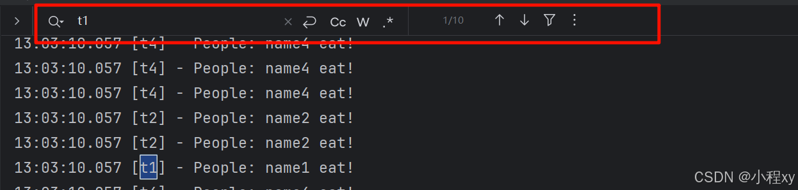

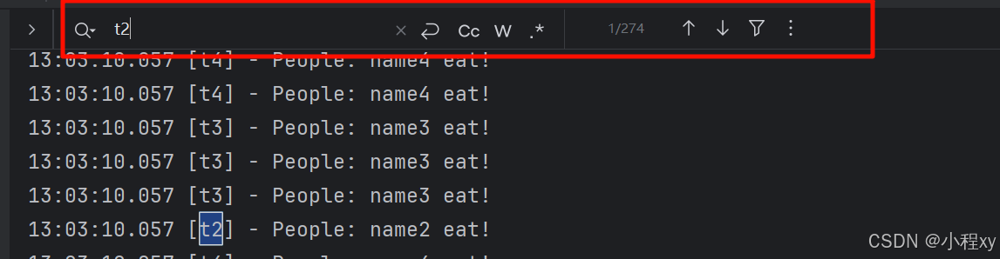


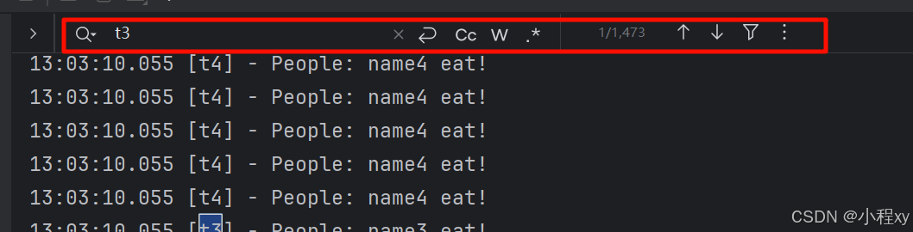

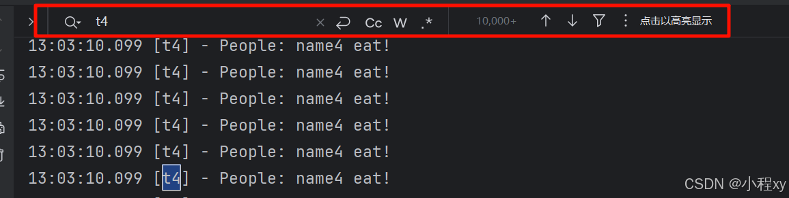


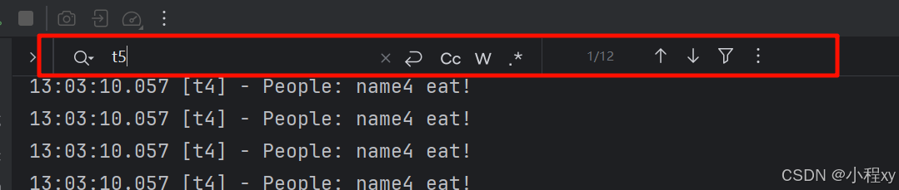


##### 2. 饥饿现象分析

先讲一下为什么这个代码不会出现死锁，因为 `People name1 = new People("name1", lock1, lock2);` 和 `People name5 = new People("name5", lock1, lock5);` ，这两个线程都是先获取 lock1，那么其中任意一个线程获取到 lock1，另外一个线程就无法获取到 lock1 和 另一个锁（lock2 或 lock5），也就是说一定不会出现5人各拿一把锁的情况。

为什么 t1 和 t5 可能会被饿死？
- 线程 t1 请求的是 lock1 和 lock2，并且 t5 需要的锁是 lock1 和 lock5。当线程 t1 获取 lock1 后，线程 t5就无法获取到 lock1，而线程 t1 也无法继续执行，直到它获取到 lock2。
- 线程 t5 请求的是 lock1 和 lock5，但它需要 lock1，而 lock1 是 t1 持有的锁。因此，t5 会一直等待 lock1，而 t1 会在等待 lock2，从而造成它们之间的相互等待，形成了一种 不公平的锁竞争。

### 7. ReentrantLock 


`ReentrantLock` 是一种比 synchronized 更加灵活和强大的锁机制，适用于需要更多控制的并发场景。但由于其手动管理的特性，它也带来了更多的复杂性。在高并发或复杂的场景下，ReentrantLock 提供了更多的功能和性能优势。

#### **7.1 主要特点：**

- **可重入性**：一个线程可以多次获取同一把锁，而不会发生死锁。例如，线程 A 如果已经获得了锁，并且在持有锁的情况下再次请求该锁，`ReentrantLock` 会允许这个线程再次成功获取锁。
- **中断响应**：如果线程在等待锁时被中断，可以通过 `ReentrantLock` 中的 `lockInterruptibly()` 方法响应中断。
- **锁超时**：`ReentrantLock` 提供了 `tryLock()` 方法，可以在一定的时间内尝试获取锁，而不会无限等待。这在避免死锁或保证不阻塞的情况下非常有用。
- **公平锁**：`ReentrantLock` 可以通过构造函数传入 `true` 打开公平锁。公平锁意味着所有线程会按照请求锁的顺序来获取锁。但会影响吞吐量
- **条件变量**：`ReentrantLock` 具有 `Condition` 对象，类似于 `Object` 类中的 `wait()` 和 `notify()` 方法。不过 condition 可以把等待线程放到不同的等待队列，而Object的wait只能往一个等待队列存放

#### **7.2 验证特点：**

##### **1. 可重入：**
可以看到 main 线程两次获取了 reentrantLock 锁
```java
public class Main {
    public static Logger log = LoggerFactory.getLogger(Main.class);
    public static ReentrantLock reentrantLock = new ReentrantLock();
    public static void main(String[] args) {
        test1();
    }

    public static void test1() {
        reentrantLock.lock();
        log.info("第一次对 reentrantLock 上锁");
        test2();	// 调用test2时当前线程还没有释放锁
        reentrantLock.unlock();
        log.info("释放第一次上的锁");
    }

    public static void test2() {
        reentrantLock.lock();	// 允许当前线程再次上锁
        log.info("第二次对 reentrantLock 上锁");
        reentrantLock.unlock();
        log.info("释放第二次上的锁");
    }
}
```
##### **2. 中断响应：**
通过 `t1.interrupt();` 使 `reentrantLock.lockInterruptibly();` 抛出 **InterruptedException** 异常，捕获异常后 **return**，实现打断等待
```java
public class Main {
    public static Logger log = LoggerFactory.getLogger(Main.class);
    public static ReentrantLock reentrantLock = new ReentrantLock();

    public static void main(String[] args) throws InterruptedException {
        Thread t1 = new Thread(() -> {
            try {
                reentrantLock.lockInterruptibly();	// 可打断的上锁
            } catch (InterruptedException e) {
                log.info("t1线程取消等待获取 reentrantLock锁");
                return;
            }
            log.info("t1 线程获取到 reentrantLock锁");
        }, "t1");

        log.info("主线程获取 reentrantLock锁");
        reentrantLock.lock();

        t1.start();
        sleep(1000);
        t1.interrupt();	// 打断
    }
}
// 输出
16:01:36.822 [main] - 主线程获取 reentrantLock锁
16:01:37.837 [t1] - t1线程取消等待获取 reentrantLock锁
```

##### **3. 锁超时：**
1. 立即尝试获取锁，不会阻塞。

main线程获取reentrantLock 锁，1秒后释放，t1线程尝试获取锁失败
```java
public class Main {
    public static Logger log = LoggerFactory.getLogger(Main.class);
    public static ReentrantLock reentrantLock = new ReentrantLock();

    public static void main(String[] args) throws InterruptedException {
        Thread t1 = new Thread(() -> {

            boolean tryLock = reentrantLock.tryLock();	// 立刻尝试获取锁，成功为true，失败false
            if (!tryLock) {
                log.info("t1 线程尝试获取reentrantLock锁失败");
                return;
            }
            log.info("t1 线程获取到 reentrantLock锁");
        }, "t1");

        log.info("主线程获取 reentrantLock锁");
        reentrantLock.lock();

        t1.start();
        sleep(1000);	// 1秒后才会释放锁，所以t1线程获取锁失败
        reentrantLock.unlock();
    }
}
// 输出
16:12:21.505 [main] - 主线程获取 reentrantLock锁
16:12:21.506 [t1] - t1 线程尝试获取reentrantLock锁失败
```
2. 尝试获取锁最多阻塞1秒

main线程获取 reentrantLock 锁，2秒后释放，t1线程在1秒后尝试获取锁失败。（如果main线程0.5秒就释放，那么t1线程在0.5的时候就过去到了锁，而不是1秒）
```java
public class Main {
    public static Logger log = LoggerFactory.getLogger(Main.class);
    public static ReentrantLock reentrantLock = new ReentrantLock();

    public static void main(String[] args) throws InterruptedException {
        Thread t1 = new Thread(() -> {

            boolean tryLock = false;
            try {
                tryLock = reentrantLock.tryLock(1, TimeUnit.SECONDS);	// 尝试获取锁，最多阻塞1秒
            } catch (InterruptedException e) {
                log.info("1秒后，t1 线程尝试获取reentrantLock锁时被打断");
                return;
            }
            if (!tryLock) {
                log.info("1秒后，t1 线程尝试获取reentrantLock锁失败");
                return;
            }
            log.info("t1 线程获取到 reentrantLock锁");
        }, "t1");

        log.info("主线程获取 reentrantLock锁");
        reentrantLock.lock();
        t1.start();
        sleep(2000);
        reentrantLock.unlock();
    }
}
// 输出
16:22:25.663 [main] - 主线程获取 reentrantLock锁
16:22:26.169 [t1] - t1 线程获取到 reentrantLock锁
```

##### **4. 锁超时：**
与之前讲的 synchronized 的 wait 和 notify 不同，我们可以把不同线程放进不同的等待队列中
```java
ReentrantLock reentrantLock = new ReentrantLock();
Condition needCoffee = reentrantLock.newCondition();    // 创建当前锁的不同条件
Condition needJuice = reentrantLock.newCondition();

needCoffee.await(); // 将该线程发到 需要咖啡 的等待队列中
needCoffee.signal();    // 唤醒 需要咖啡 的等待队列中的随机一个线程
needCoffee.signalAll(); // 唤醒 需要咖啡 的等待队列中的所有线程
```

##### 5. 解决哲学家问题
这里我们用 ReentrantLock 的 trylock 来解决哲学家死锁问题。

```java
public class Main {
    private static final Logger logger = LoggerFactory.getLogger(Main.class);

    static ReentrantLock lock1 = new ReentrantLock();
    static ReentrantLock lock2 = new ReentrantLock();
    static ReentrantLock lock3 = new ReentrantLock();
    static ReentrantLock lock4 = new ReentrantLock();
    static ReentrantLock lock5 = new ReentrantLock();

    public static void main(String[] args) throws InterruptedException {
        People name1 = new People("name1", lock1, lock2); name1.setName("t1");
        People name2 = new People("name2", lock2, lock3); name2.setName("t2");
        People name3 = new People("name3", lock3, lock4); name3.setName("t3");
        People name4 = new People("name4", lock4, lock5); name4.setName("t4");
        People name5 = new People("name5", lock5, lock1); name5.setName("t5");
        name1.start();
        name2.start();
        name3.start();
        name4.start();
        name5.start();
    }
}

class People extends Thread {
    private static final Logger logger = LoggerFactory.getLogger(Main.class);
    public String name;
    public ReentrantLock left;
    public ReentrantLock right;


    public People(String name, ReentrantLock left, ReentrantLock right) {
        this.name = name;
        this.left = left;
        this.right = right;
    }

    @Override
    public void run() {
        while (true) {

            if (left.tryLock()) {
                try {
                    if (right.tryLock()) {
                        try {
                            logger.info("People: " + name + " eat!");
                        } finally {
                            right.unlock();
                        }
                    }
                } finally {
                    left.unlock();
                }
            }
        }
    }
}
```

#### 7.3 **`ReentrantLock` 与 `synchronized` 的区别**

| 特性             | `ReentrantLock`                                    | `synchronized`                                   |
| ---------------- | -------------------------------------------------- | ------------------------------------------------ |
| **锁的获取方式** | 显式获取和释放锁，通过 `lock()` 和 `unlock()` 控制 | 隐式锁，通过关键字自动控制锁的获取和释放         |
| **重入性**       | 支持重入锁                                         | 支持重入锁                                       |
| **可中断性**     | `lockInterruptibly()` 支持中断                     | 不支持中断，如果线程被阻塞无法响应中断           |
| **公平性**       | 可以选择公平锁和非公平锁                           | 无法指定公平性，锁是非公平的                     |
| **尝试获取锁**   | `tryLock()` 方法可以尝试获取锁，不会阻塞           | 不支持尝试获取锁，线程会阻塞直到锁可用           |
| **条件变量**     | 支持 `Condition` 对象实现线程间通信                | 通过 `wait()` 和 `notify()` 在 `Object` 类中实现 |
| **死锁检测**     | 可以通过 `tryLock()` 和超时来避免死锁              | 无法避免死锁，死锁会发生                         |
| **性能**         | 通常性能更高（特别是在高并发场景中）               | 性能较低，尤其是在高并发环境下                   |


## 四、java内存模型
Java 内存模型是 Java 语言的核心概念之一，用于描述多线程程序中共享变量的访问规则和 JVM 如何处理内存。JMM 主要解决两个核心问题：

1. **线程之间如何通信**：即一个线程的变化如何被另一个线程感知。
2. **线程之间如何同步**：即如何确保线程执行的操作是按照正确的顺序进行。

### 1. 主内存与工作内存

**主内存（Main Memory）**：所有的共享变量都存储在主内存中，各线程可以访问主内存中的变量。

**工作内存（Working Memory）**：每个线程都有自己的工作内存，线程从主内存中**读取**变量到工作内存中进行操作，然后将**修改**后的值写回主内存。工作内存是线程私有的，不同线程的工作内存无法直接访问彼此的数据。

### 2. 原子性

原子性：一个操作是不可中断的，即使在多线程环境中也不会被其它线程干扰。

在我们执行 `synchronized` 中的代码时，当前线程会获取 `lock`，执行完代码时释放 `lock`。jvm会确保 `lock` 只能有一个线程获取，其他线程获取不到时会阻塞。这样就确保了原子性。ReentrantLock 的lock也是保证了原子性
```java
public class Main {
    public static int cnt = 0;
    public static Object lock = new Object();

    public static void main(String[] args) throws InterruptedException {

        Thread t1 = new Thread(() -> {
            for (int i = 0; i < 10000; i++) {
                synchronized (lock) {
                    cnt++;
                }
            }
        });

        Thread t2 = new Thread(() -> {
            for (int i = 0; i < 10000; i++) {
                synchronized (lock) {
                    cnt --;
                }
            }
        });

        t1.start();
        t2.start();

        t1.join();
        t2.join();

        System.out.println(cnt);
    }
}
```


### 3. 可见性

可见性：当一个线程修改了变量后，其他线程能够立即看到这个修改。

#### 3.1 示例代码

下面代码因为 jmm 规定了在工作内存的线程访问主内存的数据时可能会在工作内存的该线程缓存数据，这里 f 的值可能是缓存的值就会导致 即使 f = false，也无法终止线程。
```java

public class Main {
    private static final Logger logger = LoggerFactory.getLogger(Main.class);
    public static Object lock = new Object();
    static boolean f = true;

    public static void main(String[] args) throws InterruptedException {
        new Thread(() -> {
            while (true) {
                if (!f) {
                    break;
                }
            }
        }, "t1").start();

        Thread.sleep(1000);
        f = false;	// 即使主线程修改成 false, t1线程也不会结束
    }
}
```

#### 3.2 改进代码


```java
// volatile 
public class Main {
    private static final Logger logger = LoggerFactory.getLogger(Main.class);
    public static Object lock = new Object();
    static volatile boolean f = true;	// volatile 

    public static void main(String[] args) throws InterruptedException {
        new Thread(() -> {
            while (true) {
            	// 读屏障
                if (!f) {
                    break;
                }
            }
        }).start();

        Thread.sleep(1000);
        f = false;
        // 写屏障
    }
}
```

```java
// synchronized 
public class Main {
    private static final Logger logger = LoggerFactory.getLogger(Main.class);
    public static Object lock = new Object();
    static boolean f = true;

    public static void main(String[] args) throws InterruptedException {
        new Thread(() -> {
            while (true) {
                synchronized (lock) {	// 通过 synchronized 保证可见性
                    if (!f) {
                        break;
                    }
                }
            }
        }).start();

        Thread.sleep(1000);
        f = false;
    }
}
```

#### 3.3 如何保证可见性

改进代码中的 volatile 和 synchronized 如果保证的可见性？

**`volatile`**：

被volatile修饰的变量的写指令后会加入写屏障，读指令前会加入读屏障。

写屏障（sfence）保证在该屏障之前的，对共享变量的改动，都同步到主存当中；读屏障（lfence）保证在该屏障之后，对共享变量的读取，加载的是主存中最新数据

**`synchronized`**：

当一个线程进入一个被 synchronized 修饰的代码块时，它会先获得锁（mutex），并在执行代码时修改共享变量。

当线程退出该同步代码块时，会将线程中对共享变量的修改刷新到主内存中。

同时，在另一个线程获取同一个锁时，它会从主内存中重新读取共享变量的值，而不是从本地缓存（寄存器、线程缓存等）中读取，从而保证了变量的可见性。

### 4. 有序性

有序性：程序的执行顺序按照代码的先后顺序进行。

### 5. 指令重排问题

指令重排是指 编译器 和 CPU 为了优化程序性能，对程序指令的执行顺序进行重新排列的一种行为。这种重排不会改变单线程程序的执行结果，但可能会导致多线程程序的执行出现意料之外的结果。

#### 1. 双重检查锁的错误示例

在下面示例代码中，问题出在 `instance = new Singleton();` 这一行，它可以分为以下三步：
1. 分配内存 、2. 初始化对象 、3. 将对象引用指向内存

在没有禁止指令重排的情况下，这三步可能会被 **重排** 成以下顺序：
1. 分配内存 、2. 将对象引用指向内存 、3. 初始化对象

如果发生了指令重排，另一个线程可能在对象尚未完成初始化时访问到 `instance`，导致错误。

比如两个线程，`线程1` 进入到了 `new Singleton()`，并且出现了重排，当他执行到 **2. 将对象引用指向内存** 时，`线程2` 尝试调用 `getInstance` 方法，由于此时 **instance** 已经分配内存了，不为空，所以 `线程2` 直接返回 **instance** 对象，当 `线程2` 使用 **instance** 时，`线程1` 还没有执行 **3. 初始化对象**，那么就会出现错误
```java
public class Singleton {
    private static Singleton instance;

    public static Singleton getInstance() {
    // 读屏障
        if (instance == null) {  // 第一次检查
            synchronized (Singleton.class) {
            // 读屏障
                if (instance == null) {  // 第二次检查
                    instance = new Singleton();
                    // 写屏障
                }
            }
        }
        return instance;
    }
}
```


#### 2. 改进代码

```java
public class Singleton {
    private static volatile Singleton instance;

    public static Singleton getInstance() {
        if (instance == null) {  // 第一次检查
            synchronized (Singleton.class) {
                if (instance == null) {  // 第二次检查
                    instance = new Singleton();
                }
            }
        }
        return instance;
    }
}
```

#### 3. 如何保证有序性
改进代码中的 volatile 和 synchronized 如果保证的有序性？

**`volatile`**：

被volatile修饰的变量的写指令后会加入写屏障，读指令前会加入读屏障。

写屏障会确保指令重排序时，不会将写屏障之前的代码排在写屏障之后；	读屏障会确保指令重排序时，不会将读屏障之后的代码排在读屏障之前

**`synchronized`**：

当线程进入一个 synchronized 块时，它会按照程序中指定的顺序执行，即使 JMM 允许进行指令重排，synchronized 会限制 JVM 或硬件对该代码块内部的指令重排。

退出 synchronized 块时，线程会按照指定的顺序释放锁，确保其他线程能按照正确的顺序执行。
	
## 五、无锁并发
CAS (Compare-and-Swap，比较并交换) 和原子类是并发编程中非常重要的概念，主要用于在无锁（Lock-Free）环境下实现线程安全的操作。
### 1. CAS

cas 是一种硬件级别的原子操作，用于实现**无锁**的并发控制。CAS 的核心机制是：**比较内存中的当前值 V 和预期值 A。如果相等，就将值更新为 B；否则，不做任何操作。** 比如 要更新值 a，更新值a之前要看一下a是否被修改过，如果被修改过，则此次不更新

CAS 通常依赖底层的硬件指令，对于 x86 架构，LOCK CMPXCHG 是用于 CAS 操作的底层指令。对于 ARM 架构，LDREX 和 STREX 指令用于实现 CAS。

 **Java**：Unsafe 类封装了这些底层指令，使得 Java 应用能够在高效的并发场景下执行 CAS 操作。

### 2. Java 中的原子类

原子类是 Java 中基于 CAS 实现的工具类，提供了对基本类型和对象的线程安全操作，位于 `java.util.concurrent.atomic` 包中。

#### 2.1 **基本原子类**

这些类操作基本数据类型。
- **`AtomicInteger`**：用于操作 `int` 类型的值。
- **`AtomicLong`**：用于操作 `long` 类型的值。
- **`AtomicBoolean`**：用于操作 `boolean` 类型的值。

使用示例（以 `AtomicInteger` 为例）：
sum = 100000000，创建 10000 个线程，每个线程让sum减去 10000，最后输出正确值0。Test1 类是正常无锁，无法保证原子性，最后输出不是0，Test2 类是使用 `AtomicInteger` 保证原子性，最后输出正确结果0

```java
public class Main {
    private static final Logger logger = LoggerFactory.getLogger(Main.class);

    public static  void main(String[] args) throws InterruptedException {
        Test t1 = new Test1(100000000);
        Test.increasing(t1);

        Test t2 = new Test2(new AtomicInteger(100000000));
        Test.increasing(t2);
    }
}

class Test2 implements Test {
    private AtomicInteger sum;	// 原子类

    public Test2(AtomicInteger sum) {
        this.sum = sum;
    }

    @Override
    public void sub(int num) {
        while (true) {
            int pre = sum.get();
            int next = pre - num;
            // 比较并且交换，如果修改成功退出循环，失败继续循环
            if (sum.compareAndSet(pre, next)) {		// 可以保证原子性
                break;							
            };
        }
    }

    @Override
    public int getSum() {
        return sum.get();
    }
}

class Test1 implements Test {
    private int sum = 0;

    public Test1(Integer sum) {
        this.sum = sum;
    }

    @Override
    public int getSum() {
        return sum;
    }

    @Override
    public void sub(int num) {
        sum -= num;
    }
}

interface Test {
    Logger log = LoggerFactory.getLogger(Test.class);

    void sub(int num);

    int getSum();

    static void increasing(Test test) {
        List<Thread> ts = new ArrayList<>();
        for (int i = 0; i < 10000; i++) {
            ts.add(new Thread(() -> {
                test.sub(10000);
            }));
        }
        long start = System.nanoTime();
        ts.forEach(Thread::start);
        ts.forEach(t -> {
            try {
                t.join();
            } catch (InterruptedException e) {
                throw new RuntimeException(e);
            }
        });
        log.info("sum = {}, {} ms",test.getSum(),(System.nanoTime() - start) / 1000000);
    }
}
```

**常用方法：**

```java
// 与 compareAndSet() 不同， 下面这些方法不需要写在 while(true) 循环中, 他们内部封装的有 while 循环
System.out.println(i.incrementAndGet());    // ++i  输出 1
System.out.println(i.getAndIncrement());    // i++  输出 1

System.out.println(i.get());    // 2

System.out.println(i.addAndGet(5));     // 7
System.out.println(i.getAndAdd(10));    // 7
System.out.println(i.addAndGet(-10));   // 7

System.out.println(i.get());    // 7

// updateAndGet接受的是一个IntUnaryOperator类的对象，而IntUnaryOperator是一个只包含一个抽象方法的接口，可以用lambda
System.out.println(i.updateAndGet(value -> value * 2));  // 14
````

一般 **`compareAndSet`** 都要跟 while 循环配合使用，下面示例中会省略了 while

#### 2.2 **引用原子类**

这些类操作对象引用或带有标记的引用。
- **`AtomicReference<T>`**：用于对引用类型的变量进行原子操作。
- **`AtomicStampedReference`**：带有版本号的引用，解决 ABA 问题。
- **`AtomicMarkableReference`**：带有标记的引用。


ABA 问题是在多线程环境下，某个变量的值由 A 变成 B，然后又变回 A，CAS 操作会认为这个变量没有改变，因为它只检查了当前值与预期值是否相同，而没有感知到这个值曾经发生过变化。

ABA 问题的场景
1. 假设有一个栈，线程 T1 需要弹出栈顶元素。
2. 线程 T2 在 T1 操作前，将栈顶元素从 A 修改为 B，然后又往栈顶添加一个了 A。
3. 线程 T1 通过 CAS 检查时，发现栈顶元素还是 A，以为栈顶元素没有被修改，于是操作成功。
4. 实际上，栈的状态已经被其他线程改变，可能导致逻辑错误。

**示例（`AtomicReference` ）**

```java
public static void main(String[] args) {
    AtomicReference<String> strRef = new AtomicReference<>(new String("hello"));
    String s = strRef.get();
    System.out.println(s);

    strRef.compareAndSet(s, "hello world");	// 如果 strRef值为 s, 那么修改成 hello world
    System.out.println(strRef.get());
}
// 输出
hello
hello world
```

**示例（`AtomicStampedReference` ）**

```java
public static void main(String[] args) {
    AtomicStampedReference<String> strRef = new AtomicStampedReference<>(new String("hello"), 0); // 初始化值和版本号的值
    String str = strRef.getReference();
    int stamp = strRef.getStamp();
    System.out.println(str);

    strRef.compareAndSet(str, "hello world", stamp, stamp + 1);	// 如果值是 str，并且版本号是 stamp，则修改值为 hello world, 修改版本号为 stamp + 1
    System.out.println(strRef.getReference());
}
// 输出
hello
hello world
```
**示例（`AtomicMarkableReference` ）**

```java
public static void main(String[] args) {
    AtomicMarkableReference<String> strRef = new AtomicMarkableReference<>(new String("hello"), true);
    String str = strRef.getReference();
    System.out.println(str);

    strRef.compareAndSet(str, "hello world", true, false);	// 如果值是 str，并且mark是 true，则修改值为 "hello world", mark 修改为 false
    System.out.println(strRef.getReference());
}
// 输出
hello
hello world
```

#### 2.3 **数组原子类**

对数组中的元素进行原子操作。
- **`AtomicIntegerArray`**：原子操作 `int` 类型数组。
- **`AtomicLongArray`**：原子操作 `long` 类型数组。
- **`AtomicReferenceArray`**：原子操作对象数组。

**示例（`AtomicIntegerArray`）：**
```java
public static void main(String[] args) {
    AtomicIntegerArray arrRef = new AtomicIntegerArray(10);
    for (int i = 0; i < arrRef.length(); i++) {
        arrRef.set(i, i); // 第 i 位设置成 i
    }
    System.out.println(arrRef);

    arrRef.set(0, 10);	// 下标0，设置成10
    arrRef.compareAndSet(0, 10, 20);	// 如果下标0是10，则改成20
    System.out.println(arrRef);
}
// 输出
[0, 1, 2, 3, 4, 5, 6, 7, 8, 9]
[20, 1, 2, 3, 4, 5, 6, 7, 8, 9]
```

#### 2.4 **原子更新器**

对类中的字段进行原子操作。
- **`AtomicIntegerFieldUpdater`**：原子操作 `int` 类型字段。
- **`AtomicLongFieldUpdater`**：原子操作 `long` 类型字段。
- **`AtomicReferenceFieldUpdater`**：原子操作其他类型字段。

```java
public class Main3 {
    public static void main(String[] args) {
        AtomicReferenceFieldUpdater stuName = AtomicReferenceFieldUpdater.newUpdater
                (Student.class, String.class, "name");  // 类名、属性类型、属性名

        Student stu = new Student();
        stuName.compareAndSet(stu, null, "hello");  // 要更新的实例、期望值、新值
        System.out.println(stu.getName());
    }
}

@Data
@AllArgsConstructor
@NoArgsConstructor
class Student {
    volatile String name;
}
```

#### 2.5 **累加器原子类**

适用于高并发场景下的计数器。
- **`LongAdder`**：比 `AtomicLong` 更高效的计数器。
- **`LongAccumulator`**：可以自定义累加操作。

**示例（`LongAdder`)：**
```java
public static void main(String[] args) {
    LongAdder cnt = new LongAdder();
    System.out.println(cnt);

    cnt.increment();
    System.out.println(cnt);    // 1

    cnt.add(5);
    System.out.println(cnt);    // 6
}
// 输出
0
1
6
```

## 六、JUC并发工具

### 1. 自定义线程池

```java
// Main 
public class Main {
    private static final Logger logger = LoggerFactory.getLogger(Main.class);
    public static void main(String[] args) {
        ThreadPool threadPool = new ThreadPool(10, 2, 1, TimeUnit.SECONDS);

        for (int i = 0; i < 5; i++) {
            int j = i;
            threadPool.execute(() -> {
                logger.info("{}", j);
                logger.info("任务 {} 执行完毕", j);
            });
        }
    }
}
```
```java
// ThreadPool 
public class ThreadPool {

    private static final Logger log = LoggerFactory.getLogger(ThreadPool.class);
    private BlockQueue<Runnable> taskQueue;	// 任务队列，当需要执行的任务>线程数时,进入队列

    // 当前执行的线程的集合
    private HashSet<Work> workers = new LinkedHashSet<Work>();

    // 线程池中线程数
    private int coreSize;
	
	// 超时时间
    private long timeout;
	
	// 时间单位
    private TimeUnit timeUnit;

    public ThreadPool(int capatity , int coreSize, long timeout, TimeUnit timeUnit) {
        this.taskQueue = new BlockQueue<>(capatity);
        this.coreSize = coreSize;
        this.timeout = timeout;
        this.timeUnit = timeUnit;
    }
	
	// 启动线程
    public void execute(Runnable task) {
        synchronized (workers) {
            if (workers.size() < coreSize) {	// 保证创建的线程不会超过线程池指定的线程数
                Work work = new Work(task);	// 创建一个线程
                log.info("新增 work {}", task);
                work.start();	// 让当前线程启动执行任务
                workers.add(work);
            } else {
                log.info("加入到任务队列 {}", task);	// put 方法(如果队列满了，会wait)
                taskQueue.put(task);
            }
        }
    };


    class Work extends Thread {

        private Runnable task;

        public Work(Runnable task) {
            this.task = task;
        }

        @Override
        public void run() {
            // 1) 不会空 执行任务
            // 2) 为空 从队列中取任务
            // while 循环中 当当前任务执行完后从任务队列中取任务
            while (task != null || ((task = taskQueue.poll(timeout, TimeUnit.SECONDS)) != null)) {
//            while (task != null || ((task = taskQueue.take()) != null)) {
                try {
                    log.info("执行... {}", task);
                    task.run();
                } catch (Exception e) {
                    e.printStackTrace();
                    throw new RuntimeException(e);
                } finally {
                    task = null;
                }
            }
            synchronized (workers) {
                log.info("worker 被移除 {}", this);
                workers.remove(this);
            }

        }
    }
}
```
```java
// BlockQueue
public class BlockQueue<T> {

    private int capatity;

    private Deque<T> queue;

    private ReentrantLock lock = new ReentrantLock();

    // 生产者 wait
    Condition emptySetWait = lock.newCondition();

    // 消费者 wait
    Condition fullSetWait = lock.newCondition();

    public BlockQueue(int capatity) {
        this.capatity = capatity;
        this.queue = new ArrayDeque<>(capatity);
    }
	// 带超时的取任务
    public T poll(long timeout, TimeUnit util) {
        lock.lock();
        try {
            long remaining =  util.toNanos(timeout);
            while (queue.isEmpty() && remaining > 0) {
                try {
                    remaining = fullSetWait.awaitNanos(remaining);
                } catch (InterruptedException e) {
                    e.printStackTrace();
                    throw new RuntimeException(e);
                }
            }
            if (queue.isEmpty()) {
                return null;
            }
            T item = queue.removeFirst();
            fullSetWait.signal();
            return item;
        } finally {
            lock.unlock();
        }
    }
	
	// 不带超时的取任务
    public T take() {
        lock.lock();
        try {
            while (queue.isEmpty()) {
                try {
                    emptySetWait.await();
                } catch (InterruptedException e) {
                    throw new RuntimeException(e);
                }
            }
            T item = queue.removeFirst();
            fullSetWait.signal();
            return item;
        }
         finally {
            lock.unlock();
        }
    }
	
	// 插入任务到 任务队列
    public void put(T item) {
        lock.lock();
        try {
            while (queue.size() == capatity) {
                try {
                    fullSetWait.await(); // 如果队列满了，会wait
                } catch (InterruptedException e) {
                    throw new RuntimeException(e);
                }
            }
            queue.addLast(item);
            emptySetWait.signal();
        } finally {
            lock.unlock();
        }
    }

    public int getCapatity() {
        return capatity;
    }
}
```

### 2. JUC线程池

线程池（Thread Pool）是 Java 中一种用于管理和重用线程的机制，它能够提高程序性能，减少线程创建和销毁的开销。

#### 2.1 线程池的核心组件

Java 的线程池主要是通过 `Executor` 接口来管理线程池的创建和任务提交。常见的线程池类有：
1. `ExecutorService`：提供了更丰富的线程池控制接口，如任务提交和关闭方法。 
2. `ThreadPoolExecutor`：`ExecutorService` 的具体实现类，提供了线程池的详细配置和管理。

#### 2.2 ThreadPoolExecutor 核心参数

`ThreadPoolExecutor` 是线程池的核心实现，创建时可以传入以下几个重要参数：

```java
public ThreadPoolExecutor(
    int corePoolSize,       // 核心线程池大小
    int maximumPoolSize,    // 最大线程池大小
    long keepAliveTime,     // 空闲线程存活时间
    TimeUnit unit,          // 空闲时间单位
    BlockingQueue<Runnable> workQueue,  // 任务队列
    ThreadFactory threadFactory,  // 线程工厂，用于创建新线程
    RejectedExecutionHandler handler  // 任务拒绝策略
);
```

- **corePoolSize**：核心线程池的大小，线程池在没有任务执行时，会保持核心线程数的线程运行。
- **maximumPoolSize**：最大线程池的大小，当核心线程池忙碌时，线程池会创建新的线程救急，直到达到最大线程池数。救急线程一段时间后会销毁。
- **keepAliveTime**：救急线程的最长等待时间，等待时间超过keepAliveTime会销毁
- **unit**：`keepAliveTime` 的时间单位。
- **workQueue**：用于存储待执行任务的队列。常用的队列有：
  - `ArrayBlockingQueue`：一个有界队列，按照先进先出的方式排列。
  - `LinkedBlockingQueue`：一个无界队列，可以支持大规模并发的任务。
  - `PriorityBlockingQueue`：一个支持优先级的无界队列。
  - `SynchronousQueue`：每个插入操作必须等待另一个线程的移除操作。
- **threadFactory**：线程工厂，用于定制线程的创建，可以为线程设置名称、守护线程等属性。
- **handler**：任务拒绝策略，当队列满且线程池达到最大线程数时，如何处理新的任务。常用策略包括：
  - `AbortPolicy`：默认策略，抛出异常拒绝任务。
  - `CallerRunsPolicy`：由调用线程处理该任务。
  - `DiscardPolicy`：丢弃任务，不抛出异常。
  - `DiscardOldestPolicy`：丢弃队列中最旧的任务。

#### 2.3 常用的线程池类型

Java 提供了 `Executors` 工厂类来方便地创建线程池，常用的线程池有：

- **固定大小线程池**：创建一个固定大小的线程池，核心线程数和最大线程数相同。
  
  ```java
  ExecutorService fixedThreadPool = Executors.newFixedThreadPool(10);
  ```

  适合处理负载较为均衡的任务，且线程数固定。

- **可缓存线程池**：创建一个没有上限的线程池，如果线程池中的线程空闲超过60秒，就会被回收。
队列采用了 SynchronousQueue 实现特点是，它没有容量，没有线程来取是放不进去的（一手交钱、一手交货)
  ```java
  ExecutorService cachedThreadPool = Executors.newCachedThreadPool();
  ```

  适合处理大量、较短生命周期的任务。

- **单线程池**：创建一个单线程的线程池，所有的任务会被顺序执行。

	如果是自己创建一个线程串行执行任务，任务执行失败而终止那么没有任何补救措施，而线程池还会新建
	一个线程，保证池的正常工作
	
  ```java
  ExecutorService singleThreadExecutor = Executors.newSingleThreadExecutor();
  ```

  适合需要顺序执行任务的场景。

- **定时任务线程池**：创建一个线程池，用于周期性执行任务。

  ```java
  ScheduledExecutorService scheduledExecutor = Executors.newScheduledThreadPool(5);
  ```

  适合处理需要延时或定期执行的任务。

#### 2.4 提交任务的方式

任务提交是指将待执行的任务提交给线程池，线程池会管理这些任务，并安排线程来执行这些任务。

##### 1. execute

`execute()` ：接受一个实现了 `Runnable` 接口的任务，并将任务提交给线程池执行。（没有返回值且没有异常处理的任务。）


```java
Executor executor = Executors.newFixedThreadPool(3);
executor.execute(new RunnableTask());
```

**优缺点**：
- **优点**：简单直接，适用于只关心任务的执行，而不关心结果和异常的场景。
- **缺点**：没有返回值，无法获取任务执行的结果，也无法捕获任务中的异常。

##### 2. submit

`submit()` ：接受一个实现了 `Runnable` 或 `Callable` 接口的任务，并将任务提交给线程池。（可以返回结果或者需要捕获异常的任务。）


```java
ExecutorService executor = Executors.newFixedThreadPool(3);

// 提交一个返回结果的任务
Future<Integer> future = executor.submit(new CallableTask());

// 获取任务的执行结果
try {
    Integer result = future.get(); // 阻塞，直到任务执行完成
    System.out.println("Task result: " + result);
} catch (InterruptedException | ExecutionException e) {
    e.printStackTrace();
}
```

**优缺点**：
- **优点**：可以获取任务的返回值，支持 `Callable` 接口，可以处理任务中的异常。
- **缺点**：需要额外的处理 `Future` 对象，阻塞等待任务结果。如果没有适当的超时控制，可能会导致线程等待过久。

##### 3. invokeAll

`invokeAll()` 方法用于提交一个任务集合，执行所有任务，并等待所有任务完成。（可以返回每个任务的结果，可设置超时时间）


```java
ExecutorService executor = Executors.newFixedThreadPool(3);
List<Callable<Integer>> tasks = Arrays.asList(
    new CallableTask(),
    new CallableTask(),
    new CallableTask()
);

// 提交任务并等待所有任务完成
try {
    List<Future<Integer>> results = executor.invokeAll(tasks);
    for (Future<Integer> result : results) {
        System.out.println("Task result: " + result.get());
    }
} catch (InterruptedException | ExecutionException e) {
    e.printStackTrace();
}
```

**优缺点**：
- **优点**：可以提交一组任务并等待它们全部完成，适合需要批量执行任务并获取结果的场景。
- **缺点**：所有任务必须等待其他任务完成后才返回。如果某个任务阻塞或者出错，可能会延迟整个过程。

##### 4. invokeAny

`invokeAny()` 方法用于提交一组任务，并返回第一个完成的任务的结果。如果有多个任务可以并行执行，那么 `invokeAny()` 会在第一个任务执行完成时返回该任务的结果，而其他任务会被取消执行。

- **用法**：适用于只关心第一个完成的任务结果的场景。

```java
ExecutorService executor = Executors.newFixedThreadPool(3);
List<Callable<Integer>> tasks = Arrays.asList(
    new CallableTask(),
    new CallableTask(),
    new CallableTask()
);

// 提交任务并返回第一个完成的任务结果
try {
    Integer result = executor.invokeAny(tasks);
    System.out.println("First completed task result: " + result);
} catch (InterruptedException | ExecutionException e) {
    e.printStackTrace();
}
```

**优缺点**：
- **优点**：适用于需要尽快获得一个任务结果并放弃其他任务的场景，可以提高效率。
- **缺点**：只返回第一个成功的任务结果，其他任务会被取消，无法获取其他任务的结果。

##### 5. Future 对象的作用

当使用 `submit()`、`invokeAll()` 或 `invokeAny()` 提交任务时，线程池会返回一个 `Future` 对象。`Future` 是一个用于表示异步计算结果的接口，提供了如下几个重要方法：

- **`get()`**：获取任务的执行结果。如果任务未完成，会阻塞直到任务完成并返回结果。如果任务执行过程中抛出了异常，`get()` 会抛出 `ExecutionException`。
  
  ```java
  Integer result = future.get(); // 阻塞直到任务完成
  ```

- **`cancel()`**：取消任务的执行。如果任务正在运行，取消任务会尝试停止任务的执行。需要注意，`cancel()` 不一定能立即终止任务，任务执行的具体中断方式取决于任务本身的实现。
  
  ```java
  boolean isCancelled = future.cancel(true); // 取消任务，尝试中断
  ```

- **`isDone()`**：检查任务是否已经完成，返回 `true` 表示任务已经完成，不论是正常完成还是抛出异常。
  
  ```java
  boolean done = future.isDone();
  ```

- **`isCancelled()`**：检查任务是否已被取消，返回 `true` 表示任务已经取消。

  ```java
  boolean cancelled = future.isCancelled();
  ```

#### 2.5 关闭线程池

##### 1. shutdown

`shutdown()` 调用此方法后，线程池会停止接收新的任务，但是已经提交的任务会继续执行，直到所有任务执行完毕。


```java
ExecutorService executor = Executors.newFixedThreadPool(3);
// 提交任务
executor.submit(new Task());
executor.submit(new Task());

// 正常关闭线程池
executor.shutdown();
```


##### 2. shutdownNow()

`shutdownNow()` 方法也用于关闭线程池，但它的行为与 `shutdown()` 方法不同。`shutdownNow()` 会尽量停止正在执行的任务，尝试中断正在运行的任务，并把尚未执行的任务列表返回。

```java
ExecutorService executor = Executors.newFixedThreadPool(3);
// 提交任务
executor.submit(new Task());
executor.submit(new Task());

// 尝试立即关闭线程池
List<Runnable> notExecutedTasks = executor.shutdownNow();
```


##### 3. awaitTermination()

`awaitTermination()` 方法用于等待线程池中所有任务完成。它会阻塞当前线程，直到线程池中所有任务执行完毕，或者超时。

```java
ExecutorService executor = Executors.newFixedThreadPool(3);
executor.submit(new Task());
executor.submit(new Task());

// 正常关闭线程池
executor.shutdown();

try {
    // 等待最多5秒钟，如果任务没有完成就退出
    if (!executor.awaitTermination(5, TimeUnit.SECONDS)) {
        executor.shutdownNow(); // 超时后强制关闭
    }
} catch (InterruptedException e) {
    executor.shutdownNow(); // 发生中断时强制关闭
    Thread.currentThread().interrupt();
}
```

### 3. JUC 锁和同步类

#### 3.1 AQS

AQS（**AbstractQueuedSynchronizer**）是 Java 中 `java.util.concurrent` 包中的一个核心类，它可以简化自定义同步器的实现，提供一个先进先出（FIFO）的队列来管理等待线程，并通过原子操作来控制线程之间的同步。


Java 中许多并发工具都基于 AQS 实现，比如ReentrantLock（重入锁）、Semaphore（信号量）、CountDownLatch、CyclicBarrier、ReadWriteLock。
##### 1. AQS 主要组件

1. **同步状态（state）**：
   - AQS 通过一个整型的 `state` 字段来表示同步器的状态（如锁的拥有状态、信号量的许可数量等）。同步器的状态由多个线程共同访问，因此 AQS 提供了原子方法来更新和获取该状态。

2. **等待队列（wait queue）**：
   - 当线程无法获取同步器的许可时，它会被放入一个 **FIFO 队列**（通常是一个 **双端队列**），等待其他线程释放同步状态后，唤醒自己继续执行。
   - AQS 使用 `ConditionObject` 来提供线程等待和通知的功能（与 `Object` 的 `wait()` 和 `notify()` 方法类似，但提供了更多功能）。

3. **原子操作**：
   - AQS 使用底层的原子操作（例如 `CAS` 操作）来保证状态更新的线程安全。AQS 提供了多种原子操作方法，如 `compareAndSetState()` 来确保同步状态的安全更新。

##### 2. AQS 的常用方法

AQS 提供了一些方法来管理同步状态和线程队列，包括：

- **获取同步状态**：
  - `getState()`：获取当前同步状态的值。
  
- **设置同步状态**：
  - `setState(int newState)`：设置同步状态的值。
  
- **原子修改同步状态**：
  - `compareAndSetState(int expect, int update)`：原子地将 `state` 从 `expect` 更新为 `update`，如果当前 `state` 等于 `expect`。

- **队列操作**：
  - `addWaiter(Node mode)`：将当前线程添加到等待队列中。
  - `isHeldExclusively()`：判断同步器是否已经独占地被当前线程持有。


##### 3. AQS 实现不可重入锁

```java
public class MyLock implements Lock {

    class MySync extends AbstractQueuedSynchronizer {	// 继承 aqs 

        @Override   // 获取锁
        protected boolean tryAcquire(int arg) {
            if (compareAndSetState(0, 1)) { // 设置锁的状态，0表示没有人使用锁，1有人使用
                setExclusiveOwnerThread(Thread.currentThread());    // 将owner设置成当前线程
                return true;
            }
            return false;   // 加锁失败
        }

        @Override
        protected boolean tryRelease(int arg) {
            setExclusiveOwnerThread(null);
            setState(0);
            return true;
        }

        @Override   // 是否持有锁
        protected boolean isHeldExclusively() {
            return getState() == 1;
        }

        public Condition newCondition() {
            return new ConditionObject();
        }
    }

    private MySync sync = new MySync();

    @Override   // 获取锁，不成功进入阻塞队列
    public void lock() {
        sync.acquire(1);    // AbstractQueuedSynchronizer 中的方法，用来获取锁
    }

    @Override   // 加锁，可打断
    public void lockInterruptibly() throws InterruptedException {
        sync.acquireInterruptibly(1);   // AbstractQueuedSynchronizer 的方法，获取获取可打断的锁
    }

    @Override   // 尝试加锁
    public boolean tryLock() {
        return sync.tryAcquire(1);
    }

    @Override   // 尝试加锁，带超时的
    public boolean tryLock(long time, TimeUnit unit) throws InterruptedException {
        return sync.tryAcquireNanos(1, unit.toNanos(time)); // AbstractQueuedSynchronizer 中的方法，用来尝试获取带超时的锁
    }

    @Override   // 解锁
    public void unlock() {
        sync.release(1);
    }

    @Override   // 创建条件变量
    public Condition newCondition() {
        return null;
    }
}
```

#### 3.2 ReentrantLock

ReentrantLock 是 Java 提供的一个可重入的锁。它提供了比 synchronized 更灵活的锁控制，支持可中断锁、锁的公平性控制以及条件变量，用于多线程同步。


#### 3.3 ReentrantReadWriteLock

`ReentrantReadWriteLock` 是实现了  `ReadWriteLock` 接口的读写锁，允许多个线程同时读共享资源，但写操作依旧是独占的。


**基本概念**

- **读锁（Read Lock）**：只要没有线程持有写锁，多个线程就可以并行地读取共享资源。支持条件变量和锁冲入
- **写锁（Write Lock）**：写锁是独占的，意味着在一个线程持有写锁的情况下，其他线程无法持有读锁或写锁。

也就是说，读读可以，读写和写写 不可以。 


```java
private static final Logger log = LoggerFactory.getLogger(Main.class);
public static void main(String[] args) {
    ReentrantReadWriteLock lock = new ReentrantReadWriteLock();
    ReentrantReadWriteLock.ReadLock readLock = lock.readLock();
    ReentrantReadWriteLock.WriteLock writeLock = lock.writeLock();

    new Thread(() -> {
        log.info("尝试获取读锁");
        readLock.lock();
        try {
            log.info("成功获取读锁, 开始读取");
            sleep(1000);
        } catch (InterruptedException e) {
            throw new RuntimeException(e);
        } finally {
            readLock.unlock();
            log.info("成功释放读锁");
        }
    }, "t1").start();

    new Thread(() -> {
        log.info("尝试获取写锁");
        writeLock.lock();
        try {
            log.info("成功获取写锁, 开始写入");
            sleep(1000);
        } catch (InterruptedException e) {
            throw new RuntimeException(e);
        } finally {
            writeLock.unlock();
            log.info("成功释放写锁");
        }
    }, "t1").start();
}
// 输出, 可以看到 读锁和写锁可以同时获取
14:56:32.199 [t1] - 尝试获取写锁
14:56:32.199 [t1] - 尝试获取读锁
14:56:32.200 [t1] - 成功获取写锁, 开始写入
14:56:33.211 [t1] - 成功获取读锁, 开始读取
14:56:33.211 [t1] - 成功释放写锁
14:56:34.220 [t1] - 成功释放读锁
```


**注意事项**：

> 1. 读锁不支持条件变量
> 2. 持有读锁的情况下去获取写锁，会导致写锁永久等待
> 3. 持有写锁的情况下可以获取读锁


#### 3.4 StampedLock

`StampedLock` 有三种主要模式：**写模式**、**读模式**、**乐观读模式**。与传统的锁相比，它的优势在于提高了多线程环境下的性能，特别是读操作频繁时。


**基本概念**

- 乐观读会返回一个 **戳**，当完成读操作后可以通过 `validate` 判断这个 **戳** 是否过期了。


```java
StampedLock lock = new StampedLock();
// 上乐观读锁
long stamp = lock.tryOptimisticRead();
lock.validate(stamp);	// 如果上乐观锁的读共享变量期间，共享变量没有被修改则 返回 true
// 读锁
long readLock = lock.readLock();	// 上读锁，如果有写锁，会被阻塞
lock.unlockRead(readLock);
// 写锁
long writeLock = lock.writeLock();
lock.unlockWrite(writeLock);
```


**注意事项:**

> 1. StampedLock的写锁不支持条件变量
> 2. tampedLock的写锁不支持可重入


#### 3.5 Semaphore

`Semaphore`是一个计数信号量，它维持一个计数器，表示当前允许访问共享资源的线程数。通过 `acquire()` 和 `release()` 方法来操作这个计数器。


**基本概念**

- **`acquire()`**：当一个线程调用 `acquire()` 时，它会请求获取一个许可。如果当前没有可用的许可（即计数器为 0），它会被阻塞，直到有线程释放许可。

- **`release()`**：当一个线程执行完共享资源的操作后，通过 `release()` 释放一个许可，其他等待的线程就有机会获取许可并继续执行。


```java
public class Test {
    private static final Logger log = LoggerFactory.getLogger(Main.class);
    public static void main(String[] args) {
        Semaphore semaphore = new Semaphore(3);

        for (int i = 0; i < 10; i++) {
            int j = i;
            new Thread(() -> {
                try {
                    semaphore.acquire();
                    log.info("i = " + j);
                    sleep(1000);
                } catch (InterruptedException e) {
                    throw new RuntimeException(e);
                } finally {
                    semaphore.release();
                }
            }).start();
        }
    }
}
// 输出，可以看到是三个一组输出的, 因为最多允许三个线程
13:00:19.244 [Thread-1] - i = 1
13:00:19.244 [Thread-0] - i = 0
13:00:19.244 [Thread-2] - i = 2
13:00:20.259 [Thread-3] - i = 3
13:00:20.260 [Thread-4] - i = 4
13:00:20.261 [Thread-8] - i = 8
13:00:21.270 [Thread-9] - i = 9
13:00:21.270 [Thread-7] - i = 7
13:00:21.271 [Thread-5] - i = 5
13:00:22.280 [Thread-6] - i = 6
```


#### 3.6 CountDownLatch

`CountDownLatch` 是 Java 并发包中的一个非常有用的同步工具类，它允许一个或多个线程等待其他线程执行完毕后再继续执行。


**基本概念**

`CountDownLatch` 实际上是一个计数器，它的值会在线程执行时递减，直到计数器的值变为 0。任何一个线程调用 `await()` 方法时，都会被阻塞，直到计数器变为 0。如果计数器为 0，`await()` 会立即返回，允许线程继续执行。

`CountDownLatch` 主要通过两个方法来操作：

- **`await()`**：使当前线程阻塞，直到计数器为 0。
- **`countDown()`**：使计数器递减，如果计数器已经为 0，调用 `countDown()` 不会有任何效果。


```java
private static final Logger log = LoggerFactory.getLogger(Main.class);
public static void main(String[] args) throws InterruptedException {
    CountDownLatch countDownLatch = new CountDownLatch(3);
    for (int i = 0; i < 3; i++) {
        int j = i;
        new Thread(() -> {
            log.info("starting... " + j);
            try {
                sleep(1000 * j);
            } catch (InterruptedException e) {
                throw new RuntimeException(e);
            }
            countDownLatch.countDown();
        }).start();
    }
    log.info("main 阻塞");
    countDownLatch.await();
    log.info("main start");
}
// 输出
13:27:24.276 [Thread-2] - starting... 2
13:27:24.276 [main] - main 阻塞
13:27:24.276 [Thread-1] - starting... 1
13:27:24.276 [Thread-0] - starting... 0
13:27:26.289 [main] - main start
```


#### 3.7 CyclicBarrier

`CyclicBarrier` 允许一组线程互相等待，直到所有线程都到达某个共同的同步点后，再一起继续执行。它与 `CountDownLatch` 类似，但有一个重要区别：`CyclicBarrier` 可以被重用（即在多次使用场景中有效），而 `CountDownLatch` 一旦计数器为 0 就不能重置。


**基本概念**

`CyclicBarrier` 维持一个计数器，表示等待线程的数量。每当线程调用 `await()` 方法时，它会把计数器减 1，直到所有线程都到达同步点（即计数器值为 0）。当计数器为 0 时，所有线程同时被唤醒并继续执行。

- **`await()`**：线程调用此方法后会被阻塞，计数器减一，直到所有其他线程也都调用了 `await()` 并到达同步点。此方法可以抛出 `InterruptedException` 或 `BrokenBarrierException` 异常。
- **`reset()`**：重置 `CyclicBarrier` 的计数器，使其重新回到初始状态。可以在同步点清除所有线程的等待。


```java
private static final Logger log = LoggerFactory.getLogger(Main.class);
public static void main(String[] args) throws InterruptedException {
    ExecutorService pool = Executors.newFixedThreadPool(2);
    CyclicBarrier cyclicBarrier = new CyclicBarrier(2, () -> log.info("2个线程已同步"));

    pool.submit(() -> {
        log.info("start thread 1");
        try {
            sleep(500);
            cyclicBarrier.await();
            log.info("ok thread 1");
        } catch (InterruptedException | BrokenBarrierException e) {
            throw new RuntimeException(e);
        }
    });
    pool.submit(() -> {
        log.info("start thread 2");
        try {
            sleep(2000);
            cyclicBarrier.await();
            log.info("ok thread 2");
        } catch (InterruptedException | BrokenBarrierException e) {
            throw new RuntimeException(e);
        }
    });

}
```


### 4. JUC线程安全集合类

重点介绍java.util.concurrent.\*下的线程安全集合类，可以发现它们有规律，里面包含三类关键词: Blocking、CopyOnWrite、Concurrent 

1. **Blocking** 大部分实现基于锁，并提供用来阻塞的方法 

2. **CopyOnWrite** 之类容器修改开销相对较重 

3. **Concurrent** 类型的容器 
   - 内部很多操作使用cas 优化，一般可以提供较高吞吐量 
   - 弱一致性 
     - 遍历时弱一致性，例如，当利用迭代器遍历时，如果容器发生修改，迭代器仍然可以继续进行遍 历，这时内容是旧的 
     - 求大小弱一致性，size操作未必是100%准确 


遍历时如果发生了修改，对于非安全容器来讲，使用fail-fast 机制也就是让遍历立刻失败，抛出 **ConcurrentModificationException** 不再继续遍历


#### 4.1 ConcurrentHashMap

`ConcurrentHashMap` 是一种线程安全的哈希表，采用分段锁（Segment）机制来实现高效的并发访问。它通过将数据分段存储，允许多个线程并行访问不同的段，从而提高并发性能。

- **特点**：
    - 线程安全并且支持高并发。
    - 提供了类似于普通哈希表的操作接口（`put`、`get`、`remove` 等），同时能够保证线程安全。
    - 对于大多数操作，如 `put` 和 `get`，只会锁定局部数据段而不是整个表，因此并发性能较高。
- **适用场景**：
    - 需要高并发访问，且数据修改频繁的场景，如缓存系统、共享数据结构。


#### 4.2 BlockingQueue

`BlockingQueue` 是一个用于多线程环境下的线程安全队列，它有多种实现类，常见的有 `ArrayBlockingQueue`、`LinkedBlockingQueue`、`PriorityBlockingQueue` 和 `DelayQueue`。`BlockingQueue` 提供了阻塞的 `put()` 和 `take()` 方法，可以在队列为空时等待获取数据，或在队列满时等待添加数据。	

**常用实现：**

- **`ArrayBlockingQueue`**：一个基于数组的阻塞队列，支持指定容量和可选的公平性参数。
- **`LinkedBlockingQueue`**：一个基于链表的阻塞队列，支持可选的容量设置。
- **`PriorityBlockingQueue`**：一个支持优先级的阻塞队列，队列中的元素按优先级顺序排序。
- **`DelayQueue`**：一个支持延迟元素的阻塞队列，元素的可用时间根据时间戳设置。
- **适用场景**：
  - 需要线程之间传递数据并且需要阻塞等待的场景，如生产者-消费者模式、任务调度等。

