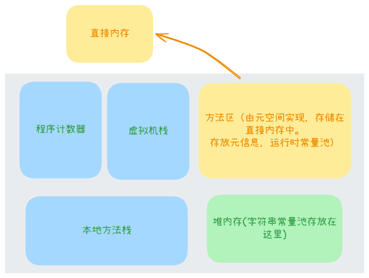

## 一、JVM 主要功能

### 1. 什么是 jvm？

**JVM（Java Virtual Machine)**是一个抽象的计算模型和运行时环境。它将 Java 字节码（.class 文件）解释或编译为机器代码，并提供内存管理、垃圾回收和线程管理等功能。是Java语言“一次编译，到处运行”（Write Once, Run Anywhere，WORA）理念的核心实现。

 

JVM由Java规范定义，但具体实现由不同的供应商提供（如Oracle的 HotSpot JVM、OpenJDK、IBM J9等）。JVM规范是标准化的蓝图，不同厂商的实现（如HotSpot、J9、Zing）在遵循规范的前提下，会有差异。

### 2. 功能

1. **加载和执行字节码**：
   - JVM 将 Java 编译器生成的字节码加载到内存中，并逐行解释或编译执行。

2. **内存管理**：
   - JVM 管理应用程序的内存，包括堆（Heap）、栈（Stack）、方法区（Method Area）等，负责对象的分配与回收。

3. **垃圾回收（Garbage Collection, GC）**：
   - 自动回收无用对象的内存，减少内存泄漏的风险。

4. **提供运行时环境**：
   - JVM 提供线程管理、异常处理、安全性检查等功能。

5. **跨平台性**：
   - Java 的“一次编写，到处运行”得益于 JVM 的实现。不同平台有各自的 JVM 实现，但字节码标准统一。


---

下面开始讲解的是 JVM 的核心组成部分，这里我用到的java版本是17，不同的java版本 jvm的实现、需要的测试工具、虚拟机参数可能有略微不同。


## 二、JVM 内存结构

JVM 的内存结构是其运行 Java 程序时管理和分配内存的重要组成部分。它将内存划分为多个区域，每个区域都有特定的用途，主要用于存储类信息、对象实例、方法执行时的数据以及线程相关信息等。

按照 **Java 虚拟机规范**，JVM 的运行时内存结构包括以下几个部分：

| **内存区域**              | **线程共享 / 独立** | **用途**                                                     |
| ------------------------- | ------------------- | ------------------------------------------------------------ |
| **程序计数器**            | 线程独立            | 用于记录当前线程执行的字节码指令地址。                       |
| **虚拟机栈（JVM Stack）** | 线程独立            | 存储方法调用的局部变量、操作数栈、动态链接和方法返回信息。   |
| **本地方法栈**            | 线程独立            | 与 JVM 栈类似，但用于执行本地方法（如 JNI 调用）。           |
| **堆（Heap）**            | 线程共享            | 存储所有对象实例和数组，是 GC（垃圾回收）的主要管理区域。    |
| **方法区（Method Area）** | 线程共享            | 存储类信息、常量池、静态变量、即时编译（JIT）后的代码等元数据信息（在 Java 8 之前称为“永久代”）。 |
| **运行时常量池**          | 线程共享            | 方法区的一部分(java8之前)，存储类和方法的符号引用及编译期生成的常量。 |

### 1. 程序计数器

Java 源码通过编译器编译成 `.class` 字节码文件，其中包含 `JVM 指令`，操作系统无法直接运行。当运行程序时，JVM 将字节码加载到内存中，通过解释器逐条将 `JVM 指令` 解释为 **机器码** 执行，或者通过 **即时编译器** 将热点代码直接编译为本地机器码以提高性能。Java支持多线程运行，线程之间通过时间片轮转实现交替执行。

程序计数器是**一块较小的内存空间**，记录当前线程正在执行的 `JVM 指令` 的偏移量，确保线程切换后可以恢复到原来的正确的执行位置。程序计数器各条线程之间计数器互不影响，独立存储。

**特点：**

1. 每个线程都有独立的程序计数器
2. 程序计数器不存在内存溢出

---


### 2. 虚拟机栈（JVM Stack）

虚拟机栈（JVM Stack） 是 Java 虚拟机为每个 **线程** 分配的私有内存空间，每个方法在调用时会创建一个栈帧（Stack Frame），然后加入到虚拟机栈中，其中栈帧存储着方法的 **局部变量表、操作数栈、动态链接和返回地址**。（生命周期和线程相同，线程结束时会自动释放对应的内存。）

1. 栈中变量：

   - 对于栈中基本数据类型的变量，会直接存储在栈内存中，而不是引用。

   - 对于栈中引用数据类型的变量，栈内存存储的是对象的引用地址，而对象的实际内容存储在堆内存中。


2. 栈和栈顶的关系

当调用方法1（栈帧1）时，栈帧1进栈，栈帧1中调用了方法2（栈帧2），栈帧2进栈，当方法2执行完后，栈帧2出战，栈帧1出栈。


---


### 3. 本地方法栈

本地方法栈是 JVM 的运行时区域之一，用于支持本地方法的执行。遵循 线程私有、按调用顺序管理栈帧的规则，同样存储方法的局部变量表、操作数栈、动态链接和返回地址，可调整栈内存大小。


### 4. 堆（Heap）

堆（Heap）是 JVM 中最重要的内存区域之一，用于存储所有 **对象实例** 和 **数组**。它是被线程共享的内存区域，堆内存受到垃圾回收器管理。

将虚拟机堆内存划分为不同的区域，如新生代，老年代，eden等只是设计风格而已，并不是所有的Java虚拟机都有的固定堆内存布局。像上面讲到的新生代、老年代等 “经典分代” 设计是 HotSpot虚拟机 的部分垃圾收集器按照这个划分来工作。

有关堆中具体的区域细分和介绍在下面垃圾收集器算法那里讲。


### 5. 方法区

**`方法区`**是各个线程共享的一块逻辑内存区域，它用于存储已经被虚拟机加载的**类型信息**、**常量**、**静态变量**、即使编译器编译后的代码缓存等数据。方法区的实现在 **Java8后** 的HotSpot虚拟机采用的是`元空间`（元空间在`本地内存`）。

在Java8之前，HotSpot虚拟机采用的是`永久代`（永久代在`堆内存`）来实现的方法区，这样HotSpot的垃圾收集器能够像管理Java堆内存一样管理这部分内存，省去了为方法区编写内存管理代码的工作。但是其他虚拟机实现方法区时不存在永久代的概念。


#### 5.1 运行时常量池和字符串常量池

**运行时常量池**：java代码编译生成的 `.class` 文件中包含`常量池`，里面存储着常量值和符号引用（指向类、方法、字段等的符号化描述）。当类加载到 JVM 内存中后就是 `运行时常量池`。

**字符串常量池**：在方法区中还包含`字符串常量池`，用于存放常量字符串，确保常量字符串在内存中只存在一份。

> 对比：运行时常量池每个加载到 JVM 内存中的类都有一个`独立的运行时常量池`，存储在元空间，与类绑定。字符串常量池JVM中`只有一份`全局的字符串常量池，存储在堆内存，所有类和线程共享。


1. 存放位置

在 Java 8 之前，运行时常量池和字符串常量池都存在与永久代，也就是堆内存中，但是Java8之后运行时常量池存在于元空间，也就是直接内存，字符串常量池存在于堆内存中，受垃圾回收器管理。

2. 梳理

我们讲到运行时常量池和字符串常量池在Java8之前都存在于永久代，而那时方法区的实现是永久代，所有运行时常量池和字符串常量池都属于方法区。但是Java8之后方法区的实现是元空间，运行时常量池存在元空间，但字符串常量池并不在元空间，所以运行时常量池属于方法区，而字符串常量池不再属于方法区了。（补充：静态变量跟随字符串常量一起从永久代移动到堆内存中）



3. 常量池

下面是通过 `javap -c -verbose Main.class` 查看到的 Main.class 的常量池，当 `.class` 加载到内存时 `#1...` 会变成实际在内存中的地址，为运行时常量池。


#### 5.2 字符串常量池的工作机制

1. **字符串池（String Intern Pool）**：
   
   - 当创建字符串 **常量**（例如 `String str = "hello";`）时，JVM 会先检查**字符串常量池**中是否已有值为 `"hello"` 的字符串，**确保相同内容的字符串常量在 JVM 内存中只有一份。**
     - 如果有，则直接返回池中字符串的引用。
     - 如果没有，则将 `"hello"` 添加到字符串池中。
   
2. **动态插入**：
   
   - 如果在运行时调用了 `String.intern()` 方法，也可以将动态生成的字符串放入字符串池。例如：
     ```java
     String str = new String("hello").intern();
     ```
     - 如果 `"hello"` 不在字符串池中，它会被加入，并返回字符串池中的引用。
     - 如果已经存在，`intern()` 返回池中的引用。

#### 5.3 常量字符串的拼接相关问题。

```java
public class Main {
    public static void main(String[] args) {
        String s1 = "a";
        String s2 = "b";
        String s3 = "ab";
        String s4 = s1 + s2;
        String s5 = "ab";
        String s6 = "a" + "b";

        System.out.println(s4 == s3);
        System.out.println(s5 == s3);
        System.out.println(s6 == s3);
    }
}
```
下图是上面代码编译后的 .class 文件，可以通过 `javap -c -verbose Main.class` 查看。

其中 ldc 是 Load Constant（加载常量）的意思，只有当程序用到对应的字符串，常量池 和 StringTable才会记录并缓存字符串的引用，同时Stringtable确保记录中字符串不会重复。（比如当程序执行到 `s2 = "b"` 的时候，后面的 `"ab"` 不会被记录）

下面是常量池，其中也存储了变量对应的值

代码中的 `String s4 = s1 + s2;`，JVM 根据运行时上下文选择最优的拼接方式（例如使用 StringBuilder、StringConcatHelper 等，java9之前用的都是 `StringBuilder`。不论用的哪个，返回的都是一个崭新的对象，而不是之前 运行时常量池中 的引用。而 s5 和 s6 返回的都是 运行时常量池中 对象的引用。（不只是字符串，任何对象都是，只不过字符串多了一个StringTable）

所以上面代码最后输出的是：（s4的地址跟s3不同，s5跟s3的相同，s6跟s3的相同(s6 jvm回去常量池看是否有"ab")）
```
false
true
true
```
下面是两个案例，动态讲字符串插入StringTable。
```java
public static void main(String[] args) {
    String s = new String("a") + new String("b");	// a, b常量自动记录在StringTable， ab 不会
    String intern = s.intern();	// 手动插入 ab 到 StringTable，并返回StringTable中 ab 的引用

    System.out.println(intern == "ab");
    System.out.println(s == "ab");
}
// true
// true
```

```java
public static void main(String[] args) {
    String x = "ab";

    String s = new String("a") + new String("b");	// new 出来的两个变量在编译阶段是不确定的
    String intern = s.intern();

    System.out.println(intern == "ab");
    System.out.println(s == "ab");
}
// true
// false
```


#### 5.3 StringTable的性能调优

`-XX:+PrintStringTableStatistics` : 控制台输出 StringTable 的细节内容

`-XX:StringTableSize=<size>`：控制 StringTable 哈希表的桶数（默认值为 60013）。可以适当增大这个桶数的值，减少哈希冲突

`-Xms512m` 和 `-Xmx2g`: 控制初始堆内存大小或最大堆内存大小，减小在堆内存不足的时候，垃圾回收机制堆StringTbale的影响


### 6. 直接内存

Java 中的直接内存（Direct Memory）是一种 JVM 外的内存，与堆不同。直接内存是**通过操作系统分配的**内存，用于提高 I/O 性能，特别是在需要频繁进行大数据块的读写时，直接内存可以减少数据在 JVM 内存与操作系统内存之间的拷贝，从而提升性能。（直接内存并不是《Java虚拟机规范》中定义的内存区域）


## 三、JVM 垃圾收集

垃圾收集器（GC）的**主要职责**是管理堆内存（Heap），回收不再使用的对象，释放堆空间。Java 中的垃圾回收机制由 JVM 自动管理，无需手动释放内存，减少了内存泄漏和内存管理的难题。

这里之所以说是 “主要职责是管理堆内存”，是因为GC也会管理方法区，而方法区的实现在Java8之后是元空间，元空间存在于直接内存。下面主要讲解的还是对于堆内存的收集。


### 1. 如何判断对象是否可回收

#### 1.1 引用计数法（Reference Counting）

引用计数法是通过维护每个对象的 引用计数来判断对象是否可回收。每当有一个引用指向该对象时，**计数器就增加**；每当引用失效（即引用不再指向该对象）时，**计数器就减少**。如果一个对象的 **引用计数为零**，说明该对象不再被任何地方引用，可以被垃圾回收。

> 然而，这种方法有一个显著的缺点，就是无法处理 **循环引用** 的问题。比如，两个对象互相引用对方，即使它们都没有被其他对象引用，引用计数也不为零，导致无法被回收。

#### 1.2 可达性分析法（Reachability Analysis）

目前，JVM 主流的垃圾回收器（如 **HotSpot**）都采用了 **可达性分析法** 来判断对象是否可回收。这个方法比引用计数法更为灵活和准确，能够解决循环引用的问题。

1. **`可达性分析法的工作原理`**

   - **根节点（GC Roots）**：首先，JVM 会从 **一组** 特殊的根节点开始。
- **可达性分析**：通过遍历从 GC Roots 出发的引用链，标记出所有可以到达的对象。


   - **不可达对象**：如果一个对象无法通过任何引用链访问到，说明该对象不再被任何活跃的线程或静态引用所引用，它就是 **不可达对象**，即为垃圾对象，可以被回收。


2. **`哪些对象可以作为 GC Roots`**
   - **栈上的局部变量**：方法的局部变量，它们是当前线程执行的过程中的一部分。
   
   - **静态字段**：类的静态字段（静态变量），即使没有任何线程持有该类的实例引用，只要静态字段指向对象，这个对象仍然是可达的。
   
   - **JNI 引用**：Java 代码通过本地方法（Native Methods）进行的引用，JNI 是 Java 与本地代码交互的桥梁。
   
   - Java虚拟机内部的引用、被同步锁持有的对象
   
   - 活跃线程（Thread）引用的对象。

#### 1.3 引用的类型

在 Java 中，对象可以通过不同的引用类型来引用。根据引用的强度，JVM 会对不同类型的引用采取不同的回收策略。常见的引用类型包括：（如果一个对象没有强引用关系，就可能被当成垃圾回收掉）
- **强引用（Strong Reference）**：普通的引用，通常是 `Object obj = new Object();`。只要存在强引用指向对象，垃圾回收器（GC）就不会回收该对象。
- **软引用（Soft Reference）**：`SoftReference<T>`，内存充足时不会回收，当内存将要溢出时，会把这些对象列入回收范围之中进行第二次回收，如果这次回收还没有足够的内存，就会抛出内存溢出的异常。
- **弱引用（Weak Reference）**：`WeakReference<T>`，无论内存是否充足，用弱引用关联的对象只会存活到下次垃圾收集发生为止。
- **虚引用（Phantom Reference）**：`PhantomReference<T>`，虚引用不会影响对象的生命周期，只能用来跟踪对象被垃圾回收的过程。虚引用所指向的对象已被垃圾回收，但还未从内存中移除时，虚引用会被加入到一个 **引用队列** 中，开发者可以在此队列中处理对象回收后的后续工作。


### 2. 垃圾收集算法

**`Stop-The-World（STW）`** ：垃圾收集器（GC）清理内存时暂停所有应用程序线程的情况。接下来文章都采用缩写形式 `STW`，来表示 `Stop-The-World`。

#### 2.1 标记-清除算法（Mark-Sweep）

- **标记阶段**：通过可达性分析遍历堆中的所有对象，标记那些可达的对象（即仍然被引用的对象）。
- **清除阶段**：清除所有未被标记的对象。

缺点：标记-清除算法回收的内存区域可能是非连续的，导致**内存碎片化**。

#### 2.2 标记-复制算法（Copying）

将可用内存按照容量划分为大小相同的两块，每次只是用其中的一块。当其中一块用完后，就将还存活着的对象复制到另一块上面，再把已使用的那块内存一次性清理掉。

优点：非常高效，垃圾回收过程只需要一次标记和复制操作；内存碎片问题被避免，因为回收后的内存是连续的。

缺点：将可用内存缩小为了原来的一般。

#### 2.3 标记-整理算法（Mark-Compact）

- **标记阶段**：与标记-清除算法相同，通过可达性分析遍历堆中的所有对象，标记那些可达的对象。
- **整理阶段**：标记完成后，整理存活的对象，移动它们到堆的一侧，确保内存空间是连续的。

优点：避免了内存碎片的问题，因为整理阶段将所有存活的对象移到内存的一侧。

缺点：移动对象需要额外的计算和内存拷贝操作，Stop-The-World 时间较长。


### 3. 分代收集理论

当前商业虚拟机的垃圾收集器，大多数都遵循着 “分代收集” 的理论进行设计。

- **弱分带假说**：绝大多数对象都是朝生夕灭的。
- **强分带假说**：熬过越多次垃圾收集过程的对象就越难以消亡。

如果一个区域中大多数对象都是朝生夕灭，难以熬过垃圾收集过程的话，那么把他们集中在一起，每次回收时只关注如何保留少量存活而不是区标记大量将要被回收的对象，就能以较低代价回收到大量的空间。

如果剩下的都是难以消亡的对象，那么把他们集中放在一起，虚拟机便可以使用较低的频率回收这个区域，这就同时兼顾了垃圾收集器的时间开销和内存的空间有效利用。


### 4. 分代垃圾收集

#### 4.1 堆内存的划分

为了遵循分代垃圾收集理论，HotSpot 虚拟机将堆划分为不同的部分。

##### 1. 新生代（Young Generation）

- **新生代** 主要存放短生命周期的对象。大多数对象在创建后很快会变得不可达，因此新生代的回收频繁且较为高效。
- 新生代通常分为 **Eden 区** 和两个 **Survivor 区**：
  - **Eden 区**：对象在创建时，首先分配在 Eden 区。
  - **Survivor 区**：包含两个区 From 和 To 区，其中一个同样最为对象创建的区域，另一个区域用来存放经过新生代回收后存活下来的对象，两个区交替使用。

##### 2. 老年代（Old Generation）

- **老年代** 存放生命周期较长的对象或者是大对象。随着对象的生命周期增加，它们会被从新生代移动到老年代。老年代的回收不如新生代频繁，但回收时间更长。
- 对象从新生代移到老年代的规则与对象存活的次数（**晋升**）相关。


#### 4.2 分代垃圾回收的命名

下面是遵循分代垃圾收集理论，对堆内存不同区域垃圾回收的命名。

##### 1. 新生代回收（Minor GC）

- **Minor GC** 发生在**新生代**，当 Eden 区满时，JVM 会进行一次垃圾回收。
- 在 Minor GC 时，用户线程暂停，JVM 会清理 Eden 区和 Survivor 区中不可达的对象，存活下来的对象会被移动到 Survivor 区，若存活时间足够长，会被晋升到老年代。
- 新生代的回收频繁，但由于它的内存较小，回收时所需的时间相对较短。

##### 2. 老年代回收（Major GC）

- **Major GC** 发生在**老年代**，当老年代内存不足时，JVM 会进行 Major GC。
- 在回收过程中，JVM 会尝试清理老年代中的垃圾对象，通常会发生对象的 **压缩**（即将存活对象移动，释放连续的空间）和 **清理**。

##### 3. Full GC

- **Full GC** 是对 整个堆 的回收，包括新生代和老年代，甚至可能会涉及到方法区（或 Metaspace）等其他区域的回收。Full GC 的过程比 Major GC 更加全面，通常是因为某些条件（如老年代空间不足、Metaspace 占满等）触发。


### 5. 常见的分代垃圾收集器

JVM 提供了多种垃圾回收器，每种回收器有不同的优缺点，同时它们跟上面讲到的垃圾收集算法和理论密切相关。

常见的垃圾回收器包括：

#### 5.1 Serial GC

最古老的一个垃圾收集器，是一个**单线程**垃圾回收器，适用于单核 CPU 或低资源环境。（**可达性分析** 和 **整理内存碎片**都会出现`STW`）


> **`新生代的回收`**采用 **标记-复制算法** 算法。(标题 三 的 2 子标题下的 2.2 )

1. 先用**可达性分析**标记 
2. 将Eden区和From Survivor区中的存活对象复制到To Survivor区；如果存活对象年龄达到晋升阈值，则直接晋升到老年代
3. 最后清空Eden区和From Survivor区，然后交换From和To的角色

相当于是**标记-复制算法**中内存容量平分，但是这里是 Eden + From 为一个内存，To 为一个内存）

> **`老年代的回收`**采用 **标记-整理算法**。


#### 5.2 Parallel GC

Parallel GC 是 Serial GC 的多线程版本，设计目标是高吞吐量（Throughput），即在单位时间内完成更多的工作。它通过利用多个GC线程并行处理垃圾回收，减少单次GC的耗时，但在**可达性分析** 和 **整理内存碎片**都会出现`STW`


> **`新生代的回收`**采用 **标记-复制算法**。

> **`老年代的回收`**采用 **标记-整理算法**。


#### 5.3 **并发的可达性分析**

在讲解 **CMS 垃圾收集器**之前，我们先讲一下并发的可达性。非并发的可达性分析要求全过程都基于一个能够保障一致性的快照中才能够进行分析，这意味着必须全程冻结用户线程的运行。如果无法保证一致性会出现两种情况：

1. **原本消亡的对象错误标记为存活** 
2. **原本存活的对象错误标记为已消亡**。

这两种情况，第一种一般是可容忍的，无非就是下次垃圾收集的时候再把他回收掉，但是对于第二种是不可接受的，因为它会使程序发生错误。我们把第二种情况称之为 **对象消失**。

下面哟个三色标记法来解释满足什么条件可以在并发的情况下解决 **对象消失** 的问题。

> 白色球：表示对象尚未被垃圾收集器访问过。（标记结束，仍然为白色的对象表示不可达，会被垃圾收集器收集）

> 黑色球：表示对象已经被垃圾收集器访问过，且这个对象的所有引用都已经扫描过。（黑色是标记过的，表示可达，不会被收集。）

> 灰色球：表示对象已经被垃圾收集器访问过，但是这个对象至少存在一个引用还没有被扫描过。（正在以 灰色 对象，扫描它引用的对象）

下面三张图展示的是正常的标记过程，其中箭头表示一个对象到另一个对象的引用。


上面三个图就是正常的可达性分析标记过程，那什么条件会导致在并发可达性分析标记过程中出现对象消失呢？

这是Wilson在1994年证明过的一个理论，只有同时满足下面这两条规则，才可以导致对象消失：

1. **赋值器插入了`一条或多条`从黑色对象到白色对象的新引用**
2. **赋值器删除了`全部`从灰色对象到`该`白色对象的`直接或间接`引用 或 灰色对象原本就没有到该白色对象的直接或间接引用**

下面这张图演示一下同时满足这两个规则导致的对象消失


可以看到，白球A同时满足了上面两条规则，在并发标记结束后，按理说应该不能被回收，因为在并发标记过程中他有了一个黑色对象的引用，但是由于黑色对象是已经被收集器访问过，并且他的所有引用也被扫描过的对象，这个白球A最后并不能被标记成黑色，会被错误的垃圾收集掉，导致对象消失。

如果不满足其中一条规则，如下：白球C不满足第一条规则，最后并发标记结束因为它没有黑色球的引用，所以应该被清除，而白色恰好表示的就是应该被清除。（A、B球都会导致对象消失）


因此要**保证并发可达性分析的正确性**，我们有两种办法：

1. 第一种是破坏第一条规则：**增量更新** 方法

当黑色对象插入新的指向白色对象的引用关系时，就将这个新插入的引用记录记下来，等并发扫描结束后，再将这些记录过的引用关系中的黑色对象为根，重新扫描一次。简单来说增量更新就是，黑色对象一旦新插入了指向白色对象的引用后，在最后标记完成后，再执行一次重新标记的过程，将黑色对象变成灰色对象。

2. 第二种是破坏第二条规则：**原始快照** 方法

当灰色对象要删除指向贝瑟对象的引用关系时，就将这个要删除的引用记录下来，在并发扫描结束后，再将这些记录过的引用关系中的灰色对象为根，重新扫描一次。简单来说增量更新就是，无论灰色对象指向白色对象的引用在并发阶段删除与否，都会按照刚开始扫描那一刻的对象图快照来进行搜索。


#### 5.4 CMS（Concurrent Mark-Sweep）

CMS GC 设计目标是最小化停顿时间，通过并发技术让GC线程与应用线程同时运行。它主要针对**老年代**，而新生代通常搭配其他收集器（如ParNew）。

CMS Old 采用**标记-清除算法**，但是它实现上有所不同，主要体现在**可达性分析**和**清除不可达对象**上。正常的可达性分析中的标记 所有GC Roots 和 通过GC Roots 查找可达对象都会 `STW`。但是CMS只有在 `标记 所有 GC Roots 的时候STW`，对于 通过 GC Roots 查找可达对象采用用户线程并发执行，不会 STW，然后进行重新标记的时候 STW 一会，最后就是 并发清除了。这里采用到的就是 **`增量更新`**来确保并发的可达性分析的正确性。

1. 初始化标记
2. 并发标记
3. 重新标记
4. 并发清除


CMS收集器无法处理 **浮动垃圾**（上面并发的可达性分析时讲到的“**原本消亡的对象错误标记为存活** ”，这个垃圾被叫做浮动垃圾）。

- 因为垃圾收集线程和用户线程是**并发**的，所以不能在内存彻底或将要满时才进行垃圾收集（用户可能在收集时创建对象）。如果在CMS运行期间，给大对象分配内存时内存不足的话，会冻结用户线程的执行（STW），临时启用 Serial Old 收集器来重新进行**老年代**的垃圾收集。

- 如果老年代内存充足，但是就是无法给大对象分配内存或晋升的对象始终无法分配到合适的内存，那么会使用 Serial **提前**进行一次 Full GC（对老年代和新生代都进行垃圾收集）。为什么内存充足，还无法分配呢？其实上面也讲到了，CMS 采用的是 **标记-清除算法**，而标记清除算法会导致内存碎片化。

> 总结：CMS采用**`并发`的标记清除算法**，也会有STW，但STW的时间相对较短，而且CMS采用了多线程来完成标记清理工作。


#### 5.5 G1 GC（Garbage-First GC）

G1（Garbage-First）垃圾收集器是Java虚拟机（JVM）提供的一种现代垃圾收集器（Java9后默认的垃圾收集器），设计目标是低停顿时间和高吞吐量的平衡，特别适合大堆内存和多核处理器环境。我们可以通过设置期望的停顿时间，G1回收器会在你期望的停顿时间里优先回收垃圾最多的区域

与之前的垃圾收集器不同，G1 将堆划分为多个大小相等的 Region（默认2048个，大小范围为1MB到32MB，由堆大小动态调整）。每个Region可以是：**Eden**、**Survivor**、**Old**、**Humongous**（存放超大对象，超过region一半大的）、**Free**（空闲区域，尚未分配角色）。

G1 的回收分为 Minor GC（新生代回收） 和 Mixed GC（混合回收），并在必要时触发 Full GC。

1. **新生代回收**采用 **标记-复制算法**，将存活对象复制到新的 Survivor Region 或晋升到 Old Region，清空原 Eden 和 Survivor Region。新生代回收是多线程的，但并不是并发的，也就是说他的可达性分析和复制都需要STW。

2. **并发标记**：这里的并发标记是独立于新生代和混合回收的，当老年代的内存不足时，在进行新生代回收 的 STW 时，G1会扫描所有的GC Roots ，然后在STW结束后，并发的执行可达性分析，同时采用 **原始快照** （在5.3时有讲过）的方法避免**对象消失**。

3. **混合回收**采用 **标记-整理算法**，并发标记后一般会直接进入混合回收，进入stw阶段，进行新生代的回收和 部分老年代的回收（新生代和老年代的回收都是基于前面并发标记的结果，其中老年代的回收只回收部分有价值的region，如果距离前面并发结果时间过长，可以重新并发标记），清除部分老年代中的无用对象，将存活的对象移动并整理堆内存，消除内存碎片。新生代回收跟上面一样，复制或者晋升。

如果新生代回收和混合回收的内存回收速度都赶不上内存分配的速度，那么G1收集器会被迫STW， 采用 Full GC（对整个堆中的垃圾回收，而不像混合回收那样，只对部分老年代的垃圾回收） 。

> G1 垃圾收集器不再是追求一次性把整个Java堆全部清理干净，比如之前的垃圾收集器不论是新生代回收还是老年代回收都是全部回收当前区域的垃圾，而G1采用了混合回收，选择追求能够应付满足应用的内存分配速度。


## 四、类文件结构

### 1. `.class` 文件的结构

Java 的 `.class` 文件是 Java 编译器将 Java 源代码（`.java` 文件）编译成字节码之后的结果文件。这个文件包含了 Java 类的结构信息、方法、字段以及其他相关的元数据。

Java 类加载器将 `.class` 文件加载到 JVM 时，JVM 会解析这些字节码并将它们转换为内存中的 `Class` 对象。


一个 `.class` 文件的内容是二进制的，且按照一定的结构组织。其基本格式包括以下几个部分：

1. **魔数（Magic Number）**：魔数是 `.class` 文件的标识符，用来区分 Java 类文件和其他类型的文件。所有合法的 `.class` 文件必须以这个魔数开头。
2. **版本号（Version）**：包含两个字节，分别表示主版本号（major version）和次版本号（minor version）。
3. **常量池（Constant Pool）**
4. **访问标志（Access Flags）**
5. **类索引（This Class）**：一个 2 字节的索引，指向常量池中的一项，该项代表当前类或接口的全限定名称（包括包名）。
6. **父类索引（Super Class）**：一个 2 字节的索引，指向常量池中的一项，该项表示父类的全限定名称。如果当前类是 `java.lang.Object`，则这个字段为 0（表示没有父类）。
7. **接口（Interfaces）**：一个 2 字节的无符号整数，表示该类或接口实现的接口的数量。接下来紧跟着对应数量的接口索引。每个接口的索引指向常量池中的接口的全限定类名。
8. **字段（Fields）**：包含类中的所有字段。
9. **方法（Methods）**：包含类中所有的方法。
10. **属性（Attributes）**：该部分存储 `.class` 文件的各种附加信息。每个属性都有一个名称和一个值。

- 常量池（Constant Pool）

	- **内容**：常量池是 `.class` 文件中最重要的部分之一。它是一个表格，存储了类中的各种常量，如字面量、方法、字段、类名等。常量池用于存储编译时已知的常量，并且在运行时访问。常量池分为两类：
	  - **字面量常量**：如字符串常量、数字常量等。
	  - **符号引用**：如类的名字、字段的名字和描述符等。

	常量池的每一项都有一个索引，索引是从 1 开始的。常量池的内容包括但不限于：
	- **类/接口的全限定名**
	- **字段的名称和描述符**
	- **方法的名称和描述符**
	- **字符串常量**

- 访问标志（Access Flags）

	- **内容**：一个短整数（2 字节），包含了类或接口的访问修饰符和其他标志。它定义了类的特性，比如是否是 public、final、abstract 等。
	- **常见标志**：
	  - `ACC_PUBLIC`：类是 public。
	  - `ACC_FINAL`：类是 final，不能被继承。
	  - `ACC_ABSTRACT`：类是抽象的。
	  - `ACC_INTERFACE`：表示这是一个接口。
	  - `ACC_SYNTHETIC`：表示类是由编译器生成的（例如匿名类）。
	  - `ACC_ENUM`：表示类是一个枚举类型。

下面是 `.class` 的二进制文件，在16进制下的显示，可以发现依然很难读懂。我们可以通过 `javap -v Main.class` 来进行反编译，通过这个指令输出的信息相比于二进制和十六进制来说会好阅读一些。


### 2. 编译器优化处理(语法糖)
语法糖的设计目的是简化开发者的代码编写工作。

**1. 自动装箱与拆箱（Autoboxing and Unboxing）**
**描述**：Java 提供了将基本类型和包装类之间自动转换的机制。

- 语法糖代码：
  ```java
  Integer num = 10;  // 自动装箱
  int value = num;   // 自动拆箱
  ```
- 底层实现：
  ```java
  Integer num = Integer.valueOf(10);  // 自动装箱
  int value = num.intValue();        // 自动拆箱
  ```


**2. 增强的 for 循环（Enhanced For Loop）**
**描述**：简化了基于迭代器的循环操作。

- 语法糖代码：
  ```java
  for (String name : names) {
      System.out.println(name);
  }
  ```
- 底层实现：
  ```java
  for (Iterator<String> iterator = names.iterator(); iterator.hasNext();) {
      String name = iterator.next();
      System.out.println(name);
  }
  ```


**3. 泛型（Generics）**
**描述**：在编译时通过类型参数检查约束代码，运行时会通过 **类型擦除** 处理。

- 语法糖代码：
  ```java
  List<String> list = new ArrayList<>();	// Object
  list.add("Hello");	// Object
  String item = list.get(0);
  ```
- 底层实现：
  ```java
  List list = new ArrayList();
  list.add("Hello");
  String item = (String) list.get(0);
  ```


**4. 字符串连接操作符 `+`**
**描述**：`+` 操作符用于连接字符串，但实际上被转换为 `StringBuilder` 的操作。

- 语法糖代码：
  ```java
  String greeting = "Hello, " + "World!";
  ```
- 底层实现：
  ```java
  String greeting = new StringBuilder("Hello, ").append("World!").toString();
  ```


**5. Try-With-Resources**
**描述**：自动管理实现了 `AutoCloseable` 接口的资源。

- 语法糖代码：
  ```java
  try (BufferedReader br = new BufferedReader(new FileReader("file.txt"))) {
      System.out.println(br.readLine());
  }
  ```
- 底层实现：
	```java
	BufferedReader br = null;
	Throwable primaryException = null; // 用于存储主异常
	
	try {
	    br = new BufferedReader(new FileReader("file.txt")); // 初始化资源
	    System.out.println(br.readLine()); // 使用资源
	} catch (Throwable t) {
	    primaryException = t; // 捕获异常（存储主异常）
	    throw t; // 继续向外抛出异常
	} finally {
	    if (br != null) {
	        if (primaryException != null) {
	            try {
	                br.close(); // 尝试关闭资源
	            } catch (Throwable closeException) {
	                primaryException.addSuppressed(closeException); // 添加关闭异常为抑制异常
	            }
	        } else {
	            br.close(); // 没有主异常时正常关闭
	        }
	    }
	}
	```

**6. Lambda 表达式**
**描述**：简化匿名内部类的写法。

- 语法糖代码：
  ```java
  Runnable r = () -> System.out.println("Hello Lambda");
  ```
- 底层实现：
  ```java
  Runnable r = new Runnable() {
      @Override
      public void run() {
          System.out.println("Hello Lambda");
      }
  };
  ```


**7. 方法引用**
**描述**：提供了对现有方法的简洁引用方式。

- 语法糖代码：
  ```java
  names.forEach(System.out::println);
  ```
- 底层实现：
  ```java
  names.forEach(name -> System.out.println(name));
  ```


**8. 匿名内部类**
**描述**：内部类自动引用外部类实例。
可以观察到，我们如果通过匿名内部类访问外面的变量，访问到的其实是外面变量的拷贝，那么外边的变量必须是final或没有发生改变的，不然会导致匿名内部类访问到的变量和外边的不可一样。

- 语法糖代码：
	```java
	class Outer {
	
	    public void createAnonymousClass() {
			private String message = "Hello from Outer Class";
	        Greeting greeting = new Greeting() {
	            @Override
	            public void sayHello() {
	                System.out.println(message);
	            }
	        };
	
	        greeting.sayHello();
	    }
	}
	```
- 底层实现：
	```java
	class Outer {
	    
	    public void createAnonymousClass() {
	   		String message = "Hello from Outer Class";
	        Greeting greeting = new Outer$1(this);
	        greeting.sayHello();
	    }
	}
	
	// 匿名内部类生成的类
	class Outer$1 implements Greeting {
	    final String message; // 隐式引用外部类
	
	    Outer$1(String message) { // 构造方法注入外部类实例
	        this.message = message;
	    }
	
	    @Override
	    public void sayHello() {
	        System.out.println(message); // 通过外部类引用访问其成员
	    }
	}
	```


**9. switch 字符串判断**

- 语法糖代码
	```java
	String day = "MON";
	switch (day) {
	    case "MON":
	        System.out.println("Monday");
	        break;
	    case "TUE":
	        System.out.println("Tuesday");
	        break;
	    case "WED":
	        System.out.println("Wednesday");
	        break;
	    default:
	        System.out.println("Other day");
	        break;
	}
	```

- 底层实现

	```java
	String day = "MON";
	int hashCode;
	switch ((hashCode = day.hashCode())) {
	    case 77199: // "MON".hashCode()
	        if (day.equals("MON")) {
	            System.out.println("Monday");
	            break;
	        }
	        break;
	    case 82874: // "TUE".hashCode()
	        if (day.equals("TUE")) {
	            System.out.println("Tuesday");
	            break;
	        }
	        break;
	    case 82731: // "WED".hashCode()
	        if (day.equals("WED")) {
	            System.out.println("Wednesday");
	            break;
	        }
	        break;
	    default:
	        System.out.println("Other day");
	        break;
	}
	```


**10. 异步编程语法糖（CompletableFuture）**
**描述**：通过链式 API 简化异步任务编写。

- 语法糖代码：
  ```java
  CompletableFuture.supplyAsync(() -> "Hello")
                   .thenApply(s -> s + ", World!")
                   .thenAccept(System.out::println);
  ```
- 底层实现：
  内部会调用线程池和回调方法链，手动实现需要较多样板代码。

**11. 可变参数（Varargs）**
**描述**：允许方法接受可变数量的参数。

- 语法糖代码：
  ```java
  public void printMessages(String... messages) {
      for (String message : messages) {
          System.out.println(message);
      }
  }
  ```
- 底层实现：
  ```java
  public void printMessages(String[] messages) {
      for (String message : messages) {
          System.out.println(message);
      }
  }
  ```


## 五、类加载机制

### 1. 类加载条件

在 Java 中，类的加载由 **类加载器**（ClassLoader）完成。类的加载是指将类的字节码文件（`.class` 文件）从文件系统或其他位置加载到 JVM 中，并创建对应的 `Class` 对象。

会触发类的加载的条件：

1. **创建类的实例**
    使用 `new` 关键字实例化一个类时，会触发该类的加载、链接和初始化。

    ```java
    MyClass obj = new MyClass();
    ```

2. **调用类的静态变量或静态方法**
访问类的静态字段或调用类的静态方法会触发类的加载。
	  ```java
	  System.out.println(MyClass.staticField);
	  MyClass.staticMethod();
	  ```

3. **使用反射**
	使用 `Class.forName()` 或其他反射方式获取类的信息时，会触发类的加载。
	
	  ```java
	  Class<?> clazz = Class.forName("com.example.MyClass");
	  ```


4. **定义子类时加载父类**
    定义一个类时，如果该类有父类，则会先加载父类。

    ```java
    class Child extends Parent {}
    ```

5. **程序的入口类**
	执行程序时指定的入口类会被加载。
	
	  ```bash
	  java MainClass
	  ```

以下情况虽然会涉及到类，但不会触发类的加载：

1. **引用类的静态常量**
如果静态字段是 `final` 修饰的常量，在编译期会被存储到调用类的常量池中，不会触发类的加载。
	  ```java
	  System.out.println(MyClass.FINAL_CONSTANT);
	  ```

2. **通过数组定义类引用**
	定义类的数组，不会触发类的加载。
	  ```java
	  MyClass[] array = new MyClass[10];
	  ```

3. **类的静态字段赋值时不涉及类本身**
	通过子类访问父类的静态字段时，只会触发父类的加载，不会触发子类的加载。
	  ```java
	  System.out.println(Parent.staticField); // 不会加载 Child
	  ```


### 2. 类加载过程

#### 2.1 加载（Loading）

加载是类加载过程的第一步，JVM 通过类加载器将类的 `.class` 文件从磁盘（或其他资源，如网络、JAR 文件等）加载到内存中。

虚拟机需要完成下面这三个事情：

1. 通过一个类的全限定名来获取定义此类的二进制字节流
2. 将这个字节流所代表的静态存储结构转化为方法区的运行时数据结构
3. 在内存中生成一个代表这个类的 Java.lang.Class 对象，作为方法去这个类的各种数据的访问入口


#### 2.2 链接（Linking）

链接阶段将类的二进制数据整合到 JVM 的运行时状态中，分为三个子阶段：

1. 验证（Verification）
   - **确保**类的字节码文件符合 JVM 的规范，没有安全风险。通常有文件格式验证、元数据验证、字节码验证、符号引用验证


2. 准备（Preparation）
   - 为类的**静态变量**分配内存并**初始化默认值**（java8之后存储在堆中，这里的默认值是指类型的默认值，比如int是0）


3. 解析（Resolution）
   - 解析阶段将类的符号引用转换为直接引用。符号引用是以字符串形式表示的类、字段或方法的引用，直接引用是指向内存中实际对象的指针。


#### 2.3 初始化（Initialization）

这是类加载的最后阶段：用来执行静态变量的显式赋值和静态代码块（`static` block）

编译器会将静态变量的显式赋值和静态代码块整合成一个 `<clinit>` 方法，并确保父类的 `<clinit>` 方法在子类的之前执行。


#### 2.4 使用（Usage）

一旦类完成初始化，JVM 可以开始使用它。如实例化对象、访问静态成员。


#### 2.5 卸载（Unloading）

当某个类不再被使用且类加载器被回收时，该类也会被卸载（释放类的元数据）。


### 3. 类加载器


类加载器是 Java 虚拟机（JVM）中的一个组件，用于将  **Java 类的字节码文件（`.class` 文件）** 加载到内存中，并将这些类转化为 JVM 可以识别的 **Class 对象**。

#### 3.1 类加载器的分类

Java 的类加载器分为以下几种，构成一个具有父子关系的双亲委派模型：

- **1. 启动类加载器（Bootstrap ClassLoader）**
	- **描述**：JVM 内置的加载器，使用 C/C++ 实现。
	- **作用**：负责加载核心类库（如 `java.lang.*`、`java.util.*`）。
	- **加载路径**：`$JAVA_HOME/lib` 或由 `-Xbootclasspath` 指定的目录。

- **2. 扩展类加载器（Extension ClassLoader）**
	- **描述**：由 Java 实现，继承自 `ClassLoader`。
	- **作用**：加载扩展类库。
	- **加载路径**：`$JAVA_HOME/lib/ext` 或由系统变量 `java.ext.dirs` 指定。

- **3. 应用程序类加载器（Application ClassLoader）**
	- **描述**：由 JVM 默认使用，继承自 `ClassLoader`。
	- **作用**：加载应用程序的类和第三方库。
	- **加载路径**：`classpath` 环境变量指定的路径。

- **4. 自定义类加载器（Custom ClassLoader）**
	- **描述**：用户可以继承 `ClassLoader` 并覆盖 `findClass` 方法来实现。
	- **作用**：实现自定义的类加载逻辑（如从数据库、加密文件加载类）。

#### 3.2 类加载器的双亲委派机制

双亲委派模型是类加载器的一种工作方式，加载类时遵循以下顺序：
1. **委托父类加载器**：每个类加载器会先把加载请求交给父加载器处理。
2. **父加载器未找到类**：如果父加载器无法加载，则当前加载器尝试加载。

优点：
- 避免重复加载类。
- 保证核心类的安全性，防止核心类被覆盖。

## 六、运行期的优化

### 1. 即时编译

```java
public static void main(String[] args) {
    for (int i = 0; i < 200; i++) {
        long st = System.nanoTime();
        for (int j = 0; j < 1000; j++) {
            new Object();
        }
        System.out.printf("%d %d\n", i, System.nanoTime() - st);
    }
}
// 0 21800
// 1 19900
// 2 19800
/// ....
// 195 5700
// 196 5500
// 197 7600
// 198 5500
// 199 5000
```

可以观察到代码执行一段时间后执行的变快了，这是由于 JIT 编译器在运行时将 热点代码（即频繁执行的字节码）编译为 本地机器码，以提高程序的运行效率。

正常字节码是由解释器逐条解释执行字节码，每次都需要进行指令解析，性能较低。
一旦将热点代码被 JIT编译器 编译为本地机器码，后续的执行就无需再解释，可以直接运行，大幅提升性能。

### 2. 方法内联

方法内联是指将一个方法调用的代码直接嵌入到调用点，而不是通过常规的调用机制（如栈操作）来执行。

- 普通调用：方法调用通常需要压栈、参数传递、跳转到目标方法执行，然后返回。
- 内联优化：直接用方法体的代码替代方法调用，省去了调用开销。

```java
public static int add(int a, int b) {
        return a + b;
    }

public static void main(String[] args) {
    int add = 0;
    for (int i = 0; i < 100; i++) {
        long l = System.nanoTime();
        for (int j = 0; j < 10000; j++) {
            add = add(10, 20);
        }
        System.out.printf("%d %d\n", i, System.nanoTime() - l);
    }
}
// 0 149300
// 1 122300
// 2 120400
// ...
// 96 17900
// 97 18600
// 98 18500
// 99 18200
```

### 3. synchronized 的优化措施

#### 3.1 锁粗化

如果一段代码中频繁进入和退出锁，会导致性能下降。 JVM 会自动将多个连续的锁操作合并为一个锁，从而减少锁的获取和释放次数。
- **例子**：
  ```java
  for (int i = 0; i < 10; i++) {
      synchronized (this) {
          // 执行一些操作
      }
  }
  ```
  JVM 会将上述代码优化为：
  ```java
  synchronized (this) {
      for (int i = 0; i < 10; i++) {
          // 执行一些操作
      }
  }
  ```

#### 3.2 **锁消除**

某些锁在编译时被证明没有线程竞争。JIT 编译器在运行时通过逃逸分析，自动移除这些无意义的锁操作。
- **例子**：
  ```java
  public void test() {
      StringBuilder sb = new StringBuilder();
      synchronized (sb) {
          sb.append("hello");
      }
  }
  ```
  - `StringBuilder` 是局部变量，不会被其他线程访问，因此锁会被消除。

#### 3.3 减少锁的粒度

如果锁的范围过大，会导致更多线程被阻塞，降低并发性能。 将大范围的锁拆分为多个小范围的锁，或使用细粒度的锁来提高并发性能。
- **例子**：
  - 粗粒度锁：
    ```java
    synchronized (this) {
        methodA();
        methodB();
    }
    ```
  - 细粒度锁：
    ```java
    synchronized (lockA) {
        methodA();
    }
    synchronized (lockB) {
        methodB();
    }
    ```