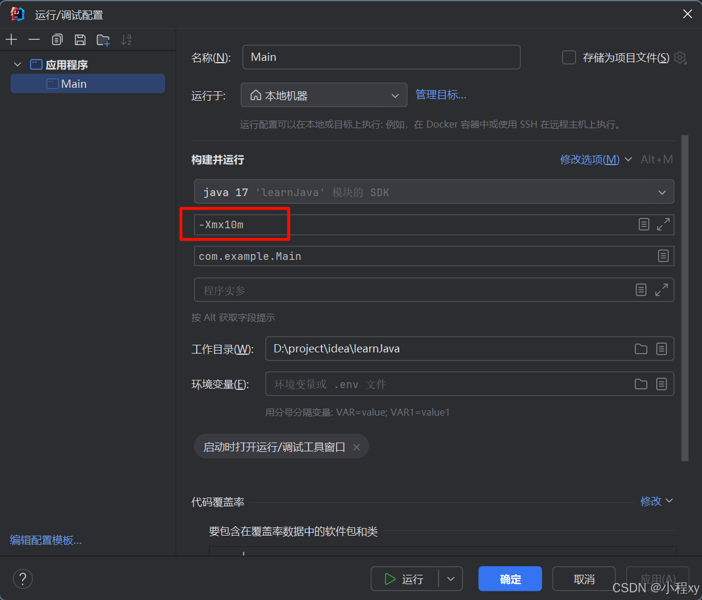
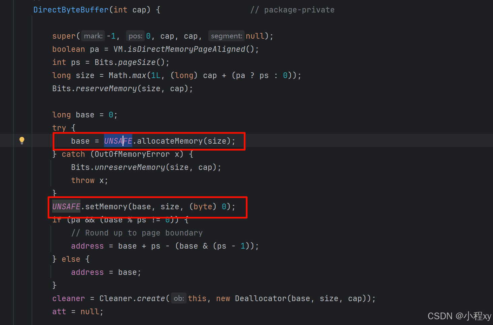

## 一、JVM 主要功能

### 1. 什么是 jvm？

**JVM（Java Virtual Machine)**：负责运行 Java 程序的核心组件。它将 Java 字节码（.class 文件）解释或编译为机器代码，并提供内存管理、垃圾回收和线程管理等功能。

**JRE (Java Runtime Environment)**：Java 运行时环境，包含运行 Java 应用程序所需的所有组件，包括 JVM 和 Java 标准库（如核心类和辅助类）。提供一个运行 Java 应用的完整环境。

**JDK (Java Development Kit)**：Java 开发工具包，是用于开发 Java 应用程序的完整工具集。它包含 JRE 和额外的开发工具，如编译器（javac）、调试器（jdb）、打包工具（jar）等。

```
JDK (开发工具 + JRE)
 |
 +-- JRE (JVM + 类库)
      |
      +-- JVM (执行 Java 字节码的核心)
```
### 2. 功能

1. **加载和执行字节码**：
   - JVM 将 Java 编译器生成的字节码加载到内存中，并逐行解释或编译执行。

2. **内存管理**：
   - JVM 管理应用程序的内存，包括堆（Heap）、栈（Stack）、方法区（Method Area）等，负责对象的分配与回收。

3. **垃圾回收（Garbage Collection, GC）**：
   - 自动回收无用对象的内存，减少内存泄漏的风险。

4. **提供运行时环境**：
   - JVM 提供线程管理、异常处理、安全性检查等功能。

5. **跨平台性**：
   - Java 的“一次编写，到处运行”得益于 JVM 的实现。不同平台有各自的 JVM 实现，但字节码标准统一。


---

下面开始讲解的是 JVM 的核心组成部分，这里我用到的java版本是17，不同的java版本 jvm的实现、需要的测试工具、虚拟机参数可能有略微不同。

## 二、JVM 内存结构

JVM 的内存结构是其运行 Java 程序时管理和分配内存的重要组成部分。它将内存划分为多个区域，每个区域都有特定的用途，主要用于存储类信息、对象实例、方法执行时的数据以及线程相关信息等。

按照 **Java 虚拟机规范**，JVM 的运行时内存结构包括以下几个部分：

| **内存区域**              | **线程共享 / 独立** | **用途**                                                     |
| ------------------------- | ------------------- | ------------------------------------------------------------ |
| **程序计数器**            | 线程独立            | 用于记录当前线程执行的字节码指令地址。                       |
| **虚拟机栈（JVM Stack）** | 线程独立            | 存储方法调用的局部变量、操作数栈、动态链接和方法返回信息。   |
| **本地方法栈**            | 线程独立            | 与 JVM 栈类似，但用于执行本地方法（如 JNI 调用）。           |
| **堆（Heap）**            | 线程共享            | 存储所有对象实例和数组，是 GC（垃圾回收）的主要管理区域。    |
| **方法区（Method Area）** | 线程共享            | 存储类信息、常量池、静态变量、即时编译（JIT）后的代码等元数据信息（在 Java 8 之前称为“永久代”）。 |
| **运行时常量池**          | 线程共享            | 方法区的一部分(java8之前)，存储类和方法的符号引用及编译期生成的常量。 |

### 1. 程序计数器

Java 源码通过编译器编译成 `.class` 字节码文件，其中包含 `JVM 指令`，操作系统无法直接运行。当运行程序时，JVM 将字节码加载到内存中，通过解释器逐条将 `JVM 指令` 解释为 **机器码** 执行，或者通过 **即时编译器** 将热点代码直接编译为本地机器码以提高性能。程序计数器记录当前线程正在执行的 `JVM 指令` 的偏移量，帮助 JVM 定位字节码指令并执行相应操作。(每个线程都有独立的程序计数器。)

**特点：**
1. 每个线程都有独立的程序计数器
2. 程序计数器不存在内存溢出

---
### 2. 虚拟机栈（JVM Stack）

虚拟机栈（JVM Stack） 是 Java 虚拟机为每个 **线程** 分配的私有内存空间，生命周期与线程相同。它主要用于管理 Java **方法** 的执行。每个方法在调用时会创建一个栈帧（Stack Frame），用于存储方法的 局部变量表、操作数栈、动态链接和返回地址。

栈中变量：
- 对于栈中基本数据类型的变量，会直接存储在栈内存中，而不是引用。
- 对于栈中引用数据类型的变量，栈内存存储的是对象的引用地址，而对象的实际内容存储在堆内存中。

#### 2.1 栈和栈顶

下面展示栈和栈帧的关系。
当调用方法1（栈帧1）时，栈帧1进栈，栈帧1中调用了方法2（栈帧2），栈帧2进栈，当方法2执行完后，栈帧2出战，栈帧1出栈。


- 每个线程运行时所需要的内存，称为虚拟机栈
- 每个栈由多个栈帧（Frame）组成，对应着每次方法调用时所占用的内存
- 每个线程只能有一个活动栈帧，对应着当前正在执行的那个方法

#### 2.2 栈大小
- 每个栈内存是有限的，可以通过 JVM 参数 -Xss 设置栈的大小。
- 如果栈的内存超过限制，会抛出 StackOverflowError。

#### 2.3 栈帧的生命周期
- 当一个方法被调用时，会自动分配内存，创建一个新的栈帧并压入当前线程的虚拟机栈顶部。
- 方法执行结束后，栈帧弹出
- 栈帧弹出时，会自动释放对应的内存。不是由垃圾回收机制回收的

---


### 3. 本地方法栈

本地方法栈是 JVM 的运行时区域之一，主要为本地方法调用提供支持，尤其是那些由 JNI 或其他机制实现的非 Java 方法。但专注于底层与操作系统交互的功能。

它和虚拟机栈类似，遵循 线程私有、按调用顺序管理栈帧的规则，同样存储方法的局部变量表、操作数栈、动态链接和返回地址，可调整栈内存大小。

#### 3.1 本地方法栈与虚拟机栈的区别

| **特性**           | **虚拟机栈**       | **本地方法栈**                  |
| ------------------ | ------------------ | ------------------------------- |
| **用途**           | 管理 Java 方法调用 | 管理本地方法调用                |
| **执行的代码类型** | Java 字节码        | 本地方法（通常是 C/C++ 实现）   |
| **是否依赖 JVM**   | 完全由 JVM 管理    | 借助 JNI 与操作系统或本地库交互 |

---

上面讲到的 程序计数器、虚拟栈、本地栈都是线程独立的，也就是每个线程都有自己对应的，是不共享的。下面讲到的堆、方法区、运行时常量池都是线程共享的，也就是所有线程公用的。

### 4. 堆（Heap）

堆（Heap）是 JVM 中最重要的内存区域之一，用于存储所有 **对象实例** 和 **数组**。它是被线程共享的内存区域，在 JVM 启动时创建，生命周期与 JVM 一致。

堆是 JVM 中存储对象的主要区域，分为年轻代和老年代两部分，负责对象生命周期管理和垃圾回收。

#### 4.1 堆的结构

现代 JVM 的堆通常分为以下区域，主要用于优化对象的生命周期管理和垃圾回收：

1. **年轻代（Young Generation）**
   - **存放内容**：新创建的对象通常会分配在年轻代。大多数对象很快变得不可达，因此年轻代的垃圾回收频率较高。
   - **进一步划分**：
     - **Eden 区**：对象最初分配的地方。（伊甸园区）
     - **Survivor 区**：存活的对象会被转移到 Survivor 区，两块 Survivor 区轮换使用（From 和 To）。（幸存区）
   - **垃圾回收算法**：采用 **复制算法**，快速清理短生命周期的对象。

2. **老年代（Old Generation 或 Tenured Generation）**
   - **存放内容**：从年轻代晋升的长期存活对象。
   - **特点**：老年代通常占用堆的大部分空间，垃圾回收频率较低，但回收成本较高。
   - **垃圾回收算法**：通常采用 **标记-清除** 或 **标记-整理** 算法。


#### 4.2 堆的内存分配

1. **对象分配**：  
   - 当一个对象通过 `new` 创建时，JVM 会首先尝试在堆的 **Eden 区** 分配空间。
   - 如果 Eden 区空间不足，则触发 Minor GC，清理 Eden 区无用对象，并将存活对象移到 Survivor 区。

2. **对象晋升**：  
   - 如果一个对象经过多次 Minor GC 仍然存活，JVM 会将其移动到老年代。

3. **大对象**：  
   - 大对象（如大型数组）直接分配到老年代，避免在年轻代的复制成本过高。

#### 4.3 堆的垃圾回收

堆是垃圾回收的主要区域，GC 会根据对象的生命周期选择不同的算法：

1. **Minor GC**（年轻代回收）：  
   - 处理年轻代的无用对象。
   - 因为年轻代对象存活率低，使用 **复制算法**。

2. **Major GC/Full GC**（老年代回收）：  
   - 处理老年代和整个堆的垃圾。
   - 回收成本较高，通常结合 **标记-清除** 和 **标记-整理** 算法。


---
### 5. 方法区 和 运行时常量池


**方法区** 方法区是JVM规范中定义的逻辑区域，描述了需要存储什么数据，在 Java 8 之后**由元空间（Metaspace）实现**（取代了JDK 7及之前版本中的“永久代”），主要用于存储类的**元信息**。（元空间使用直接内存，永久代用的堆内存）

元信息包含的内容：

   - 类的名称、父类、实现的接口。
   - 方法、字段的信息（包括名称、修饰符、类型等）。
   - 所有方法，包括普通方法、静态方法和构造方法的字节码
   - 静态变量的引用。

**运行时常量池也** 是一个存储常量的区域（堆内存），在类加载时动态地从类文件的静态常量池中加载创建。（静态常量池在把 `.java` 文件编译成 `.class` 文件时生成的）

静态常量池包含的常量类型：

- 字面量常量：例如，字符串常量、数值常量（如 100，3.14）等。
- 符号引用：例如，类名、方法名、字段名等。这些符号引用会在运行时被解析为实际的内存地址或执行位置。
- 静态常量：如 static final 字段的值，这些值会被存储在运行时常量池中。

对常量池的一些补充：运行时常量池 是为每个类单独维护的，同一个类的运行时常量池不会出现重复的常量，比如 Class A 的运行时常量池中不会存在两个数字1000。但是字符串常量例外，每个类的字符串都会存在一个字符串常量池StringTable中（也会去重）。


下面是通过 `javap -c -verbose Main.class` 查看到的 Main.class 的常量池，当 .class 加载到内存时 #1... 会变成实际在内存中的地址，为运行时常量池。


#### 5.1 StringTable

String Table 是 运行时常量池 中专门用于存储字符串常量的一个哈希表，在 Java 8 及之后，，严格意义上来说，StringTable 不再直接归属于运行时常量池，但逻辑上的关联依然存在。（StringTable会受到垃圾回收的管理）

运行时常量池（RCP） 和 StringTable 各自管理不同的资源：
- 运行时常量池仍然存储类常量、字段、方法名的符号引用。
- StringTable 只存储字符串常量。

StringTable 是一个哈希表，存储所有字符串常量，主要用于：
- 实现字符串的字符串池（String Intern Pool）机制。
- 减少重复字符串的内存开销，提高内存利用率。
- 支持字符串的唯一性特性，使同一内容的字符串只占用一份内存。

#### 5.2 StringTable 的工作机制

1. **字符串池（String Intern Pool）**：
   
   - 当创建字符串 **常量**（例如 `String str = "hello";`）时，JVM 会先检查字符串池中是否已有值为 `"hello"` 的字符串。
     - 如果有，则直接返回池中字符串的引用。
     - 如果没有，则将 `"hello"` 添加到字符串池中。
   - 字符串池确保相同内容的字符串常量在 JVM 内存中只有一份。
   
2. **动态插入**：
   - 如果在运行时调用了 `String.intern()` 方法，也可以将动态生成的字符串放入字符串池。例如：
     ```java
     String str = new String("hello").intern();
     ```
     - 如果 `"hello"` 不在字符串池中，它会被加入，并返回字符串池中的引用。
     - 如果已经存在，`intern()` 返回池中的引用。

#### 5.3 常量字符串的拼接相关问题。

```java
public class Main {
    public static void main(String[] args) {
        String s1 = "a";
        String s2 = "b";
        String s3 = "ab";
        String s4 = s1 + s2;
        String s5 = "ab";
        String s6 = "a" + "b";

        System.out.println(s4 == s3);
        System.out.println(s5 == s3);
        System.out.println(s6 == s3);
    }
}
```
下图是上面代码编译后的 .class 文件，可以通过 `javap -c -verbose Main.class` 查看。

其中 ldc 是 Load Constant（加载常量）的意思，只有当程序用到对应的字符串，常量池 和 StringTable才会记录并缓存字符串的引用，同时Stringtable确保记录中字符串不会重复。（比如当程序执行到 `s2 = "b"` 的时候，后面的 `"ab"` 不会被记录）

下面是常量池，其中也存储了变量对应的值

代码中的 `String s4 = s1 + s2;`，JVM 根据运行时上下文选择最优的拼接方式（例如使用 StringBuilder、StringConcatHelper 等，java9之前用的都是 `StringBuilder`。不论用的哪个，返回的都是一个崭新的对象，而不是之前 运行时常量池中 的引用。而 s5 和 s6 返回的都是 运行时常量池中 对象的引用。（不只是字符串，任何对象都是，只不过字符串多了一个StringTable）

所以上面代码最后输出的是：（s4的地址跟s3不同，s5跟s3的相同，s6跟s3的相同(s6 jvm回去常量池看是否有"ab")）
```
false
true
true
```
下面是两个案例，动态讲字符串插入StringTable。
```java
public static void main(String[] args) {
    String s = new String("a") + new String("b");	// a, b常量自动记录在StringTable， ab 不会
    String intern = s.intern();	// 手动插入 ab 到 StringTable，并返回StringTable中 ab 的引用

    System.out.println(intern == "ab");
    System.out.println(s == "ab");
}
// true
// true
```

```java
public static void main(String[] args) {
    String x = "ab";

    String s = new String("a") + new String("b");	// new 出来的两个变量在编译阶段是不确定的
    String intern = s.intern();

    System.out.println(intern == "ab");
    System.out.println(s == "ab");
}
// true
// false
```

一开始介绍时，我们讲 StringTable 在jvm的堆内存中（java8之后），下面验证一下。

我们给虚拟机参数设置堆内存的最大值 `-Xmx10m`，10M 内存。

执行下面代码可以看到
```java
public class Main {
    public static void main(String[] args) {
        List<String> list = new ArrayList<String>();

        try {
            for (int i = 0; i < 300000; i++) {
                list.add(String.valueOf(i));
            }
        } catch (Exception e) {
            e.printStackTrace();
            throw new RuntimeException(e);
        }
        System.out.println("ok");
    }
}
```
`outOfMemoryError Heap Space`
```java
Exception in thread "main" java.lang.OutOfMemoryError: Java heap space
	at java.base/java.lang.Integer.toString(Integer.java:456)
	at java.base/java.lang.String.valueOf(String.java:4329)
	at com.example.Main.main(Main.java:12)
```

---

#### 5.4 StringTable的性能调优

`-XX:+PrintStringTableStatistics` : 控制台输出 StringTable 的细节内容

`-XX:StringTableSize=<size>`：控制 StringTable 哈希表的桶数（默认值为 60013）。可以适当增大这个桶数的值，减少哈希冲突

`-Xms512m` 和 `-Xmx2g`: 控制初始堆内存大小或最大堆内存大小，减小在堆内存不足的时候，垃圾回收机制堆StringTbale的影响

#### 5.5 方法区与其他内存区域的关系

- **堆内存**：存储对象实例和数组。
- **栈内存**：存储方法调用过程中的局部变量和操作数。
- **方法区**：存储类信息、常量、静态变量、JIT 优化后的代码。

---
### 6. 直接内存

Java 中的直接内存（Direct Memory）是一种 JVM 外的内存，与堆（Heap Memory）不同。直接内存是通过操作系统分配的，用于提高 I/O 性能，特别是在需要频繁进行大数据块的读写时，直接内存可以减少数据在 JVM 内存与操作系统内存之间的拷贝，从而提升性能。

**用户态和内核态**，**堆内存和直接内存**


在操作系统中，运行的程序可以分为两种模式：
- **用户态（User Mode）**：
  - 是应用程序运行的模式，权限较低，无法直接访问硬件资源（如磁盘、网络等）。
  - 用户态程序（如 Java 应用）需要通过 **系统调用(System Call)** 向操作系统请求资源。
  
- **内核态（Kernel Mode）**：
  - 是操作系统运行的模式，权限较高，可以直接操作硬件资源。
  - 文件系统、网络通信等操作由内核负责处理，内核会管理内存、调度硬件设备。


#### **6.1 堆内存的文件读写**

**流程**
使用堆内存（例如 `byte[]`）进行文件读写时：
1. 用户态程序调用 `FileInputStream.read()` 或 `FileOutputStream.write()` 发起 I/O 请求。
2. 进入内核态，操作系统将文件数据加载到**内核缓冲区**。
3. 数据从内核缓冲区拷贝到用户态的堆内存（`byte[]` 缓冲区）。
4. 切换到用户态，在堆内存中处理数据。

**特点**
1. **双次拷贝**：
   - **读取文件**时：
     1. 从磁盘读取数据到内核缓冲区。
     2. 从内核缓冲区拷贝到用户态堆内存。
   - **写入文件**时：
     1. 从堆内存拷贝到内核缓冲区。
     2. 从内核缓冲区写入磁盘。

2. **性能影响**：
   - 数据从内核缓冲区到用户态的堆内存拷贝（用户态和内核态切换的开销）。
   - 当文件较大或 I/O 操作频繁时，频繁的数据拷贝增加了 CPU 和内存的消耗。


```text
磁盘  <--->  内核缓冲区  <--->  用户态堆内存 (byte[])
```

#### **6.2 直接内存的文件读写**

**流程**
使用直接内存（通过 `ByteBuffer.allocateDirect()`）进行文件读写时：
1. 用户态程序发起 I/O 请求（如 `FileChannel.read()`）。
2. 进入内核态，操作系统将文件数据加载到**内核缓冲区**。
3. 数据直接从内核缓冲区拷贝到用户态的直接内存（Direct Memory）。
4. 用户态程序直接操作直接内存中的数据。

 **特点**
1. **减少一次拷贝**：
   - **读取文件**时：
     - 数据直接从内核缓冲区传输到直接内存，无需再经过 JVM 堆。
   - **写入文件**时：
     - 数据直接从直接内存传输到内核缓冲区。

2. **性能提升**：
   - 避免了 JVM 堆内存和内核缓冲区之间的多次拷贝。
   - 减少了用户态与内核态之间的上下文切换次数。


```text
磁盘  <--->  内核缓冲区  <--->  用户态直接内存 (Direct Memory)
```

---

**总结**

| 特性               | 堆内存                       | 直接内存                |
| ------------------ | ---------------------------- | ----------------------- |
| **拷贝次数**       | 两次                         | 一次                    |
| **内存管理**       | JVM 自动管理                 | 需手动管理              |
| **性能**           | 较低                         | 较高                    |
| **适用场景**       | 普通文件操作                 | 大文件、高性能 I/O 场景 |
| **用户态切换开销** | 高（多次用户态与内核态切换） | 较低（减少切换次数）    |


#### 6.3 **直接内存的分配与释放**
直接内存的分配和释放不是由 JVM 的垃圾回收机制直接管理，而是依赖于 `ByteBuffer.allocateDirect()` 方法进行分配，释放由 JVM 在内存不再使用时通过 `Cleaner` 或 `Unsafe` 机制释放。

##### **1. 直接内存的分配过程**

1. **创建一个 `DirectByteBuffer` 对象**：
   - JVM 会在堆中创建一个 Java 对象（`DirectByteBuffer`）来管理这块直接内存，并通过该对象记录直接内存的地址和大小。

2. **直接内存由操作系统分配**：
   - 调用 `ByteBuffer.allocateDirect(size)` 时，JVM 通过 `Unsafe` 的 setMemory 方法调用操作系统的内存分配接口来分配内存。





##### **2. 直接内存的释放过程**

```java
static int _1Gb = 1024 * 1024 * 1024;

public static void main(String[] args) throws IOException {
    ByteBuffer buffer = ByteBuffer.allocateDirect(_1Gb);
    System.out.println("分配内存完成");
    System.in.read();
    buffer = null;
    System.out.println("开始垃圾回收");
    System.gc();	// 手动垃圾回收
    System.out.println("回收完毕");
    System.in.read();
}
```

1. **直接内存的释放由 `DirectByteBuffer` 对象的 `Cleaner` 负责**：
   - 每个直接内存分配对应的 `DirectByteBuffer` 对象中有一个 `Cleaner`，`Cleaner` 是一个特殊的清理器（内部使用 `sun.misc.Cleaner` 或类似机制实现），用于在对象被垃圾回收时释放对应的直接内存。

2. **释放触发条件**：
   - 当 `DirectByteBuffer` 对象不再被引用且被垃圾回收时，`Cleaner` 的 `clean()` 方法会被调用，释放对应的直接内存。


当垃圾回收时，尽管直接内存本身不受垃圾回收的直接管理，但与其绑定的 `DirectByteBuffer` 对象的回收会间接导致直接内存被释放。

#### **6.4 禁用手动垃圾回收，手动管理直接内存**

`-XX:+DisableExplicitGC ` 参数可以使 `System.gc();` 无效，`System.gc();` 性能比较差一般对jvm调优时会禁用。那么我们就需要手动释放直接内存或者当内存不够时，jvm触发垃圾回收，回收掉 `DirectByteBuffer` 时。

**手动回收直接内存:**
在运行下面代码时要加上一些虚拟机参数：
`--add-exports java.base/sun.nio.ch=ALL-UNNAMED --add-exports java.base/java.nio=ALL-UNNAMED --add-opens java.base/java.nio=ALL-UNNAMED --add-opens java.base/jdk.internal.ref=ALL-UNNAMED
`
这里我用的是java17，由于在 Java 17 中，很多内部类（例如 jdk.internal.ref.Cleaner）都被封装在 java.base 模块中，不允许默认访问。所以需要手动解除访问限制，java8 则不需要这些参数，可以直接访问。
```java
public class Main {
    static int _1Gb = 1024 * 1024 * 1024;

    public static void main(String[] args) throws Exception {
        ByteBuffer buffer = ByteBuffer.allocateDirect(_1Gb);
        System.out.println("分配内存完成");
        System.in.read();
//        buffer = null;
        System.out.println("开始垃圾回收");
        clean(buffer);
        System.out.println("回收完毕");
        System.in.read();
    }
	
	// 反射获取 Clearner 中的 clean 方法
    public static void clean(ByteBuffer buffer) throws Exception {
        if (buffer.isDirect()) {
            Method cleanerMethod = buffer.getClass().getMethod("cleaner");
            cleanerMethod.setAccessible(true);
            Object cleaner = cleanerMethod.invoke(buffer);
            Method cleanMethod = cleaner.getClass().getMethod("clean");
            cleanMethod.invoke(cleaner);
        }
    }
}
```

## 三、JVM 垃圾回收
JVM 的垃圾回收（**GC**，Garbage Collection）是自动管理 Java 堆内存的机制，其主要任务是回收不再被引用的对象，从而释放内存空间。Java 中的垃圾回收机制由 JVM 自动管理，无需手动释放内存，减少了内存泄漏和内存管理的难题。

### 1. 如何判断对象是否可回收

#### 1.1 引用计数法（Reference Counting）

引用计数法是通过维护每个对象的 引用计数来判断对象是否可回收。每当有一个引用指向该对象时，**计数器就增加**；每当引用失效（即引用不再指向该对象）时，**计数器就减少**。如果一个对象的 **引用计数为零**，说明该对象不再被任何地方引用，可以被垃圾回收。

然而，这种方法有一个显著的缺点，就是无法处理 **循环引用** 的问题。比如，两个对象互相引用对方，即使它们都没有被其他对象引用，引用计数也不为零，导致无法被回收。

#### 1.2 可达性分析法（Reachability Analysis）

目前，JVM 主流的垃圾回收器（如 **HotSpot**）都采用了 **可达性分析法** 来判断对象是否可回收。这个方法比引用计数法更为灵活和准确，能够解决循环引用的问题。

##### 1. 可达性分析法的工作原理：

- **根节点（GC Roots）**：首先，JVM 会从 **一组** 特殊的根节点开始（这些根节点是一些直接可访问的对象，如：当前线程栈上的对象、类的静态变量、系统类加载器等）。**这些**根节点组成了所谓的 **GC Roots**。
  
- **可达性分析**：通过遍历从 GC Roots 出发的引用链（称为 "引用链"），标记出所有可以到达的对象。那些能够通过引用链访问到的对象，说明它们仍然在使用中，是 **存活对象**。

- **不可达对象**：如果一个对象无法通过任何引用链（即从 GC Roots 出发）访问到，说明该对象不再被任何活跃的线程或静态引用所引用，它就是 **不可达对象**，即为垃圾对象，可以被回收。

##### 2. GC Roots 的集合

JVM 中，GC Roots 是一组特殊的对象，通常包括：
- **栈上的局部变量**：方法的局部变量，它们是当前线程执行的过程中的一部分。
- **静态字段**：类的静态字段（静态变量），即使没有任何线程持有该类的实例引用，只要静态字段指向对象，这个对象仍然是可达的。
- **JNI 引用**：Java 代码通过本地方法（Native Methods）进行的引用，JNI 是 Java 与本地代码交互的桥梁。

##### 3. Reachability Analysis 的过程

- **初始化阶段**：首先，标记所有 GC Roots（根节点）对象，作为初始可达对象。
- **标记阶段**：遍历这些对象引用的其他对象，继续标记那些被引用的对象，直到没有新的对象被标记。
- **清除阶段**：标记完成后，遍历堆中的所有对象，找出所有没有被标记的对象，这些对象就是不可达的，可以被回收。

#### 1.3 引用的类型

在 Java 中，对象可以通过不同的引用类型来引用。根据引用的强度，JVM 会对不同类型的引用采取不同的回收策略。常见的引用类型包括：
- **强引用（Strong Reference）**：普通的引用，通常是 `Object obj = new Object();`。如果一个对象具有强引用，它就不会被垃圾回收。
- **软引用（Soft Reference）**：`SoftReference<T>`，当 JVM 内存不足时，软引用指向的对象会被回收，但在内存充足时，软引用的对象不会被回收。
- **弱引用（Weak Reference）**：`WeakReference<T>`，当垃圾回收器进行 GC 时，无论内存是否充足，弱引用指向的对象都会被回收。
- **虚引用（Phantom Reference）**：`PhantomReference<T>`，虚引用不会影响对象的生命周期，只能用来跟踪对象被垃圾回收的过程。虚引用所指向的对象已被垃圾回收，但还未从内存中移除时，虚引用会被加入到一个 **引用队列** 中，开发者可以在此队列中处理对象回收后的后续工作。
	- 在 `6. 直接内存的 4.2 中` 就用到了虚引用， `DirectByteBuffer` 使用**虚引用**和**引用队列**来管理堆外内存。通过虚引用，当 DirectByteBuffer 对象被垃圾回收时，JVM 会通知应用程序通过 Cleaner 来释放底层直接内存。（引用队列一般弄一个线程，当队列不为空时根据代码释放资源）

##### 1. 软引用示例

下面代码会出现堆内存不足的情况
```java
// 虚拟机参数：-Xmx20m 
// 设置虚拟机堆内存为 20 Mb
public class Main {
    static Integer _5Mb = 5 * 1024 * 1024;
    public static void main(String[] args) {
        List<byte[]> list = new ArrayList<>();
        for (int i = 0; i < 5; i++) {
            byte[] bytes = new byte[_5Mb];
            list.add(bytes);
        }
        System.out.println("ok");
    }
}
```

下面我们将这个 list 中的元素弄成软引用，
```java
public class Main {
    static Integer _5Mb = 5 * 1024 * 1024;
    public static void main(String[] args) {

        List<SoftReference<byte[]>> list = new ArrayList<>();
        for (int i = 0; i < 5; i++) {
            SoftReference<byte[]> reference = new SoftReference<>(new byte[_5Mb]);
            list.add(reference);
        }
        for (SoftReference<byte[]> reference : list) {
            System.out.println(reference.get());
        }
    }
}
// 输出： null null null null [B@7ba4f24f
// 可以看出 前四个byte[] 已经在内存空间不足时被回收
```
从上面可以看到 `SoftReference` 的引用被没有被gc回收，因为他和gcroot之间是强引用。上面我们只讲到虚引用被加入引用队列，其实我们也可以让 **软引用和弱引用** 加入到引用队列中，然后操作引用队列

这里我们通过引用队列，删除掉 list 中已经被gc回收内存的 `SoftReference` 的引用

```java
public class Main {
    static Integer _5Mb = 5 * 1024 * 1024;
    public static void main(String[] args) {

        ReferenceQueue<byte[]> queue = new ReferenceQueue<>();

        List<SoftReference<byte[]>> list = new ArrayList<>();
        for (int i = 0; i < 5; i++) {
            SoftReference<byte[]> reference = new SoftReference<>(new byte[_5Mb], queue);   // 指定被回收时加入到的引用队列
            list.add(reference);
        }

        Reference<? extends byte[]> poll = queue.poll();
        while (poll != null) {
            System.out.println(poll);
            list.remove(poll);
            poll = queue.poll();
        }
        System.out.println("======");
        for (SoftReference<byte[]> reference : list) {
            System.out.println(reference.get());
        }
    }
}
//输出：
// java.lang.ref.SoftReference@7ba4f24f
// java.lang.ref.SoftReference@3b9a45b3
// java.lang.ref.SoftReference@7699a589
// java.lang.ref.SoftReference@58372a00
// ======
// [B@4dd8dc3
```

### 2. 垃圾回收算法

JVM 的垃圾回收（Garbage Collection，GC）算法是 JVM 自动管理内存的一种机制，用于回收不再使用的对象，释放内存资源。在理解垃圾回收时，我们可以从以下几个方面进行讲解：

- **1. 垃圾回收的目标**
	- **标识并清理不再被使用的对象**，避免内存泄漏。
	- **释放内存空间**，提高系统的可用内存，避免出现 OutOfMemoryError。
	- **提高应用的性能**，尽量减少停顿时间和回收时的开销。

- **2. 垃圾回收的基本过程**
	垃圾回收的基本流程通常包括以下几个步骤：
	1. **标记阶段**：标记所有需要回收的对象。
	2. **清除阶段**：清除所有不再使用的对象。
	3. **压缩阶段**（可选）：对存活的对象进行整理，回收内存碎片。

#### 2.1 标记-清除算法（Mark-Sweep）

- **标记阶段**：遍历堆中的所有对象，标记那些可达的对象（即仍然被引用的对象）。
- **清除阶段**：清除所有未被标记的对象。

缺点：标记-清除算法回收的内存区域可能是非连续的，导致内存碎片化。

#### 2.2 标记-整理算法（Mark-Compact）

- **标记阶段**：与标记-清除算法相同，标记所有可达的对象。
- **整理阶段**：标记完成后，整理存活的对象，移动它们到堆的一侧，确保内存空间是连续的。

优点：避免了内存碎片的问题，因为整理阶段将所有存活的对象移到内存的一侧。

缺点：移动对象需要额外的计算和内存拷贝操作，开销较大；需要更多的内存来存放整理过程中需要的临时空间。

#### 2.3 复制算法（Copying）

- 堆内存的新生代中包含：幸存区**from 区**和 幸存区 **to 区**。
- 在回收时，标记所有存活的对象，并将它们从 **from 区**复制到 **to 区**，复制过程中会把对象的引用关系重新整理。
- 复制完后，from 区 会被清理，所有的对象都会被视为垃圾。
- 最后将 from 区指向存有数据的 to 区，to 区指向被清空的 from 区域

优点：非常高效，垃圾回收过程只需要一次标记和复制操作；内存碎片问题被避免，因为回收后的内存是连续的。

缺点：需要额外的内存空间。由于使用了两块区域，必须至少有两倍于堆大小的内存才能完成复制操作。

### 3. 分代垃圾回收

为了高效进行垃圾回收，JVM 将堆内存划分为多个区域，通常使用 **分代垃圾回收**（Generational Garbage Collection）模型。这个模型基于一个假设：大多数对象的生命周期都比较短，且存活的对象会逐渐变得比较长。因此，将内存划分为多个不同的区域，根据对象的年龄来决定回收策略，可以提高垃圾回收的效率。

#### 3.1 JVM 堆的分代结构

JVM 堆内存被划分为三个主要区域：

##### 1. 年轻代（Young Generation）

- **年轻代** 主要存放短生命周期的对象。大多数对象在创建后很快会变得不可达，因此新生代的回收频繁且较为高效。
- 新生代通常分为 **Eden 区** 和两个 **Survivor 区**：
  - **Eden 区**：对象在创建时，首先分配在 Eden 区。
  - **Survivor 区**：当 Eden 区的对象存活下来的时候，它们会被移动到两个 Survivor 区中的一个。为了避免长时间的内存碎片，JVM 使用两个 Survivor 区交替使用的策略（通常叫做 **S0** 和 **S1**），这可以确保大部分对象都很快被回收。

##### 2. 老年代（Old Generation）

- **老年代** 存放生命周期较长的对象。随着对象的生命周期增加，它们会被从新生代移动到老年代。老年代的回收不如新生代频繁，但回收时间更长。
- 对象从新生代移到老年代的规则与对象存活的次数（**晋升**）相关。


#### 3.2 垃圾回收过程

分代垃圾回收的主要思想是：新生代采用较为频繁和快速的回收策略，而老年代采用较少的回收策略。具体过程如下：

##### 1. 新生代回收（Minor GC）

- **Minor GC** 发生在新生代，当 Eden 区满时，JVM 会进行一次垃圾回收。
- 在 Minor GC 时，用户线程暂停，JVM 会清理 Eden 区和 Survivor 区中不可达的对象，存活下来的对象会被移动到 Survivor 区，若存活时间足够长，会被晋升到老年代。
- 新生代的回收频繁，但由于它的内存较小，回收时所需的时间相对较短。

##### 2. 老年代回收（Major GC）

- **Major GC** 发生在老年代，当老年代内存不足时，JVM 会进行 Major GC。
- Major GC 会回收包括新生代和老年代，因此相对来说耗时较长。
- 在回收过程中，JVM 会尝试清理老年代中的垃圾对象，通常会发生对象的 **压缩**（即将存活对象移动，释放连续的空间）和 **清理**。

##### 3. Full GC

- **Full GC** 是对 整个堆 的回收，包括新生代和老年代，甚至可能会涉及到方法区（或 Metaspace）等其他区域的回收。Full GC 的过程比 Major GC 更加全面，通常是因为某些条件（如老年代空间不足、Metaspace 占满等）触发。

#### 3.3 gc 输出分析

添加下面虚拟机参数

堆开始容量：`-Xms20M` 
堆最大容量：`-Xmx20M` 
堆最小容量：`-Xmn10M` 
指定垃圾回收器：`-XX:+UseSerialGC`
启动gc日志： ` -Xlog:gc* `
运行下面代码
```java
public class Main {
    static Integer _7Mb = 7 * 1024 * 1024;
    public static void main(String[] args) {
        List<byte[]> list = new ArrayList<>();

        list.add(new byte[_7Mb]);
    }
}
```
打印信息如下


观察上面的图片可以发现，我们新生代的内存占用已经是 94% 了，如果我们分配的是个大对象，超出了新生代内存，那么他会直接分配至老年代中。

```java
public class Main {
    static Integer _8Mb = 8 * 1024 * 1024;
    public static void main(String[] args) {
        List<byte[]> list = new ArrayList<>();
        list.add(new byte[_8Mb]);
    }
}
```

如果我们在上面代码的基础上再添加一个 8Mb 的byte数组，就会导致堆内存溢出，当前线程线程意外终止。但是一个线程堆内存溢出的话，只会导致当前线程终止，其他线程不受影响。

### 4. 常见的垃圾回收器

JVM 提供了多种垃圾回收器，每种回收器有不同的优缺点，常见的垃圾回收器包括：

#### 4.1 Serial GC
- 单线程垃圾回收器，适用于单核 CPU 或低资源环境。Serial GC 会暂停应用程序，直到回收完成，因此可能会造成较长的停顿。


#### 4.2 Parallel GC
- 采用多线程并行回收的新生代回收器。Parallel GC 适用于多核 CPU，能够提高吞吐量，但也可能会产生较长的停顿。


#### 4.3 CMS（Concurrent Mark-Sweep）
- 旨在减少停顿时间，采用并行标记和清除阶段。CMS 尽量避免了全堆回收，能够在应用运行的同时进行回收，因此具有低停顿时间，但也可能存在内存碎片问题。标记清除


#### 4.4 G1 GC
G1 GC 旨在提供可预测的垃圾回收停顿时间，它通过分区管理堆内存，结合并行和并发的回收策略，减少每次回收的时间。它是一个 **增量垃圾回收器**，即每次回收都只回收一部分内存，避免了“全堆回收”带来的长时间停顿。标记整理

G1 GC 把 Java 堆同样分成了新生代和老年代（**这里仅是逻辑上的新生代和老年代，g1的基本单元是 region**），但新生代和老年代中都有很多的 region，每个新生代的region中可以包含一个eden或是一个 Survivor 中的from，或一个survivor 中的to区， 每个老年代中也包含很多region，每个region包含的都是存活很久的对象。

G1收集器通过跟踪Region中的垃圾堆积情况，每次根据设置的垃圾回收时间，回收**优先级最高的区域**，避免整个新生代或整个老年代的垃圾回收，使得stop the world的时间更短、更可控，同时在有限的时间内可以获得最高的回收效率。

region区域的大小并非固定的，而是 **动态调整** 的。G1 GC 会根据堆内存的大小、堆内存分配的负载等，动态地调整区域的大小。

1. **G1 GC 执行回收的操作**
	G1 GC 通过以下几个阶段来进行回收：
	- **Initial Mark（初始标记）**：标记所有活跃对象，确保垃圾回收器能够开始回收。这个阶段是 "Stop-the-world" 的，并且通常很短。
	- **Root Region Scanning（根区域扫描）**：扫描整个堆中的根区域，标记所有活跃的对象。
	- **Concurrent Mark（并发标记）**：在应用线程继续执行时，G1 会并发地扫描整个堆，标记所有仍然存活的对象。这个阶段不会暂停应用程序。
	- **Remark（重新标记）**：在并发标记之后，G1 需要重新标记堆中遗漏的活跃对象，这个过程是一个“Stop-the-world”事件，时间较短。
	- **Cleanup（清理）**：清理回收的区域，为下次回收做准备。

	G1 会根据标记信息，优先选择垃圾最多的 Region 进行回收，确保最大化回收收益，减少内存碎片。

2. **G1 GC 的回收过程**
	G1 GC 将堆内存分割为多个大小相同的区域（Region），每个 Region 的大小通常是 1MB 到 32MB 之间。回收过程中，G1 GC 会根据目标回收停顿时间，来选择需要回收的 Region。回收的主要过程如下：
	
	1. **Young Generation 回收**：
	   - **Minor GC**：回收 Young Generation，通常会在应用程序创建大量短命对象时触发。G1 会优先回收那些包含大量垃圾的 Region，并尽量压缩 Young GC 的停顿时间。
	   
	2. **Mixed GC**：
	   - G1 GC 还会进行一次混合回收（Mixed GC），同时回收 Young Generation 和 Old Generation 中的部分区域。这个过程会在 G1 GC 的并发标记阶段完成后进行。
	
	3. **Old Generation 回收**：
	   - 对于大多数对象，随着它们的生命周期的增长，会进入 Old Generation。老年代回收的频率较低，但一旦触发，可能会导致较长的停顿时间。


| **特性**     | **Young GC（Minor GC）**                     | **Mixed GC**                                    | **Old Generation 回收（Major/Full GC）**                     |
| ------------ | -------------------------------------------- | ----------------------------------------------- | ------------------------------------------------------------ |
| **回收目标** | 仅回收 Young Generation                      | 同时回收 Young Generation 和部分 Old Generation | 回收整个堆，包括 Young Generation 和 Old Generation          |
| **触发时机** | - Eden 区域填满<br>- 年轻代使用率超过阈值    | - 并发标记完成<br>- 老年代使用率超过阈值        | - 老年代满了且 Mixed GC 无法释放足够空间<br>- 显式调用 `System.gc()` |
| **停顿时间** | 较短，通常只涉及年轻代对象                   | 较长，因为同时回收部分老年代                    | 非常长，回收整个堆，涉及所有存活对象                         |
| **回收收益** | 释放年轻代区域的空间                         | 释放年轻代和部分老年代的空间                    | 最大化释放整个堆的内存空间                                   |
| **触发频率** | 较高，频繁发生                               | 较低，需等待并发标记完成                        | 非常低，仅在内存压力极大或 Mixed GC 无法满足需求时发生       |
| **并发性**   | Stop-the-world                               | 部分并发（标记阶段并发，清理阶段可能停顿）      | 完全 Stop-the-world                                          |
| **目标优化** | 通过快速清理年轻代对象减少频繁分配内存的压力 | 优化老年代的空间使用，避免频繁触发 Full GC      | 清理整个堆的所有垃圾，通常是性能的最后防线                   |


#### 4.5 ZGC 和 Shenandoah GC
- ZGC 和 Shenandoah GC 是低延迟垃圾回收器，能够处理大堆内存，并且在回收过程中最大限度地减少停顿时间。它们适用于要求极低停顿时间的场景，如实时系统和大规模服务。


## 四、JVM 类加载

### 1. `.class` 文件的结构

Java 的 `.class` 文件是 Java 编译器将 Java 源代码（`.java` 文件）编译成字节码之后的结果文件。这个文件包含了 Java 类的结构信息、方法、字段以及其他相关的元数据。

Java 类加载器将 `.class` 文件加载到 JVM 时，JVM 会解析这些字节码并将它们转换为内存中的 `Class` 对象。


一个 `.class` 文件的内容是二进制的，且按照一定的结构组织。其基本格式包括以下几个部分：

1. **魔数（Magic Number）**：魔数是 `.class` 文件的标识符，用来区分 Java 类文件和其他类型的文件。所有合法的 `.class` 文件必须以这个魔数开头。
2. **版本号（Version）**：包含两个字节，分别表示主版本号（major version）和次版本号（minor version）。
3. **常量池（Constant Pool）**
4. **访问标志（Access Flags）**
5. **类索引（This Class）**：一个 2 字节的索引，指向常量池中的一项，该项代表当前类或接口的全限定名称（包括包名）。
6. **父类索引（Super Class）**：一个 2 字节的索引，指向常量池中的一项，该项表示父类的全限定名称。如果当前类是 `java.lang.Object`，则这个字段为 0（表示没有父类）。
7. **接口（Interfaces）**：一个 2 字节的无符号整数，表示该类或接口实现的接口的数量。接下来紧跟着对应数量的接口索引。每个接口的索引指向常量池中的接口的全限定类名。
8. **字段（Fields）**：包含类中的所有字段。
9. **方法（Methods）**：包含类中所有的方法。
10. **属性（Attributes）**：该部分存储 `.class` 文件的各种附加信息。每个属性都有一个名称和一个值。

- 常量池（Constant Pool）

	- **内容**：常量池是 `.class` 文件中最重要的部分之一。它是一个表格，存储了类中的各种常量，如字面量、方法、字段、类名等。常量池用于存储编译时已知的常量，并且在运行时访问。常量池分为两类：
	  - **字面量常量**：如字符串常量、数字常量等。
	  - **符号引用**：如类的名字、字段的名字和描述符等。

	常量池的每一项都有一个索引，索引是从 1 开始的。常量池的内容包括但不限于：
	- **类/接口的全限定名**
	- **字段的名称和描述符**
	- **方法的名称和描述符**
	- **字符串常量**

- 访问标志（Access Flags）

	- **内容**：一个短整数（2 字节），包含了类或接口的访问修饰符和其他标志。它定义了类的特性，比如是否是 public、final、abstract 等。
	- **常见标志**：
	  - `ACC_PUBLIC`：类是 public。
	  - `ACC_FINAL`：类是 final，不能被继承。
	  - `ACC_ABSTRACT`：类是抽象的。
	  - `ACC_INTERFACE`：表示这是一个接口。
	  - `ACC_SYNTHETIC`：表示类是由编译器生成的（例如匿名类）。
	  - `ACC_ENUM`：表示类是一个枚举类型。

下面是 `.class` 的二进制文件，在16进制下的显示，可以发现依然很难读懂。我们可以通过 `javap -v Main.class` 来进行反编译，通过这个指令输出的信息相比于二进制和十六进制来说会好阅读一些。


### 2. 编译器优化处理(语法糖)
语法糖的设计目的是简化开发者的代码编写工作。

**1. 自动装箱与拆箱（Autoboxing and Unboxing）**
**描述**：Java 提供了将基本类型和包装类之间自动转换的机制。

- 语法糖代码：
  ```java
  Integer num = 10;  // 自动装箱
  int value = num;   // 自动拆箱
  ```
- 底层实现：
  ```java
  Integer num = Integer.valueOf(10);  // 自动装箱
  int value = num.intValue();        // 自动拆箱
  ```


**2. 增强的 for 循环（Enhanced For Loop）**
**描述**：简化了基于迭代器的循环操作。

- 语法糖代码：
  ```java
  for (String name : names) {
      System.out.println(name);
  }
  ```
- 底层实现：
  ```java
  for (Iterator<String> iterator = names.iterator(); iterator.hasNext();) {
      String name = iterator.next();
      System.out.println(name);
  }
  ```


**3. 泛型（Generics）**
**描述**：在编译时通过类型参数检查约束代码，运行时会通过 **类型擦除** 处理。

- 语法糖代码：
  ```java
  List<String> list = new ArrayList<>();	// Object
  list.add("Hello");	// Object
  String item = list.get(0);
  ```
- 底层实现：
  ```java
  List list = new ArrayList();
  list.add("Hello");
  String item = (String) list.get(0);
  ```


**4. 字符串连接操作符 `+`**
**描述**：`+` 操作符用于连接字符串，但实际上被转换为 `StringBuilder` 的操作。

- 语法糖代码：
  ```java
  String greeting = "Hello, " + "World!";
  ```
- 底层实现：
  ```java
  String greeting = new StringBuilder("Hello, ").append("World!").toString();
  ```


**5. Try-With-Resources**
**描述**：自动管理实现了 `AutoCloseable` 接口的资源。

- 语法糖代码：
  ```java
  try (BufferedReader br = new BufferedReader(new FileReader("file.txt"))) {
      System.out.println(br.readLine());
  }
  ```
- 底层实现：
	```java
	BufferedReader br = null;
	Throwable primaryException = null; // 用于存储主异常
	
	try {
	    br = new BufferedReader(new FileReader("file.txt")); // 初始化资源
	    System.out.println(br.readLine()); // 使用资源
	} catch (Throwable t) {
	    primaryException = t; // 捕获异常（存储主异常）
	    throw t; // 继续向外抛出异常
	} finally {
	    if (br != null) {
	        if (primaryException != null) {
	            try {
	                br.close(); // 尝试关闭资源
	            } catch (Throwable closeException) {
	                primaryException.addSuppressed(closeException); // 添加关闭异常为抑制异常
	            }
	        } else {
	            br.close(); // 没有主异常时正常关闭
	        }
	    }
	}
	```

**6. Lambda 表达式**
**描述**：简化匿名内部类的写法。

- 语法糖代码：
  ```java
  Runnable r = () -> System.out.println("Hello Lambda");
  ```
- 底层实现：
  ```java
  Runnable r = new Runnable() {
      @Override
      public void run() {
          System.out.println("Hello Lambda");
      }
  };
  ```


**7. 方法引用**
**描述**：提供了对现有方法的简洁引用方式。

- 语法糖代码：
  ```java
  names.forEach(System.out::println);
  ```
- 底层实现：
  ```java
  names.forEach(name -> System.out.println(name));
  ```


**8. 匿名内部类**
**描述**：内部类自动引用外部类实例。
可以观察到，我们如果通过匿名内部类访问外面的变量，访问到的其实是外面变量的拷贝，那么外边的变量必须是final或没有发生改变的，不然会导致匿名内部类访问到的变量和外边的不可一样。

- 语法糖代码：
	```java
	class Outer {
	
	    public void createAnonymousClass() {
			private String message = "Hello from Outer Class";
	        Greeting greeting = new Greeting() {
	            @Override
	            public void sayHello() {
	                System.out.println(message);
	            }
	        };
	
	        greeting.sayHello();
	    }
	}
	```
- 底层实现：
	```java
	class Outer {
	    
	    public void createAnonymousClass() {
	   		String message = "Hello from Outer Class";
	        Greeting greeting = new Outer$1(this);
	        greeting.sayHello();
	    }
	}
	
	// 匿名内部类生成的类
	class Outer$1 implements Greeting {
	    final String message; // 隐式引用外部类
	
	    Outer$1(String message) { // 构造方法注入外部类实例
	        this.message = message;
	    }
	
	    @Override
	    public void sayHello() {
	        System.out.println(message); // 通过外部类引用访问其成员
	    }
	}
	```


**9. switch 字符串判断**

- 语法糖代码
	```java
	String day = "MON";
	switch (day) {
	    case "MON":
	        System.out.println("Monday");
	        break;
	    case "TUE":
	        System.out.println("Tuesday");
	        break;
	    case "WED":
	        System.out.println("Wednesday");
	        break;
	    default:
	        System.out.println("Other day");
	        break;
	}
	```

- 底层实现

	```java
	String day = "MON";
	int hashCode;
	switch ((hashCode = day.hashCode())) {
	    case 77199: // "MON".hashCode()
	        if (day.equals("MON")) {
	            System.out.println("Monday");
	            break;
	        }
	        break;
	    case 82874: // "TUE".hashCode()
	        if (day.equals("TUE")) {
	            System.out.println("Tuesday");
	            break;
	        }
	        break;
	    case 82731: // "WED".hashCode()
	        if (day.equals("WED")) {
	            System.out.println("Wednesday");
	            break;
	        }
	        break;
	    default:
	        System.out.println("Other day");
	        break;
	}
	```


**10. 异步编程语法糖（CompletableFuture）**
**描述**：通过链式 API 简化异步任务编写。

- 语法糖代码：
  ```java
  CompletableFuture.supplyAsync(() -> "Hello")
                   .thenApply(s -> s + ", World!")
                   .thenAccept(System.out::println);
  ```
- 底层实现：
  内部会调用线程池和回调方法链，手动实现需要较多样板代码。

**11. 可变参数（Varargs）**
**描述**：允许方法接受可变数量的参数。

- 语法糖代码：
  ```java
  public void printMessages(String... messages) {
      for (String message : messages) {
          System.out.println(message);
      }
  }
  ```
- 底层实现：
  ```java
  public void printMessages(String[] messages) {
      for (String message : messages) {
          System.out.println(message);
      }
  }
  ```


### 3. 类加载条件 和 加载过程


#### 3.1 类加载条件

在 Java 中，类的加载由 **类加载器**（ClassLoader）完成。类的加载是指将类的字节码文件（`.class` 文件）从文件系统或其他位置加载到 JVM 中，并创建对应的 `Class` 对象。

会触发类的加载的条件：

1. **创建类的实例**
使用 `new` 关键字实例化一个类时，会触发该类的加载、链接和初始化。
	  ```java
	  MyClass obj = new MyClass();
	  ```

2. **调用类的静态变量或静态方法**
访问类的静态字段或调用类的静态方法会触发类的加载。
	  ```java
	  System.out.println(MyClass.staticField);
	  MyClass.staticMethod();
	  ```

3. **使用反射**
	使用 `Class.forName()` 或其他反射方式获取类的信息时，会触发类的加载。
	  ```java
	  Class<?> clazz = Class.forName("com.example.MyClass");
	  ```


4. **定义子类时加载父类**
定义一个类时，如果该类有父类，则会先加载父类。
	  ```java
	  class Child extends Parent {}
	  ```

5. **程序的入口类**
	执行程序时指定的入口类会被加载。
	  ```bash
	  java MainClass
	  ```

以下情况虽然会涉及到类，但不会触发类的加载：

1. **引用类的静态常量**
如果静态字段是 `final` 修饰的常量，在编译期会被存储到调用类的常量池中，不会触发类的加载。
	  ```java
	  System.out.println(MyClass.FINAL_CONSTANT);
	  ```

2. **通过数组定义类引用**
	定义类的数组，不会触发类的加载。
	  ```java
	  MyClass[] array = new MyClass[10];
	  ```

3. **类的静态字段赋值时不涉及类本身**
	通过子类访问父类的静态字段时，只会触发父类的加载，不会触发子类的加载。
	  ```java
	  System.out.println(Parent.staticField); // 不会加载 Child
	  ```


#### 3.2 类加载过程

下面是类的加载过程

##### 1. 加载（Loading）

在这个阶段：
**类的二进制字节码文件被加载**到内存中，通常是从磁盘文件（如 `.class` 文件）或网络中加载。同时JVM 会为该类在堆中创建一个 `Class` 对象在元空间创建一个 `instanceKlass` 的数据结构，以表示和存储这个类的元信息。

`instanceKlass` 是 JVM 内部的一个数据结构，表示某个类的完整描述。  包含`_java_mirror`、`fields`（字段列表）、`methods`（方法列表）、`_super`（父类）、`_class_loader`（类加载器）、`itable`（接口表）等内容。

**Class对象** 和 **instanceKlass的关系**
`instanceKlass` 是 JVM 层面真正的底层实现，所有元信息都存储在这里。`Class对象` 是 Java 层对 instanceKlass 的包装，开发者通过 Class 访问类的元信息。
```plaintext
instanceKlass (Metaspace)
  |
  |_ _java_mirror <--> Person.class (Class对象，存于堆中)
                          |
                          |_ class 指针 --> Person 实例 (存于堆中)
                              (对象头指向 Person.class)
```
##### 2. 链接（Linking）

链接阶段将加载的类与 JVM 运行时环境连接起来，分为以下三个子阶段：

##### （1）验证（Verification）

- 确保类的字节码文件符合 JVM 的规范，没有安全风险。通常检验二进制文件的魔数是否正确

##### （2）准备（Preparation）

- 为类的静态变量分配内存并初始化默认值（java8之后存储在堆中），**大部分类** 的静态变量分配内存是在准备阶段完成，赋值是在初始化阶段完成。

##### （3）解析（Resolution）

- 将类的符号引用（常量池中的字符串）替换为直接引用（具体内存地址）。
- 例如：
  - 常量池中对 `java/lang/Object` 的符号引用会被解析为实际的内存地址。


~~注意：上面在准备阶段我们说是大部分，下面讲一下那大部分指的是哪些~~
类级别（static修饰）的编译期常量会被直接写入 .class 文件的常量池（Constant Pool）中，并在类加载的准备阶段完成赋值。编译期常量指的是 int, double 等基本类型修饰的常量，比如 `int a = 1`，还有String类型修饰的常量，比如 `String s = "hello"`，虽然String类型是引用类型，这是因为jvm的字符串常量池StringTable对常量字符串的优化。（`String s = new ("hello")` 这个不是在准备阶段）
这里再举一个在初始化阶段赋值的，比如引用类型的 `Integer n = 1`，上面我们在讲编译器优化的时候讲到  `Integer n = 1` 编译器实际生成的代码是 `Integer n = Integer.valueOf(1)`，这里调用到了类的静态方法，所以静态方法需要在类初始化后才可以访问

##### 3. 初始化（Initialization）

这是类加载的最后阶段：用来执行静态变量的显式赋值和静态代码块（`static` block）

- 初始化阶段的工作由类的 `<clinit>` 方法完成

	编译器会将静态变量的显式赋值和静态代码块整合成一个 `<clinit>` 方法。  
	对于以下代码：
	
	```java
	public class Person {
	    static int MAX_AGE = 100;
	    static Object LOCK = new Object();
	
	    static {
	        System.out.println("Static block executed");
	    }
	}
	```
	
	编译后的 `<clinit>` 方法逻辑如下：
	```java
	static {
	    MAX_AGE = 100;  // 静态变量显式赋值
	    LOCK = new Object();  // 静态变量显式赋值
	    System.out.println("Static block executed");  // 静态代码块
	}
	```

##### 4. 使用（Usage）

一旦类完成初始化，JVM 可以开始使用它。图片中展示了两种使用情况：
- **实例化对象**：`Person` 类的对象（如 `name="张三"` 和 `name="李四"`) 被存储在堆中。
  - 它们的 `class` 地址指向对应的 `Person.class`。
- **访问静态成员**：通过 `Person.class` 对象访问静态字段或方法。

##### 5. 卸载（Unloading）

当某个类不再被使用且类加载器被回收时，该类也会被卸载（通常发生在应用程序终止时）。
- 卸载过程会释放类的元数据（存储在 Metaspace 中）。


下面是利用类加载实现懒惰初始化单例模式

#### 3.3 懒惰初始化单例模式

**懒惰初始化的单例模式**（Lazy Initialization Singleton Pattern）是一种设计模式，用于在需要时才初始化单例实例，以节约资源。这种方式可以避免在类加载时就创建实例，而是等到第一次需要时才生成实例。

###### 1. 核心思想

- 实例的创建是**延迟的**，只有在第一次调用时才会进行初始化。
- 目标是避免不必要的资源开销，尤其是在实例初始化过程较重时。
- 确保只有一个实例存在（单例性质）。

###### 2. 静态内部类方式

这种方式充分利用了 JVM 类加载机制实现了线程安全和懒加载：

```java
public class Singleton {
    private Singleton() {}

    // 静态内部类，只有在第一次使用时才会加载
    private static class Holder {
        private static final Singleton INSTANCE = new Singleton();
    }

    public static Singleton getInstance() {
        return Holder.INSTANCE;
    }
}
```
- 优点：JVM 保证了类加载的线程安全性。实现了懒加载，只有在第一次调用 `getInstance` 方法时，才会加载内部类并创建实例。性能优越，不需要显式加锁。


### 4. 类加载器


类加载器是 Java 虚拟机（JVM）中的一个组件，用于将  **Java 类的字节码文件（`.class` 文件）** 加载到内存中，并将这些类转化为 JVM 可以识别的 **Class 对象。

#### 4.1 类加载器的作用

- **加载类**：从文件系统、网络等位置加载 `.class` 文件。
- **隔离类**：提供类的命名空间，允许不同的类加载器加载同名的类。
- **链接类**：验证类的正确性并解析它们之间的依赖。
- **初始化类**：为类的静态变量赋值并执行静态代码块。

#### 4.2 类加载器的分类

Java 的类加载器分为以下几种，构成一个具有父子关系的双亲委派模型：

- **1. 启动类加载器（Bootstrap ClassLoader）**
	- **描述**：JVM 内置的加载器，使用 C/C++ 实现。
	- **作用**：负责加载核心类库（如 `java.lang.*`、`java.util.*`）。
	- **加载路径**：`$JAVA_HOME/lib` 或由 `-Xbootclasspath` 指定的目录。

- **2. 扩展类加载器（Extension ClassLoader）**
	- **描述**：由 Java 实现，继承自 `ClassLoader`。
	- **作用**：加载扩展类库。
	- **加载路径**：`$JAVA_HOME/lib/ext` 或由系统变量 `java.ext.dirs` 指定。

- **3. 应用程序类加载器（Application ClassLoader）**
	- **描述**：由 JVM 默认使用，继承自 `ClassLoader`。
	- **作用**：加载应用程序的类和第三方库。
	- **加载路径**：`classpath` 环境变量指定的路径。

- **4. 自定义类加载器（Custom ClassLoader）**
	- **描述**：用户可以继承 `ClassLoader` 并覆盖 `findClass` 方法来实现。
	- **作用**：实现自定义的类加载逻辑（如从数据库、加密文件加载类）。

#### 4.3 类加载器的双亲委派机制

双亲委派模型是类加载器的一种工作方式，加载类时遵循以下顺序：
1. **委托父类加载器**：每个类加载器会先把加载请求交给父加载器处理。
2. **父加载器未找到类**：如果父加载器无法加载，则当前加载器尝试加载。

优点：
- 避免重复加载类。
- 保证核心类的安全性，防止核心类被覆盖。


## 五、运行期的优化

### 1. 即时编译

```java
public static void main(String[] args) {
    for (int i = 0; i < 200; i++) {
        long st = System.nanoTime();
        for (int j = 0; j < 1000; j++) {
            new Object();
        }
        System.out.printf("%d %d\n", i, System.nanoTime() - st);
    }
}
// 0 21800
// 1 19900
// 2 19800
/// ....
// 195 5700
// 196 5500
// 197 7600
// 198 5500
// 199 5000
```

可以观察到代码执行一段时间后执行的变快了，这是由于 JIT 编译器在运行时将 热点代码（即频繁执行的字节码）编译为 本地机器码，以提高程序的运行效率。

正常字节码是由解释器逐条解释执行字节码，每次都需要进行指令解析，性能较低。
一旦将热点代码被 JIT编译器 编译为本地机器码，后续的执行就无需再解释，可以直接运行，大幅提升性能。

### 2. 方法内联

方法内联是指将一个方法调用的代码直接嵌入到调用点，而不是通过常规的调用机制（如栈操作）来执行。

- 普通调用：方法调用通常需要压栈、参数传递、跳转到目标方法执行，然后返回。
- 内联优化：直接用方法体的代码替代方法调用，省去了调用开销。

```java
public static int add(int a, int b) {
        return a + b;
    }

public static void main(String[] args) {
    int add = 0;
    for (int i = 0; i < 100; i++) {
        long l = System.nanoTime();
        for (int j = 0; j < 10000; j++) {
            add = add(10, 20);
        }
        System.out.printf("%d %d\n", i, System.nanoTime() - l);
    }
}
// 0 149300
// 1 122300
// 2 120400
// ...
// 96 17900
// 97 18600
// 98 18500
// 99 18200
```

### 3. synchronized 的优化措施

#### 3.1 锁粗化

如果一段代码中频繁进入和退出锁，会导致性能下降。 JVM 会自动将多个连续的锁操作合并为一个锁，从而减少锁的获取和释放次数。
- **例子**：
  ```java
  for (int i = 0; i < 10; i++) {
      synchronized (this) {
          // 执行一些操作
      }
  }
  ```
  JVM 会将上述代码优化为：
  ```java
  synchronized (this) {
      for (int i = 0; i < 10; i++) {
          // 执行一些操作
      }
  }
  ```

#### 3.2 **锁消除**

某些锁在编译时被证明没有线程竞争。JIT 编译器在运行时通过逃逸分析，自动移除这些无意义的锁操作。
- **例子**：
  ```java
  public void test() {
      StringBuilder sb = new StringBuilder();
      synchronized (sb) {
          sb.append("hello");
      }
  }
  ```
  - `StringBuilder` 是局部变量，不会被其他线程访问，因此锁会被消除。

#### 3.3 减少锁的粒度

如果锁的范围过大，会导致更多线程被阻塞，降低并发性能。 将大范围的锁拆分为多个小范围的锁，或使用细粒度的锁来提高并发性能。
- **例子**：
  - 粗粒度锁：
    ```java
    synchronized (this) {
        methodA();
        methodB();
    }
    ```
  - 细粒度锁：
    ```java
    synchronized (lockA) {
        methodA();
    }
    synchronized (lockB) {
        methodB();
    }
    ```