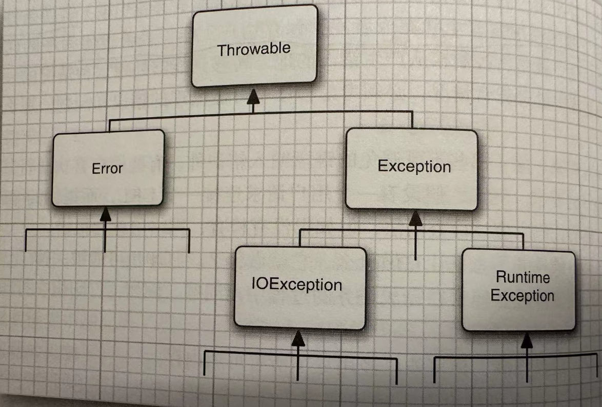
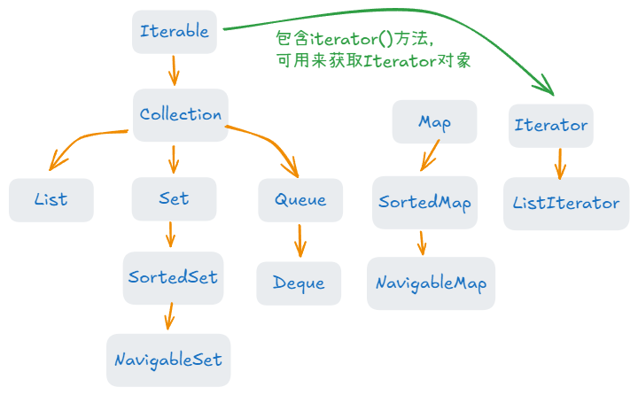
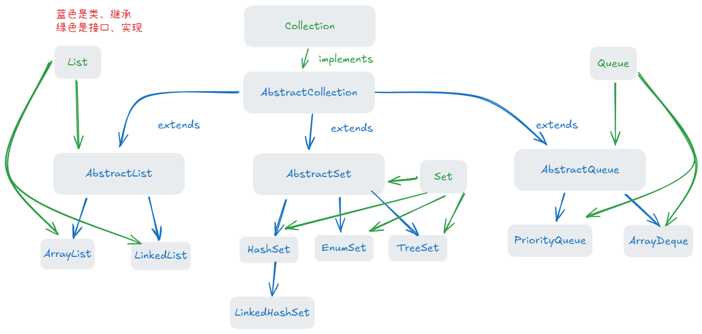
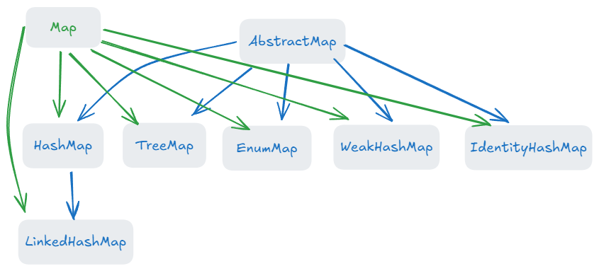

本文对《Java核心技术 I》中开发者**容易忽视**和**重要**的知识点进行总结，不包含一般开发者都知道内容。大标题后括号的数字代表书中对应的章节。


## 一、Java的基本程序设计结构（3）

### 1. 整数表示

可以为数字字面量加上下划线，这些下划线只是为了让人更易读。Java编译器会去除这些下划线。

```java
int n = 1_000_000_000;
System.out.println(n);
// 输出
1000000000
```


### 2. 无符号类型

Java 中没有原生的无符号整数类型。所有的整数类型（`byte`、`short`、`int`、`long`）都是带符号的。不过，Java 提供了某些方法来模拟无符号行为，特别是对于 `int` 和 `long` 类型。


Java 8 引入的 `Integer` 类中的 `toUnsignedLong(int x)` 和 `divideUnsigned(int x, int y)` 方法主要用于支持无符号整数的操作，尽管 `int` 类型本身是带符号的。

#### 2.1 `toUnsignedLong(int x)`

该方法将一个带符号的 `int` 转换为无符号的 `long` 类型。由于 `int` 类型是 32 位，且在 Java 中是有符号的，它的范围是 `-2^31` 到 `2^31-1`，而无符号 `int` 的范围是 `0` 到 `2^32-1`。通过该方法，可以将带符号的 `int` 值转换为无符号的 `long` 值来处理。

```java
int signedInt = -1;  									// 带符号的 int 值
long unsignedLong = Integer.toUnsignedLong(signedInt);  // 转换为无符号 long
System.out.println(unsignedLong);  						// 输出：4294967295
// -1 二进制是 11111111 11111111 11111111 11111111，转成无符号就是把前面二进制直接当成原码，求值为2^32-1即4294967295
// 正常负数的值应该是 上面二进制的各个位取反最后+1
```


#### 2.2 `divideUnsigned(int x, int y)`

该方法执行两个无符号 `int` 值的除法操作，并返回无符号的结果。它的作用类似于普通的 `x / y`，但是它是以无符号的方式来处理运算，即忽略符号位。

```java
int x = 10;
int y = 3;
int result = Integer.divideUnsigned(x, y);  // 无符号除法
System.out.println(result);  // 输出：3
```


#### 2.3 `remainderUnsigned(int x, int y)`

这个方法与 `divideUnsigned` 类似，但是它返回的是无符号的余数。

```java
int x = 10;
int y = 3;
int remainder = Integer.remainderUnsigned(x, y);  // 无符号余数
System.out.println(remainder);  // 输出：1
```

无符号数的**加减乘法**在二进制层面与有符号数一致，因为它们使用相同的二进制表示，只是解释方式不同。所以加减乘法可以直接使用。


### 3. double 类型

float 类型的数值有一个后缀 F 或 f（例如，3.14F）。没有后缀 F 的浮点数值（如3.14）总是默认为 double 类型。可选地，也可以在double数值后面添加后缀 D 或 d。


所有浮点数计算都遵循 IEEE 754 规范，具体来说，有3个特殊的浮点数值表示溢出和出错的情况。

1. 正无穷大（POSITIVE_INFINITY）
2. 负无穷（NEGATIVE_INFINITY）
3. NaN（不是一个数）

例如，一个正整数除以0的结果为正无穷大，计算0/0或负数的平方根结果为NaN。

```java
Double x = 1.0;
if (x != Double.POSITIVE_INFINITY) {
    System.out.println("x is not POSITIVE_INFINITY");
}
```


### 4. 右移操作

`>>` 和 `>>>` 都是按照位模式右移的运算符，但有略微区别。

1. `>>` 是带符号的右移操作符，叫做 **算数右移**。会保持符号位不变。

2. `>>>` 是无符号右移操作符，叫做 **逻辑右移**。不管正负数，都用 0 填充最高位。

```java
int a = -8; // 二进制：11111111 11111111 11111111 11111000 （补码形式）
int b = a >> 2; // 右移 2 位
System.out.println(b); // 输出：-2
```

`-8` 右移两位后是 `11111111 11111111 11111111 11111110`，负数在计算机中是以补码的形式存储，其原码是各个位取反，再+1。`00000000 00000000 00000000 00000001` + 1 = `00000000 00000000 00000000 00000010`（原码是2）


```java
int a = -8; // 二进制：11111111 11111111 11111111 11111000 （补码形式）
int b = a >>> 2; // 右移 2 位，高位补 0
System.out.println(b); // 输出：1073741822
```

`-8` 右移两位后是 `00111111 11111111 11111111 11111110`，(1073741822)


### 5. char类型

UTF-8 和 UTF-16 是两种常用的字符编码方式。

1. **UTF-8**是一种可变长度的字符编码，它将 Unicode 字符集中的字符编码成 1 到 4 个字节（8 位），使用 1 个字节到 4 个字节表示一个字符。其中前128个字符（ASCII）采用1字节

2. **UTF-16**也是一种可变长度的字符编码方式，但它将 Unicode 字符集中的字符编码成 2 个字节或 4 个字节，并且对于大多数常用字符（前128个字节），使用 2 个字节来表示。

Java中的 **char类型** 使用的就是 UTF-16，其中 UTF-16 有一个**代码单元**的概念，即表示一个字符的最小存储单位，UTF-16的代码单元是2字节。

观察下面代码可以发现，`charAt` 返回的是一个代码单元，那么对于占用两个代码单元的字符串就会出现奇怪的问题。所以尽量避免使用 Char 类型。

```java
String s = "\uD83D\uDE00hello"; // 这个字符串实际是 😀hello
System.out.println(s);	
System.out.println(s.charAt(0));
System.out.println(s.charAt(1));	// 这里输出的并不是 h
System.out.println(s.charAt(2));
//  输出如下
😀hello
?
?
h
```


### 6. trim 和 strip

1. `trim()` 只会去除 **ASCII 空白字符**（即 **`\u0020`** 空格、**`\u0009`** 制表符、**`\u000A`** 换行符、**`\u000D`** 回车符）以及一些常见的控制字符。

2. `strip()` 在 Java 11 中引入，除了去除 **ASCII 空白字符** 外，它还会去除一些其他的 Unicode 空白字符（如 **`\u2000`** 到 **`\u200B`** 等）。

strip 去除的范围更广，一般采用这个。

```java
String s = "Hello World!\u3000   ";  // 包含零宽空格（\u200B）和全角空格（\u3000）
String trimmed = s.trim();
String stripped = s.strip();

System.out.println("Original: '" + s + "'");
System.out.println("Trimmed: '" + trimmed + "'");
System.out.println("Stripped: '" + stripped + "'");
```


### 7. switch

传统的switch存在 **直通行为**。（即当 `switch` 语句中的某个 `case` 匹配到时，它会继续执行下一个 `case` 的代码，直到遇到 `break` 语句或 `switch` 语句结束为止。这种行为叫做 **fall-through**，即“穿透”到下一个 `case`。）


Java 12 引入了增强的 `switch` 表达式，支持 **非直通行为**。可以返回值并消除掉传统 `switch` 语句中的直通行为，避免不小心出现的错误。引入了 `->` 和 `yield`，其中用 `->` 代替传统的 `:`，并且还可以返回一个值，`yield` 用来指定返回什么，相当于return。

```java
int day = 3;

String result = switch (day) {
    case 1 -> "Monday";	// 对于没有花括号包围的，相当于是 yield "monday";
    case 2 -> "Tuesday";
    case 3 -> {
        // 使用 yield 返回值
        System.out.println("Processing Wednesday...");
        yield "Wednesday"; // 必须使用 yield 来返回值
    }
    case 4 -> "Thursday";
    case 5 -> "Friday";
    default -> "Invalid day";
};

System.out.println(result);  // 输出返回的字符串
// 输出
Processing Wednesday...
Wednesday
```

对于 `switch cast ->` 这种语句只能使用 **yield** 返回结果，不能用 **break**、**continue** 和 **return**。


## 二、对象与类（4）

### 1. final 的用途

1. `final` 修饰一个字段时，意味着该字段的值 **一旦被赋值后就不能再改变**。

2. `final`  修饰方法时，意味着该方法不能被子类重写（覆写）。

3. `final` 修饰类时，意味着该类不能被继承。

final 修饰符对于**基本类型**或者**不可变类型**的字段尤其有用。如果修饰的是**可变类型**的字段，那么表示存储该字段指向的对象引用不用再指向其他的，但是引用本身是**可以改变**的。


### 2. 静态方法构造对象

**使用静态工厂方式来构造对象**是指通过类的**静态方法**来创建并返回对象，而不是直接通过类的构造器 (`new`) 来实例化对象。这种设计模式可以提供更多的灵活性和可扩展性。

#### 2.1 与构造器的对比

| **构造器**                                       | **静态工厂方法**                                   |
| ------------------------------------------------ | -------------------------------------------------- |
| 名称固定，必须与类名相同。                       | 方法名可以**自由命名**，能更清晰地表达意图。       |
| 每次调用都会返回一个新对象。                     | 可以返回**缓存对象或共享对象**，提升性能。         |
| 直接调用类的构造器，不能对返回的对象做额外处理。 | 可以自定义逻辑，如参数校验、对象池管理等。         |
| 无法隐藏实现类。                                 | 可以**返回接口类型或不同的实现类**，隐藏具体实现。 |


#### 2.2 静态工厂的优势

1. **更具可读性和语义性**
    方法名可以描述创建对象的意图，而构造器只能使用类名。

   ```java
   // 使用构造器
   LocalDate today = new LocalDate();
   
   // 使用静态工厂
   LocalDate today = LocalDate.now(); // 可读性更强
   ```

2. **可以缓存和复用实例**
    静态工厂方法可以返回已有实例，而不总是创建新对象。

   ```java
   public class Boolean {
       public static final Boolean TRUE = new Boolean(true);
       public static final Boolean FALSE = new Boolean(false);
   
       public static Boolean valueOf(boolean b) {
           return b ? TRUE : FALSE;
       }
   }
   ```

3. **隐藏实现类，返回接口或父类类型**
    静态工厂方法可以返回接口类型或其父类，隐藏具体实现，从而提高灵活性和扩展性。

   ```java
   public interface Animal {}
   public class Dog implements Animal {}
   public class Cat implements Animal {}
   
   public class AnimalFactory {
       public static Animal createAnimal(String type) {
           if ("dog".equals(type)) {
               return new Dog();
           } else if ("cat".equals(type)) {
               return new Cat();
           }
           throw new IllegalArgumentException("Unknown type");
       }
   }
   ```


### 3. 方法参数传递方式

1. **基本数据类型的传递**（传递值）

2. **引用类型的传递**（传递引用的副本）

对于对象的传递，方法得到的是**对象引用的副本**，而不是像C++那样按引用调用，原来的对象引用和这个副本都是引用同一个对象。下面两个示例都可以证明这一点。


1. String 类型

对于String类型，参数传递是按照引用类型传递，但是String是不可变对象，所以在 `testString` 方法中重新赋值a，b，实际上是对方法中的a和b重新创建String对象，并不会改变main中的a，b。

```java
public static void main(String[] args) throws InterruptedException {
    String a = "hello";
    String b = "world";
    System.out.println(a + " " + b);
    testString(a, b);
    System.out.println(a + " " + b);
}
public static void testString(String a, String b) {
    a = "testa";
    b = "testb";
};
// 输出
hello world
hello world
```

2. 对象类型

我们打算让两个对象 person1 和 person2 互换一下对象的引用，可以发现并没有成功。实际是方法中的 p1 指向了 person2 引用的对象，p2指向了person1引用的对象。

```java
public class Test {
    private static final Logger log = LoggerFactory.getLogger(Main.class);
    public static void main(String[] args) throws InterruptedException {
        Person person1 = new Person("name1", 18);
        Person person2 = new Person("name2", 18);
        System.out.println(person1);
        System.out.println(person2);
        testObject(person1, person2);
        System.out.println(person1);
        System.out.println(person2);
    }

    public static void testObject(Person p1, Person p2) {
        Person person = p1;
        p1 = p2;
        p2 = person;
    }
}

class Person {
    String name;
    Integer age;
    public Person(String name, Integer age) {
        this.name = name;
        this.age = age;
    }
}
// 输出
other.Person@27c6e487
other.Person@49070868
other.Person@27c6e487
other.Person@49070868
```


### 4. this

this 是一个隐式参数，也就是所构造的对象，可以通过它访问当前对象的字段，也可以用来调用同一个类的另一个构造方法。

```java
// 访问字段
public Person(String name, Integer age) {
    this.name = name;
    this.age = age;
}

// 调用另一个构造方法
public Person(String name, Integer age) {
    this();
}
public Person() {
    this.name = "xiao wang";
    this.age = 18;
}
```


### 5. 初始化实例字段

常见的初始化实例字段的方法是

1. 在**构造方法**中初始化
2. 在**声明**中直接赋值

实际上，Java还有第三种机制，成为**初始化块**。在一个类的声明中，可以包含任意的代码块。构造这个类的对象时，这些块就会执行。

```java
class Person {
    String name;
    Integer age;

    {
        name = "xiao wang";
        age = 18;
    }
// get ... set ... 方法
}
Person person = new Person();
System.out.println(person.getName());
System.out.println(person.getAge());
// 输出
xiao wang
18
```

当然，对于静态字段，可以使用静态初始化代码块，只需要在代码块前加一个 `static` 关键字即可

```java
static {
    
}
```


### 6. 特殊类: 记录

记录是一种特殊形式的类，其状态不可变，而且公共可读。记录会自动添加：toString、equals、hashCode、getter方法。 (JDK16正式发布)

```java
public record Point(int x, int y) {
}

Point point = new Point(1, 1);
System.out.println(point.x());	// getter方法
System.out.println(point.y());	// getter方法
```

补充：

1. 记录可以添加自定义的方法，可以添加静态字段和方法，但是不能增加实例字段。比如上面如果在代码块中添加 `int z;` 就会报错。

2. 记录不可以被继承
3. 记录生成的equals是比较字段的值是否相同的。（在**6.1**中会讲到）


## 三、继承（5）

继承是指允许一个类（子类）从另一个类（超类）获取属性和方法。其中超类的私有变量和方法  **不能直接被子类访问** 但是它们是 **可以被子类继承**。


### 1. super

**super**是一个指示编译器调用超类方法的特殊关键字，可以通过super调用超类的**构造方法**、**普通方法**、字段。使用super调用超类构造方法的语句必须放在子类构造方法的第一条语句。

在创建**子类**对象时，需要**先调用超类的构造器**来初始化父类部分的成员变量和状态，然后再初始化子类的成员变量。因此super必须是子类构造方法的第一条语句，确保可以按正确顺序初始化超类

```java
class Person {
    private String name;
    private Integer age;

    Person(String name, Integer age) {
        this.name = name;
        this.age = age;
    }
}

public class Man extends Person{

    private String sex;

    public Man(String name, Integer age, String sex) {
        super(name, age);
        this.sex = sex;
    }
}
```


### 2. 多态

一个对象变量可以指示**多种实际类型**（**可以把子类对象赋值给超类变量**），这一点称为多态。在运行时能够自动地选择适当的方法，这称为动态绑定（运行时多态）。

在下面示例中，`Animal` 类指示了两种实际类型**Dog**，**Cat**，并且在调用 `sound` 方法时，即使是 Animal 对象，也可以选择出正确的方法。

```java
package other;

class Animal {
    public void sound() {
        System.out.println("Animal makes a sound");
    }
}

class Dog extends Animal {
    @Override
    public void sound() {
        System.out.println("Dog barks");
    }
}

class Cat extends Animal {
    @Override
    public void sound() {
        System.out.println("Cat meows");
    }
}

public class Test {
    public static void main(String[] args) {
        Animal animal1 = new Dog();  // 父类引用指向子类对象
        Animal animal2 = new Cat();		// new Cat()可以指向多个实际类型，比如 Animal、Cat类型

        animal1.sound();  // 输出: Dog barks
        animal2.sound();  // 输出: Cat meows
    }
}
```


### 3. 方法重载

方法的名字和参数列表称为方法的 **签名**，一个类中不能存在相同的方法签名。

比如下面这个就会报错，因为他们的方法签名相同，**返回类型**并不是签名的一部分

```java
public class Test {
    public Integer test() {	// Integer 返回类型
        return 1;
    }

    public String test() {	// String 返回类型
        return "1";
    }
}
```


如果子类中定义了一个与超类签名相同的方法，那么子类中的这个方法就会覆盖超类中有相同签名的方法。为了保证返回类型的兼容性，**允许子类讲覆盖方法的返回类型改成原返回类型的子类型**。

```java
class Animal {
    public Animal getAnimal() {
        return new Animal();
    }
}

class Dog extends Animal {
    @Override
    public Dog getAnimal() {	// 重载时允许讲返回类型从Animal改成Dog
        return new Dog();
    }
}
```


### 4. `instanceof`

`instanceof` 是 Java 中的一个 **运算符**，用于测试一个对象是否是某个**类**的实例，或者是否是该类的**子类**实例。如果对象是某个类的实例，或者是该类的子类的实例，`instanceof` 会返回 `true`。同时，如果对象实现了某个接口，`instanceof` 也会返回 `true`，前提是该对象的**类**或**超类**实现了该接口。

```java
class Animal {}
class Dog extends Animal {}
interface Pet {}

class Cat extends Animal implements Pet {}

public class Main {
    public static void main(String[] args) {
        Animal animal = new Dog();
        System.out.println(animal instanceof Animal);  // true
        System.out.println(animal instanceof Dog);     // true
        System.out.println(animal instanceof Pet);     // false

        Pet pet = new Cat();
        System.out.println(pet instanceof Pet);        // true
        System.out.println(pet instanceof Animal);     // true
    }
}

```


一般我们在进行强制类型转换时，会先查看是否能够成功地转换，为此需要使用 instanceof 判断，然后再强制类型转换。如下：

```java
Animal animal = new Dog();  
if (animal instanceof Dog) {    // true animal实际是Dog的实例，所以他是Dog类
    Dog tmp = (Dog) animal;
}

if (animal instanceof Animal) { // true Dog是Animal的子类
    Animal tmp = (Animal) animal;
}
```

在Java16中，引入了新的简化的写法。如果为真，会把 animal强制类型转换成Dog类型，并赋值给 tmp。

```java
if (animal instanceof Dog tmp) {};
```


### 5. 四种访问控制修饰符

1. 可由外部访问——public
2. 本包和所有子类可以访问——protected
3. 本包中可以访问——不带上面三个的修饰符时
4. 仅本类可以访问——private

权限大小按照上面顺序，buplic最大，其次是protected、默认的、private


### 6. `Object`

Object类是Java中所有类的始祖，每个类都继承了Object。我们可以用Object类型的变量引用任意类型的对象，`Object animal = new Animal()`。


#### 6.1 equals

Object 类中的`equals`方法用于检测一个对象是否等于另一个对象。Object类中实现equals方法将确定两个对象**引用**是否相同。这是一个合理的默认是行为，但如果经常要**基于状态**检测对象的相等性，可以重载这个方法。（java提供的大部分类都重载了这个方法，确保是每个字段都相同的时候才返回 `true`）


默认情况下我们的类如果没有重载`equals`方法，那么它的实例调用`equals`时，比较的就是引用是否相同，但是我们一般更希望它们比较的是字段是否相同。

```java
public class Point {
    int x;
    int y;
}

Point p1 = new Point();
Point p2 = new Point();
if (p1.equals(p2)) {	// false, 因为它两是不同的引用
    System.out.println("true");
}
```


重载这个方法的要点：

1. 重写 `equals` 方法时，通常还需要重写 `hashCode` 方法。根据 Java 的规定，如果两个对象通过 `equals` 方法比较相等，那么它们的 `hashCode` 也必须相等。这是为了确保对象在哈希集合（如 `HashMap`, `HashSet`）中正确工作。

2. 重写 `equals` 方法时，应遵循以下规则：

   - 自反性：对于任何非 `null` 引用 x，`x.equals(x)` 应该返回 `true`。

   - 对称性：`x.equals(y)` 如果返回 `true`，那么 `y.equals(x)` 也应该返回 `true`。

   - 传递性：如果 `x.equals(y)` 和 `y.equals(z)` 都为 `true`，那么 `x.equals(z)` 也应该为 `true`。

   - 一致性：在对象状态没有变化的情况下，多次调用 `x.equals(y)` 应该返回相同的结果。

   - 非空性：`x.equals(null)` 应该返回 `false`。

下面是一个例子，这个实现方式，对于同一超类，不同子类的实例，equals会返回false

```java
abstract class Animal {
    private String name;

    // 构造、get、set...

    @Override
    public boolean equals(Object obj) {
        // 自反性检查
        if (this == obj) {
            return true;
        }

        // 类型检查，确保比较的是同一类或同一类的子类对象
        if (obj == null || getClass() != obj.getClass()) {
            return false;
        }

        // 比较字段
        Animal animal = (Animal) obj;
        return Objects.equals(name, animal.name);
    }

    @Override
    public int hashCode() {
        return Objects.hash(name);
    }
}

class Dog extends Animal {
    private String breed;

    // 构造、get、set...
    
    @Override
    public boolean equals(Object obj) {
        // 确保是相同类型的 Dog 对象
        if (this == obj) {
            return true;
        }
        if (obj == null || getClass() != obj.getClass()) {
            return false;
        }

        Dog dog = (Dog) obj;
        // 调用超类的，以及判断自己特有的字段是否相同
        return super.equals(obj) && Objects.equals(breed, dog.breed);
    }

    @Override
    public int hashCode() {
        return Objects.hash(super.hashCode(), breed);
    }
}
```


#### 6.2 hashCode

Object 类中的hashCode方法用于返回对象的哈希值。哈希值是一个整数，通常用于哈希表（如 `HashMap`、`HashSet`）中快速查找对象。

如果重新定义了equals方法，还必须为用户可能插入散列表的对象重新定义hashCode方法。

```
// Objects.hash 会对各个参数调用Objects.hashCode，并组合这些散列值
@Override
public int hashCode() {
    return Objects.hash(super.hashCode(), breed);
}
```


#### 6.3 toString

Object 类中的toString方法用于返回对象的字符串表示形式。默认情况下，`Object` 类的 `toString` 方法返回对象的**类名**和**哈希值**(十六进制)（类似 `ClassName@hashCode`）。

```java
// 默认的toString方法
public String toString() {
    return getClass().getName() + '@' + Integer.toHexString(hashCode());
}
```

一般我们会用 `类名[字段名1=字段值1，字段名2=字段值2]` 的形式重载 `toString` 方法

**注意**：在重载方法时，不要将类名字符串硬编码到方法中，最好通过调用 `getClass().getName` 获取类名的字符串。这样我们后续在编写这个类的子类时，就可以调用 `super.toString()` + 子类中新的字段。


### 7. 包装器、装箱和拆箱

`Integer` 类对应基本类型 `int` ，像这些类被称为**包装器**。比如 `Integer`、`Long`、`Float`、`Double`、`Character`、`Boolean`。

包装器类是**不可变**的，即一旦构造了包装器，就不允许更改包装在其中的值。同时，包装器类还是final，因此**不能派生**出它们的子类。

1. 装箱

```java
// 第一行这样写在编译成的jvm指令，等价于第二行这种写法。这种转换成为自动装箱
Integer n = 1;	
Integer n = Integer.valueOf(1);	// 构造一个对象，值为1
```

2. 拆箱

```java
// 第二行这样写在编译成jvm指令，等价于第三行这种写法。这种转换成为自动拆箱
Integer n = 1;
int m = n;
int m = n.intValue();
```

**补充：**

1. Integer本质上还是对象，所以 n 和 m通过 `==` 比较的是对象的引用是否相同，但是观察可以发现，正常来说 n 和 m 的引用应该是不同的，但是他们输出的却是 true。这是由于 `Integer` 对 -128 到 127 之间的数字进行了缓存，当时中这些数字时都引用缓存对象；这也是为什么 `x == y` 输出的确实 false的原因。

```java
Integer n = 127;
Integer m = 127;
System.out.println(n == m);	// true

Integer x = 128;
Integer y = 128;
System.out.println(x == y);	// false
```

2. 不要将包装器对象作为锁


### 8. 抽象类

使用 `abstract` 关键字修饰的方法叫做`抽象方法`，可以不需要写具体的实现。同时，为了提高程序的清晰性，包含一个或多个抽象方法的类本身必须带上 `abstract` 关键字，声明为`抽象类`。

1. 抽象类不可以创建实例，可以创建一个它的对象变量，但是这个变量只能引用其非抽象子类的对象。

```java
// 假设这里的 Animal 是抽象类，Dog是其非抽象子类
Animal animal = new Animal(); // 不可以
Animal animal = new Dog();	// 可以
```

2. 抽象类中除了抽象方法之外，还可以包含字段和具体方法。

3. 抽象类的子类如果存在超类中的抽象方法，并且未对其进行具体的实现，那么这个子类必须也声明为抽象类。如果子类将超类中的所有的抽象方法都具体实现了，那么就不再是抽象的了


### 9. 密封类

Java 的 **密封类**（Sealed Class）是在 Java 15 中引入的特性，它允许开发者控制哪些类可以继承某个类或者实现某个接口。用关键字 `sealed` 指定密封类，用 `permits` 指定哪些类可以继承这个类或结构。

对子类的约束

1. 子类不能是嵌套在另一个类中的私有类，也不能是位于另一个包中的可见类，必须是与封装类在同一个包中的。(如果是模块的话，必须是在同一个模块中的)
2. 密封类的子类可以是 `final`、`sealed` 或 `non-sealed`。如果子类是 `sealed`，它仍然可以进一步指定允许的子类。（no-sealed 标记该类不再密封）


### 10. 反射

反射是 Java 的一种机制，使得程序能够在**不知道具体类的信息**的情况下操作这些类。比如**访问、修改**类的结构和成员（**方法、字段、构造函数**等）。

其中Java 反射是通过 **`Class`对象** 获取类的元数据的，当 JVM 加载一个类时，Java 会根据 `.class` 文件中的字节码生成一个 `Class` 对象。

#### 10.1 `Class`对象

获取 Class 对象：

```java
// 最常用
Class<?> clazz1 = Class.forName("other.Person");

// 一般当做参数传递
Class<Person> clazz2 = Person.class;

// 有这个类对象时，调用获取
Person p = new Person();
Class<? extends Person> clazz3 = p.getClass();

System.out.println(clazz1 == clazz2);	// true
System.out.println(clazz2 == clazz3);	// true
```


#### 10.2 Constructor

通过 `Constructor` 类，我们可以在运行时获取类的构造函数信息，并动态地调用构造函数来创建对象。

1. 获取 Constructor 类

```java
Class<?> clazz = Class.forName("other.Person");

Constructor<?>[] constructors1 = clazz.getConstructors();	// 获取所有的 public 构造方法
Constructor<?> constructor2 = clazz.getConstructor(String.class, Integer.class);// 获取指定的 public 构造方法

Constructor<?>[] declaredConstructor1 = clazz.getDeclaredConstructors();	// 获取所有构造方法(public, private,protect都可以)
Constructor<?> declaredConstructor2 clazz.getDeclaredConstructor(String.class, Integer.class);	// 获取指定的构造方法(public, private,protect都可以)

public class Person {
    private String name;
    private Integer age;

    public Person() {

    }

    public Person(String name, Integer age) {
        this.name = name;
        this.age = age;
    }
}
```

2. 获取信息和创建实例

```java
Class<?> clazz = Class.forName("other.Person");

Constructor<?> constructor = clazz.getConstructor(String.class, Integer.class);
System.out.println(constructor.getName());								// other.Person
System.out.println(constructor.getModifiers());							// 1 （访问权限，1是public）
System.out.println(Arrays.deepToString(constructor.getParameters()));	// [java.lang.String arg0, java.lang.Integer arg1]
//        constructor.setAccessible(true);  如果获取到的constructor的构造方法是私有的，需要先调用这个才可以通过 newInstance 创建实例。
//        这里我们获取到的是 Public 的，所以不需要调用
Person person = (Person) constructor.newInstance("zhang san", 18);
```


#### 10.3 Field

通过 `Field` 类我们可以在在运行时获取或修改类的字段。

1. 获取 `Field` 类

```java
Class<?> clazz = Class.forName("other.Person");

Field[] fields1 = clazz.getFields();    		// 获取所有 public 的字段
Field name1 = clazz.getField("name");   		// 获取指定的 public 字段
Field[] fields2 = clazz.getDeclaredFields();    // 获取所有字段（包含public,protect,private）
Field name2 = clazz.getDeclaredField("name");   // 获取指定字段（包含public,protect,private）
```

2. 获取、修改信息

```java
Class<?> clazz = Class.forName("other.Person");

Field name = clazz.getDeclaredField("name");   	// 获取指定字段
System.out.println(name.getName());				// name
System.out.println(name.getModifiers());		// 2 (访问权限，2是private)
System.out.println(name.getType());				// class java.lang.String (字段类型)

name.setAccessible(true);						// 因为我们的name是private，所有设置权限为true,允许访问私有字段。
Person person = new Person("zhang san", 18);	// 一般这里通过constructor来创建
System.out.println(name.get(person));			// zhang san (获取指定实例的name字段值)
name.set(person, "lao wang");					// 修改指定实例的name字段值
System.out.println(person.getName());			// lao wang
```


#### 10.4 Method

通过 `Method` 类可以用来访问、调用类中的方法

1. 获取 `Method` 类

```java
Class<?> clazz = Class.forName("other.Person");

Method[] methods = clazz.getMethods();
Method method = clazz.getMethod("setName", String.class);

Method[] declaredMethods = clazz.getDeclaredMethods();
Method declaredMethod = clazz.getDeclaredMethod("setName", String.class);
```

2. `Method` 的使用

```java
Class<?> clazz = Class.forName("other.Person");

Method method = clazz.getMethod("setName", String.class);
System.out.println(method.getName());								// setName
System.out.println(method.getModifiers());							// 1
System.out.println(Arrays.deepToString(method.getParameters()));    // 获取形参
System.out.println(Arrays.deepToString(method.getExceptionTypes()));// 获取方法抛出的异常
Person person = new Person("zhang san", 18);						
method.invoke(person, "wang wu");	// 调用这个方法，第一个参数是要调用的实例，第二个参数是方法的实参(可接受多个)
System.out.println(person.getName());	// wang wu
```


## 四、接口、lambda表达式与内部类（6）


### 1. 接口

接口中的所有方法都自动是 `public` 抽象方法。因此，在接口中声明方法时，不必提供关键字 public。

1. **接口概念**

接口中绝不会有实例字段、方法的实现

```java
public interface Test {
    // 接口中的字段（常量），默认是 public static final
    String test = "hello world";

    // 接口中的方法，默认是 public abstract
    void test();
    
    // 默认方法，提供实现
    default void sleep() {
        System.out.println("Animal is sleeping");
    }
    
    // 静态方法
    static void breathe() {
        System.out.println("Animal is breathing");
    }
}
```

2. **接口属性**

`Comparable` 接口的主要作用是定义对象的**自然顺序**（natural ordering），让对象能够按照一定规则进行排序。实现了 `Comparable` 接口的类的对象可以直接使用 Java 提供的排序机制（如 `Arrays.sort()` 或 `Collections.sort()`）进行排序。

```java
public class Person implements Comparable {

    @Override
    public int compareTo(Object o) {
        return 0;
    }
}
```

虽然接口不能构造对象，但是可以声明接口变量。而且可以用 `instanceof` 来判断某个对象的类是否或超类是否是实现了 Comparable 接口的类。

```java
Comparable person = new Person();
System.out.println(person instanceof Comparable);	// true
```

补充：`记录`和`枚举类`不能扩展其他类，因为他们隐式地扩展了Record和Enum类。（一个类只能有一个超类，但可以有多个接口，所以记录和枚举类可以实现多个接口）

3. **默认方法冲突规则**

上面讲到，接口中可以定义`默认方法 final`，但是如果一个类的超类中和实现的一个接口中定义了同一个方法，会发生什么。

- 超类优先：如果超类提供了一个具体方法，同名而且有相同参数类型，那么超类中的方法会覆盖接口中的默认方法
- 接口冲突：如果一个接口提供了一个默认方法，另一个接口提供了一个同名而且参数类型相同的方法（不论是否是默认方法），必须覆盖这个方法来解决冲突


### 2. lambda 表达式

对于只有**一个抽象方法**的接口，需要这种接口的对象时，就可以提供一个lambda表达式。这种接口成为函数式接口。（函数式接口通常含有 @FunctionalInterface 注解）

特点：**延迟执行**：Lambda 表达式往往用于支持延迟执行的 API 中，如 Stream API、Runnable 等。


#### 2.1 方法引用

方法引用本质上是 Lambda 表达式的一种特殊形式，可以用来替代 `Lambda` 表达式中调用一个已经定义的函数。

1. 静态方法引用

静态方法引用用于调用类的静态方法。基本语法是：`ClassName::staticMethodName`。

```java
public class MathUtils {
    public static int add(int a, int b) {
        return a + b;
    }

    public static void main(String[] args) {
        // 使用 Lambda 表达式
        BinaryOperator<Integer> addLambda = (a, b) -> MathUtils.add(a, b);
        System.out.println(addLambda.apply(3, 5));  // 输出 8

        // 使用方法引用
        BinaryOperator<Integer> addMethodReference = MathUtils::add;
        System.out.println(addMethodReference.apply(3, 5));  // 输出 8
    }
}
```

2. 具体对象引用实例方

实例方法引用用于调用对象的实例方法。语法是：`instanceName::instanceMethodName`。

```java
class Person {
    private String name;

    public Person(String name) {
        this.name = name;
    }

    public void greet() {
        System.out.println("Hello, " + name);
    }

    public static void main(String[] args) {
        Person person = new Person("John");

        // 使用 Lambda 表达式
        Consumer<Void> greetLambda = v -> person.greet();
        greetLambda.accept(null);  // 输出 "Hello, John"

        // 使用方法引用
        Consumer<Void> greetMethodReference = person::greet;
        greetMethodReference.accept(null);  // 输出 "Hello, John"
    }
}
```

3. 类引用了实例方法

基本语法是：`ClassName::MethodName`。

```java
public class Main {
    public static void main(String[] args) {
        String[] words = {"Banana", "apple", "Orange", "grape"};

        // 使用 Lambda 表达式
        Arrays.sort(words, (x, y) -> x.compareToIgnoreCase(y));
        System.out.println(Arrays.toString(words));  // 输出: [apple, Banana, grape, Orange]

        // 使用方法引用
        // String::compareToIgnoreCase 是一个可以接受两个 String 类型的参数的比较器方法，它会被用在需要比较两个 String 的上下文中。
        Arrays.sort(words, String::compareToIgnoreCase);
        System.out.println(Arrays.toString(words));  // 输出: [apple, Banana, grape, Orange]
    }
}
```

4. 构造器引用

构造器引用通常用于通过 **构造器** 创建对象。语法是：`ClassName::new`。

```java
class Car {
    private String model;

    public Car(String model) {
        this.model = model;
    }

    public void display() {
        System.out.println("Car model: " + model);
    }

    public static void main(String[] args) {
        // 使用 Lambda 表达式
        Supplier<Car> carLambda = () -> new Car("Toyota");
        Car car1 = carLambda.get();
        car1.display();  // 输出 "Car model: Toyota"

        // 使用构造器引用
        Supplier<Car> carConstructorReference = Car::new;  // 引用 Car 的构造器
        Car car2 = carConstructorReference.get();
        car2.display();  // 输出 "Car model: null"（因为没有提供参数）
    }
}
```


#### 2.2 变量作用域

1. 局部变量或常量

Lambda 表达式可以访问 **局部变量** 和 **常量**，但要求这些变量必须是 **`final`** 或 **等效于 `final`**（即不可修改的）。并且它们的值在lambda内部不能被改变。

```java
public static void main(String[] args) {
            for (int i = 0; i < 5; i++) {
                int j = i;
                new Thread(() -> {
//                    System.out.println(i);// 会报错，因为 i 是可变的
                    System.out.println(j);	// 虽然是变量，但是等效于 final，因为他没有发生变化
//                    j = 2;				// 会报错，不可以修改
                });
            }
        }
```

上面讲到lambda有一个特点就是 延迟执行，而执行的时候局部变量可能已经不存在了，为什么对于局部变量或常量可以访问，并且只能访问？

闭包：**函数可以捕获并“记住”它被创建时的环境（外部变量），即使该函数在执行时，外部环境中的变量已经失效或不再存在**。

Lambda 表达式通过创建一个内部类（或匿名类）来实现闭包。在编译时，Lambda 表达式会被转换成一个匿名的 **函数对象**，它实现了某个接口（通常是 `Runnable`、`Callable`、`Function`、`Consumer` 等）。这个匿名类会捕获的外部变量并变成匿名类的 **实例变量**，保持对原始外部变量的引用。确保即使在外部作用域中这些变量已经结束，Lambda 表达式仍然能访问这些变量。

补充：上面讲到会创建内部类，但是lambda表达式中的 this 指定还是正常类中的this，而不是内部类的this，其含义并没有发生变化。

2. 成员变量

Lambda 表达式可以访问外部类的 **成员变量**（即实例变量或类变量），不需要 `final` 或 **等效于 final** 的限制。也可以在lambda中修改。

```java
public class Main {
    int a = 5;
        public static void main(String[] args) {
            for (int i = 0; i < 5; i++) {
                Main test = new Main();
                new Thread(() -> {
                    System.out.println(test.a);
                    test.a = 10;
                });
            }
        }
}
```


### 3. 内部类

内部类是定义在另一个类内部的类。可以让代码更加紧凑，增强可读性，并提供一些特殊的功能（如访问外部类的实例变量和方法）。

在 Java 中，内部类主要有以下几种类型：

1. **成员内部类（Non-static Inner Class）**
2. **静态内部类（Static Inner Class）**
3. **局部内部类（Local Inner Class）**
4. **匿名内部类（Anonymous Inner Class）**


1. **成员内部类**

成员内部类是定义在外部类的成员位置（方法外部）且没有被声明为静态的类。它可以访问外部类的所有成员，包括私有成员。成员内部类必须通过外部类的实例来创建。

```java
class Outer {
    private int outera = 10;

    private static int outerb = 10;

    private String outerc() {
        return "outerc";
    }

    private static String outerd() {
        return "outerd";
    }

    class Inner {
        public void display() {
            System.out.println("display " + Outer.this.outera);
            System.out.println("display " + Outer.outerb);
            System.out.println("display " + Outer.this.outerc());
            System.out.println("display " + Outer.outerd());
        }

        public static void display2() {	// 同样，静态方法只能访问静态变量
            System.out.println("static display2 " + Outer.outerb);
            System.out.println("static display2 " + Outer.outerd());
        }
    }

    public static void main(String[] args) {
        // 创建外部类的实例
        Outer outer = new Outer();

        // 通过外部类的实例创建内部类的实例
        Outer.Inner inner = outer.new Inner();
        inner.display();
        Outer.Inner.display2();
    }
}
```


2. **静态内部类**

静态内部类是使用 `static` 修饰的内部类。与成员内部类不同，静态内部类不依赖于**外部类的实例**，只能访问外部类中的静态变量和静态方法。

```java
class Outer {
    private static int staticVar = 20;

    static class Inner {
        public void display() {
            // 只能访问外部类的静态成员
            System.out.println("display " + staticVar);
        }

        public static void display2() {
            System.out.println("display2 " + staticVar);
        }
    }

    public static void main(String[] args) {
        // 通过类名直接创建静态内部类的实例
        Outer.Inner inner = new Outer.Inner();
        inner.display();
        Outer.Inner.display2();
    }
}
```


3. **局部内部类**

局部内部类是定义在方法中的内部类。它只在方法内部可见，生命周期仅限于方法的执行。可以访问方法的局部变量，但这些局部变量必须是 `final` 或者是隐式 `final`（在 Java 8 及以后）

```java
class Outer {
    public static int outerA = 1;

    public int outerB;

    public void outerMethod() {
        final int localVar = 30; // 局部变量必须是 final

        class Inner {
            public void display() {
                System.out.println("display: " + localVar);
                System.out.println("display: " + Outer.outerA);
                System.out.println("display: " + Outer.this.outerB);
            }
        }

        // 创建并调用局部内部类的实例
        Inner inner = new Inner();
        inner.display();
    }

    public static void main(String[] args) {
        Outer outer = new Outer();
        outer.outerMethod();
    }
}
```


4. **匿名内部类**

匿名内部类没有类名，通常用于**实现接口**或**继承类**，并且仅在单个方法中使用一次。（匿名内部类是一个没有类名的类，**不能有构造方法**，构造参数会传给**超类的构造方法**）

```java
class Outer {
    public void display() {
        // 使用匿名内部类实现接口	
        Runnable r = new Runnable() {
            @Override
            public void run() {
                System.out.println("Anonymous class running");
            }
        };
        
        r.run(); // 调用匿名类的方法
    }

    public static void main(String[] args) {
        Outer outer = new Outer();
        outer.display();
    }
}
```

补充：上面所有例子中，我们访问外部类的变量或方法时，通过 `OuterClass.this.变量名` 或 `OuterClass.变量名`，其实可以不用写前缀 `OuterClass.this` 或 `OuterClass.`，当内部类中和外部类命名冲突时，直接写变量名或方法名默认是内部类的。


### 4. 代理

Java 中的代理通过在方法调用前后加入额外的行为，增加了灵活性，但也有性能开销。通常有两种方式：

1. **静态代理**：手动编写代理类。

2. **动态代理**：通过 Java 提供的 API 动态生成代理类。

#### 4.1 静态代理

**静态代理**是指代理类和被代理类必须在**编译时**就确定，代理类通常会显式实现被代理类的接口并转发方法调用。

在下面的例子中，`AnimalProxy` 是静态代理类，它实现了 `Animal` 接口，并且在 `speak` 方法前后增加了自己的逻辑。

```java
interface Animal {
    void speak();
}

class Dog implements Animal {
    public void speak() {
        System.out.println("Woof!");
    }
}

// 代理 Animal 类，编译阶段就确定了要代理的类
class AnimalProxy implements Animal {	
    private Animal animal;

    public AnimalProxy(Animal animal) {
        this.animal = animal;
    }

    public void speak() {
        System.out.println("Proxy: Before method call");	// 前后都加上了额外的行为
        animal.speak();  // 委托给实际的 Animal 实现
        System.out.println("Proxy: After method call");
    }
}

public class StaticProxyExample {
    public static void main(String[] args) {
        Animal dog = new Dog();
        Animal proxy = new AnimalProxy(dog);	// 把dog交给代理类
        proxy.speak();
    }
}
```


#### 4.2 动态代理

动态代理是通过 Java 的 `Proxy` 类和 `InvocationHandler` 接口在运行时创建代理类。它不需要显式创建代理类，代码更加灵活。（Java 动态代理只能为**实现了接口的类**创建代理。如果类没有接口，需要使用 CGLIB 等库来实现代理。）

```java
interface Animal {
    void speak();
}

class Dog implements Animal {
    public void speak() {
        System.out.println("Woof!");
    }
}

class AnimalInvocationHandler implements InvocationHandler {
    private Object target;

    public AnimalInvocationHandler(Object target) {
        this.target = target;
    }

    public Object invoke(Object proxy, Method method, Object[] args) throws Throwable {
        System.out.println("Proxy: Before method call");
        Object result = method.invoke(target, args);  // 调用实际对象的方法
        System.out.println("Proxy: After method call");
        return result;
    }
}

public class DynamicProxyExample {
    public static void main(String[] args) {
        Animal dog = new Dog();

        Animal proxy = (Animal) Proxy.newProxyInstance(
                dog.getClass().getClassLoader(),
                new Class<?>[] { Animal.class },
                new AnimalInvocationHandler(dog));

        proxy.speak();
    }
}
```

在上面的例子中：

- `Proxy.newProxyInstance` 创建了一个动态代理对象。
- `InvocationHandler` 接口的 `invoke` 方法实现了方法的拦截和增强逻辑。

补充：

1. 代理类时在程序运行过程中动态创建的，一旦创建，它们就是常规的类，与虚拟机中的任何其它类没有区别。

2. 对于一个特定的类加载器和一组接口，只能有一个代理类。也就是说，如果使用同一个类加载器和接口数组调用两次 `newProxyInstance` 方法，将得到同一个类的两个对象。也可以用 `getProxyClass` 方法获取这个类。


#### `newProxyInstance`参数说明

1. **`ClassLoader loader`**
    这个参数指定了代理对象的类加载器。它用于加载生成的代理类。

   - 代理类会由 `loader` 加载到 JVM 中。通常，可以使用目标类的类加载器

   **示例：**

   ```java
   ClassLoader loader = MyClass.class.getClassLoader();
   ```

2. **`Class<?>[] interfaces`**
    这是一个接口数组，指定了代理对象需要实现的接口。代理对象将实现这些接口，并且通过代理来处理接口中声明的方法。

   - 代理对象将 **实现** 这些接口，所以你可以在代理对象上调用接口中的方法。
   - 可以为代理对象指定多个接口。

   **示例：**

   ```java
   Class<?>[] interfaces = new Class<?>[] {Runnable.class, AutoCloseable.class};
   ```

3. **`InvocationHandler h`**
    这是一个 `InvocationHandler` 的实例，它用于处理代理对象的方法调用。当代理对象上的方法被调用时，`InvocationHandler` 的 `invoke` 方法将被执行。

   - `InvocationHandler` 的 `invoke` 方法会被传入代理对象、方法、方法参数等信息，允许你自定义方法调用的行为。

   **示例：**

   ```java
   InvocationHandler handler = new InvocationHandler() {
       @Override
       public Object invoke(Object proxy, Method method, Object[] args) throws Throwable {
           System.out.println("Invoked method: " + method.getName());
           return null;
       }
   };
   ```


## 五、异常、断言和日志（7）

所有异常都是派生于 `Throwable` 类的一个类的实例



**检查型异常**（继承自 `Exception`）在编译前，编译器就会检测，如果存在检查型异常，要么通过 `try-catch` 捕获异常，要么通过 `throws` 声明抛出异常。(如果一个方法有可能抛出多个检查型异常类型，那么就必须在方法的首部列出所有的异常类。每个异常类之间用逗号隔开。)

**非检查型异常**（继承自 `RuntimeException`）编译前不会检测，只有在运行时才会检测。

如果异常一直被抛出并且**没有被捕获**，最终会导致程序**终止**。这适用于**检查型异常**和**非检查型异常**。异常会沿着调用栈传播，直到找到一个合适的 `catch` 块进行处理，或者异常到达最顶层（例如 `main` 方法）并且没有被捕获，程序会在这个点终止。


### 1. 声明异常

如果在子类中覆盖超类的一个方法，子类方法中声明的检查型异常不能比超类方法中声明的异常更通用

```java
class Parent {
    public void doSomething() throws IOException {
        // ...
    }
}

class Child extends Parent {
    @Override
    public void doSomething() throws Exception { // 这是不允许的
        // ...
    }
}
```

在上面的代码中，如果 `Child` 类抛出了 `Exception`，那么调用者如果捕获 `IOException` 时，就无法捕获 `Child` 类可能抛出的 `Exception`。这就破坏了父类和子类方法在异常处理上的一致性。


### 2. try catch

抛出异常：

1. 如果 `try` 语句块中的任何代码抛出的是 `catch` 字句中指定的一个异常类，那么程序将**跳过** try 语句块中的其余代码，然后执行catch子句中的处理器代码
2. 如果抛出的**不是**catch子句中指定的异常类型，那么这个方法会立即退出

无论是否抛出异常，最后都会执行 `finally` 子句中的代码


### 3. `try-with-resources`

`try-with-resources` 用于简化资源管理，特别是用于自动关闭实现了 `AutoCloseable` 接口的资源。资源通常是指一些需要手动关闭的对象，例如文件流、数据库连接、网络套接字等。

`try-with-resources` 要求资源必须实现 `AutoCloseable` 接口（`AutoCloseable` 接口有一个 `close()` 方法），可以声明一个或多个资源，只要它们都实现了 `AutoCloseable` 接口。多个资源之间用分号 `;` 隔开。

```java
try (BufferedReader reader1 = new BufferedReader(new FileReader("file1.txt"));
     BufferedReader reader2 = new BufferedReader(new FileReader("file2.txt"))) {
    String line1;
    while ((line1 = reader1.readLine()) != null) {
        System.out.println(line1);
    }

    String line2;
    while ((line2 = reader2.readLine()) != null) {
        System.out.println(line2);
    }
} catch (IOException e) {
    e.printStackTrace();
}
```


### 4. 断言

断言（**assertion**）是 Java 中的一种调试工具，用于在程序运行时验证某个条件是否为真。如果条件为假，断言会抛出一个 `AssertionError` 异常，从而提示开发者在代码中存在逻辑错误。断言主要用于在开发和测试过程中捕捉潜在的错误，而不是用于生产环境中的错误处理。

在默认情况下，断言是禁用的，这意味着即使代码中存在 `assert` 语句，它们也不会执行。要启用断言，可以在运行时通过 JVM 参数来启用：

- **启用断言：** 使用 `-ea` 或 `-enableassertions` 参数启用断言。
- **禁用断言：** 使用 `-da` 或 `-disableassertions` 参数禁用断言。


1. 基本语法

```java
assert expression;
assert expression : message;
```

2. 示例

```java
public class AssertionExample {
    public static void main(String[] args) {
        int x = 5;
        
        // 断言 x 必须大于 0
        assert x > 0 : "x should be greater than 0";  // 如果 x <= 0，会抛出 AssertionError
        
        System.out.println("x is positive.");
    }
}
```


## 六、泛型程序设计（8）

泛型（Generic）**使得类、接口和方法能够处理各种类型的数据**。在没有泛型的情况下，所有的数据类型通常都作为 `Object` 来处理，这可能导致类型不安全的错误。而泛型允许你在定义类、接口或方法时，使用类型参数来指定**数据类型**。

在Java中增加泛型类之前，泛型程序设计都是用继承实现的。ArrayList类只维护一个Object引用的数组。这种方法存在两个问题：

1. 获取一个值时必须进行**强制类型转换**
2. 可以向数组列表中添加任何类型的值（**没有错误检查**）

**类型变量**是泛型编程的核心概念之一。它是一个占位符，代表了一个类型，可以在编译时被指定为具体类型。类型变量通常用单个字母来表示，最常见的字母是 `T`，但你也可以使用其他字母（如 `E`, `K`, `V`, `N` 等）。

### 1. 泛型类

泛型类是指在类的定义中**使用类型参数**的类。这使得类能够在实例化时指定具体的数据类型。

```java
// 定义一个泛型类 Box
public class Box<T> {
    private T value;

    public void setValue(T value) {
        this.value = value;
    }

    public T getValue() {
        return value;
    }
}
```

`T` 是类型参数，它代表了泛型类 `Box` 能处理的类型。`T` 可以是任何合法的 Java 类型（例如 `Integer`、`String`、`CustomClass` 等）。

```java
public class Main {
    public static void main(String[] args) {
        // 使用 Integer 类型创建 Box 对象
        Box<Integer> intBox = new Box<>();
        intBox.setValue(123);
        System.out.println(intBox.getValue());

        // 使用 String 类型创建 Box 对象
        Box<String> strBox = new Box<>();
        strBox.setValue("Hello Generics");
        System.out.println(strBox.getValue());
    }
}
// 输出
123
Hello Generics
```


### 2. 泛型方法

泛型方法是指在方法的声明中**使用类型参数**，而不是在类中使用。这使得方法可以操作不同类型的参数并返回相应的类型。（可以在普通类中定义泛型方法，也可以在泛型类中定义）

```java
public class GenericMethodExample {

    // 泛型方法：返回类型和参数类型都是泛型的
    public static <T> void printArray(T[] array) {
        for (T element : array) {
            System.out.print(element + " ");
        }
        System.out.println();
    }

    public static void main(String[] args) {
        Integer[] intArray = {1, 2, 3, 4};
        String[] strArray = {"Java", "Generics", "Example"};
        
        // 调用泛型方法
        printArray(intArray);  // 输出：1 2 3 4
        printArray(strArray);  // 输出：Java Generics Example
    }
}
```

这里 `<T>` 表示方法中的泛型类型参数。

在调用 `printArray` 方法时，JVM 会根据传入的数组类型推断出 `T` 的类型。


### 3. 类型参数的限定

有时，类或方法需要对类型参数加以约束。比如要求传入的类必须是实现 `Comparable` 接口的类，那么可以使用 `<T extends Comparable` 来限定。（用 `&` 隔开多个**限定**，限定可以是接口或类）

```java
public static <T  extends Comparable> void printArray(T[] array) {
    for (T element : array) {
        System.out.print(element + " ");
    }
    System.out.println();
}
```

补充：按照Java继承机制，限定**可以有多个接口**，但是**只能有一个是类**，并且如果有类时，必须把**类**放在限定列表中的第一个限定。


### 4. 泛型擦除

Java 的泛型（Generics）允许我们编写更加灵活、可重用的代码，通常在编译时会通过类型参数来进行类型检查和保证类型安全。但是，Java 中的泛型并不像其他语言那样在运行时保留类型信息。在 Java 中，泛型是通过 **类型擦除（Type Erasure）** 机制来实现的，这意味着在编译时类型参数会被擦除，转化为原始类型。

#### 4.1 **泛型擦除的基本概念**

Java 的泛型采用了 **类型擦除**（Type Erasure）的方式来实现。类型擦除是指，在编译阶段，泛型类型参数会被擦除成原始类型（通常是 `Object` 类型，或者是限定类型的类型）。换句话说，泛型信息在字节码中不再存在。

```java
public class GenericExample<T> {
    private T value;

    public void setValue(T value) {
        this.value = value;
    }

    public T getValue() {
        return value;
    }
}
```

在编译时，`GenericExample<T>` 会被擦除成 `GenericExample`，并且所有的 `T` 类型参数都会被替换成原始类型。换句话说，`T` 会被擦除为 `Object`，并且类型信息不会保留在编译后的字节码中。

#### 4.2 **泛型擦除的工作方式**

所有的泛型类型参数都会被擦除为它们的 **限定类型**，如果没有显式的限定类型，类型参数会被擦除为 `Object`。如果有类型限制（例如 `T extends Number`），那么泛型参数会被擦除为该限制类型。

- 如果泛型类型参数没有边界（没有 `extends` 关键字限制），它会被替换为 `Object`。
- 如果泛型类型参数有边界（例如 `T extends Number`），它会被替换为这个边界类型。

```java
public class Box<T> {
    private T value;

    public void setValue(T value) {
        this.value = value;
    }

    public T getValue() {
        return value;
    }
}
```

在编译后，`Box<Integer>` 会变成 `Box`，而 `T` 会被擦除为 `Object`。如果使用了有边界的类型参数，如 `Box<T extends Number>`，则 `T` 会被擦除为 `Number`。

#### 4.3 **泛型擦除后的影响**

1. **无法直接获取泛型类型信息**

由于泛型类型在运行时已经被擦除，Java 在运行时无法知道泛型参数的类型。例如：

```java
public class Test<T> {
    public void printClassName() {
        System.out.println(T.class.getName());  // 编译时错误：无法找到类 T
    }
}
```

上面的代码会编译失败，因为 `T` 在运行时并不保留类型信息。泛型擦除后，`T` 只会变成 `Object`。

2. **泛型不能用于实例化对象和数组**

由于泛型参数在运行时被擦除，不能使用泛型类型来创建对象。例如：

```java
public class Test<T> {
    public void createObject() {
        T obj = new T();  // 编译时错误：无法实例化泛型类型 T
        T[] mm = new T[2];  // 编译时错误：无法实例化泛型类型 T
    }
}
```

这段代码会在编译时出错，因为 `T` 是一个类型参数，在运行时并没有实际的类型，因此无法实例化。

3. **不能创建参数化类型的数组**

```java
public class GenericArrayExample {
    public static void main(String[] args) {
        // 编译错误：无法创建参数化类型的数组
        List<String>[] array = new List<String>[10];  // 编译错误
    }
}
```

4. **泛型方法和重载**

由于泛型类型参数会被擦除，两个泛型方法如果只在类型上不同，可能会发生冲突。由于类型擦除后，它们的参数类型是相同的，编译器会报错。

例如，以下代码会在编译时出现错误：

```java
public class Test {
    public void print(String s) {
        System.out.println("String: " + s);
    }

    public void print(Integer i) {
        System.out.println("Integer: " + i);
    }

    public <T> void print(T t) {  // 编译错误：此方法与 print(String) 和 print(Integer) 冲突
        System.out.println("Generic: " + t);
    }
}
```

`print(T t)` 方法在编译后会被擦除成 `print(Object t)`，因此与 `print(String)` 和 `print(Integer)` 方法冲突。

5. **instanceof**

由于泛型擦除后，运行时不保留具体的类型信息，因此 `instanceof` 操作符在泛型类型上不会有预期的效果。例如：

```java
public class Test<T> {
    public void checkType(Object obj) {
        if (obj instanceof T) {  // 编译时错误：无法使用 T
            System.out.println("Object is of type T");
        }
    }
}
```

这种情况会报编译错误，因为在运行时，`T` 只会变成 `Object`，没有具体的类型信息。

如果想要检查类型，可以使用 `Class<T>` 类型参数，并通过 `getClass()` 方法来获取类型。

```java
public class TypeCheck<T> {

    private Class<T> type;

    public TypeCheck(Class<T> type) {
        this.type = type;
    }

    public void checkType(Object obj) {
        if (type.isInstance(obj)) {
            System.out.println("Object is of type " + type.getName());
        } else {
            System.out.println("Object is NOT of type " + type.getName());
        }
    }

    public static void main(String[] args) {
        TypeCheck<String> stringCheck = new TypeCheck<>(String.class);
        stringCheck.checkType("Hello, World!");  // Output: Object is of type java.lang.String

        TypeCheck<Integer> integerCheck = new TypeCheck<>(Integer.class);
        integerCheck.checkType("Hello, World!");  // Output: Object is NOT of type java.lang.Integer
    }
}
```


## 七、集合（9）

### 1. 接口内容

1. Java集合类库讲接口和实现分离。常见的集合类型包括：`List`、`Set`、`Queue`、`Map`。
2. `Iterable`  是一个顶级接口，表示某个类的实例是可以使用迭代器进行遍历。它定义了一个方法 `iterator()`，通过它可以获取一个 `Iterator` 对象，遍历集合的元素。其中`Iterator` 接口中包含 `next`、`hasNext`、`remove`、`forEachRemaining`。
3. `Collection` 是 `Iterable` 的子接口，是 Java 集合框架中大多数集合类（如 `List`、`Set`）的根接口。
4. 与C++迭代器表示元素索引不同，Java的迭代器可以被认为是**介于两个元素之间**，当调用 `next` 时，迭代器就会越过下一个元素，并返回刚刚越过的那个元素的**引用**。
5. 对于`Iterator` 接口 `next` 方法和 `remove` 方法调用之间存在依赖性。调用 remove 之前必须调用 next。
6. 集合中访问元素有两种方法，**迭代器访问**或者使用一个整数**索引访问**，后者称为`随机访问`。其中实现 `RandomAccess` 接口的类表示支持随机访问。( RandomAccess 接口里面什么也没有，只是为了测试一个集合是否支持随机访问)


集合框架的接口关系图:



观察可以发现，除了Map，其他都是继承自Collection接口。


### 2. 类内容

#### 2.1 继承关系



---




#### 2.2 List

`ArrayList` 和 `LinkedList` 都是 Java 中常用的集合类，它们都实现了 `List` 接口，因此它们都可以存储重复元素并保持元素的插入顺序。但是它们的底层实现、性能特点和适用场景有所不同。

1. **ArrayList**

`ArrayList` 底层是一个数组，每次增加元素时，如果数组空间不足，`ArrayList` 会创建一个更大的数组并将原数组中的元素复制过来。**支持随机访问**，但插入、删除、扩容性能差。

2. **LinkedList**

`LinkedList` 底层是由节点（`Node`）构成的链表。每个节点包含一个数据元素和两个引用（指向前一个节点和后一个节点）。**不支持随机访问**，但插入和删除效率高、没有扩容问题。


#### 2.3 Set

**散列表（Hash Table）** 是一种数据结构，用于存储键值对（key-value pairs）。它的核心思想是通过计算哈希值，将哈希值对桶（每个列表被称为桶）个数取余，所得到的数就是存放这个元素的桶的索引。

1. **HashSet**

`HashSet` 使用哈希表来存储元素，它通过哈希值来快速查找和存取元素。不保证元素的顺序。元素的存储顺序与它们的插入顺序无关，因为哈希表使用哈希值来决定元素的存储位置。

2. **TreeSet**

`TreeSet` 底层使用的是红黑树（`TreeMap`）。会根据元素的自然顺序（通过元素的 `Comparable` 接口）或提供的自定义比较器（`Comparator`）对元素进行排序。

3. **EnumSet**

`EnumSet` 是 `Set` 接口的一个特殊实现，只能用于存储枚举类型的元素。它是基于位向量实现的，具有非常高的性能。


#### 2.4 Queue

1. **PriorityQueue**

`PriorityQueue` 是一个基于优先队列（heap）的实现类，它按照元素的自然顺序或者提供的 `Comparator` 来决定元素的优先级。


#### 2.5 Map

1. **HashMap**

`HashMap` 使用哈希表来存储键值对。每个键值对根据键的 `hashCode()` 值存储在哈希桶中，查找、插入和删除操作的时间复杂度是 O(1)（在没有哈希冲突的情况下）。

2. **TreeMap**

`TreeMap`底层使用红黑树（自平衡二叉树）来存储键值对。它根据键的自然顺序或者提供的 `Comparator` 进行排序。

3. **WeakHashMap**

`WeakHashMap` 中的键是 **弱引用**，即当某个键对象没有强引用指向它时（比如该对象已经不再被使用），它会被垃圾回收。

这意味着如果你不再持有 `WeakHashMap` 中某个键的强引用，垃圾回收器会在适当的时候回收该键，并且自动将与该键关联的键值对从 `WeakHashMap` 中移除。（普通 `Map` 的键是 **强引用**，也就是说，`Map` 中的键对象会被一直保存在内存中，只要 `Map` 中持有它。）


## 八、并发（12）

### 1. 线程的状态

在Java中，线程的状态可以通过`java.lang.Thread.State`枚举类来描述。线程可以有以下几种状态：

1. **新建（New）**：
   - 线程被创建但尚未启动，此时线程对象已经存在，但start()方法尚未被调用。
2. **可运行（Runnable）**：
   - 线程已经准备好运行，一旦得到CPU时间片，就可以开始执行。这个状态包括操作系统线程状态中的**“运行”和“就绪”**。
3. **阻塞（Blocked）**：
   - 线程正在等待监视器锁（即进入synchronized方法或块）。当线程试图进入同步区但锁被其他线程持有时，它会进入阻塞状态。
4. **等待（Waiting）**：
   - 线程调用了**wait()**方法，或者被其他线程调用了join()方法，或者调用了LockSupport.park()方法后，线程进入等待状态。线程处于这个状态通常是因为它等待其它线程执行某些特定操作。
5. **计时等待（Timed Waiting）**：
   - 类似于等待状态，但带有超时时间，如调用Thread.sleep(long millis)，Object.wait(long timeout)，Thread.join(long millis)等。这类方法会使线程进入计时等待状态，直到超时或被唤醒。
6. **终止（Terminated）**：
   - 线程已经结束执行。线程的run()方法已经完成，或者线程因为异常而提前终止。


### 2. 中断线程


在Java中，线程的中断是一种协作式的中断机制，**而不是强制终止线程的执行**。

基本概念

- **中断状态**: 每个线程都有一个布尔型的中断状态标志。当一个线程被中断时，这个标志会被设置为true。
- **中断方法**：
  - Thread.interrupt(): 用于中断线程。它会设置**被中断线程的中断状态标志**。如果线程处于阻塞状态（例如在sleep, wait, join或者I/O操作），会抛出一个`InterruptedException`。
  - `Thread.isInterrupted():` 检查线程的中断状态。
  - `Thread.interrupted()`: 静态方法，检查当前线程的中断状态并清除标志。

如何中断线程

1. **抛出InterruptedException**:

   - 如果线程在阻塞状态（如sleep(), wait(), join()），中断会导致这些方法抛出InterruptedException。在捕获到这个异常后，通常会进行中断处理，如退出循环或方法。

   java

   ```java
   public void run() {
       try {
           while (true) {
               // 执行任务
               Thread.sleep(1000);
           }
       } catch (InterruptedException e) {
           // 中断处理
           Thread.currentThread().interrupt(); // 重新设置中断状态
       }
   }
   ```

2. **检查中断状态**:

   - 在非阻塞状态下，可以定期检查isInterrupted()方法来判断是否被中断。

   java

   ```java
   public void run() {
       while (!Thread.currentThread().isInterrupted()) {
           // 执行任务
       }
   }
   ```

   补充：在异步操作中，异常应该在产生的地方被处理或记录，而不是传播给调用者。所以线程的run方法**不能抛出任何检查型异常。**


### 3. volatile

volatile关键字用于变量声明，目的是确保该变量在多线程环境中的可见性和有序性。

1. 可见性（Visibility）

- **定义**：当一个变量被声明为volatile时，任何对该变量的写操作都会立即被刷新到主内存中，并且每个读操作都会从主内存中读取最新的值。这确保了所有线程都能看到这个变量的最新值。
- **实现原理**：volatile变量的读写操作会导致缓存一致性协议（如MESI）的介入，保证不同线程之间的可见性。当一个线程修改了volatile变量的值，其他线程在下次读取这个变量时会立即看到这个修改。


2. 有序性（Ordering）

- **禁止指令重排序**：volatile变量的操作会导致某些编译器和处理器的优化（如指令重排序）受到限制。具体来说，volatile读和写操作具有以下内存屏障效果：
  - 在volatile写操作之前，任何代码都不能被重排序到此写操作之后。
  - 在volatile读操作之后，任何代码都不能被重排序到此读操作之前。
- **内存屏障**：
  - **写屏障（Store Barrier）**：在volatile变量的写操作之后插入一个写屏障，确保该写操作之前的所有普通写操作都已经完成。
  - **读屏障（Load Barrier）**：在volatile变量的读操作之前插入一个读屏障，确保该读操作之后的所有普通读操作都不会重排序到读屏障之前。


### 4. Callabke

用get方法获取结果时，如果运行该计算的线程被中断，方法会抛出 `InterruptedException` 异常，如果get方法带的有超时时间，那么超时的话会抛出 `TimeoutException`。

```java
FutureTask<String> task = new FutureTask<>(() -> {
    return "hello world";
});
new Thread(task).start();
try {
    task.get();
} catch (InterruptedException | ExecutionException e) {
    throw new RuntimeException(e);
}
```


