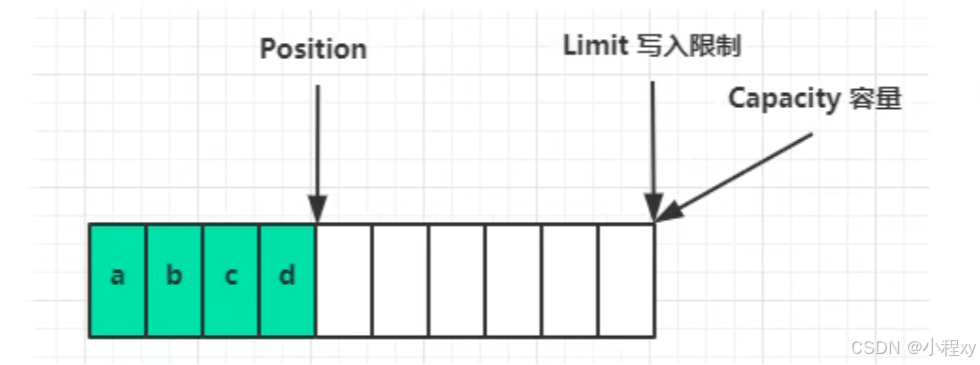
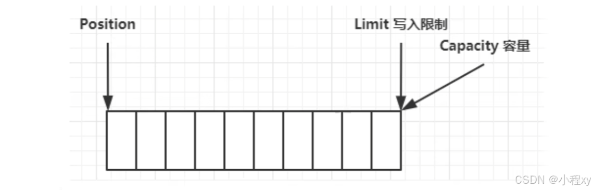

**Java NIO**（New I/O，新的输入输出）是 Java 1.4 引入的一套 I/O 库，相比传统的 **IO**（字节流和字符流），它主要用于处理高效的、非阻塞的 I/O 操作，特别是在需要处理大规模数据或高并发的场景中表现突出。Java NIO 提供了非阻塞模式、内存映射文件、缓冲区等一系列增强功能，适用于现代的高性能应用。

## 一、I/O模型

在 Java 中，传统的 **IO**（字节流和字符流）是 **阻塞** 的，意味着每次读写操作都会阻塞当前线程，直到数据完全读取或写入。对于高并发场景，这种方式的效率较低。

### 1. BIO (Blocking I/O)

BIO 是 Java 的传统 I/O 模型，简称阻塞 I/O。
- **同步阻塞**：数据读写操作会阻塞当前线程，直到操作完成。例如，读取一个 Socket 的数据时，如果数据没有到达，线程会一直等待。
- **线程与连接一对一**：每个客户端连接都需要一个独立的线程进行处理。如果有大量的并发连接，就需要创建大量线程，可能导致线程资源耗尽。
- **适用场景**：适合客户端连接数较少的场景，比如早期的 Web 应用。


### 2. NIO (New I/O)

NIO 是 Java 1.4 引入的非阻塞 I/O 模型，提供更高效的多路复用能力。
- **同步非阻塞**：线程不会因为读写操作被阻塞，数据准备好时才会被处理。线程可以同时管理多个通道（Channel）。
- **单线程处理多连接**：通过 `Selector` 实现多路复用，一个线程可以处理多个连接，提高了线程利用率。
 - **缓冲区（Buffer）**：NIO 使用缓冲区（Buffer）来读写数据，而不是直接操作流。缓冲区使得数据的读写更加高效。
- **适用场景**：适合高并发场景，比如聊天服务器、大型 Web 服务。
- 

### 3. BIO 和 NIO

| 特性         | BIO (Blocking I/O)               | NIO (New I/O)                |
| ------------ | -------------------------------- | ---------------------------- |
| **编程模型** | 阻塞式编程                       | 非阻塞式编程                 |
| **线程模型** | 一个线程处理一个连接             | 一个线程可处理多个连接       |
| **性能**     | 高并发时线程数可能爆炸，性能较低 | 高并发时性能更优，占用资源少 |
| **数据处理** | 以流（Stream）为单位处理数据     | 以块（Buffer）为单位处理数据 |
| **适用场景** | 连接数少，业务逻辑复杂           | 高并发、多连接场景           |


### 4. I/O 模型

I/O 模型描述了应用程序与内核之间进行输入/输出操作的方式，尤其是网络通信场景中的数据收发。I/O 模型的选择直接影响程序的性能、复杂度和适用场景。

常见的 I/O 模型有以下五种：
1. 阻塞 I/O (Blocking I/O)
2. 非阻塞 I/O (Non-blocking I/O)
3. I/O 多路复用 (I/O Multiplexing)
4. 信号驱动 I/O (Signal-driven I/O)
5. 异步 I/O (Asynchronous I/O)


#### 4.1 I/O 操作的两大阶段

I/O 操作通常分为两个阶段：
1. **数据准备**：
   - 数据可能来自网络、磁盘或其他设备。
   - 数据准备完成后才能进行读取操作。
2. **数据传输**：
   - 内核将准备好的数据拷贝到用户进程中。

每种 I/O 模型在这两个阶段处理方式不同，导致了行为的差异。


- **阻塞 I/O (Blocking I/O)**

	**特点**：
	- 应用程序调用某个 I/O 操作（如 `read()`），会被阻塞，直到数据准备完成并拷贝到用户进程中。
	- 整个过程中，线程被挂起，无法执行其他任务。
	
	```
	应用程序 ---------> 调用 I/O ---------> 阻塞
	              数据准备中...
	              数据拷贝中...
	完成后返回。
	```
	
- **非阻塞 I/O (Non-blocking I/O)**
	
	**特点**：
	- 应用程序调用 I/O 操作时，如果数据尚未准备好，立即返回错误或空结果。
	- 应用程序需要反复尝试（轮询）以检测数据是否准备完成。
	
	```
	应用程序 ---------> 调用 I/O ---------> 立即返回
	              (数据未准备好，返回空)
	              (重复调用，直到数据准备完成)
	完成后继续。
	```
	
- **I/O 多路复用 (I/O Multiplexing)**

	**特点**：
	- 使用一个线程通过 `select` 或 `poll` 等系统调用，监听多个 I/O 通道的状态。
	- 当某个通道准备好时，应用程序再执行 I/O 操作。
	
	```
	应用程序 ---------> 调用 select/poll ---------> 阻塞
	              等待 I/O 状态变化
	              数据准备好，返回就绪通道
	执行 I/O 操作。
	```


-  **信号驱动 I/O (Signal-driven I/O)**
	
	**特点**：
	- 应用程序通过注册信号处理程序，非阻塞地等待内核发出信号。
	- 当数据准备好时，内核发送信号通知应用程序处理。
	
	```
	应用程序 ---------> 注册信号处理 ---------> 返回
	              等待内核信号通知
	信号到达后，执行 I/O 操作。
	```
- **异步 I/O (Asynchronous I/O)**

	**特点**：
	- 应用程序发起 I/O 操作后立即返回，内核负责完成数据准备和传输。
	- 当操作完成时，内核通知应用程序。
	
	```
	应用程序 ---------> 发起异步 I/O ---------> 返回
	              内核处理数据准备和拷贝
	              操作完成后通知应用程序。
	```

#### 4.2 模型对比

| 模型             | 阻塞阶段           | 非阻塞能力 | 是否高效       |
| ---------------- | ------------------ | ---------- | -------------- |
| **阻塞 I/O**     | 数据准备、数据拷贝 | 否         | 低             |
| **非阻塞 I/O**   | 无                 | 是         | 较低（需轮询） |
| **I/O 多路复用** | 等待数据准备       | 是         | 较高           |
| **信号驱动 I/O** | 等待数据准备       | 是         | 较高           |
| **异步 I/O**     | 无                 | 是         | 最高           |


下面了解一下 NIO 中的一些 低级api 。（NIO 中也包含一些高级抽象的api，比如 Files、Paths、Path等。）高级抽象 api 可参考链接文章 [java 文件的操作（Path、Paths、Files）](https://blog.csdn.net/m0_74065705/article/details/142899232?spm=1001.2014.3001.5501https://blog.csdn.net/m0_74065705/article/details/142899232?spm=1001.2014.3001.5501)


## 二、NIO 的三大组件

1. **Channel（通道）**  
   NIO 中的数据流通过 **`Channel`** 进行读写，Channel 是一个双向的通信管道，既可以读取数据，也可以写入数据。与传统 IO 中的流不同，Channel 更加高效，支持直接的内存映射操作。可以往Buffer中读写数据。

   常见的 Channel 类型：
   - **FileChannel**：用于文件的读取和写入。会将数据缓存，不是立刻写入磁盘。可以调用force（true）方法将文件内容和元数文件的权限等信息立刻写入磁盘
   - **SocketChannel**：用于客户端与服务器之间的网络通信。
   - **ServerSocketChannel**：用于接受客户端连接的通道。
   - **DatagramChannel**：用于 UDP 网络通信。

2. **Buffer（缓冲区）**  
   在 NIO 中，数据的读写不是直接操作流，而是通过缓冲区（Buffer）。缓冲区实际上是一个容器，用于存储数据。

   常见的缓冲区类型：
   - **ByteBuffer**：字节缓冲区，用于存储字节数据。
   - **CharBuffer**：字符缓冲区，用于存储字符数据。
   - **IntBuffer**、**FloatBuffer**、**LongBuffer** 等：用于存储整数、浮点数、长整数等类型的数据。

   **Buffer** 的一些常用方法：
   - `flip()`：将缓冲区从写模式切换到读模式。
   - `clear()`：清空缓冲区，准备重用。
   - `position()`：返回缓冲区当前的位置。
   - `limit()`：设置缓冲区的限制，定义最大读取或写入的位置。

3. **Selector（选择器）**  
   选择器是 NIO 中非常重要的概念。它用于实现非阻塞 I/O，允许一个线程同时管理多个 Channel。当一个或多个通道准备好进行读写时，Selector 可以通过检查这些通道的状态来决定应该处理哪些通道，避免每个通道都由一个线程处理，节省资源。


4. **Non-blocking I/O（非阻塞 I/O）**  
   NIO 提供了非阻塞 I/O 模式，允许线程在等待 I/O 操作完成时继续做其他工作。例如，`SocketChannel` 可以在没有数据时不会阻塞线程，而是立即返回，线程可以选择做其他事情或者轮询其他通道。

   通过 `Selector` 和 `Channel` 配合使用，Java 可以非常高效地处理大量并发连接。

### 1. Buffer

这里我们以 ByteBuffer 来举例

#### 1.1 NIO 文件读写

读取一个文本文件，并输出里面的字符。Buffer 可读可写，因此有两种模式，读模式和写模式，需要手动切换
```java
public class Main {
   public static void main(String[] args) throws IOException {
   		// 创建一个可读的 channel
       try (FileChannel fileChannel = new FileInputStream("test.txt").getChannel()) {
           // 创建一个buff，容量为10字节, 容量固定不可变。初始状态为 写 模式
           ByteBuffer buffer = ByteBuffer.allocate(10);
           // ByteBuffer buffer = ByteBuffer.allocateDirect(10);
           while (true) {
               // 从管道中读取数据，向 buffer 中写入。（read是相对于管道的，从管道中读）
               int len = fileChannel.read(buffer);
               if (len == -1) {    // len是读取到的字节数, 如果没有去读到返回 -1
                   break;
               }

               buffer.flip();  // 切换成 读 模式
               while (buffer.hasRemaining()) {
                   System.out.println((char) buffer.get());
               }
               buffer.clear(); // 切换成 写 模式
               // buffer.compact(); // 切换成 写 模式
           }
       }
   }
}
```

下面我们对代码进行讲解：

- **`flip()`**
    - 用于将 Buffer 从写模式切换到读模式。
        1. limit 被设置为当前的 position（即写入数据的数量）。
        2. position 被重置为 0，表示从头开始读。
- **`clear()`**
    - 用于清空缓冲区，从读模式切换回写模式
        1. limit 被设置为缓冲区的 capacity。
        2. position 被重置为 0。
- **`compact()`**
  - 用于将 `Buffer` 从读模式切换回写模式，同时保留未读完的数据。
    1. 将当前 **`position` 到 `limit`** 之间的未读数据复制到缓冲区的起始位置。
    2. **`position`** 被设置为未读数据的末尾（即未读数据的长度）。
    3. **`limit`** 被设置为缓冲区的容量（`capacity`），为写入新数据做好准备。
- 绘图的方式演示上面过程
	一开始没有读入时的 buffer。
	
	读入4个字节后的 buffer
	
	当用 `flip` 切换到 读模式 后
	
	通过 `clear` 切换到 写模式 时，如果之前的buffer中还存在未读取的数据，会清除掉。
	
	
	通过 `compact` 切换到 写模式 时，之前没有读取完的会被压缩到前面，position 从压缩后的位置开始写入。
	
- `allocate` 和 `allocateDirect`
	```java
	System.out.println(ByteBuffer.allocate(10).getClass());
	System.out.println(ByteBuffer.allocateDirect(10).getClass());
	// 输出 
	// class java.nio.HeapByteBuffer	// java堆内存，读写效率较低，受到GC的影响
	// class java.nio.DirectByteBuffer  // 操作系统的内存，读写效率高（少一次拷贝），不会受GC影响，分配的效率低
	```

#### 1.2 ByteBuffer 常用方法

##### 1. 读写数据

- **`get()`**
  - 从当前 `position` 读取一个字节，然后 `position++`。


- **`get(int index)`**
  - 从指定索引位置读取一个字节，不会影响 `position`。


- **`get(byte[] dst)`**
  - 从缓冲区读取字节数组到 dst 中，从当前 `position` 开始。
  - **示例**：
    ```java
    byte[] dst = new byte[4];
    buffer.get(dst); // 读取数据到数组
    ```

- **`put(byte b)`**
  
  - 将一个字节写入当前 `position`，然后 `position++`。


- **`put(byte[] src)`**
  - 将字节数组写入缓冲区，从当前 `position` 开始。
  - **示例**：
    ```java
    byte[] data = {65, 66, 67};
    buffer.put(data);
    ```

- **`put(int index, byte b)`**
  - 在指定索引位置写入字节，不会影响 `position`。
  - **示例**：
    ```java
    buffer.put(2, (byte) 70); // 在索引2处写入字节 'F'
    ```

---


##### 2. 状态查询

- **`capacity()`**
  - 返回缓冲区的总容量（固定）。


- **`position()`**
  - 获取当前操作的位置。

- **`limit()`**
  - 获取缓冲区的上限（写模式为容量，读模式为有效数据大小）。


- **`remaining()`**
  - 返回 `limit - position`，即剩余可操作的字节数。

- **`hasRemaining()`**
  - 检查是否还有剩余数据可以读取。


---

##### 3. 数据操作

- **`mark()` 和 `reset()`**
  
  - `mark()` 标记当前 `position`，`reset()` 恢复到标记位置。
  - **示例**：
    ```java
    buffer.mark();
    // 操作 buffer
    buffer.reset(); // 回到 mark 的位置
    ```
  
- **`rewind()`**
  - 将 `position` 重置为 `0`，通常用于重新读取缓冲区数据。

- **`duplicate()`**
  - 创建一个与当前缓冲区共享数据的副本（位置、限制等独立）。


- **`slice()`**
  - 创建一个共享数据的子缓冲区，从当前 `position` 到 `limit`。


## 三、文件编程

### 1. 文件channel

```java
FileChannel channel = new FileInputStream("test,txt").getChannel();
FileChannel channel = new RandomAccessFile("test.txt", "rw").getChannel();
FileChannel channel = new FileOutputStream("test.txt").getChannel();
```
- `"r"`：以只读模式打开文件。
- `"rw"`：以读写模式打开文件。如果文件不存在，则创建一个新文件。


| 方式               | 用途                   |
| ------------------ | ---------------------- |
| `FileInputStream`  | 只读文件               |
| `FileOutputStream` | 只写文件               |
| `RandomAccessFile` | 读写文件，支持随机访问 |


### 2. 字符串 和 `ByteBuffer`的转换

```java
// 1 插入数据后依然是写模式
ByteBuffer buffer1 = ByteBuffer.allocate(10);
buffer1.put("hello".getBytes());
System.out.println(buffer1);

 // 2 插入数据后会变为 读模式
 ByteBuffer buffer2;
 buffer2 = StandardCharsets.UTF_8.encode("world");
 System.out.println(buffer2);

 // 3 插入数据后会变为 读模式
 ByteBuffer buffer3;
 buffer3 = ByteBuffer.wrap("hello world".getBytes());
 System.out.println(buffer3);
```

将 `ByteBuffer` 转成 字符串
```java
StandardCharsets.UTF_8.decode(buffer1);
```

### 3.  分散读取 和 集中写入

- 分散读取
	```java
	ByteBuffer buffer1;
   ByteBuffer buffer2;
   ByteBuffer buffer3;
   try (FileChannel channel = new FileInputStream("test.txt").getChannel()) {
       // test.txt: helloworld123
       buffer1 = ByteBuffer.allocate(5);
       buffer2 = ByteBuffer.allocate(5);
       buffer3 = ByteBuffer.allocate(3);
	
       channel.read(new ByteBuffer[]{buffer1, buffer2, buffer3});
   }
	   // buffer1: hello, buffer2:world, buffer3:123
	```


- 集中写入
	```java
	try (FileChannel channel = new FileOutputStream("test.txt").getChannel()) {
	    ByteBuffer buffer1 = ByteBuffer.allocate(5);
	    ByteBuffer buffer2 = ByteBuffer.allocate(5);
	    ByteBuffer buffer3 = ByteBuffer.allocate(3);
	
	    buffer1.put("hello".getBytes());
	    buffer1.flip();
	
	    buffer2 = ByteBuffer.wrap("world".getBytes());
	    buffer3 = StandardCharsets.UTF_8.encode("hello world");
	
	    channel.write(new ByteBuffer[]{buffer1, buffer2, buffer3});
	}
	```

### 4. 粘包半包

粘包：指多条消息的数据被粘在一起，接收端在读取时不能正确区分消息的边界。
半包：指一条消息的数据被拆分到多个 TCP 数据包中，接收端读取时只能读取到部分数据。
```java
public class Main {
    public static void main(String[] args) throws IOException {
        ByteBuffer buffer = ByteBuffer.allocate(36);
        buffer.put("hello\n".getBytes());
        buffer.put("world\nhel".getBytes());	// 粘包
        split(buffer);

        buffer.put("lo world\n".getBytes());	// 半包
        split(buffer);
    }

    public static void split(ByteBuffer buffer) {
        buffer.flip();
        for (int i = 0; i < buffer.limit();i ++) {
            if (buffer.get(i) == '\n') {	// get(i) 不会改变 position
                int len = i + 1 - buffer.position();
                ByteBuffer bf = ByteBuffer.allocate(len);
                for (int j = 0; j < len;j ++) {
                    bf.put(buffer.get());
                }
                bf.flip();
                System.out.println(StandardCharsets.UTF_8.decode(bf));
                // 最终输出了三次：hello\n  world\n  hello world\n
            }
        }
        buffer.compact();
    }
}
```


## 四、网络编程

Java NIO（New I/O）是 Java 提供的一种高性能、非阻塞的 IO 模型，适用于开发高并发的网络应用程序。

### 1. 网络Channel

- #### `SocketChannel`：TCP 客户端通道。
	用于 TCP 客户端通信。它是一个可读可写的通道，可以连接到远程地址并与服务端进行通信。
- **常用方法**
	- `open()`：打开一个新的 `SocketChannel`。
	- `connect(SocketAddress remote)`：连接到远程服务器。
	- `finishConnect()`：完成非阻塞连接。
	- `read(ByteBuffer dst)`：从通道中读取数据到缓冲区。
	- `write(ByteBuffer src)`：将缓冲区的数据写入通道。

- #### `ServerSocketChannel`：TCP 服务端通道。
	用于创建 TCP 服务端，用于监听客户端的连接请求。它是一个面向连接的通道。
- **常用方法**
	- `open()`：创建一个新的 `ServerSocketChannel`。
	- `bind(SocketAddress address)`：绑定到指定的地址和端口。
	- `accept()`：接受一个客户端连接（可能会阻塞）。
	- `configureBlocking(boolean block)`：设置为非阻塞模式。
	- `register(Selector sel, int ops)`：注册到 Selector，监听事件。

- #### `DatagramChannel`：UDP 通道。
	DatagramChannel 用于 UDP 网络编程。与 SocketChannel 和 ServerSocketChannel 不同，DatagramChannel 是无连接的通道。
- **常用方法**
	- `open()`：创建一个新的 `DatagramChannel`。
	- `bind(SocketAddress address)`：绑定到本地地址和端口。
	- `send(ByteBuffer src, SocketAddress target)`：发送数据到目标地址。
	- `receive(ByteBuffer dst)`：接收数据到缓冲区。
	- `connect(SocketAddress remote)`：连接到目标地址，简化数据发送和接收。
	- `read(ByteBuffer dst)` 和 `write(ByteBuffer src)`：用于连接模式的读写。

| **特性**         | **SocketChannel** | **ServerSocketChannel** | **DatagramChannel** |
| ---------------- | ----------------- | ----------------------- | ------------------- |
| **协议**         | TCP               | TCP                     | UDP                 |
| **连接**         | 需要连接到服务器  | 监听并接受客户端连接    | 无需连接            |
| **阻塞模式**     | 支持阻塞和非阻塞  | 支持阻塞和非阻塞        | 支持阻塞和非阻塞    |
| **适用场景**     | **客户端通信**    | **服务端监听**          | 小型数据包传输      |
| **数据传输方式** | 流式传输          | 流式传输                | 数据报文传输        |

### 2. 理解阻塞和非阻塞

下面代码为一单线程服务端demo代码，代码是阻塞模式。（当把 configureBlocking 注释关掉后是非阻塞模式。）

当为阻塞模式下，如果没有客户端发送连接 `ssn.accept()` 会一直阻塞在这里，当有一个客户端发送连接后，代码往下执行会在 `channel.read(bf)` 阻塞，直到连接的客户端发送消息，如果此时有新的客户端发送连接，是不能正常 accept 的，因为代码阻塞在了 `channel.read(bf)`。（除非用多线程）
	
这里如果把：`ServerSocketChannel ` 设置成非阻塞，那么 `ssn.accept()` 就不会阻塞，而是执行接下来的代码，当客户端连接时 `sc` 为 `SocketChannel`，没有连接时是null
同样，如果把 `SocketChannel` 设置成非阻塞，那么 `channel.read(bf)` 就不会阻塞。

```java
public class Service {
    public static void main(String[] args) throws IOException {
        ByteBuffer bf = ByteBuffer.allocate(16);
        ServerSocketChannel ssn = ServerSocketChannel.open();
        // ssn.configureBlocking(false);
        ssn.bind(new InetSocketAddress(8888));

        List<SocketChannel> scs = new ArrayList<>();
        while (true) {
            SocketChannel sc = ssn.accept();	// 阻塞
            // sc.configureBlocking(false);
            scs.add(sc);
            for (SocketChannel channel : scs) {
                int len = channel.read(bf);		// 阻塞
                bf.flip();
                System.out.println(StandardCharsets.UTF_8.decode(bf));
                bf.compact();
            }
        }
    }
}
```
上面代码在非阻塞模式下会一直在 while 循环中执行，如果加上 	`System.out.println("hello");`, 可以发现一直在输出 `hello`，显然这样非常浪费资源，而 `Selector` 可以解决这个问题。

### 3. Selector

`Selector` 是 Java NIO 实现非阻塞 IO 的关键，允许一个线程同时监控多个通道的事件（如读、写、连接等）。可以通过它检测通道是否有就绪的事件（如可读、可写等）当不存在就绪事件时阻塞代码，有事件时取消阻塞。（多路复用）

Selector 的核心方法：
- `select()`：阻塞直到至少有一个通道准备好。
- `selectNow()`：非阻塞地获取准备好的通道数量。
- `selectedKeys()`：返回当前已经准备就绪的事件的集合。它表示那些已经被 Selector 检测到的、注册了感兴趣事件并且触发了这些事件的通道（Channel）对应的 SelectionKey 对象。
- `register()`：将通道注册到 Selector。

---

### 4. SelectionKey

用于表示一个通道（Channel）和选择器（Selector）之间的注册关系，同时维护该关系的状态和事件。

- `OP_READ`：通道可读。
- `OP_WRITE`：通道可写。
- `OP_CONNECT`：通道完成连接。
- `OP_ACCEPT`：服务端通道准备接受连接。

常用方法：

- #### **1. `interestOps()`**  
	`interestOps()` 方法返回一个整数值，表示当前 `SelectionKey` 关注的操作类型。通过此方法，可以检查或修改通道所关心的事件。
	
	##### **常用操作常量**：
	- `SelectionKey.OP_READ`：关注读事件，表示通道可以读取数据。
	- `SelectionKey.OP_WRITE`：关注写事件，表示通道可以写入数据。
	- `SelectionKey.OP_CONNECT`：关注连接事件，表示客户端通道连接成功，可以进行数据传输。
	- `SelectionKey.OP_ACCEPT`：关注接受连接事件，表示服务器通道可以接受客户端的连接请求。
	
	##### **示例**：
	```java
	int ops = key.interestOps();
	if ((ops & SelectionKey.OP_READ) == SelectionKey.OP_READ) {
	    System.out.println("Channel is ready to read");
	}
	```

- #### **2. `interestOps(int ops)`**  
	此方法用于设置 `SelectionKey` 关注的操作事件。你可以修改通道所关心的事件，通常用于动态调整事件类型。
	
	```java
	// 修改 interestOps，关注 OP_READ 和 OP_WRITE 事件
	key.interestOps(SelectionKey.OP_READ | SelectionKey.OP_WRITE);
	```
	
	---

- #### **3. `readyOps()`**  
	`readyOps()` 方法返回当前通道已经准备好的操作类型。与 `interestOps()` 不同，`readyOps()` 表示的是在 `Selector` 上已经就绪的事件。它是由 `select()` 或 `selectNow()` 方法返回的结果。
	
	#### **示例**：
	```java
	int readyOps = key.readyOps();
	if ((readyOps & SelectionKey.OP_READ) == SelectionKey.OP_READ) {
	    System.out.println("Channel is ready to read data");
	}
	```
- #### **4. `channel()`**  
	`channel()` 方法返回与当前 `SelectionKey` 关联的通道（`Channel`）。通过此方法，你可以访问和操作注册到 `Selector` 的通道。

- #### **5. `cancel()`**  
	取消当前通道（Channel）在 Selector 上的注册。取消后，该通道将不再由 `Selector` 监控。

- #### 6. **`isAcceptable()`**
	当一个 `ServerSocketChannel` 注册到选择器中，监听 `OP_ACCEPT` 事件时，调用此方法以确定是否可以安全地接受一个新连接。


- #### 7. **`isConnectable()`**
	在非阻塞模式下，当一个 `SocketChannel` 连接到远程服务器时，检查是否完成连接。

- #### 8. **`isReadable()`**
	用于检查 `SocketChannel` 是否有数据可供读取。


- #### 9. **`isWritable()`**
	在非阻塞模式下，用于检查是否可以向通道写入数据。


### 5. 用Selector优化 `4、1.2` 非阻塞代码

这里我们优化之前代码，之前代码的问题是，当非阻塞时，`while` 循环中一直在执行，占用大量 cpu 等资源，这里我们用 `selector` 来管理之前的 `ServerSocketChannel` 和 `SocketChannel` ，使他们只有在自身事件被触发时才会执行；同时我们优化了服务端应对客户端主动或被动断开的情况，具体流程才考下面代码

补充：客户端除了发送数据会触发read事件，正常、异常关闭也会触发read事件，所以下面代码中对关闭进行了处理

```java
public class Service {
    public static void main(String[] args) throws IOException {
        ServerSocketChannel ssn = ServerSocketChannel.open();
        ssn.configureBlocking(false);   // 非阻塞
        ssn.bind(new InetSocketAddress(8888));
        Selector selector = Selector.open();    // 创建一个 selector
        // 将 ssn 注册到selector
        SelectionKey ssnKey = ssn.register(selector, SelectionKey.OP_ACCEPT); // 指定通道（Channel）感兴趣的事件类型的: accept

        while (true) {
            selector.select();  // 无事件时阻塞代码

            Iterator<SelectionKey> iterator = selector.selectedKeys().iterator();
            while (iterator.hasNext()) {
                SelectionKey key = iterator.next();
                iterator.remove();  // 删除我们当前要处理的 SelectionKey，
                if (key.isAcceptable()) {
                    ServerSocketChannel channel = (ServerSocketChannel) key.channel();
                    SocketChannel sc = channel.accept();    // 接受客户端连接
                    sc.configureBlocking(false);    // 将连接到的客户端 SocketChannel 注册到selector
                    sc.register(selector, SelectionKey.OP_READ);
                } else if (key.isReadable()) {
                    ByteBuffer buffer = ByteBuffer.allocate(16);
                    SocketChannel sc = (SocketChannel) key.channel();
                    try {
                        int len = sc.read(buffer);
                        if (len < 0) {      // 当客户端主动关闭连接时，会返回 -1，需要处理 key，不然会让selector的事件一直处于激活状态
                            key.cancel();
                        }
                    } catch (IOException e) {
                        key.cancel();   // 当客户端因为异常断开连接时，会导致服务端抛出 IO 异常，手动处理key
                    }
                    buffer.flip();
                    System.out.println(StandardCharsets.UTF_8.decode(buffer));
                    buffer.clear();
                }
            }
        }
    }
}
```

### 6. Selector优化`3、4`中的粘包和半包

上面代码中我们将 `channle` 注册到 `selector` 中时，只用到了两个参数，其实 `register` 也就第三个参数，第三个参数可以接受一个数组，作为 `attachment` 属性。
```java
SocketChannel sc = channel.accept();
ByteBuffer buffer = ByteBuffer.allocate(1024);
sc.register(selector, SelectionKey.OP_READ, buffer);	// 注册

SelectionKey key = iterator.next();
ByteBuffer attachment = (ByteBuffer) key.attachment();	// 获取数组
key.attach(newBuffer);	// 可以通过 这个更新 attachment 属性
```

在之前解决粘包和半包中，我们通过让客户端在每段消息中添加特殊符号 `\n`。当没有遇到特殊符号时，我们用 `compact` 让字节往数组前面压缩，但是这存在一个问题，如果一段消息的长度超过我们 `buffer` 的长度时，就会导致这段消息丢失。

要解决这个问题就需要在 `buffer` 容量不足时创建一个新的 buffer，把之前的 buffer 内容拷贝进来。我们在每个客户端注册金 selector 时给他们各自分配一个 buffer，在 `position == limit` 相同时(容量不足)进行扩容操作即可。这里必须用attachment属性，因为他可以确保每个channel都有一个buufer。

总结：阻塞io，非阻塞io，多路复用io

| **特点**         | **阻塞 I/O**                      | **非阻塞 I/O**               | **多路复用 I/O**                      |
| ---------------- | --------------------------------- | ---------------------------- | ------------------------------------- |
| **核心机制**     | 每个 I/O 操作会阻塞线程，直到完成 | 非阻塞通道立即返回，无需等待 | 一个线程管理多个通道的状态            |
| **与线程的关系** | 一个线程管理一个通道              | 一个线程管理一个通道         | 一个线程管理多个通道（使用 Selector） |
| **效率对比**     | 每个连接占用一个线程，效率低      | 需要对每个通道轮询，效率较低 | 通过 Selector 集中管理，效率更高      |
| **应用场景**     | 小型应用或低并发场景              | 小型 I/O 任务，低并发        | 高并发网络服务，如 HTTP、WebSocket    |


## 五、多线程网络编程

这里我们写 一个用来接受连接的线程和2个处理读写的线程 的多线程demo来掌握nio中多线程中遇到的常见问题

最终效果如下，一个负责接受连接的线程，两个处理读写的线程，他们三个线程中都有一个 `selector` 来实现多路复用。


### 1. 代码1

- Boss线程。
	
	```java
	public class Service {
	    public static void main(String[] args) throws IOException {
	        ServerSocketChannel ssc = ServerSocketChannel.open();
	        ssc.configureBlocking(false);
	        ssc.bind(new InetSocketAddress(8888));
	        Selector selector = Selector.open();
	        ssc.register(selector, SelectionKey.OP_ACCEPT);
	
	        Worker worker1 = new Worker("worker1");
	        
	        while (true) {
	            selector.select();
	
	            Iterator<SelectionKey> iter = selector.selectedKeys().iterator();
	            while (iter.hasNext()) {
	                SelectionKey key = iter.next();
	                iter.remove();
	
	                if (key.isAcceptable()) {
	                    ServerSocketChannel channel = (ServerSocketChannel) key.channel();
	                    SocketChannel sc = channel.accept();
	                    sc.configureBlocking(false);
						worker1.register();		// <---- 
	                    sc.register(worker1.selector, SelectionKey.OP_READ);	// <----
	                }
	            }
	        }
	    }
	}
	```
	
- worker 代码
	```java
	public class Worker implements Runnable {
	    public Thread thread;
	    public Selector selector;
	    public String name;
	    public static Boolean flag = true;
	
	    Worker(String name) {
	        this.name = name;
	    }
	
	    public void register() throws IOException {
	        if (flag) {
	            flag = false;
	            this.thread = new Thread(this, name);
	            this.selector = Selector.open();
	            this.thread.start();
	        }
	    }
	
	    @Override
	    public void run() {
	        while (true) {
	            try {
	                selector.select();
	            } catch (IOException e) {
	                throw new RuntimeException(e);
	            }
	            Iterator<SelectionKey> iter = selector.selectedKeys().iterator();
	            while (iter.hasNext()) {
	                SelectionKey key = iter.next();
	                iter.remove();
	
	                if (key.isReadable()) {
	                    ByteBuffer buffer = ByteBuffer.allocate(16);
	                    SocketChannel channel = (SocketChannel) key.channel();
	                    try {
	                        int len = channel.read(buffer);
	                        if (len < 0) {
	                            key.cancel();
	                            channel.close();
	                        }
	                        buffer.flip();
	                        System.out.println(StandardCharsets.UTF_8.decode(buffer));
	                        buffer.clear();
	                    } catch (IOException e) {
	                        key.cancel();
	                    }
	                }
	            }
	        }
	    }
	}
	```

**代码1中存在的问题：**

由于是多线程，这两个的执行顺序是不可控的，如果Boss代码中的 `worker1.register();` 先于 `sc.register(worker1.selector, SelectionKey.OP_READ);` 执行，就会导致代码在 `Worker` `run` 方法的 `selector.select();` 阻塞住，会导致下面的 `sc.register(worker1.selector, SelectionKey.OP_READ);` 代码不会执行成功。


### 2. 解决代码1问题

对于代码1中的问题，我们可以把注册到 `selector` 这个任务弄到 `worker` 线程中的 `run` 方法中，而不是在 建立连接的线程中执行，不同线程的执行顺序是不可控的，弄到同一线程就可控了

- 接受连接的线程。

	```java
	package thread;
	
	import java.io.IOException;
	import java.net.InetSocketAddress;
	import java.nio.channels.*;
	import java.util.Iterator;
	
	public class Service {
	    public static void main(String[] args) throws IOException {
	        ServerSocketChannel ssc = ServerSocketChannel.open();
	        ssc.configureBlocking(false);
	        ssc.bind(new InetSocketAddress(8888));
	        Selector selector = Selector.open();
	        ssc.register(selector, SelectionKey.OP_ACCEPT);
	
	        Worker worker1 = new Worker("worker1");
	//        AtomicInteger count = new AtomicInteger(0);
	        while (true) {
	            selector.select();
	
	            Iterator<SelectionKey> iter = selector.selectedKeys().iterator();
	            while (iter.hasNext()) {
	                SelectionKey key = iter.next();
	                iter.remove();
	
	                if (key.isAcceptable()) {
	                    ServerSocketChannel channel = (ServerSocketChannel) key.channel();
	                    SocketChannel sc = channel.accept();
	                    sc.configureBlocking(false);
	                    worker1.register(sc);
	                    // sc.register(worker1.selector, SelectionKey.OP_READ);
	                }
	            }
	        }
	    }
	}
	```

- worker 代码

	```java
	package thread;
	
	import java.io.IOException;
	import java.nio.ByteBuffer;
	import java.nio.channels.*;
	import java.nio.charset.StandardCharsets;
	import java.util.Iterator;
	import java.util.concurrent.ConcurrentLinkedQueue;
	
	public class Worker implements Runnable {
	    public Thread thread;
	    public Selector selector;
	    public String name;
	    public static Boolean flag = true;
	
	    private ConcurrentLinkedQueue<Runnable> queue = new ConcurrentLinkedQueue<>();
	
	    Worker(String name) {
	        this.name = name;
	    }
	
	    public void register(SocketChannel sc) throws IOException {
	        if (flag) {
	            flag = false;
	            this.thread = new Thread(this, name);
	            this.selector = Selector.open();
	            this.thread.start();
	        }
	
	        queue.add(  // 添加到消息队列中，方便下面run方法中调用
	                () -> {
	                    try {
	                        sc.register(selector, SelectionKey.OP_READ);
	                    } catch (ClosedChannelException e) {
	                        throw new RuntimeException(e);
	                    }
	                }
	        );
	        selector.wakeup();  // 唤醒 selector，使sc 成功注册到 selector 中
	    }
	
	    @Override
	    public void run() {
	        while (true) {
	            try {
	                selector.select();
	            } catch (IOException e) {
	                throw new RuntimeException(e);
	            }
	            Runnable poll = queue.poll();   // 从队头获取并移除第一个元素
	            if (poll != null) {
	                poll.run();
	            }
	            Iterator<SelectionKey> iter = selector.selectedKeys().iterator();
	            while (iter.hasNext()) {
	                SelectionKey key = iter.next();
	                iter.remove();
	
	                if (key.isReadable()) {
	                    ByteBuffer buffer = ByteBuffer.allocate(16);
	                    SocketChannel channel = (SocketChannel) key.channel();
	                    try {
	                        int len = channel.read(buffer);
	                        if (len < 0) {
	                            key.cancel();
	                            channel.close();
	                        }
	                        buffer.flip();
	                        System.out.println(StandardCharsets.UTF_8.decode(buffer));
	                        buffer.clear();
	                    } catch (IOException e) {
	                        key.cancel();
	                    }
	                }
	            }
	        }
	    }
	}
	```

## 六、零拷贝

所谓的【零拷贝】，并不是真正无拷贝，而是在不会拷贝重复数据到jvm内存中。


1. java本身并不具备IO读写能力，因此read方法调用后，要从java程序的用户态切换至内核态，去调用操作系统（Kernel）的读能力，将数据读入内核缓冲区。这期间用户线程阻塞，操作系统使用DMA（DirectMemory Access）来实现文件读，其间也不会使用 cpu

	>DMA 也可以理解为硬件单元，用来解放 cpu完成文件 I0

2. 从内核态切换回用户态，将数据从内核缓冲区读入用户缓冲区（即bytebuf），这期间cpu 会参与拷贝，无法利用DMA
3. 调用write方法，这时将数据从用户缓冲区（bytebuf）写入socket缓冲区，cpu会参与拷贝
4. 接下来要向网卡写数据，这项能力java又不具备，因此又得从用户态切换至内核态，调用操作系统的写能力，使用DMA将socket缓冲区的数据写入网卡，不会使用cpu


可以看到中间环节较多，java的IO实际不是物理设备级别的读写，而是缓存的复制，底层的真正读写是操作系统来完成的
- 用户态与内核态的切换发生了3次，这个操作比较重量级
- 数据拷贝了共4次

**优化：**
java中对应着两个channel调用transferTo/transferFrom方法拷贝数据


1. java调用transferTo方法后，要从java程序的用户态切换至内核态，使用DMA将数据读入内核缓冲区，会使用 cpu
2. 只会将一些offset和length信息拷入socket缓冲区，几乎无消耗
3. 使用DMA将内核缓冲区的数据写入网卡，不会使用cpu

```java
public class Service {
    public static void main(String[] args) throws IOException {
        ServerSocketChannel ssc = ServerSocketChannel.open();
        ssc.bind(new InetSocketAddress(8888));
        ssc.configureBlocking(false);
        Selector selector = Selector.open();
        ssc.register(selector, SelectionKey.OP_ACCEPT);

        while (true) {
            selector.select();

            Iterator<SelectionKey> iter = selector.selectedKeys().iterator();
            while ((iter.hasNext())) {
                SelectionKey key = iter.next();
                iter.remove();

                if (key.isAcceptable()) {
                    ServerSocketChannel channel = (ServerSocketChannel) key.channel();
                    SocketChannel sc = channel.accept();
                    sc.configureBlocking(false);
                    FileChannel fileChannel = FileChannel.open(Paths.get("test.txt"));
                    int position = 0;
                    int size = (int) fileChannel.size();
                    while (position < size) {	// 不需要再将文件读入到 buffer, 通过 sc.write(buffer)
                        position += fileChannel.transferTo(position, size - position, sc);
                    }
                    System.out.println("send ok");
                }
            }
        }
    }
}
```