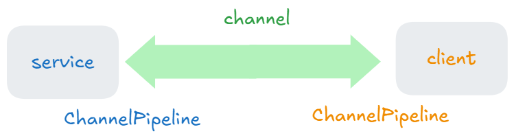
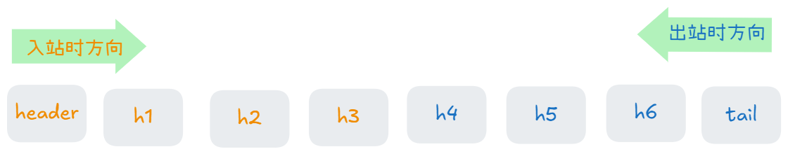
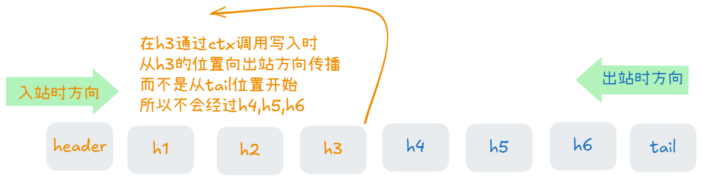
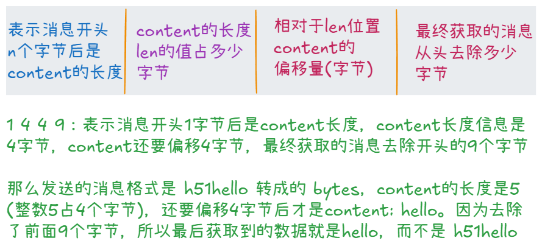

## 一、Netty基本内容

### 1.什么是netty？

Netty是一个异步的、基于事件驱动的网络应用框架，用于快速开发可维护、高性能的网络服务器和客户端。

异步的：

事件驱动：基于 Java NIO（Non-blocking I/O）的 `Selector` 实现的。

Netty 的核心设计目标是：
- **高性能**：充分利用 Java NIO 的非阻塞特性。
- **可扩展性**：适用于从简单客户端到复杂服务器的大多数网络应用场景。
- **易用性**：提供高度抽象的 API，屏蔽 NIO 编程的复杂细节。

### 2. Netty 的核心特性

1. **异步和事件驱动**  
   - Netty 的通信是基于事件驱动的，事件由事件循环管理。
   - 异步特性让 Netty 在处理高并发时具有天然优势，避免阻塞操作。

2. **高效的线程模型**  
   - Netty 使用少量线程处理大量连接，通过 I/O 多路复用机制实现。
   - 默认采用 Reactor 模式，分为 Boss 和 Worker 两类线程。

3. **灵活的编解码**  
   - 提供丰富的编码器和解码器支持，包括 Protobuf、HTTP、WebSocket 等。
   - 支持自定义协议解析。

4. **内存管理**  
   - 使用内置的 ByteBuf 代替 Java 的 ByteBuffer，提供动态扩展、零拷贝等高效操作。


### 3. 初识 netty

在讲解netty核心组件之前，我们先通过一个简单的示例，对netty有一个整体的认识。这个示例演示的是netty处理I/O请求的能力。

service代码中，我们配置了一个线程池 `group`，用来监听到客户端的建立请求(**connect**)和处理 I/O 操作，当客户端发送**connect**时服务端会调用`initChannel` 方法初始化客户端和服务端建立的管道 **channel**，之后服务端和客户端可以通过这个channel来发送和接受消息（由 `group` 处理）。而且这个channel中有ChannelPipeline，所有通过channel接收或发送的消息都会经过ChannelPipeline中添加的方法来处理。

这个示例中我们只添加了当触发读事件时，通过建立的channel来获取消息，并通过服务端的ChannelPipeline来解码打印输出。 (解码：二进制转成字符串)

```java
public class Service {
    public static void main(String[] args) {
		
		NioEventLoopGroup group = new NioEventLoopGroup();
        
        // 1. 配置和启动 Netty 服务端
        // ServerBootstrap 负责设置服务端的各项配置，包括线程池、通道类型、事件处理器等。
        new ServerBootstrap()
                // 2. 将 group(线程池) 配置到 ServerBootstrap 中。
                .group(group)
                // 3. 指定了服务端使用的通道类型 NioServerSocketChannel，用于监听客户端连接
                .channel(NioServerSocketChannel.class)
                // 4. 设置连接到服务端的每个客户端的通道（NioSocketChannel）如何初始化
                .childHandler(
                        new ChannelInitializer<NioSocketChannel>() {
                            // 6. 每当有新的客户端向服务端建立连接(connect)时，调用initChannel初始化服务端的ChannelPipeline
                            @Override
                            protected void initChannel(NioSocketChannel sc) throws Exception {
                                // 当服务端收到客户端信息时经过ChannelPipeline的处理
                                sc.pipeline().addLast(new StringDecoder());
                                sc.pipeline().addLast(new ChannelInboundHandlerAdapter() {
                                    @Override   // 处理接收到的消息
                                    public void channelRead(ChannelHandlerContext ctx, Object msg) throws Exception {
                                        System.out.println(msg);
                                    }
                                });
                            }
                        }
                )
                // 5. 绑定端口 8888 并启动服务
                .bind(8888);
    }
}
```


client代码中，我们配置了一个线程池group，添加了解码器，并在和服务端建立连接后通过channel发送 `hello world` 消息，通过channel 发送的消息会经过客户端的ChannelPipeline，ChannelPipeline对发送的消息进行了编码。(转成二进制)

```java
public class Client {
    public static void main(String[] args) throws InterruptedException {

        // 1. 创建一个 EventLoopGroup，用于客户端的 I/O 操作
        NioEventLoopGroup group = new NioEventLoopGroup();

        // 2. 配置和启动 Netty 客户端
        new Bootstrap()
                // 3. 将 group 配置到 Bootstrap 中，负责客户端的 I/O 操作
                .group(group)
                // 4. 指定了客户端使用的通道类型（NioSocketChannel 用于基于 NIO 的 socket 通信）
                .channel(NioSocketChannel.class)
                // 5. 配置客户端的 ChannelPipeline
                .handler(new ChannelInitializer<NioSocketChannel>() {
                    // 7. 当客户端向服务端建立连接(connect)时调用initChannel初始化客户端的ChannelPipeline
                    @Override
                    protected void initChannel(NioSocketChannel sc) throws Exception {
                        // 发送消息时执行 ChannelPipeline 中的操作
                        sc.pipeline().addLast(new StringEncoder());
                    }
                })
                // 6. 连接到服务端的 8888 端口
                .connect(new InetSocketAddress("localhost", 8888))
                // 8. 阻塞等待直到连接成功
                .sync()
                // 9. 获取客户端和服务端之间的 Channel
                .channel()
                // 10. 向服务端发送消息
                .writeAndFlush("hello world");

        // 12. 关闭客户端的 EventLoopGroup，释放资源
        group.shutdownGracefully();
    }
}
```

service、client、channel、channelPipeline的关系




## 二、Netty 的核心组件

### 1. EventLoop 和 EventLoopGroup

#### 1.1 基本概念

`EventLoop` 是一个 单线程的事件循环，用于处理 I/O 操作、普通任务和定时任务。

   - **I/O 事件处理**：`EventLoop` 会循环监听和处理 I/O 事件（如网络连接、数据读取、数据写入等）
   - **任务调度**：`EventLoop` 可以执行异步任务，通常是定时任务或需要在 I/O 线程上执行的任务。


`EventLoopGroup` 是多个 `EventLoop` 的容器，负责管理其生命周期，并为 Netty 中的 I/O 操作分配线程。

   - 负责创建、分配和管理多个 `EventLoop`， 每个 `EventLoop` 绑定一个独立的线程。

   - 为每个新连接（`Channel`）分配一个 `EventLoop`，保证 `Channel` 的事件总是由同一个 `EventLoop` 处理。

   - 将任务（普通任务、定时任务、I/O 事件）分配到 `EventLoop` 中运行。

#### **1.2 与 Channel 关联**

1. `EventLoopGroup` 管理多个 `EventLoop`， 每个 `EventLoop` 与一个线程绑定。
2. 一个 `EventLoop` 内部维护了一个 `selector` 来管理服务多个 `Channel`。
3. 每个 `Channel` 绑定到唯一的 `EventLoop`，从而保证线程安全。
	```plaintext
	              |-------(线程1)EventLoop1 ─── Channel1
	              |                   └─ Channel2
	              |                   └─ Channel3
	EventLoopGroup
	              |-------(线程2)EventLoop2 ─── Channel4
	                                 └─ Channel5
	```

#### 1.3 `EventLoopGroup` 的实现

`EventLoopGroup` 是一个接口，我们创建对象时要创建接口的实现，其中前三个可以处理 io操作、普通任务、定时任务，第四个不能处理I/O操作

| **实现**                | **描述**                                                     |
| ----------------------- | ------------------------------------------------------------ |
| `NioEventLoopGroup`     | 基于 Java NIO 的 Selector，实现跨平台支持。线程池，可指定线程数，默认是cpu核心数 * 2 |
| `EpollEventLoopGroup`   | 基于 Linux epoll 的实现，性能更高，但只支持 Linux。          |
| `KQueueEventLoopGroup`  | 基于 macOS 和 BSD 系统的 kqueue 实现，性能更高，但只支持这些平台。 |
| `DefaultEventLoopGroup` | 不处理 I/O 操作，仅用于普通任务调度或定时任务。只有一个线程  |

#### 1.4  常用方法

1. `EventLoop` 的方法

| **方法**                     | **功能**                                                     |
| ---------------------------- | ------------------------------------------------------------ |
| `next()`                     | 获取当前 `EventLoop` 的下一个 `EventLoop`，通常用于轮询分配。 |
| `submit`                     | 提交一个有返回值的任务到当前的 `EventLoop` 中，返回一个 `Future` 用于获取结果。 |
| `execute(Runnable task)`     | 提交一个任务到当前 `EventLoop` 的任务队列中执行。            |
| `schedule`                   | 提交一个延迟执行的任务到当前 `EventLoop` 的任务队列中执行。  |
| `scheduleAtFixedRate`        | 提交一个周期性任务，每隔固定时间间隔执行。                   |
| `scheduleWithFixedDelay`     | 提交一个任务，每次执行完成后等待固定延迟时间再执行下一次。   |
| `parent()`                   | 获取当前 `EventLoop` 所属的 `EventLoopGroup`。               |
| `register(Channel channel)`  | 将一个 `Channel` 注册到当前 `EventLoop`，并返回异步结果 `ChannelFuture`。 |
| `inEventLoop()`              | 判断当前线程是否属于此 `EventLoop`。                         |
| `inEventLoop(Thread thread)` | 判断指定线程是否属于此 `EventLoop`。                         |
| `shutdownGracefully()`       | 优雅地关闭当前 `EventLoop`，完成已有任务并释放资源。         |

2. `EventLoopGrop` 的方法

| **方法**                 | **功能**                                                     |
| ------------------------ | ------------------------------------------------------------ |
| `next()`                 | 获取一个 `EventLoop`，通常采用轮询方式分配。                 |
| `execute(Runnable task)` | 提交一个任务到某个 `EventLoop` 的任务队列中。                |
| `schedule()`             | 提交一个延迟或周期性任务。                                   |
| `shutdownGracefully()`   | 优雅地关闭所有 `EventLoop`，释放资源。优雅地是指停止接受新任务，等待之前接收到的任务执行完 |

#### 1.5 执行任务

```java
EventLoopGroup group = new NioEventLoopGroup(4); // 创建一个包含4个线程的 EventLoopGroup

// 获取EventLoop
EventLoop eventLoop1 = group.next(); // 获取一个 EventLoop
EventLoop eventLoop2 = group.next(); // 轮询获取下一个 EventLoop

// 提交任务，立即执行
eventLoop1.execute(() -> {
    System.out.println("Task executed in EventLoop1: " + Thread.currentThread().getName());
});

// 提交任务，延迟执行
eventLoop2.schedule(() -> {
    System.out.println("Scheduled task executed in EventLoop2");
}, 3, TimeUnit.SECONDS); // 延迟3秒执行任务

// 关闭 EventLoopGroup
group.shutdownGracefully(); // 优雅关闭所有 EventLoop
```

#### 1.6 细分 `EventLoopGroup`

在一开始给大家的代码中只用到了一个线程池来处理连接请求(connect)和处理I/O。在实际开发中一般会单独用一个线程来处理连接请求，另一个线程池来处理I/O操作。同时，对于比较复杂的不涉及I/O操作的任务，我们也可以再创建一个线程池来专门处理。

下面代码补充了上面讲的这两个功能

```java
public class Service {
    public static void main(String[] args) {
        // 创建两个 EventLoopGroup，分别处理 Boss Group 线程池 和 Worker Group 线程池
        EventLoopGroup bossGroup = new NioEventLoopGroup(1); // 只需要一个线程来接受客户端的连接请求
        EventLoopGroup workerGroup = new NioEventLoopGroup(); // 默认为 CPU 核数 * 2 个线程处理 I/O 操作
        DefaultEventLoopGroup defaultGroup = new DefaultEventLoopGroup(1);

        // 1. 配置和启动 Netty 服务端
        // ServerBootstrap 负责设置服务端的各项配置，包括线程池、通道类型、事件处理器等。
        new ServerBootstrap()
                // 2. 将 Boss Group 和 Worker Group 配置到 ServerBootstrap 中。
                // bossGroup 负责处理客户端的连接请求，workerGroup 负责处理已连接客户端的 I/O 操作
                .group(bossGroup, workerGroup)
                // 3. 指定了服务端使用的通道类型 NioServerSocketChannel，用于监听客户端连接
                .channel(NioServerSocketChannel.class)
                // 4. 设置连接到服务端的每个客户端的通道（NioSocketChannel）如何初始化
                .childHandler(
                        new ChannelInitializer<NioSocketChannel>() {
                            // 6. 每当有新的客户端向服务端建立连接(connect)时，调用initChannel初始化服务端的ChannelPipeline
                            @Override
                            protected void initChannel(NioSocketChannel sc) throws Exception {
                                // 当服务端收到客户端信息时经过ChannelPipeline的处理
                                sc.pipeline().addLast(new StringDecoder());
                                sc.pipeline().addLast("handle1", new ChannelInboundHandlerAdapter() {
                                    @Override   // 处理接收到的消息
                                    public void channelRead(ChannelHandlerContext ctx, Object msg) throws Exception {
                                        System.out.println(msg);
                                        // 提交任务到 DefaultEventLoop 中来执行 handle2
                                        defaultGroup.submit(() -> {
                                            // 在 DefaultEventLoop 中处理消息
                                            System.out.println("Handle2: " + msg);
                                        });
                                    }
                                });
                            }
                        }
                )
                // 5. 绑定端口 8888 并启动服务
                .bind(8888);
    }
}
```


### 2. **Channel**

**Channel** 是 Netty 中用于数据传输的核心组件，代表了 I/O 操作的端点。它用于处理连接、接收和发送数据，并且与具体的 I/O 模型（如 NIO、Epoll 或 KQueue）紧密集成。

   - **Channel** 主要用于处理 I/O 操作，支持异步 I/O 事件的处理和数据传输。
   - 在 Netty 中，**Channel** 是与客户端和服务端之间的连接一一对应的。

#### **2.1 Channel 的类型**

Netty 提供了多种类型的 Channel，每种类型根据不同的协议和传输方式进行优化。常见的 `Channel` 类型如下：

| **类型**                   | **描述**                                                     |
| -------------------------- | ------------------------------------------------------------ |
| `NioServerSocketChanne`    | 基于 Java NIO 的 TCP 服务器通道，专门用于监听和接受传入的 TCP 连接请求。 |
| `NioSocketChannel`         | 基于 Java NIO 的 TCP 客户端与服务端通道，通常用于实现基于 TCP 协议的连接。 |
| `EpollServerSocketChannel` | 基于 Linux epoll 的 TCP 服务器通道，仅支持 Linux 系统，用于监听 TCP 连接请求。 |
| `EpollSocketChannel`       | 基于 Linux epoll 的通道，性能较高，只支持 Linux 系统，适用于需要高效 I/O 操作的场景。 |
| `NioDatagramChannel`       | 基于 Java NIO 的 UDP 通道，适用于 UDP 协议的网络通信。       |

#### **2.2 基本功能**

Netty 的 `Channel` 提供了一些基础的操作，以下是最常用的一些功能：

- **连接管理：** 用于创建、绑定、连接和关闭连接。
- **数据读写：** 支持从 Channel 中读取数据和向 Channel 写入数据。
- **事件触发：** 可以处理来自客户端或服务器的 I/O 事件（如接收数据、写入数据等）。
- **流量控制：** 支持背压机制，控制数据的读写速率。

#### **2.3 常用方法**

| **方法**                               | **功能**                                                     |
| -------------------------------------- | ------------------------------------------------------------ |
| `connect(SocketAddress remoteAddress)` | 连接到指定的远程地址（如服务端）。                           |
| `close()`                              | 关闭当前的 Channel，释放资源。                               |
| `write(Object msg)`                    | 向 Channel 写入数据。通常是发送到对方的缓冲区，数据并未立即发送，需要调用 `flush()` 方法来发送。 |
| `flush()`                              | 刷新 Channel 缓冲区，将之前写入的数据发送出去。              |
| `read()`                               | 从 Channel 中读取数据。                                      |
| `bind(SocketAddress localAddress)`     | 将 Channel 绑定到本地地址，监听来自客户端的连接请求。        |
| `isOpen()`                             | 检查 Channel 是否已打开。返回 `true` 表示可以继续使用该 Channel，`false` 则表示已经关闭。 |
| `isActive()`                           | 检查 Channel 是否是活动的，即是否已经连接上远程地址并处于有效状态。 |
| `eventLoop()`                          | 获取当前 Channel 所绑定的 EventLoop。                        |
| `config()`                             | 获取 Channel 配置信息，返回一个 ChannelConfig 对象，包含各种 I/O 配置选项。 |

#### **2.4 ChannelPipeline**

`ChannelPipeline` 是一个链式结构，负责管理 I/O 操作的处理逻辑。在一个 `Channel` 中，每个数据的读取、写入操作都会经过一系列处理器（`ChannelHandler`）的加工。这些处理器可以执行多种任务，如编码、解码、协议解析等。

- **ChannelHandler**：用于处理 I/O 操作的具体业务逻辑，如编解码、业务处理、异常处理等。
- **ChannelPipeline**：由多个 `ChannelHandler` 组成，形成一个处理链。每当发生 I/O 事件时，事件会在 `ChannelPipeline` 中按照顺序流动，逐个交给对应的处理器处理。

#### **2.5 获取和关闭channel**

由于**connect**和**close**方法是异步执行的，也就是在另外的线程中执行，主线程只负责调用，所以获取 `channel` 分为两种情况，一种是在主线程中获取channel并执行业务代码，另一种情况是在执行connect的线程执行业务代码。关闭channel同样，要么是主线程，要么是close的线程。

1. 客户端通过**同步**的方式获取和关闭 `channel`

```java
public class Client {
    private static final Logger log = LoggerFactory.getLogger(Main.class);
    public static void main(String[] args) throws InterruptedException {
        ChannelFuture connectFuture = new Bootstrap()
                .group(new NioEventLoopGroup())
                .channel(NioSocketChannel.class)
                .handler(new ChannelInitializer<NioSocketChannel>() {
                    @Override
                    protected void initChannel(NioSocketChannel ch) throws Exception {
                        ch.pipeline().addLast(new StringEncoder());
                    }
                })
                .connect("localhost", 8888);

        // 1. 在主线程中获取channel，并输出
        connectFuture.sync();	// 阻塞，直到connect线程执行成功
        Channel channel = connectFuture.channel();
        log.info("{}", channel);

        new Thread(() -> {
            Scanner sc = new Scanner(System.in);
            while (true) {
                String line = sc.nextLine();
                if ("q".equals(line)) {
                    channel.close();
                    // close是异步的，所以如果在close后面直接写善后工作的代码，无法保证其在close之后执行
                    break;
                }
                channel.writeAndFlush(line);
            }
        }).start();

        // 2. 关闭channel, 并执行关闭后的善后工作
        ChannelFuture closeFuture = channel.closeFuture();  // 获取关闭的结果
        closeFuture.sync(); // 阻塞, 直到调用close
        log.info("{}", closeFuture);
    }
}
// 输出
20:29:15.955 [main] - [id: 0xa8522feb, L:/127.0.0.1:2185 - R:localhost/127.0.0.1:8888]
20:29:15.960 [main] - 0
20:29:15.960 [main] - 1
hello
q
20:29:42.378 [main] - AbstractChannel$CloseFuture@70e9c95d(success)
```

2. 客户端通过**异步**的方式获取和关闭`channel`

```java
public class Client {
    private static final Logger log = LoggerFactory.getLogger(Main.class);
    public static void main(String[] args) throws InterruptedException {
        ChannelFuture connectFuture = new Bootstrap()
                .group(new NioEventLoopGroup())
                .channel(NioSocketChannel.class)
                .handler(new ChannelInitializer<NioSocketChannel>() {
                    @Override
                    protected void initChannel(NioSocketChannel ch) throws Exception {
                        ch.pipeline().addLast(new StringEncoder());
                    }
                })
                .connect("localhost", 8888);

        // 1. 在connect线程中获取channel，并输出
        connectFuture.addListener(new ChannelFutureListener() {
            @Override
            public void operationComplete(ChannelFuture future) throws Exception {
                Channel channel = future.channel();
                log.info("{}", channel);

                Scanner sc = new Scanner(System.in);
                while (true) {
                    String line = sc.nextLine();
                    if ("q".equals(line)) {
                        channel.close();
                        break;
                    }
                    channel.writeAndFlush(line);
                }
            }
        });

        // 2. 关闭channel, 并执行关闭后的善后工作
        log.info("0");
        ChannelFuture closeFuture = connectFuture.sync().channel().closeFuture();  // 关闭并返回结果
        closeFuture.addListener(new ChannelFutureListener() {
            @Override
            public void operationComplete(ChannelFuture future) throws Exception {
                log.info("{}", future);
            }
        });
    }
}
```

观察可以看到，对于异步执行业务代码都是通过 `ChannelFuture` 的 `addListener` 方法给这个future添加一个回调函数。


### 3. **Future 和 Promise**

在 Netty 中，`Future` 是一个异步操作的结果容器，用于表示当前任务的执行状态以及操作的结果或失败原因。相比于 Java 原生的 `Future` 接口，Netty 提供了功能更加强大的 `ChannelFuture` 和 `Promise`，支持**异步回调**和**链式操作**，极大地方便了异步编程。


#### 3.1 Future 异步回调

1. 同步操作

"hello world" 由主线程输出。这点跟 `Java juc` 中的 future 相同，调用**get**时阻塞等待future返回结果，然后继续业务的处理

```java
public class Main {
    private static final Logger log = LoggerFactory.getLogger(Main.class);
    public static void main(String[] args) throws ExecutionException, InterruptedException {
        EventLoopGroup eventLoopGroup = new NioEventLoopGroup();
        EventLoop next = eventLoopGroup.next();
        Future<String> resFuture = next.submit(() -> {
            sleep(1000);
            return "hello world";
        });
        log.info("main run");
        log.info("{}", resFuture.get());
        eventLoopGroup.shutdownGracefully();
    }
}
// 输出
21:49:34.367 [main] - main run
21:49:35.379 [main] - hello world
```

2. 异步回调

观察输出可以看到 "hello world" 不再是由 main 线程输出

```java
public class Main {
    private static final Logger log = LoggerFactory.getLogger(Main.class);
    public static void main(String[] args) throws ExecutionException, InterruptedException {
        EventLoopGroup eventLoopGroup = new NioEventLoopGroup();
        EventLoop next = eventLoopGroup.next();
        Future<String> resFuture = next.submit(() -> {
            sleep(1000);
            return "hello world";
        });
        log.info("main run");
        resFuture.addListener(new GenericFutureListener<Future<? super String>>() {
            @Override
            public void operationComplete(Future<? super String> future) throws Exception {
                log.info("{}", resFuture.get());
                eventLoopGroup.shutdownGracefully();
            }
        });
        log.info("main is over");
    }
}
// 输出

22:01:14.140 [main] - main run
22:01:14.142 [main] - main is over
22:01:15.147 [nioEventLoopGroup-2-1] - hello world
```


#### **3.2 Future状态和方法**

| **状态**         | **描述**                                                  |
| ---------------- | --------------------------------------------------------- |
| **未完成**       | 操作还未结束，`Future` 未完成。                           |
| **完成（成功）** | 操作成功完成，可以通过 `getNow()` 获取结果。              |
| **完成（失败）** | 操作失败，包含异常信息，可以通过 `cause()` 获取失败原因。 |
| **取消**         | 操作被取消。                                              |

| **方法**                                      | **功能**                                       |
| --------------------------------------------- | ---------------------------------------------- |
| `isDone()`                                    | 判断操作是否完成（无论成功或失败）。           |
| `isSuccess()`                                 | 判断操作是否成功完成。                         |
| `cause()`                                     | 返回失败的原因，如果成功则返回 `null`。        |
| `getNow()`                                    | 获取操作的结果（如果已经完成）。               |
| `addListener(GenericFutureListener listener)` | 添加一个监听器，在操作完成时触发回调。         |
| `sync()`                                      | 阻塞当前线程直到操作完成，操作失败会抛出异常。 |
| `await()`                                     | 等待操作完成，不会抛出异常。                   |
| `cancel(boolean mayInterruptIfRunning)`       | 取消操作。                                     |


#### 3.3 **Promise 设置状态**

在 Netty 中，`Promise` 是 `Future` 的扩展，它不仅是一个异步操作的**结果容器**，还提供了手动设置操作结果的能力，可以**主动控制**操作完成的状态（成功或失败），而不仅仅是被动等待。

```java
public class Main {
    private static final Logger log = LoggerFactory.getLogger(Main.class);
    public static void main(String[] args) throws ExecutionException, InterruptedException {
        NioEventLoopGroup group = new NioEventLoopGroup();
        EventLoop eventLoop = group.next();
        DefaultPromise<String> promise = new DefaultPromise<>(eventLoop);	// 手动创建

        new Thread(() -> {
            try {
                sleep(1000);
                promise.setSuccess("hello world");	// 手动设置
            } catch (InterruptedException e) {
                throw new RuntimeException(e);
            }
        }).start();
        log.info("main running");
        log.info("{}", promise.get());
    }
}
// 输出
22:29:29.243 [main] - main running
22:29:30.252 [main] - hello world
```


#### **3.4 Promise 的常用方法**

| **方法**                             | **功能**                                                     |
| ------------------------------------ | ------------------------------------------------------------ |
| `setSuccess(V result)`               | 设置操作成功并指定结果，通知所有监听器。                     |
| `setFailure(Throwable cause)`        | 设置操作失败并指定失败原因，通知所有监听器。                 |
| `trySuccess(V result)`               | 尝试设置操作成功，成功时返回 `true`，如果操作已经完成则返回 `false`。 |
| `tryFailure(Throwable cause)`        | 尝试设置操作失败，成功时返回 `true`，如果操作已经完成则返回 `false`。 |
| `addListener(GenericFutureListener)` | 添加一个监听器，在操作完成时触发回调。                       |
| `sync()`                             | 阻塞当前线程直到操作完成，失败时抛出异常。                   |
| `await()`                            | 等待操作完成，但不抛出异常。                                 |


#### **3.5 Promise 与 Future 的对比**

| **特性**     | **Future**                                  | **Promise**                                    |
| ------------ | ------------------------------------------- | ---------------------------------------------- |
| **结果设置** | 只读，结果由操作完成后自动设置。            | 可写，开发者可以主动设置操作的结果或失败原因。 |
| **监听支持** | 支持回调监听，通过 `addListener` 处理结果。 | 支持回调监听，同时允许主动触发回调。           |
| **适合场景** | 用于被动等待结果的操作。                    | 用于需要主动控制结果的复杂异步操作。           |


### 5. Handler 和 Pipeline

在 Netty 中，**Handler** 是用于处理 I/O 事件和数据的核心组件。负责在 Channel 的生命周期中处理各种事件，例如连接建立、数据读取、异常捕获等。

**Pipeline**（即 `ChannelPipeline`）是一个 **双向链表**，用于管理和组织多个 **Handler**，实现事件的分层处理和流式处理。每个 `Channel` 都关联一个 `ChannelPipeline`，它是 I/O 事件从生成到完成的核心通道。


#### **5.1 Handler 分类与作用**

Handler 分为两种类型：

1. `ChannelInboundHandler`

作用：处理入站事件

**常见事件回调方法：**

| **方法**             | **描述**                                                     |
| -------------------- | ------------------------------------------------------------ |
| `channelRead`        | 当有数据读取到时触发。                                       |
| `channelActive`      | 当 Channel 处于活跃状态（已连接）时触发。                    |
| `channelInactive`    | 当 Channel 处于非活跃状态（断开连接）时触发。                |
| `exceptionCaught`    | 捕获处理过程中抛出的异常时触发。                             |
| `userEventTriggered` | 当用户自定义事件触发时调用 或 当 `IdleStateHandler` 检测到通道的读、写或读写操作超时时触发 |

2. `ChannelOutboundHandler`

作用：处理出站事件

**方法：**

| **方法** | **描述**                                                     |
| -------- | :----------------------------------------------------------- |
| `write`  | 当有数据写入时触发，比如调用 `ctx.write()` 或 `channel.write()` |
| `flush`  | 当调用`flush`将 **缓冲区中的数据** 刷新到底层的 **网络通道** 时触发。 |
| `read`   | 触发从通道中读取数据的操作。                                 |
| `close`  | 请求关闭通道。                                               |

3. `CombinedChannelDuplexHandler`

作用：将一个 `ChannelInboundHandler` 和一个 `ChannelOutboundHandler` 合并到一个类中，便于同时处理入站和出站事件。


#### **5.2 Handler和Pipeline 的工作机制**

`Handler` 是通过 **ChannelPipeline** 进行组织和管理的（ChannelPipeline管理着Handler）。每个 Channel 都有一个 `ChannelPipeline`，它是一个双向链表，包含一组 `Handler`。当有 I/O 事件发生时，事件会在 `ChannelPipeline` 中沿链表传播。

- **入站事件传播**：从链表头开始，事件依次传递给 `ChannelInboundHandler`**(handler的一个实现类)**。
- **出站事件传播**：从链表尾开始，事件依次传递给 `ChannelOutboundHandler`**(handler的一个实现类)**。

下面代码我们向服务端的 **ChannelPipeline** 中添加了 编码器、解码器、3个入站handler和3个出站handler



```java
public class Service {
    private static final Logger log = LoggerFactory.getLogger(Main.class);
    public static void main(String[] args) throws InterruptedException {

        new ServerBootstrap().group(new NioEventLoopGroup())
                .channel(NioServerSocketChannel.class)
                .childHandler(new ChannelInitializer<NioSocketChannel>() {
                    @Override
                    protected void initChannel(NioSocketChannel ch) throws Exception {
                        ChannelPipeline pipeline = ch.pipeline();
                        pipeline.addLast(new StringEncoder());
                        pipeline.addLast(new StringDecoder());

                        pipeline.addLast("h1",new ChannelInboundHandlerAdapter(){
                            @Override
                            public void channelRead(ChannelHandlerContext ctx, Object msg) throws Exception {
                                log.info("h1: {}", msg);
                                super.channelRead(ctx, msg);	// 将处理结果传递给下一个入站处理器
                            }
                        });
                        pipeline.addLast("h2",new ChannelInboundHandlerAdapter(){
                            @Override
                            public void channelRead(ChannelHandlerContext ctx, Object msg) throws Exception {
                                log.info("h2: {}", msg);
                                super.channelRead(ctx, msg);	// 将处理结果传递给下一个入站处理器
                            }
                        });
                        pipeline.addLast("h3",new ChannelInboundHandlerAdapter(){
                            @Override
                            public void channelRead(ChannelHandlerContext ctx, Object msg) throws Exception {
                                log.info("h3: {}", msg);
                                // super.channelRead(ctx, msg);		// 没有入站处理器了，所以不用写
                                ch.writeAndFlush(msg);	// 向客户端发送消息，触发出站事件
                            }
                        });

                        pipeline.addLast("h4", new ChannelOutboundHandlerAdapter(){
                            @Override
                            public void write(ChannelHandlerContext ctx, Object msg, ChannelPromise promise) throws Exception {
                                log.info("h4 write: {}", msg);
                                super.write(ctx, msg, promise);		//保证了消息能够继续流动到下一个出站处理器
                            }
                        });
                        pipeline.addLast("h5", new ChannelOutboundHandlerAdapter(){
                            @Override
                            public void write(ChannelHandlerContext ctx, Object msg, ChannelPromise promise) throws Exception {
                                log.info("h5 write: {}", msg);
                                super.write(ctx, msg, promise);		// 保证了消息能够继续流动到下一个出站处理器
                            }
                        });
                        pipeline.addLast("h6", new ChannelOutboundHandlerAdapter(){
                            @Override
                            public void write(ChannelHandlerContext ctx, Object msg, ChannelPromise promise) throws Exception {
                                log.info("h6 write: {}", msg);
                                // super.write(ctx, msg, promise);	
                            }
                        });
                    }
                }).bind(8888);
    }
}
// 当客户端发送 hello 时,输出
10:52:15.785 [nioEventLoopGroup-2-2] - h1: hello
10:52:15.787 [nioEventLoopGroup-2-2] - h2: hello
10:52:15.787 [nioEventLoopGroup-2-2] - h3: hello
10:52:15.787 [nioEventLoopGroup-2-2] - h6 write: hello
10:52:15.787 [nioEventLoopGroup-2-2] - h5 write: hello
10:52:15.787 [nioEventLoopGroup-2-2] - h4 write: hello
```

`ChannelHandlerContext` 中也包含 `writeAndFlush`，如果我们把上面 h3 中的 **ch.writeAndFlush(msg);** 换成 **ctx.writeAndFlush(msg);**，可以发现写入事件并没有经过 h4，h5，h6事件处理。原因如下




#### **5.3 Handler 实现类和方法**

Netty 提供了以下常用的 `Handler` 实现：

| **实现类**                      | **描述**                                                     |
| ------------------------------- | ------------------------------------------------------------ |
| `ChannelInboundHandlerAdapter`  | **入站事件** 处理器的适配器，方便只实现需要的方法。(**示例代码用到**) |
| `ChannelOutboundHandlerAdapter` | **出站事件 **处理器的适配器，方便只实现需要的方法。(**示例代码用到**) |
| `SimpleChannelInboundHandler`   | 入站事件处理器，可以指定要接受的消息类型。                   |
| `ChannelDuplexHandler`          | 同时处理入站和出站事件的处理器。                             |

| **方法名**            | **类型**  | **描述**                                                     |
| --------------------- | --------- | ------------------------------------------------------------ |
| `channelRegistered`   | 入站      | Channel 被注册到 EventLoop 时触发。                          |
| `channelUnregistered` | 入站      | Channel 从 EventLoop 中注销时触发。                          |
| `channelActive`       | 入站      | Channel 连接建立并活跃时触发（例如连接已建立）。             |
| `channelInactive`     | 入站      | Channel 断开连接时触发。                                     |
| `channelRead`         | 入站      | Channel 中有数据可读时触发。**(上面的示例代码用到的就是这个)** |
| `channelReadComplete` | 入站      | 读操作完成时触发。                                           |
| `write`               | 出站      | 向远程发送数据时触发。**(上面的示例代码用到的就是这个)**     |
| `flush`               | 出站      | 刷新缓冲区中的数据到远程。                                   |
| `exceptionCaught`     | 入站/出站 | 捕获到异常时触发。                                           |


#### 5.4. Pipeline 常用方法

`ChannelPipeline` 提供了一系列操作，用于管理 Handler 和触发事件。

| **方法**                          | **描述**                                        |
| --------------------------------- | ----------------------------------------------- |
| `addFirst(handler)`               | 在链表的头部添加一个 `Handler`。                |
| `addLast(handler)`                | 在链表的尾部添加一个 `Handler`。                |
| `addBefore(baseName, handler)`    | 在指定的 `Handler` 之前插入一个新的 `Handler`。 |
| `addAfter(baseName, handler)`     | 在指定的 `Handler` 之后插入一个新的 `Handler`。 |
| `remove(handler)`                 | 从 Pipeline 中移除指定的 `Handler`。            |
| `replace(oldHandler, newHandler)` | 替换一个现有的 `Handler`。                      |
| `get(handlerName)`                | 根据名称获取一个 `Handler`。                    |
| `first()`                         | 获取第一个 `Handler`。                          |
| `last()`                          | 获取最后一个 `Handler`。                        |


### 6. ByteBuf


在 Netty 中，`ByteBuf` 是一个高效的字节缓冲区，专为网络通信设计，用于替代 Java NIO 中的 `ByteBuffer`。它克服了 `ByteBuffer` 的一些局限性，如容量固定、API 繁琐等，提供了更灵活、强大的功能。

#### **6.1 特点**

1. **动态扩容**：`ByteBuf` 可以动态扩展大小，无需手动管理。
2. **零拷贝**：提供了一些优化数据复制的功能，如切片、复合缓冲区等。
3. **读写分离**：`ByteBuf` 提供了读索引和写索引，分别用于管理读写操作，避免了 `ByteBuffer` 中的 `flip` 和 `rewind`。
4. **池化支持**：Netty 提供了池化的 `ByteBuf`，重用池中实例，减少了内存分配和回收的开销。并且采用了内存分配算法，提升分配效率。


#### **6.2 创建**

Netty 提供了几种方式来创建 `ByteBuf`，最常见的有以下几种：

1. **堆内存 `ByteBuf`**：通过 `Unpooled.buffer()` 创建，分配在 JVM 堆上，适用于一般的数据处理。

2. **直接内存 `ByteBuf`**：通过 `Unpooled.directBuffer()` 创建，分配在操作系统的直接内存上，适合 I/O 密集型应用，性能较高，但内存管理较为复杂。

3. **池化内存 `ByteBuf`**：通过 `PooledByteBufAllocator` 创建，分配的内存会存储在 Netty 内部的内存池中（堆内存或直接内存，PooledByteBufAllocator会维护一组大小不同的内存块）。在netty内存池中创建的 `Buffer` 会缓存，从而减少内存的分配和回收开销。

堆内存

```java
ByteBuf buf = Unpooled.buffer(); // 创建一个默认大小的 ByteBuf(256)
ByteBuf buf2 = Unpooled.buffer(512); // 创建一个指定大小（512字节）的 ByteBuf
```

直接内存

```java
ByteBuf directBuf = Unpooled.directBuffer(512); // 创建一个 512 字节的直接内存 ByteBuf
```

池化内存

```java
ByteBuf pooledBuf = PooledByteBufAllocator.DEFAULT.buffer(512); // 从内存池中分配 512 字节的 ByteBuf
```


#### **6.3 常用方法**

| **方法**                       | **功能**                                                     |
| ------------------------------ | ------------------------------------------------------------ |
| `readByte()`                   | 读取一个字节，并移动 `readerIndex`。                         |
| `writeByte(byte b)`            | 写入一个字节，并移动 `writerIndex`。                         |
| `getByte(int index)`           | 获取指定索引处的字节，不会改变 `readerIndex`。               |
| `setByte(int index, byte b)`   | 设置指定索引处的字节，不会改变 `writerIndex`。               |
| `readableBytes()`              | 返回可读字节数，即 `writerIndex - readerIndex`。             |
| `writableBytes()`              | 返回可写字节数，即 `capacity - writerIndex`。                |
| `capacity()`                   | 返回缓冲区的容量。                                           |
| `clear()`                      | 重置 `readerIndex` 和 `writerIndex`，但数据不会被清空。      |
| `slice(int index, int length)` | 返回一个 `ByteBuf` 的切片，引用原缓冲区的数据。              |
| `retain()`                     | 增加引用计数，避免缓冲区被释放。                             |
| `release()`                    | 减少引用计数，释放缓冲区。如果引用计数为 0，则缓冲区会被回收。 |


#### **6.4 ByteBuf 内存回收**

在 Netty 中，`ByteBuf` 实现了 `ReferenceCounted` 接口，利用 **引用计数（Reference Counting）** 来管理内存的生命周期。

- **`retain()`**：增加引用计数，防止缓冲区被释放。
- **`release()`**：减少引用计数，当计数为 0 时，缓冲区会被释放。

示例：
```java
ByteBuf buf = Unpooled.buffer(10);
buf.retain();  // 增加引用计数
buf.release(); // 减少引用计数
buf.release(); // 引用计数为 0，缓冲区被释放
```

补充：对于 **channelPipeline** 的 `header` 和 `tail` 会检查传递到最后的如果msg依然是**ByteBuf**，并且没有释放的话，它会自动地调用**release**来释放。


#### **6.5 零拷贝**

##### 1. slice

**切片操作**：通过 `slice()` 可以把一个 **ByteBuf** 分割成多个 **子ByteBuf**，并且这个 `ByteBuf` 与原始 `ByteBuf` 共享内存空间，不会涉及内存拷贝。通过`slice()`获取到的新Bytebuf有独立的读写索引。

```java
public class ByteBufTest {
    private static final Logger log = LoggerFactory.getLogger(Main.class);
    public static void main(String[] args) {
        ByteBuf bf = PooledByteBufAllocator.DEFAULT.buffer();
        bf.writeBytes("hello world".getBytes());
        log.info("{}", bf.toString(StandardCharsets.UTF_8));


        ByteBuf bf1 = bf.slice(0, 5);	// 下标0，5个字节
        log.info("{}", bf1.toString(StandardCharsets.UTF_8));

        ByteBuf bf2 = bf.slice(5, 6);	// 下标5，6个字节
        log.info("{}", bf2.toString(StandardCharsets.UTF_8));
    }
}
// 输出
17:33:46.831 [main] - hello world
17:33:46.833 [main] - hello
17:33:46.833 [main] -  world
```

注意：通过 `slice()` 获取的 ByteBuf 不存在内存的复制，它的内存还是原本 ByteBuf 的一部分，并且获取到的 ByteBuf (`bf1`，`bf2`) **不会再自动增长**，即不能再向其中添加字节。


##### 2. duplicate

`duplicate()` 可以创建一个新的 ByteBuf，这个 `ByteBuf` 与原始 `ByteBuf` 共享内存空间，不会涉及内存拷贝。跟 Slice 不同的是它创建的ByteBuf是一个**完整**的副本，而且可以 **自增长**。

```java
public class ByteBufTest {
    private static final Logger log = LoggerFactory.getLogger(Main.class);
    public static void main(String[] args) {
        ByteBuf bf = PooledByteBufAllocator.DEFAULT.buffer();
        bf.writeBytes("hello world".getBytes());
        log.info("{}", bf.toString(StandardCharsets.UTF_8));

        ByteBuf bf1 = bf.duplicate();
        log.info("{}", bf1.toString(StandardCharsets.UTF_8));

        bf1.writeByte((byte) 'W');	// 可以向里面写入, 但是通过slice获取的不可以
        log.info("{}", bf1.toString(StandardCharsets.UTF_8));
    }
}
// 输出
18:16:51.138 [main] - hello world
18:16:51.140 [main] - hello world
18:16:51.140 [main] - hello worldW
```

补充：**copy()** 方法是深拷贝。


##### 3. CompositeByteBuf

`CompositeByteBuf` 可以用来

```java
public class ByteBufTest {
    private static final Logger log = LoggerFactory.getLogger(Main.class);
    public static void main(String[] args) {
        ByteBuf bf1 = PooledByteBufAllocator.DEFAULT.buffer();
        bf1.writeBytes("hello".getBytes());

        ByteBuf bf2 = PooledByteBufAllocator.DEFAULT.buffer();
        bf2.writeBytes("world".getBytes());

        CompositeByteBuf bf = ByteBufAllocator.DEFAULT.compositeBuffer();
        bf.addComponents(true, bf1, bf2);
        log.info("{}", bf.toString(StandardCharsets.UTF_8));
    }
}
```


## 三、netty进阶


**粘包和半包**通常出现在网络编程中，尤其是在使用 TCP 协议进行数据传输时。它们是由于 TCP 是**面向字节流**的协议，数据发送和接收的边界并不一定和应用层数据的边界一致，从而导致的问题。


### 1. 粘包 和 半包

**粘包**：多个小的数据包被合并在一起，接收方无法区分每个数据包的边界。通常是因为接收端的缓冲区足够大、Nagle 算法等原因。

例如，发送方依次发送两个数据包：第一个包：`abc`、第二个包：`def`，如果发生粘包，接收方可能会一次性接收到合并后的数据 `abcdef`，无法知道原来是两个独立的数据包。

**原因**：

1. **TCP 是面向字节流的**：TCP 协议在发送数据时，并没有定义数据包的边界。多个小的数据包可能会被合并为一个大的数据包一起发送给接收端，接收端就无法正确识别每个数据包的开始和结束。
2. **接收方的缓冲区足够大**：如果接收端的缓冲区（如 `ByteBuf`）很大，可以一次性接收多个数据包而没有及时处理，就会导致多个报文被“粘”在一起。
3. **Nagle 算法**：Nagle 算法将小的数据包合并，以减少网络中的小包数。如果发送的数据量比较小（比如 1 字节），Nagle 算法可能会将多个小包合并为一个大包来发送，导致接收方一次接收到多个数据包，产生粘包。


**半包**：一个数据包被拆分成多个 TCP 包，接收方一次接收到的数据不完整。通常是由于接收缓冲区不足、MSS 限制、滑动窗口等原因。

例如，发送方发送的数据包 `abcdef`，由于大小问题，接收方可能只接收到 `abc` 或 `def` 的一部分数据，剩下的部分需要等待后续的包才能拼接完整。

**原因**：

1. **接收方缓冲区不够大**：如果接收方的缓冲区（如 `ByteBuf`）小于发送的数据包大小，接收方无法一次性接收完整的数据包，只能接收部分数据。此时，剩余的数据就会继续等待。
2. **滑动窗口机制**：TCP 协议有一个滑动窗口机制控制流量。如果接收方的窗口（缓冲区）空间不够，它可能会分批接收数据。例如，接收方的窗口剩余空间仅有 128 字节，但发送方发送的数据包大小为 256 字节，接收方就只能先接收 128 字节，剩余部分在窗口足够时继续接收。
3. **MSS 限制**：MSS（最大报文段大小）是 TCP 协议中规定的最大单个数据包大小。发送的数据如果超过了 MSS，TCP 会将数据切割成多个小包进行传输。接收方可能需要多次接收才能拼接出完整的数据包。

​	

### 2. 解决粘包和半包问题


#### 2.1 固定消息长度

`FixedLengthFrameDecoder` 用来指定服务端每次接受消息的长度len，如果接受到的消息小于 len，那么它会等待下个消息，并把这两个消息合并成 len 长度，然后发送；如果发送的消息长度超过 len，那么这个消息会被切割，先发送 len 长度的消息。


所以，FixedLengthFrameDecoder 适合定长消息的场景，对于定长消息的场景下可以解决粘包和半包问题。

```java
public class Service {
    private static final Logger log = LoggerFactory.getLogger(Main.class);
    public static void main(String[] args) throws InterruptedException {
        ServerBootstrap serverBootstrap = new ServerBootstrap();
        NioEventLoopGroup boss = new NioEventLoopGroup(1);
        NioEventLoopGroup worker = new NioEventLoopGroup();

        try {
            ChannelFuture bind = serverBootstrap
                    .group(boss, worker)
                    .channel(NioServerSocketChannel.class)
                    .childHandler(new ChannelInitializer<NioSocketChannel>() {
                        @Override
                        protected void initChannel(NioSocketChannel ch) throws Exception {
                            ChannelPipeline pip = ch.pipeline();
                            pip.addLast(new FixedLengthFrameDecoder(10));	// <----- 指定每次接受的长度是10
                            pip.addLast(new LoggingHandler(LogLevel.DEBUG));
                        }
                    }).bind(8888).sync();
            bind.channel().closeFuture().sync();
        } finally {
            boss.shutdownGracefully();
            worker.shutdownGracefully();
        }
    }
}
```


#### 2.2 分割符

1. `LineBasedFrameDecoder` ：可以根据 `\n` 来作为消息的分隔符，只有遇到 `\n` 时才会发送和接受消息，同时，它可以设置一个最大消息长度，当消息长度超过这个值时会抛出异常。

```java
public class Service {
    private static final Logger log = LoggerFactory.getLogger(Main.class);
    public static void main(String[] args) throws InterruptedException {
        ServerBootstrap serverBootstrap = new ServerBootstrap();
        NioEventLoopGroup boss = new NioEventLoopGroup(1);
        NioEventLoopGroup worker = new NioEventLoopGroup();

        try {
            ChannelFuture bind = serverBootstrap
                    .group(boss, worker)
                    .channel(NioServerSocketChannel.class)
//                    .childOption(ChannelOption.RCVBUF_ALLOCATOR, new AdaptiveRecvByteBufAllocator(16, 16, 16))
                    .childHandler(new ChannelInitializer<NioSocketChannel>() {
                        @Override
                        protected void initChannel(NioSocketChannel ch) throws Exception {
                            ChannelPipeline pip = ch.pipeline();
                            pip.addLast(new LineBasedFrameDecoder(16));	// <----- 指定最大长度
                            pip.addLast(new LoggingHandler(LogLevel.DEBUG));
                        }
                    }).bind(8888).sync();
            bind.channel().closeFuture().sync();
        } finally {
            boss.shutdownGracefully();
            worker.shutdownGracefully();
        }
    }
}

```

2. `DelimiterBasedFrameDecoder` ：跟 `LineBasedFrameDecoder`类似，只不过它可以指定分隔符是什么。

```java
public class Service {
    private static final Logger log = LoggerFactory.getLogger(Main.class);
    public static void main(String[] args) throws InterruptedException {
        ServerBootstrap serverBootstrap = new ServerBootstrap();
        NioEventLoopGroup boss = new NioEventLoopGroup(1);
        NioEventLoopGroup worker = new NioEventLoopGroup();

        try {
            ChannelFuture bind = serverBootstrap
                    .group(boss, worker)
                    .channel(NioServerSocketChannel.class)
//                    .childOption(ChannelOption.RCVBUF_ALLOCATOR, new AdaptiveRecvByteBufAllocator(16, 16, 16))
                    .childHandler(new ChannelInitializer<NioSocketChannel>() {
                        @Override
                        protected void initChannel(NioSocketChannel ch) throws Exception {
                            ChannelPipeline pip = ch.pipeline();
                            pip.addLast(new DelimiterBasedFrameDecoder(16, Unpooled.wrappedBuffer("A".getBytes())));	// <---- 指定最大长度和分割符
                            pip.addLast(new LoggingHandler(LogLevel.DEBUG));
                        }
                    }).bind(8888).sync();
            bind.channel().closeFuture().sync();
        } finally {
            boss.shutdownGracefully();
            worker.shutdownGracefully();
        }
    }
}
```


#### 2.3 `LengthFieldBasedFrameDecoder`

`LengthFieldBasedFrameDecoder` 通过指定每个消息前面携带一些额外的信息来解决粘包和半包问题，是比较常用的处理粘包和半包的处理器

`LengthFieldBasedFrameDecoder` 是要求每个单独的消息前面都加上一个len，来指定 content 有多长（content是我们真正需要的消息）。当content长度小于len时，消息不会继续向下传递，而是在 `pip.addLast(new LengthFieldBasedFrameDecoder(128, 0, 4, 0, 4));` 这里等待，直到content的长度等于len时，才会继续向下传递，所以 `LengthFieldBasedFrameDecoder` 可以解决粘包和半包问题。


`LengthFieldBasedFrameDecoder` 接受5个参数，第一个参数是消息的最大长度，超过最大长度会抛出异常。其余四个参数含义如下




```java
public class Service {
    private static final Logger log = LoggerFactory.getLogger(Main.class);
    public static void main(String[] args) throws InterruptedException {
        ServerBootstrap serverBootstrap = new ServerBootstrap();
        NioEventLoopGroup boss = new NioEventLoopGroup(1);
        NioEventLoopGroup worker = new NioEventLoopGroup();

        try {
            ChannelFuture bind = serverBootstrap
                    .group(boss, worker)
                    .channel(NioServerSocketChannel.class)
                    .childHandler(new ChannelInitializer<NioSocketChannel>() {
                        @Override
                        protected void initChannel(NioSocketChannel ch) throws Exception {
                            ChannelPipeline pip = ch.pipeline();
                            pip.addLast(new LengthFieldBasedFrameDecoder(128, 0, 4, 0, 4));
                            pip.addLast(new LoggingHandler(LogLevel.DEBUG));
                        }
                    }).bind(8888).sync();
            bind.channel().closeFuture().sync();
        } finally {
            boss.shutdownGracefully();
            worker.shutdownGracefully();
        }
    }
}
// 发送的消息是 5hello
// 接受到的是 hello，因为我们的第5个参数是4，去除4个字节，即数字5
```


### 3. http 和 自定义协议

针对不同的协议，netty提供了很多封装好的 **编解码处理器**，通过这个处理器我们可以很容易的基于某个协议来**解析**收到的消息和对发送的消息**编码**。当然我们也可以自定义协议，通过实现接口自定义编解码器。

#### 3.1 http

添加`HttpServerCodec` 后，对于接的所有消息都会根据 http 协议 进行解析，所有发送的消息也会根据http协议封装。对于一个传入的消息，经过http协议解析后会分成两次消息，分别是 `HttpRequest` （请求头）或 `HttpContent` （请求体, get 的请求体为空）

```java
@Slf4j
public class HttpTest {
    public static void main(String[] args) {
        NioEventLoopGroup boss = new NioEventLoopGroup(1);
        NioEventLoopGroup worker = new NioEventLoopGroup();
        ServerBootstrap bootstrap = new ServerBootstrap();

        try {
            ChannelFuture bind = bootstrap
                    .group(boss, worker)
                    .channel(NioServerSocketChannel.class)
                    .childHandler(new ChannelInitializer<NioSocketChannel>() {
                        @Override
                        protected void initChannel(NioSocketChannel ch) throws Exception {
                            ChannelPipeline pip = ch.pipeline();
                            pip.addLast(new LoggingHandler(LogLevel.DEBUG));
                            pip.addLast(new HttpServerCodec());
                            pip.addLast(new SimpleChannelInboundHandler<HttpRequest>() {    // 指定类型，只接受HttpRequest的消息
                                @Override
                                protected void channelRead0(ChannelHandlerContext ctx, HttpRequest msg) throws Exception {
                                    log.info(msg.uri());

                                    byte[] resp = "<h1>hello world<h1/>".getBytes();
                                    DefaultFullHttpResponse response = new DefaultFullHttpResponse(msg.protocolVersion(),
                                            HttpResponseStatus.OK); // 设置响应的http版本和状态码
                                    response.headers().setInt(CONTENT_LENGTH, resp.length); // 设置http的内容长度，如果不设置浏览器会一直尝试获取content
                                    response.content().writeBytes(resp);    // 把要返回的内容写道content中
                                    ctx.writeAndFlush(response);    // 通过channel发送数据给客户端
                                }
                            });
                        }
                    })
                    .bind(8888)
                    .sync();
            bind.channel().closeFuture().sync();
        } catch (InterruptedException e) {
            throw new RuntimeException(e);
        } finally {
            boss.shutdownGracefully();
            worker.shutdownGracefully();
        }
    }
}
```


#### 3.2 自定义协议

上面我们简介介绍了一下http的编解码器，我们也可以根据 **自定义的协议**可以实现**自定义解码器**中的 decode 方法，编码器中的 edcode方法，也可以继承 `ByteToMessageCodec` 或 `MessageToMessageCodec`, 实现其中的 decode 和 encode 方法

- **解码器**（`ByteToMessageDecoder`）：将字节流解析为应用层的消息。
- **编码器**（`MessageToByteEncoder`）：将应用层的消息编码为字节流。


```java
// 用于将 二进制 与 消息 对象之间进行转换的工具类。
public class MessageCodec extends ByteToMessageCodec<MyMessage> {
    @Override
    protected void encode(ChannelHandlerContext ctx, MyMessage msg, ByteBuf out) throws Exception {
		// 将 msg 转化成 按照自定义协议的 二进制字节流
        // 编码后的字节流将被写入这个 ByteBuf 中，最终通过 Netty 传输到网络
    }

    @Override
    protected void decode(ChannelHandlerContext ctx, ByteBuf in, List<Object> out) throws Exception {
		// 将从网络接收到的字节流 in 解码成 MyMessage 对象。
        // List<Object> out：解码后的消息对象将被添加到这个列表中，供后续的处理流程使用。
    }
}
```

```java
// 用于将 消息 与 消息 对象之间进行转换的工具类。这里设置的输入消息类型是 ByteBuf，输出的类型是MyMessage
@ChannelHandler.Sharable
public class MessageCodec extends MessageToMessageCodec<ByteBuf, MyMessage> {

    @Override
    protected void encode(ChannelHandlerContext ctx, MyMessage msg, List<Object> out) throws Exception {
        
    }

    @Override
    protected void decode(ChannelHandlerContext ctx, ByteBuf msg, List<Object> out) throws Exception {

    }
}
```


### 4. 线程安全性

**`@ChannelHandler.Sharable`** 标记用于表明该 `ChannelHandler` 是线程安全的，并且可以在多个 `Channel` 之间共享。

观察可以发现对于 `LengthFieldBasedFrameDecoder`，我们并没有把他提取成一个变量，这是由于它是线程不安全的，每个客户端发送消息到服务端都会经过各自**channel**的**pipeLine**进行加工，当发送的消息的 content 不足时，由于 **LengthFieldBasedFrameDecoder**的存在，消息并不会继续向下传递，而是保存当前消息的状态，直到content满足len时才会被发送。在多线程的环境下每个channel都需要一个 LengthFieldBasedFrameDecoder 才可以。

```java
@Slf4j
public class Test2 {
    public static void main(String[] args) {
        ServerBootstrap bootstrap = new ServerBootstrap();
        NioEventLoopGroup boss = new NioEventLoopGroup(1);
        NioEventLoopGroup worker = new NioEventLoopGroup();

        LoggingHandler logHandler = new LoggingHandler(LogLevel.DEBUG);
        MessageCodec messageCodec = new MessageCodec();

        try {
            ChannelFuture bind = bootstrap
                    .group(boss, worker)
                    .channel(NioServerSocketChannel.class)
                    .childHandler(new ChannelInitializer<NioSocketChannel>() {
                        @Override
                        protected void initChannel(NioSocketChannel ch) throws Exception {
                            ChannelPipeline pip = ch.pipeline();
                            pip.addLast(new LengthFieldBasedFrameDecoder(128, 0, 4, 0, 0));	// 处理粘包、半包
                            pip.addLast(logHandler);	// <------ 打印输出日志
                            pip.addLast(messageCodec);	// <------ 自定义消息编解码器
                        }
                    })
                    .bind(8888)
                    .sync();
            bind.channel().closeFuture().sync();
        } catch (InterruptedException e) {
            throw new RuntimeException(e);
        } finally {
            boss.shutdownGracefully();
            worker.shutdownGracefully();
        }
    }
}
```

补充：在 `3.2` 中 **ByteToMessageCodec** 和 **MessageToMessageCodec** 除了输入的消息类型不同外，通过继承 **ByteToMessageCodec** 实现的自定义编解码器默认是线程不安全的，不能加 `@ChannelHandler.Sharable` 注解，因为**ByteToMessageCodec** 中会检测，如果其子类加这个注解的话会报错。但其实是否线程安全还要看代码逻辑，对于不存储状态、可以在多个 `Channel` 中共享的handler都可以作为线程安全的。


### 5. 空闲检测和心脏跳动

#### 5.1 空闲检测

`IdleStateHandler` 是 Netty 中一个用于处理 **空闲状态**（idle state）事件的 `ChannelHandler`。它用于检测 **连接在指定时间内是否处于空闲状态**，并触发相应的事件。常用于 **连接超时、心跳检测** 等场景。


如果在指定的时间段内没有发生任何入站（读）或出站（写）的操作，`IdleStateHandler` 就会触发一个 `IdleStateEvent`。触发`IdleStateEvent`事件时，会调用 `userEventTriggered` 来处理超时逻辑。

```java
// IdleStateHandler 接受四个参数
public IdleStateHandler(
    long readerIdleTime, // 读空闲时间
    long writerIdleTime, // 写空闲时间
    long allIdleTime,    // 读写空闲时间
    TimeUnit unit        // 时间单位
)

@Slf4j
public class Test2 {
    public static void main(String[] args) {
        ServerBootstrap bootstrap = new ServerBootstrap();
        NioEventLoopGroup boss = new NioEventLoopGroup(1);
        NioEventLoopGroup worker = new NioEventLoopGroup();

        LoggingHandler logHandler = new LoggingHandler(LogLevel.DEBUG);

        try {
            ChannelFuture bind = bootstrap
                    .group(boss, worker)
                    .channel(NioServerSocketChannel.class)
                    .childHandler(new ChannelInitializer<NioSocketChannel>() {
                        @Override
                        protected void initChannel(NioSocketChannel ch) throws Exception {
                            ChannelPipeline pip = ch.pipeline();
                            pip.addLast(logHandler);
                            pip.addLast(new IdleStateHandler(5,0, 0, TimeUnit.SECONDS));
                            pip.addLast(new ChannelDuplexHandler() {	// 双向的 处理器，既能处理 入站事件,也可以处理 出站事件
                                @Override	
                                public void userEventTriggered(ChannelHandlerContext ctx, Object evt) throws Exception {
                                    if (evt instanceof IdleStateEvent) {	// 判断是否是 IdleStateEvent 事件
                                        IdleStateEvent event = (IdleStateEvent) evt;
                                        log.info("{}", event.state());
                                        if (event.state() == IdleState.READER_IDLE) {
                                            log.info("读超时 {}", event.state());
                                            ctx.close(); // 关闭通道
                                        }
                                    }
                                }
                            });
                        }
                    })
                    .bind(8888)
                    .sync();
            bind.channel().closeFuture().sync();
        } catch (InterruptedException e) {
            throw new RuntimeException(e);
        } finally {
            boss.shutdownGracefully();
            worker.shutdownGracefully();
        }
    }
}
```


#### 5.2 心脏跳动

```java
package learn1;

import io.netty.bootstrap.Bootstrap;
import io.netty.buffer.ByteBuf;
import io.netty.buffer.ByteBufAllocator;
import io.netty.channel.*;
import io.netty.channel.nio.NioEventLoopGroup;
import io.netty.channel.socket.nio.NioSocketChannel;
import io.netty.handler.codec.string.StringEncoder;
import io.netty.handler.timeout.IdleState;
import io.netty.handler.timeout.IdleStateEvent;
import io.netty.handler.timeout.IdleStateHandler;
import org.slf4j.Logger;
import org.slf4j.LoggerFactory;

import java.util.Scanner;
import java.util.concurrent.TimeUnit;

public class Client {
    private static final Logger log = LoggerFactory.getLogger(Main.class);
    public static void main(String[] args) throws InterruptedException {
        NioEventLoopGroup group = new NioEventLoopGroup();
        ChannelFuture connectFuture = new Bootstrap()
                .group(group)
                .channel(NioSocketChannel.class)
                .handler(new ChannelInitializer<NioSocketChannel>() {
                    @Override
                    protected void initChannel(NioSocketChannel ch) throws Exception {
                        ChannelPipeline pip = ch.pipeline();
                        pip.addLast(new IdleStateHandler(0,3, 0, TimeUnit.SECONDS));	// 添加写空闲时间
                        pip.addLast(new ChannelDuplexHandler() {	
                            @Override	
                            public void userEventTriggered(ChannelHandlerContext ctx, Object evt) throws Exception {
                                if (evt instanceof IdleStateEvent) {
                                    IdleStateEvent event = (IdleStateEvent) evt;
                                    log.info("{}", event.state());
                                    if (event.state() == IdleState.WRITER_IDLE) {
                                        ctx.writeAndFlush("心脏跳动");	// 每三秒向服务端发送一次消息
                                        log.info("发送数据，心脏跳动 {}", event.state());
                                    }
                                }
                            }
                        });
                    }
                })
                .connect("localhost", 8888);

        ChannelFuture closeFuture = connectFuture.channel().closeFuture();  // 获取关闭的结果
        closeFuture.sync(); // 阻塞, 直到调用close
        group.shutdownGracefully();
        log.info("{}", closeFuture);
    }
}
```


### 四、netty的调优参数

Netty 的参数调整通常分为两类：**服务端参数** 和 **客户端参数**，以及**与性能相关的其他细节**。具体来说，Netty 调整的参数可以从以下几个方面来分类：

#### 1. **服务端**

这些参数主要用于配置服务端的 `ServerBootstrap` 和监听的 `ServerSocketChannel`，它们影响服务器接受连接的方式及性能。

- **`option`**：设置与服务端 `ServerSocketChannel` 本身相关的选项。
  - `SO_BACKLOG`：连接请求队列的大小。增加队列大小可以处理更多的并发连接请求。(全连接，半连接)
  - `SO_REUSEADDR`：允许端口地址重用，通常用于服务器重启时快速复用端口。
  - `SO_RCVBUF`：接收缓冲区的大小。调整该值可以控制接收数据的能力。
  - `SO_SNDBUF`：发送缓冲区的大小。调整该值可以控制发送数据的能力。
- **`childOption`**：设置与每个客户端连接的 `SocketChannel` 相关的网络选项。
  - `TCP_NODELAY`：是否启用 Nagle 算法，适用于需要低延迟的场景。
  - `SO_RCVBUF` 和 `SO_SNDBUF`：调整每个客户端连接的接收和发送缓冲区大小。
  - `SO_KEEPALIVE`：启用 TCP 保持活动（即连接活跃检测），用于防止连接超时。
  - `SO_LINGER`：控制关闭连接时的延迟。设置为 0 则会立即关闭连接。
  - `IP_TOS`：设置 IP 服务类型，用于区分不同类型的流量优先级。

#### 2. **客户端**

这些参数用于配置客户端 `Bootstrap` 和 `SocketChannel`，主要影响客户端连接和通信的行为。

- **`option`**：设置与客户端连接的 `SocketChannel` 相关的网络选项。
  - `CONNECT_TIMEOUT_MILLIS`：设置客户端连接超时的最大时长，超时则连接失败。
  - `SO_RCVBUF`：客户端接收缓冲区的大小。
  - `SO_SNDBUF`：客户端发送缓冲区的大小。
  - `SO_KEEPALIVE`：启用 TCP 保持活动。
- **`handler`**：用于配置客户端的事件处理器，例如请求的编码解码、业务逻辑处理等。

