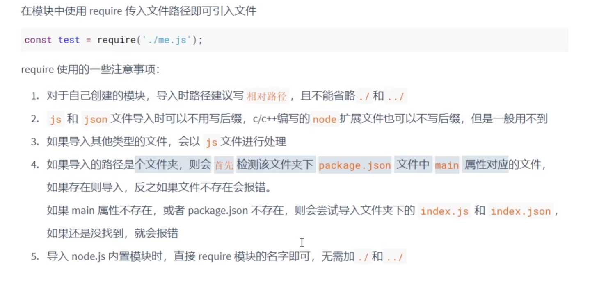
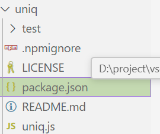
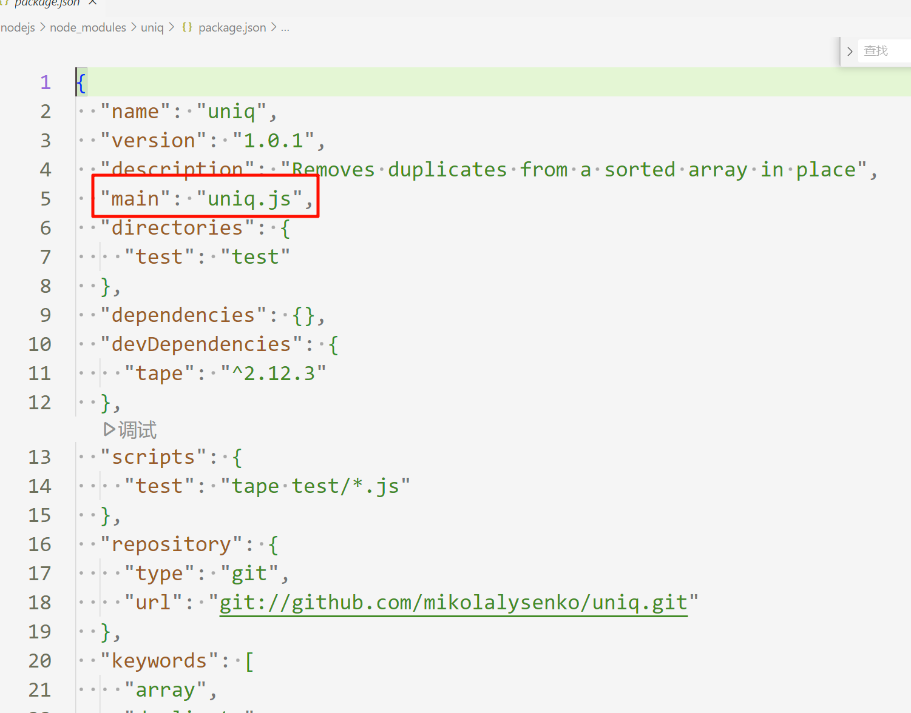

Node.js 是一个 Javascript **运行时环境**，使得你可以使用 JavaScript 编写和运行服务器端的程序。如 Web 服务器、实时应用、微服务等。


## 一、基本内容

在 **Node.js** 环境中，通常 **不能** 使用 **BOM** 和 **DOM**，因为它们是基于浏览器的特性，而 Node.js 是一个用于服务器端开发的 JavaScript 运行时环境。BOM 和 DOM 主要存在于浏览器中，用于与浏览器窗口、页面内容和用户交互。

BOM：window 对象、location 对象、navigator 对象、history 对象、screen 对象。

DOM：document


`globalThis` 是一个 **标准的全局对象**

- 在 **浏览器** 中，`globalThis` 引用的是 `window` 对象。

- 在 **Node.js** 中，`globalThis` 引用的是 `global` 对象。


## 二、Buffer 对象

**`Buffer`** 不是 JavaScript 标准的一部分，而是 **Node.js** 中的一个特有对象用于处理原始二进制数据的类，广泛用于文件操作、网络通信等场景。

1. 创建 Buffer 对象

```javascript
Buffer.alloc(10)
Buffer.allocUnsafe(10)
Buffer.from([10, 10, 10])
Buffer.from("hello")
```

2. 访问 Buffer 对象

```javascript
let a = Buffer.from("hello")
console.log(a[0])
console.log(a[1].toString(2))	// 转成 二进制格式
```

3. 转换 Buffer 对象

```javascript
console.log(a.toString())
console.log(a.toString("hex"))	// 转成 16 进制

let a = Buffer.from("hello ")
let b = Buffer.from("world ")
console.log(Buffer.concat([a, b]).toJSON());	// 拼接两个 Buffer 并且转成 Json
```


## 三、fs 模块

`require` 是 Node.js 中的一个内置函数，用来加载模块。它通常用于 **引入外部模块**

- **加载模块**：可以用 `require` 来加载和使用 Node.js 中的核心模块（如 `fs`、`http` 等），第三方库（如 `express`、`lodash`），或者自定义的本地模块。

- **返回模块的导出**：`require` 返回模块的导出对象，可以是函数、对象或其他类型的数据。


`fs` 模块是 Node.js 的一个核心模块，用于与文件系统进行交互。你可以使用 `fs` 模块读取、写入、删除文件，甚至管理目录结构。

### 1. 读取写入文件

```javascript
const fs = require('fs');	// 获取 fs 模块对象

// 写入，从头写入，如果文件不存在会自动创建
// fs.writeFile 是异步的
// fs.writeFileSync(); 是同步的
fs.writeFile("./test.txt", "write test content", "utf-8" ,error => {	// 写入内容到文件
    if (error) throw error;
    console.log("Write completed.");
    // 读取
    fs.readFile("./test.txt", "utf-8", (err, data) => {	// 读取文件中的内容
        if (err) throw err;
        console.log("File content:", data);
    });
});

// 追加写入
fs.appendFile("./test.txt", "\nappend write test content", "utf-8", error => {
    if (error) throw error;
    console.log("追加写入成功")
})
```

### 2. 流式读取和写入

```javascript
const fs = require('fs');
// 1. 写入
const ws = fs.createWriteStream("./test.txt");

ws.write("hello \r\n");
ws.write("world \r\n");

ws.close();


// 2. 读取流
const rs = fs.createReadStream('example.txt', { encoding: 'utf8' });

// 监听 'data' 事件，逐步读取文件数据
rs.on('data', (chunk) => {
  ws.write(chunk);	// 把读取到的文件写入到 ws 中
});

// 监听 'end' 事件，表示文件读取完毕
rs.on('end', () => {
  console.log('文件读取完毕');
});

// 监听 'error' 事件，处理文件读取中的错误
rs.on('error', (err) => {
  console.error('文件读取出错:', err);
});
// 3. 其他操作
rs.pause()	// 暂停流
rs.resume() // 回复流

rs.pipe(ws);	// 把rs文件内容读取到ws中
```

### 3. 重命名、删除文件和创建

```javascript
const fs = require("fs");

// 1. 重命名或移动
fs.rename("./hello.txt", "./hello/test.txt", (error) => {
  if (error) {
    console.error("重命名失败:", error.message);
    return;
  }
  console.log("重命名成功！");
});

// 2. 删除文件
fs.rm("./test.txt", err => {
  if (err) {
    console.error("Failed to delete file:", err);
    return;
  }
  console.log("File deleted successfully.");
})

// 3. 删除文件夹（递归删除）,通过 force: true 当文件夹不存在时忽略错误
fs.rm("./folderName", { recursive: true, force: true }, (err) => {
  if (err) {
    console.error("Failed to delete folder:", err);
    return;
  }
  console.log("Folder deleted successfully.");
});

// 4. 创建文件夹，recursive : true 决定是否可以递归创建
fs.mkdir("./hello/a/b/c",{recursive : true}, error => {
  if (error) {
    console.error("Error creating directory:", error);
  }
  console.log("Directory created successfully.");
})
```


### 4. 读取文件夹

```javascript
// 1. 读取文件夹内的文件或文件夹名 { recursive: true }控制是否递归
fs.readdir("./nodejs", (error, data) => {
  if (error) {
    console.error("Error reading directory:", error);
    return;
  }
  console.log("Files in the directory:", data);
})


```


## 四、path 模块

`path` 模块是一个用于处理文件路径的工具模块。它提供了一系列方法来操作文件路径，使得在不同操作系统下处理路径变得更加方便和一致。

```javascript
const path = require('path');

// 1. path.resolve([...paths])
// 将路径或路径片段解析为绝对路径。它会从右到左依次处理路径片段，直到构造出一个绝对路径。
const absolutePath = path.resolve('foo/bar', '/tmp/file/', '..', 'a/../subfile');
console.log(absolutePath); // 输出: /tmp/subfile

// 2. path.basename(path[, ext])
// 返回路径的最后一部分，类似于 Unix 的 basename 命令。可以指定 ext 参数来去除文件扩展名。
const baseName = path.basename('/foo/bar/baz/asdf/quux.html');
console.log(baseName); // 输出: quux.html

const baseNameWithoutExt = path.basename('/foo/bar/baz/asdf/quux.html', '.html');
console.log(baseNameWithoutExt); // 输出: quux

// 3. path.dirname(path)
// 返回路径的目录名，类似于 Unix 的 dirname 命令
const dirName = path.dirname('/foo/bar/baz/asdf/quux.html');
console.log(dirName); // 输出: /foo/bar/baz/asdf

// 4. path.extname(path)
// 返回路径的扩展名，即从最后一个 . 到路径末尾的部分。如果没有 .，则返回空字符串。
const extName = path.extname('/foo/bar/baz/asdf/quux.html');
console.log(extName); // 输出: .html

// 5. path.parse(path)
// 将路径解析为一个对象，包含 root、dir、base、ext 和 name 属性。
const parsedPath = path.parse('/foo/bar/baz/asdf/quux.html');
console.log(parsedPath);
// 输出:
// {
//   root: '/',
//   dir: '/foo/bar/baz/asdf',
//   base: 'quux.html',
//   ext: '.html',
//   name: 'quux'
// }

// 6. 提供平台特定的路径片段分隔符
console.log(path.sep); // 在 POSIX 系统上输出: /, 在 Windows 上输出: \
```


## 五、http 模块

`http` 模块是一个用于创建 HTTP **服务器**和**客户端**的核心模块。它提供了底层的 API，可以用来处理 HTTP 请求和响应。

### 1. 充当服务端，接受请求

```javascript
const http = require('http');

// 1. 创建一个最基本的 HTTP 服务器
const server = http.createServer((req, res) => {
  // 设置响应的内容类型为纯文本
  res.setHeader('Content-Type', 'text/plain');

  // 设置响应状态码
  res.statusCode = 200;

  // 向客户端发送响应内容
  res.end('Hello, Node.js HTTP Server!');
});

// 启动服务器，监听 3000 端口
server.listen(3000, () => {
  console.log('Server running at http://localhost:3000/');
});

// 2. 根据不同的路径返回不同结果
const server = http.createServer((req, res) => {
// 根据请求的 URL 返回不同内容
if (req.url === '/about') {
    res.writeHead(200, { 'Content-Type': 'text/plain' });
    res.end('This is the about page.');
} else if (req.url === '/contact') {
    res.writeHead(200, { 'Content-Type': 'text/plain' });
    res.end('This is the contact page.');
} else {
    res.writeHead(404, { 'Content-Type': 'text/plain' });
    res.end('Page not found');
}
});

```

### 2. 充当客户端，发送请求‘

```javascript
const http = require('http');

// 1. 发送 GET 请求
http.get('http://www.example.com', (res) => {
  let data = '';

  // 接收到数据时
  res.on('data', chunk => {
    data += chunk;
  });

  // 请求结束时
  res.on('end', () => {
    console.log('Response from example.com:');
    console.log(data);
  });
}).on('error', (err) => {
  console.log('Error:', err.message);
});


// 2. 发送 POST 请求
const postData = JSON.stringify({ name: 'Node.js', version: 'v16' });

const options = {
  hostname: 'www.example.com',
  port: 80,
  path: '/api',
  method: 'POST',
  headers: {
    'Content-Type': 'application/json',
    'Content-Length': Buffer.byteLength(postData)
  }
};

const req = http.request(options, (res) => {
  let data = '';
  res.on('data', chunk => {
    data += chunk;
  });
  res.on('end', () => {
    console.log('Response from server:', data);
  });
});

req.on('error', (err) => {
  console.error('Request failed:', err);
});

// 发送 POST 数据
req.write(postData);

// 结束请求
req.end();
```


## 六、模块化

模块化允许开发者将代码拆分为多个模块，便于组织、维护和复用。

```javascript
// 1. 导出模块
// 文件1
const test2 = require("./test2.js")
console.log(test2);
test2.hello();
// 文件2
function hello() {
    console.log("Hello World!");
};

module.exports = {
    hello,
}
```

require 导入模块的规则



## 七、包管理工具

包管理工具 用于安装、管理和发布 JavaScript 包，包管理工具有 **npm**、**Yarn**、**pnpm** 。

### 1. 常用命令

```javascript
// 1. 检查是否安装了 npm，安装nodejs时会自动安装
npm -v

// 2. 初始化项目，在当前文件夹下创建一个 package.json 的文件
npm init
npm init -y // 全部用默认的初始化一个项目

// 3. 安装 包 到当前文件夹下的 node_modules 文件夹中
npm install <package-name>
    
// 4. 全局安装 包
npm install -g <package-name>
    
// 5. 根据 package.json 文件中的依赖配置，安装项目所需的所有包。它会执行以下操作：
npm i

// 6. 删除下载指定包
npm r <package-name>  或  npm uninstall <package-name> 
    
// 7 运行当前项目中 package.json 中的脚本
npm run <script-name>
```

下面两个图片，我们通过 npm 下载了一个 uniq 的包，其中包含package.json，当我们用 `const uniq = require("uniq");` 的时候，导入的是文件夹，它通过 `package.json` 文件中的 **main** 属性，实际导入的是 **uniq.js**。





### 2. 自动处理依赖

这些命令运行时，npm 会自动处理依赖，会自动查找node_modules中的包

```javascript
npm start
npm test 
npm install
npm run + <script>
```


## 八、express

Express 是一个基于 Node.js 的轻量级 Web 应用框架，广泛用于构建 Web 应用和 API。它提供了丰富的功能，帮助开发者快速搭建服务器和处理 HTTP 请求。


### 1. 基本内容

```javascript
// 1. 初始化项目
npm init

// 2. 安装express
npm install express

// 3. 基本流程
const express = require('express');
const app = express();

// 只接受 get 请求
app.get('/', (req, res) => {
  res.send('Hello World!');
});

// 接受 get 和 post 请求
app.all("/test", (req, res) => {
    res.send("Test !");
});

// 接受所有 get 和 post 请求，以及路径
app.all("*", (req, res) => {
    res.send("404 Not Found !");
});

app.listen(3000, () => {
  console.log('Server is running on port 3000');
});
```


### 2. 路由

1. 获取路径中的参数

```javascript
const express = require('express');
const app = express();

app.get('/:id/:name', (req, res) => {
  console.log(req.params.id);
  console.log(req.params.name);
});

app.listen(3000, () => {
  console.log('Server is running on port 3000');
});
// 当发送请求 http://localhost:3000/1/mark 时，会输出 1 和 mark
```

2. 获取路径中的查询参数

```javascript
const express = require('express');
const app = express();

app.get('/example', (req, res) => {
  console.log(req.query.id);
  console.log(req.query.name);
});

app.listen(3000, () => {
  console.log('Server is running on port 3000');
});
// 当发送请求 http://localhost:3000/example?id=10&name=hello 时，会输出10 和 hello
```

3. 获取 json 格式的请求体

```javascript
const express = require('express');
const app = express();

// 使用 express.json() 中间件解析 JSON 请求体
app.use(express.json());

app.post('/example', (req, res) => {
  // 获取请求体中的参数
  const name = req.body.name;
  const age = req.body.age;

  // 打印请求体到控制台
  console.log('Request Body:', req.body);
});

app.listen(3000, () => {
  console.log('Server is running on port 3000');
});
```

4. 获取表格的请求体

```javascript
const express = require('express');
const app = express();

// 使用 express.urlencoded() 中间件解析表单数据
app.use(express.urlencoded({ extended: true }));

app.post('/example', (req, res) => {
  // 获取请求体中的参数
  const name = req.body.name;
  const age = req.body.age;

  // 返回响应
  res.send(`Name: ${name}, Age: ${age}`);

  // 打印请求体到控制台
  console.log('Request Body:', req.body);
});

app.listen(3000, () => {
  console.log('Server is running on port 3000');
});
```

5. 获取纯文本的请求体

```javascript
const express = require('express');
const app = express();

// 使用 express.text() 中间件解析纯文本请求体
app.use(express.text());

app.post('/example', (req, res) => {
  // 获取请求体中的文本数据
  const text = req.body;

  // 返回响应
  res.send(`Received text: ${text}`);

  // 打印请求体到控制台
  console.log('Request Body:', req.body);
});

app.listen(3000, () => {
  console.log('Server is running on port 3000');
});
```

6. 获取文件上传的请求体

```javascript
// 安装 multer
npm install multer

// ----------------------
const express = require('express');
const multer = require('multer');
const app = express();

// 设置文件存储路径和文件名
const storage = multer.diskStorage({
  destination: (req, file, cb) => {
    cb(null, 'uploads/'); // 文件存储目录
  },
  filename: (req, file, cb) => {
    cb(null, Date.now() + '-' + file.originalname); // 文件名
  },
});

const upload = multer({ storage });

// 处理文件上传
app.post('/upload', upload.single('file'), (req, res) => {
  // 获取上传的文件信息
  const file = req.file;

  // 返回响应
  res.send(`File uploaded: ${file.originalname}`);

  // 打印文件信息到控制台
  console.log('Uploaded File:', file);
});

app.listen(3000, () => {
  console.log('Server is running on port 3000');
});
```

### 3. 响应

1. 一般类型的响应

```javascript
// 1. res.send() 用于发送各种类型的数据（如字符串、JSON、Buffer 等）。
app.get('/', (req, res) => {
  res.send('Hello, World!'); // 发送字符串
});

app.get('/json', (req, res) => {
  res.send({ message: 'Hello, World!' }); // 发送 JSON
});

app.get('/buffer', (req, res) => {
  res.send(Buffer.from('Hello, World!')); // 发送 Buffer
});

// 2. res.json() 专门用于发送 JSON 数据。它会自动将 JavaScript 对象转换为 JSON 字符串，并设置 Content-Type 为 application/json。
app.get('/user', (req, res) => {
  res.json({ name: 'John', age: 30 });
});

// 3. res.end() 用于结束响应过程，通常用于不返回任何数据的响应。
app.get('/end', (req, res) => {
  res.status(204).end(); // 设置状态码为 204 No Content
});

// 4. res.set() 用于设置响应头。可以一次设置一个或多个头字段。
app.get('/custom-header', (req, res) => {
  res.set('Content-Type', 'text/plain');
  res.set('X-Custom-Header', 'Hello');
});
```

2. 其他类型的响应

```javascript
// 1. res.download() 用于发送文件并提示客户端下载。
app.get('/download', (req, res) => {
  res.download('path/to/file.pdf', 'report.pdf');
});

// 2. res.sendFile() 用于发送文件内容，通常用于静态文件服务。(自动设置 Content-Type 头)
app.get('/file', (req, res) => {
  res.sendFile('path/to/file.pdf');
});

// 3. Node.js 的流（Stream）可以用于处理大文件或实时数据
const fs = require('fs');
app.get('/stream', (req, res) => {
  const stream = fs.createReadStream('path/to/large-file.mp4');
  stream.pipe(res); // 将文件流直接传输到响应
});
```


### 4. 中间件

1. 全局中间件

所有请求都会先执行全局中间件的函数代码，然后才执行下面的代码

```javascript
const express = require('express');
const app = express();

// 全局中间件示例：日志记录
app.use((req, res, next) => {
  console.log(`${req.method} ${req.path} - ${new Date().toISOString()}`);
  next(); // 调用 next() 传递控制权到下一个中间件或路由
});

app.get('/', (req, res) => {
  res.send('Hello World!');
});

app.listen(3000, () => console.log('Server running on port 3000'));
```

2. 路由中间件

指定的路由会限制性路由中间件函数的代码（checkAuth），然后执行当前路由的代码。

```javascript
const express = require('express');
const app = express();

// 假设我们有一个简单的身份验证函数
const checkAuth = (req, res, next) => {
  if (req.query.token === 'valid') {
    next(); // 如果验证通过，传递控制权到下一个中间件或路由处理程序
  } else {
    res.status(401).send('Unauthorized');
  }
};

// 使用中间件来保护特定路由
app.get('/protected', checkAuth, (req, res) => {
  res.send('You are authenticated!');
});

app.get('/', (req, res) => {
  res.send('Hello World!');
});

app.listen(3000, () => console.log('Server running on port 3000'));
```


### 5. 静态资源

1. 允许浏览器访问静态资源

```javascript
app.use(express.static(__dirname + '/public'))
// 此时如果用 http://localhost:3000/index.html 访问，而且public下刚好有index.html文件，那么这个文件允许浏览器访问
// 上面这个也可以匹配 '/' 路径，某个 app.get("/", () => {}) 需要匹配的话，则需要写在这个的前面，因为nodejs按照从上往下优先匹配
```


### 6. 模块化

1. 路由的模块化

在项目根目录下创建一个 routes 文件夹。

在 routes 文件夹中创建一个 books.js 文件。

```javascript
// routes/books.js
const express = require('express');
const router = express.Router();

// 定义路由
router.get('/', (req, res) => {
  res.send('所有书籍');
});

router.get('/:id', (req, res) => {
  res.send(`书籍 id: ${req.params.id}`);
});

router.post('/', (req, res) => {
  res.send('添加新书');
});

// 导出路由模块
module.exports = router;
```

然后，在你的主应用文件中（通常是 app.js 或 server.js），导入并使用这些路由模块：

```javascript
// app.js
const express = require('express');
const app = express();
const booksRouter = require('./routes/books');

// 使用路由模块
app.use('/books', booksRouter);

app.listen(3000, () => console.log('Server running on port 3000'));
```


2. 中间件的模块化

```javascript
// middleware/auth.js
const requireAuth = (req, res, next) => {
  // 假设这里进行一些认证逻辑
  if (/* 用户已认证 */) {
    next();
  } else {
    res.status(401).send('Unauthorized');
  }
};

module.exports = requireAuth;
```

然后在路由文件中使用这个中间件：

```javascript
// routes/books.js
const express = require('express');
const router = express.Router();
const requireAuth = require('../middleware/auth');

// 使用中间件
router.get('/', requireAuth, (req, res) => {
  res.send('所有书籍');
});

module.exports = router;
```


### 7. 构造器

1. 安装 express-generator：

```javascript
npm install -g express-generator
```

2. 使用 express-generator 创建项目：

```javascript
express myapp
cd myapp
npm install
```

