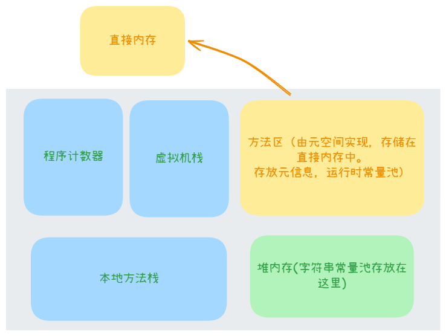

## 一、内存模型

### 1. JVM的内存模型介绍一下

JVM运行时内存共分为**程序计数器**，**虚拟机栈**、**堆**、**方法区**、**本地方法栈**五个部分。还有一部分内存叫**直接内存**，属于操作系统的本地内存，也是可以直接操作的。

1. `程序计数器`：程序计数器是**一块较小的内存空间**，记录当前线程正在执行的 `JVM 指令` 的偏移量，确保线程切换后可以恢复到原来的正确的执行位置。程序计数器各条线程之间计数器互不影响，独立存储。
2. `虚拟机栈`：虚拟机栈（JVM Stack） 是 Java 虚拟机为每个 **线程** 分配的私有内存空间，每个方法在调用时会创建一个栈帧（Stack Frame），然后加入到虚拟机栈中，其中栈帧存储着方法的 局部变量表、操作数栈、动态链接和返回地址。
3. `堆`：堆（Heap）是虚拟机中最大的一块内存区域，用于存储所有 **对象实例** 和 **数组**，被所有线程共享。
4. `方法区`：各个线程共享的内存区域，它用于存储已被虚拟机加载的类信息、常量、静态变量、即时编译器编译后的代码缓存等数据。

5. `本地方法栈`：主要为本地方法调用提供支持，尤其是那些由 JNI 或其他机制实现的非 Java 方法。
6. `直接内存`：并不是 Java 虚拟机运行时数据区的一部分，它是在 Java 堆外的、直接向系统申请的内存空间。

### 2. JVM内存模型里的堆和栈有什么区别？

**存储内容**：堆主要负责存储程序运行时动态创建的数据，包括**对象实例、数组**。而栈则是**每个线程私有的内存区域**，主要用来**存储局部变量**（比如方法内的基本类型变量或对象引用）和**方法调用**相关的信息（比如方法参数、返回地址等）。

**线程可见性**：堆是**所有线程共享的内存区域**，意味着多个线程可以同时访问堆中的对象，这也使得堆中的数据需要额外的同步机制来避免竞争问题。相比之下，栈是线程**私有的**，**每个线程都有自己的栈**，线程之间互不干扰，因此栈中的数据天然具有线程安全性。

**内存管理**：当程序需要创建对象时，JVM会在堆中分配空间，这些内存由**垃圾回收机制（GC）**负责管理，回收不再使用的对象。而栈的内存管理则更加简单，它采用静态分配的方式，**按照方法调用的顺序自动创建和销毁栈帧**，方法执行结束时内存会自动回收，无需GC介入。

### 3. 栈中存的到底是指针还是对象？

在JVM的栈（Stack）中，对于**基本类型的变量**，存储的是值本身，对于**引用类型的变量**，存储的并不是对象本身，而是**对象的引用（Reference）**，可以理解为指向堆中对象的“指针”。对象本身始终存储在堆（Heap）中。

### 4.堆分为哪几部分呢？

在JVM（Java虚拟机）的内存模型中，**堆（Heap）**是用于存储对象实例和数组的主要区域。 JVM的堆通常分为两大主要区域：

- **年轻代（Young Generation）**：存放新创建的对象，回收频率较高。
- **老年代（Old Generation）**：存放存活时间较长的对象，回收频率较低。

(1) **`年轻代 (Young Generation)`**

年轻代是堆的一部分，用于存放新创建的对象。由于大多数对象生命周期较短，年轻代设计为频繁进行垃圾回收（称为Minor GC）。年轻代又细分为以下三个区域：

- **Eden区（Eden Space，伊甸园区）**：
  - 作用：所有新创建的对象首先分配在Eden区。
  - 特点：Eden区占年轻代的大部分空间（通常比例为8:1:1，与两个Survivor区相比）。
  - 回收：当Eden区满时，触发Minor GC，对象存货次数达到阈值后会被转移到Survivor区。
- **Survivor区（Survivor Space，幸存区）**：
  - 分为两个子区域：**From Survivor** 和 **To Survivor**。
  - 作用：保存经过Minor GC后仍存活的对象，作为Eden区和老年代之间的缓冲。
  - 特点：
    - 两个Survivor区大小相等，且总是只有一个处于使用状态。
    - From区存活的对象会在Minor GC时被复制到To区，之后From和To角色互换。
  - 目的：通过复制算法减少内存碎片，并筛选出存活较久的对象。

(2) **`老年代 (Old Generation)`**

- 作用：存放经过多次Minor GC仍存活的对象，或者大对象（超过一定阈值直接分配到老年代）。
- 特点：
  - 占堆的大部分空间（通常是年轻代的2倍或更多）。
  - 回收频率低，垃圾回收称为Major GC或Full GC。
- 回收：老年代通常使用标记-清除或标记-整理算法，效率低于年轻代的复制算法。

(3) **`字符串常量池 (String Pool)`**（JDK 8及之后）：在JDK 8及之后，字符串常量池从方法区（永久代）迁移到堆中，成为堆的一个逻辑部分。存储字符串字面量（如"hello"）和通过String.intern()放入的字符串。

(4) **`大对象区`**：一些JVM实现中，大对象（如超大数组）可能直接分配到老年代，避免频繁复制。

### 5. 程序计数器的作用，为什么是私有的？

Java 程序具备支持多线程并发运行的能力。在多线程共同运行的情况下，CPU 会给各个线程分配时间片。举例来说，cpu会先给线程 1 分配一个时间片，线程 1 便开始执行代码。倘若在这个时间片内，线程 1 的代码尚未执行完毕，系统就会将线程 1 当前的执行状态进行暂存，随后切换到线程 2。此时，线程 2 开始执行它的代码，当线程 2 执行到一定阶段，且它所分配到的时间片耗尽后，系统又会切换回线程 1，继续执行之前暂存状态下线程 1 尚未完成的剩余代码。

在这个线程切换的过程中，cpu需要知道当前线程下一条指令将在何处开始执行？这就必然会用到程序计数器。每个线程都拥有属于自己的程序计数器，这是因为各个线程所执行代码的`指令地址各不相同`。所以，每个线程都必须配备独立的程序计数器。

### 6. 方法区中的方法的执行过程？

1. **类加载**
   - 当 Java 程序首次使用某个类时，类加载器会将类的字节码文件加载到内存，并将类的相关信息存储在方法区中，包括类的结构、方法信息、常量池等。

2. **方法调用**
   - 当程序执行到调用方法的代码时，会根据方法的名称、参数列表等信息在方法区中查找对应的方法。

3. **栈帧创建与入栈**
   - 在确认可以调用方法后，虚拟机为该方法在虚拟机栈中创建一个栈帧。栈帧是方法执行的基本运行单位，用于存储方法的局部变量表、操作数栈、动态链接、方法出口等信息。
4. **方法执行**
   - 方法执行过程中，虚拟机按照字节码指令序列依次执行方法中的代码。根据字节码指令的操作，可能会对操作数栈进行压栈、出栈等操作，完成数据的运算、赋值等操作。方法执行完成后，将栈帧从虚拟机栈中弹出。

### 7. String s = new String（“abc”）执行过程中分别对应哪些内存区域？

**字符串常量池**：`"abc"` 是一个字符串字面量。在执行这行代码时，JVM 会首先检查字符串常量池中是否已经存在 `"abc"` 字符串。如果没有，它会把 `"abc"` 放入常量池。

**堆内存（Heap）**：`new String("abc")` 会创建一个新的 `String` 对象，这个对象存储在堆内存中。堆内存是用来存储对象的。

**栈内存（Stack）**：当 `String s` 被声明时，`s` 这个引用变量会存储在栈内存中。此时 `s` 只是一个指向某个对象的引用，它并没有指向任何实际的对象。

### 8. 内存泄漏和内存溢出的理解？

**内存泄漏：** 内存泄漏指的是程序中已分配的内存不再被使用，但由于某些原因，这部分内存没有被释放或无法被回收，导致程序占用的内存不断增加。

- **持有不必要的对象引用**：当对象之间存在强引用关系且不再需要使用某个对象时，其他对象仍然持有对它的引用，导致垃圾回收器无法回收该对象占用的内存。例如，在 Java 中，将对象放入集合中后，如果在其他地方修改了对象的状态，使得集合中的引用无法被正确释放，就可能产生内存泄漏。
- **资源未正确关闭**：对于一些需要占用系统资源的操作，如文件操作、网络连接等，如果在使用完毕后没有正确关闭资源，这些资源所占用的内存（包括与之相关的一些内部缓冲区等）就无法被释放，也会造成内存泄漏。

**内存溢出：** 内存溢出指的是程序请求的内存超过了系统或 JVM 为其分配的最大内存限制，导致程序无法继续运行。内存溢出通常会抛出 `java.lang.OutOfMemoryError` 错误。

- **无限递归或循环导致内存耗尽**：当程序中存在无限递归或无限循环，并且在每次递归或循环中都不断申请新的内存空间（例如创建新的对象或分配数组等），最终会耗尽系统的内存资源，导致内存溢出。
- **加载大量数据到内存**：如果程序需要一次性加载大量的数据到内存中，而这些数据的总量超过了系统可用内存，就会发生内存溢出。比如，读取一个非常大的文件到内存中进行处理，而文件大小超过了剩余内存空间。

### 9. 引用类型有哪些？有什么区别？

强引用（Strong Reference）

- **定义**：是最常见的引用类型，在程序中通过赋值操作创建的引用默认都是强引用，如`Object obj = new Object();`，`obj`就是一个强引用。
- 特点
  - **引用强度**：最强。只要强引用存在，垃圾回收器就永远不会回收被引用的对象，即使内存空间不足，JVM 也宁愿抛出`OutOfMemoryError`异常，也不会回收具有强引用的对象。
  - **使用场景**：一般用于需要长期保持对象的引用，确保对象在整个生命周期内都不会被意外回收的情况，如程序中的核心业务对象、全局配置对象等。

软引用（Soft Reference）

- **定义**：通过`SoftReference`类来实现，用于描述一些还有用但并非必需的对象。
- 特点
  - **引用强度**：比强引用弱，比弱引用强。在系统内存充足的时候，软引用所引用的对象不会被回收；当系统内存不足时，垃圾回收器会回收软引用所指向的对象，以获取更多的内存空间。
  - **使用场景**：常用于实现缓存机制，例如缓存图片、网页数据等。当内存充足时，缓存可以提高数据的访问速度；当内存紧张时，缓存中的数据可以被释放，以避免内存溢出。

弱引用（Weak Reference）

- **定义**：通过`WeakReference`类来创建，它所引用的对象只能生存到下一次垃圾回收发生之前。
- 特点
  - **引用强度**：比软引用更弱。无论内存是否充足，只要垃圾回收器扫描到弱引用所引用的对象，就会立即回收该对象，而不会考虑其他因素。
  - **使用场景**：适用于那些不希望阻止对象被回收的场景，比如在集合中存储一些临时数据或者对对象进行弱关联的跟踪等。在 Java 的`ThreadLocal`中就使用了弱引用来避免内存泄漏，当`ThreadLocal`对象不再被强引用指向时，其对应的键值对可以被及时回收。

虚引用（Phantom Reference）

- **定义**：通过`PhantomReference`类来表示，也称为幽灵引用或幻影引用，是所有引用类型中最弱的一种。
- 特点
  - **引用强度**：最弱，它对所引用的对象没有实际的引用作用，无法通过虚引用来获取对象实例。虚引用的主要作用是在对象被垃圾回收时，能够收到一个系统通知。
  - **使用场景**：主要用于跟踪对象被垃圾回收的状态，或者在对象被回收前进行一些必要的清理操作，如资源释放等。在一些底层的内存管理或者对象资源清理的场景中可能会用到虚引用。

### 10.  jvm 内存结构有哪几种内存溢出的情况？

堆内存溢出

- **原因**：当应用程序不断创建对象，且对象的创建速度超过了垃圾回收器的回收速度，或者存在对象之间的循环引用导致垃圾回收器无法回收某些对象时，就可能导致堆内存被耗尽，从而引发内存溢出。

虚拟机栈溢出

- **原因**：主要是由于方法调用深度过大，比如存在无限递归调用，或者方法中定义了大量的局部变量占用了过多的栈空间。每一次方法调用都会在虚拟机栈中分配一块栈帧空间，用于存储局部变量表、操作数栈、动态链接等信息，如果方法调用层次过深，栈空间就会被耗尽。

本地方法栈溢出

- **原因**：当本地方法中存在大量的局部变量或者本地方法的调用层次过深，就可能导致本地方法栈内存溢出。

方法区溢出

- **原因**：方法区用于存储类的元数据信息、常量、静态变量等。当应用程序加载了大量的类，或者动态生成了大量的类（如使用动态代理、字节码生成技术等），且方法区的内存空间不足以容纳这些类的信息时，就会发生方法区溢出。另外，常量池中的常量过多也可能导致方法区溢出，比如在程序中定义了大量的字符串常量。

直接内存溢出

- **原因**：直接内存并不是 JVM 内存结构的一部分，但 Java 程序可以通过`Unsafe`类或`NIO`等方式直接分配和使用直接内存。当应用程序直接分配的直接内存过大，超过了系统可用的物理内存或者 JVM 配置的直接内存上限时，就会发生直接内存溢出。

## 二、类初始化和类加载

### 1. 创建对象的过程？

1. **类加载（Class Loading）**
   在创建对象之前，JVM需要确保对象的类已经被`加载到内存中`。如果类还没有被加载，JVM 会通过类加载器加载该类的 `.class` 文件。这个过程包括加载、链接和初始化三个阶段：
   - **加载**：读取类的字节码文件到内存。
   - **链接**：验证字节码是否符合 JVM 规范、为`静态变量`分配内存并解析符号引用。(解析符号引用：将类名、方法名等符号引用转换为指向内存中实际地址的引用)
   - **初始化**：执行类的`静态初始化代码`（如静态变量赋值和静态块）。
2. **内存分配（Memory Allocation）**
   JVM 在堆内存中为对象分配足够的空间，用于存储对象的实例变量和其他相关信息。
3. **对象的初始化**
   对象创建后，JVM 会自动将实例变量初始化为默认值。例如：
   - **默认初始化**：int 初始化为 0，boolean 为 false，引用类型初始化为 null等等。
   - **显式初始化**：按照在类中定义的顺序，依次执行实例变量的显式赋值操作。
   - **调用构造器**：JVM 会调用类的构造器，执行构造函数中的代码，对对象进行进一步的初始化操作。
4. **返回对象引用（Return Reference）**
   对象创建完成后，new 关键字会返回该对象的引用（内存地址），你可以将其赋值给一个变量，以便后续操作。

### 2.  对象的生命周期

1. **创建阶段**  
   - 通过 new 关键字在堆内存中分配空间，调用构造器初始化对象，返回引用。  
   - 在此过程中，如果类尚未加载，JVM 会先加载类（包括加载、链接和初始化）。对象内存分配后，实例变量会被默认初始化（例如 int 为 0，引用类型为 null），然后执行构造器中的自定义初始化逻辑。
2. **使用阶段**  
   - 对象被强引用持有，程序通过引用访问其属性和方法，执行相应操作。  
   - 只要至少有一个强引用指向对象，它就处于活跃状态，可以被多个引用共享，或者在方法调用中传递，持续参与程序运行。
3. **销毁阶段**  
   - 当对象失去所有强引用并变得不可达后，垃圾回收器（GC）在适当的时机标记并回收其内存，完成销毁。  
   - 不可达状态是指没有任何强引用指向对象（例如引用被置为 null 或超出作用域）。垃圾回收的时机由 JVM 决定，不一定是即时的，最终释放内存后对象生命周期结束。

### 3. 类加载器有哪些？

从上到下依次是：

1. **引导类加载器（Bootstrap ClassLoader）**  ：加载 Java 核心类库（如 rt.jar 中的类，例如 `java.lang.Object、java.util.*`）。
2. **扩展类加载器（Extension ClassLoader）**  ：加载 Java 扩展类库（如 `<JAVA_HOME>/jre/lib/ext` 下的类或 `java.ext.dirs`指定的类）。
3. **应用程序类加载器（Application ClassLoader）**  ：加载应用程序类路径（classpath）下的类，包括用户代码和第三方库。
4. **自定义类加载器（Custom ClassLoader）**  ：加载开发者指定的类（如从网络、数据库等自定义来源加载类文件）。

### 4.  双亲委派模型的作用

双亲委派模型是指当一个类加载器需要加载某个类时，它不会直接尝试加载，而是先将加载请求委托给自己的父类加载器，逐级向上，直到顶层的引导类加载器。只有当父类加载器无法加载该类时，当前类加载器才会亲自尝试加载。

1. **确保类的唯一性，避免重复加载**  
   - 通过将类加载任务优先委托给父类加载器，确保同一个类只会被加载一次。例如，java.lang.Object 由引导类加载器加载，后续任何加载请求都会复用已加载的类，避免因不同类加载器加载而产生多个版本。
2. **提供安全性，防止核心类被篡改**  
   - 核心类（如 java.lang.*）始终由引导类加载器加载，用户无法通过自定义类加载器覆盖这些类。这样可以防止恶意代码伪造核心类（如自定义一个恶意的 java.lang.String），保护 JVM 和应用程序的安全。
3. **实现加载层次的隔离与分工**  
   - 不同的类加载器负责不同的类（引导类加载器加载核心类，扩展类加载器加载扩展类，应用程序类加载器加载用户类），形成清晰的层次结构。这种分工提高了加载效率，保证了各个层级类加载器的职责清晰，也便于维护和扩展。

### 5. 双亲委派模型的原理

当一个类加载器收到类加载请求时，它首先不会尝试自己去加载这个类，而是将请求委托给它的父类加载器。只有当父类加载器在其负责的类路径中找不到所需的类时，才会将加载任务交还给子类加载器，让子类加载器在自己的类路径中尝试加载。

