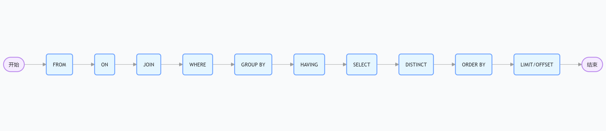
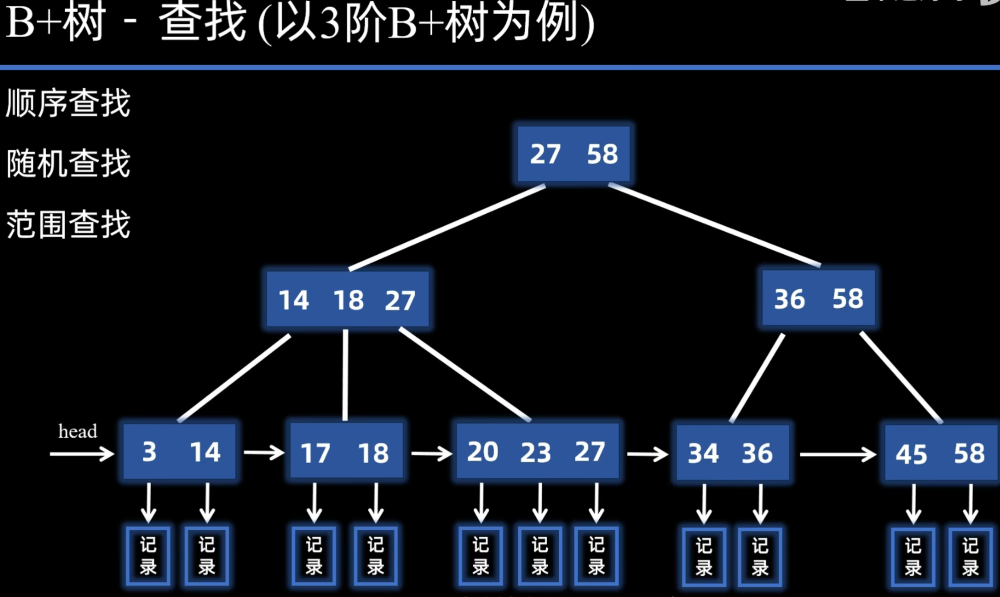

## 一、存储引擎

### 1. 讲一讲mysql的引擎吧，你有什么了解？

MySQL 的存储引擎（Storage Engine）是 MySQL 数据库的核心组件之一，它负责处理数据的存储、检索和更新等底层操作。

1. InnoDB：InnoDB是MySQL的默认存储引I擎，具有**ACID事务支持**、**行级锁**、**外键约束**等特性。它适用于高并发的读写操作，支持较好的数据完整性和并发控制。
2. MyISAM：MyISAM是MySQL的另一种常见的存储引擎，具有较低的存储空间和内存消耗，适用于大量读操作的场景。然而，MyISAM**不支持事务**、**行级锁**和**外键约束**，因此在并发写入和数据完整性方面有一定的限制。
3. Memory：Memory引擎将数据存储在内存中，适用于对性能要求较高的读操作，但是在服务器重启或崩溃时数据会丢失。它不支持**事务**、**行级锁**和**外键约束**。


### 2. MySQL为什么InnoDB是默认引擎？

简单来说，InnoDB 是一个“全能选手”

- **功能全面**: 事务、外键、行级锁等特性让它适合各种应用。
- **可靠性高**: 崩溃恢复能力确保数据安全。
- **性能均衡**: 在读写混合、高并发场景下表现更好。


### 3. InnoDB 和 MyISAM 有什么区别

| 特性     | InnoDB                                     | MyISAM                                                       |
| -------- | ------------------------------------------ | ------------------------------------------------------------ |
| 聚簇索引 | 支持，主键是聚簇索引，叶子节点存储整行数据 | 不支持，所有索引是非聚簇索引，叶子节点存储数据指针（行偏移量） |
| 锁粒度   | 行级锁（支持更高的并发）                   | 表级锁（并发性能较差）                                       |
| 事务     | 支持（ACID 特性）                          | 不支持                                                       |
| 回滚     | 支持（通过 undo log）                      | 不支持                                                       |
| MVCC     | 支持多版本并发控制                         | 不支持                                                       |


### 4. 三层B+树最多存储多少行数据

对于非叶节点存储的是一个键值（4字节）和指针（6字节），一个节点是一页16KB，16KB可以存储 16 KB / 10 B = 1600 个索引键值+指针，那么第二层可以存储 1600 * 1600 = 2 560 000 左右个指针。

对于叶节点，一页可以存储 16KB / 一行字节数，这里我们以 1024 B举例，16 KB / 1024B = 16。

最后 2560 000 * 16 = 40 960 000


## 二、索引

### 1. 索引是什么？有什么好处？

索引（Index）是数据库中一种用于**加速数据检索**的数据结构。它类似于书的目录，通过索引，数据库可以在不扫描整个表的情况下快速定位到需要的数据。


### 2. 讲讲索引的分类是什么？

按功能性分类: **主键索引、唯一索引、普通索引、前缀索引**

按数据结构分类: **B+tree索引、Hash索引（innoDb不支持）、Full-text索引**

按存储方式分类 : **聚簇索引（主键索引）、二级索引（辅助索引）**。（B+树）


### 3. 聚簇索引和非聚簇索引

聚簇索引：聚簇索引的 `叶子节点` 存储的是**整行数据**，而不是数据的指针或引用。

非聚簇索引：非聚簇索引的 `叶子节点` 存储的是**索引键值（value）和数据指针**（主键值），而不是整行数据。


### 4. MySQL主键是聚簇索引吗？

在创建表时，InnoDB 存储引擎会根据不同的场景选择不同的列作为索引l:

- 如果有主键，默认会使用主键作为**聚簇索引**l的索引键（key）;
- 如果没有主键，就选择第一个不包含NULL 值的**唯一列**作为聚簇索引I的索引键（key）;
- 在上面两个都没有的情况下，InnoDB 将自动生成一个隐式自增id 列作为聚簇索弓l的索引键（key）；


### 5. 什么是回表？以及为什么回表

回表是在数据库查询过程中，当使用**非聚簇索引**找到目标数据的主键值（或数据位置）后，需要再次访问表的数据（通常是聚簇索引）以获取完整行数据的操作。


1. 非聚簇索引的设计是为了节省空间和提高灵活性，它只存部分信息（索引列和指针）。

2. 当查询涉及表中其他列（不在索引中）时，数据库需要拿着指针去“原始数据”中取完整记录。


### 6. 什么是覆盖索引？

覆盖索引（Covering Index）是指在数据库查询中，**索引本身包含了查询所需的所有列数据**，从而无需回表（即无需访问表的数据本身）就能直接返回结果的一种优化技术。

 

### 7. 表中十个字段，你主键用自增ID还是UUID，为什么？

用的是自增 id。

1. **存储效率高**：
   - 自增ID（INT 4 字节或 BIGINT 8 字节）比 UUID（字符串 36 字节或二进制 16 字节）占用空间小。
   - 在 InnoDB 中，聚簇索引和二级索引都包含主键值，字段多时节省空间更明显。
2. **索引性能好**：
   - 自增ID 是顺序增长的，插入时按顺序写入 B+树索引，减少页面分裂和碎片。
   - UUID 是随机的，插入会导致 B+树频繁分裂，索引效率低。


### 8. 如何选出非叶节点的值

**非叶节点的值** 是由插入操作和 **节点分裂** 过程中逐渐决定的。下面详细讲解这个过程：

假设我们正在插入数据，并且某个叶子节点满了。插入后，这个节点会分裂为两个节点。分裂后的过程如下：

- 在分裂时， 中间的值会被抬升到父节点
  - **例如**：假设叶子节点存储的数据是 `[1, 3, 5, 7, 9]`，当插入 `6` 时，叶子节点会分裂为 `[1, 3, 5]` 和 `[6, 7, 9]`。
  - 然后， **中间值 5** 被 **抬升到父节点**。这样，父节点就包含了一个新的索引值 5，指向这两个子节点 `[1, 3, 5]` 和 `[6, 7, 9]`。
  - 如果父节点也满了，父节点会 **继续分裂**，并且中间值会继续被抬升到更高的层级。




### 9. MySQL中表中十个字段，你主键用自增ID还是UUID，为什么？

自增id。

B+树存储的节点 id 从上到下是有序的，所以当自增id插入的行一定会在原有的最大数据行下一行，mysql定位和寻址很快，不会为计算新行的位置而做出额外的消耗。

但是UUID不是递增的，每次插入数据时，就会出现新的UUID需要插入到索引I树的中间去，这样可能会频繁地导致页分裂，使性能下降。


### 10. B+树的特点是什么

1. **平衡性**
   - 所有叶子节点的高度相同，意味着B+树是一个高度平衡的树结构。所有的插入和删除操作都会通过重新平衡树来维持这个特性，确保查找、插入和删除操作的时间复杂度为 O(log N)。

2. **节点结构**

   - **非叶节点**：内节点只存储键值（key），不存储数据。这些键值用于指导查找的路径。

   - **叶节点**：叶节点不仅存储键值，还存储对应的数据记录（或数据块的指针）。这是B+树与B树的一个区别，B树的内节点也可以存储数据。

3. **链表链接的叶节点**
   - B+树的叶节点通过链表连接在一起，通过链表可以快速地访问相邻的叶节点，这也使得B+树非常适合范围查询（例如，查找某个范围内的所有数据），而无需重新遍历整个树。

4. **插入与删除操作**

   - 插入操作会在叶节点进行，并可能引发节点分裂（如果节点已满），分裂后的新节点会向父节点传播，从而保持树的平衡。

   - 删除操作可能导致节点合并（如果节点中数据过少），同样需要通过父节点的调整来保持平衡。


### 11. MySQL索引为什么用B+树？而不是B树

1. 在B+树中，数据都存储在叶子节点上，而非叶子节点只存储索引信息，非叶子节点可以存储更多的键值，这意味着B+树的的高度更低，查询效率高；而B树的非叶子节点既存储索引信息也存储部分数据，非叶子节点可以存储的键值变少，树的高度变高，查询效率低。

2. B+树的叶子节点使用链表相连，便于范围查询和顺序访问，比如一旦找到范围的起点，就可以顺序遍历链表，无需回溯或额外跳转；B树的叶子节点没有链表连接，范围查询效率低。

3. B+树的查找性能更稳定，每次查找都需要查找到叶子节点；而B树的查找可能会在非叶子节点找到数据，性能相对不稳定。


### 12. 联合索引

使用联合索引时，存在最左匹配原则，也就是按照最左优先的方式进行索引的匹配。在使用联合索
引进行查询的时候，如果**不遵循「最左匹配原则」**，联合索引会**失效**，这样就无法利用到索引快速查询的
特性了。

联合索引是（a，b，c）(abc都是字段)，where 条件是 a = 1 and c = 2。此时 a 可以用到索引，筛选出满足 a = 1的数据，但是 c 不可以用到这个联合索引，因为不满足最左匹配原则(缺少b的条件)。


### 13. 哪些情况会导致索引失效

**1. 不满足最左前缀原则（联合索引）**

```sql
CREATE INDEX idx_abc ON test(a, b, c);
SELECT * FROM test WHERE b = 1 AND c = 2; -- 索引失效
SELECT * FROM test WHERE a = 1 AND c = 2; -- 只用 a，c 失效
```

2. **在 WHERE 或 ON 中对索引列应用函数、运算符等。**

```sql
CREATE INDEX idx_name ON users(name);
SELECT * FROM users WHERE UPPER(name) = 'ZHANG'; -- 索引失效
SELECT * FROM users WHERE name + 1 = 2; -- 索引失效
```

3. **使用 LIKE 通配符前缀**

```sql
CREATE INDEX idx_name ON users(name);
SELECT * FROM users WHERE name LIKE '%son'; -- 索引失效
```

4. **查询条件中的值类型与索引列类型不一致，导致隐式转换。**

```sql
CREATE INDEX idx_id ON users(id); -- id 是 INT
SELECT * FROM users WHERE id = '1'; -- 索引可能失效
```

5. **OR 连接的条件中，某些列没有索引**

```sql
CREATE INDEX idx_a ON test(a);
SELECT * FROM test WHERE a = 1 OR b = 2; -- 索引可能失效
```

6.  **使用 != 或 <> 操作符**

```sql
CREATE INDEX idx_age ON users(age);
SELECT * FROM users WHERE age != 20; -- 索引可能失效
```


判断索引是否失效

```sql
EXPLAIN SELECT * FROM users WHERE UPPER(name) = 'ZHANG';
```


### 14. 索引的优缺点？

索引最大的好处是提高查询速度，但是索引也是有缺点的，比如：

- 需要占用物理空间，数量越大，占用空间越大;
- 创建索引和维护索引要耗费时间，这种时间随着数据量的增加而增大;
- 会降低表的增删改的效率，因为每次增删改索引l，B+树为了维护索引有序性，都需要进行动态维护。


### 15. 怎么决定建立哪些索引?

- 排序或分组的列若有索引，可避免额外排序操作。
- 经常出现在 WHERE 子句中的列是索引的首要候选。
- 业务上要求唯一性的列（如 username）需加唯一索引。


### 16. 索引优化详细讲讲

1. 前缀索引优化
2. 覆盖索引优化
3. 防止索引失效


### 17. 什么是前缀索引

前缀索引是专门针对**较长的字符串列**（如 VARCHAR、TEXT 等）设计。它通过只索引字符串的前几个字符（前缀）来减少索引的大小和维护成本，同时仍能加速查询。


## 三、事务

**事务（Transaction）** 是一个逻辑工作单元，它由一组数据库操作（如插入、更新、删除、查询等）组成，这些操作要么全部成功执行并提交，要么全部失败并回滚。

### 1. 事务的特性是什么？如何实现的？

事务的特征：

1. **原子性（Atomicity）**
   - **定义**：事务中的所有操作要么全部完成，要么全部不完成，不会出现部分执行的情况。
   - **例子**：转账操作中，从账户 A 扣款和向账户 B 加款必须同时成功或同时失败。
2. **一致性（Consistency）**
   - **定义**：事务执行前后，数据库必须从一个一致状态转换到另一个一致状态，满足所有预定义的规则、约束和数据完整性要求。
   - **例子**：转账后，账户 A 和 B 的总金额保持不变。
3. **隔离性（Isolation）**
   - **定义**：事务在执行过程中，不同事务之间互不干扰，未提交的事务修改对其他事务不可见。
   - **例子**：事务 A 在修改数据时，事务 B 看不到未提交的修改。
4. **持久性（Durability）**
   - **定义**：事务一旦提交，其修改的数据将永久保存，即使系统崩溃也不会丢失。
   - **例子**：转账完成后，数据写入磁盘，即使断电也能恢复。

如何实现：

主要依靠日志系统 redo log （重做日志）和 undo log（回滚日志） 以及锁与并发控制MVCC。


### 2. mysql可能出现什么和并发相关问题？

1. **脏读** : 一个事务读取了另一个未提交事务修改的数据，如果未提交事务回滚，读取到的数据就变成了“脏数据”。（读未提交）
2. **不可重复读 ** : 一个事务在多次读取同一数据时，由于另一个事务提交了修改，导致读取结果不一致。（读已提交）
3. **幻读**  : 一个事务在多次查询某个范围的数据时，由于另一个事务插入或删除了行，导致查询结果集的行数发生变化（如同“幻觉”）。


### 3. mysql 的隔离级别有哪些

1.  **读未提交** : 事务可以读取另一个未提交事务的修改数据。
2. **读已提交** : 事务只能读取已提交的数据，解决了脏读问题。
3. **可重复读** : 事务内多次读取同一数据结果一致，解决了不可重复读。（默认隔离级别）
4. **串行化** : 事务完全隔离，串行执行，解决了所有并发问题（脏读、不可重复读、幻读）。


| 隔离级别 | 脏读   | 不可重复读 | 幻读   |
| -------- | ------ | ---------- | ------ |
| 读未提交 | 可能   | 可能       | 可能   |
| 读已提交 | 不可能 | 可能       | 可能   |
| 可重复读 | 不可能 | 不可能     | 可能   |
| 串行化   | 不可能 | 不可能     | 不可能 |


### 4. InnoDB 如何在可重复读级别防止幻读？

1. **MVCC** : 

- **实现**：
  - 每行数据记录多个版本，通过事务 ID 和回滚指针（指向 Undo Log）维护。
  - 事务开始时，InnoDB 创建一个一致性视图（Read View），只读取事务开始前已提交的数据版本。
- **对幻读的限制**：
  - MVCC 只能防止读取到其他事务已修改的现有行，但无法阻止新插入的行（因为新行不在快照中）。


2.  **Next-Key Lock（次键锁）** : 

- **定义**：
  - Next-Key Lock 是行锁（Record Lock）和间隙锁（Gap Lock）的组合。
  - 它锁定某个具体记录以及该记录与下一个记录之间的“间隙”。
- **原理**：
  - 当事务执行范围查询（如 WHERE age > 20）或修改操作时，InnoDB 会锁定查询涉及的行以及相关范围的间隙。
  - 其他事务无法在这些间隙中插入或删除行，直到锁释放。


### 5. 介绍一下MVCC实现原理

**MVCC（多版本并发控制，Multi-Version Concurrency Control）** 是数据库中一种常见的**并发控制机制**，用于在多事务环境下提高并发性能，同时保证**事务隔离性**。

- **核心思想**：
  - MVCC 通过为数据记录维护多个版本，使得事务可以读取某个时间点的数据快照，而不需要等待其他事务完成修改。
  - 每个事务看到的数据版本取决于其隔离级别和开始时间。


### 6. 一条update是不是原子性的？为什么？

在 InnoDB 中，即使没有显式使用 BEGIN，每条独立的 DML 语句（**INSERT**、**UPDATE**、**DELETE**）都会自动开启一个隐式事务（只针对写操作），并在语句完成后自动提交（autocommit=1 时），所以一个update是原子性，由事务保证的


在执行 UPDATE 时，InnoDB 先将旧值写入 Undo Log（回滚日志），如果操作失败，可以根据 Undo Log 恢复到原始状态。

在提交前，InnoDB 将修改写入 Redo Log（重做日志），如果系统崩溃，恢复时通过 Redo Log 重做已提交的更改。

UPDATE 时，InnoDB 对目标行加排他锁，防止并发事务干扰，确保操作要么完整执行，要么不执行。


### 7. 事务一定可以保证acid吗

事务无法完全保证 ACID。

1. **事务未正确使用**：即使在支持事务的引擎（如 InnoDB）中，如果事务未正确提交或回滚，ACID 可能受影响。
2. **隔离级别不足**：事务的隔离级别较低（如“读未提交”），可能牺牲隔离性和一致性。


### 8. 一个事务包含大量 SQL 的弊端

1. **锁持有时间过长** : SQL 语句越多，事务执行时间越长，锁的持有时间也随之延长，直到事务提交（COMMIT）或回滚（ROLLBACK）。

2. **性能瓶颈** : 每条写操作生成 Undo Log（回滚日志）和 Redo Log（重做日志），大量 SQL 导致日志量激增，增加 I/O 负担。

3. **死锁风险增加** : 事务涉及多个表或多行，锁范围扩大。多个长事务交叉访问相同资源，形成循环等待。

4. **回滚成本高** : 事务失败时，InnoDB 根据 Undo Log 回滚所有操作。


## 四、锁

1. 按照颗粒度划分：**表锁（Table Lock）**，**行锁（Row Lock）**

2. 按锁的类型分类

   - **共享锁（Shared Lock，S Lock）**：允许多个事务同时读取同一资源，但不允许写入。  （select）（`LOCK IN SHARE MODE`）

   - **排他锁（Exclusive Lock，X Lock）**：锁定资源后，只有持有锁的事务可以读写，其他事务无法访问。  （update、delete）（`FOR UPDATE`）

   - **意向锁（Intention Lock）**：一种表级锁，用于表示事务对表中某些行的锁意图，分为意向共享锁（IS）和意向排他锁（IX）。  

3. 按锁的算法分类（InnoDB 特有）

   - **记录锁（Record Lock）**：锁定单个行记录，基于索引实现。

   - **间隙锁（Gap Lock）**：锁定索引记录之间的“间隙”，防止幻读（新行插入）。常用于范围查询。

   - **Next-Key Lock**：InnoDB 默认的行锁方式，结合记录锁和间隙锁，锁定某行及其前面的间隙。例如，在 WHERE id > 5 AND id < 10 的查询中，可能锁住多个记录及其间隙。


### 1. MySQL两个线程的update语句同时处理一条数据，会不会有阻塞？

**通常会发生阻塞**。这是因为 InnoDB 使用行锁（Row Lock）来管理并发访问，而 UPDATE 操作会为目标行加**排他锁（X Lock）**，同一时刻只有一个线程能持有该锁，其他线程需要等待。


### 2. 如果两个线程的 UPDATE 语句涉及的范围条件（WHERE 子句）**不是主键或索引**，是否会发生阻塞

- **无索引场景**：两个线程的 UPDATE 范围即使不同，也会因全表锁而阻塞。
- **有索引场景**：仅当范围重叠涉及相同行时才会阻塞。


### 3. 锁跟索引有什么关系？

InnoDB 的锁是基于索引实现的，索引决定了锁的粒度和范围。

查询条件基于索引时 ，锁精确到行或范围；不基于索引或无索引时，退化为表锁。


## 五、日志

`Buffer Pool` 是 MySQL 中用于缓存数据的内存区域，它存储数据库中读取的 **数据页**，数据页被修改后称为 **脏页（Dirty Page）**，需要刷新到磁盘。InnoDB 引擎会在适当的时候，将缓存在 Buffer Pool 的脏页刷新到磁盘里


`binlog` 是一个日志文件，用于记录所有对数据库执行的修改操作。在主服务器上执行的所有数据修改操作都会记录到 binlog 中。

- **数据恢复**：可以用来恢复数据库到某个时间点。

- **主从复制**：从服务器读取主服务器的 binlog 文件，执行相同的操作，保持数据一致性。


`undo log` 是 MySQL 中用于 **事务回滚** 的日志，它记录了事务操作之前的数据状态，以确保在事务失败或回滚时能够将数据恢复到之前的状态。

- **事务回滚**：Undo Log 记录了每个事务对数据的修改之前的状态，当事务回滚时，可以通过 Undo Log 将数据库恢复到事务执行之前的状态。
- **MVCC（多版本并发控制）**：Undo Log 还用于实现 MVCC，使得 MySQL 能够在高并发情况下，提供一致性视图，支持事务隔离级别，避免读写冲突。


`redo log` 是用于 **事务日志**，主要用于保证 **事务的持久性**，即确保即使系统崩溃，已经提交的事务数据不会丢失。

- **保证事务的持久性**：即使数据库崩溃，也能通过 redo log 恢复已经提交的事务数据。

- **崩溃恢复**：当 MySQL 重启时，使用 redo log 来恢复未完全持久化到磁盘的数据。


## 六、性能调优

使用 `EXPLAIN` 是调优 SQL 查询性能的一个重要手段。`EXPLAIN` 命令可以帮助你分析 SQL 查询的执行计划，从中发现性能瓶颈并进行相应的优化。

### 1. **使用 `EXPLAIN`**

`EXPLAIN` 命令可以用来查看查询执行计划，输出会显示 MySQL 如何执行查询，包括表的访问顺序、索引的使用情况、数据扫描类型等。

**基本语法：**

```sql
EXPLAIN SELECT * FROM your_table WHERE column = 'value';
```

你也可以用 `EXPLAIN` 查看 `JOIN` 查询的执行计划：

```sql
EXPLAIN SELECT * FROM table1 t1
JOIN table2 t2 ON t1.id = t2.id
WHERE t1.name = 'example';
```

### 2. **`EXPLAIN` 输出解析**

`EXPLAIN` 输出包含以下几列，每一列的意义都能够帮助我们诊断查询性能问题：

| 字段            | 解释                                                         |
| --------------- | ------------------------------------------------------------ |
| **id**          | 查询的标识符，标识执行计划中的每个步骤。`id` 越小的步骤越先执行。 |
| **select_type** | 查询的类型，常见的类型包括：                                 |

- `SIMPLE`：简单查询，不包含子查询。

- `PRIMARY`：最外层的查询。

- `UNION`：联合查询。

- `SUBQUERY`：子查询。

- `DEPENDENT SUBQUERY`：依赖外部查询的子查询。

- **table** | 查询的表或视图的名称，显示当前操作的是哪个表。

- type

   | 连接类型或访问类型，是最重要的性能指标之一。常见类型从高效到低效依次是：

  - `ALL`：全表扫描，通常是最慢的。
  - `index`：索引扫描，较快。
  - `range`：范围扫描，扫描索引中的一部分。
  - `ref`：通过索引查找单一匹配的记录。
  - `eq_ref`：每个行的索引查找，通常是连接时最优的方式。
  - `const`、`system`：常数表，最快的访问方式。

- **possible_keys** | 查询时 MySQL 认为可能使用的索引列表。

- **key** | 实际使用的索引。

- **key_len** | 使用索引时，索引的长度。值越大表示索引使用越充分。

- **ref** | 表示哪些列或常数与索引匹配。

- **rows** | 估算需要扫描的行数，越小越好。

- **filtered** | 过滤掉的行的百分比，通常越小越好。

- Extra

   | 提供关于查询执行的额外信息。常见的值包括：

  - `Using index`：表示查询只使用了索引而没有访问数据行。
  - `Using where`：查询通过 `WHERE` 子句过滤了数据。
  - `Using temporary`：使用了临时表（通常意味着查询不够高效）。
  - `Using filesort`：表示需要排序操作，可能会影响性能。

### 3. **调优策略**

通过分析 `EXPLAIN` 输出，你可以针对以下几个方面进行 SQL 调优：

#### 3.1 **避免全表扫描（ALL）**

- **问题**：`ALL` 表示全表扫描，是最慢的查询方式。查询性能瓶颈通常发生在全表扫描时，尤其是表的行数非常大时。
- **优化方法**：检查是否有合适的索引可以避免全表扫描。使用 `WHERE` 子句的列创建索引。

#### 3.2 **确保索引的使用（key）**

- **问题**：`EXPLAIN` 中的 `key` 列显示的是查询实际使用的索引。如果没有使用索引，查询会变得非常慢。

- 优化方法

  ：

  - 确保在 `WHERE`、`JOIN` 和 `ORDER BY` 子句中涉及的列上创建了索引。
  - 检查 `EXPLAIN` 输出中的 `possible_keys` 列，看看是否有适合的索引可用。

#### 3.3 **优化连接类型（type）**

- **问题**：`EXPLAIN` 中的 `type` 显示的是查询的连接类型。如果是 `ALL`，表示可能需要做全表扫描，性能较差。`range`、`ref` 和 `eq_ref` 通常是较优的连接类型。

- 优化方法

  ：

  - 确保连接条件的列上有索引。
  - 尽量避免不必要的表连接，使用更高效的连接条件。

#### 3.4 **避免临时表（Using temporary）**

- **问题**：当 `EXPLAIN` 输出中出现 `Using temporary` 时，表示查询使用了临时表来存储中间结果，这通常会导致性能下降。

- 优化方法

  ：

  - 尽量避免在查询中使用 `GROUP BY` 或 `ORDER BY`，如果可能，减少排序和分组的字段。
  - 优化查询，减少不必要的 `JOIN` 或 `GROUP BY` 操作。

#### 3.5 **避免文件排序（Using filesort）**

- **问题**：当 `EXPLAIN` 输出中包含 `Using filesort` 时，表示 MySQL 必须进行额外的排序操作，可能会消耗大量的 CPU 和磁盘 I/O。

- 优化方法

  ：

  - 确保 `ORDER BY` 子句中的列上有索引，尤其是 `ORDER BY` 使用的列。
  - 如果是多列排序，尝试将排序的列都包括在索引中。

#### 3.6 **减少返回的行数（rows）**

- **问题**：`EXPLAIN` 中的 `rows` 列显示了 MySQL 扫描的预估行数。如果行数过多，表示查询会扫描大量数据，可能会导致性能问题。

- 优化方法

  - 优化查询条件，尽量减少扫描的行数。
- 对查询进行分页或限制返回的记录数（如使用 `LIMIT`）。


