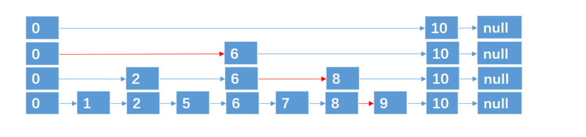
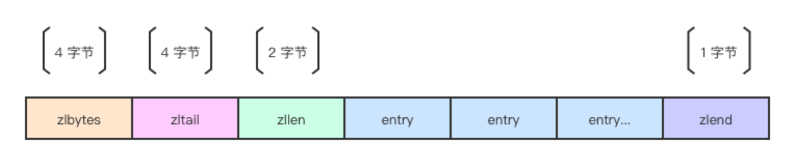
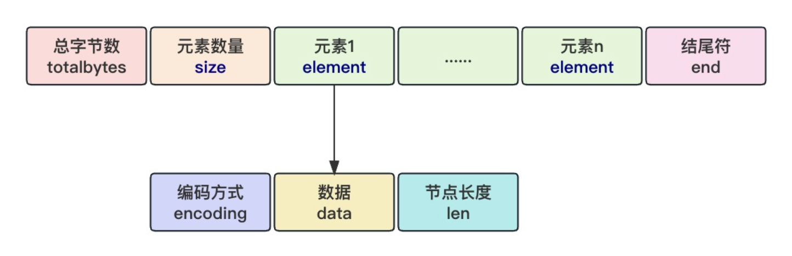

## 一、数据结构

### 1.  讲一下Redis底层的数据结构

| 数据类型    | 底层数据结构                                              | 应用场景                                                     |
| ----------- | --------------------------------------------------------- | ------------------------------------------------------------ |
| String      | SDS (int/embstr/raw)                                      | 缓存热点数据、计数器（浏览量）、会话存储、简单键值数据       |
| List        | 链表 + `Ziplist` (QuickList) v7.0后 ziplist变为`Listpack` | 消息队列、任务队列、双端操作（如聊天记录）                   |
| Hash        | `Ziplist`（小数据） / Hashtable（大数据）                 | 对象存储（用户信息、配置表）、字段管理（如购物车）           |
| Set         | Intset（小整数集合） / Hashtable（大数据）                | 社交网络（共同关注）、标签系统（兴趣分类）                   |
| Sorted Set  | `Ziplist`（小数据） / `Skip List` + Hashtable             | 实时排行榜、热门文章排序、范围查询（如按分数筛选）           |
| HyperLogLog | HyperLogLog                                               | 基数统计（网站UV、在线人数）、大数据去重计数                 |
| GEO         | Sorted Set + GeoHash                                      | 地理位置服务（附近的人、店铺定位）、距离计算（如外卖配送范围） |




1. **跳跃表 (Skip List)**
   - **结构**：跳跃表是一种有序数据结构，通过多层索引加速查找。
     - 每个节点包含多个指针，指向不同层级的下一个节点。
     - 底层是一个有序链表，高层是稀疏索引。
   
   - **应用**：用于实现 Redis 的 Sorted Set（有序集合）数据类型，支持范围查询（如 ZRANGE）和排名操作（如 ZRANK）。

   
   
   
   
2. **压缩列表 (Ziplist)**
   - **结构**：Ziplist 是一种紧凑的顺序存储结构，设计目标是节省内存。它不像传统的双向链表那样为每个节点分配独立的内存块，而是将所有元素存储在一块连续的内存中，通过特定的编码方式来表示每个元素及其元数据。
     - 由连续内存块组成，包含元数据（总字节数、元素个数等）和多个 entry。
     - 每个 entry 包含前一个 entry 的长度、当前 entry 的长度和数据内容。
   - **应用**：用于 List、Hash 和 Sorted Set 的小型数据存储（元素少于配置阈值时使用）。




3. **列表包 (listpack)**

- **结构**：Listpack 是一种连续的内存块，所有的元素都存储在一个单一的内存区域中，没有额外的指针开销。这使得它非常节省内存，特别适合存储小型数据集。通过去掉 prevlen 并采用自描述长度的设计，彻底消除了连锁更新问题，同时保持了内存高效性。


### 2. zset 用过吗

在实际使用中，比如在 Redis里，我可能会用它来实现排行榜功能。假设有个游戏需要记录玩家的分数，可以用 ZADD 命令添加玩家和他们的分数，比如：

```bash
ZADD leaderboard 100 "PlayerA" 150 "PlayerB" 120 "PlayerC"
```

然后用 ZRANGE 或 ZREVRANGE 获取排名前几的玩家：

```bash
ZREVRANGE leaderboard 0 2 WITHSCORES
```


### 3. zset 底层怎么实现的

在 Redis 中，ZSet（有序集合）的底层主要依赖两种数据结构：**跳表（Skip List）**和 **哈希表（Hash Table）**。

当 ZSet 元素很少时（默认小于 128 个，且每个元素长度小于 64 字节），它会使用 **ziplist**。一旦超过阈值，会切换到跳表+哈希表。


### 4. 跳表是怎么实现的？


链表在查找元素的时候，因为需要逐一查找，所以查询效率非常低，时间复杂度是O(N)，于是就出现了跳表。跳表是对普通有序链表的优化。普通链表查找是 O(n)，因为要从头遍历。跳表通过增加“索引层”，让查找变成类似二分法的过程，平均复杂度降到 O(log n)。


### 5.  跳表是怎么设置层高的？

当向跳表中插入一个新节点时，会按照你描述的规则为这个新节点随机确定其层高，而不是对链表中已有的所有节点重新操作。具体步骤如下：

1. **从第 0 层开始**：每个节点都必须在第 0 层，这是基础，所有节点都在这里按顺序排好。
2. **决定是否升层**：用一个随机数（0 到 1 之间）跟 0.25 比。
   - 如果随机数 < 0.25（概率是 25%），就往上升 1 层。
   - 如果随机数 ≥ 0.25（概率是 75%），就停在该层。
3. **重复这个过程**：如果升到了第 1 层，再生成一个随机数，又跟 0.25 比：
   - 如果 < 0.25，升到第 2 层。
   - 如果 ≥ 0.25，停在第 1 层。
4. **直到停止或达到上限**：一直重复，直到随机数 ≥ 0.25（失败）或者达到最大层数（比如 32）。


### 6. Redis为什么使用跳表而不是用B+树?

1. **高效的插入和删除操作：**跳表的插入和删除操作相对 B+ 树来说更为简单。跳表的插入和删除是基于链表节点的操作，不涉及像 B+ 树那样的复杂树结构调整（如节点合并、分裂等），并且 Redis 需要频繁地对数据进行增删操作，跳表更能满足这种需求。
3. **内存使用效率：** 跳表作为链式结构，能够更好地利用缓存局部性，提升内存访问效率。而 B+树的每个节点需要存储多个键值和指向子节点的指针，可能导致内部碎片，从而影响内存利用率。
4. **实现复杂度**跳表的实现相对简单直观。它基于链表结构，通过随机化的方式为节点添加额外的指针来实现多层索引，代码实现和维护的难度较低。B+ 树的实现较为复杂，涉及到节点的分裂、合并、平衡调整等操作，增加了开发和维护的成本。


### 7. 压缩列表（ziplist）如何实现的

Ziplist 是一种紧凑的顺序存储结构，设计目标是节省内存。它不像传统的双向链表（例如 Redis 后来的 quicklist）那样为每个节点分配独立的内存块。ziplist 是一块连续的内存区域，分为几个关键部分，每个部分紧密排列，没有额外的填充字节。

1. **头部元信息**：
   - zlbytes（4 字节）：整个 ziplist 的总字节数，方便快速获取大小。
   - zltail（4 字节）：尾节点相对于 ziplist 起点的偏移量，用于快速定位尾部。
   - zllen（2 字节）：ziplist 中节点（entry）的数量。如果节点数超过 65535（2字节最大值），这个字段会失效，需要遍历计算。
2. **节点（entry）**：
   - 每个节点表示一个存储的元素，节点之间紧密相连。
   - 每个节点包含：
     - prevlen：前一个节点的长度（字节数），用于反向遍历。
     - encoding：当前节点的编码方式，指示数据类型和长度。
     - data：实际存储的数据内容。
3. **结束标记**：
   - zlend（1 字节）：值为 0xFF（255），标记 ziplist 的结束。

```*
[zlbytes | zltail | zllen | entry1 | entry2 | ... | entryN | zlend]
```


每个节点（entry）的设计是 ziplist 节省内存的关键。它的字段是变长的，根据实际数据动态调整。

1. **prevlen（前节点长度）**：
   - 记录前一个节点的字节数，用于反向遍历。
   - 如果前节点长度 < 254 字节，用 1 字节存储。
   - 如果前节点长度 ≥ 254 字节，用 5 字节存储（第 1 字节为 0xFE，后面 4 字节存实际长度）。
   - 第一个节点的 prevlen 为 0（因为没有前节点）。
2. **encoding（编码字段）**：
   - 指定数据的类型和长度，长度是可变的（1、2 或 5 字节）。
   - 常见的编码类型：
     - **小整数**：直接嵌入值（如 0 到 12 用 1 字节表示）。
     - **大整数**：如 32 位或 64 位整数。
     - **字符串**：前缀记录字符串长度，后跟实际内容。
   - 示例（参考 Redis 实现）：
     - 00xxxxxx：6 位表示小整数（0-63）。
     - 11xxxxxx：字符串长度小于 63 字节。
     - 1110xxxx | 4字节：大整数或长字符串。
3. **data（数据内容）**：
   - 根据 encoding 的指示存储实际数据。
   - 如果是整数，直接存储值；如果是字符串，存储字节序列。


### 8. 压缩列表连锁更新问题，及listpack如何解决的

Zip List中每个元素都记录了前一个元素的长度（prev_len），当某个元素的大小发生变化（比如从小于255字节变为大于255字节），其后续元素的prev_len字段可能需要调整。这种调整会引发**连锁更新**，导致大量元素的元数据更新，性能开销很大。


**消除了连锁更新**：

List Pack不再存储前一个元素的长度（prev_len），而是将每个元素的长度信息直接编码在元素自身前面。这样，当某个元素的大小变化时，只需要修改该元素自身的元数据，不会影响后续元素，避免了连锁更新的性能问题。


### 9. 哈希表是怎么扩容的

- **扩容步骤**

1. 分配新的存储空间

​	创建一个新的更大的哈希表，新哈希表的容量通常是原哈希表容量的两倍。

2. 重新哈希元素

​	因为哈希表的容量发生了变化，元素的哈希位置也会相应改变，将原哈希表中的所有元素重新计算哈希值，并插入到新的哈希表中。

3. 更新引用

​	扩容完成后，将哈希表的引用指向新的哈希表，原哈希表的空间可以被释放。

- **扩容策略**

1. 渐进式扩容

在一些情况下，哈希表中的元素数量可能非常大，一次性完成重新哈希会导致较长的停顿时间，影响系统的性能。为了避免这种情况，可以采用渐进式扩容的策略。渐进式扩容的基本思想是在**每次进行插入、删除或查找操作**时，顺便将原哈希表中的一部分元素迁移到新的哈希表中，直到原哈希表中的所有元素都迁移完成。这样可以将扩容的开销分散到多个操作中，减少对系统性能的影响。


### 10. 哈希表扩容的时候，有读请求怎么查

在扩容期间，系统会同时存在旧哈希表和新哈希表。当有读请求到来时，会按照以下步骤进行查询：

优先查询旧哈希表，如果在旧哈希表中没有找到目标键值对，接着会到新哈希表中进行查找。因为在扩容完成之前，旧哈希表中仍然保存着尚未迁移的键值对。


### 11. String使用什么存储的，为什么不用C语言中的字符串

采用了简单动态字符串（Simple Dynamic String，SDS）这种数据结构存储的

不用C语言字符串原因：

1. 获取字符串长度的时间复杂度：C 语言使用以空字符 `'\0'` 结尾的字符数组来表示字符串，要获取字符串的长度，需要遍历整个字符串，直到遇到 `'\0'` 为止。SDS中有len字段表示长度
2. 缓冲区溢出问题：在对C语言字符串操作时并不会检查是否内存溢出，而是覆盖相邻的内存区域。

3. 二进制安全：C 语言的字符串以 `'\0'` 作为字符串的结束标志，这意味着字符串中不能包含 `'\0'` 字符，否则会被错误地截断，因此 C 语言字符串只能保存文本数据，不能保存二进制数据（如图片、音频等）。**SDS** 可以安全地保存任意二进制数据，是二进制安全的。


## 二、线程模型

### 1. Redis 为什么那么快

1. Redis 的几乎所有操作都在内存中完成，避免了磁盘 I/O 的延迟。同时，它为每种数据类型设计了高效的底层数据结构，极大提升了性能。
2. Redis 的核心命令处理采用单线程模型，避免了多线程间的锁竞争和上下文切换开销，不仅提升了执行效率，还消除了死锁风险。（Redis 的核心设计是单线程的，但在某些场景和版本中引入了多线程机制来提升性能。）
3. Redis 利用 I/O 多路复用技术（如 epoll 或 kqueue），通过主线程监听多个客户端连接的 I/O 事件，实现单线程高效处理多个并发 I/O 流。


### 2. Redis哪些地方使用了多线程

1. **后台任务的多线程（Redis 4.0+）**：将耗时操作（如删除大 Key、清理过期数据）从主线程分离，减少对前端请求的阻塞
2. **AOF 持久化刷盘（Redis 6.0+）**：将 AOF（Append-Only File）日志的刷盘操作（fsync）交给后台线程，避免阻塞主线程。
3. **I/O 多线程（Redis 6.0+）**：将网络 I/O 操作（读取客户端请求、发送响应）从主线程分离到多个辅助线程，提升高并发场景下的吞吐量。


### 3. Redis怎么实现的io多路复用

Redis 实现 **I/O 多路复用** 的核心在于其事件循环（Event Loop）机制，利用 select、poll、epoll 函数可以同时监察多个流的 I/O 事件的能力，在空闲的时候，会把当前线程阻塞掉。当有一个或多个流有 I/O 事件时，就从阻塞态中唤醒，于是程序就会轮询一遍所有的流，依次顺序的处理就绪的流，这种做法就避免了大量无用的等待操作。


### 4.Redis为什么要用io多路复用

Redis 的核心逻辑（数据操作、命令执行）采用单线程运行，避免了多线程上下文切换的开销，但是这也带来了挑战，单线程无法为每个客户端连接分配独立线程，这时需要一种机制让一个线程高效处理多个客户端的 I/O 请求。而**I/O 多路复用**允许单线程监控多个文件描述符（如 socket）的状态，当有事件（如可读、可写）发生时再处理。


## 三、事务

### 1. 如何实现redis的原子性

1. **单个命令原子性**：Redis 中的每个命令都是原子性的。这意味着，Redis 会确保一个命令在执行过程中不会被打断。
2. **事务机制（MULTI/EXEC）**：Redis 提供了事务机制。事务执行时，客户端可以将多个命令打包在一起发送给 Redis，Redis 会将它们作为一个整体执行，而不允许中途插入其他命令。
3. **Lua 脚本（EVAL）**：Redis 支持使用 Lua 脚本来执行原子操作。Redis 会将脚本作为一个原子操作执行，不会中断。


## 四、日志

### 1. Redis有哪些持久化方式？分别的优缺点是什么

1. **RDB 持久化**（Redis DataBase，快照持久化）：Redis 会在指定的时间间隔内生成数据库的快照，并将数据保存到磁盘上的 `.rdb` 文件中。这个过程是通过子进程执行的，Redis 主进程可以继续处理请求。

- 优点：
  - **性能好**：RDB 是通过子进程进行快照生成的，主进程不会被阻塞，因此 Redis 的响应性能不会受到影响。
  - **文件较小**：RDB 文件存储的是 Redis 数据的一个完整快照，相对于 AOF 来说，RDB 文件通常较小，因为它是以压缩的形式存储数据。
- 缺点：
  - **数据丢失**：如果配置得不够频繁，可能会丢失最近一段时间的数据。

2. **AOF 持久化**（Append Only File，追加文件持久化）：每当客户端执行**写命令**时，Redis 会将该命令追加到 AOF 文件中。可以通过配置不同的策略来控制命令写入 AOF 文件的频率（比如每次写操作都写、每秒写一次，或者根据某些条件写）。

- 优点：
  - **更高的数据安全性**：AOF 提供了比 RDB 更高的数据安全性，因为它可以以更高频率记录数据变更，数据丢失的风险较小。
- 缺点：
  - **性能较差**：由于每次写操作都要写入 AOF 文件，相较于 RDB，这会产生额外的 I/O 开销，可能导致性能下降。
  - **AOF 文件较大**：由于每条写操作都会被记录，因此 AOF 文件通常会比 RDB 文件大，尤其是在高写入频率的场景中。


## 五、淘汰和过期策略

### 1. 介绍一下Redis过期删除策略

1. **惰性删除**（Lazy Deletion）：在客户端访问一个键时，Redis 会检查该键是否已经过期。如果该键过期，Redis 会删除它并返回空值。
2. **定期删除**（Periodic Deletion）：Redis 会定期（通常是每 100 毫秒）扫描**一部分键**，删除那些已经过期的键。它通过一个定时器定期检查数据是否过期，并删除过期的键。


### 2. 介绍一下Redis 内存淘汰策略

Redis 提供了 6 种内存淘汰策略，可以通过 `maxmemory-policy` 配置项选择。每种策略都决定了在内存满时，Redis 如何选择哪些键进行删除。

1. **noeviction**（默认策略）：如果内存已满，Redis 将拒绝执行任何写操作，并返回错误。
2. **allkeys-lru**（最少最近使用（LRU））：从所有键中选择最近最少使用（LRU，Least Recently Used）的键进行删除，释放空间。
3. **allkeys-lfu**（最不经常使用）：从所有键中挑选使用频率最低的键淘汰。LFU（Least Frequently Used）基于访问频率，优先淘汰访问次数最少的键。  
4. **allkeys-random**（随机删除）：从所有键中随机选择一个键进行删除，释放空间。
6. **volatile-ttl**（根据 TTL 删除）从设置了过期时间的键中，优先选择即将过期的键进行删除。

（2，3，4也可以设置成只针对过期键值的淘汰策略）


### 3. 过期删除策略和内存淘汰策略有什么区别

- 内存淘汰策略是用于处理内存使用超过限制时，如何选择和删除一些数据（**对所有的键值**）以腾出内存空间的机制。
- 过期键删除策略是对**已过期的键值**对进行删除，Redis采用的删除策略是惰性删除+定期删除。


### 4.  Redis的缓存失效会不会立即删除

Redis 的缓存失效不会立即删除，而是：

1. **惰性删除**：在客户端请求访问时，Redis 检查键是否过期，若过期则删除。
2. **定期删除**：Redis 每 100 毫秒会定期检查部分键，删除过期的键


## 六、集群

**C** 一致性（Consistency）：所有节点看到的数据在任何时刻都是一致的。

**A** 可用性（Availability）：系统能够保证每个请求都能返回一个结果，无论是成功还是失败。

**P** 分区容忍性（Partition Tolerance）：系统能够容忍网络分区（即分布式系统中部分节点之间无法通信）的情况，即使发生分区，系统仍然能够继续运转。

**最终一致性**：这是一种放宽的一致性模型，意味着系统在经历一段时间后，所有的节点最终会达到一致的状态，但这并不保证在任何时刻节点数据都是一致的。

**强一致性**：强一致性是指在任何时刻，系统中的所有节点都保持一致。当你对数据执行读操作时，必须读取到最新的写入操作，也就是说，任何一个节点的读取操作都会返回与写操作一致的数据。


### 1. Redis主从同步中的增量和完全同步怎么实现？

- **完全同步**是指在主从节点**首次建立连接**或**重连**时，主节点会将当前的所有数据（快照）传输给从节点。

实现方式

1. **主节点生成 RDB 快照**：当从节点请求同步时，主节点会将当前的内存数据（所有键值对）序列化为一个 RDB 文件（即 Redis 数据库快照）。
2. **传输 RDB 文件**：主节点会将这个 RDB 快照文件通过网络发送到从节点。从节点接收到 RDB 文件后，会加载这个文件，将所有的键值对恢复到内存中。
3. **主节点和从节点同步完成**：从节点完成数据加载后，会从主节点继续增量同步（开始接收增量的写操作）。从这个时刻起，主从节点之间的同步会切换到增量同步。


- **增量同步**是指在完全同步之后，主节点和从节点之间仅同步数据变化部分，也就是只同步主节点上发生的写操作（增、删、改）。增量同步是在完全同步之后的常态同步方式。

实现方式

1. **主节点保存写操作的日志**：当主节点进行写操作时，这些操作会被记录在主节点的 **复制积压缓冲区**（Replication Buffer）中。

2. **从节点请求同步**：当从节点完成完全同步后，它会通过 **PSYNC** 命令一直请求增量同步。

3. **增量数据同步**：主节点将积压缓冲区中的增量操作传送给从节点，只有主节点发生的增量变化（写操作）会被同步到从节点。

4. **复制积压缓冲区**：主节点会维护一个复制积压缓冲区，存储最近的一段时间内的增量数据。这个缓冲区的大小是可配置的，通过 `repl-backlog-size` 配置项设置。
- 如果从节点断开连接并重新连接，主节点会检查复制积压缓冲区，看是否可以从该缓冲区中找到自断开以来的增量操作，如果可以，主节点将发送这些增量操作给从节点。
  
- 如果复制积压缓冲区中没有足够的增量数据（即从节点断开时间过长），主节点会进行完全同步。


### 2. redis主从和集群可以保证数据一致性吗

Redis 主从模式在 CAP 理论中更倾向于 **AP** 模型，即在网络分区发生时优先保证可用性（A）和分区容忍性（P），而牺牲强一致性（C）。这意味着在网络分区的情况下，主节点和从节点可能出现数据不一致，但从节点仍能继续响应读请求，系统整体保持可用。另一方面，Redis 集群模式在网络分区时更倾向于 **CP** 模型，即优先保证一致性（C）和分区容忍性（P），可能会牺牲部分可用性（A）。例如，当网络分区导致某些分片不可用时，Redis 集群可能拒绝服务，直到故障转移完成或分区恢复，以避免数据不一致。


### 3. 哨兵机制原理是什么

**Redis Sentinel** 是 Redis 的高可用性解决方案，它主要用于实现 Redis 集群的 **监控**、**故障转移** 和 **通知** 功能。

Sentinel 会通过定期向 Redis 节点发送 `PING` 命令来监控节点的健康状态。如果 Sentinel 检测到某个主节点不可用，它会从现有的从节点中选举出一个新的主节点。当选定了新的主节点后，Sentinel 会将该从节点提升为新的主节点，并将其他的从节点指向新的主节点进行同步。旧的主节点（如果它恢复了）将会变成一个从节点。


### 4. 哨兵机制的选主节点的算法介绍一下

1. Sentinel 定期检查 Redis 节点状态。如果节点超时未响应，Sentinel 认为该节点主观下线。此时sentinel集群会进行投票，如果超过 **Quorum** 数量的 Sentinel 认为节点故障，该节点成为客观下线。

2. 如果故障节点是主节点，Sentinel 从从节点中选举新的主节点。故障转移完成后，集群中的所有从节点会自动更新其配置，指向新的主节点并开始进行数据同步

3. 原主节点恢复后被降级为从节点，并同步新主节点数据。


### 5. Redis集群的模式了解吗 优缺点了解吗

Redis 集群模式（Redis Cluster）是一种高可用的分布式 Redis 部署方案。在集群模式下，数据被分布在多个 Redis 实例（节点）上，这些实例组成一个集群。每个节点存储的是数据的一部分

Redis 集群的关键特点：

- **分片（Sharding）**：Redis 集群将数据按 **槽**（slot）进行分片。每个 Redis 节点负责多个槽，槽的数量是固定的（16384 个槽）。每个键值对根据其哈希值映射到一个槽，进而决定存储在哪个主节点上。
- **高可用性**：Redis 集群通过主从复制保证数据的高可用性。每个主节点（master）都有一个或多个从节点（slave），从节点用于同步主节点的数据，并在主节点故障时进行故障转移。
- **自动故障转移**：当主节点发生故障时，Redis 集群会自动将某个从节点提升为新的主节点，确保集群继续提供服务。
- **无中心化**：Redis 集群没有单一的中央管理节点，集群中的每个节点都可以作为客户端请求的入口节点。（读都可以，写必须发到主节点）


**优点**：

- Redis 集群支持横向扩展、自动故障转移、无中心化架构、高可用性。
- 提供了更高的吞吐量和分布式的数据处理能力。

**缺点**：

- 客户端需要支持集群协议，操作复杂性较高。
- 不支持跨多个键的操作，需要保证操作的键在同一槽上。
- 配置和运维较为复杂，数据一致性和槽的迁移可能带来额外的挑战。


## 七、场景

### 1. 为什么使用 Redis

Redis 被广泛使用，主要因为其 **高性能** 和 **高并发** 的优势。

1. **加速数据访问**：在传统的数据库中（如 MySQL），读取数据时需要从磁盘读取，通常会比较慢。而 Redis 作为内存数据库，当用户再次访问数据时，可以直接从内存中读取，大大提高了数据访问速度，减少了磁盘 I/O 操作。
2. **高吞吐量和低延迟**：Redis 的每秒请求处理量（QPS）要远高于传统数据库。Redis 单机的 QPS 可以轻松突破 10 万，而 MySQL 单机的 QPS 通常较难超过 1 万。这使得 Redis 在高并发场景下，尤其是需要快速响应的应用中，成为理想的选择。


### 2. 为什么redis比mysql要快

1. 内存存储：Redis 是基于**内存存储**的NoSQL数据库，而 MySQL 是基于**磁盘存储**的关系型数据库。由于内存存储速度快，Redis能够更快地读取和写入数据，而无需像MySQL那样频繁进行磁盘I/O操作。
2. 简单数据结构：Redis是基于键值对存储数据的，支持**简单的数据结构**，它的每个操作都可以在 **常数时间 O(1)** 内完成。相比之下，MySQL需要定义表结构、索引等复杂的关系型数据结构，查询效率就会慢一些。
3. 线程模型：Redis采用**单线程模型**可以避免了多线程之间的竞争，省去了多线程切换带来的时间和性能上的开销，而且也不会导致死锁问题。


### 3. 本地缓存和Redis缓存的区别

**本地缓存**是指将数据存储在本地应用程序。Redis 是一个外部缓存系统，它将缓存数据存储在 **远程** 的 Redis 服务器（通常部署在独立机器上或者集群中）。

本地缓存的优势：

- 访问速度快：由于本地缓存存储在本地内存中，因此访问速度非常快，能够满足频繁访问和即时响应的需求。
- 低延迟：由于本地缓存位于本地设备上，因此能够提供低延迟的访问速度，适用于对实时性要求较高的应用场景。

分布式缓存的优势：

- 可扩展性强：分布式缓存的节点可以动态扩展，能够支持大规模的数据存储和访问需求。
- 数据一致性高：通过分布式一致性协议，分布式缓存能够保证数据在多个节点之间的一致性，减少数据不一致的问题。

分布式缓存的不足：

- 访问速度相对较慢：相对于本地缓存，分布式缓存的访问速度相对较慢，因为数据需要从多个节点进行访问和协同。
- 网络开销大：由于分布式缓存需要通过网络进行数据传输和协同操作，因此相对于本地缓存来说，网络开销较大。


### 4. 高并发场景，Redis单节点+MySQL单节点能有多大的并发量

| **服务器配置** | **Redis QPS（读取操作）** | **Redis QPS（写入操作）** | **MySQL QPS（读取操作）** | **MySQL QPS（写入操作）** |
| -------------- | ------------------------- | ------------------------- | ------------------------- | ------------------------- |
| **4 核 8 GB**  | **20万 QPS**              | **10万 QPS**              | **1万 - 3万 QPS**         | **1000 - 5000 QPS**       |


### 5. redis应用场景是什么

**Redis** 是一种基于内存的数据库，所有数据的读写操作都在内存中完成，因此它具备极高的读写速度。由于其性能优势，Redis 广泛应用于缓存、消息队列、分布式锁等场景。以下是一些典型的应用场景：

- **缓存系统**：Redis 最常见的应用之一是作为缓存。通过将热点数据存储在内存中，Redis 可以大幅提升数据访问速度，减少对数据库的频繁访问，从而减轻数据库负载。这对于需要低延迟、高响应速度的应用场景尤其重要。
- **排行榜/排名系统**：Redis 提供了有序集合（Sorted Set），非常适合用来实现排行榜系统。通过简单的操作，Redis 可以高效地进行数据排序和排名管理，广泛应用于游戏排名、社交平台热搜排行等场景。
- **计数器与统计数据**：得益于 Redis 的高性能和原子操作，Redis 是实现计数器和统计系统的理想选择。无论是网站的访问量统计，还是点赞数、订单数等，Redis 都能高效处理并提供实时更新。
- **分布式锁**：Redis 的原子性操作特性使其非常适合用于实现分布式锁。在多进程或多服务之间，Redis 可以确保数据操作的原子性和一致性，从而避免并发带来的问题，保障系统的正确性。
- **消息队列**：Redis 支持发布/订阅（Pub/Sub）功能，能够轻松实现消息队列系统。通过 Redis，多个系统或服务可以实时接收和处理消息，广泛用于实时通知、任务调度等场景。


###  6. Redis支持并发操作吗

- 单个Redis 命令的原子性：Redis的单个命令是原子性的，这意味着一个命令要么完全执行成功，要么
  完全不执行，确保操作的一致性。这对于并发操作非常重要。
- 多个操作的事务：Redis支持事务，可以将一系列的操作放在一个事务中执行，使用MULTI、EXEC、
  DISCARD和WATCH等命令来管理事务。这样可以确保一系列操作的原子性。


### 7. Redis分布式锁的实现原理？什么场景下用到分布式锁

1. **使用 `SET NX` 命令实现锁的获取**
   - **SET** 命令使用`NX`有一个特性：只有在该键不存在时才会设置成功。如果键已经存在，则不会修改该键的值，返回 **0**。这就保证了在分布式环境下，不同进程/服务对同一个锁的竞争。

2. **使用 `EXPIRE` 命令设置锁的过期时间**

   - 为了防止某个客户端持有锁的过程中发生异常（如崩溃或未及时释放锁），Redis 分布式锁会为每个锁设置一个过期时间，这个过期时间可以防止死锁的发生。

   - 锁的过期时间可以通过 **EXPIRE** 命令或在 **SET** 命令中使用 `EX` 参数来设置。

3. **锁的释放**
   - 锁获取后，客户端可以在执行完任务后通过 **DEL** 命令后，获取锁的客户端删除锁。如果在客户端没有正常释放锁（例如因故障崩溃等原因），Redis 会根据设置的过期时间自动释放锁，防止死锁发生。


### 8. Redis的大Key问题是什么？

Redis大key问题指的是某个key对应的value值所占的内存空间比较大，导致Redis的性能下降、内存不足、数据不均衡以及主从同步延迟等问题。

到底多大的数据量才算是大key?
没有固定的判别标准，通常认为字符串类型的key对应的value值占用空间大于1M，或者集合类型的k元素数量超过1万个，就算是大key。

Redis大key问题的定义及评判准则并非一成不变，而应根据Redis的实际运用以及业务需求来综合评估。例如，在高并发且低延迟的场景中，仅10kb可能就已构成大key；然而在低并发、高容量的环境下，大key的界限可能在100kb。因此，在设计与运用Redis时，要依据业务需求与性能指标来确立合理的大key阈值。


### 10. **大 Key 问题的缺点？**

1. **内存占用高**：单个大 Key 会占用大量内存，可能导致 Redis 内存耗尽，甚至崩溃。
2. **性能下降**：操作大 Key（如读取、删除）会消耗较长时间，可能导致 Redis 处理其他请求时的延迟。
3. **阻塞操作**：Redis 是单线程的，操作大 Key 时可能阻塞其他请求，影响系统响应。
4. **网络带宽压力**：客户端获取大 Key 时，可能导致网络带宽的瓶颈，尤其是在大数据量传输时。
5. **Redis 集群负载不均**：大 Key 可能会影响数据的均匀分布，导致某些 Redis 节点负载过重。


### 11. **Redis 大 Key 如何解决？**

1. **避免存储大数据**：尽量避免存储超大文件、大文本等数据在 Redis 中。可以将文件存储在外部存储系统（如 HDFS、云存储）中，Redis 中只存储引用或元数据。
2. **拆分大数据**：对于大列表、集合、哈希等数据结构，将其拆分成多个小键进行存储，例如将长列表按某种规则拆分成多个小列表。
3. **使用合适的数据类型**：根据需求选择合适的 Redis 数据类型，避免过度嵌套和过大的元素。
4. **设置过期时间（TTL）**：定期清理 Redis 中不再需要的数据，防止大 Key 长时间占用内存。


### 12. **什么是热 Key？以及它带来的问题**

**热 Key** 是指在一段时间内被频繁访问的键。通常，这些键的访问量远高于其他键，可能是热点数据。热 Key 可能导致以下问题：

1. **过度占用 Redis 资源**：频繁的访问会导致 Redis 内存和 CPU 占用较高，影响其他请求的处理。
2. **网络瓶颈**：大量访问同一个键，可能导致网络带宽压力加大，影响系统性能。
3. **负载不均**：在分布式环境下，热 Key 会导致某些节点负载过重，造成负载不均。


### 13. **如何解决热 Key 问题？**

1. **数据分散**：通过增加缓存层或使用分布式缓存，确保热 Key 不会集中在单个节点上。可以使用 **一致性哈希** 机制将热 Key 分散到不同的 Redis 节点上。
4. **增加缓存层**：本地缓存热 key，减少对远程缓存（如 Redis）的访问，提高读性能。


### 14. 如何保证 redis 和 mysql 数据缓存一致性问题

通过消息队列实现缓存删除的可靠性，结合 Binlog 订阅进行数据更新后的缓存删除操作。

- **写操作**：数据库更新后，发布删除缓存的消息到队列。消费者会从队列中获取消息并删除相应的缓存。如果删除缓存失败，消费者会根据重试机制重新尝试。

- **读操作**：如果缓存未命中，则从数据库加载数据，加载后将数据缓存到 Redis。

- **Binlog 订阅**：使用 Canal 等工具订阅数据库的 Binlog，当数据更新时，触发删除缓存的操作，确保缓存与数据库的一致性。


### 15. 缓存穿透、击穿、雪崩是什么？怎么解决？

1. **缓存穿透**：在高并发场景下，客户端请求访问的数据在缓存中不存在，导致请求直接穿透到后端存储（如数据库），从而对后端存储造成过大压力，缓存无法起到加速的作用的一种现象

   解决方法：

   - **布隆过滤器（Bloom Filter）**：使用布隆过滤器来判断数据是否存在，如果布隆过滤器判断数据不存在，直接返回空结果，避免访问数据库。布隆过滤器能够快速判断某个数据是否存在，虽然存在一定的误判，但可以避免多次查询数据库。

   - **缓存空数据**：对于不存在的数据，可以将空值（null）存入缓存，设置一个较短的 TTL（缓存过期时间），防止恶意请求频繁查询数据库。

   - **验证请求合法性**：在前端或者接口层对请求进行合法性检查，防止恶意请求直接访问数据库。

2. **缓存击穿**：缓存击穿是指**某个数据**的缓存**失效或过期**时，恰好有大量并发请求来查询这个数据，导致所有请求都直接访问数据库，给数据库带来巨大压力。这通常发生在缓存过期的边界时间，多个请求并发访问数据库。

   解决方法：

   - **加锁（Mutex Lock）**：当一个请求访问到缓存失效的数据时，给失效的数据加锁，通过加锁，保证只有一个请求去查询数据库并更新缓存，避免多个请求同时打数据库。

   - **提前加载热点数据（预热缓存）**：在热点数据即将过期之前，提前从数据库加载数据并更新缓存，避免缓存的突发失效。

3. **缓存雪崩**：缓存雪崩是指缓存中的**大量数据**在同一时刻**失效**，导致大量请求同时访问数据库，造成数据库压力过大，甚至可能导致数据库崩溃。

   解决方法：

   - **设置不同的缓存过期时间**：通过给缓存数据设置不同的过期时间，避免所有数据在同一时刻失效，可以随机化过期时间或采用滑动过期策略。
   - **加锁（Mutex Lock）**：当一个请求访问到缓存失效的数据时，给失效的数据加锁，通过加锁，保证只有一个请求去查询数据库并更新缓存，避免多个请求同时打数据库。

   - **降级策略**：当缓存雪崩导致数据库无法承载时，可以设置系统的 **降级策略**，如返回默认值、返回错误页面或触发紧急备用服务等，防止全系统崩溃。


### 16.  布隆过滤器原理介绍一下

**布隆过滤器（Bloom Filter）** 是一种空间效率非常高的概率型数据结构，用于判断一个元素是否属于一个集合。它的特点是 **可能误判**（误报），但 **不会漏判**。

布隆过滤器使用一个长度为 **m** 的位数组（通常初始化为全0，占1bit），其中每个位置可以是 0 或 1。

- 布隆过滤器的**标记**：

  1. 对于要插入的数据，使用 N个哈希函数分别对数据做哈希计算，得到N个哈希值。

  2. 将第一步得到的N个哈希值对位图数组的长度取模，得到每个哈希值在位图数组的对应位置。

  3. 将每个哈希值在位图数组的对应位置的值设置为1;

- 当你想**查询**一个元素是否在集合中时，同样使用哈希函数计算该元素的哈希值，查看位图中这些位置的位是否都是 1。
  - 如果 **任意一个位置是 0**，则该元素一定不在集合中。
  - 如果**所有的位置都是 1**，则该元素 **可能** 在集合中，存在 **误判的可能性**。


### 17. 如何设计秒杀场景处理高并发以及超卖现象？

高并发处理

- **负载均衡**：使用 Nginx 做流量分发，将请求均匀分配到后端服务器，避免单点压力过大。
- **分布式缓存**：引入 Redis 作为库存管理和数据查询的核心缓存组件，减少数据库的直接访问压力。
- **异步处理**：将非核心逻辑（如订单记录、通知）放入消息队列，异步处理以提升吞吐量。
- **限流与熔断**：通过 Sentinel 设置流量限制，防止系统被冲垮，同时在异常情况下快速失败。


防止超卖

- **Redis 原子操作和消息队列**：利用 Redis 的单线程特性和 INCR/DECR 命令实现库存扣减，通过 Lua 脚本或redis事务保证操作的原子性，避免超卖。

  ```lua
  local stock = redis.call('GET', 'stock_key')
  if stock and tonumber(stock) > 0 then
      redis.call('DECR', 'stock_key')
      return 1
  else
      return 0
  end
  ```

  在秒杀开始前，先从 MySQL 数据库里把商品的库存数量**拿出来**，存到 Redis 里。抢购时，在 Redis 中**先把库存减掉**，成功后通过异步的方式（消息队列）把订单信息写到数据库。如果数据库写订单失败了，可以通过补救措施把 Redis 里的**库存加回去**。


