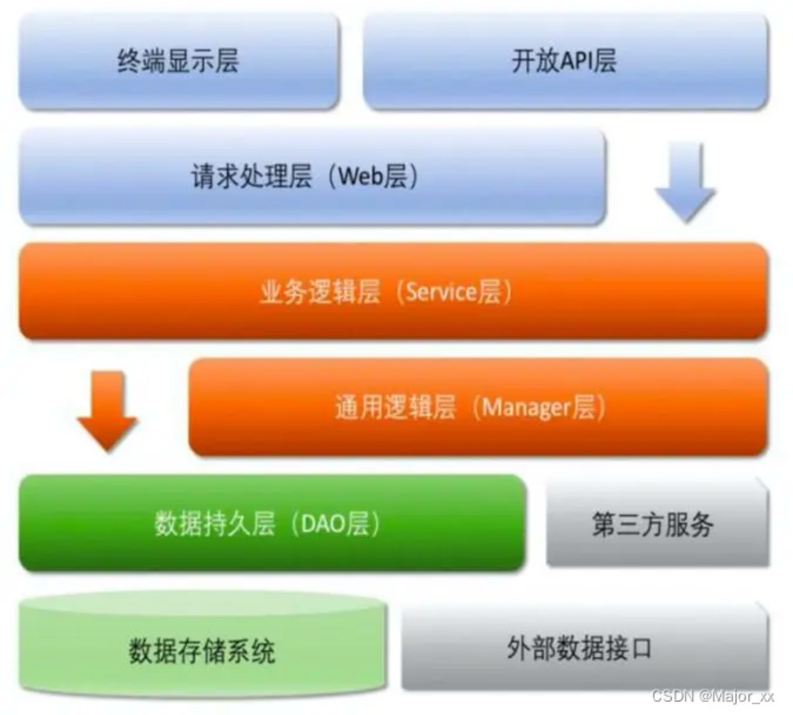

## 一、Spring

### 1. 说一下你对 Spring 的理解

我对 Spring 的理解可以从几个关键点来谈：

1. **核心容器**
   Spring 的核心是它的 IoC（Inversion of Control，控制反转）容器，通过依赖注入管理对象的创建和生命周期。你不用自己手动 new 对象，只需要在配置文件（如今更多是通过注解或 Java 配置）里声明依赖关系，Spring 就会帮你把需要的对象注入进来。这大大降低了代码的耦合性。
2. **AOP 的作用**
   Spring 的另一个亮点是 AOP，它允许你把横切关注点（比如日志、事务管理、安全性）从业务逻辑中分离出来。比如，你可以用一个切面（Aspect）来统一处理所有方法的日志记录，而不用在每个方法里手动写日志代码。
3. **事务管理**

​	Spring 的事务管理让开发者轻松实现一致性控制，声明式用起来简单，编程式够灵活，适应各种业务需求。

4. **模块化设计**
   Spring 不是一个单一的框架，而是一个生态系统。它提供了很多模块，比如 Spring MVC（用于 Web 开发）、Spring Boot（快速开发利器）、Spring Data（简化数据库操作）、Spring Security（安全性管理）等等。你可以根据项目需求选择合适的模块，而不是一股脑儿全用上。


### 2. Spring IoC和 AOP 介绍一下

- IoC：即控制反转的意思，它是一种创建和获取对象的**技术思想**，**依赖注入(DI)**是实现这种技术的一种方式。传统开发过程中，我们需要通过 `new` 关键字来创建对象。使用 `loC` 思想开发方式的话，我们不通过new关键字创建对象，而是通过**loC容器**来帮我们实例化对象。通过 `loC` 的方式，可以大大降低对象之间的耦合度。
- AOP：是面向切面编程，能够将那些与业务无关，却为业务模块所共同调用的逻辑封装起来，以减少系统的重复代码，降低模块间的耦合度。Spring AOP 就是**基于动态代理**的，**如果要代理的对象，实现了某个接口**，那么 Spring AOP 会使用 `JDK Proxy`，去创建代理对象，**而对于没有实现接口的对象**，就无法使用 `JDK Proxy` 去进行代理了，这时候 Spring AOP 会使用 `Cglib` 生成一个被代理对象的子类来作为代理。


在 Spring 框架中，IOC 和 AOP 结合使用，可以更好地实现代码的模块化和分层管理。例如:

- 通过IOC 容器管理对象的依赖关系，然后通过AOP 将横切关注点统一切入到需要的业务逻辑中。
- 使用IOC 容器管理 Service 层和 DAO 层的依赖关系，然后通过 AOP 在 Service 层实现事务管理、日志记录等横切功能，使得业务逻辑更加清晰和可维护。


### 3.  IOC和AOP是通过什么机制来实现的

“Spring 的 IoC（控制反转）是通过 **IoC 容器** 实现的，核心组件是 **BeanFactory** 和它的扩展 **ApplicationContext**。它主要依赖以下机制：

1. **工厂模式**：
   `BeanFactory` 是 IoC 的基础，像一个工厂，负责管理和生产 Bean。它贯穿整个过程，开发者通过它获取对象，实现了控制反转。

2. **配置解析**：
   IoC 首先需要知道有哪些 Bean 以及它们的依赖关系。容器会解析配置信息（ XML、注解（@Autowired）和 Java 配置（@Configuration）），生成 `BeanDefinition` 对象，记录 Bean 的信息。

3. **反射机制**：
   容器根据 `BeanDefinition`，通过 Java 反射动态加载类，创建对象，并通过设置属性或调用 setter 方法注入依赖。这让 Bean 的实例化完全自动化。

4. **依赖注入**：
   在实例化 Bean 后，容器会根据配置（比如 @Autowired），用反射把依赖的对象注入到目标 Bean 中。

5. **生命周期管理**：
   容器还负责 Bean 的初始化（比如 @PostConstruct）和销毁（比如 @PreDestroy），通过事件机制通知这些状态变化。


Spring AOP 默认使用 **JDK 动态代理** 和 **CGLIB 代理**：

- 如果目标类实现了接口，用 JDK 动态代理，基于接口生成代理对象。
- 如果没有接口，Spring会使用CGLIB库生成一个被代理类的子类作为代理。


### 4. 怎么理解SpringIoc

IOC：Inversion Of Control，即控制反转，是一种设计思想。在传统的Java SE 程序设计中，我们直接在对象内部通过new的方式来创建对象，是程序主动创建依赖对象。而在Spring程序设计中，IOC是有专门的容器去控制对象

所谓控制就是对象的创建、初始化、销毁。

1. 创建对象：原来是 new 一个，现在是由 Spring 容器创建。
2. 初始化对象：原来是对象自己通过构造器或者 setter 方法给依赖的对象赋值，现在是由 Spring 容器自
   动注入。
3. 销毁对象：原来是直接给对象赋值 null或做一些销毁操作，现在是Spring 容器管理生命周期负责销毁
   对象。


### 5. 控制反转，依赖注入和依赖倒置分别是什么

- 控制反转：控制反转是一种更广义的设计思想，指**把对象的创建和管理的控制权从程序员自己反转给外部框架或容器**。
- 依赖注入：依赖注入是一种实现依赖倒置的具体技术。它的意思是：**把对象的依赖（别的对象）通过外部传入，而不是自己创建**。
- 依赖倒置：这条原则跟控制反转有点类似，主要用来指导框架层面的设计。**高层模块不应该依赖低层模块，两者都应该依赖抽象**；**抽象不应该依赖实现，实现依赖抽象**。


### 6.  SpringAOP主要想解决什么问题

Spring AOP 主要解决**横切关注点的重复和耦合问题**，通过切面把日志、事务等通用逻辑抽出来，让业务代码更专注、更易维护。


### 7. 动态代理是什么

动态代理（Dynamic Proxy）是一种在**运行时动态生成代理对象**的技术，它允许你在不修改原始类代码的情况下，为目标对象添加额外的功能。


### 8. 动态代理和静态代理的区别

1. 静态代理

静态代理是指在编译时就已经确定了代理类的代码。开发人员需要手动编写一个代理类，并将目标对象（即被代理的对象）通过代理类进行包装。

- 代理类在编译时就确定。

- 需要为每个目标类创建一个对应的代理类。

2. 动态代理

动态代理是指在运行时，运用反射机制动态创建代理类。

- 代理类在运行时生成。

- 不需要为每个目标类编写代理类。


### 9.  什么是反射？有哪些使用场景

**反射（Reflection）** 是 Java 中的一种机制，它允许程序在运行时动态地获取类的结构信息，并可以动态地创建对象、调用方法或访问字段。

使用场景：

**框架和库的设计**：

- 许多框架（如 Spring、MyBatis等）使用反射来实现依赖注入、自动化配置和插件机制等功能。

**动态代理**：

- 反射是实现动态代理的基础，Java 的 `Proxy` 类和 Spring AOP 使用反射来动态地调用方法和处理横切关注点（如日志、事务等）。


### 10. spring是如何解决循环依赖的

**Spring 如何解决循环依赖**，这个问题是 Spring 容器中的一个经典问题，特别是在使用依赖注入（DI）时。当 A 类依赖 B 类，而 B 类又依赖 A 类时，形成了一个“循环依赖”问题。

具体的解决方法主要取决于是否涉及到 **单例 bean** 和 **原型 bean**。

1. 单例 Bean 的循环依赖解决

在 Spring 中，**单例 bean** 是最常见的 Bean 范式（默认情况）。Spring 解决单例 Bean 循环依赖的问题，主要依赖于 **三级缓存**（三级缓存机制）和 **提前暴露代理对象** 的方式。

处理过程：

- **Spring 通过三级缓存来处理循环依赖**，每个 Bean 在创建时会经历以下几个阶段：
  1. **实例化阶段**：
     - Spring 首先会将 Bean 的实例化过程放入缓存中（第一个缓存），此时这个 Bean 还没有完全初始化好。
  2. **设置依赖阶段**：
     - 在 Bean 的依赖注入阶段，Spring 会检测到当前 Bean 依赖的其他 Bean，如果是尚未完成的 Bean，Spring 会暂时通过代理的方式（通常是 **JDK 动态代理** 或 **CGLIB 代理**）将未完全初始化的 Bean 暴露出来（第二个缓存）。这就允许循环依赖的 Bean 能够互相依赖，但都不是完整的对象。
  3. **初始化阶段**：
     - 在 Bean 的初始化（如调用 `@PostConstruct` 注解的方法或实现 `InitializingBean` 接口的 `afterPropertiesSet()` 方法）完成之后，Spring 会将最终的 Bean 放入第三个缓存中。

通过这种机制，Spring 能够通过**提前暴露一个对象的代理或部分初始化的对象**来解决依赖问题，这样可以在循环依赖发生时，让一个类能够先“拿到”另一个类的代理对象，从而完成整个依赖注入过程。


2. 原型 Bean 的循环依赖

Spring 通过 **原型模式**（`@Scope("prototype")`）创建的 Bean 是每次注入时都会创建新的实例。因此，在原型 Bean 中，循环依赖的处理会有所不同。

对于 **原型 Bean**，Spring 并不会自动解决循环依赖问题，因为每次注入原型 Bean 时都会创建新的实例，Spring 不会缓存原型 Bean 的实例。因此，如果 A 和 B 互相依赖并且都是原型 Bean，Spring 无法像单例 Bean 那样提前暴露代理对象。

通常，**解决方案是使用显式的 `@Lazy` 注解**，来延迟加载某个 Bean，避免循环依赖的发生。也可以通过 **构造器注入** 和 **Setter 注入** 等方式结合 `@Lazy` 来打破循环依赖。

```java
@Component
@Scope("prototype")
public class A {
    private final B b;

    @Autowired
    public A(@Lazy B b) {
        this.b = b;
    }
}

@Component
@Scope("prototype")
public class B {
    private final A a;

    @Autowired
    public B(@Lazy A a) {
        this.a = a;
    }
}
```

通过 `@Lazy` 注解，Spring 会在需要时才会真正实例化 `B` 或 `A`，从而避免了循环依赖的死锁。


### 11.  spring三级缓存的数据结构是什么

1. **一级缓存**：用于存放已经完全初始化的 Bean（即已经构造、设置属性、初始化完成的 Bean）。
2. **二级缓存**：用于存放被代理或者是正在创建中的 Bean。
3. **三级缓存**：存放的是早期暴露出来的 Bean 引用，通常用于单例模式下的循环依赖解决。


### 12. Spring的事务什么情况下会失效


### 13. Spring的事务，使用this调用是否生效


### 14. 说一下Bean的生命周期？

**实例化**：通过构造器或工厂方法创建 Bean。

**依赖注入**：通过构造器、Setter 方法或字段注入进行依赖注入。

**Aware 接口**：调用相应的 Aware 接口回调方法（如 `setBeanName()`）。

**初始化**：

- 如果有 `@PostConstruct` 注解的方法，则执行。
- 如果实现了 `InitializingBean` 接口，则调用 `afterPropertiesSet()` 方法。
- 如果定义了初始化方法（`init-method`），则调用该方法。

**使用 Bean**：在容器中使用 Bean。

**销毁前回调**：

- 如果有 `@PreDestroy` 注解的方法，则执行。
- 如果实现了 `DisposableBean` 接口，则调用 `destroy()` 方法。
- 如果定义了销毁方法（`destroy-method`），则调用该方法。

**销毁**：Spring 容器在关闭时销毁 Bean。


### 15. Bean是否是单例的

当你在 Spring 中定义一个 Bean 时，默认情况下，它是 **单例的**。这意味着 Spring 容器会创建一个 Bean 实例，并将其缓存起来，每次需要这个 Bean 时，Spring 都会返回相同的实例。


### 16.  Spring bean的作用域有哪些？

**单例作用域（Singleton）**：默认作用域，Bean 在容器中只有一个实例。

**原型作用域（Prototype）**：每次请求都会创建一个新的实例。

**请求作用域（Request）**：每个 HTTP 请求都有一个新的实例。

**会话作用域（Session）**：每个 HTTP 会话都有一个新的实例。

**全局会话作用域（GlobalSession）**：仅在 Portlet 环境下有效。

**应用作用域（Application）**：在整个 Web 应用中只有一个实例。


###  17. Spring容器里存的是什么？

Spring 容器里存储的主要是 **Bean**，即由 Spring 管理的对象。Spring 容器负责创建、配置和管理 Bean 的生命周期。除了 Bean 之外，容器还可能存储其他的一些与应用上下文相关的配置、元数据和资源。


## 二、SpringMVC

### 1. 介绍一下MVC分层

**MVC（Model-View-Controller）** 是一种经典的设计模式，旨在将应用程序的不同职责分离，以提高可维护性、可扩展性和可测试性。MVC 模式通过将应用程序分为三个核心部分：**模型（Model）**、**视图（View）** 和 **控制器（Controller）**

**Model（模型层）**：负责处理业务逻辑和数据访问。

**View（视图层）**：负责显示用户界面，呈现模型数据。

**Controller（控制器层）**：负责处理用户请求，协调模型和视图。


### 2. 了解SpringMVC的处理流程吗

1. **请求到达 DispatcherServlet**：请求进入 `DispatcherServlet`，是前端控制器，拦截所有请求。

2. **请求映射（Handler Mapping）**：`DispatcherServlet` 查询配置的 `HandlerMapping`，找到对应的控制器方法。

3. **执行拦截器（Interceptor）**：如果配置了拦截器，会在控制器方法执行前后进行处理（如权限检查、日志记录等）。

4. **执行控制器方法（Controller）**：控制器方法处理请求，调用业务层，生成模型数据并返回视图或 `ModelAndView`。

5. **视图解析（View Resolution）**：`DispatcherServlet` 获取控制器返回的视图名称，交给视图解析器解析并渲染。

6. **渲染视图并响应客户端**：最终，视图引擎将数据填充到视图模板中并返回给客户端。


### 3. Handlermapping 和 handleradapter有了解吗

**HandlerMapping**：
`HandlerMapping` 是 Spring MVC 中用于将 HTTP 请求映射到具体处理器（通常是控制器方法）的组件。它根据请求的 URL、请求方法（如 GET、POST）等信息，选择一个合适的控制器方法来处理请求。Spring 提供了多种实现方式，比如 `RequestMappingHandlerMapping`（基于注解的映射）和 `BeanNameUrlHandlerMapping`（通过 Bean 名称映射）等。

**HandlerAdapter**：
`HandlerAdapter` 是 Spring MVC 中负责执行处理器（控制器方法）的组件。它根据处理器的类型（如传统的 `Controller`、`HttpRequestHandler` 或注解驱动的 `@RequestMapping` 方法），选择合适的适配器来调用对应的方法并处理请求。每种不同的处理器类型都可能有不同的适配器。


## 三、SpringBoot

### 1. 为什么使用springboot

1. **快速开发**：Spring Boot 提供了开箱即用的配置，减少了大量的 XML 配置，采用约定优于配置的方式，能迅速搭建一个 Web 应用或微服务架构应用，提升开发效率。

2. **简化配置**：Spring Boot 通过 `application.properties` 或 `application.yml` 文件来集中配置项目，提供了一种更加简洁和一致的方式来管理应用的配置。通过 Spring Boot 的约定，减少了很多繁琐的配置工作。

3. **内嵌式服务器**：Spring Boot 集成了多个内嵌式服务器（如 Tomcat），可以直接以独立的 Java 应用运行，无需额外的 web 容器部署（如传统的 WAR 包部署）。这样，开发、测试和生产环境的配置一致性更高。


### 2. 怎么理解SpringBoot中的约定大于配置

约定大于配置是SpringBoot的核心设计理念，它通过预设合理的默认行为和项目规范，大幅减少开发者需要手动配置的步骤，从而提升开发效率和项目标准化程度。

**“约定大于配置”** 在 Spring Boot 中意味着：

- 框架为你提供了大量的默认配置和行为，开发者无需进行繁琐的手动配置。
- 通过遵循这些默认约定，开发者能够快速开始项目开发，专注于业务逻辑，而非底层配置。
- 如果默认配置不适用，可以通过配置文件轻松覆盖，依然保留了高度的灵活性。


### 3. SpringBoot的项目结构是怎么样的



- 开放接口层：可直接封装 Service 接口暴露成 RPC 接口；通过 Web 封装成 http 接口；网关控制层等。
- 终端显示层：各个端的模板渲染并执行显示的层。当前主要是velocity 渲染，JS 渲染，JSP 渲染，移动端展示等。
- Web 层：主要是对访问控制进行转发，各类基本参数校验，或者不复用的业务简单处理等。
- Service层：相对具体的业务逻辑服务层。
- Manager层：通用业务处理层，它有如下特征:
  - 1. 对第三方平台封装的层，预处理返回结果及转化异常信息，适配上层接口。
    2. 对 Service 层通用能力的下沉，如缓存方案、中间件通用处理。
    3. 与DAO 层交互，对多个DAO 的组合复用。
- DAO 层：数据访问层，与底层 MySQL、Oracle、Hbase、OceanBase 等进行数据交互。
- 第三方服务：包括其它部门RPC 服务接口，基础平台，其它公司的HTTP 接口，如淘宝开放平台、支付宝付款服务、高德地图服等。·
- 外部接口：外部（应用）数据存储服务提供的接口，多见于数据迁移场景中。


### 4. SpringBoot自动装配原理是什么？


### 5. 说几个启动器（starter)？

1. spring-boot-starter-web：这是最常用的起步依赖之一，它包含了Spring MVC和Tomcat嵌入式服务器，用于快速构建Web应用程序。
2. spring-boot-starter-security：提供了SpringSecurity的基本配置，帮助开发者快速实现应用的安全性，包括认证和授权功能。
3. spring-boot-starter-data-redis：用于集成Redis缓存和数据存储服务。这个Starter包含了与Redis交互所需的客户端（默认是Jedis客户端，也可以配置为Lettuce客户端），以及SpringDataRedis的支持使得在SpringBoot应用中使用Redis变得非常便捷。同样地，需要在配置文件中设置Redis服务器的连接详情
4. spring-boot-starter-test：包含了单元测试和集成测试所需的库，如JUnit,Spring Test,Assert等，便于进行测试驱动开发(TDD)。


### 6. SpringBoot里面有哪些重要的注解？还有一个配置相关的注解是哪个

Spring Boot 中一些常用的注解包括：

- **@SpringBootApplication**：用于标注主应用程序类，标识一个Spring Boot应用程序的入口点，同时启用自动配置和组件扫描。
- **@Controller**：标识控制器类，处理HTTP请求。
- **@RestController**：结合`@Controller`和`@ResponseBody`，返回RESTful风格的数据。
- **@Service**：标识服务类，通常用于标记业务逻辑层。
- **@Repository**：标识数据访问组件，通常用于标记数据访问层。
- **@Component**：通用的Spring组件注解，表示一个受Spring管理的组件。
- **@Autowired**：用于自动装配Spring Bean。
- **@Value**：用于注入配置属性值。
- **@RequestMapping**：用于映射HTTP请求路径到Controller的处理方法。
- **@GetMapping、@PostMapping、@PutMapping、@DeleteMapping**：简化`@RequestMapping`的GET、POST、PUT和DELETE请求。

另外，一个与配置相关的重要注解是：

- **@Configuration**：用于指定一个类为配置类，其中定义的bean会被Spring容器管理。通常与`@Bean`配合使用，`@Bean`用于声明一个Bean实例，由Spring容器进行管理。


### 7.  springboot怎么开启事务

在 Spring Boot 中开启事务非常简单，只需在服务层的方法上添加 @Transactional注解即可。

我们希望在这个方法中开启事务，只需在该方法上添加 `@Transactional` 注解，如下所示:

```java
public class UserServiceImpl implements UserService {
    @Autowired
    private UserRepository userRepository;
    
    @Override
    @Transactional
    public void saveUser(User user) {
    userRepository.save(user);
    }
}
```

这样，当调用 saveUserO 方法时，Spring 就会自动为该方法开启一个事务。如果方法执行成功，事务会自动提交；如果方法执行失败，事务会自动回滚。


## 四、MyBatis

### 1. 与传统的JDBC相比，MyBatis的优点？

1. **简化代码，减少样板代码**
   用传统JDBC时，你需要手动写一大堆代码来处理连接、SQL语句、参数设置、结果集映射等步骤。而MyBatis通过XML或注解的方式，把SQL语句和映射逻辑抽出来，开发者只需要关注SQL本身，不用写繁琐的JDBC boilerplate代码。
2. **SQL与代码分离**
   MyBatis允许你把SQL语句写在XML文件里（或者用注解），而不是硬编码在Java代码中。这样SQL更容易维护和调试，尤其是项目大了之后，改SQL不用动Java代码，降低了耦合性。
3. **自动映射结果**
   在JDBC中，你得一行一行从ResultSet里取数据，手动映射到对象属性。MyBatis可以自动把查询结果映射到Java对象（POJO），支持复杂对象关系映射（比如一对多、多对多），省时省力。
4. **集成性强**
   MyBatis跟Spring、Spring Boot这些框架集成非常方便，配置简单，能快速融入现代开发生态。JDBC虽然也能集成，但需要更多手动配置。


### 2. Mybatis里的 # 和 $ 的区别？

- **#{}**
- Mybatis 在处理 # 时，会创建预编译的SQL语句，将SQL 中的 `#{}` 替换为 `？`号，在执行SQL 时会为预编译SQL中的占位符赋值，调用PreparedStatement的set方法来赋值，预编译的SQL语句执行效率高，并且可以`防止SQL注入`，提供更高的安全性，适合传递参数值。
- **${}**
- Mybatis 在处理$O时，只是创建普通的SQL 语句，然后在执行SQL语句时MyBatis 将参数直接拼入到SQL 里，不能防止 SQL 注入，因为参数直接拼接到SQL 语句中，如果参数未经过验证、过滤，可能会导致安全问题。


### 3. MybatisPlus和Mybatis的区别？

MyBatis-Plus是在MyBatis基础上做了增强，提供了更多开箱即用的功能，旨在简化开发、提升效率。

1. **便捷的CRUD操作**
   MyBatis-Plus通过让Mapper接口继承BaseMapper，内置了一系列通用的CRUD方法。开发者无需手动编写重复的SQL语句，就能实现基本的增删改查操作，大大简化了开发流程。相比之下，MyBatis需要为每种操作单独编写SQL。
2. **强大的代码生成器**
   MyBatis-Plus提供了一个实用的代码生成工具，只需配置数据库表信息，就能自动生成实体类、Mapper接口、Service层代码。这不仅减少了手动编码的工作量，还能确保代码规范统一。而MyBatis则完全依赖开发者手动创建这些文件。
3. **丰富的注解支持**
   MyBatis-Plus引入了更多注解，开发者可以通过这些注解直接在实体类上定义数据库表与Java对象之间的映射关系或者自定义sql等。这样可以减少XML配置文件的编写，甚至在简单场景下完全无需XML。MyBatis虽然也支持注解，但功能较基础，复杂映射仍需依赖XML。


## 五、SpringCloud

### 1. 了解SpringCloud吗，说一下他和SpringBoot的区别

- **Spring Boot**
  是一个快速开发框架，旨在简化 Spring 应用的配置和开发。它通过“约定大于配置”、自动配置（Auto-Configuration）和嵌入式服务器，让开发者能快速搭建独立运行的应用程序。
- **Spring Cloud**
  是一个基于 Spring Boot 构建的微服务架构工具集。它提供了一套解决方案，用于解决分布式系统中常见的挑战，比如服务注册与发现、负载均衡、配置管理、熔断等。

两者可以结合使用，通过SpringBoot构建微服务应用，然后用SpringCloud来实现微服务架构中的各种功能。


### 2. 微服务常用的组件

1. **服务注册与发现**：用于让每个服务启动后会将自身的地址和端口信息注册到注册中心；其他服务要调用它时，通过注册中心获取服务实例的地址，而**不需要固定的地址**。

2. **服务调用**：服务之间的通信方式，可以通过 HTTP（如 RESTful API）或 RPC（远程过程调用）进行服务之间的请求。

3. **负载均衡**：在微服务架构中，通常会有多个相同的服务实例分布在不同的服务器上。负载均衡用于在多个实例间分配请求，避免某个实例过载。
4. **网关**：作为系统的统一入口，负责路由请求、认证授权、限流等。
5. **熔断与降级**：
   - 熔断：用于防止一个服务的故障传导到其他服务。如果某个服务在短时间内出现大量的错误或响应缓慢，熔断机制会自动切断对该服务的调用，避免对系统造成更大影响。
   - 降级：在服务出现问题时，提供降级策略，比如返回默认值或简化响应内容，使系统能够在部分服务不可用的情况下继续运行。

6. **分布式配置管理**：分布式配置管理用于集中管理各服务的配置文件，支持动态更新，不需要重启服务。 可以在配置更新后自动推送至各服务节点，使它们能实时更新配置信息，提升了系统的灵活性和一致性。


### 3. 负载均衡有哪些算法

1. **轮询**（Round Robin）： 按顺序依次分配请求到每个服务实例，循环进行。  
2. **加权轮询**（Weighted Round Robin）：根据实例的权重，按顺序分配请求，权重高的实例获得更多请求。  
3. **随机**（Random）：随机选择一个服务实例来处理请求。  
4. **加权随机**（Weighted Random）：根据实例权重随机选择，权重高的实例被选中的概率更大。  
5. **最小连接数**（Least Connections）：将请求分配给当前连接数最少的服务实例。  
6. **一致性哈希**（Consistent Hashing）：根据请求的客户端ip、或请求参数通过哈希算法得到一个数值，利用该数值取模映射出
   对应的后端服务器，这样能保证同一个客户端或相同参数的请求每次都使用同一台服务器


### 4. 如何实现一直均衡给一个用户？

可以通过「一致性哈希算法」来实现，根据请求的客户端ip、或请求参数通过哈希算法得到一个数值，利用该数值取模映射出对应的后端服务器，这样能保证同一个客户端或相同参数的请求每次都使用同一台服务器。


### 5. 介绍一下服务熔断

**服务熔断**（Circuit Breaker）是一种分布式系统中的容错机制，用来保护系统免于故障扩散。它的核心思想是在某个服务出现故障或响应过慢时，立即断开与该服务的连接，避免继续尝试调用该服务，从而防止系统中其他正常服务也受到影响。熔断机制能够快速响应系统的故障，并提供备用方案，保证系统的整体可用性。


### 6. 介绍一下服务降级

**服务降级**是分布式系统中的一种容错机制，用来在某些服务不可用或者性能不佳时，自动提供一个简化的或默认的响应，以保证系统的可用性和稳定性。通过服务降级，可以避免在高负载或故障情况下，用户体验的彻底失败，而是提供一个可接受的备用方案或降级服务。

服务降级通常与 **熔断器** 一起使用，当熔断器触发时，服务降级可以起到补充作用，返回一个默认的或预设的响应，防止系统因为部分服务故障而影响整个系统。


### 7. 