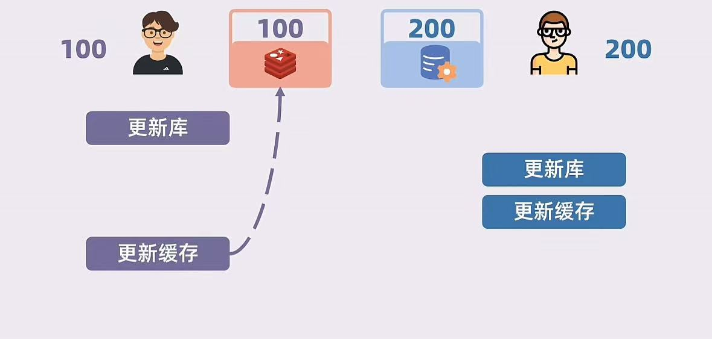
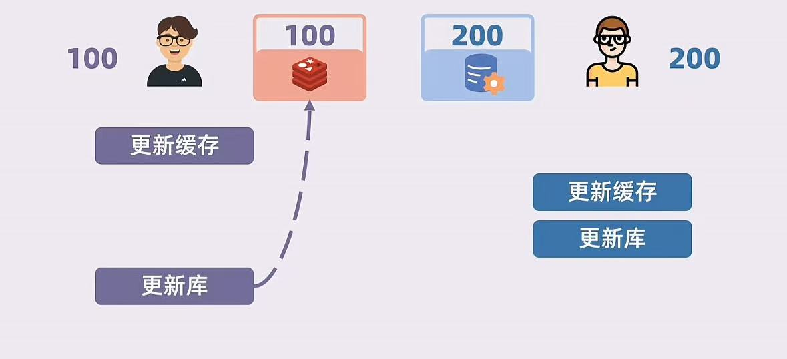
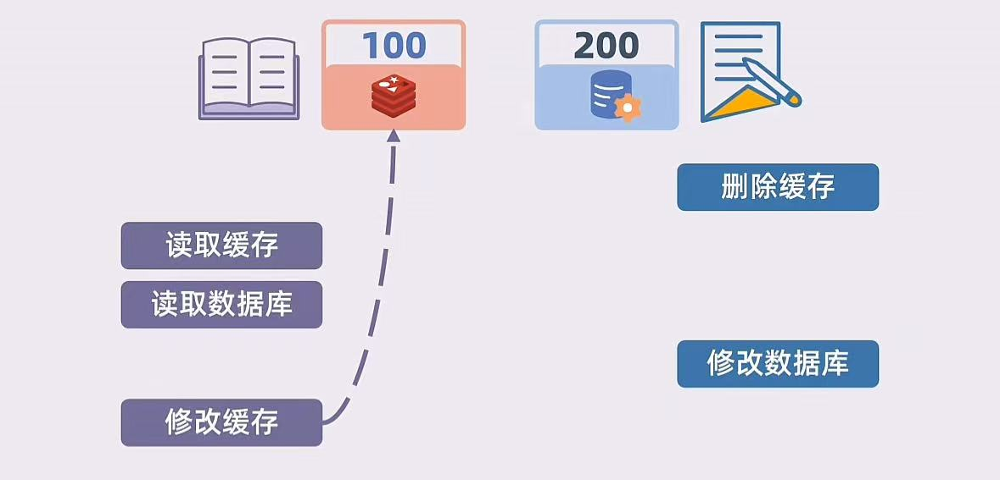
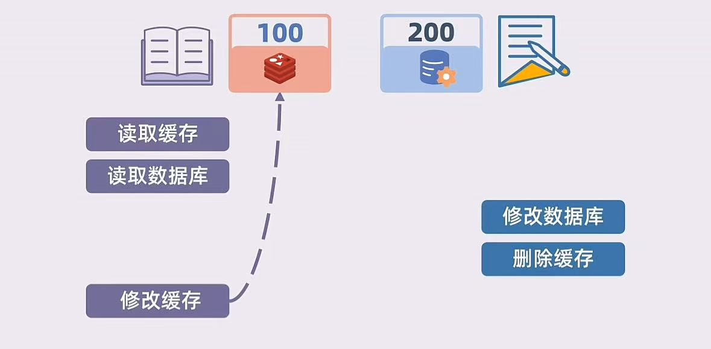

### 1. 缓存和数据库读写一致性问题

读写一致性：指的是在读写操作的整体流程中，确保读操作能够获取到最新的写操作结果，或者至少在某种一致性级别下（如强一致性或最终一致性）表现一致。

解决方案主要为：更新缓存（写穿透）和删除缓存（旁路缓存）。

Write Through（写穿透）：读请求只负责读，写请求完成更新缓存和数据库，不一致问题来自**写请求**的并发

Cache Aside（旁路缓存）：读请求会先读缓存数据，如果缓存数据不存在，则读数据库数据，并更新至缓存，写请求负责删除缓存，则不一致问题来自**读写请求**的并发

1. **更新缓存**

先更新数据库，在更新缓存

先更新缓存，在更新数据库

2. **删除缓存**

先删除缓存，在更新数据库

先更新数据库，在删除缓存

1. 优化 “更新缓存”（**锁机制**）

对于更新缓存存在的问题，主要来自写请求的并发，我们可以引入Java的锁或者在分布式环境下引入分布式锁机制来解决写请求的并发问题。

2. 优化 “删除缓存”（**延迟双删**）

我们在 “先删除缓存，在更新数据库” 的基础上再加上一个延迟删除，来解决读写请求并发导致的数据不一致。而 “先更新数据库，在删除缓存”本身还存在读请求读取到旧数据的情况，所以一般在  “先删除缓存，在更新数据库” 的基础上优化

### 2.双写一致性问题

双写一致性指的是在更新数据时，同时对数据库和缓存进行写操作（即“双写”），并确保这两者的更新保持一致。

解决方案：**分布式事务**、**异步消息队列**

分布式事务：通过分布式事务保证两次写入为原子性，要么执行成功，要么失败。（强一致性）

异步消息队列：先更新其中一个数据，然后通过消息队列和重试机制保证另一个数据的更新
