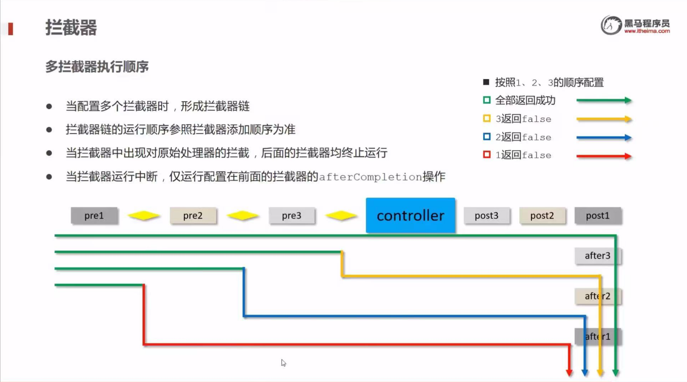
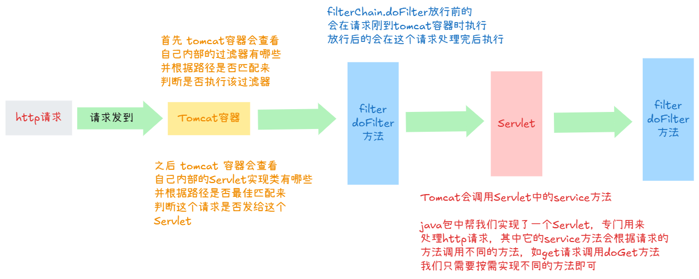
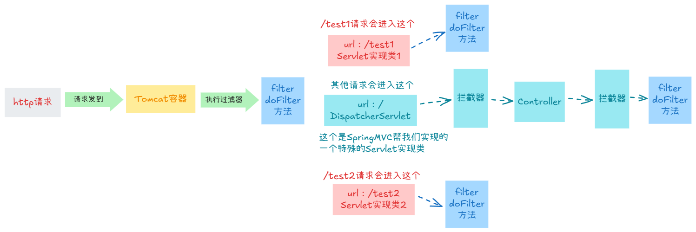

## 一、Servlet、拦截器、过滤器

### 1. Servlet

Tomcat是一个Servlet容器，当http请求发送到 Tomcat 监听的端口后，它会解析请求中的信息，并把信息封装到HttpServletRequest中，然后根据 url 调用最佳匹配的 Servlet 实现类的service方法，同时会把 `HttpServletRequest` 和 `HttpServletResponse` 对象传递给 **service**方法，**service**方法中把要设置的属性，返回的值等信息设置在 `HttpServletResponse` 中，service执行完后，tomcat解析`HttpServletResponse`对象中的属性，并构建响应给客户端

HttpServletRequest和HttpServletResponse都只是servlet提供的标准接口，Tomcat对它们有具体的实现类，所以这里我们接收参数用的是接口

HttpServlet 是实现了 Servlet 接口的一个处理Http请求的类，它在service方法中对get、post、put等不同类型的请求调用不同的doget,dopost 等方法，所以，我们只需要继承 `HttpServlet` ，并修改对用的 get 或 post 的方法即可，service 方法不需要修改，继承自HttpServlet即可，因为默认的HttpServlet的实现是根据不同类型的请求，调用不同的方法(get，post)

1. 启动Servlet扫描

```java
@SpringBootApplication
@ServletComponentScan
public class LearnServletApplication {

    public static void main(String[] args) {
        SpringApplication.run(LearnServletApplication.class，args);
    }
}
```

2. 自定义对应路径的Servlet

```java
@WebServlet(name = "testServlet", urlPatterns = {"/test1"})
public class TestServlet extends HttpServlet {

    @Override
    protected void doGet(HttpServletRequest req, HttpServletResponse resp) throws ServletException, IOException {
        // 支持中文
        resp.setCharacterEncoding("UTF-8");
        resp.setContentType("text/html;charset=UTF-8");
        System.out.println("Hello, Servlet! 你好，Servlet!");
        resp.getWriter().write("Hello, Servlet! 你好，Servlet!");
    }
}
```


### 2. Filter

在 Java Web 开发中，过滤器（Filter） 是 Servlet 规范中的一个重要组件，它是Servlet 容器层面的过滤器，也就是在请求**到达 Servlet** 或**响应返回客户端之前**，对请求和响应进行拦截和处理。

#### 2.1 自定义并应用过滤器

```java
@WebFilter(urlPatterns = {"/test1", "/test2"})
public class TestFilter implements Filter {

    @Override
    public void doFilter(ServletRequest servletRequest, ServletResponse servletResponse, FilterChain filterChain) throws IOException, ServletException {
        System.out.println("Servlet filter doFilter");

        System.out.println("放行前, 准备进入下一个过滤器或servlet");
        // 放行接口, 如果不调用的话, 不会进入下一个过滤器或servlet, 也就是说不调用的话, 这次请求在执行完 doFilter 方法后就结束了
        filterChain.doFilter(servletRequest, servletResponse);
        System.out.println("放行后, 继续执行当前过滤器");
    }
}
// 输出如下
Servlet filter doFilter
放行前, 准备进入下一个过滤器或servlet
Hello, Servlet! 你好，Servlet!
放行后, 继续执行当前过滤器
```



#### 2.2 控制过滤器的执行顺序

通过SpringBoot实现

```java
// 不需要@WebFilger
public class LoginFilter implements Filter {
    @Override
    public void doFilter(ServletRequest servletRequest, ServletResponse servletResponse, FilterChain filterChain) throws IOException, ServletException {
        System.out.println("LoginFilter: begin");
        filterChain.doFilter(servletRequest, servletResponse);
        System.out.println("LoginFilter: end");
    }
}
```

```java
public class LoginAfterFilter implements Filter {
    @Override
    public void doFilter(ServletRequest servletRequest, ServletResponse servletResponse, FilterChain filterChain) throws IOException, ServletException {
        System.out.println("LoginAfterFilter: begin");
        filterChain.doFilter(servletRequest, servletResponse);
        System.out.println("LoginAfterFilter: end");
    }
}
```

```java
// Order 值越小，越先执行
@Configuration
public class FilterConfig {

    @Bean
    public FilterRegistrationBean<LoginFilter> loginFilter() {
        FilterRegistrationBean<LoginFilter> registrationBean = new FilterRegistrationBean<>();
        registrationBean.setFilter(new LoginFilter());
        registrationBean.addUrlPatterns("/test1");
        registrationBean.setOrder(1);  // 设置过滤器顺序
        return registrationBean;
    }

    @Bean
    public FilterRegistrationBean<LoginAfterFilter> loginAfterFilter() {
        FilterRegistrationBean<LoginAfterFilter> registrationBean = new FilterRegistrationBean<>();
        registrationBean.setFilter(new LoginAfterFilter());
        registrationBean.addUrlPatterns("/test1");
        registrationBean.setOrder(2);  // 设置过滤器顺序
        return registrationBean;
    }
}
// 输出
LoginFilter: begin
LoginAfterFilter: begin
Hello, Servlet! 你好，Servlet!
LoginAfterFilter: end
LoginFilter: end
```




### 3. MVC

Spring MVC 的核心是一个名为 `DispatcherServlet` 的间接 Servlet 实现类，它通过继承 HttpServlet 间接实现了 Servlet 接口，充当了前端控制器的角色。默认情况下，DispatcherServlet 的 URL 映射路径是` /`，因此在没有其他更具体路径映射的 Servlet 存在时，所有请求都会被它拦截。在 DispatcherServlet 内部再次进行请求的分发，分发逻辑由 doDispatch 方法完成。doDispatch 根据最佳匹配原则，通过 HandlerMapping 将请求路径与 Controller 中的方法进行匹配，并调用相应的处理器完成请求处理。


在 `DispatcherServlet` 中的doService方法中会调用 doDispatch 进行路由的分发

在DispatcherServlet的父类`FrameworkServlet` 中有 doPost，doGet，doPut，service，processRequest 等方法，其中前面列出的除了 `processRequest ` 方法，其他的都是继承比重写了 `HttpServlet` 中的方法，FrameworkServlet 中的 service 不再是像 HttpServlet 那样根据请求类型，调用不同的处理方法. `FrameworkServlet` 选择将 `doPost，doGet，doPut，service` 这些方法都调用 `processRequest ` 方法进行处理，而processRequest 又会调用 doService 方法，在FrameworkServlet中 doService 是抽象方法.

DispatcherServlet 继承了FrameworkServlet上面的所有内容，并实现了doService方法

其中 doDispatch 主要功能有 通过 `mappedHandler` 查找并执行拦截器，然后通过 `HandlerAdapter` 查找并执行最佳匹配的Controller.




### 4. HandlerInterceptor

拦截器是 Spring MVC 的内部机制，运行在 `DispatcherServlet` 的请求处理流程中，而不是 Servlet 容器层面的过滤器。它的执行时机与 DispatcherServlet 的 doDispatch 方法密切相关。

#### 4.1 自定义并应用拦截器

1. 自定义拦截器

```java
@Component
public class TestInterceptor implements HandlerInterceptor {
    // 1. 在执行对应Controller之前执行
    @Override
    public boolean preHandle(HttpServletRequest request，HttpServletResponse response，Object handler) throws Exception {
        System.out.println("TestInterceptor preHandle");
        // true 会进入下一个过滤器或servlet
        // false 这次请求在执行完 doFilter 方法后就结束了
        return true;
    }

    // 2. 在执行完Controller之后执行
    @Override
    public void postHandle(HttpServletRequest request，HttpServletResponse response，Object handler，ModelAndView modelAndView) throws Exception {
        System.out.println("TestInterceptor postHandle");
    }

    // 3. 在执行完Controller和所有拦截器之后执行
    @Override
    public void afterCompletion(HttpServletRequest request，HttpServletResponse response，Object handler，Exception ex) throws Exception {
        System.out.println("TestInterceptor afterCompletion");
    }
}
```

2. 应用自定义的拦截器并指定顺序和拦截的路径

```java
@Configuration
public class WebConfig implements WebMvcConfigurer {

    @Autowired
    private TestInterceptor testInterceptor;

    @Override
    public void addInterceptors(InterceptorRegistry registry) {
        registry.addInterceptor(testInterceptor).addPathPatterns("/test2");
    }
}
```

```java
// 输出结果
Servlet filter doFilter
放行前, 准备进入下一个过滤器或servlet
TestInterceptor preHandle
TestController test2
TestInterceptor postHandle
TestInterceptor afterCompletion
放行后, 继续执行当前过滤器
```


#### 4.2 控制过滤器的执行顺序

```java
@Component
public class LoginInterceptor implements HandlerInterceptor {
    @Override
    public boolean preHandle(HttpServletRequest request, HttpServletResponse response, Object handler) throws Exception {
        System.out.println("LoginInterceptor preHandle");
        return true;
    }

    @Override
    public void postHandle(HttpServletRequest request, HttpServletResponse response, Object handler, ModelAndView modelAndView) throws Exception {
        System.out.println("LoginInterceptor postHandle");
    }

    @Override
    public void afterCompletion(HttpServletRequest request, HttpServletResponse response, Object handler, Exception ex) throws Exception {
        System.out.println("LoginInterceptor afterCompletion");
    }
}
```

```java
@Component
public class LoginAfterInterceptor implements HandlerInterceptor {
    @Override
    public boolean preHandle(HttpServletRequest request, HttpServletResponse response, Object handler) throws Exception {
        System.out.println("LoginAfterInterceptor preHandle");
        return true;
    }

    @Override
    public void postHandle(HttpServletRequest request, HttpServletResponse response, Object handler, ModelAndView modelAndView) throws Exception {
        System.out.println("LoginAfterInterceptor postHandle");
    }

    @Override
    public void afterCompletion(HttpServletRequest request, HttpServletResponse response, Object handler, Exception ex) throws Exception {
        System.out.println("LoginAfterInterceptor afterCompletion");
    }
}
```

```java
@Configuration
public class InterceptorConfig implements WebMvcConfigurer {
    
    @Autowired
    private LoginInterceptor loginInterceptor;
    
    @Autowired
    private LoginAfterInterceptor loginAfterInterceptor;
    
    // 先注册的先执行
    @Override
    public void addInterceptors(InterceptorRegistry registry) {
        registry.addInterceptor(loginInterceptor)
                .addPathPatterns("/test2");
        registry.addInterceptor(loginAfterInterceptor)
                .addPathPatterns("/test2");
    }
}
// 输出
LoginInterceptor preHandle
LoginAfterInterceptor preHandle
TestController test2
LoginAfterInterceptor postHandle
LoginInterceptor postHandle
LoginAfterInterceptor afterCompletion
LoginInterceptor afterCompletion
```


