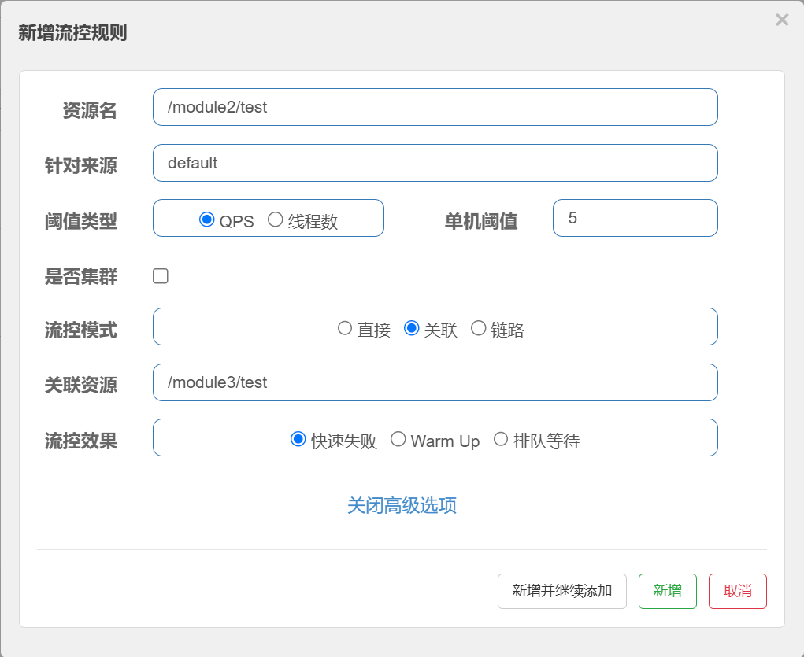

Spring Cloud 是一套基于 Spring Boot 的框架集合，用于构建分布式微服务架构。它提供了一系列工具和库，帮助开发者更轻松地管理分布式系统中的关键问题，比如服务注册与发现、负载均衡、分布式配置管理、熔断与降级、链路追踪等。

下图展示了微服务架构中每个主要功能模块的常用解决方案。


## 一、基本概念和feign的使用

1. **`服务注册与发现`**

**服务注册**：服务注册与发现用于让各个服务在启动时自动注册到一个中央注册中心（如 Nacos、Eureka），并且能让其他服务通过注册中心找到并调用它们的地址。  
**发现**：每个服务启动后会将自身的地址和端口信息注册到注册中心；其他服务要调用它时，通过注册中心获取服务实例的地址，而**不需要固定的地址**。

2. **`分布式配置管理`**

分布式配置管理用于集中管理各服务的配置文件，支持动态更新，不需要重启服务。  可以在配置更新后自动推送至各服务节点，使它们能实时更新配置信息，提升了系统的灵活性和一致性。

3. **`服务调用和负载均衡`**

**服务调用**：服务之间的通信方式，可以通过 HTTP（如 RESTful API）或 RPC（远程过程调用）进行服务之间的请求。  
**负载均衡**：在微服务架构中，通常会有多个相同的服务实例分布在不同的服务器上。负载均衡用于在多个实例间分配请求，常见的策略有轮询、随机、最小连接数等，从而提升系统的处理能力和容错性。

4. **`服务网关`**

服务网关作为服务的统一入口，处理所有外部请求，提供认证授权、负载均衡、路由分发、监控等功能。它还能对请求进行限流、熔断、降级等保护。  

5. **`分布式事务`**

分布式事务用于保证多个服务在处理同一个业务操作时的一致性。例如，用户下单时，需要支付服务和库存服务同时完成，如果某一方失败，整个操作需要回滚。  

6. **`服务熔断和降级`**

**服务熔断**：用于防止一个服务的故障传导到其他服务。如果某个服务在短时间内出现大量的错误或响应缓慢，熔断机制会自动切断对该服务的调用，避免对系统造成更大影响。  
**服务降级**：在服务出现问题时，提供降级策略，比如返回默认值或简化响应内容，使系统能够在部分服务不可用的情况下继续运行。

7. **`服务链路追踪`**

服务链路追踪用于跟踪分布式系统中一次请求的完整路径，分析其跨多个服务的执行情况，方便发现延迟或错误。  


## 二、引入springcloud依赖

### 1. dependencyManagement

`dependencyManagement` 是 Maven 构建工具中的一个元素，用于定义项目中依赖的管理方式。


1. **统一依赖版本管理：**  
   `dependencyManagement` 能够帮助你统一管理多个模块中某个依赖的版本。例如，你可以在一个中央位置（通常是父 POM 文件）声明 Spring Boot 的版本号，这样所有子项目都会使用这个版本，而不需要每个项目中都定义。

2. **简化子项目中的依赖声明：**  
   子项目无需在每个 `pom.xml` 文件中声明依赖的版本号，只需要定义依赖的 `groupId` 和 `artifactId`，版本号将从 `dependencyManagement` 中继承。

根项目 pom 文件
```xml
<?xml version="1.0" encoding="UTF-8"?>
<project xmlns="http://maven.apache.org/POM/4.0.0"
         xmlns:xsi="http://www.w3.org/2001/XMLSchema-instance"
         xsi:schemaLocation="http://maven.apache.org/POM/4.0.0 https://maven.apache.org/xsd/maven-4.0.0.xsd">
    <modelVersion>4.0.0</modelVersion>

    <groupId>com.example</groupId>
    <artifactId>dubbo-parent</artifactId>
    <version>1.0.0-SNAPSHOT</version>
    <packaging>pom</packaging>

    <properties>
        <java.version>17</java.version>
        <spring-boot.version>3.2.5</spring-boot.version>
        <spring-cloud.version>2023.0.3</spring-cloud.version>
        <spring-cloud-alibaba.version>2023.0.1.3</spring-cloud-alibaba.version>
    </properties>

    <!-- 添加 dependencyManagement 并导入依赖 -->
    <dependencyManagement>
        <dependencies>
            <!-- Spring Boot 版本管理 -->
            <dependency>
                <groupId>org.springframework.boot</groupId>
                <artifactId>spring-boot-dependencies</artifactId>
                <version>${spring-boot.version}</version>
                <type>pom</type>
                <scope>import</scope>
            </dependency>
            <!-- Spring Cloud 版本管理 -->
            <dependency>
                <groupId>org.springframework.cloud</groupId>
                <artifactId>spring-cloud-dependencies</artifactId>
                <version>${spring-cloud.version}</version>
                <type>pom</type>
                <scope>import</scope>
            </dependency>
            <!-- Spring Cloud Alibaba 版本管理 -->
            <dependency>
                <groupId>com.alibaba.cloud</groupId>
                <artifactId>spring-cloud-alibaba-dependencies</artifactId>
                <version>${spring-cloud-alibaba.version}</version>
                <type>pom</type>
                <scope>import</scope>
            </dependency>
    </dependencyManagement>

    <build>
        <plugins>
            <plugin>
                <groupId>org.springframework.boot</groupId>
                <artifactId>spring-boot-maven-plugin</artifactId>
            </plugin>
        </plugins>
    </build>

    <modules>
        <module>Consumer</module>
    </modules>
</project>
```

子项目 pom 文件

```xml
<?xml version="1.0" encoding="UTF-8"?>
<project xmlns="http://maven.apache.org/POM/4.0.0" xmlns:xsi="http://www.w3.org/2001/XMLSchema-instance"
         xsi:schemaLocation="http://maven.apache.org/POM/4.0.0 https://maven.apache.org/xsd/maven-4.0.0.xsd">
    <modelVersion>4.0.0</modelVersion>

    <parent>
        <groupId>com.example</groupId>
        <artifactId>dubbo-parent</artifactId>
        <version>1.0.0-SNAPSHOT</version>
        <relativePath>../pom.xml</relativePath> <!-- 指向父模块的POM文件 -->
    </parent>

    <artifactId>Proverder</artifactId>
    <version>0.0.1-SNAPSHOT</version>
    <name>Proverder</name>
    <description>Proverder</description>

    <dependencies>
        <dependency>
            <groupId>org.springframework.boot</groupId>
            <artifactId>spring-boot-starter</artifactId>
        </dependency>
		<dependency>
            <groupId>org.springframework.boot</groupId>
            <artifactId>spring-boot-starter-web</artifactId>
        </dependency>
        <dependency>
            <groupId>com.alibaba.cloud</groupId>
            <artifactId>spring-cloud-starter-alibaba-nacos-discovery</artifactId>
        </dependency>
    </dependencies>
</project>
```

[maven官网](https://mvnrepository.com/)

- `Spring Cloud Dependencies`


- `spring-cloud-alibaba-dependencies`


### 2. 版本兼容性问题

- 参考文章 [地址](https://github.com/alibaba/spring-cloud-alibaba/blob/2023.x/README-zh.md)

这里我引入的是 springcloud 2023 , springcloudalibaba 2023, springboot 3.2, jdk 17


## 三、服务注册与发现 `nacos`

### 1. 启动 nacos 服务

1. 以单例模式启动 nacos

```bash
docker run -d --name nacos \
    -p 8848:8848 \
    -p 9848:9848 \
    -p 9849:9849 \
    -p 7848:7848 \
    -e MODE=standalone \
    nacos/nacos-server:v2.3.2
```


### 2. SpringBoot 配置

1. 添加依赖到子模块

在需要被nacos注册的模块中加入下面配置，
```xml
<!-- Nacos 服务注册和发现 -->
 <dependency>
     <groupId>com.alibaba.cloud</groupId>
     <artifactId>spring-cloud-starter-alibaba-nacos-discovery</artifactId>
 </dependency>
```

2. 简单配置

```properties
spring.cloud.nacos.discovery.server-addr=localhost:8848
spring.cloud.nacos.discovery.namespace=命名空间id # 指定命令空间, 不同空间下的实例不可互相访问
spring.cloud.nacos.discovery.group=DEFAULT_GROUP # 默认是DEFAULT_GROUP，指定group，不同group下的实例不可互相访问

# 下面是其他常见配置
spring.cloud.nacos.discovery.cluster-name=BeiJing # 指定当前实例是哪个集群，一般按照地区划分，讲请求发送距离近的实例
spring.cloud.loadbalancer.nacos.enabled=true # 开启 优先向跟当前发送请求的实例 在同一集群的实例发送请求
spring.cloud.nacos.discovery.weight=1 # 当前实例的权值，权值在1-100，默认是1，权值越大越容易接收请求，一般给配置高的服务器权值高一些
```

3. 在启动类上加上`@EnableDiscoveryClient`注解
   `@EnableDiscoveryClient` 是一个注解，启动项目即可在 `localhost:8848/nacos` 中查看到已经被注册到中央注册中心


### 3. Nacos 集群架构

对于 Nacos 集群，主要的作用是 **实现高可用和数据一致性**，保证服务注册和配置管理的可靠性。

-  **集群架构**
   Nacos 集群通常包含多个节点，部署在不同的机器或虚拟机上，以提供服务注册、配置管理的冗余和高可用性。当一个节点发生故障时，其他节点可以继续提供服务，从而保证系统的稳定运行。

-  **数据一致性（RAFT 协议）**
   Nacos 集群内部使用 **RAFT 协议** 来实现服务数据的强一致性。这种一致性保证了同一服务的多个实例在集群中都能被正确地注册和发现。（在集群中的任意一个nacos中注册，即可被整个集群的nacos访问）
   - **Leader 选举**：在 Nacos 集群中，一个节点会被选举为 Leader，其它节点作为 Follower。Leader 负责处理写请求并同步数据到 Follower 节点。
   - **数据同步**：当服务实例的注册、注销或配置变更等写请求发生时，Leader 会将数据同步到所有 Follower，确保数据在集群中的一致性。
   
- **高可用性和故障恢复**
   - 当 Leader 节点故障时，集群中的其他节点会重新选举一个新的 Leader，继续处理写请求和同步数据。
   - Follower 节点接收 Leader 的数据更新请求并定期与 Leader 进行心跳检测，以保证集群稳定运行。

可以通过nginx反向代理，实现只暴漏一个nacos服务地址，nginx内容实现负载均衡
也可以通过loadbalancer或是在 application 中添加集群的所有地址实现简单的负载均衡

```java
# 会选其中一个地址注册服务
spring.cloud.nacos.discovery.server-addr: 172.20.10.2:8870,172.20.10.2:8860,172.20.10.2:8848
```


## 四、分布式配置管理 `nacos`

分布式配置管理功能的主要作用是在不同的服务之间**集中管理和统一分发配置**。这使得系统在配置变更时无需重启服务，可以实时更新配置，从而达到快速响应的效果。


- **Data ID（数据 ID）**：表示每个配置的唯一标识。在 Nacos 中，一个配置项通常用 Data ID 表示，通常为字符串形式，代表唯一的配置文件名。

- **Group（组）**：用于将不同的配置项进行分组管理，方便区分开发、测试、生产环境等场景。

- **Namespace（命名空间）**：用于逻辑隔离配置数据。不同命名空间内的配置是互相隔离的，这在多租户场景中非常有用。

- **配置项**：每个具体的配置信息称为配置项，可以是一个或多个键值对。


### 1. 启动 nacos 服务

1. 以单例模式启动 nacos

```bash
docker run -d --name nacos \
    -p 8848:8848 \
    -p 9848:9848 \
    -p 9849:9849 \
    -p 7848:7848 \
    -e MODE=standalone \
    nacos/nacos-server:v2.3.2
```


### 2. SpringBoot 配置

1. **引入依赖**

   ```xml
   <dependency>
       <groupId>org.springframework.cloud</groupId>
       <artifactId>spring-cloud-starter-bootstrap</artifactId>
   </dependency>
   <!--这里需要指定一个版本，我用默认的不行, 无法从配置中心获取配置-->
   <dependency>
       <groupId>com.alibaba.cloud</groupId>
       <artifactId>spring-cloud-starter-alibaba-nacos-config</artifactId>
       <version>2023.0.1.2</version>
   </dependency>
   ```

   创建一个 bootstrap.yaml 的文件

   ```yaml
   spring:
     application:
       name: module1
     profiles:
       active: dev
   
     cloud:
       nacos:
         config:
           server-addr: 192.168.227.128:8848 # 服务地址
           file-extension: yaml
           namespace: public
           group: DEFAULT_GROUP
           name: module1-dev	# 手动指定配置文件名，module1-dev.yaml
   ```

   data_id 一般命名采用 `application.name`-`profiles.active`.`filex-extension`，根据上面的配置，我的dataid就是 module1-dev.yaml
   

2. **获取配置**
   可以使用 Spring Boot 的 `@Value` 注解来获取 Nacos 中的配置项，使用 `@RefreshScope` 注解，自动刷新配置：(当我们配置中心修改时，不需要重启项目，hello 就会自动更新)

   ```java
   @RestController
   @RefreshScope
   public class TestController {
   
       @Value("${hello}")
       private String hello;
   
       @GetMapping("/nacos/config")
       public String nacosConfig() {
           return hello;
       }
   }
   ```

 **Nacos 配置中心优先级高于本地配置，最终生效的是 Nacos 的配置**。


## 五、服务调用和负载均衡 `LoadBalancer`

`Spring Cloud LoadBalancer` 是 Spring Cloud 中的一个客户端负载均衡模块，用于在服务调用者和多个实例之间分配流量。它通过服务发现（比如使用 Nacos）获取可用服务实例的列表，并根据不同的负载均衡策略（如轮询、随机等）选择一个实例进行请求分发。

### 1. SpringBoot 配置

在`调用者`项目中添加  `Spring Cloud LoadBalancer`

```xml
<dependency>
    <groupId>org.springframework.cloud</groupId>
    <artifactId>spring-cloud-starter-loadbalancer</artifactId>
</dependency>
```

配置默认策略（轮询）
```xml
spring.cloud.loadbalancer.configurations=default
```

```yaml
#feign:
#  sentinel:
#    enabled: true
```

### 2. 负载均衡的使用方式

Spring Cloud LoadBalancer 支持使用 `RestTemplate` 、`WebClient` 、`OpenFeign ` 进行负载均衡。这里我们使用的是RestTemplate

1. **定义 RestTemplate Bean** 并标注 `@LoadBalanced` 注解：
   
    ```java
    @Configuration
    public class AppConfig {
        
        // 我们同一个服务名称一般会有多个实例, 通过带有 `@LoadBalanced`注解的 `RestTemplate` 可以实现负载均衡, 让请求根据我们的配置分别发送到不同的实例
        @Bean
        @LoadBalanced  // 启用 RestTemplate 的负载均衡
        public RestTemplate restTemplate() {
            return new RestTemplate();
        }
    }
    ```
    
2. **发起请求**
   使用 `@LoadBalanced` 的 `RestTemplate` 时，可以直接通过服务名称调用服务，而不需要手动指定服务的 IP 地址和端口，避免了ip和端口写死, 只向一个实例发送请求的情况。
   
    ```java
    @Autowired
    private RestTemplate restTemplate;
   
    public String callService() {
        // 使用服务名代替实际地址
        return restTemplate.getForObject("http://module2/api/v1/data", String.class);
    }
    ```


### 3. 使用不同的负载均衡器

上面的配置是所有服务都是用默认的负载均衡器，即轮询的负载均衡器。我们也可以让调用不同的服务，使用不同的负载均衡器

- 创建两个配置文件，把轮询负载均衡器和随机负载均衡器注册为bean
	```java
	@Configuration
	public class DefaultLoadBalancerConfig {
	
	    @Bean
	    ReactorLoadBalancer<ServiceInstance> roundRobinLoadBalancer(Environment environment,
	                                                                LoadBalancerClientFactory loadBalancerClientFactory) {
	        String name = environment.getProperty(LoadBalancerClientFactory.PROPERTY_NAME); // 获取负载均衡器名称
	        return new RoundRobinLoadBalancer(loadBalancerClientFactory.getLazyProvider(name, ServiceInstanceListSupplier.class), name);
	    }
	}
	```
	```java
	@Configuration
	public class RandomLoadBalancerConfig {
	    @Bean
	        // 定义一个Bean
	    ReactorLoadBalancer<ServiceInstance> randomLoadBalancer(Environment environment, // 注入环境变量
	                                                            LoadBalancerClientFactory loadBalancerClientFactory) { // 注入负载均衡器客户端工厂
	        String name = environment.getProperty(LoadBalancerClientFactory.PROPERTY_NAME); // 获取负载均衡器的名称
	
	        // 创建并返回一个随机负载均衡器实例
	        return new RandomLoadBalancer(loadBalancerClientFactory.getLazyProvider(name, ServiceInstanceListSupplier.class), name);
	    }
	}
	```
- 创建restTempalte
	```java
	// module2 使用默认，module3 使用随机
	@Configuration
	@LoadBalancerClients({
	        @LoadBalancerClient(value = "module2", configuration = RandomLoadBalancerConfig.class),
	        @LoadBalancerClient(value = "module3", configuration = DefaultLoadBalancerConfig.class)
	})
	public class AppConfig {
	
	    @Bean
	    @LoadBalanced  // 启用 RestTemplate 的负载均衡
	    public RestTemplate restTemplate() {
	        return new RestTemplate();
	    }
	}
	```


### 4. 结合`Feign`使用

**spring-cloud-starter-openfeign** 依赖 **spring-cloud-starter-loadbalancer** 来实现服务名解析和负载均衡。LoadBalancer 负责实例选择，OpenFeign 负责请求构造和发送。

1. 准备工作

```xml
<dependency>
    <groupId>org.springframework.cloud</groupId>
    <artifactId>spring-cloud-starter-openfeign</artifactId>
</dependency>
```

2. 添加 @EnableFeignClients 注解到启动类中

```java
// 指定要扫描的包
@SpringBootApplication
@EnableFeignClients(basePackages = "com.cloud.feign")
public class Module1Application {
    public static void main(String[] args) {
        SpringApplication.run(Module1Application.class, args);
    }
}
```

3. 定义feign客户端

```java
// name: 指定服务名, 如果用的又注册发现, 可以写注册中心的 name, 就不需要指定 url 了
@FeignClient(name = "module2")
public interface Module2Client {
    @GetMapping("/module2/test")
    String module2Test();
}
```

4. 使用不同的负载均衡器

```java
// 1. 轮询的负载均衡器
@Configuration
@LoadBalancerClient(name = "module2", configuration = DefaultLoadBalancerConfig.class) // 指定负载均衡器的名称和配置类
public class DefaultLoadBalancerConfig {

    @Bean
    ReactorLoadBalancer<ServiceInstance> roundRobinLoadBalancer(Environment environment,
                                                                LoadBalancerClientFactory loadBalancerClientFactory) {
        String name = environment.getProperty(LoadBalancerClientFactory.PROPERTY_NAME); // 获取负载均衡器名称
        return new RoundRobinLoadBalancer(loadBalancerClientFactory.getLazyProvider(name, ServiceInstanceListSupplier.class), name);
    }
}
```

```java
// 2. 随机的负载均衡器
@Configuration
@LoadBalancerClient(name = "module2", configuration = RandomLoadBalancerConfig.class) // 指定负载均衡器的名称和配置类
public class RandomLoadBalancerConfig {
    @Bean
        // 定义一个Bean
    ReactorLoadBalancer<ServiceInstance> randomLoadBalancer(Environment environment, // 注入环境变量
                                                            LoadBalancerClientFactory loadBalancerClientFactory) { // 注入负载均衡器客户端工厂
        String name = environment.getProperty(LoadBalancerClientFactory.PROPERTY_NAME); // 获取负载均衡器的名称

        // 创建并返回一个随机负载均衡器实例
        return new RandomLoadBalancer(loadBalancerClientFactory.getLazyProvider(name, ServiceInstanceListSupplier.class), name);
    }
}
```


## 六、服务网关 `gateway`

Gateway（网关）是微服务架构中的一个重要组件，它通常用作客户端和多个微服务之间的中介，负责请求的路由、负载均衡、认证、限流、安全控制等功能。它通常部署在前端，起到了“入口”作用，是微服务的前端统一访问点。

**Spring Cloud Gateway** 基于 **WebFlux + Netty + Reactor**，可以更高效地处理大量请求，适用于微服务架构。


网关的核心职责是将外部请求路由到相应的微服务，同时提供一些重要的功能：

- **请求路由：** 网关根据请求的路径、请求头、参数等信息，将请求转发到对应的微服务。
- **负载均衡：** 网关能够实现请求的负载均衡，将请求分发到多个后端服务实例，提升服务的可用性和性能。
- **安全性：** 网关通常是整个系统的第一道防线，可以进行请求的身份验证、授权控制、加密等。
- **服务发现：** 通过与服务注册中心集成，网关可以动态地获取微服务的实例信息，实现动态路由。
- **过滤器：** 允许在请求处理过程中添加自定义逻辑。过滤器分为“全局过滤器”和“局部过滤器”。
- **动态路由：** 可以动态添加路由规则，无需重新启动网关。


### 1. SpringBoot 配置

使用gateway的模块不能引入 `spring-boot-starter-web`，Spring MVC（基于 Servlet） 和 Spring Cloud Gateway（基于 WebFlux）会冲突。

- 引入依赖

  ```xml
  <!-- gateway 依赖 -->
  <dependency>
      <groupId>org.springframework.cloud</groupId>
      <artifactId>spring-cloud-starter-gateway</artifactId>
  </dependency>
  <!-- 需要基于注册中心转发请求的话，加上 nacos 依赖 -->
  <dependency>
     <groupId>com.alibaba.cloud</groupId>
      <artifactId>spring-cloud-starter-alibaba-nacos-discovery</artifactId>
  </dependency>
  <!-- 如果用到 lb: 的话需要在引入getaway的pom中引入loadbalancer -->
  <dependency>
      <groupId>org.springframework.cloud</groupId>
      <artifactId>spring-cloud-starter-loadbalancer</artifactId>
  </dependency>
  ```

- 配置路由规则：

  ```yaml
  server:
    port: 8002
  
  spring:
    application:
      name: gateway
    cloud:
      nacos:
        discovery:
          server-addr: localhost:8848
  
      gateway:
        routes: # 网关的路由规则
          - id: module1 # 路由的唯一标识，可以随意命名,仅用于区分不同的路由规则。
            uri: lb://module1 # 表示使用负载均衡，将请求转发给注册中心的 module1 服务实例。
            predicates: # 断言规则，表示请求的路径必须以 /module1 开头。
              - Path=/module1/**
            filters: # 用于修改请求或响应，这里的 AddRequestHeader 过滤器会给请求添加一个请求头, test: hello world
              - AddRequestHeader=test, hello world
  ```

  

### 2. 断言和内置过滤器

常见的 `predicates`（路由匹配条件）：

1. **`Path`**：根据请求路径进行匹配
   - `Path=/users/**`：匹配以 `/users/` 开头的路径。
   - 示例：`/users/123`、`/users/details`。

2. **`Method`**：根据 HTTP 方法进行匹配
   - `Method=GET`：只匹配 `GET` 请求。
   - `Method=POST`：只匹配 `POST` 请求。
   - 示例：`GET /users/123`、`POST /users`。

3. **`Host`**：根据请求的 Host 进行匹配
   - `Host=*.example.com`：匹配所有请求的 Host 名称为 `example.com` 的请求。
   - 示例：`GET /users` 请求的 Host 为 `api.example.com`。

4. **`Query`**：根据查询参数进行匹配
   - `Query=username={value}`：匹配查询参数 `username` 的值。
   - 示例：`GET /users?username=john`。

5. **`Header`**：根据请求头进行匹配
   - `Header=Authorization=Bearer {token}`：匹配带有特定 Authorization 头的请求。
   - 示例：`GET /users/123`，并且 `Authorization=Bearer <token>`。


常见的 `filters`（过滤器）：

`filters` 用于在请求和响应之间进行处理，通常用于修改请求头、响应体、重定向等。这里的过滤器是局部的过滤器

1. **`AddRequestHeader`**：添加请求头
   - `AddRequestHeader=X-Request-Foo, Bar`：向请求中添加 `X-Request-Foo` 头，值为 `Bar`。
   - 示例：请求中会包含 `X-Request-Foo: Bar`。

2. **`AddResponseHeader`**：添加响应头
   - `AddResponseHeader=X-Response-Foo, Baz`：向响应中添加 `X-Response-Foo` 头，值为 `Baz`。

3. **`SetPath`**：修改请求路径
   - `SetPath=/newpath/{segment}`：将请求的路径设置为新的路径。
   - 示例：请求 `/users/123` 会被设置为 `/newpath/123`。

4. **`RedirectTo`**：重定向请求到其他地址
   - `RedirectTo=301, /new-location`：将请求重定向到 `/new-location`。
   - 示例：会发出 `301` 重定向到 `/new-location`。

上面的`predicates`和`filters`只写了一部分，具体可以参考spring官网 [地址](https://docs.spring.io/spring-cloud-gateway/docs/current/reference/html/#gateway-request-predicates-factories)


### 3. 自定义全局和局部过滤器

下面是自定义过滤器的实现方式，其中后两个是gateway提供的

| 方式                            | 作用                                        | 适用范围          | **执行实际**                                           |
| ------------------------------- | ------------------------------------------- | ----------------- | ------------------------------------------------------ |
| **WebFilter**                   | 低级别的请求拦截                            | **基于 WebFlux**  | 最早执行，**拦截所有请求**                             |
| **Spring Security FilterChain** | 权限认证                                    | **基于 Security** | 如果 **认证不通过**，请求不会进入 Gateway 的 `filters` |
| **GlobalFilter**                | 拦截满足routes的所有请求，不满足的会直接404 | **全局过滤**      | Security 通过后，**作用于所有 Gateway 处理的请求**     |
| **GatewayFilterFactory**        | 针对单个路由的过滤，添加在filters中的       | **局部过滤**      | 仅针对匹配的 **某个路由** 生效                         |


1. 自定义全局过滤器

在 Spring Cloud Gateway 中，全局过滤器（Global Filters）用于在**请求和响应**过程中对**所有路由**进行处理（如果请求不满足任意一种路由匹配，那么会返回404，不经过全局过滤器处理）。

- 过滤器的作用：
  - **请求过滤：** 在请求到达后端微服务之前对请求做一些处理，比如增加请求头、日志记录、权限校验等。
  - **响应过滤：** 在响应从后端微服务返回到客户端之前对响应做一些修改，比如修改响应内容、加密、日志记录等。

这里我们创建一个`请求全局过滤器`，用于对所有受保护的资源进行 **JWT** 解析，并把解析后的 **userid** 放入header中。

```java
@Component
public class JwtAuthenticationFilter implements GlobalFilter, Ordered {

    // @Value("#{'${jwt.white-list}'.split(',')}")
    // private List<String> WHITE_LIST;
    
    // 定义无需认证的路径白名单
    private static final List<String> WHITE_LIST = Arrays.asList(
            "/public/**"
    );

    @Override
    public Mono<Void> filter(ServerWebExchange exchange, GatewayFilterChain chain) {
        String path = exchange.getRequest().getURI().getPath();

        // 如果请求路径在白名单中，跳过 JWT 验证
        if (isWhiteListed(path)) {
            return chain.filter(exchange);
        }

        // 从请求头中获取 Authorization
        String authHeader = exchange.getRequest().getHeaders().getFirst(HttpHeaders.AUTHORIZATION);

        // 检查是否包含 Bearer token
        if (authHeader == null || !authHeader.startsWith("Bearer ")) {
            exchange.getResponse().setStatusCode(HttpStatus.UNAUTHORIZED);
            return exchange.getResponse().setComplete();
        }

        // 提取 JWT token
        String token = authHeader.substring(7);

        try {
            // 使用你的 JwtUtil 解析和验证 JWT
            Claims claims = JwtUtil.parseJWT(token);

            // 将用户信息（如 subject）添加到请求头中，供下游服务使用
            exchange.getRequest().mutate()
                    .header("X-UserId", claims.getSubject()) // 可选：传递 用户 的 ID
                    .build();

            // 继续请求链
            return chain.filter(exchange);
        } catch (Exception e) {
            // JWT 验证失败（过期、签名错误等）
            exchange.getResponse().setStatusCode(HttpStatus.UNAUTHORIZED);
            return exchange.getResponse().setComplete();
        }
    }

    @Override
    public int getOrder() {
        return -100; // 设置优先级，确保在其他过滤器之前执行
    }

    // 检查路径是否在白名单中
    private boolean isWhiteListed(String path) {
        return WHITE_LIST.stream().anyMatch(
                whitePath -> whitePath.endsWith("/**") ?
                        path.startsWith(whitePath.substring(0, whitePath.length() - 3)) :
                        whitePath.equals(path)
        );
    }
}
```

2. 全局过滤器的工作原理

- **`filter()`**：在这里你可以获取到 `ServerWebExchange` 对象，它包含了请求和响应的所有信息。你可以在这里操作请求和响应的内容，进行一些预处理或后处理。最后，调用 `chain.filter(exchange)` 以传递请求继续向下执行其他过滤器或路由。

- **`getOrder()`**：返回一个整数值，用来决定过滤器的执行顺序。**值越小的过滤器会优先执行**。如果你有多个全局过滤器，它们会按照 `getOrder()` 返回值的顺序执行。(可以为负值)


2. 自定义局部过滤器

自定义局部过滤器（`GatewayFilter`），写完后需要在配置文件中对应的`Routesid`下的的 filters 下面添加类名

```java
import org.springframework.cloud.gateway.filter.GatewayFilter;
import org.springframework.cloud.gateway.filter.factory.AbstractGatewayFilterFactory;
import org.springframework.http.HttpStatus;
import org.springframework.stereotype.Component;

@Component
public class AuthFilter  extends AbstractGatewayFilterFactory<AuthFilter.Config> {

    public AuthFilter () {
        super(Config.class);
    }

    @Override
    public GatewayFilter apply(Config config) {
        return (exchange, chain) -> {
            System.out.println("AuthFilter"); 
            // 下面实现自己的逻辑
            
            return chain.filter(exchange);  // 继续处理链中的其他过滤器
        };
    }

    public static class Config {
        private String token;

        public String getToken() {
            return token;
        }

        public void setToken(String token) {
            this.token = token;
        }
    }
}
```


## 七、分布式事务 `seata`

Seata 是一款开源的分布式事务解决方案，旨在解决微服务架构中跨服务的事务一致性问题。它提供了易于使用、性能高效的分布式事务管理功能，帮助开发者在分布式系统中保持数据一致性。

### 1. 启动 seata 服务

seata服务本质是一个java应用, 我们通过修改 application.yml 配置文件, 给这个服务指定到nacos为他的配置中心, 然后在配置中心中再配置一些相关的配置.

1. 创建数据库 seata
2. 访问 [地址](https://github.com/seata/seata/raw/develop/script/server/db/mysql.sql) , 获取需要执行的sql, 同时对于所有服务的数据库中都要加上 下面这个 unlog 表. (如果用的是 AT 模式)

```sql
-- for AT mode you must to init this sql for you business database. the seata server not need it.
CREATE TABLE IF NOT EXISTS `undo_log`
(
    `branch_id`     BIGINT       NOT NULL COMMENT 'branch transaction id',
    `xid`           VARCHAR(128) NOT NULL COMMENT 'global transaction id',
    `context`       VARCHAR(128) NOT NULL COMMENT 'undo_log context,such as serialization',
    `rollback_info` LONGBLOB     NOT NULL COMMENT 'rollback info',
    `log_status`    INT(11)      NOT NULL COMMENT '0:normal status,1:defense status',
    `log_created`   DATETIME(6)  NOT NULL COMMENT 'create datetime',
    `log_modified`  DATETIME(6)  NOT NULL COMMENT 'modify datetime',
    UNIQUE KEY `ux_undo_log` (`xid`, `branch_id`)
) ENGINE = InnoDB
  AUTO_INCREMENT = 1
  DEFAULT CHARSET = utf8mb4 COMMENT ='AT transaction mode undo table';

```

3. 下载并获取 seata 的默认配置文件

```bash
// 1. 随便启动一个 seata
docker run -d -p 8091:8091 -p 7091:7091  --name seata-server seataio/seata-server:1.6.1

// 2. 获取seata中的配置文件
docker cp seata-server:/seata-server/resources /seata/config

// 3. 删除随意启动的这个seata
docker stop seata-server
docker rm seata-server

// 4. 在本机 /seata/config 中会有 application.yml 的配置文件,修改配置文件如下
```

`application.yml`

```yml
server:
  port: 7091

spring:
  application:
    name: seata-server

logging:
  config: classpath:logback-spring.xml
  file:
    path: ${user.home}/logs/seata
  extend:
    logstash-appender:
      destination: 127.0.0.1:4560
    kafka-appender:
      bootstrap-servers: 127.0.0.1:9092
      topic: logback_to_logstash

console:
  user:
    username: seata
    password: seata

seata:
  config:
    # support: nacos, consul, apollo, zk, etcd3
    type: nacos
    nacos:
      server-addr: nacos:8848
      # namespace: seata
      group: SEATA_GROUP
      # username: nacos
      # password: nacos
      context-path:
      data-id: seata
  registry:
    # support: nacos, eureka, redis, zk, consul, etcd3, sofa
    type: nacos
    nacos:
      application: seata-server
      server-addr: nacos:8848
      group: SEATA_GROUP
      # namespace: seata
      cluster: default
      # username: nacos
      # password: nacos
      context-path:
#  server:
#    service-port: 8091 #If not configured, the default is '${server.port} + 1000'
  security:
    secretKey: SeataSecretKey0c382ef121d778043159209298fd40bf3850a017
    tokenValidityInMilliseconds: 1800000
    ignore:
      urls: /,/**/*.css,/**/*.js,/**/*.html,/**/*.map,/**/*.svg,/**/*.png,/**/*.ico,/console-fe/public/**,/api/v1/auth/login
```

4. 按照上面配置文件中写的, 在nacos创建对应的 **分组** 和 **dataid**, 并在添加配置文件内容为 [地址](https://github.com/apache/incubator-seata/blob/2.x/script/config-center/config.txt) 中的内容, 然后修改其中的 数据库地址

```properties
transport.protocol=seata
transport.type=TCP
transport.server=NIO
transport.heartbeat=true
transport.enableTmClientBatchSendRequest=false
transport.enableRmClientBatchSendRequest=true
transport.enableTcServerBatchSendResponse=false
transport.rpcRmRequestTimeout=30000
transport.rpcTmRequestTimeout=30000
transport.rpcTcRequestTimeout=30000
transport.enableClientSharedEventLoopGroup=false
transport.threadFactory.bossThreadPrefix=NettyBoss
transport.threadFactory.workerThreadPrefix=NettyServerNIOWorker
transport.threadFactory.serverExecutorThreadPrefix=NettyServerBizHandler
transport.threadFactory.shareBossWorker=false
transport.threadFactory.clientSelectorThreadPrefix=NettyClientSelector
transport.threadFactory.clientSelectorThreadSize=-1
transport.threadFactory.clientWorkerThreadPrefix=NettyClientWorkerThread
transport.threadFactory.bossThreadSize=1
transport.threadFactory.workerThreadSize=default
transport.shutdown.wait=3
transport.serialization=seata
transport.compressor=none

#Transaction routing rules configuration, only for the client
service.vgroupMapping.default_tx_group=default

client.metadataMaxAgeMs=30000
#Transaction rule configuration, only for the client
client.rm.asyncCommitBufferLimit=10000
client.rm.lock.retryInterval=10
client.rm.lock.retryTimes=30
client.rm.lock.retryPolicyBranchRollbackOnConflict=true
client.rm.reportRetryCount=5
client.rm.tableMetaCheckEnable=true
client.rm.tableMetaCheckerInterval=60000
client.rm.sqlParserType=druid
client.rm.reportSuccessEnable=false
client.rm.sagaBranchRegisterEnable=false
client.rm.sagaJsonParser=fastjson
client.rm.tccActionInterceptorOrder=-2147482648
client.rm.sqlParserType=druid
client.tm.commitRetryCount=5
client.tm.rollbackRetryCount=5
client.tm.defaultGlobalTransactionTimeout=60000
client.tm.degradeCheck=false
client.tm.degradeCheckAllowTimes=10
client.tm.degradeCheckPeriod=2000
client.tm.interceptorOrder=-2147482648
client.undo.dataValidation=true
client.undo.logSerialization=jackson
client.undo.onlyCareUpdateColumns=true
server.undo.logSaveDays=7
server.undo.logDeletePeriod=86400000
client.undo.logTable=undo_log
client.undo.compress.enable=true
client.undo.compress.type=zip
client.undo.compress.threshold=64k
#For TCC transaction mode
tcc.fence.logTableName=tcc_fence_log
tcc.fence.cleanPeriod=1h
# You can choose from the following options: fastjson, jackson, gson
tcc.contextJsonParserType=fastjson

#Log rule configuration, for client and server
log.exceptionRate=100

#Transaction storage configuration, only for the server. The file, db, and redis configuration values are optional.
store.mode=db
store.lock.mode=db
store.session.mode=db
#Used for password encryption
store.publicKey=

#These configurations are required if the `store mode` is `db`. If `store.mode,store.lock.mode,store.session.mode` are not equal to `db`, you can remove the configuration block.
store.db.datasource=druid
store.db.dbType=mysql
store.db.driverClassName=com.mysql.cj.jdbc.Driver
store.db.url=jdbc:mysql://mysql:3306/seata?serverTimezone=Asia/Shanghai&useUnicode=true&characterEncoding=utf-8
store.db.user=root
store.db.password=di135790
store.db.minConn=5
store.db.maxConn=30
store.db.globalTable=global_table
store.db.branchTable=branch_table
store.db.distributedLockTable=distributed_lock
store.db.vgroupTable=vgroup-table
store.db.queryLimit=100
store.db.lockTable=lock_table
store.db.maxWait=5000

store.db.druid.timeBetweenEvictionRunsMillis=120000
store.db.druid.minEvictableIdleTimeMillis=300000
store.db.druid.testWhileIdle=true
store.db.druid.testOnBorrow=false
store.db.druid.keepAlive=false


store.db.dbcp.timeBetweenEvictionRunsMillis=120000
store.db.dbcp.minEvictableIdleTimeMillis=300000
store.db.dbcp.testWhileIdle=true
store.db.dbcp.testOnBorrow=false


#Transaction rule configuration, only for the server
server.recovery.committingRetryPeriod=1000
server.recovery.asynCommittingRetryPeriod=1000
server.recovery.rollbackingRetryPeriod=1000
server.recovery.endstatusRetryPeriod=1000
server.recovery.timeoutRetryPeriod=1000
server.maxCommitRetryTimeout=-1
server.maxRollbackRetryTimeout=-1
server.rollbackFailedUnlockEnable=false
server.distributedLockExpireTime=10000
server.session.branchAsyncQueueSize=5000
server.session.enableBranchAsyncRemove=false
server.enableParallelRequestHandle=true
server.enableParallelHandleBranch=false
server.applicationDataLimit=64000
server.applicationDataLimitCheck=false

server.raft.server-addr=127.0.0.1:7091,127.0.0.1:7092,127.0.0.1:7093
server.raft.snapshotInterval=600
server.raft.applyBatch=32
server.raft.maxAppendBufferSize=262144
server.raft.maxReplicatorInflightMsgs=256
server.raft.disruptorBufferSize=16384
server.raft.electionTimeoutMs=2000
server.raft.reporterEnabled=false
server.raft.reporterInitialDelay=60
server.raft.serialization=jackson
server.raft.compressor=none
server.raft.sync=true

server.ratelimit.enable=false
server.ratelimit.bucketTokenNumPerSecond=999999
server.ratelimit.bucketTokenMaxNum=999999
server.ratelimit.bucketTokenInitialNum=999999

#Metrics configuration, only for the server
metrics.enabled=true
metrics.registryType=compact
metrics.exporterList=prometheus
metrics.exporterPrometheusPort=9898
```

5. 启动并挂载seata的配置文件

```bash
// /seata/config/resources中有我们上面获取并修改后的 seata 配置文件
docker run --name seata-server \
		-d \
        -p 8091:8091 \
        -p 7091:7091 \
 		-e SEATA_IP=192.168.227.128 \
        -v /seata/config/resources:/seata-server/resources  \
        seataio/seata-server:1.6.1
```

6. 如果用的docker容器部署, 并且 mysql, nacos, seata 没有在同一个网络下的话, 需要弄到同一个网络下. 

7. 检查数据库中是否有 undo 表, 容器是否在同一个网络, 是否创建了 seata 数据库, 里面是否弄了 4 个表


### 2. SpringBoot 配置

1. 引入依赖

```xml
<dependency>
   <groupId>com.alibaba.cloud</groupId>
    <artifactId>spring-cloud-starter-alibaba-seata</artifactId>
    <exclusions>
        <exclusion>
            <groupId>io.seata</groupId>
            <artifactId>seata-spring-boot-starter</artifactId>
        </exclusion>
    </exclusions>
</dependency>
这两个好像都可以, 经测试
<dependency>
    <groupId>com.alibaba.cloud</groupId>
    <artifactId>spring-cloud-starter-alibaba-seata</artifactId>
</dependency>
```

2. 在 Spring Boot 项目的 `application.yml` 中配置 Seata。

```yaml
seata:
  registry:
    type: nacos # 使用 Nacos 作为 Seata 的注册中心
    nacos:
      server-addr: 192.168.227.128:8848 # Nacos 服务端地址和端口
      namespace: "" # Nacos 命名空间，空字符串表示使用默认命名空间
      group: SEATA_GROUP # Nacos 服务组名，与 Seata 服务端配置中的组名对应
      application: seata-server # Seata 服务端在 Nacos 中注册的服务名，与服务端配置对应
  tx-service-group: default_tx_group # 定义事务组名，标识一组相关的分布式事务，多个微服务可共用此组名与 Seata 服务端通信
  service:
    vgroup-mapping:
      default_tx_group: default # 将 default_tx_group 事务组映射到 Seata 服务端的 default 集群，用于事务协调
  data-source-proxy-mode: AT # 数据源代理模式，AT 表示使用自动事务模式（基于 undo_log 实现分布式事务）
  
  # 事务组和集群的映射可以通过nacos充当配置中写, 把映射关系写在nacos中, 当某个集群挂掉后通过修改nacos的映射就可以自动切换
```

3. 该 [地址](https://seata.apache.org/zh-cn/docs/v2.0/user/quickstart/) 可以创建三个表做测试


### 3 开启事务管理

`@GlobalTransactional` 是 Seata 提供的注解，用于实现分布式事务的管理。它是 Seata 的全局事务控制器，通过这个注解，你可以在一个跨多个微服务的操作中，确保数据的一致性和事务的回滚。

1. 作用：

   - **开启全局事务**：使用 `@GlobalTransactional` 注解可以标记方法为全局事务，Seata 会在这个方法执行时开启一个全局事务。

   - **事务的提交与回滚**：在方法执行过程中，如果发生异常，Seata 会自动回滚所有与该全局事务相关的子事务。相反，如果方法执行成功，Seata 会提交所有子事务。


2. 基本语法：

```java
@GlobalTransactional(name = "your-global-tx-name", rollbackFor = Exception.class)
public void yourMethod() {
    // Your business logic
}
```

3.  参数：

   - `name`：指定全局事务的名称，通常为了区分不同的事务，可以给它一个有意义的名字。

   - `rollbackFor`：指定哪些异常类型会导致事务回滚，默认是 `RuntimeException` 和 `Error`，如果需要捕获其他异常，可以通过此参数指定。


### 4. Seata 的组成

Seata 主要由 **TC（Transaction Coordinator，事务协调器）、TM（Transaction Manager，事务管理器）和 RM（Resource Manager，资源管理器）** 三部分组成。

1. **TC（事务协调器）**: 维护全局事务的状态，并负责协调各个分支事务的提交或回滚。(由 Seata Server 提供，可以独立部署。)
2. **TM（事务管理器）**: 负责定义全局事务的范围，并发起全局事务。事务发起方使用 **@GlobalTransactional** 注解来标识全局事务的入口。
3. **RM（资源管理器）**: 负责管理分支事务的资源（例如数据库连接）。处理 TC 下发的分支事务提交或回滚指令，确保本地事务的一致性。

>TM请求TC开启一个全局事务，TC会生成一个XID作为该全局事务的编号，XID会在微服务的调用链路中传播，保证将多个微服务的子事务关联在一起；RM请求TC将本地事务注册为全局事务的分支事务，通过全局事务的XID进行关联；TM请求TC告诉XID对应的全局事务是进行提交还是回滚；TC驱动RM将XID对应的自己的本地事务进行提交还是回滚；


### 5. Seata 的事务模式(`AT`, `XA`)

Seata 提供了 **AT、TCC、SAGA、XA** 四种事务模式，不同模式适用于不同的场景。


1. AT（自动补偿事务）模式

适用于 **基于关系型数据库的业务场景**，是 Seata **最常用的模式**，支持 **ACID** 事务。

- **核心原理**
  - **一阶段（Try）：** Seata 在执行 SQL 时，会自动生成回滚日志（Undo Log）。
  - **二阶段（Commit）：** 直接提交，无需额外操作，保证高性能。
  - **二阶段（Rollback）：** 如果事务失败，Seata 会通过 Undo Log 自动回滚到事务开始前的状态。
- **适用场景**
  - 适用于 **基于 MySQL、PostgreSQL 等支持 ACID 事务的数据库**。
  - 适用于 **短事务**，如 **订单创建、支付、库存扣减等** 场景。
- **缺点**: 依赖 Undo Log 进行数据回滚，对数据库性能有一定影响。而且仅支持 **支持 ACID 的数据库**，如 MySQL、PostgreSQL。


2. XA（分布式两阶段提交）模式

适用于 **严格一致性的事务需求**，如 **银行转账、财务交易等金融系统**。

- **核心原理**
  - **一阶段（Prepare）：** 所有参与者准备好事务，并锁定资源。
  - **二阶段（Commit/Rollback）：** 事务协调器通知所有参与者提交或回滚事务。
- **适用场景**
  - 适用于 **银行、支付等高一致性场景**。
- **缺点**: 事务锁定资源时间较长，影响系统吞吐量。


3. TCC（Try-Confirm-Cancel）模式

适用于 **需要业务定制回滚逻辑的场景**，可以保证最终一致性。

- **核心原理**
  - **Try 阶段**：尝试执行业务操作，并预留业务资源（如冻结账户余额）。
  - **Confirm 阶段**：提交事务，真正执行业务操作。
  - **Cancel 阶段**：回滚事务，释放 Try 预留的资源。
- **适用场景**
  - 适用于 **需要业务定制回滚逻辑** 的场景，如 **跨数据库、跨服务的支付业务、库存管理、资金转账等**。
- **缺点**: 需要开发者 **自行实现 Try/Confirm/Cancel 三个阶段的业务逻辑**，增加了开发成本。


4. SAGA（长事务补偿）模式

适用于 **长事务场景**，如 **跨多个微服务的复杂业务流程**。

- **核心原理**
  - 事务被拆分为一系列 **有补偿逻辑的子事务**（即每个事务操作都有对应的补偿操作）。
  - 如果某个子事务失败，系统会依次调用补偿逻辑，回滚已完成的事务。
- **适用场景**
  - **流程性事务**，如 **订单流程（订单创建 → 支付 → 物流）**，失败时需要调用补偿逻辑。
- **缺点**: 需要业务方提供补偿逻辑，开发成本较高。


## 六、服务熔断和降级 `sentinel`

Sentinel 是阿里巴巴开源的分布式系统流量控制组件，主要用于保护微服务在高并发、突发流量等场景下的稳定性和可靠性。Sentinel 提供了 流量控制、熔断降级、系统自适应保护等机制

Sentinel 中的 **“资源”**是你希望保护或监控的任何代码块、功能单元或服务入口, 每一个资源都可以绑定一套限流规则或熔断规则。也可以多个接口共享同一个资源名，统一应用规则, 这两个资源共享一个 QPS 限制。给谁限流就给谁添加限流规则

可以通过 `@SentinelResource` 来标识一个资源


### 1. 启动sentinel服务

启动后通过 `http://192.168.227.128:8280/` 可以访问控制台

```bash
docker run -d --name sentinel-dashboard \
  -p 8280:8280 \
  -p 8719:8719 \
  -e USERNAME="sentinel" \
  -e PASSWORD="sentinel" \
  foxiswho/sentinel:latest
```

### 2. Springboot 配置

引入 sentinel
```xml
 <dependency>
    <groupId>com.alibaba.cloud</groupId>
    <artifactId>spring-cloud-starter-alibaba-sentinel</artifactId>
</dependency>
```

```java
spring:
  cloud:
    sentinel:
      transport:
        dashboard: 192.168.227.128:8280
        port: 8719
```


### 3. 限流

限流是一种流量控制机制，当流量超过上限时，系统会拒绝请求，通常返回 429 错误，表示请求被限流。(也可以返回一些空数据)

sentinel 的限流有两种实现方式, 通过 **信号量隔离 **和 **线程隔离**, 其中信号量隔离对应 QPS, 线程隔离对应线程数.

1. 信号量隔离


2. 线程隔离


3.1 **流控模式**

直接模式: 当前资源请求 `/module2/test` 超过阈值时触发


关联模式: 当资源 `/module3/test` 达到阈值 5 时, 对 `/module2/test` 资源进行限流. 一般是两个有竞争关系的资源, 优先级高的资源达到阈值时, 对优先级低的进行限流. 



链路模式:  从资源  /module2/test 到 goods  的请求超过3时, 对 goods 限流. (仅针对 从 /module2/test 到 goods 的限流, 其他资源到goods的请求不会限流)


3.2 **流控效果**

快速失败：QPS超过阈值时，拒绝新的请求

warm Up: 预热模式, 请求的初始阈值是 设置的阈值 / 3, 预热时长是指多久恢复到 设置的阈值. 在 10s 内 阈值从 10 / 3 -> 10


排队等待：请求会进入队列，按照阈值**允许的时间间隔**依次执行请求, 如果请求**预期等待时长**大于超时时间，直接拒绝. 

100ms 执行放行一个请求, 超时时间是 5s


3.3 **热点限流**

热点参数限流对默认的SpringMVC资源无效, 这里的hot资源是通过 `@SentinelResource` 声明的, 参数索引是统计相同这个参数的请求, 1s 内不能超过5, 其中这个参数值为1的例外, 它的阈值可以是10


### 4. 熔断

**熔断**: 当请求满足熔断规则时(比如失败比例达到多少), 接下来一段时间的请求都直接走降级方法, 之后每隔一段时间探测一下资源是否恢复正常了, 正常的话取消熔断, 否则继续处于熔断.

**熔断策略**

RT 平均响应时间超过设定的阈值会触发, 会触发降级方法, 并且熔断服务, 熔断间隔时间是后面的 **时间窗口** 设置的时间


### 5. **降级**

**降级** 机制通常用于 限流 或 熔断 或 服务失败或异常时，返回简化的响应，确保系统可用。

为资源设置降级方法:

1. 全局降级方法, 可以通过 e 来判断时由于什么触发的降级

```java
// 根据不同异常返回不同消息
@Component
public class Test implements BlockExceptionHandler {

    @Override
    public void handle(HttpServletRequest httpServletRequest, HttpServletResponse httpServletResponse, String s, BlockException e) throws Exception {
        httpServletResponse.setCharacterEncoding("UTF-8");
        httpServletResponse.setContentType("text/plain;charset=UTF-8");
        // 对不同异常返回不同结果
        if (e instanceof FlowException) {
            httpServletResponse.getWriter().write("请求被限流了");
        } else if (e instanceof DegradeException) {
            httpServletResponse.getWriter().write("请求被降级了");
        } else if (e instanceof ParamFlowException) {
            httpServletResponse.getWriter().write("热点参数异常");
        } else if (e instanceof AuthorityException) {
            httpServletResponse.getWriter().write("请求没有权限");
        } else {
            httpServletResponse.getWriter().write("请求被阻断了");
        }
    }
}
```

2. 通过 `blockHandler` 为具体的资源设置特定的降级方法, 这个的优先级比全局的高, 如果有这个 就不会执行全局的了

```java
@GetMapping("/module1/test")
@SentinelResource(value = "test", blockHandler = "blockHandlerMethod")
public String test(@RequestParam("name") String name) {
    if ("test".equals(name)) return "test";
    throw new RuntimeException("test");
}

public String blockHandlerMethod(String name, BlockException blockException) {
    System.out.println("blockHandlerMethod");
    return "blockHandlerMethod";
}
```

3. 通过 `fallback` 

`fallback` 跟上面两给不太一样, 上面两个的触发都是在 达到限流阈值 或者 触发熔断规则时. 这里的 fallback 是当前方法发生异常时触发.

```java
@GetMapping("/module1/test")
@SentinelResource(value = "test", fallback = "fallbackMethod")
public String test(@RequestParam("name") String name) {
    if ("test".equals(name)) return "test";
    throw new RuntimeException("test");
}

public String fallbackMethod(String name, Throwable throwable) {
    System.out.println("fallbackMethod");
    return "fallbackMethod";
}
```


### 5. 结合 `Feign` 使用

在只有 Feign 的情况下, 只有是网络问题才会触发 Feign 设置的降级方法. 但是如果引入 Sentinel 的话, 就可以在  **超出**Sentinel的**限流阈值** 或者 满**足熔断规则后** 或者 远程的服务抛出异常 时 也触发 Feign 的降级方法了

需要区分好 Feign 的降级和 Sentinel的降级. Feign的降级针对的是远程调用的服务, 而Sentinel 的降级是针对的是由 `@SentinelResource` 注解标记的资源. 如果这个资源超出限流阈值 或 满足熔断规则时会触发降级方法, 服务直接抛出异常的话也会触发降级, 不过跟上面两个的设置方式不一样.


通过添加配置 来让 feign 支持 sentinel

```yaml
feign:
  sentinel:
    enabled: true
```

一个小坑: 如果 feign 作为一个包, 别忘记让Spring扫描到它, 不然启动时会报错

```java
@SpringBootApplication(scanBasePackages = {"com.cloud.module1", "com.cloud.feign"})
@EnableDiscoveryClient
@EnableFeignClients(basePackages = "com.cloud.feign")
```


为 feign 设置远程调用的降级方法: 

1. 实现FallbackFactory, 并通过 fallbackFactory 属性指定

```java
@FeignClient(name = "module2", fallbackFactory = Module2ClientFallbackFactory.class)
public interface Module2Client {
    @GetMapping("/module2/test")
    String module2Test();
}

@Component
public class Module2ClientFallbackFactory implements FallbackFactory<Module2Client> {
    @Override
    public Module2Client create(Throwable cause) {
        return new Module2Client() {
            @Override
            public String module2Test() {
                System.err.println("Feign 调用 module2 失败，异常信息：" + cause.getMessage());
                return "Feign 降级：module2 发生错误";
            }
        };
    }
}

```

2. 实现Module2Client, 并通过fallback属性指定

```java

@FeignClient(name = "module2", fallback = Module2ClientFallback.class)
public interface Module2Client {
    @GetMapping("/module2/test")
    String module2Test();
}

@Component
public class Module2ClientFallback implements Module2Client {
    @Override
    public String module2Test() {
        return "这是 module2Client 的降级方法";
    }
}
```


### 6. 授权

流控应用填写的是 Origin 中允许返回的, 每个请求都会通过 parseOrigin 解析出一个 Origin, 对于我们允许访问的, 可以给他添加到白名单中.

```java
@Component
public class Test implements RequestOriginParser {
    @Override
    public String parseOrigin(HttpServletRequest httpServletRequest) {
        String Origin = "getaway";
        return Origin;
    }
}
```


## 七、服务链路追踪

