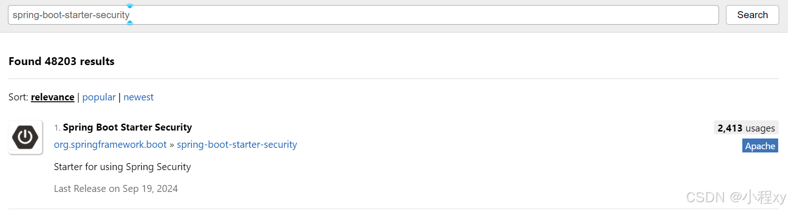

Spring Security 是一个强大且可扩展的框架，用于保护 Java 应用程序，尤其是基于 Spring 的应用。它提供了身份验证（验证用户身份）、授权（管理用户权限）和防护机制（如 CSRF 保护和防止会话劫持）等功能。

Spring Security 允许开发者通过灵活的配置实现安全控制，确保应用程序的数据和资源安全。通过与其他 Spring 生态系统的无缝集成，Spring Security 成为构建安全应用的理想选择。

**核心概念**

- **身份验证 (Authentication)**: 验证用户的身份（例如，用户名/密码）。
- **授权 (Authorization)**: 确定用户是否有权限访问特定资源。
- **安全上下文 (Security Context)**: 存储已认证用户的详细信息，应用程序中可以访问。


## 一、Security相关准备工作

### 1. 引入依赖

当我们引入 `security` 依赖后，访问需要授权的 url 时，会重定向到 `login` 页面（security 自己创建的），`login` 页面需要账号密码，账号默认是 `user`, 密码是随机的字符串，在spring项目的输出信息中

- spring-boot-starter-security 
	


### 2. 基于数据库的用户认证

继承 `UserDetailsService` 接口并重写 `loadUserByUsername` 方法即可

```java
@Service
public class UserDetailsServiceImpl implements UserDetailsService {

    @Autowired
    UserMapper userMapper;

    @Override
    public UserDetails loadUserByUsername(String username) throws UsernameNotFoundException {
        QueryWrapper<User> queryWrapper = new QueryWrapper<User>();
        queryWrapper.eq("username", username);	// 这里不止可以用username，你可以自定义，主要根据你自己写的查询逻辑
        User user = userMapper.selectOne(queryWrapper);
        if (user == null) {
            throw new UsernameNotFoundException(username);
        }
        return new UserDetailsImpl(user);	// UserDetailsImpl 是我们实现的类
    }
}
```

`UserDetailsImpl` 是实现了 `UserDetails` 接口的类。`UserDetails` 接口是 Spring Security 身份验证机制的基础，通过实现该接口，开发者可以定义自己的用户模型，并提供用户相关的信息，以便进行身份验证和权限检查。

```java
@Data
@AllArgsConstructor
@NoArgsConstructor	
public class UserDetailsImpl implements UserDetails {

    private User user;

    @Override
    public Collection<? extends GrantedAuthority> getAuthorities() {
        return List.of();
    }

    @Override
    public String getPassword() {
        return user.getPassword();
    }

    @Override
    public String getUsername() {
        return user.getUsername();
    }

    @Override
    public boolean isAccountNonExpired() {  // 检查账户是否 没过期。
        return true;
    }

    @Override
    public boolean isAccountNonLocked() {   // 检查账户是否 没有被锁定。
        return true;
    }

    @Override
    public boolean isCredentialsNonExpired() {  //检查凭据（密码）是否 没过期。
        return true;
    }

    @Override
    public boolean isEnabled() {    // 检查账户是否启用。
        return true;
    }
}
```


### 3. 常用配置

下面这个是我常用的配置，添加了加密密码的类和验证时用到的类，过滤器启用 jwt，
```java
@Configuration
@EnableWebSecurity
public class SecurityConfig {

    // 1. 要把这个加入到 Spring Security 的过滤链中
    @Autowired
    private JwtAuthenticationTokenFilter jwtAuthenticationTokenFilter;

    // 2. 编码器，对密码进行加密
    @Bean
    public PasswordEncoder passwordEncoder() {
        return new BCryptPasswordEncoder();
    }

    // 3. 下面用户登陆时用来验证账户密码是否在数据库中
    @Bean
    public AuthenticationManager authenticationManager(AuthenticationConfiguration authConfig) throws Exception {
        return authConfig.getAuthenticationManager();
    }

    @Bean
    public SecurityFilterChain filterChain(HttpSecurity http) throws Exception {
        // 4. 关闭 csrf，因为我们用的jwt来身份验证,不是基于session，而且如果开启csrf的话我们测试时post，put这种请求会403
        http.csrf(csrf -> csrf.disable());

        // 5. 关闭session，每次请求不保存session
        http.sessionManagement(session -> session.sessionCreationPolicy(SessionCreationPolicy.STATELESS));

        // 6. 打开访问权限保护
        http.authorizeHttpRequests((authz) -> authz
                        .requestMatchers("/login", "/register").permitAll()
                        .requestMatchers(HttpMethod.OPTIONS).permitAll()
                        .anyRequest().authenticated()
                )
                // 1. 把下面自定义的jwt过滤器添加到Spring Security 过滤链中
                .addFilterBefore(jwtAuthenticationTokenFilter, UsernamePasswordAuthenticationFilter.class);
		
        // 7. 添加未认证用户的请求处理
        http.exceptionHandling(exception -> {
            exception.authenticationEntryPoint(new MyAuthenticationEntryPoint());
        });

        return http.build();
    }
}
```

### 4. 验证密码

在用户登录时，可以使用 `matches` 方法验证输入的密码与存储的加密密码是否匹配：

```java
public boolean login(String username, String rawPassword) {
    // 从数据库中获取用户信息，包括加密后的密码
    String storedEncryptedPassword = // 从数据库获取;
    return passwordEncoder.matches(rawPassword, storedEncryptedPassword);
}
```


### 5. 用户认证流程

1. 用户登录

   - 前端：用户在登录界面输入用户名和密码。前端将这些凭证以 JSON 格式发送到后端的登录 API（例如 `POST /api/login`）。

   - 后端：Spring Security 接收请求，使用 `AuthenticationManager` 进行身份验证。如果认证成功，后端生成一个 JWT（JSON Web Token）或其他认证令牌，并将其返回给前端。

2. 使用 JWT 进行用户认证
   - 前端收到 JWT 后，可以将其存储在 `localStorage` 或 `sessionStorage` 中，以便后续请求使用。


3. 发送受保护请求
   - 在发送需要认证的请求时，前端将 JWT 添加到请求头中：

```java

fetch('/api/protected-endpoint', {
    method: 'GET',
    headers: {
        'Authorization': `Bearer ${token}`
    }
});
```

4. 后端解析 JWT
   - Spring Security 通过过滤器来解析和验证 JWT。可以自定义一个 `OncePerRequestFilter` 以拦截请求，提取 JWT，并验证其有效性。


## 二. JWT相关准备工作

### 1. 添加自定义过滤器的方法

- **作用**：`OncePerRequestFilter` 是 Spring Security 提供的一个抽象类，确保在每个请求中只执行一次特定的过滤逻辑。它是实现自定义过滤器的基础，通常用于对请求进行预处理或后处理。可以轻松实现自定义过滤器适合用于记录日志、身份验证、权限检查（实现 `JWT` 会用到这个接口）

- **实现**：继承 `OncePerRequestFilter` 类，并重写 `doFilterInternal` 方法。然后将重写的过滤链注册到 Spring Security 中即可
	
	```java
	public class CustomFilter extends OncePerRequestFilter {
	
	    @Override
	    protected void doFilterInternal(HttpServletRequest request, HttpServletResponse response, 
	                                    FilterChain filterChain) throws ServletException, IOException {
	        // 1. 自定义过滤逻辑，例如记录请求日志
	        
	        // 2. 继续执行过滤链
	        filterChain.doFilter(request, response);
	    }
	}
	```
	- 将重写的过滤链注册到 Spring Security 中
	```java
	@EnableWebSecurity
	public class SecurityConfig {
	
	    @Bean
	    public SecurityFilterChain securityFilterChain(HttpSecurity http) throws Exception {
	        // 1. 注册
	        http.addFilterBefore(new CustomFilter(), UsernamePasswordAuthenticationFilter.class);
	        return http.build();
	    }
	}
	```


### 2. JwtUtil


- jjwt-api
  
- jjwt-impl
  

- jjwt-jackson
  


基于我们上面引入的三个 `JWT` 相关的依赖，写`JwtUtil` 类

这个类主要提供了生成和解析JWT的方法

```java
@Component
public class JwtUtil {
    // JWT 的有效期（14天，单位：毫秒）
    public static final long JWT_TTL = 60 * 60 * 1000L * 24 * 14;
    // 用于签名的密钥字符串
    public static final String JWT_KEY = "SDFGjhdsfalshdfHFdsjkdsfds121232131afasdfac";

    public static String getUUID() {
        return UUID.randomUUID().toString().replaceAll("-", "");
    }

    // 创建 JWT
    public static String createJWT(String subject) {
        return getJwtBuilder(subject, null, getUUID()).compact();
    }

    // 解析 JWT
    public static Claims parseJWT(String jwt) throws Exception {
        SecretKey secretKey = generalKey();
        return Jwts.parser()
                .verifyWith(secretKey)
                .build()
                .parseSignedClaims(jwt)
                .getPayload();
    }

    private static JwtBuilder getJwtBuilder(String subject, Long ttlMillis, String uuid) {
        SecretKey secretKey = generalKey();
        long nowMillis = System.currentTimeMillis();
        Date now = new Date(nowMillis);
        if (ttlMillis == null) {
            ttlMillis = JWT_TTL;
        }
        long expMillis = nowMillis + ttlMillis;
        Date expDate = new Date(expMillis);

        return Jwts.builder()
                .id(uuid)
                .subject(subject)
                .issuer("sg")
                .issuedAt(now)
                .signWith(secretKey, Jwts.SIG.HS256) // 适配 jjwt 0.12.6
                .expiration(expDate);
    }

    // 生成 SecretKey
    public static SecretKey generalKey() {
        byte[] keyBytes = Decoders.BASE64.decode(JWT_KEY);
        return Keys.hmacShaKeyFor(keyBytes);
    }
}
```


### 3. 添加自定义过滤器

这里我们添加一个过滤器，用来对用户什么验证。

- JetBrains Java Annotations，下面会用到里面的@NotNull注解


这个 `JwtAuthenticationTokenFilter` 类是一个实现了 `OncePerRequestFilter` 接口自定义的 Spring Security 过滤器。它可以通过 JWT 对用户进行身份验证，确保请求中携带的 JWT 是有效的，并根据 JWT 提供的用户信息将认证后的用户添加到安全的上下文中。

```java
import com.security.learnsecurity.mapper.UserMapper;
import com.security.learnsecurity.pojo.User;
import jakarta.servlet.FilterChain;
import jakarta.servlet.ServletException;
import jakarta.servlet.http.HttpServletRequest;
import jakarta.servlet.http.HttpServletResponse;
import org.jetbrains.annotations.NotNull;
import org.springframework.beans.factory.annotation.Autowired;
import org.springframework.security.authentication.UsernamePasswordAuthenticationToken;
import org.springframework.security.core.context.SecurityContextHolder;
import org.springframework.security.web.AuthenticationEntryPoint;
import org.springframework.stereotype.Component;
import org.springframework.util.StringUtils;
import org.springframework.web.filter.OncePerRequestFilter;
import java.io.IOException;

@Component
public class JwtAuthenticationTokenFilter extends OncePerRequestFilter {

    @Autowired
    private UserMapper userMapper;

    @Autowired
    private AuthenticationEntryPoint authenticationEntryPoint; // 注入未认证处理器

    @Override
    protected void doFilterInternal(HttpServletRequest request, @NotNull HttpServletResponse response, @NotNull FilterChain filterChain) throws ServletException, IOException {
        String token = request.getHeader("Authorization");

        // 1. Token 为空或者格式错误，直接放行
        if (!StringUtils.hasText(token) || !token.startsWith("Bearer ")) {
            filterChain.doFilter(request, response);
            return;
        }

        token = token.substring(7); // 去掉 "Bearer "

        String userid;
        try {
            userid = JwtUtil.parseJWT(token).getSubject();
        } catch (Exception e) {
        // 2. Token 解析失败，非法的Token，调用 AuthenticationEntryPoint 处理 401
            authenticationEntryPoint.commence(request, response, null);
            return;
        }

        // 3. 检查用户是否合法
        User user = userMapper.selectById(Integer.parseInt(userid));
        if (user == null) {
            // 用户不存在，调用 AuthenticationEntryPoint 处理 401
            authenticationEntryPoint.commence(request, response, null);
            return;
        }

        // 4. 认证成功，存入 SecurityContext
        UserDetailsImpl loginUser = new UserDetailsImpl(user);
        UsernamePasswordAuthenticationToken authenticationToken = new UsernamePasswordAuthenticationToken(loginUser, null, loginUser.getAuthorities());
        SecurityContextHolder.getContext().setAuthentication(authenticationToken);

        // 5. 继续过滤链
        filterChain.doFilter(request, response);
    }
}

```

最后我们需要把这个自定义的过滤器添加到 Spring Security 中

```java
http.addFilterBefore(jwtAuthenticationTokenFilter, UsernamePasswordAuthenticationFilter.class);
```


### 4. 上面四个依赖

```java
<dependency>
    <groupId>io.jsonwebtoken</groupId>
    <artifactId>jjwt-api</artifactId>
    <version>0.12.6</version>
</dependency>

<dependency>
    <groupId>io.jsonwebtoken</groupId>
    <artifactId>jjwt-impl</artifactId>
    <version>0.12.6</version>
    <scope>runtime</scope>
</dependency>

<dependency>
    <groupId>io.jsonwebtoken</groupId>
    <artifactId>jjwt-jackson</artifactId>
    <version>0.12.6</version>
    <scope>runtime</scope>
</dependency>

<dependency>
    <groupId>org.jetbrains</groupId>
    <artifactId>annotations</artifactId>
    <version>24.0.1</version>
</dependency>
```


## 三、登陆和验证

### 1. 登陆时验证用户

```java
@RestController
public class LoginController {

    @Autowired
    UserMapper userMapper;
	
    // 1. 配置文件中注入的，用来验证用户是否存在于数据库
    @Autowired	
    private AuthenticationManager authenticationManager;


    @PostMapping(value = "/login")
    public ResponseEntity<String> test(
            @RequestParam("username") String username,
            @RequestParam("password") String password
    ) {
        String jwt = null;

        try {
            UsernamePasswordAuthenticationToken authenticationToken = new UsernamePasswordAuthenticationToken(username, password);
            // 2. 验证，不存在会抛出AuthenticationException的异常
            Authentication authenticate = authenticationManager.authenticate(authenticationToken);
            UserDetailsImpl userDetails = (UserDetailsImpl) authenticate.getPrincipal();
            User user = userDetails.getUser();
            jwt = JwtUtil.createJWT(user.getId().toString());
        } catch (AuthenticationException e) {
            return ResponseEntity.status(404).body("用户名或密码错误");
        }

        return ResponseEntity.status(200).body(jwt);
    }
}

```

### 2. 尝试获取认证信息

对于受保护的接口，一般通过获取用户的认证信息，如果认证信息不存在，则让用户去登陆

```java
// SecurityContextHolder 是一个存储安全上下文的工具类，提供了一个全局访问点，用于获取当前请求的安全上下文。
// SecurityContext 是当前线程的安全上下文，包含了当前用户的认证信息（即 Authentication 对象）。
SecurityContext context = SecurityContextHolder.getContext();
Authentication authentication = context.getAuthentication();
UserDetailsImpl userDetails = (UserDetailsImpl) authentication.getPrincipal();
User user = userDetails.getUser();
```


## 四、授权

Spring Security 的授权机制用于控制用户对应用程序资源的访问权限。授权通常是基于用户角色或权限的，以下是对 Spring Security 授权的详细讲解。

### 1. 授权方式

Spring Security 支持多种授权方式，主要包括：

1. 基于角色的授权

基于用户的权限认证，security会通过我们上面实现的 `UserDetailsImpl` 的 `getAuthorities` get方法来获取用户的权限列表，其中用户的权限字符串上面都会加上 `ROLE_`，也就是说会检查权限列表中是否有 `ROLE_ADMIN`，如果有的话就代表用户有权限


```java
@Bean
public SecurityFilterChain filterChain(HttpSecurity http) throws Exception {

    // 打开访问权限保护
    http.authorizeHttpRequests((authz) -> authz
                    .requestMatchers("/login", "/register", "/add").permitAll()
                    .requestMatchers(HttpMethod.OPTIONS).permitAll()
                     // 有 ROLE_admin 角色权限的才可以访问
                    .requestMatchers("/test").hasAnyRole("admin")
                    .anyRequest().authenticated()
            );

    return http.build();
}
```

2. 基于权限的授权

直接基于权限的认证方式，security会直接对比权限列表和 `EDIT_PRIVILEGE` ，如果权限列表中有EDIT_PRIVILEGE，用户就有权限访问


```java
@Bean
public SecurityFilterChain filterChain(HttpSecurity http) throws Exception {

    // 打开访问权限保护
    http.authorizeHttpRequests((authz) -> authz
                    .requestMatchers("/login", "/register", "/add").permitAll()
                    .requestMatchers(HttpMethod.OPTIONS).permitAll()
                     // 有 TEST 权限的才可以访问
                    .requestMatchers("/test").hasAnyAuthority("TEST")
                    .anyRequest().authenticated()
            );

    return http.build();
}
```

3. 基于权限和角色的授权

同时基于权限和用户来进行授权

```java
@Bean
public SecurityFilterChain filterChain(HttpSecurity http) throws Exception {

    // 打开访问权限保护
    http.authorizeHttpRequests((authz) -> authz
                    .requestMatchers("/login", "/register").permitAll()
                    .requestMatchers(HttpMethod.OPTIONS).permitAll()
                    // 同时满足 test权限和 ROLE_admin角色的才可以访问
                    .requestMatchers("/test").access(AuthorizationManagers.allOf(
                            AuthorityAuthorizationManager.hasAnyAuthority("test"),
                            AuthorityAuthorizationManager.hasRole("admin"))
                    )
                    .anyRequest().authenticated()
            );

    return http.build();
}
```

4. 权限和角色的授权之一

只需要满足拥有其中之一即可

```java
@Bean
public SecurityFilterChain filterChain(HttpSecurity http) throws Exception {

    // 打开访问权限保护
    http.authorizeHttpRequests((authz) -> authz
                    .requestMatchers("/login", "/register").permitAll()
                    .requestMatchers(HttpMethod.OPTIONS).permitAll()
                    // 同时满足 test权限和 ROLE_admin角色的才可以访问
                    .requestMatchers("/test").access(AuthorizationManagers.anyOf(
                            AuthorityAuthorizationManager.hasAnyAuthority("test"),
                            AuthorityAuthorizationManager.hasRole("admin"))
                    )
                    .anyRequest().authenticated()
            );

    return http.build();
}
```


### 2. 添加权限

roles 和 permissions 一般在 `loadUserByUsername` 中从数据库中查找并初始化

```java
@Data
@AllArgsConstructor
@NoArgsConstructor
public class UserDetailsImpl implements UserDetails {

    private User user;
    private List<String> roles;
    private List<String> permissions;

    @Override
    public Collection<? extends GrantedAuthority> getAuthorities() {
        // 1. 创建一个 HashSet 用于存储合并后的权限
        Set<GrantedAuthority> authorities = new HashSet<>();

        // 2. 处理角色，添加 ROLE_ 前缀并添加到 Set 中（前面讲到security默认用的角色权限比较时会加上 ROLE_ 前缀）
        authorities.addAll(roles.stream()
                .map(role -> new SimpleGrantedAuthority("ROLE_" + role))
                .collect(Collectors.toSet()));

        // 3. 处理权限并添加到 Set 中
        authorities.addAll(permissions.stream()
                .map(SimpleGrantedAuthority::new)
                .collect(Collectors.toSet()));

        return authorities;
    }

    @Override
    public String getPassword() {
        return user.getPassword();
    }

    @Override
    public String getUsername() {
        return user.getUsername();
    }

    @Override
    public boolean isAccountNonExpired() {  // 检查账户是否 没过期。
        return true;
    }

    @Override
    public boolean isAccountNonLocked() {   // 检查账户是否 没有被锁定。
        return true;
    }

    @Override
    public boolean isCredentialsNonExpired() {  //检查凭据（密码）是否 没过期。
        return true;
    }

    @Override
    public boolean isEnabled() {    // 检查账户是否启用。
        return true;
    }
}
```

```java
@Service
public class UserDetailsServiceImpl implements UserDetailsService {

    @Autowired
    UserMapper userMapper;

    @Override
    public UserDetails loadUserByUsername(String username) throws UsernameNotFoundException {
        QueryWrapper<User> queryWrapper = new QueryWrapper<User>();
        queryWrapper.eq("username", username);
        User user = userMapper.selectOne(queryWrapper);
        // ... 从数据库获取用户角色或权限列表，然后传入下面参数中
        if (user == null) {
            throw new UsernameNotFoundException(username);
        }
        return new UserDetailsImpl(user, roles, permissions);
    }
}
```


## 五、其他自定义行为

以下接口和类用于处理不同的安全事件，提供了自定义处理的能力：


### 1. AuthenticationEntryPoint

- **作用**：用于处理未认证用户访问受保护资源时的逻辑。
- **功能**：可以自定义**未认证用户**的响应，比如返回 401 状态码、重定向到登录页面等。
- **实现**：实现 `AuthenticationEntryPoint` 接口，并重写 `commence` 方法。


```java
@Component
public class MyAuthenticationEntryPoint implements AuthenticationEntryPoint {
    @Override
    public void commence(
            HttpServletRequest request,
            HttpServletResponse response,
            AuthenticationException authException
    ) throws IOException {
        Map<String, Object> mp = new HashMap<String, Object>();
        mp.put("message", "请先登录");
        String res = JSON.toJSONString(mp);

        response.setContentType("application/json;charset=UTF-8");
        response.setStatus(401);
        response.getWriter().write(res);
    }
}

// 让我们重写的类生效
http.exceptionHandling(exception -> {
    exception.authenticationEntryPoint(new MyAuthenticationEntryPoint());
});
```


### 2. AccessDeniedHandler

- **作用**：用于处理用户访问被拒绝的情况。当用户尝试访问没有权限的资源时，Spring Security 会调用实现了 `AccessDeniedHandler` 接口的处理器。

- **功能**：可以自定义拒绝访问后的响应行为，比如重定向到特定的错误页面、返回错误信息或 JSON 响应。

- **实现**：实现 `AccessDeniedHandler` 接口，并重写 `handle` 方法。

```java
// 重写 AccessDeniedHandler 接口
public class MyAccessDeniedHandler implements AccessDeniedHandler {
    @Override
    public void handle(HttpServletRequest request, HttpServletResponse response, AccessDeniedException accessDeniedException) throws IOException, ServletException {
        Map<String, Object> mp = new HashMap<String, Object>();
        mp.put("message", "没有权限");
        String res = JSON.toJSONString(mp);

        response.setContentType("application/json;charset=UTF-8");
        response.setStatus(404);
        response.getWriter().write(res);
    }
}

// 在安全配置中注册自定义的 AccessDeniedHandler
http.exceptionHandling(exception -> {
            exception.accessDeniedHandler(new MyAccessDeniedHandler());
        });
});
```


### 3. AuthenticationSuccessHandler

- **作用**：用于处理用户成功认证后的逻辑。
- **功能**：可以自定义成功登录后的跳转行为，比如重定向到特定页面、返回 JSON 响应等。
- **实现**：实现 `AuthenticationSuccessHandler` 接口，并重写 `onAuthenticationSuccess` 方法。

```java
public class MyAuthenticationSuccessHandle implements AuthenticationSuccessHandler {
    @Override
    public void onAuthenticationSuccess(HttpServletRequest request, HttpServletResponse response, Authentication authentication) throws IOException, ServletException {
        Map<String, Object> mp = new HashMap<String, Object>();
        mp.put("status", "success");
        mp.put("message", "Login successful");

        UserDetailsImpl userDetails = (UserDetailsImpl) authentication.getPrincipal();
        User user = userDetails.getUser();
        String jwt = JwtUtil.createJWT(String.valueOf(user.getId()));
        System.out.println(jwt);

        String res = JSON.toJSONString(mp);
        response.setContentType("application/json;charset=UTF-8");
        response.getWriter().write(res);
    }
}

// 让我们实现的类生效
http.formLogin(form ->
                form.successHandler(new MyAuthenticationSuccessHandler()));
```


### 4. AuthenticationFailureHandler

- **作用**：用于处理用户认证失败的逻辑。
- **功能**：可以自定义失败登录后的行为，比如返回错误信息、重定向到登录页面并显示错误提示等。
- **实现**：实现 `AuthenticationFailureHandler` 接口，并重写 `onAuthenticationFailure` 方法。

```java
@Component
public class MyAuthenticationFailureHandler implements AuthenticationFailureHandler {

    @Override
    public void onAuthenticationFailure(
            HttpServletRequest request,
            HttpServletResponse response,
            AuthenticationException exception
    ) throws IOException, ServletException {
        Map<String, Object> mp = new HashMap<String, Object>();
        mp.put("status", "error");
        mp.put("message", "身份验证失败");

        String res = JSON.toJSONString(mp);
        response.setContentType("application/json;charset=UTF-8");
        response.getWriter().write(res);
    }
}

// 让我们实现的类生效
http.formLogin(form ->
        form.failureHandler(new MyAuthenticationFailureHandler()));
```


### 5. LogoutSuccessHandler

- **作用**：用于处理用户成功登出的逻辑。
- **功能**：可以自定义注销成功后的行为，比如重定向到登录页面、显示注销成功的消息等。
- **实现**：实现 `LogoutSuccessHandler` 接口，并重写 `onLogoutSuccess` 方法。

```java
public class MyLogoutSuccessHandler implements LogoutSuccessHandler {
    @Override
    public void onLogoutSuccess(HttpServletRequest request, HttpServletResponse response, Authentication authentication) throws IOException, ServletException {
    }
}

// 让我们实现的类生效
http.logout(logout -> {
               logout.logoutSuccessHandler(new MyLogoutSuccessHandler());
           });
```


### 6. SessionInformationExpiredStrategy

- **作用**：用于处理用户会话过期的逻辑。
- **功能**：可以自定义会话超时后的响应，比如重定向到登录页面或返回 JSON 响应等。
- **实现**：实现 `SessionInformationExpiredStrategy` 接口，并重写 `onExpiredSession` 方法。

```java
// 重写 SessionInformationExpiredStrategy 接口
public class MySessionInformationExpiredStrategy implements SessionInformationExpiredStrategy {

    @Override
    public void onExpiredSessionDetected(SessionInformationExpiredEvent event) throws IOException, ServletException {
    }
}

// 让我们重写的类生效
http.sessionManagement(session -> {
    session.maximumSessions(1).expiredSessionStrategy(new MySessionInformationExpiredStrategy());
});
```


## 六、OAuth2.0

OAuth2.0 是一种开放的授权协议，它允许资源所有者（通常为用户）授权第三方应用访问存储在资源服务器上的受保护资源，而无需直接向第三方应用提供用户名和密码。

### 1. 角色

**资源所有者（Resource Owner）**：通常指用户，拥有受保护的资源（如个人资料、照片、联系人等）。

**客户端（Client）**：第三方应用程序，需要在**用户授权后**访问资源服务器上的资源。客户端可以是 Web 应用、移动应用、桌面应用

**授权服务器（Authorization Server）**：负责对资源所有者进行身份验证并颁发访问令牌（access token）。

**资源服务器（Resource Server）**：存储受保护资源，并在接收到合法的访问令牌后提供相应的资源。


### 2. 授权流程

1. **获取授权（Authorization）**
    客户端通过重定向用户到授权服务器，由用户决定是否授权给客户端访问其受保护资源。用户同意后，授权服务器将返回一个授权凭证（通常是授权码）。
2. **获取令牌（Token Exchange）**
    客户端使用前一阶段获得的凭证（例如授权码）向授权服务器请求访问令牌。授权服务器验证后，返回客户端访问令牌，客户端随后可以使用该令牌访问资源服务器。一般情况下，访问令牌的有限期很短，除了访问令牌外还有一个时效比较长的刷新令牌，客户端可以在访问令牌快过期时，用刷新令牌再次获取一个新的访问令牌。


### 3. OAuth2.0 授权模式

根据具体的使用场景和安全需求，OAuth2.0 定义了几种不同的授权模式：

#### 1. 授权码模式（Authorization Code Grant）

- **流程**
  1. 客户端将用户重定向到授权服务器的授权端点，传递必要参数（如 client_id、redirect_uri、response_type=code、scope、state 等）。
  2. 用户登录并同意授权后，授权服务器重定向回客户端指定的 redirect_uri，并附上授权码（code）。
  3. 客户端使用该授权码、自己的 client_id 和 client_secret 向授权服务器的令牌端点请求访问令牌。
  4. 授权服务器验证无误后，返回访问令牌（access token）及（可选的）刷新令牌。
- **特点**
  - 安全性较高，因为令牌请求在服务器端进行，client_secret 不会暴露给用户代理。
  - 适用于传统 Web 应用或任何能够安全存储机密信息的应用。

示例请求（步骤 1）：

```
http复制编辑GET /authorize?response_type=code&client_id=CLIENT_ID
    &redirect_uri=https%3A%2F%2Fclient.example.com%2Fcallback
    &scope=read_profile&state=xyz HTTP/1.1
Host: authorization.server.com
```

示例令牌请求（步骤 3）：

```
http复制编辑POST /token HTTP/1.1
Host: authorization.server.com
Content-Type: application/x-www-form-urlencoded

grant_type=authorization_code&code=AUTH_CODE
&redirect_uri=https%3A%2F%2Fclient.example.com%2Fcallback
&client_id=CLIENT_ID&client_secret=CLIENT_SECRET
```


#### 2. 隐式授权模式（Implicit Grant）

- **流程**
  - 客户端直接通过浏览器从授权服务器获得访问令牌，而不经过授权码交换的过程。
  - 授权服务器将访问令牌作为 URL 的片段（fragment）返回给客户端。
- **特点**
  - 不需要客户端密钥，适用于无法安全存储机密（如纯前端的 JavaScript 应用）。
  - 安全性相对较低，因为令牌直接暴露给用户代理，且令牌通常有效期较短。

示例请求：

```
http复制编辑GET /authorize?response_type=token&client_id=CLIENT_ID
    &redirect_uri=https%3A%2F%2Fclient.example.com%2Fcallback
    &scope=read_profile&state=xyz HTTP/1.1
Host: authorization.server.com
```


#### 3. 资源所有者密码凭据模式（Resource Owner Password Credentials Grant）

- **流程**
  - 用户直接将用户名和密码提供给客户端，客户端使用这些凭据向授权服务器请求访问令牌。
- **特点**
  - 适用于用户与客户端高度信任的情况（例如，同一公司内部应用）。
  - 安全性较低，因为用户凭据直接暴露给客户端，不推荐在公开环境中使用。

示例请求：

```
http复制编辑POST /token HTTP/1.1
Host: authorization.server.com
Content-Type: application/x-www-form-urlencoded

grant_type=password&username=USER&password=PASS
&client_id=CLIENT_ID&client_secret=CLIENT_SECRET
```

#### 4. 客户端凭据模式（Client Credentials Grant）

- **流程**
  - 客户端直接使用自己的凭据（client_id 和 client_secret）向授权服务器请求访问令牌，不涉及用户参与。
- **特点**
  - 适用于应用自身需要访问资源（例如，后台服务间通信）。
  - 不涉及用户，因此没有用户授权这一环节。

示例请求：

```
http复制编辑POST /token HTTP/1.1
Host: authorization.server.com
Content-Type: application/x-www-form-urlencoded

grant_type=client_credentials&client_id=CLIENT_ID
&client_secret=CLIENT_SECRET&scope=read_resource
```


