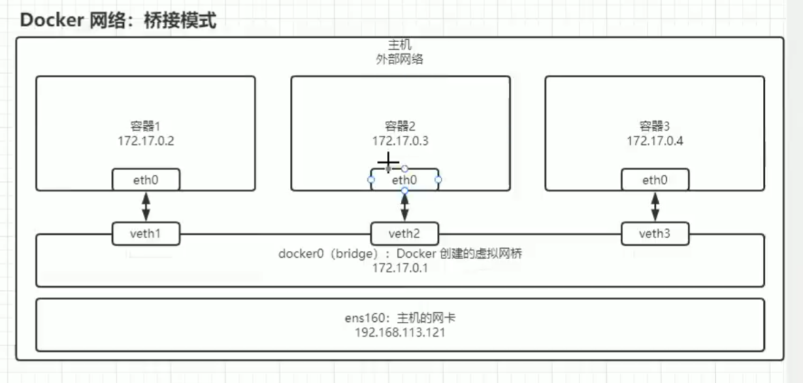
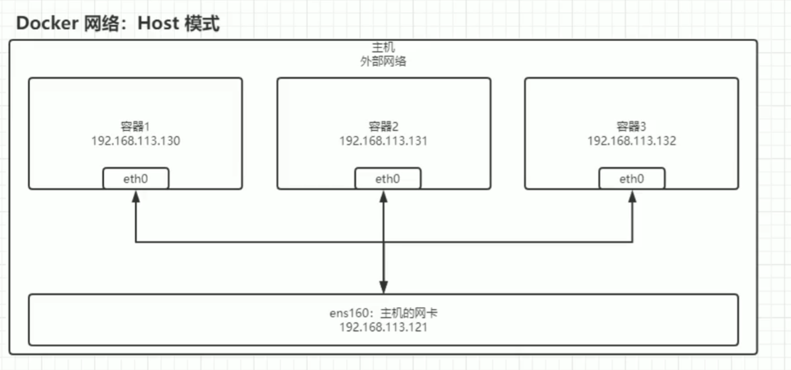
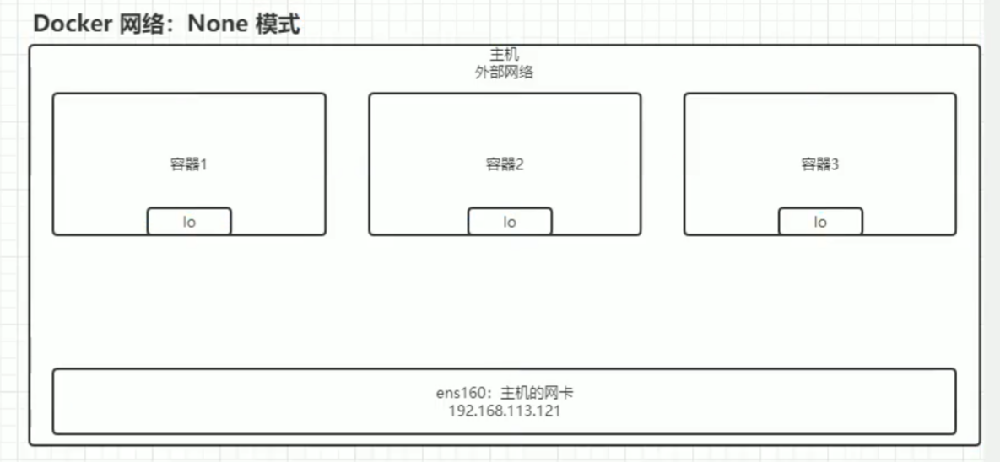
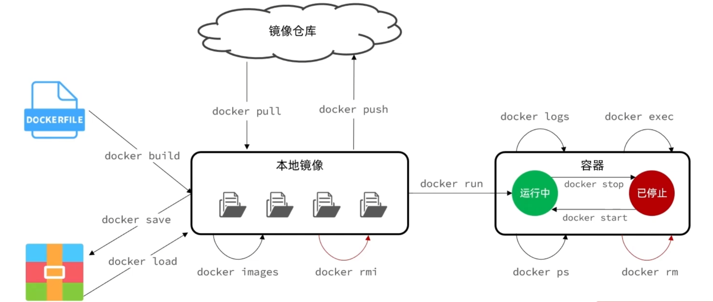

## 一、基本概念

Docker 是一个开源的容器化平台，用于开发、部署和运行应用程序。它通过容器技术将应用程序及其依赖（如库、配置文件等）打包在一起，确保应用在不同环境（如开发、测试、生产）中的一致性。

**容器 vs 虚拟机**：

- 与传统虚拟机（VM）相比，容器更轻量。虚拟机需要运行一个**完整的操作系统**，而容器**共享宿主操作系统的内核**，只打包应用和其运行时依赖，因此启动更快、资源占用更少。

**核心理念：**

- “Build, Ship, Run Anywhere” —— 一次构建，到处运行。Docker 通过标准化容器格式，解决了“在我机器上能跑，到你那就不行”的问题。


## 二、Docker 的架构

Docker 采用客户端-服务器架构，主要由以下组件组成：


### 1. Docker Client（客户端）

Docker Client 是用户与 Docker 系统交互的主要入口。它是一个命令行工具（CLI），通过输入命令（如 docker run、docker ps）向 Docker Daemon 发送请求。

工作原理

- **命令输入**：用户通过终端输入 Docker 命令，例如 docker run -it ubuntu bash。
- **通信方式**：客户端将命令转化为 API 请求，通过 RESTful API（通常基于 HTTP/Unix Socket）发送给 Docker Daemon。
- **灵活性**：Docker Client 可以与本地的 Daemon 通信，也可以远程连接到其他主机上的 Daemon（通过配置 TCP 端口或 TLS 认证）。


### 2. Docker Daemon（守护进程）

Docker Daemon 是 Docker 的核心服务，运行在宿主机上，负责接收客户端请求并管理所有 Docker 对象（如镜像、容器、网络、卷等）。它相当于 Docker 的“大脑”。

工作原理

- **监听请求**：Daemon 持续监听来自客户端的 API 请求（通过 Unix Socket 或 TCP）。
- **对象管理**：
  - 镜像管理：从 Registry 拉取镜像，或构建新镜像。
  - 容器管理：创建、启动、停止、删除容器。
  - 网络管理：配置容器间的网络连接。
  - 存储管理：处理数据卷和存储驱动。
- **系统交互**：Daemon 调用底层操作系统功能（如 Linux 的 Namespaces、Cgroups）来实现容器隔离和资源分配。


### 3. Docker Registry

Docker Registry 是一个镜像存储和分发的仓库，用于保存 Docker 镜像。默认的公共 Registry 是 Docker Hub，但用户也可以部署私有 Registry。

工作原理

- **镜像存储**：Registry 存储镜像的层（Layer）和元数据（Manifest）。
- **拉取与推送**：
  - docker pull：从 Registry 下载镜像到本地。
  - docker push：将本地镜像上传到 Registry。
- 版本管理：支持镜像标签（Tag），如 nginx:latest 或 nginx:1.19。


### 4. Docker Objects（核心对象）

#### 4.1 镜像

镜像是一个只读模板，包含应用程序及其运行所需的所有依赖（如操作系统文件、库、配置文件）。同一个镜像可在多个容器中使用。


#### 4.2 容器

容器是基于 **镜像（Image）** 运行的应用进程，它与宿主机共享同一个操作系统内核，但彼此相互隔离。容器可以随时启动、停止或销毁，而不会影响宿主机和其他容器。

可写层（Container Layer）：容器启动时，Docker 在镜像顶层添加一个读写层，用于保存运行时的修改。

- 比如你在容器里创建了一个文件，这个文件只存在于可写层，不会影响原始镜像。
- 如果删除了镜像中的文件，可写层会记录“删除标记”，但底层文件实际上还在。


#### 4.3 卷

卷是 Docker 中用于持久化数据的机制。容器是临时的，前面说过容器会用读层来保存运行时的修改，停止或删除后，其内部数据会丢失，而卷提供了一种独立于容器生命周期的存储方式。

我们可以把容器中的某些文件夹挂载到宿主机的文件夹下面。


#### 4.4 网络

Docker 的网络主要用于 **管理和控制 Docker 容器之间及其与外部世界的通信**。它解决了容器之间的互联、容器与宿主机的交互，以及跨多个主机的容器通信问题。其中有5中网络模式：


1. Bridge（默认桥接网络）

- 容器通过 Docker 自带的 **虚拟网桥（docker0）** 进行通信。

- 宿主机上的 `docker0` 设备充当交换机，所有容器连接到这个交换机上。

- 容器会获得 `172.17.0.x` 这样的 IP 地址（默认）。

- 需要通过 **端口映射** 才能从外部访问容器。



2. Host（宿主机网络）

- 容器直接使用宿主机的 IP 和端口，没有独立的网络命名空间。

- 容器中的服务端口 **与宿主机一致**，不需要端口映射。

- 容器对外暴露的端口等于宿主机的端口。



3. None（无网络）

- 容器不分配 IP 地址，也无法与其他容器或外部通信。

- 仅有 localhost 回环接口。



4. Overlay（跨主机网络）

- 用于 **多个 Docker 主机间的容器通信**。
- 依赖 Docker Swarm 或 Kubernetes 进行管理。
- 使用 VXLAN 技术 **在不同主机上创建一个虚拟的二层网络**。


5. Macvlan（物理网络）

- 每个容器被分配一个 **独立的 MAC 地址**，并且在物理网络中被识别为独立设备。
- 容器 **直接连接到宿主机的物理网络**，和普通的物理机一样。


在这5中网络模式中，Host和None是不能自定义网络的，其他三个都可以**自定义创建网络**。


## 三、镜像

1. **搜索**官方仓库中的镜像

```bash
docker search <镜像名>
```

2. **下载**镜像

```bash
// 下载最新版本的，也可以指定版本，不指定的话，默认是latest
docker pull ubuntu:latest
```

3. **查看**本地下载的镜像

```bash
docker images
```

4. **删除**镜像

```bash
docker rmi <镜像ID或名称>

// 如果镜像正在被某个容器使用，普通删除会失败，可以使用 -f 强制删除：
docker rmi -f ubuntu
```





## 四、容器

### 1. 基本命令

1. **创建并运行**容器（如果镜像不存在，会自动下载最新版本的镜像）

```bash
docker run -d --name <容器名> 
-p port:dockerPort 
--restart <always 或者 on-failure:3>
-m 512m
-e key=value
<镜像ID或名称> 

// 1. -d 后台运行
// 2. --name 指定容器名
// 3. -p 指定端口映射，将容器中的端口映射到主机端口上
// 4. --restart 指定非手动停止容器时的策略
// 		always: 一直尝试重启容器
// 		on-failure:3: 尝试重启3词
// 5. -m 限定这个容器最多使用内存512m
// 6. -e 为容器设置环境变量
```

2. **查看**容器

```bash
// 1. 查看正在运行的容器
docker ps

// 2. 查看所有容器
docker ps -a

// 3. 查看容器配置信息
docker inspect <容器ID或名称>

// 4. 查看容器的日志
docker logs <容器ID或名称>

// 5. 查看容器状态
docker stats <容器ID或名称>
```

3. **启动停止**

```bash
// 1. 启动
docker start <容器ID或名称>

// 2. 重启
docker restart <容器ID或名称>

// 3. 停止
docker stop <容器ID或名称>
```

4. 往容器中**运行命令**

```bash
docker exec -it <容器ID或名称> <Linux指令>

// 打开容器的终端
docker exec -it <容器ID或名称> /bin/bash
```


### 2. volum命令

1. **查看卷**

```bash
// 1. 查看所有卷
docker volume ls

// 2. 查看卷的详细信息
docker volume inspect <卷名>
```

2. **创建**volum

```bash
docker volume create myvolume

docker run -v myvolume:/data <镜像名>
// 1. -v 指定挂载的卷轴位置, 如果不存在会自动创建
// 将宿主机文件路径 /var/lib/docker/volumes/myvolume/_date 映射到容器中

docker run -v /myvolume:/data <镜像名>
// 2. 将宿主机的文件路径 /myvolume 映射到容器中
```

3. **删除**

```bash
// 1. 删除悬空卷
docker volume prune

// 2. 删除指定卷
docker volume rm <卷名>
```


```sql
CREATE DATABASE IF NOT EXISTS test CHARACTER SET utf8mb4 COLLATE utf8mb4_unicode_ci;
-- 创建一个名为 mydb 的数据库，如果不存在则创建，设置字符集和排序规则

USE test;
-- 选择 mydb 数据库作为后续操作的目标

CREATE TABLE users (
    id INT AUTO_INCREMENT PRIMARY KEY,     # 创建一个自增主键列
    username VARCHAR(50) NOT NULL,         # 用户名字段，非空
    email VARCHAR(100) NOT NULL,           # 邮箱字段，非空
    created_at TIMESTAMP DEFAULT CURRENT_TIMESTAMP  # 创建时间，默认当前时间戳
);
-- 创建 users 表，定义表结构

INSERT INTO users (username, email) VALUES
('admin', 'admin@example.com'),
('test', 'test@example.com');
-- 向 users 表插入两条初始数据
```


### 3. 网络命令

1. 创建自定义网络

```bash
docker network create [选项] 网络名称
```

**默认情况下**，如果不指定 `-d`（driver驱动），Docker 会创建 **bridge** 网络。

**指定 `-d overlay`**，表示创建一个 **跨主机的 overlay 网络**。

**指定 `-d macvlan`**，表示创建一个 **Macvlan 网络**，让容器像一台独立的设备。

2. 指定不同的网络模式

```bash
docker run -d --network=host nginx

docker run -d --network=none nginx

// 可以自定义创建网络，也可以直接指定，docker有默认的bridge网络（docker0）
docker run -d --network=bridge nginx

// 需要先创建网络
docker run -d --network=myOverlay nginx

// 需要先创建网络
docker run -d --network=myMacvlan nginx
```

3. 查看所有网络

```bash
docker network ls
```

4. 删除网路

```java
docker network rm
docker networkK prune
```

5. 连接或断开连接

```java
docker run --network my_network --name container2 iamge
docker network connect my_network my_container
docker network disconnect my_network my_container
```


## 五、常见容器的部署

### 1. Mysql

注意，初始化文件要在创建创建启动文件前弄好，它只会在第一次运行时运行，重启容器不会运行。

```bash
docker run -d --name mysql \
  -p 3306:3306 \
  --network loop_net \
  -e MYSQL_ROOT_PASSWORD=di135790 \
  -e MYSQL_DATABASE=mydb \
  -e MYSQL_USER=mysqlUser \
  -e MYSQL_PASSWORD=di135790 \
  -v ~/docker/volume/mysql/conf:/etc/mysql/conf.d \
  -v ~/docker/volume/mysql/data:/var/lib/mysql \
  -v ~/docker/volume/mysql/init:/docker-entrypoint-initdb.d \
  mysql
```

mysql会加载所有`~/docker/volume/mysql/conf` 中的 `.cnf` 文件

```sql
[mysqld]
character-set-server=utf8mb4         # 设置服务器默认字符集为 utf8mb4
collation-server=utf8mb4_unicode_ci  # 设置默认排序规则
max_connections=200                  # 最大连接数
innodb_buffer_pool_size=128M         # InnoDB 缓冲池大小，影响性能

[mysql]
default-character-set=utf8mb4        # MySQL 客户端默认字符集

[client]
default-character-set=utf8mb4        # 连接客户端默认字符集
```

mysql会在第一次创建启动时执行所有`~/docker/volume/mysql/init` 中的 `.sql` 文件

```sql
-- 创建数据库（可选，因为环境变量已指定 mydb）
CREATE DATABASE IF NOT EXISTS looppan CHARACTER SET utf8mb4 COLLATE utf8mb4_unicode_ci;

-- 使用 looppan 数据库
USE looppan;

CREATE TABLE `file_info` (
  
) ENGINE=InnoDB DEFAULT CHARSET=utf8mb3;
```


### 2. Redis

```bash
docker run -d \
--name redis \
-p 6379:6379 \
--network loop_net \
redis redis-server --requirepass "di135790"
```


### 3. Java

```bash
docker run -d \
	--name looppan \
	-p 7090:7090 \
	--network loop_net \
	-e TZ=Asia/Shanghai \
	looppan:latest
```

```dockerfile
# 1. 选择 JDK 17 作为基础镜像
FROM eclipse-temurin:17-jdk

RUN rm -rf /home/ld

# 创建容器中的文件夹，以及ffmpeg依赖
RUN mkdir -p /home/ld/loop/backend
RUN mkdir -p /home/ld/loop/data/resource/avatar135790 && mkdir -p /home/ld/loop/data/recycle
RUN apt update && apt install ffmpeg -y

# 2. 设置工作目录
WORKDIR /home/ld/loop/backend

# 3. 将需要的文件，添加到容器中
# 复制到工作目录
COPY looppan.jar .
COPY avatar.jpg /home/ld/loop/data/resource/avatar135790/

# 4. 运行 Java 应用
CMD ["java", "-jar", "looppan.jar"]
```


### 4. Nginx

```bash
docker run -d \
  -v ~/docker/volume/nginx/fontend/html:/usr/share/nginx/html \
  -v ~/docker/volume/nginx/conf/nginx.conf:/etc/nginx/nginx.conf \
  -p 80:80 \
  --network loop_net \
  --name nginx \
  nginx
```

```nginx
user  nginx;
worker_processes  auto;

error_log  /var/log/nginx/error.log warn;
pid        /var/run/nginx.pid;

events {
    worker_connections  1024;
}

http {
    include       /etc/nginx/mime.types;
    default_type  application/octet-stream;

    log_format  main  '$remote_addr - $remote_user [$time_local] "$request" '
                      '$status $body_bytes_sent "$http_referer" '
                      '"$http_user_agent" "$http_x_forwarded_for"';

    access_log  /var/log/nginx/access.log  main;

    sendfile        on;
    keepalive_timeout  65;

    server {
        listen       80;
        server_name  localhost;

        # 1. 容器中静态文件目录
        root   /usr/share/nginx/html;
        index  index.html;

        # 2. 处理静态文件请求
        location / {
            try_files $uri $uri/ /index.html; # 支持单页应用
        }

        # 3. 代理到后端服务
        location /api/ {
            proxy_pass http://looppan:7090; # 4. 使用容器名称 looppan 和端口 7090
            proxy_set_header Host $host;
            proxy_set_header X-Real-IP $remote_addr;
            proxy_set_header X-Forwarded-For $proxy_add_x_forwarded_for;
            proxy_set_header X-Forwarded-Proto $scheme;
        }

        # 处理 404 错误
        error_page  404  /index.html;
    }
}
```


## 六、Dockerfile

Dockerfile 是用于**定义 Docker 容器镜像**的文本文件，它包含了一系列指令，告诉 Docker **如何构建**这个镜像。通过 `docker build` 命令，Docker 读取 Dockerfile 并按照指令逐步构建镜像。


### 1. Dockerfile 关键指令

`Dockerfile` 由多条指令组成，每条指令完成特定任务。以下是 Dockerfile 中常用的指令：

#### 1.1 FROM（指定基础镜像）

每个 Dockerfile 必须以 `FROM` 指令开头，它用于指定当前镜像基于哪个基础镜像构建。

```dockerfile
FROM ubuntu:20.04
```

- `ubuntu:20.04` 表示使用 Ubuntu 20.04 作为基础镜像。

#### 1.2 LABEL（添加元数据）

`LABEL` 用于给镜像添加元数据，如作者、版本等。

```dockerfile
LABEL maintainer="your_name <your_email@example.com>"
LABEL version="1.0"
```

#### 1.3 RUN（执行命令）

`RUN` 指令用于在镜像构建过程中执行命令，如安装软件、修改配置等。

```dockerfile
RUN apt-get update && apt-get install -y nginx
```

- `apt-get update`：更新包管理器索引。
- `apt-get install -y nginx`：安装 Nginx。

#### 1.4 COPY（复制文件到镜像）

`COPY` 指令用于将本地文件复制到镜像中。

```dockerfile
COPY index.html /usr/share/nginx/html/index.html

# 将index.html复制到工作目录（下面会讲）
COPY index.html . 
```

- `index.html` 是本地文件，复制到 `/usr/share/nginx/html/` 目录下。

#### 1.5 ADD（增强版 COPY）

`ADD` 和 `COPY` 类似，但它支持自动解压 `.tar.gz` 文件和从远程 URL 下载文件。

```dockerfile
ADD myapp.tar.gz /opt/
ADD https://example.com/myfile /tmp/
```

- `myapp.tar.gz` 会自动解压到 `/opt/` 目录。
- `https://example.com/myfile` 会被下载到 `/tmp/` 目录。

**注意**：如果不需要 `ADD` 的特性，推荐使用 `COPY`，因为 `COPY` 语义更明确。

#### 1.6 ENV（设置环境变量）

`ENV` 用于定义环境变量，供容器内应用程序使用。

```dockerfile
ENV APP_ENV=production
ENV PATH="/app/bin:$PATH"
```

- `APP_ENV` 变量可以在容器内使用 `echo $APP_ENV` 访问。
- 修改 `PATH` 变量，使 `/app/bin` 目录中的程序可执行。

#### 1.7 EXPOSE（声明端口）

`EXPOSE` 用于声明容器运行时监听的端口，**但不会直接暴露端口**，需要 `-p` 选项才能映射到主机。

```dockerfile
EXPOSE 80
```

- 这里声明容器应用监听 80 端口。

#### 1.8 WORKDIR（设置工作目录）

`WORKDIR` 用于指定之后指令的工作目录。

```sh
WORKDIR /app
```


### 2. 构建

```sh
docker build -t my-app .
// -t my-app 指定镜像的名称是 my-app
// . 指定Dockerfile文件在哪里
```


## 七、DockerCompose

Docker Compose 是 Docker 官方提供的用于定义和运行**多容器应用**的工具。通过 `docker-compose.yml` 文件，我们可以使用**简单的 YAML 配置**来管理多个 Docker 容器，简化容器的部署和管理。

### **1. `docker-compose.yml`**

Docker Compose 使用 `docker-compose.yml` 来定义多个容器服务。例如：

```yaml
version: '3.8'  # 指定 Compose 版本，推荐使用最新稳定版本
services:       # 定义多个服务
  mysql:     # 服务名
    image: mysql:latest
    container_name: mysql # 容器名
    volumes:
      - ../docker/volume/mysql/conf:/etc/mysql/conf.d  # 绑定数据卷
      - ../docker/volume/mysql/data:/var/lib/mysql
      - ../docker/volume/mysql/init:/docker-entrypoint-initdb.d
    environment:
      - MYSQL_ROOT_PASSWORD=di135790
      - MYSQL_DATABASE=mydb
      - MYSQL_USER=mysqlUser
      - MYSQL_PASSWORD=di135790
    networks:
      - loop_net  # 指定网络
  redis:
    image: redis:latest
    container_name: redis # 容器名
    command: redis-server --requirepass "di135790"
    networks:
      - loop_net

  looppan:     
    build: . # 构建一个新的镜像looppan:latest，并用于这个服务。
    image: looppan:latest  # 指定镜像名称
    container_name: looppan
    ports:
      - "7090:7090"
    environment:
      - TZ=Asia/Shanghai  
    networks:
      - loop_net
    depends_on:
      - mysql
      - redis
    dns:
      - 8.8.8.8
      - 114.114.114.114  # 备用 DNS

  nginx:    
    image: nginx:latest
    container_name: nginx
    ports:
      - "80:80"  # 映射端口
    volumes:
      - ../docker/volume/nginx/fontend/html:/usr/share/nginx/html
      - ../docker/volume/nginx/conf/nginx.conf:/etc/nginx/nginx.conf
    networks:
      - loop_net  # 指定网络
    depends_on:
      - looppan
networks:
  loop_net:    # 自定义网络
```

**解释：**

- `services`：定义多个服务（如 `web`、`db`）。
- `image`：使用的 Docker 镜像。
- `ports`：端口映射，`宿主机:容器` 形式。
- `volumes`：数据持久化挂载。
- `environment`：环境变量（如 MySQL 配置）。
- `volumes`（顶层）用于定义持久化存储。

------

### 2. Docker Compose 常用命令

#### 2.1 启动和删除停止服务

```sh
# 1. 构建镜像（如果有 build:）
docker-compose build

# 2. 读取 `docker-compose.yml` 并启动所有服务。
docker-compose up

# 3. 选项可在后台运行
docker-compose up -d

# 4. 重构建并启动容器
docker-compose up --build

# 5. 停止并删除所有容器、网络、卷（除命名卷）。
docker-compose down
```

#### 2.2 查看容器状态和日志

```sh
#  1. 查看容器状态
docker-compose ps

# 2. 查看日志
docker-compose logs
```


