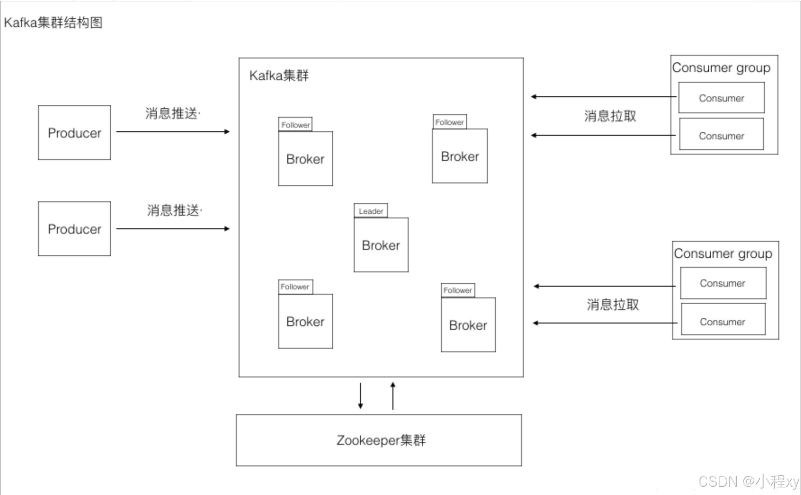
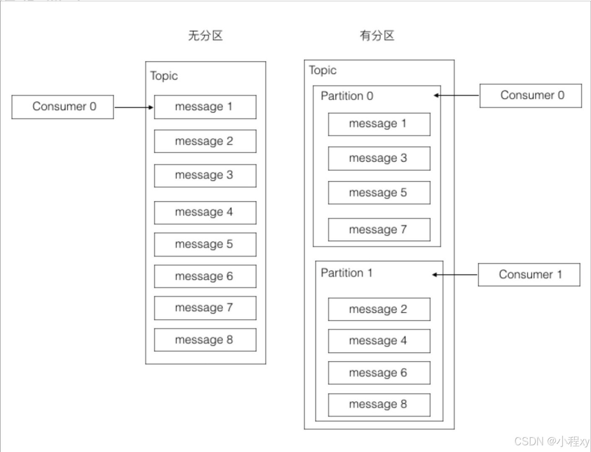
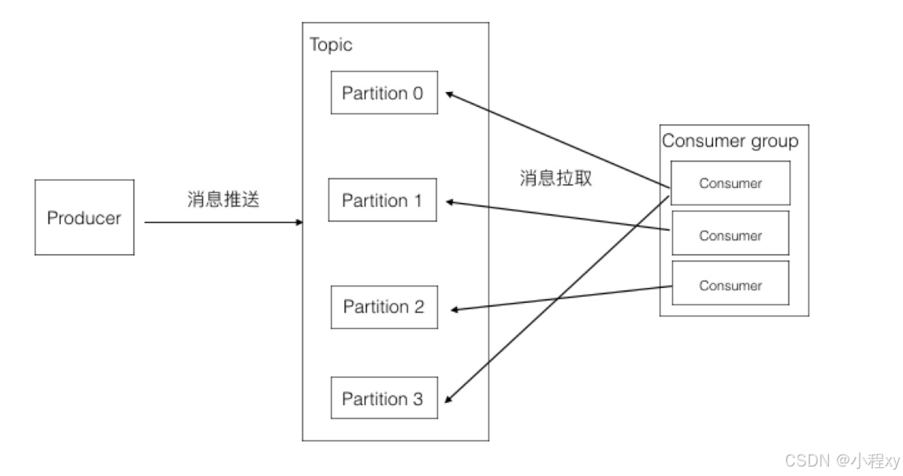
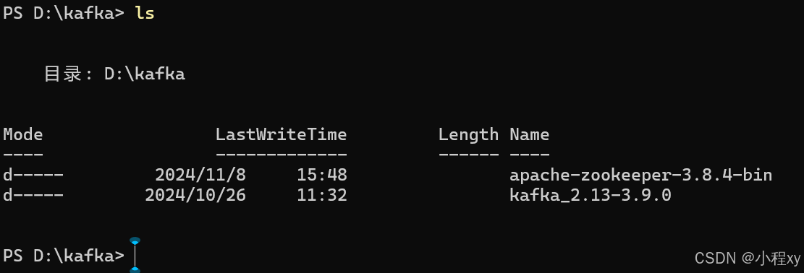
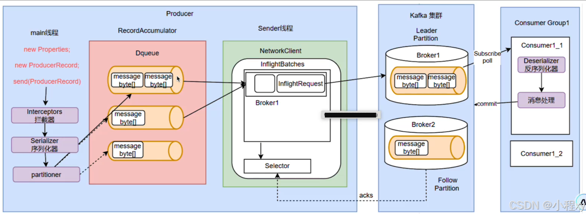

Apache Kafka 是一个开源的分布式流处理平台，最初由 LinkedIn 开发，后来成为 Apache 项目。Kafka 主要用于高吞吐量、低延迟的实时数据流处理，常用于日志收集、实时分析、消息传递等场景。


## 一、理论知识

### 1. **Kafka 的基本概念**

**生产者（Producer）** 是负责将消息发送到 Kafka 主题（topic）的客户端。

生产者将消息发送到一个主题的一个或多个分区。生产者通常会根据消息的键（key）来决定将消息发送到哪个分区。（可自定义）


 **消费者（Consumer）** 是从 Kafka 中读取消息的客户端。

消费者订阅一个或多个主题后，会从 Kafka 集群中消费消息。消费者通常会消费指定分区中的消息。

broker内部


### 2. **Kafka 主题（Topic）**
Kafka 中的 **主题（Topic）** 是消息的基本分类方式，用于组织和区分消息流。消费者和生产者通过主题来进行消息的发送和接收。

- **生产者向主题发送消息**：Kafka 的生产者将消息发送到指定的主题。每个主题都有一个唯一的名字。
  
- **消费者订阅主题**：消费者根据主题名来订阅消息。一个消费者可以订阅多个主题，获取来自不同主题的消息。

### 3. **分区（Partition）**
Kafka 中的 **分区（Partition）** 是主题的子部分，它是 Kafka 中并行处理的基本单元。每个主题可以有多个分区。分区的作用是将主题的消息分散到多个服务器（Kafka Broker）上存储，从而提高吞吐量和可伸缩性。

- **消息的顺序性**：每个分区内的消息是有顺序的。Kafka 保证同一分区中的消息按照发送顺序排列。
  
- **并行消费**：通过将一个主题划分为多个分区，Kafka 可以支持并行处理。当多个消费者组中的消费者订阅一个主题时，Kafka 会**将分区分配给不同的消费者**，实现消息的并行消费。

### 4. **偏移量（Offset）**
每个分区中的消息都有一个唯一的编号，称为 **偏移量（Offset）**。偏移量是 Kafka 用来跟踪消息消费进度的标识符。

- **消费进度管理**：消费者通过偏移量来跟踪自己消费到哪条消息。
- **消费者组的偏移量**：每个消费者组有独立的偏移量。不同的消费者组会有不同的消费进度。


### 5. **消费者组（Consumer Group）**
Kafka 中的 消费者组（Consumer Group） 是多个消费者的集合，共同消费一个或多个主题中的消息。消费者组的核心目的是 **并行消费**，确保消息在组内**每个分区只被一个消费者消费。**

- **消费的并行性**：消费者组使得多个消费者可以并行消费多个分区。每个消费者组负责管理自己消费的消息的偏移量。


这里需要理解对 partition 和 消费组、消费者之间的关系：

1、一个partition只能被同组的一个consumer消费（partition指向一个消费组的话，只会指向这个消费组中的一个消费者）

2、同一个组里的一个consumer可以消费多个partition

3、消费效率最高的情况是partition和consumer数量相同。这样确保每个consumer专职负责一个partition。

4、consumer数量不能大于partition数量。由于第一点的限制，当consumer多于partition时，就会有consumer闲置。


### 6. **Kafka 的数据存储与日志机制**

Kafka 的存储机制基于日志文件，每个主题的分区都会有一个独立的日志文件。Kafka 的日志机制具有以下特点：

- **顺序写入**：Kafka 使用顺序写入的方式，所有的消息都会追加到日志文件的末尾，这使得磁盘的 I/O 操作非常高效。
  
- **不可修改的日志**：消息一旦被写入日志文件，就不能修改。这种设计简化了分布式系统中的数据一致性问题，同时也为后期的消息回溯和重放提供了便利。

- **日志保留策略**：Kafka 会根据配置的日志保留策略来决定日志文件的保存时间或大小。可以设置基于时间（如保留 7 天内的日志）或基于大小（如日志文件达到一定大小后删除旧的日志）。

### 7. **Kafka 的高可用性与容错性**

Kafka 具有高度的容错性，主要通过以下几种机制实现：

- **副本机制**：每个分区的消息会有多个副本，存储在不同的 Broker 上。一个分区的领导者（leader）负责处理所有的读写请求，而副本（follower）则跟随领导者同步数据。如果领导者故障，Kafka 会自动选举新的领导者，保证数据的可用性。

- **数据复制**：Kafka 会将消息同步到副本中，以防止单点故障。在副本数配置较高的情况下，即使有多个 Broker 故障，Kafka 也能保持数据的高可用性。

- **消息确认（ACKs）**：Kafka 提供三种不同的确认策略来保证消息的可靠性：
  - `acks=0`：生产者不等待确认，消息可能会丢失。
  - `acks=1`：生产者等待至少一个副本确认，消息如果被写入一个副本就会认为成功。
  - `acks=all`（或 `acks=-1`）：生产者等待所有副本确认，提供最高的可靠性。


## 二、启动一个kafka服务和一个zookeeper
假设我本地 `D:\kafka` 下有下载好的 kafka 和 zookeeper。(kafka默认自带了一个 zookeeper, 这里我下载了一个zookeeper)



### 1. **启动 Zookeeper**

Kafka 使用 Zookeeper 进行集群协调，因此 Zookeeper 是启动 Kafka 的前提。你可以使用 Kafka 自带的 Zookeeper 启动脚本启动一个本地 Zookeeper 实例。(非window系统的话不用进到window目录, 只需要bin目录)

1. 打开一个新的 PowerShell 窗口，进入到 Kafka 解压目录中的 `bin\windows` 目录：
   
   ```powershell
   cd D:\kafka\kafka_2.13-3.9.0\bin\windows
   ```

2. 启动 Zookeeper：

   ```powershell
   .\zookeeper-server-start.bat ..\..\config\zookeeper.properties
   ```

   这个命令会启动一个本地的 Zookeeper 实例，并默认监听在 `localhost:2181`。出现 Zookeeper 启动日志，表明 Zookeeper 服务正在运行：

   ```
   [2024-11-08 10:00:00,123] INFO binding to port 2181 (org.apache.zookeeper.server.ZooKeeperServer)
   ```

### 2. **启动 Kafka**

1. 打开另一个新的 PowerShell 窗口，进入 Kafka 解压目录中的 `bin\windows` 目录：

   ```powershell
   cd D:\kafka\kafka_2.13-3.9.0\bin\windows
   ```

2. 启动 Kafka 服务器：

   ```powershell
   .\kafka-server-start.bat ..\..\config\server.properties
   ```

   默认情况下，Kafka 会监听 `localhost:9092`，并连接到本地的 Zookeeper 实例（`localhost:2181`）。出现 Kafka 启动日志，表明 Kafka 服务正在运行：

   ```
   [2024-11-08 10:05:00,456] INFO [KafkaServer id=0] started (kafka.server.KafkaServer)
   ```

### 3. **验证 Kafka 是否正常工作**

现在，你已经成功启动了 Kafka 服务。你可以通过创建一个 Kafka 主题并发送/接收消息来验证 Kafka 是否工作正常。

1. **创建 Kafka 主题**（例如，创建一个名为 `test` 的主题）：

   ```powershell
   .\kafka-topics.bat --create --topic test --bootstrap-server localhost:9092 --partitions 1 --replication-factor 1
   ```

   如果命令执行成功，表示 Kafka 已经启动并且主题 `test` 被创建。

2. **列出所有 Kafka 主题**：

   ```powershell
   .\kafka-topics.bat --list --bootstrap-server localhost:9092
   ```

   如果显示 `test` 主题，说明 Kafka 启动正常。

3. **启动生产者**（发送消息到 `test` 主题）：

   ```powershell
   .\kafka-console-producer.bat --topic test --bootstrap-server localhost:9092
   ```

   输入一些消息并按回车（例如：`Hello Kafka`），这会将消息发送到 Kafka 服务器的 `test` 主题。

4. **启动消费者**（消费 `test` 主题的消息）：

   ```powershell
   .\kafka-console-consumer.bat --topic test --bootstrap-server localhost:9092 --from-beginning
   ```

   如果消费者显示出你输入的消息，说明 Kafka 正常工作。

---

## 二、搭建zookeeper集群

### **1. Zookeeper 集群的概念**

Zookeeper 是一个分布式协调服务，它通过一个 **集群（ensemble）** 来提供高可用性。Zookeeper 集群通常由多个节点组成（一般是 3、5 或 7 个节点），以保证在单个节点失效时，集群仍能正常工作。

Zookeeper 使用 **Leader-Follower** 模式，集群中的一个节点会被选举为 **Leader**，负责处理写请求，其他节点作为 **Follower**，负责处理读请求。通过这种方式，Zookeeper 保证了分布式系统的一致性和高可用性。

### 2. **准备工作**

确保已经准备好多个服务器，或者在本地启动多个 Zookeeper 实例来模拟集群。**（这里我们采用本地启动多个实例来演示）**

- Zookeeper 集群至少需要 3 个节点，建议使用 3、5 或 7 个节点。
- 每个节点都需要分配一个 **唯一的 `id`**，这对于 Zookeeper 的 Leader 选举非常重要。
- 配置 `myid` 文件来标识每个节点。

### 3. **配置 Zookeeper 集群**

我们以三个节点的 Zookeeper 集群为例，演示如何配置集群。

#### 3.1 配置 `zoo.cfg`

每个 Zookeeper 节点都需要配置一个 `zoo.cfg` 配置文件。你可以在每个节点的 `conf` 目录下找到这个文件（默认是`zoo_sample.cfg`, 这是官方给的例子, 我们可以复制一份, 弄成 `zoo.cfg`）。以下是一些重要的配置项：

1. **dataDir**：Zookeeper 存储数据和日志的目录。
2. **clientPort**：客户端连接 Zookeeper 的端口。
3. **server.X**：Zookeeper 集群中的服务器列表，其中 `X` 是每个节点的唯一标识符。
4. **initLimit** 和 **syncLimit**：这些参数控制 Zookeeper 集群中的节点之间的同步行为。

#### 3.2 示例配置文件

假设你有 3 个 Zookeeper 节点，分别是 `localhost:2181`、`localhost:2182` 和 `localhost:2183`，以下是每个节点的 `zoo.cfg` 配置文件的示例。**（这里我们是在本地起了三个zookeeper实例, 把不同的实例运行在不同的端口，正常三台服务器的话应该都运行在默认端口`2181`, 然后 localhost 换成服务器的ip地址）**

下面给出三个服务器的 `zoo.cfg` 配置文件。（这里我们还是本地起的三个实例）

- **Node 1 (`localhost:2181`)**：

```properties
# 数据存储目录
dataDir=D:/zookeeper/data1	 # 服务器的话可以都写成 /zookeeper/data

# 客户端连接端口
clientPort=2181

# 启动服务器的数量
initLimit=5
syncLimit=2

# 集群成员
server.1=localhost:2888:3888		# 三台服务器的话应该是 localhost 换成三个服务器的ip，三个都是2888.3888
server.2=localhost:2889:3889
server.3=localhost:2890:3890
```

- **Node 2 (`localhost:2182`)**：

```properties
dataDir=D:/zookeeper/data2
clientPort=2182
initLimit=5
syncLimit=2
server.1=localhost:2888:3888
server.2=localhost:2889:3889
server.3=localhost:2890:3890
```

- **Node 3 (`localhost:2183`)**：

```properties
dataDir=D:/zookeeper/data3
clientPort=2183
initLimit=5
syncLimit=2
server.1=localhost:2888:3888
server.2=localhost:2889:3889
server.3=localhost:2890:3890
```

#### 3.3 **`myid` 文件**

每个 Zookeeper 节点都需要一个 `myid` 文件，文件中存储一个唯一的 ID，用于标识该节点。这是 Zookeeper 集群中的一个重要配置项。

1. 在每个节点的 `dataDir` 目录下创建一个名为 `myid` 的文件。
2. 文件内容为节点的 ID。例如：

   - **Node 1**：在 `D:/zookeeper/data1` 目录下创建一个文件 `myid`，内容为 `1`。
   - **Node 2**：在 `D:/zookeeper/data2` 目录下创建一个文件 `myid`，内容为 `2`。
   - **Node 3**：在 `D:/zookeeper/data3` 目录下创建一个文件 `myid`，内容为 `3`。

### 4. **启动 Zookeeper 集群**

1. **启动每个 Zookeeper 节点**：

   使用以下命令分别在不同的终端（或者在不同的 PowerShell 窗口）中启动每个 Zookeeper 节点。进入到 Zookeeper 的 `bin\windows` 目录，然后执行以下命令启动 Zookeeper。

   - 启动第一个节点：

   ```powershell
   cd D:\zookeeper\zookeeper-3.8.4\bin\windows
   .\zkServer.cmd
   ```

   - 启动第二个节点：

   ```powershell
   cd D:\zookeeper\zookeeper-3.8.4\bin\windows
   .\zkServer.cmd
   ```

   - 启动第三个节点：

   ```powershell
   cd D:\zookeeper\zookeeper-3.8.4\bin\windows
   .\zkServer.cmd
   ```

2. **验证集群状态**：

   在启动 Zookeeper 节点之后，可以通过以下命令验证集群的状态：

   ```powershell
   cd D:\zookeeper\zookeeper-3.8.4\bin\windows
   .\zkCli.cmd
   ```

   进入 Zookeeper CLI 后，输入以下命令查看集群状态：

   ```shell
   status
   ```

   如果一切正常，你应该会看到以下类似的输出，表示 Zookeeper 集群已经成功启动：

   ```shell
   Mode: follower
   ```

   说明你当前所在的节点是 **Follower**，而集群中可能有一个节点是 **Leader**。


---


## 三、搭建kafka集群


在分布式环境中，通常会启动多个 Kafka 实例，形成一个 **Kafka 集群**。Kafka 集群中的所有节点都依赖 **Zookeeper** 来进行协调（如领导者选举、分区分配等）。以下是如何通过 Zookeeper 启动一个简单的 Kafka 集群。

### 1. **配置多个 Kafka 实例**

一个 Kafka 集群通常由多个 Kafka broker 组成，每个 broker 都会连接到 Zookeeper。假设有 3 个 Kafka broker，它们的配置文件分别是 `server-1.properties`、`server-2.properties` 和 `server-3.properties`。**（这里是我们在一个服务器上运行三个kafka）**

每个 `server.properties` 配置文件需要设置 **唯一的 `broker.id`**，**Zookeeper 地址**，以及其他相关配置。

1. **复制 `server.properties` 文件**，创建 3 个配置文件，分别命名为 `server-1.properties`、`server-2.properties` 和 `server-3.properties`，并修改以下参数：

   - **broker.id**：每个 broker 必须有一个唯一的 `broker.id`。
   - **listeners**：指定每个 broker 的监听地址。
   - **log.dirs**：设置每个 broker 存储日志的目录。
   - **zookeeper.connect**：所有 broker 都需要连接到同一个 Zookeeper 实例。

   例如，`server-1.properties` 文件配置如下：

   ```properties
   broker.id=1
   listeners=PLAINTEXT://localhost:9091
   log.dirs=/tmp/kafka-logs-1
   zookeeper.connect=localhost:2181,localhost:2182,localhost2183 # 因为我们上面启动的三个zookeeper是同一主机的这三个端口
   ```

   `server-2.properties` 和 `server-3.properties` 文件内容相似，只需修改 `broker.id` 和 `listeners` 配置：

   - `server-2.properties` 中设置 `broker.id=2`，`listeners=PLAINTEXT://localhost:9092`。
   - `server-3.properties` 中设置 `broker.id=3`，`listeners=PLAINTEXT://localhost:9093`。

### 2. **启动 Kafka 集群中的各个节点**

1. 打开多个 PowerShell 窗口，分别进入 Kafka 的 `bin\windows` 目录。
2. 启动每个 Kafka broker（分别对应 `server-1.properties`、`server-2.properties` 和 `server-3.properties` 配置文件）：

   ```powershell
   .\kafka-server-start.bat ..\..\config\server-1.properties
   ```

   ```powershell
   .\kafka-server-start.bat ..\..\config\server-2.properties
   ```

   ```powershell
   .\kafka-server-start.bat ..\..\config\server-3.properties
   ```

### 3. **验证 Kafka 集群**

你可以通过以下命令验证 Kafka 集群是否正常启动：

- **列出所有主题**：

  ```powershell
  .\kafka-topics.bat --list --bootstrap-server localhost:9091
  ```

  你应该能看到 Kafka 集群中的所有主题。

- **创建一个主题并验证其分区**：

  ```powershell
  .\kafka-topics.bat --create --topic test --bootstrap-server localhost:9091 --partitions 3 --replication-factor 3
  ```

  该命令会创建一个名为 `test` 的主题，分配 3 个分区，并为每个分区分配 3 个副本。

- **查看 Kafka 集群的状态**：

  你可以使用以下命令来检查 Kafka 集群的健康状态和分区分布。

  ```powershell
  .\kafka-topics.bat --describe --topic test --bootstrap-server localhost:9091
  ```


## 四、kafka客户端开发



这里我们讲的是spring在kafka原生的api上进行封装后的用法

### 1. 添加依赖

首先，你需要在 Spring Boot 项目的 `pom.xml` 中添加 Kafka 相关的依赖：

```xml
<dependencies>
    <!-- Spring Boot Kafka Starter -->
    <dependency>
        <groupId>org.springframework.kafka</groupId>
        <artifactId>spring-kafka</artifactId>
    </dependency>
    <!-- 可选：如果使用Spring Boot 2.4及以上版本，使用Kafka Streams -->
    <dependency>
        <groupId>org.springframework.kafka</groupId>
        <artifactId>spring-kafka-streams</artifactId>
    </dependency>
</dependencies>
```
简单的配置
```java
spring.kafka.producer.bootstrap-servers=localhost:9092
spring.kafka.producer.key-serializer=org.apache.kafka.common.serialization.StringSerializer
spring.kafka.producer.value-serializer=org.apache.kafka.common.serialization.StringSerializer

spring.kafka.consumer.bootstrap-servers=localhost:9092
spring.kafka.consumer.group-id=test1Group
spring.kafka.consumer.key-deserializer=org.apache.kafka.common.serialization.StringDeserializer
spring.kafka.consumer.value-deserializer=org.apache.kafka.common.serialization.StringDeserializer
```

### 2. 创建 Kafka 消息生产者

Kafka 消息生产者是向 Kafka 主题发送消息的组件。可以使用 `KafkaTemplate` 来发送消息。
`KafkaTemplate` 用来发送消息。`send()` 方法接收两个参数：主题名和消息内容。

```java
@Autowired
private KafkaTemplate<String, String> kafkaTemplate; // 消息是 key value的形式发送
// 对于指定key的，kafka会根据key的哈希值把他们放到一个partition中
// kafkaTemplate.send("test-topic", "kafkaKey1" "Kafka value");  

// 没有指定key的，Kafka 会将消息发送到一个随机或轮询的分区，具体行为取决于我们使用的 Kafka 生产者配置
kafkaTemplate.send("test-topic", "KafkaValue"); 
```

### 3. 创建 Kafka 消息消费者

Kafka 消息消费者是从 Kafka 主题接收消息的组件。可以使用 `@KafkaListener` 注解来创建消费者,
消费者会自动监听指定的主题

**消费者类示例：**

```java
import org.springframework.kafka.annotation.KafkaListener;
import org.springframework.stereotype.Service;

@Service
public class KafkaConsumer {
	// @KafkaListener(topics = "test-topic", groupId = "test-group")
    // public void listen(ConsumerRecord<String, String> record) {
    //     System.out.println(record.key());
    //     System.out.println(record.value());
    // }


    // 使用 @KafkaListener 注解标注消费的主题和消费者组
    @KafkaListener(topics = "test-topic", groupId = "test-group")
    public void listen(String message) {
        System.out.println("Received message: " + message);
    }
}
```

在 `@KafkaListener` 中，`topics` 指定消费的主题，`groupId` 指定消费者组。


### 4. `@KafkaListener`

`@KafkaListener` 是 Spring Kafka 中最常用的注解，用于定义 Kafka 消费者。它标记一个方法为 Kafka 消费者，并指示该方法监听一个或多个 Kafka 主题。

- **用途**：该注解用于定义一个方法监听 Kafka 主题，自动从 Kafka 消费消息并传递给方法参数。
- **常用属性**：
  - `topics`：指定要监听的 Kafka 主题（可以指定多个主题）。
  - `groupId`：指定消费者组 ID（如果未指定，将使用默认值）。
  - `containerFactory`：指定自定义的 Kafka 消费者容器工厂，通常用于处理消息的序列化和反序列化。

**示例**：

```java
import org.springframework.kafka.annotation.KafkaListener;
import org.springframework.stereotype.Service;

@Service
public class KafkaConsumer {

    @KafkaListener(topics = "test-topic", groupId = "test-group")
    public void listen(String message) {
        System.out.println("Received message: " + message);
    }
}
```

- `@KafkaListener` 注解标记的方法会监听指定的 Kafka 主题（`test-topic`）并接收来自该主题的消息。
- `groupId` 定义了消费者组 ID，多个消费者可以属于同一个组，从而实现消息的负载均衡。

### 5. `@KafkaHandler`

`@KafkaHandler` 用于处理复杂消息类型时，将不同的消息类型分配到不同的方法。

- **用途**：`@KafkaHandler` 用于区分消息处理方法，通常在处理不同类型的消息时使用。
- **适用场景**：当同一个 Kafka 监听器需要处理多种不同的消息类型时，你可以使用 `@KafkaHandler` 标记不同的方法来处理每种类型。

**示例**：

```java
import org.springframework.kafka.annotation.KafkaListener;
import org.springframework.kafka.annotation.KafkaHandler;
import org.springframework.kafka.annotation.EnableKafka;
import org.springframework.stereotype.Service;

@Service
@EnableKafka
@KafkaListener(topics = "test-topic")
public class KafkaConsumer {

    @KafkaHandler
    public void handleMessage(String message) {
        System.out.println("Received string message: " + message);
    }

    @KafkaHandler
    public void handleOtherMessage(Integer message) {
        System.out.println("Received integer message: " + message);
    }
}
```

- 这个例子中，`@KafkaListener` 注解指定了监听 `test-topic` 主题，而 `@KafkaHandler` 注解则将不同类型的消息分配到不同的方法。
- 如果消息类型是 `String`，`handleMessage` 会处理；如果消息类型是 `Integer`，`handleOtherMessage` 会处理。

### 6. `@KafkaListeners`

`@KafkaListeners` 是一个容器注解，它允许你在一个类上定义多个 `@KafkaListener` 注解。

- **用途**：`@KafkaListeners` 用于在一个类上同时声明多个 `@KafkaListener` 注解，这样就能监听多个主题或使用不同的消费者组。
- **适用场景**：当你需要在一个类中定义多个 Kafka 监听器时，可以用 `@KafkaListeners` 来批量定义。

**示例**：

```java
import org.springframework.kafka.annotation.KafkaListener;
import org.springframework.kafka.annotation.KafkaListeners;
import org.springframework.stereotype.Service;

@Service
@KafkaListeners({
    @KafkaListener(topics = "topic1", groupId = "group1"),
    @KafkaListener(topics = "topic2", groupId = "group2")
})
public class KafkaConsumer {

    @KafkaListener(topics = "topic1", groupId = "group1")
    public void listenTopic1(String message) {
        System.out.println("Received message from topic1: " + message);
    }

    @KafkaListener(topics = "topic2", groupId = "group2")
    public void listenTopic2(String message) {
        System.out.println("Received message from topic2: " + message);
    }
}
```

- `@KafkaListeners` 允许你在一个类上声明多个 `@KafkaListener` 注解，分别监听不同的主题，并在方法中处理不同的消息。


## 五、springboot中 kafka的配置

在 Spring Boot 中使用 Kafka，主要涉及配置 Kafka 的生产者（Producer）和消费者（Consumer）。
### 1. **Kafka 生产者配置（Producer Configuration）**

生产者用于将消息发送到 Kafka 主题。常用的生产者配置项如下：

#### 配置示例（`application.properties`）：
```properties
# Kafka 生产者配置
spring.kafka.producer.bootstrap-servers=localhost:9092  # Kafka 集群地址 多个地址用 , 隔开
spring.kafka.producer.key-serializer=org.apache.kafka.common.serialization.StringSerializer  # 默认的键的序列化器
spring.kafka.producer.value-serializer=org.apache.kafka.common.serialization.StringSerializer  # 默认的值的序列化器
spring.kafka.producer.acks=all  # 确认方式
spring.kafka.producer.retries=3  # 生产者发送失败时的重试次数
spring.kafka.producer.batch-size=16384  # 批量发送的最大消息数（单位：字节）16k
spring.kafka.producer.linger-ms=1  # 生产者等待更多消息的时间（单位：毫秒）
spring.kafka.producer.buffer-memory=33554432  # 内存缓冲区的大小（单位：字节）
```

#### 配置项详细讲解：

- **`spring.kafka.producer.bootstrap-servers`**：
  - **作用**：指定 Kafka 集群的地址，生产者连接到该地址进行消息发送。可以配置多个 Kafka 服务器地址，保证高可用性。
  - **示例**：`localhost:9092`。

- **`spring.kafka.producer.key-serializer`**：
  - **作用**：指定生产者键（Key）的序列化器。Kafka 传输的数据需要序列化和反序列化。常用的序列化器有 `StringSerializer`、`IntegerSerializer` 等。
  - **示例**：`org.apache.kafka.common.serialization.StringSerializer`。

- **`spring.kafka.producer.value-serializer`**：
  - **作用**：指定生产者值（Value）的序列化器。与 `key-serializer` 类似，`value-serializer` 用于指定消息体（值）的序列化器。
  - **示例**：`org.apache.kafka.common.serialization.StringSerializer`。

- **`spring.kafka.producer.acks`**：
  - **作用**：指定生产者消息的确认机制。可以选择以下几个值：
    - `0`：不等待确认，即消息发送后立即返回。
    - `1`：等待 Leader 节点确认。
    - `all`：等待所有副本确认（保证消息可靠性，推荐使用）。
  - **示例**：`all`。

- **`spring.kafka.producer.retries`**：
  - **作用**：指定消息发送失败时，生产者的重试次数。默认值是 `0`，如果为 `-1`，则会一直重试，直到成功。
  - **示例**：`3`。

- **`spring.kafka.producer.batch-size`**：
  - **作用**：指定批量发送的消息大小（单位：字节）。当达到该大小时，生产者将立即发送消息。如果设置得过小，可能会影响吞吐量；如果设置过大，可能会增加延迟。
  - **示例**：`16384` 字节（16 KB）。

- **`spring.kafka.producer.linger-ms`**：
  - **作用**：指定生产者发送消息前等待的时间。默认是 `0`，即立即发送。如果设置为正数，生产者会等到这个时间，尝试批量发送更多的消息，提高吞吐量。
  - **示例**：`1` 毫秒。

- **`spring.kafka.producer.buffer-memory`**：
  - **作用**：指定生产者的缓冲区大小（单位：字节）。如果缓冲区填满，生产者会阻塞，直到缓冲区有空间。如果缓冲区太小，会影响吞吐量。
  - **示例**：`33554432` 字节（32 MB）。

---

### 2. **Kafka 消费者配置（Consumer Configuration）**

消费者用于从 Kafka 中消费消息。常用的消费者配置项如下：

#### 配置示例（`application.properties`）：
```properties
# Kafka 消费者配置
spring.kafka.consumer.bootstrap-servers=localhost:9092  # Kafka 集群地址
spring.kafka.consumer.group-id=my-group1  # 默认的消费者组，如果@KafkaListener注解没有写消费者组就会使用这个消费者组
spring.kafka.consumer.key-deserializer=org.apache.kafka.common.serialization.StringDeserializer  # 默认的键的反序列化器
spring.kafka.consumer.value-deserializer=org.apache.kafka.common.serialization.StringDeserializer  # 默认的值的反序列化器
spring.kafka.consumer.auto-offset-reset=earliest  # 消费者如何处理未提交的消息
spring.kafka.consumer.enable-auto-commit=true  # 是否自动提交消费偏移量
spring.kafka.consumer.fetch-min-bytes=50000  # 从 Kafka 拉取消息的最小字节数
spring.kafka.consumer.max-poll-records=500  # 每次拉取的最大消息数量
spring.kafka.consumer.session-timeout=15000  # 会话超时时间（单位：毫秒）
```

#### 配置项详细讲解：

- **`spring.kafka.consumer.bootstrap-servers`**：
  - **作用**：指定 Kafka 集群的地址，消费者连接到该地址进行消息消费。
  - **示例**：`localhost:9092`。

- **`spring.kafka.consumer.group-id`**：
  - **作用**：指定消费者所属的消费组 ID。Kafka 消费者通过消费组来处理消息。如果多个消费者属于同一组，它们会共享消费队列中的消息。不同组的消费者互不干扰。
  - **示例**：`my-group`。

- **`spring.kafka.consumer.key-deserializer`**：
  - **作用**：指定消费者键（Key）的反序列化器。与生产者的 `key-serializer` 配置相对，消费者需要对消息的键进行反序列化。常用的反序列化器有 `StringDeserializer`、`IntegerDeserializer` 等。
  - **示例**：`org.apache.kafka.common.serialization.StringDeserializer`。

- **`spring.kafka.consumer.value-deserializer`**：
  - **作用**：指定消费者值（Value）的反序列化器。与生产者的 `value-serializer` 配置相对，消费者需要对消息的值进行反序列化。
  - **示例**：`org.apache.kafka.common.serialization.StringDeserializer`。

- **`spring.kafka.consumer.auto-offset-reset`**：
  - **作用**：指定消费者如何处理偏移量（offset）未提交的情况。常见的值有：
    - `earliest`：从最早的消息开始消费。
    - `latest`：从最新的消息开始消费（默认行为）。
  - **示例**：`earliest`。

- **`spring.kafka.consumer.enable-auto-commit`**：
  - **作用**：是否启用自动提交消息的偏移量。`true` 表示自动提交，`false` 表示手动提交。自动提交方式不适合复杂的消费逻辑，手动提交可以确保消费的消息被正确处理。
  - **示例**：`true`。

- **`spring.kafka.consumer.fetch-min-bytes`**：
  - **作用**：指定从 Kafka 拉取消息时的最小字节数。如果消息总量小于该值，消费者会等待更多的数据一起拉取，以减少频繁的拉取请求。
  - **示例**：`50000` 字节（50 KB）。

- **`spring.kafka.consumer.max-poll-records`**：
  - **作用**：指定每次拉取的最大消息数。这个配置有助于控制消费者每次从 Kafka 中消费多少消息，可以防止消费者一次性拉取过多消息导致内存溢出。
  - **示例**：`500`。

- **`spring.kafka.consumer.session-timeout`**：
  - **作用**：指定消费者会话的超时时间。消费者会定期发送心跳以保持会话活跃。如果在指定时间内没有收到心跳，Kafka 会认为该消费者已死掉，并将其从消费组中移除。
  - **示例**：`15000` 毫秒（15 秒）。

---

### 3. **Kafka 高级配置**

#### 配置示例（`application.properties`）：
```properties
# Kafka 生产者高级配置
spring.kafka.producer.compression-type=gzip  # 压缩类型（支持 gzip, snappy, lz4, zstd）
spring.kafka.producer.max-request-size=1048576  # 请求的最大字节数

# Kafka 消费者高级配置
spring.kafka.consumer.isolation-level=read_committed  # 读取事务提交的消息
spring.kafka.consumer.max-poll-interval=300000  # 最大轮询间隔（单位：毫秒）
spring.kafka.consumer.fetch-max-wait=500  # 最大拉取等待时间（单位：毫秒）
```

#### 解释：


- **`spring.kafka.producer.compression-type`**：
  - **作用**：生产者消息的压缩类型，可以减少网络传输的开销。常用的压缩格式有 `gzip`、`snappy`、`lz4` 和 `zstd`。

- **`spring.kafka.producer.max-request-size`**：
  - **作用**：设置 Kafka 生产者请求的最大字节数，防止消息过大导致的请求失败。

- **`spring.kafka.consumer.isolation-level`**：
  - **作用**：指定消费者读取事务消息的隔离级别，`read_committed` 表示只读取已提交的消息，`read_uncommitted` 表示可以读取未提交的消息。

- **`spring.kafka.consumer.max-poll-interval`**：
  - **作用**：指定消费者每次拉取消息之间的最大时间间隔。如果超过该时间间隔，Kafka 会认为该消费者已经失效。

- **`spring.kafka.consumer.fetch-max-wait`**：
  - **作用**：指定消费者在拉取消息时的最大等待时间。

---