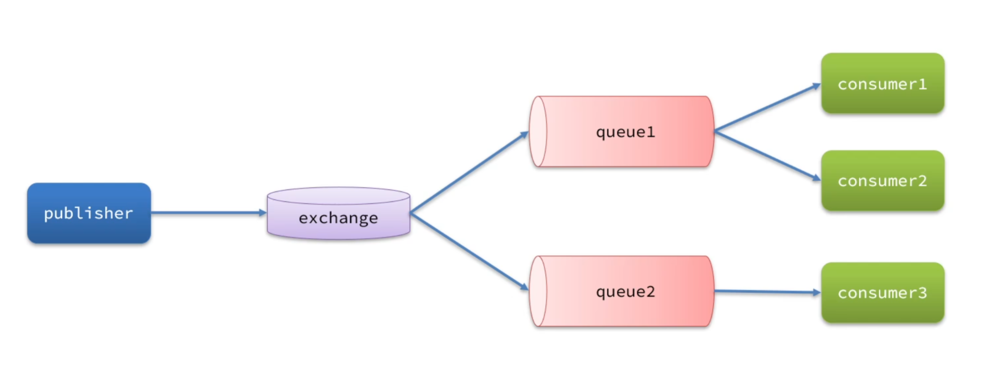

RabbitMQ 是一个流行的开源消息队列系统。

### 一、基本内容

#### 1. 基本概念

- **消息队列**：是一种用于在不同应用程序或组件之间传递消息的机制。它基于先进先出（FIFO）的原则，将消息存储在队列中，等待消费者来获取并处理。

- **RabbitMQ**：基于 AMQP（高级消息队列协议）实现的消息队列中间件，具有可靠性、灵活性和可扩展性等特点，能有效地处理分布式系统中的消息传递。


原理：生产者将消息发送到 RabbitMQ 服务器，服务器根据消息的路由键将消息路由到相应的队列中。消费者从队列中获取消息并进行处理。


#### 2. 核心组件

- **Exchange**（交换机）：接收生产者发送的消息，并根据路由规则将消息路由到不同的队列中。
  - Fanout Exchange：广播消息到所有绑定的队列。
  - Direct Exchange：根据路由键精确匹配。
  - Topic Exchange：根据路由键的模式匹配（支持通配符，# 表示一个或多个单词，* 表示一个单词）。
  - Headers Exchange：根据消息头匹配。
  
- **Queue**（队列）：消息的存储位置，生产者将消息发送到队列，消费者从队列中获取消息。（队列可以有多个消费者同时监听，但一条消息只会被一个消费者获取并处理。）
- **Binding**（绑定）：用于将交换机和队列关联起来，定义了消息从交换机到队列的路由规则。
- **Virtual Host**：可以实现数据隔离，每个virtual host都有独立的exchange和queue。




#### 3. 安装启动rabbitMQ

给docker配置代理

```bash
sudo mkdir -p /etc/systemd/system/docker.service.d
sudo nano /etc/systemd/system/docker.service.d/http-proxy.conf

// 添加下面内容
[Service]
Environment="HTTP_PROXY=http://172.20.10.2:7890"
Environment="HTTPS_PROXY=http://172.20.10.2:7890"
Environment="NO_PROXY=localhost,127.0.0.1"

sudo systemctl daemon-reload
sudo systemctl restart docker

sudo systemctl status docker

docker pull rabbitmq:3.13-management
```


```bash
docker run -d --name rabbitmq -p 5672:5672 -p 15672:15672 rabbitmq:3.13-management

运行端口 5672
ui界面地址 http://localhost:15672

// 默认的账号密码
guest
guest

```


### 二、在Spring中使用

#### 1. 依赖和配置

```properties
spring.rabbitmq.host= 192.168.227.128
spring.rabbitmq.port= 5672
spring.rabbitmq.username= guest
spring.rabbitmq.password= guest
# 在多个消费者下，默认是轮询，如果设置成1，消费者执行完后就会获取新的消息，不再是轮询
spring.rabbitmq.listener.simple.prefetch=1
```

```xml
<dependency>
    <groupId>org.springframework.boot</groupId>
    <artifactId>spring-boot-starter-amqp</artifactId>
</dependency>
```


#### 2. 测试代码

```java
发送消息的方法
1. rabbitTemplate.convertAndSend(String queueName, Object message);
- queueName：目标队列名称。
- message：要发送的消息对象
    
2. rabbitTemplate.convertAndSend("hello.mq1", "Hello, RabbitMQ!");
- exchange：交换机名称。
- routingKey：路由键，用于决定消息如何路由到队列。
- message：消息内容。
```

```java
@Controller
public class MessageProducer {
    @Autowired
    private RabbitTemplate rabbitTemplate;

    @RequestMapping("/test/rbmq")
    public void sendMessage(@RequestParam String message) {
        String queueName = "hello.mq1";
        rabbitTemplate.convertAndSend(queueName, message);
        System.out.println("Sent '" + message + "'");
    }
}
```

```java
@Component
public class MessageConsumer {
    @RabbitListener(queues = "hello.mq1")
    public void receiveMessage(String message) {
        System.out.println("Received '" + message + "'");
    }
}
```


#### 3. 消息转换器

默认情况下，发送消息和接受消息使用 Java 的序列化机制（ObjectOutputStream）转换为字节数组，由于Java的序列化机制存在：兼容性问题（跨语言不支持）、序列化开销大、安全性问题。一般我们会使用 Json 转换器

```java
@Bean
public RabbitTemplate rabbitTemplate(ConnectionFactory connectionFactory) {
    RabbitTemplate template = new RabbitTemplate(connectionFactory);
    template.setMessageConverter(new Jackson2JsonMessageConverter());
    return template;
}
```

```xml
<dependency>
    <groupId>com.fasterxml.jackson.core</groupId>
    <artifactId>jackson-databind</artifactId>
</dependency>
```


#### 4. 用代码生成交换机和消息队列

```java
@Configuration
public class RabbitMQConfig {
    // 1. 声明 Direct Exchange 和队列
    // 第二,三参数分别是：
    // durable = true：交换机和队列在 RabbitMQ 重启后仍然存在。
    // autoDelete = false：当最后一个消费者断开连接时，不自动删除交换机或队列。
    @Bean
    public DirectExchange directExchange() {
        return new DirectExchange("direct_exchange", true, false);
    }

    @Bean
    public Queue directQueue() {
        return new Queue("direct_queue", true);
    }

    @Bean
    public Binding directBinding(Queue directQueue, DirectExchange directExchange) {
        // 绑定队列到交换机，使用路由键 "direct_key"
        return BindingBuilder.bind(directQueue).to(directExchange).with("direct_key");
    }

    // 2. 声明 Fanout Exchange 和队列
    @Bean
    public FanoutExchange fanoutExchange() {
        return new FanoutExchange("fanout_exchange", true, false);
    }

    @Bean
    public Queue fanoutQueue1() {
        return new Queue("fanout_queue1", true);
    }

    @Bean
    public Queue fanoutQueue2() {
        return new Queue("fanout_queue2", true);
    }

    @Bean
    public Binding fanoutBinding1(Queue fanoutQueue1, FanoutExchange fanoutExchange) {
        // Fanout 不需要路由键
        return BindingBuilder.bind(fanoutQueue1).to(fanoutExchange);
    }

    @Bean
    public Binding fanoutBinding2(Queue fanoutQueue2, FanoutExchange fanoutExchange) {
        return BindingBuilder.bind(fanoutQueue2).to(fanoutExchange);
    }

    // 3. 声明 Topic Exchange 和队列
    @Bean
    public TopicExchange topicExchange() {
        return new TopicExchange("topic_exchange", true, false);
    }

    @Bean
    public Queue topicQueue1() {
        return new Queue("topic_queue1", true);
    }

    @Bean
    public Queue topicQueue2() {
        return new Queue("topic_queue2", true);
    }

    @Bean
    public Binding topicBinding1(Queue topicQueue1, TopicExchange topicExchange) {
        return BindingBuilder.bind(topicQueue1).to(topicExchange).with("log.*");
        // 匹配 "log.*" 的路由键（如 log.info）
    }

    @Bean
    public Binding topicBinding2(Queue topicQueue2, TopicExchange topicExchange) {
        return BindingBuilder.bind(topicQueue2).to(topicExchange).with("log.error");
        // 只匹配 "log.error"
    }
}
```


### 三、消息的可靠性

#### 1. 生产者连接时

启用重试机制，确保生产者连接rbmq胜败时重试。

```properties
# 启用重试
spring.rabbitmq.template.retry.enabled=true
# 最大重试次数
spring.rabbitmq.template.retry.max-attempts: 2
# 初始重试间隔
spring.rabbitmq.template.retry.initial-interval: 300ms
# 间隔倍数
spring.rabbitmq.template.retry.multiplier: 2.0
# 最大间隔
spring.rabbitmq.template.retry.max-interval: 2s
```


#### 2. 生产者消息发送时

Broker（ RabbitMQ 服务器） 在**接收**到消息并**处理后**（例如**路由到队列**或**持久化到磁盘**），向生产者发送确认（ACK）。如果消息未被正确处理（例如交换机不存在），返回 NACK。

```properties
# 启用生产者ACK确认
spring.rabbitmq.publisher-confirm-type=correlated
# 启用返回,当失败时返回异常
spring.rabbitmq.publisher-returns=true
```

```java
@Service
public class ReliableProducer {
    @Autowired
    private RabbitTemplate rabbitTemplate;
    
    // @PostConstruct 的作用：确保 init() 方法在 ReliableProducer Bean 创建并注入 rabbitTemplate 后立即执行，
    // 用于设置 RabbitTemplate 的发布确认回调。
    @PostConstruct
    public void init() {
        // 设置异步确认回调
        rabbitTemplate.setConfirmCallback((correlationData, ack, cause) -> {
            if (ack) {	// 1. 消息正常通过路由器传递到队列后（并持久化后）
                System.out.println("Message confirmed: " + ack);
            } else {	// 2. NACK 接收消息后处理失败 or 消息发送的交换机不存在
                System.out.println("Message failed: " + cause);
            }
        });
        
        // 消息没有路由到队列时触发     3. routerKey不存在
        rabbitTemplate.setReturnsCallback(returned -> {
            System.out.println("Message returned: " + returned.getReplyText() +
                    ", routingKey: " + returned.getRoutingKey());
        });
    }
}
```


#### 3. rbmq 的可靠性

默认情况下，RabbitMQ 的交换机、队列和消息都是存储在内存中的。如果 RabbitMQ 服务器发生故障宕机，就会导致消息丢失。为避免这种情况，我们可以把队列和消息设置成持久化的，将其存储在硬盘中。

- 当消息选择**存储在内存中**时，如果内存满了，就会阻塞线程，停止接收消息，把消息 paged out 到磁盘中，然后清除内存，继续接受消息。

- 当消息选择持久化时（存储在硬盘），所有消息都会存储在硬盘中（**部分存在内存中**，提高效率），内存满的话直接删除，不会阻塞线程。

新版本（≥3.12.0）： 默认队列模式改为 "Lazy Queue"，这个模式下消息直接写入磁盘，**仅在消费时加载到内存**

一般采用 **持久化 + Lazy Queue**。如果不选择持久化，那么即使因为Lazy Queue将消息存入磁盘，但仅存于临时文件，RabbitMQ 服务器重启后，消息会丢失。


#### 4. 消费者处理消息时

##### 4.1 启用消费者的**重试机制**

在消费者处理消息失败后进行重。（`确保消息可达`）

```properties
# 启用消费者重试
spring.rabbitmq.listener.simple.retry.enabled=true
# 最大重试次数（默认 3）
spring.rabbitmq.listener.simple.retry.max-attempts=3
# 初始重试间隔（毫秒）
spring.rabbitmq.listener.simple.retry.initial-interval=300ms
# 每次重试间隔倍增
spring.rabbitmq.listener.simple.retry.multiplier=2
# 最大重试间隔（毫秒）
spring.rabbitmq.listener.simple.retry.max-interval=2s
```


##### 4.2 在消费者处理消息时加上确认机制

默认情况下 `acknowledge-mode=none` ，消费者处理消息没有确认机制，rbmq把消息发给消费者后就会删除消息。这里我们加上自动的确认机制。（`确保消息正确消费`）

1. ACK：消息成功处理，RabbitMQ 删除消息
2. NACK：处理失败，消息可以**重新入队** 或 **进入死信队列**（默认是重新入队）
3. Reject：消息被拒绝，可丢弃或重新进入队列（默认是丢弃）

```properties
# 默认是none，不会有消息处理结果的确认，消息在发送给消费者时就被删除掉了
spring.rabbitmq.listener.simple.acknowledge-mode=none
# 开启确认机制，全是自动默认的，nack重新入队，reject丢弃
spring.rabbitmq.listener.simple.acknowledge-mode=auto
```

当我们加上消费者的确认机制后，需要手动告诉rbmq，当前消息返回ACK还是NACK。之前没有开启确认机制时，只要消息发送到消费者就会被删除。

```java
@RabbitListener(queues = "direct_queue")
public void receiveMessage(String message, Channel channel, Message rabbitMessage) throws IOException {
    long tag = rabbitMessage.getMessageProperties().getDeliveryTag();
    String messageId = rabbitMessage.getMessageProperties().getMessageId();

    System.out.println("Received '" + message + "'" + "id = " + messageId);
    channel.basicAck(tag, false);   // 返回ack
}
```

```java
// 1. ack
// deliveryTag：消息唯一标识
// false：仅确认当前消息（true 表示批量确认）
channel.basicAck(deliveryTag, false);

// 2. nack
// false：仅拒绝当前消息（true 表示批量 NACK）
// true：重入队列（false 直接丢弃）
channel.basicNack(deliveryTag, false, true);

// 3. reject
// false：丢弃消息
// true：重新入队
```


##### 4.3 自定义消费者ack机制

上面讲到NACK会有默认行为，这里弄成进入死信队列。（`将未消费的消息弄到死信队列`）

1. 设置手动处理NACK

```properties
# 手动处理
spring.rabbitmq.listener.simple.acknowledge-mode=manual
```

2. 配置死信队列

```java
// 定义错误交换机（error_exchange）
@Bean
public DirectExchange errorExchange() {
    return new DirectExchange("error.direct");
}

// 定义错误队列（error_queue）
@Bean
public Queue errorQueue() {
    return new Queue("error");
}

// 绑定错误队列到错误交换机
@Bean
public Binding errorBinding() {
    return BindingBuilder.bind(errorQueue()).to(errorExchange()).with("error_routing");
}

// 配置 RepublishMessageRecoverer，自动将失败的消息转发到 error_exchange
@Bean
public RepublishMessageRecoverer republishMessageRecoverer(RabbitTemplate rabbitTemplate) {
    return new RepublishMessageRecoverer(rabbitTemplate, "error.direct", "error_routing");
}
```

##### 4.4 幂等性

**幂等性** 是指**消费者在处理同一条消息多次时，保证最终结果不变**。（`解决一个消息多次消费导致的问题`）

先配置消息发送时带上uuid，确保每个消息都有唯一的标识，然后通过redis来保证幂等性

```java
@Bean
public RabbitTemplate rabbitTemplate(ConnectionFactory connectionFactory) {
    RabbitTemplate template = new RabbitTemplate(connectionFactory);
    Jackson2JsonMessageConverter jjm = new Jackson2JsonMessageConverter();
    // 为每个消息加上一个UUID，在消费时判断缓存中是否存在这个uuid，如果存在则不再消费，消费后将uuid存在redis中
    jjm.setCreateMessageIds(true);	
    template.setMessageConverter(jjm);
    return template;
}
```

示例：

```java
String messageId = rabbitMessage.getMessageProperties().getMessageId();
long deliveryTag = rabbitMessage.getMessageProperties().getDeliveryTag();

if (messageId == null || messageId.trim().isEmpty()) {
    System.out.println("⚠️ messageId 为空，丢弃消息");
    channel.basicNack(deliveryTag, false, false);
    return;
}

// 1. 使用 Redis 分布式锁 防止并发消费
String lockKey = "msg:lock:" + messageId;
Boolean lockAcquired = redisTemplate.opsForValue().setIfAbsent(lockKey, "1", 10, TimeUnit.MINUTES);

// 2. 实现幂等性
if (Boolean.FALSE.equals(lockAcquired)) {
    System.out.println("消息 " + messageId + " 已在处理，跳过");
    channel.basicAck(deliveryTag, false); // 直接确认
    return;
}
```


### 四、延迟消息

#### 1. TTL + 死信队列（DLX） 实现延迟消息

实现思路：给消息设置过期时间，将消息发送到一个没有消费者的队列中，并给这个消息设置一个 `DLX`，当消息过期时胡进入到DLX中，在DLX中处理消息，间接实现延迟消息。


#### 2. rabbitmq_delayed_message_exchange 

通过rabbitmq提供的插件实现延迟消息。

下载启动插件

```bash
# 进入rabbitmq容器终端
docker exec -it rabbitmq bash

# 在plugings中下载插件
cd /usr/lib/rabbitmq/plugins
curl -LO https://github.com/rabbitmq/rabbitmq-delayed-message-exchange/releases/download/v3.12.0/rabbitmq_delayed_message_exchange-3.12.0.ez

# 启动插件
rabbitmq-plugins enable rabbitmq_delayed_message_exchange

# 退出容器，重启容器
docker stop rabbitmq
docker start rabbitmq

# 检查是否成功
rabbitmq-plugins list | grep rabbitmq_delayed_message_exchange
```

示例：

创建延迟交换机

```java
@Bean
public Exchange delayedExchange() {
    return ExchangeBuilder.directExchange("delayed.exchange")
            .delayed() // 设置为延迟交换机
            .durable(true)
            .build();
}

@Bean
public Queue delayedQueue() {
    return QueueBuilder.durable("delayed.queue").build();
}

@Bean
public Binding delayedBinding() {
    return BindingBuilder.bind(delayedQueue())
            .to(delayedExchange())
            .with("delayed.routingKey")
            .noargs();
}
```

生产者

```java
@Controller
@RequiredArgsConstructor
@Slf4j
public class MessageProducer {

    private final RabbitTemplate rabbitTemplate;

    @RequestMapping("/test")
    public String sendMessage() {
        String message = "Hello, Delayed Message!";
        int delayMillis = 5000; // 5秒延迟

        // 使用 MessagePostProcessor 方式设置延迟时间
        rabbitTemplate.convertAndSend("delayed.exchange", "delayed.routingKey", message, msg -> {
            msg.getMessageProperties().setHeader("x-delay", delayMillis);
            return msg;
        });

        log.info("Sent delayed message: " + message + ", delay: " + delayMillis + "ms");
        return "Message sent with delay of " + delayMillis + " ms";
    }
}
```

消费者

```java
@Component
@Slf4j
public class MessageConsumer {
    @RabbitListener(queues = "delayed.queue")
    public void receiveMessage(String message, Channel channel, Message rabbitMessage) throws IOException {
        long tag = rabbitMessage.getMessageProperties().getDeliveryTag();
        String messageId = rabbitMessage.getMessageProperties().getMessageId();

        log.info("Received delayed message: '" + message + "' id=" + messageId
                + " at " + System.currentTimeMillis());

        channel.basicAck(tag, false); // 返回 ACK，确认消息消费
    }
}
```

