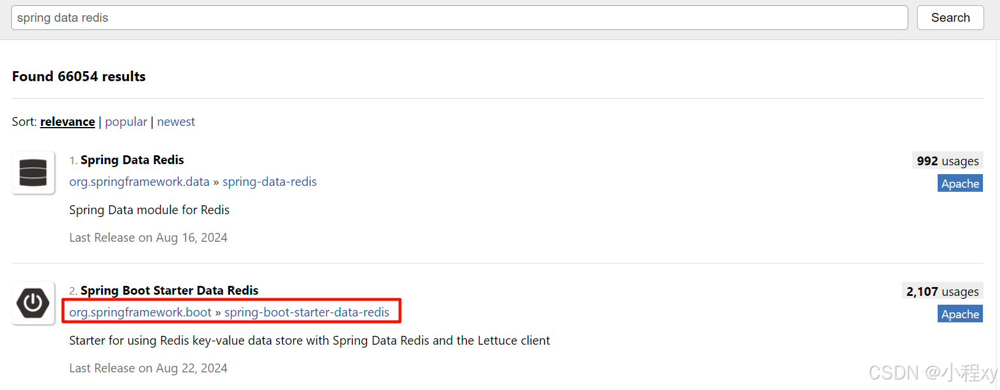
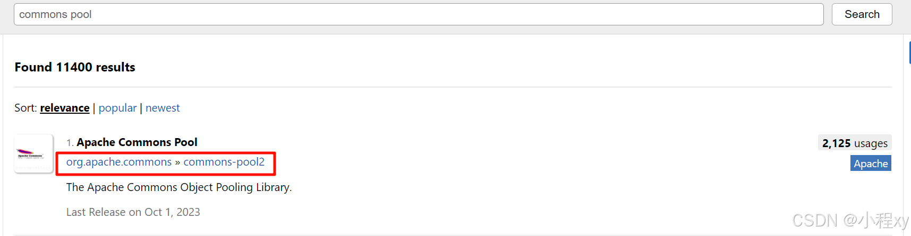
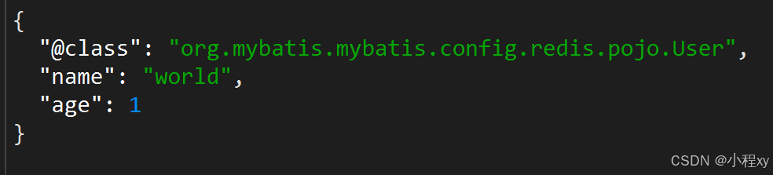
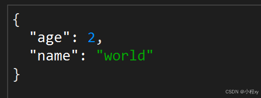
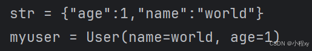
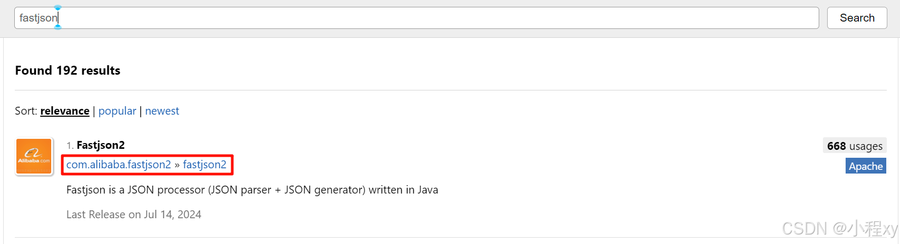

Redis 是一个开源的**内存数据库**，它支持多种数据结构，并且常用于高速缓存、会话管理、消息队列等场景。Redis 的全称是 **Remote Dictionary Server**，是一种 **key-value（键值对）存储系统**，能够以极高的性能处理大量数据的读写操作。

特点：

1. **基于内存的快速读写**：Redis 将数据存储于内存之中，这赋予了它极高的读写速度，能够满足实时数据处理以及对快速响应有严格要求的应用场景，比如在线游戏、金融交易系统等。
2. **可靠的持久化功能**：尽管 Redis 本质上是内存数据库，但它提供了完善的数据持久化机制，可以将内存中的数据保存到磁盘上。这样一来，即便遇到系统故障或重启，也能有效防止数据丢失，保障数据的完整性和可靠性。
3. **丰富多样的数据结构**：Redis 支持多种数据结构，如字符串（String）、哈希（Hash）、列表（List）、集合（Set）、有序集合（Sorted Set）等。丰富的数据结构使得 Redis 能够灵活地处理各种类型的数据，满足不同业务逻辑的需求。
4. **数据过期与自动清理**：Redis 允许为每个键值对设置过期时间，一旦达到设定的时间，对应的数据就会被自动删除。这一特性在缓存系统中尤为实用，能够自动清理过期的缓存数据，释放内存空间，提高缓存的使用效率。
5. **灵活的发布 / 订阅机制**：Redis 提供了强大的消息队列功能，通过发布 / 订阅模式，客户端可以轻松地订阅感兴趣的频道，并接收其他客户端发布到该频道的消息。这一机制在实时消息推送、分布式系统的事件通知等场景中有着广泛的应用。
6. **简单而实用的事务支持**：Redis 支持简单的事务机制，允许将多个命令组合成一个原子操作进行执行。在事务执行过程中，要么所有命令都成功执行，要么都不执行，从而保证了数据的一致性和完整性。
7. **高可用性与分布式部署**：借助 Redis Cluster 和 Sentinel 机制，Redis 能够实现高可用性和自动故障转移。在分布式环境中，它可以将数据分散存储在多个节点上，提高系统的处理能力和容错能力，确保服务的连续性和稳定性。


## 一、SpringDataRedis

Spring Data Redis 是 Spring Data 生态系统中的一个模块，提供与 Redis 的简便集成。Redis 是一个高性能的内存键值存储，Spring Data Redis 通过提供简单、一致和声明式的方式，简化了与 Redis 的交互，将低级别的 Redis 操作抽象为高级 API 和模板。

### 1、添加依赖和配置

- 添加依赖

	- spring data redis
	
	- commons pool

		

- 常见配置

	- application.yaml
	```yaml
	spring:
	  data:
	    redis:
	      # Redis 服务器的主机地址
	      host: localhost
	
	      # Redis 服务器的端口
	      port: 6379
	
	      # 配置 Redis 连接池（Lettuce 使用的连接池）
	      lettuce:
	        pool:
	          # 连接池中最大活动连接数
	          max-active: 8
	
	          # 连接池中最大空闲连接数
	          max-idle: 8
	
	          # 连接池中最小空闲连接数
	          min-idle: 0
	
	          # 连接池中最大等待时间
	          max-wait: 100ms
	
	      # Redis 数据库索引（默认为 0，Redis 默认提供 16 个数据库）
	      database: 0
	
	      # Redis 服务器的密码，用于身份验证
	      password: yourpassword
	```
	
	- 配置序列化器
	  在 `Spring Data Redis` 中，序列化和反序列化是处理 Redis 数据的关键部分。序列化是将 Java 对象转换为字节流的过程，以便存储到 Redis 中；反序列化则是将存储在 Redis 中的字节流转换回 Java 对象的过程。Spring Data Redis 提供了多种序列化和反序列化策略，可以根据具体需求进行配置。
	
    一般情况下，我们把redis的键序列化为字符串，值序列换成json格式
    
    ```java
    @Configuration
    public class RedisConfig {
    
        @Bean
        public RedisTemplate<String, Object> redisTemplate(RedisConnectionFactory connectionFactory) {
            // 创建RedisTemplate对象
            RedisTemplate<String, Object> template = new RedisTemplate<>();
    
            // 设置连接工厂
            template.setConnectionFactory(connectionFactory);
    
            // 使用 StringRedisSerializer 代替 GenericJackson2JsonRedisSerializer
            //  GenericJackson2JsonRedisSerializer jsonRedisSerializer = new GenericJackson2JsonRedisSerializer();
            StringRedisSerializer stringRedisSerializer = new StringRedisSerializer();
            GenericJackson2JsonRedisSerializer genericJackson2JsonRedisSerializer = new GenericJackson2JsonRedisSerializer();
    
            // 1. 设置key的序列化
            template.setKeySerializer(stringRedisSerializer);
            template.setHashKeySerializer(stringRedisSerializer);
    		
            // 2. 设置value的序列化
            template.setValueSerializer(genericJackson2JsonRedisSerializer);
            template.setHashValueSerializer(genericJackson2JsonRedisSerializer);
            return template;
        }
    }
    ```


### 2、对数据的操作

Spring Data Redis 提供了一组 API 用于操控 Redis 数据库。以下是一些常用的 API 及其详细说明：

1. 字符串操作 (String)

```java
// 1. 设置值
redisTemplate.opsForValue().set("key", "value");

// 2. 获取值
String value = (String) redisTemplate.opsForValue().get("key");

// 设置值（带过期时间）
redisTemplate.opsForValue().set("key", "value", Duration.ofMinutes(10));

// 删除键
redisTemplate.delete("key");
```

2. 哈希操作 (Hash)

```java
// 1. 设置哈希字段的值
redisTemplate.opsForHash().put("user:1000", "name", "Alice");
redisTemplate.opsForHash().put("user:1000", "email", "alice@example.com");

// 2. 获取哈希字段的值
String name = (String) redisTemplate.opsForHash().get("user:1000", "name");

// 3. 获取哈希的所有字段和值
Map<Object, Object> userMap = redisTemplate.opsForHash().entries("user:1000");
```

3. 列表操作 (List)

```java
// 1. 右侧推入列表
redisTemplate.opsForList().rightPush("list", "value1");
redisTemplate.opsForList().rightPush("list", "value2");

// 2. 左侧推入列表
redisTemplate.opsForList().leftPush("list", "value0");

// 3. 获取列表的所有元素
List<Object> list = redisTemplate.opsForList().range("list", 0, -1);

// 4. 弹出列表的右侧元素
Object value = redisTemplate.opsForList().rightPop("list");
```

4. 集合操作 (Set)

```java
// 添加元素到集合
redisTemplate.opsForSet().add("set", "value1", "value2");

// 获取集合的所有元素
Set<Object> set = redisTemplate.opsForSet().members("set");

// 移除集合的元素
redisTemplate.opsForSet().remove("set", "value1");
```

5. 有序集合操作 (Sorted Set)

```java
// 添加元素到有序集合
redisTemplate.opsForZSet().add("zset", "value1", 1);
redisTemplate.opsForZSet().add("zset", "value2", 2);

// 获取有序集合的所有元素
Set<Object> zset = redisTemplate.opsForZSet().range("zset", 0, -1);

// 获取有序集合的元素及其分数
Set<ZSetOperations.TypedTuple<Object>> zsetWithScores = redisTemplate.opsForZSet().rangeWithScores("zset", 0, -1);
```


### 3、RedisTemplate 和 StringRedisTemplate

1. **RedisTemplate**

`RedisTemplate` 是一个泛型类，能够处理不同类型的键和值。你可以指定键和值的序列化方式，以及 Redis 数据的类型（如 `String`, `Object`, `Hash`, `List`, `Set`, `ZSet` 等）。

主要特点：

- **泛型支持**: 它支持任意类型的键和值，不限于 `String`，可以是 `Object`、`Integer`、自定义对象等。
- **序列化方式灵活**: 通过设置不同的序列化器，可以对键和值进行序列化和反序列化。

2. **StringRedisTemplate**

`StringRedisTemplate` 是 `RedisTemplate` 的一种特化版本，它专门用于操作 `String` 类型的键和值。它默认使用 `StringRedisSerializer` 来对键和值进行序列化和反序列化，因此只处理 `String` 数据类型。

主要特点：

- **简化操作**: 专注于 `String` 类型的数据操作，不需要额外配置序列化器，适用于键和值都为 `String` 类型的场景。
- **默认序列化方式**: 内置 `StringRedisSerializer`，默认将键和值都序列化为 `String`。

| 特性                 | `RedisTemplate`                                     | `StringRedisTemplate`                          |
| -------------------- | --------------------------------------------------- | ---------------------------------------------- |
| **支持的键和值类型** | 支持任何类型（如 `String`, `Object`, `Integer` 等） | 只支持 `String` 类型的键和值                   |
| **序列化方式**       | 需要手动配置序列化器（可以选择 JSON、JDK 序列化等） | 默认使用 `StringRedisSerializer`，无需额外配置 |
| **适用场景**         | 适用于复杂的数据类型，如 `Object`、`JSON` 等。      | 适用于简单的 `String` 类型数据操作。           |


示例1：

图一是通过 `RedisTemplate` 存到 redis 中的 JSON 字符串，图二是通过 `StringRedisTemplate` 存到redis 中的 JSON 字符串，由于 `RedisTemplate` 能够实现 自动的反序列化，所以需要存储多余的 `@class` 信息，会造成内存的浪费。



示例2：

观察下图有 `@Test` 注解的代码

```java
// Uesr类
import lombok.AllArgsConstructor;
import lombok.Data;
import lombok.NoArgsConstructor;

@Data
@AllArgsConstructor
@NoArgsConstructor
public class User {
    String name;
    Integer age;
}

// 测试
@Autowired
    private RedisTemplate<String, Object> redisTemplate;

    @Autowired
    private StringRedisTemplate stringRedisTemplate;
    
@Test
    void insertUser() {
        User user = new User("world", 1);

        redisTemplate.opsForValue().set("user:1", user);    // 自动将JAVA对象序列换成JSON格式的字符串
        User myuser = (User) redisTemplate.opsForValue().get("user:1"); // 自动反序列化，将JSON格式的字符串转换成JAVA对象
        System.out.println("myuser = " + myuser);
    }

@Test
    void insertUser2() {
        User user = new User("world", 2);
        String jsonUser = JSON.toJSONString(user);  // 手动序列化成JSON格式的字符串

        stringRedisTemplate.opsForValue().set("user:1", jsonUser);
        String str = stringRedisTemplate.opsForValue().get("user:1");
        System.out.println("str = " + str);

        User myuser = JSON.parseObject(str, User.class);    // 手动从JSON格式的字符串转换成JAVA对象
        System.out.println("myuser = " + myuser);
    }
```
下面两张图分别是第一个Test和第二个Test输出的结果



通过上面图可以清楚的看到 RedisTemplate 会自动系列化JSON格式字符串和反序列化成JAVA对象，但是 StringRedisTemplate 都需要手动处理


### 4、补充fastjson2

上面用到的JSON处理库是 `fastjson2`, 可在 [maven 官网](https://mvnrepository.com/) 下载依赖

fastjson 常见用法

```java
// 1. 将 Java 对象序列化为 JSON 字符串
String jsonString = JSON.toJSONString(user);
        
// 2. 将 JSON 字符串反序列化为 Java 对象
User deserializedUser = JSON.parseObject(jsonString, User.class);

// 3. 创建一个 JSONObject
JSONObject jsonObject = new JSONObject();
jsonObject.put("name", "John");
// 4. 转换成JSON字符串
jsonObject.toString()

// 5. 解析 JSON 字符串
String jsonString = "{\"name\":\"ld\",\"age\":18,\"city\":\"ShangHai\"}";
JSONObject parsedObject = JSONObject.parseObject(jsonString);
// 6. 获取value, 输出 ld
System.out.println("Name: " + parsedObject.getString("name"));
```


## 二、分布式锁

在我们的传统单体应用中，经常会用到锁机制，目的是为了防止多线程竞争导致的并发问题，但是现在我们在分布式环境下，可能一条链路上有很多的应用，它们都是独立运行的，这时我们就可以借助Redis来实现分布式锁。

为什么不能用java的锁？
因为 Java 的锁机制是进程内的，仅在单个 JVM 内有效。如果分布式系统的多个节点运行在不同的 JVM 中，这些锁无法相互感知。


使用 Redis 的 **键值对**（Key-Value）存储功能，将一个唯一的锁标识作为键（Key），通过特定的操作确保这个键在某一时间内只能由一个客户端持有。

### 1. **基础实现**

使用 Redis 的 `SET` 命令（**原子性**）：
```shell
SET lock_key unique_value NX PX 10000
```

- **`lock_key`**：锁的键名，用于标识这把锁。
- **`unique_value`**：锁的唯一标识，用于区分不同客户端（如使用 UUID 或线程标识）。
- **`NX`**： Redis 的一个选项，常用在 SET 命令中，用于确保只有在键不存在时才会设置键值。key不存在时才能插入成功
- **`PX 10000`**：设置键的过期时间为 10 秒，防止因客户端崩溃导致锁永远不释放。

返回值：成功：`OK`（表示加锁成功）。失败：`null`（表示锁已经被其他客户端持有）。


2. **释放锁**

释放锁时需要确保只释放自己加的锁，这通过检查 `unique_value` 是否匹配来实现。

1. 检查锁的值是否匹配 `unique_value`。
2. 匹配成功：删除锁。
3. 匹配失败：不操作，防止误删他人持有的锁。


### 2. **加锁时的关键问题**

1. **锁过期问题**：如果客户端在持有锁期间崩溃，锁会因为设置的过期时间自动释放，其他客户端可以继续尝试获取锁。

2. **锁超时**

如果业务逻辑执行时间超过锁的过期时间，可能导致锁过期后其他客户端误获得锁。这种情况下可以：
- **延长锁时间**：通过定期续约（如 Redisson 实现）。
- **保证业务执行时间小于锁的过期时间**：尽量避免锁超时问题。

3. **误删他人锁**

- 使用 `unique_value` 作为锁的标识，可以避免误删其他客户端的锁。
- 仅在 `unique_value` 匹配的情况下，才删除锁。


实际上本质还是因为锁的超时时间不太好衡量，如果超时时间能够设定地比较恰当，那么就可以避免这种问题了。（Redisson实现了分布式锁）


## 三、**Redisson**


[Redisson](https://github.com/redisson/redisson) 是一个基于 Redis 的 Java 客户端，提供了丰富的分布式工具（如分布式锁、分布式集合、分布式缓存等）。相比于手动实现 Redis 操作，Redisson 封装了很多复杂逻辑（如锁的自动续期、分布式状态管理），使用简单且可靠。


### 1. Redission实现方式和使用场景

- `SET key value NX PX`：原子性地设置键值对，用于加锁。

- **Lua 脚本**：确保释放锁的原子性。

- **Watchdog 机制**：自动续期锁的持有时间，防止锁因超时被意外释放。（获取锁后，Redisson 启动一个后台线程（Watchdog），每隔一段时间（默认每 10 秒，约为锁过期时间的 1/3）检查锁是否仍被持有。）


Redisson 的常见使用场景

1. **分布式锁**（可重入锁、公平锁、读写锁等）。
2. **分布式集合**（Set、List、Map、Queue 等）。
3. **分布式对象**（AtomicLong、Semaphore、CountDownLatch 等）。
4. **分布式缓存**（基于 Redis 的缓存解决方案）。
5. **消息队列**（基于 Redis 的 Pub/Sub 或延迟队列）。
6. **布隆过滤器**：内置布隆过滤器


### 2. 添加依赖和配置

这里我们用的是 Spring-Redission，配置起来更方便，也有纯Java客户端的Redission

在 Maven 项目中添加 Redisson 依赖：

```xml
<dependency>
    <groupId>org.redisson</groupId>
    <artifactId>redisson-spring-boot-starter</artifactId>
    <version>3.41.0</version>
</dependency>
```

```java
@Configuration
public class RedissonConfig {

    @Bean	// 初始化一个 Redission
    public RedissonClient redissonClient() {
        Config config = new Config();
        config.useSingleServer()
                .setAddress("redis://127.0.0.1:6379") // Redis 地址
                .setPassword("di135790") // 如果有密码，填写
                .setDatabase(0);   // 使用的数据库
        return Redisson.create(config);
    }

    @Bean	// 布隆过滤器
    public RBloomFilter<String> shareIdBloomFilter(RedissonClient redissonClient) {
        RBloomFilter<String> bloomFilter = redissonClient.getBloomFilter("shareIdBloom");
        bloomFilter.tryInit(1000000L, 0.01);
        return bloomFilter;
    }
    
    @Bean	// 初始化一把分布式锁
    public RLock testLock(RedissonClient redissonClient) {
        return redissonClient.getLock("testLock");
    }
    
    @Bean	// 初始化一把读写锁
    public RReadWriteLock testReadLock(RedissonClient redissonClient) {
        return redissonClient.getReadWriteLock("testReadLock");
    }
}
```

实现布隆过滤器示例：

```java
@RestController
@RequiredArgsConstructor
public class ShareFile {

    private final RBloomFilter<String> shareIdBloomFilter;

    @GetMapping("/save")
    public String ShareFile(@RequestParam String shareId) {
        System.out.println(shareId);
        shareIdBloomFilter.add(shareId);
        return "ok";
    }
}
```

```java
@RestController
@RequiredArgsConstructor
public class GetShareFile {

    private final RBloomFilter<String> shareIdBloomFilter;

    @GetMapping("/get")
    public String getShareFile(@RequestParam String shareId) {
        System.out.println(shareId);
        boolean contains = shareIdBloomFilter.contains(shareId);
        System.out.println(contains);
        return String.valueOf(contains);
    }
}
```


### 3. 常用功能示例

#### 3.1 **分布式锁**

Redisson 提供多种分布式锁类型：普通锁、可重入锁、公平锁、读写锁等。这里我们可以使用 Redisson提供的分布式锁 来实现对共享资源的访问，我们不需要怎么控制解锁的时间，它会自动续期。

1. **普通分布式锁**：（注：`testLock` 是上面通过 `@Bean` 注册的）

```java
// 阻塞获取锁，持有 10 秒
testLock.lock(10, TimeUnit.SECONDS);
testLock.unlock();

// 尝试加锁（带超时）
try {
    // 等待锁最多5秒，持有锁最多10秒
    testLock.tryLock(3, 2, TimeUnit.SECONDS);
} catch (InterruptedException e) {
    throw new RuntimeException(e);
} finally {
    testLock.unlock();
}
```


2  **读写锁**

读写锁允许多个读操作并发执行，但写操作是独占的。

```java
try {
    // 读锁
    testReadLock.readLock().tryLock(5, 10, TimeUnit.SECONDS);
} catch (InterruptedException e) {
    throw new RuntimeException(e);
} finally {
    testReadLock.readLock().unlock();
}


try {
    // 写锁
    testReadLock.writeLock().tryLock(5, 10, TimeUnit.SECONDS);
} catch (InterruptedException e) {
    throw new RuntimeException(e);
} finally {
    testReadLock.writeLock().unlock();
}
```

