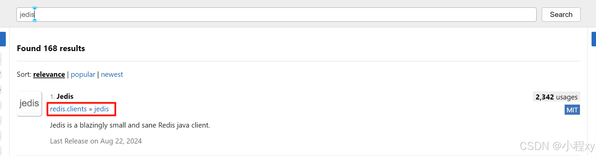
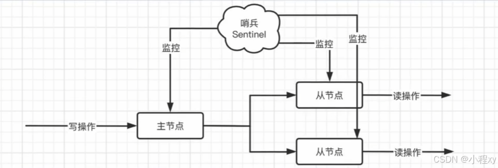

Redis 是一个开源的**内存数据库**，它支持多种数据结构，并且常用于高速缓存、会话管理、消息队列等场景。Redis 的全称是 **Remote Dictionary Server**，是一种 **key-value（键值对）存储系统**，能够以极高的性能处理大量数据的读写操作。

特点：

1. **基于内存的快速读写**：Redis 将数据存储于内存之中，这赋予了它极高的读写速度，能够满足实时数据处理以及对快速响应有严格要求的应用场景，比如在线游戏、金融交易系统等。
2. **可靠的持久化功能**：尽管 Redis 本质上是内存数据库，但它提供了完善的数据持久化机制，可以将内存中的数据保存到磁盘上。这样一来，即便遇到系统故障或重启，也能有效防止数据丢失，保障数据的完整性和可靠性。
3. **丰富多样的数据结构**：Redis 支持多种数据结构，如字符串（String）、哈希（Hash）、列表（List）、集合（Set）、有序集合（Sorted Set）等。丰富的数据结构使得 Redis 能够灵活地处理各种类型的数据，满足不同业务逻辑的需求。
4. **数据过期与自动清理**：Redis 允许为每个键值对设置过期时间，一旦达到设定的时间，对应的数据就会被自动删除。这一特性在缓存系统中尤为实用，能够自动清理过期的缓存数据，释放内存空间，提高缓存的使用效率。
5. **灵活的发布 / 订阅机制**：Redis 提供了强大的消息队列功能，通过发布 / 订阅模式，客户端可以轻松地订阅感兴趣的频道，并接收其他客户端发布到该频道的消息。这一机制在实时消息推送、分布式系统的事件通知等场景中有着广泛的应用。
6. **简单而实用的事务支持**：Redis 支持简单的事务机制，允许将多个命令组合成一个原子操作进行执行。在事务执行过程中，要么所有命令都成功执行，要么都不执行，从而保证了数据的一致性和完整性。
7. **高可用性与分布式部署**：借助 Redis Cluster 和 Sentinel 机制，Redis 能够实现高可用性和自动故障转移。在分布式环境中，它可以将数据分散存储在多个节点上，提高系统的处理能力和容错能力，确保服务的连续性和稳定性。


## 一、Redis 基本配置

Redis 的配置文件通常命名为 `redis.conf`(windows的为`redis.windows.conf`)，存放在 Redis 安装目录中。通过修改该文件，可以自定义 Redis 的各种行为。


### 1. 关键配置选项

1. **端口号**
   - **`port`**：指定 Redis 服务器监听的端口号。默认端口是 `6379`。 `port 6379`


2. **绑定地址**
   - **`bind`**：指定 Redis 只在特定的网络接口上监听。接受本地请求设置成 `bind 127.0.0.1`


3. **守护进程模式**
   - **`daemonize`**：指定 Redis 是否以守护进程的方式运行。如果设置为 `yes`，Redis 将在后台运行。默认值是 `no`。


4. **密码保护**
   - **`requirepass`**：为 Redis 设置访问密码，只有提供正确密码的客户端才能连接到 Redis 服务器。`requirepass yourpassword`


5. **RDB 快照文件**

   - **`dbfilename`**：指定 RDB 快照文件的名称。默认文件名为 `dump.rdb`。 `dbfilename dump.rdb`


   - **`dir`**：指定 RDB 快照文件的存放目录。`dir /var/lib/redis/`

默认情况下，`redis.conf` 文件位于 Redis 安装目录中。可以在启动 Redis 时指定配置文件的位置，例如：

```bash
redis-server /path/to/redis.conf
```


### 2. 启动和使用 Redis 配置

- 修改完 `redis.conf` 后，您可以通过以下命令启动 Redis：

  ```bash
  redis-server /path/to/redis.conf
  ```

- 可以通过以下命令检查 Redis 是否正确加载了配置文件：

  ```bash
  redis-cli CONFIG GET *
  ```

- 使用 AUTH 命令进行身份验证
	```
	AUTH your_password
	```


## 二、Redis 的通用命令

除了与数据结构相关的命令外，Redis 还提供了一些**通用命令**，用于管理 Redis 实例、数据操作和服务器配置。

- `DEL key`：删除键。
- `EXISTS key`：检查键是否存在。
- `EXPIRE key seconds`：为键设置过期时间。
- `KEYS pattern`：查找所有符合给定模式的键。
- `TTL key`：查看键的剩余生存时间。

```bash
DEL mykey
EXISTS mykey
EXPIRE mykey 60
KEYS *pattern*
TTL mykey
```


## 三、通过命令行控制redis

Redis 是一个高性能的键值存储系统，支持多种复杂的数据结构。这些数据结构使得 Redis 不仅可以作为简单的缓存，还能满足更多样化的数据存储需求。以下是 Redis 支持的主要数据结构：

**1. 字符串（String ）**

String 是 Redis 中最基本的数据类型，每个键**对应一个字符串类型**的值（value）。

1. **SET**：添加或修改一个键值对。例如 `SET key value`。
2. **GET**：根据键获取对应的值。例如 `GET key`。
3. **MSET**：批量添加多个键值对。例如 `MSET key1 value1 key2 value2`。
4. **MGET**：根据多个键获取多个值。例如 `MGET key1 key2`。
5. **INCR**：让一个整型的键自增1。例如 `INCR counter`。
6. **INCRBY**：让一个整型的键自增指定步长。例如 `INCRBY counter 5`。
7. **INCRBYFLOAT**：让一个浮点数的键自增指定步长。例如 `INCRBYFLOAT balance 0.5`。
8. **SETNX**：添加一个键值对，前提是这个键不存在，否则不执行。例如 `SETNX key value`。
9. **SETEX**：添加一个带有过期时间的键值对。例如 `SETEX key 60 value`（60秒后过期）。

**2. 哈希（Hash ）**

Hash 是 Redis 中的一种用于存储键值对的集合。它类似于编程语言中的哈希表或字典。一个 Hash 里可以存储多个字段和值，因此非常适合存储对象。

1. **HSET**：向 Hash 中添加一个字段和值。例如 `HSET key field value`。
2. **HGET**：获取 Hash 中某个字段的值。例如 `HGET key field`。
3. **HMSET**：批量添加多个字段和值。例如 `HMSET key field1 value1 field2 value2`。
4. **HMGET**：批量获取多个字段的值。例如 `HMGET key field1 field2`。
5. **HGETALL**：获取 Hash 中所有的字段和值。例如 `HGETALL key`。
6. **HKEYS**：获取 Hash 中的所有字段名。例如 `HKEYS key`。
7. **HVALS**：获取 Hash 中的所有值。例如 `HVALS key`。
8. **HINCRBY**：让 Hash 中某个字段的值自增指定步长。例如 `HINCRBY key field 2`。
9. **HSETNX**：向 Hash 中添加一个字段和值，前提是这个字段不存在。例如 `HSETNX key field value`。

**3. 列表（List）**

列表是一个有序的字符串集合，可以在集合的头部或尾部插入、删除元素。适合用于实现消息队列等功能。

1. **LPUSH**：在列表头部插入一个元素。例如 `LPUSH mylist "world"`。
2. **RPUSH**：在列表尾部插入一个元素。例如 `RPUSH mylist "hello"`。
3. **LPOP**：移除并返回列表的第一个元素。例如 `LPOP mylist`。
4. **RPOP**：移除并返回列表的最后一个元素。例如 `RPOP mylist`。
5. **LRANGE**：获取列表的一个子集。例如 `LRANGE mylist 0 -1`。

**4. 集合（Set）**

集合是无序的字符串集合，不允许重复元素。适合用于存储需要唯一性的集合，如标签、用户角色等。

1. **SADD**：向集合添加一个元素。例如 `SADD myset "apple"`。
2. **SREM**：移除集合中的一个元素。例如 `SREM myset "apple"`。
3. **SCARD**：返回集合中元素的个数。例如 `SCARD myset`。
4. **SMEMBERS**：获取集合中的所有元素。例如 `SMEMBERS myset`。
5. **SISMEMBER**：判断元素是否在集合中。例如 `SISMEMBER myset "apple"`。

**5. 有序集合（Sorted Set）**

有序集合类似于集合，但每个元素都会关联一个分数，元素按分数进行排序。适合用于排名、评分系统等场景。

1. **ZADD**：向有序集合添加一个元素，并设置分数。例如 `ZADD leaderboard 100 "player1"`。
2. **ZRANGE**：按索引范围获取有序集合中的元素，可以选择同时返回分数。例如 `ZRANGE leaderboard 0 -1 WITHSCORES`。
3. **ZSCORE**：获取有序集合中指定元素的分数。例如 `ZSCORE leaderboard "player1"`。
4. **ZREM**：移除有序集合中的一个元素。例如 `ZREM leaderboard "player1"`。

**6. " :  "的作用**

在 Redis 中，冒号 (`:`) 用于创建键名的层级结构，以帮助组织和管理数据。例如，`user:1000:name` 表示用户 ID 为 1000 的名字，`order:5000:status` 表示订单 ID 为 5000 的状态。使用冒号可以让数据看起来像路径一样分层，便于分类和查询。


假设你在存储用户信息和订单信息：

- `user:1000:name` -> `"Alice"`（用户 ID 为 1000 的名字）
- `user:1000:email` -> `"alice@example.com"`（用户 ID 为 1000 的电子邮件）
- `order:2000:status` -> `"shipped"`（订单 ID 为 2000 的状态）

这里，`user:` 和 `order:` 是前缀，用于区分不同类型的数据，而冒号 `:` 用于分隔不同的层级。


## 四、jedis


Jedis 是一个用于与 Redis 数据库交互的 Java 客户端库。通过 Jedis，你可以在 Java 应用程序中执行各种 Redis 操作，如增删改查等。Jedis 提供了一组简单易用的 API，使开发者可以轻松地将 Redis 集成到他们的 Java 应用程序中。

下面是jedis的基本配置和使用

1. **引入依赖**
   在 [Maven](https://mvnrepository.com/) 官网获取 Jedis 依赖，并添加到 `pom.xml` 中：
   


2. **连接 Redis**
   使用 Jedis 连接 Redis 非常简单。以下是一个基本的连接示例：
   ```java
   import redis.clients.jedis.Jedis;
   
   public class RedisExample {
       public static void main(String[] args) {
           // 创建一个 Jedis 对象，并指定 Redis 服务器的地址和端口
           Jedis jedis = new Jedis("localhost", 6379);
           // 输入密码，如果没有修改配置文件修改密码的话，不用写这个
           jedis.auth(“123456”)；
           // 设置 Redis 字符串数据
           jedis.set("mykey", "Hello, Redis!");
           // 获取并打印 Redis 字符串数据
           System.out.println("Redis 存储的字符串: " + jedis.get("mykey"));
           // 关闭 Jedis 连接
           jedis.close();
       }
   }
   ```

3. **常见操作**
   Jedis 支持 Redis 的所有基本数据结构和操作。（上面 `3、Redis 的数据结构` 中的命令 jedis 都有对应的方法）
   
   - **字符串（String）**：`jedis.set(key, value)`，`jedis.get(key)`
   - **哈希（Hash）**：`jedis.hset(key, field, value)`，`jedis.hget(key, field)`
   - **列表（List）**：`jedis.lpush(key, value)`，`jedis.lrange(key, start, end)`
   - **集合（Set）**：`jedis.sadd(key, member)`，`jedis.smembers(key)`
   - **有序集合（Sorted Set）**：`jedis.zadd(key, score, member)`，`jedis.zrange(key, start, end)`
   
4. **连接池**
	```java
	import redis.clients.jedis.Jedis;
	import redis.clients.jedis.JedisPool;
	import redis.clients.jedis.JedisPoolConfig;
	
	public class JedisConnectionFactory {
	    private static final JedisPool jedisPool;
	
	    static {
	        // 配置连接池
	        JedisPoolConfig poolConfig = new JedisPoolConfig();
	        poolConfig.setMaxTotal(8);         // 最大连接数
	        poolConfig.setMaxIdle(8);          // 最大空闲连接数
	        poolConfig.setMinIdle(0);          // 最小空闲连接数
	        poolConfig.setMaxWaitMillis(1000); // 最大等待时间
	
	        // 创建连接池对象
	        jedisPool = new JedisPool(poolConfig, 
	                                  "127.0.0.1", // Redis 主机地址
	                                  6379,              // Redis 端口号
	                                  1000,              // 超时时间
	                                  "yourPassword");         // Redis 密码
	    }
	
	    public static Jedis getJedis() {	// 通过这个方法在pool中获取jedis
	        return jedisPool.getResource();
	    }
	}
	
	```

	- `config`: `JedisPoolConfig` 配置对象，用于配置连接池参数。
	- `redisHost`: Redis 服务器的主机地址。
	- `redisPort`: Redis 服务器的端口号。
	- `2000`: 连接超时时间，单位为毫秒。
	- `redisPassword`: Redis 服务器的密码。

## 五、SpringDataRedis

Spring Data Redis 是 Spring Data 生态系统中的一个模块，提供与 Redis 的简便集成。Redis 是一个高性能的内存键值存储，Spring Data Redis 通过提供简单、一致和声明式的方式，简化了与 Redis 的交互，将低级别的 Redis 操作抽象为高级 API 和模板。

### 1、添加依赖和配置

- 添加依赖

	- spring data redis
	
	- commons pool

		

- 常见配置

	- application.yaml
	```yaml
	spring:
	  data:
	    redis:
	      # Redis 服务器的主机地址
	      host: localhost
	
	      # Redis 服务器的端口
	      port: 6379
	
	      # 配置 Redis 连接池（Lettuce 使用的连接池）
	      lettuce:
	        pool:
	          # 连接池中最大活动连接数
	          max-active: 8
	
	          # 连接池中最大空闲连接数
	          max-idle: 8
	
	          # 连接池中最小空闲连接数
	          min-idle: 0
	
	          # 连接池中最大等待时间
	          max-wait: 100ms
	
	      # Redis 数据库索引（默认为 0，Redis 默认提供 16 个数据库）
	      database: 0
	
	      # Redis 服务器的密码，用于身份验证
	      password: yourpassword
	```
	
	- 配置序列化器
	  在 `Spring Data Redis` 中，序列化和反序列化是处理 Redis 数据的关键部分。序列化是将 Java 对象转换为字节流的过程，以便存储到 Redis 中；反序列化则是将存储在 Redis 中的字节流转换回 Java 对象的过程。Spring Data Redis 提供了多种序列化和反序列化策略，可以根据具体需求进行配置。
	
    一般情况下，我们把redis的键序列化为字符串，值序列换成json格式
    
    ```java
    @Configuration
    public class RedisConfig {
    
        @Bean
        public RedisTemplate<String, Object> redisTemplate(RedisConnectionFactory connectionFactory) {
            // 创建RedisTemplate对象
            RedisTemplate<String, Object> template = new RedisTemplate<>();
    
            // 设置连接工厂
            template.setConnectionFactory(connectionFactory);
    
            // 使用 StringRedisSerializer 代替 GenericJackson2JsonRedisSerializer
            //  GenericJackson2JsonRedisSerializer jsonRedisSerializer = new GenericJackson2JsonRedisSerializer();
            StringRedisSerializer stringRedisSerializer = new StringRedisSerializer();
            GenericJackson2JsonRedisSerializer genericJackson2JsonRedisSerializer = new GenericJackson2JsonRedisSerializer();
    
            // 1. 设置key的序列化
            template.setKeySerializer(stringRedisSerializer);
            template.setHashKeySerializer(stringRedisSerializer);
    		
            // 2. 设置value的序列化
            template.setValueSerializer(genericJackson2JsonRedisSerializer);
            template.setHashValueSerializer(genericJackson2JsonRedisSerializer);
            return template;
        }
    }
    ```


### 2、对数据的操作

Spring Data Redis 提供了一组 API 用于操控 Redis 数据库。以下是一些常用的 API 及其详细说明：

1. 字符串操作 (String)

```java
// 1. 设置值
redisTemplate.opsForValue().set("key", "value");

// 2. 获取值
String value = (String) redisTemplate.opsForValue().get("key");

// 设置值（带过期时间）
redisTemplate.opsForValue().set("key", "value", Duration.ofMinutes(10));

// 删除键
redisTemplate.delete("key");
```

2. 哈希操作 (Hash)

```java
// 1. 设置哈希字段的值
redisTemplate.opsForHash().put("user:1000", "name", "Alice");
redisTemplate.opsForHash().put("user:1000", "email", "alice@example.com");

// 2. 获取哈希字段的值
String name = (String) redisTemplate.opsForHash().get("user:1000", "name");

// 3. 获取哈希的所有字段和值
Map<Object, Object> userMap = redisTemplate.opsForHash().entries("user:1000");
```

3. 列表操作 (List)

```java
// 1. 右侧推入列表
redisTemplate.opsForList().rightPush("list", "value1");
redisTemplate.opsForList().rightPush("list", "value2");

// 2. 左侧推入列表
redisTemplate.opsForList().leftPush("list", "value0");

// 3. 获取列表的所有元素
List<Object> list = redisTemplate.opsForList().range("list", 0, -1);

// 4. 弹出列表的右侧元素
Object value = redisTemplate.opsForList().rightPop("list");
```

4. 集合操作 (Set)

```java
// 添加元素到集合
redisTemplate.opsForSet().add("set", "value1", "value2");

// 获取集合的所有元素
Set<Object> set = redisTemplate.opsForSet().members("set");

// 移除集合的元素
redisTemplate.opsForSet().remove("set", "value1");
```

5. 有序集合操作 (Sorted Set)

```java
// 添加元素到有序集合
redisTemplate.opsForZSet().add("zset", "value1", 1);
redisTemplate.opsForZSet().add("zset", "value2", 2);

// 获取有序集合的所有元素
Set<Object> zset = redisTemplate.opsForZSet().range("zset", 0, -1);

// 获取有序集合的元素及其分数
Set<ZSetOperations.TypedTuple<Object>> zsetWithScores = redisTemplate.opsForZSet().rangeWithScores("zset", 0, -1);
```


### 3、RedisTemplate 和 StringRedisTemplate

1. **RedisTemplate**

`RedisTemplate` 是一个泛型类，能够处理不同类型的键和值。你可以指定键和值的序列化方式，以及 Redis 数据的类型（如 `String`, `Object`, `Hash`, `List`, `Set`, `ZSet` 等）。

主要特点：

- **泛型支持**: 它支持任意类型的键和值，不限于 `String`，可以是 `Object`、`Integer`、自定义对象等。
- **序列化方式灵活**: 通过设置不同的序列化器，可以对键和值进行序列化和反序列化。

2. **StringRedisTemplate**

`StringRedisTemplate` 是 `RedisTemplate` 的一种特化版本，它专门用于操作 `String` 类型的键和值。它默认使用 `StringRedisSerializer` 来对键和值进行序列化和反序列化，因此只处理 `String` 数据类型。

主要特点：

- **简化操作**: 专注于 `String` 类型的数据操作，不需要额外配置序列化器，适用于键和值都为 `String` 类型的场景。
- **默认序列化方式**: 内置 `StringRedisSerializer`，默认将键和值都序列化为 `String`。

| 特性                 | `RedisTemplate`                                     | `StringRedisTemplate`                          |
| -------------------- | --------------------------------------------------- | ---------------------------------------------- |
| **支持的键和值类型** | 支持任何类型（如 `String`, `Object`, `Integer` 等） | 只支持 `String` 类型的键和值                   |
| **序列化方式**       | 需要手动配置序列化器（可以选择 JSON、JDK 序列化等） | 默认使用 `StringRedisSerializer`，无需额外配置 |
| **适用场景**         | 适用于复杂的数据类型，如 `Object`、`JSON` 等。      | 适用于简单的 `String` 类型数据操作。           |


示例1：

图一是通过 `RedisTemplate` 存到 redis 中的 JSON 字符串，图二是通过 `StringRedisTemplate` 存到redis 中的 JSON 字符串，由于 `RedisTemplate` 能够实现 自动的反序列化，所以需要存储多余的 `@class` 信息，会造成内存的浪费。


示例2：

观察下图有 `@Test` 注解的代码

```java
// Uesr类
import lombok.AllArgsConstructor;
import lombok.Data;
import lombok.NoArgsConstructor;

@Data
@AllArgsConstructor
@NoArgsConstructor
public class User {
    String name;
    Integer age;
}

// 测试
@Autowired
    private RedisTemplate<String, Object> redisTemplate;

    @Autowired
    private StringRedisTemplate stringRedisTemplate;
    
@Test
    void insertUser() {
        User user = new User("world", 1);

        redisTemplate.opsForValue().set("user:1", user);    // 自动将JAVA对象序列换成JSON格式的字符串
        User myuser = (User) redisTemplate.opsForValue().get("user:1"); // 自动反序列化，将JSON格式的字符串转换成JAVA对象
        System.out.println("myuser = " + myuser);
    }

@Test
    void insertUser2() {
        User user = new User("world", 2);
        String jsonUser = JSON.toJSONString(user);  // 手动序列化成JSON格式的字符串

        stringRedisTemplate.opsForValue().set("user:1", jsonUser);
        String str = stringRedisTemplate.opsForValue().get("user:1");
        System.out.println("str = " + str);

        User myuser = JSON.parseObject(str, User.class);    // 手动从JSON格式的字符串转换成JAVA对象
        System.out.println("myuser = " + myuser);
    }
```
下面两张图分别是第一个Test和第二个Test输出的结果


通过上面图可以清楚的看到 RedisTemplate 会自动系列化JSON格式字符串和反序列化成JAVA对象，但是 StringRedisTemplate 都需要手动处理


### 4、补充fastjson2

上面用到的JSON处理库是 `fastjson2`, 可在 [maven 官网](https://mvnrepository.com/) 下载依赖

fastjson 常见用法

```java
// 将 Java 对象序列化为 JSON 字符串
String jsonString = JSON.toJSONString(user);
        
// 将 JSON 字符串反序列化为 Java 对象
User deserializedUser = JSON.parseObject(jsonString, User.class);

// 创建一个 JSONObject
JSONObject jsonObject = new JSONObject();
jsonObject.put("name", "John");
// 转换成JSON字符串
jsonObject.toString()

// 解析 JSON 字符串
String jsonString = "{\"name\":\"ld\",\"age\":18,\"city\":\"ShangHai\"}";
JSONObject parsedObject = JSONObject.parseObject(jsonString);
// 获取value, 输出 ld
System.out.println("Name: " + parsedObject.getString("name"));
```


## 六、部署模式

上面讲到的是单机部署模式，下面讲一些其他的部署模式


Redis 支持多种部署模式，分别适用于不同场景：  
- 主从复制（Master-Slave）：**数据备份与读写分离**。  (小型项目)
- 哨兵模式（Sentinel）：**高可用性管理主从结构**。  (中型项目)
- 集群模式（Cluster）：**分布式存储和负载均衡**。(大型项目)


### 1. 搭建主从复制

主从复制，是指将一台Redis服务器的数据，复制到其他的Redis服务器。前者称为主节点（Master)，后者称为从节点（Slave)，数据的复制是单向的，只能由主节点到从节点。Master以写为主，Slave以读为主。实现了读写分离，提高了性能

工作原理

1. **初次同步**：  
   从节点连接到主节点后，主节点会将当前数据库的快照（RDB 文件）发送给从节点，从节点加载到内存中。
2. **命令传播**：  
   主节点的所有写操作会以命令流的形式发送给从节点，从节点执行相同的命令保持同步。


这里以在本地启动两个不同端口的redis演示，复制redis文件夹，弄出两份redis

1. 分别修改配置文件的端口
	```bash
	port 6001
	port 6002
	# 1. 如果设置的有密码，即 requirepass 
	# 那么还需要在从节点的配置文件中添加 masterauth yourMasterPassword 或者是在redis控制台中输入 config set masterauth yourMasterPassword 
	
	# 2. 如果需要打开内网，需要设置 protected-modeno no 和 bind 0.0.0.0。（这里我们本地测试，只修改端口即可）
	
	```
2. 通过 `.\redis-server.exe .\redis.windows.conf` 启动这两个redis
3. 进入redis控制台 `.\redis-cli.exe -p 6001` 和 `.\redis-cli.exe -p 6002`
4. 可以通过 `info replication` 查看信息

5. 在 6002 的控制台输入 `replicaof 127.0.0.1 6001` ，即可把6002变成6001的从节点。
 也可以直接在从节点的配置文件中写上 `replicaof 127.0.0.1 6001`, 那样每次启动就不需要手动配置了（`replicaof no one` 用于将从节点重新变成单独的主节点）
    

最后，我们除了可以把 `6002` 弄作 `6001` 的从节点，也可以给 `6002` 弄一个（`6003`）或多个从节点，`6002` 和 `6003` 都只是可读的，这样做可以减小 `6001` 主节点同步数据时的压力，把同步数据的部分任务给到从节点 `6002`


### 2. 哨兵模式

经过之前的学习，我们发现，实际上最关键的还是主节点，因为一旦主节点出现问题，那么整个主从系统将无法写入，因此，我们得想一个办法，处理一下主节点故障的情况。`哨兵模式` 就可以解决这个问题


哨兵模式通过哨兵进程（Sentinel）监控主从节点的状态，自动完成**主节点故障转移**和通知客户端切换到新的主节点。适合需要高可用的场景。




工作原理

1. **主节点监控**：  哨兵进程周期性地通过 `PING` 检查主从节点的状态。  
2. **故障判定**：  如果主节点不可用，哨兵会启动选举流程，从从节点中选出新的主节点。  
3. **主从切换**：  
   - 选出的从节点被提升为主节点。  
   - 其他从节点重新同步到新的主节点。  
   - 当之前的主节点恢复时，会自动同步到新的主节点
4. **通知客户端**：  客户端通过哨兵获取新的主节点地址。


主从切换规则:
1.首先会根据优先级进行选择，可以在配置文件中进行配置，添加replica-priority配置项（默认是100），越小表示优先级越高。2.如果优先级一样，那就选择偏移量最大的 3.要是还选不出来，那就选择runid（启动时随机生成的）最小的。

~~哨兵可部署多台，这样不同担心哨兵节点也挂掉，下面演示 `一主一从一哨兵 ` 的部署~~


#### 2.1 搭建哨兵模式

   ```bash
   sentinel monitor mymaster <master_ip> <master_port> <quorum>
   sentinel auth-pass mymaster <password>
   ```
   - `mymaster` 是主节点的名字。
   - `<quorum>` 是判断主节点失效的最少哨兵数。如果有多个哨兵，比如3个，那么只有当 `quorum` 个哨兵认为主节点挂掉的时候才会进行选举

1. 在上面主从复制的基础上，新建一个新的节点 `6003` 在从节点 `6003` 的配置文件中添加 `port 6003` `sentinel monitor sentinel1 127.0.0.1 6001 1` 和 `sentinel auth-pass sentinel1 yourpassword`
2. 启动哨兵 `6003`， `.\redis-server.exe .\redis.windows.conf --sentinel`


此时我们尝试把主节点 `6001` 关掉

这时我们发现 `6002` 现在可以写入了，之前最为从节点不能写入数据

当我们再次启动 `6001` 时，可以看到， `6001` 直接变成了 `6002` 的从节点。
~~（这里需要注意一点，如果之前的 `6001` 配置文件中没有写 `masterauth yourmasterpassword` 的话(上面讲到的主节点的密码)，即使变成 `6002` 的从节点，也没有权限实现同步主节点的数据）~~


#### 2.2 客户端的感知

客户端感知是指客户端应用程序可以自动感知到 Redis 主从节点的变化，从而在主节点发生故障转移（Failover）时，能够自动连接到新的主节点，而无需手动配置。

这里我们用到的客户端是 `SpringDataRedis`。

```yaml
spring:
  application:
    name: learnRedis

  data:
    redis:
    ## sentinel 配置，只需要在原有的配置中添加上这个 sentinel 的配置即可
      sentinel:
        master: sentinel1 # 启动哨兵时 自己定义的主节点id
        nodes: # 填写哨兵的定制
          - localhost:6003
        password: di135790 # 哨兵的密码，如果没有密码不写
        
      host: localhost # 原本主节点的地址
      port: 6001 # 原本主节点的端口
      lettuce: # 配置 Redis 连接池（Lettuce 使用的连接池）
        pool:
          max-active: 8 # 连接池中最大活动连接数
          max-idle: 8 # 连接池中最大空闲连接数
          min-idle: 0 # 连接池中最小空闲连接数
          max-wait: 100ms # 连接池中最大等待时间
      database: 0 # Redis 数据库索引（默认为 0，Redis 默认提供 16 个数据库）
      password: di135790 # Redis 服务器的密码，用于身份验证
server:
  port: 8001
```
这里我们做测试，当 `6001` 挂掉的时候，再次访问 `/test` 可以成功加入数据，读取数据
```java
@RestController
public class TestController {

    @Autowired
    RedisTemplate redisTemplate;

    @RequestMapping("/test")
    public String test() {
        redisTemplate.opsForValue().set("test", "hello world");
        String test = (String) redisTemplate.opsForValue().get("test");
        return test;
    }
}
```


### **3. 集群模式（Cluster Mode）**

Redis 集群模式是分布式部署方式，多个节点协同存储数据，通过分片（Sharding）实现数据分布，提供**高性能**和**高扩展性**。

工作原理

1. **分片存储**：  数据通过一致性哈希分布到多个节点。Redis 使用 **16384 个槽位（hash slot）**，每个键通过 CRC16 哈希算法映射到一个槽位，再分配到具体的节点。
2. **节点角色**：  
   - 主节点：负责存储数据和处理读写请求。  
   - 从节点：同步主节点数据，作为主节点的备份。  
3. **容错机制**：  
   - 每个主节点至少有一个从节点。  
   - 主节点故障时，从节点自动升级为主节点。(当之前的主节点恢复时，成为新的主节点的从节点)

#### 3.1 搭建集群模式

这里我们弄四个redis，6001，6002，6003为集群的主节点，7001，7002，7003分别是6001，6002，6003的从节点，这样可以保证当其中一个主节点挂掉的时候，整个集群还是可用的。
（当集群中的某个主节点挂掉的时候，该主节点的从节点会提升会新的主节点，当一个分支的主节点和从节点都挂掉的时候，整个集群就不可用了）

搭建集群最少是三个主节点
1. 配置集群节点：
   ```bash
   # redis.conf
   cluster-enabled yes
   # 注意：不要手动在配置文件中指定 replicaof 127.0.0.1 6001 主从关系，我们等下启动的时候才可以指定
   ```

2. 启动多个 Redis 实例：
   ```bash
   .\redis-server.exe .\redis.windows.conf
   # 启动这四个redis
   ```

3. 创建集群：
   使用 `redis-cli` 工具：
   ```bash
   # --cluster-replicas 用来指定每个主节点的从节点个数
   redis-cli --cluster create 127.0.0.1:6001 127.0.0.1:6002 127.0.0.1:6003  127.0.0.1:7001 127.0.0.1:7002 127.0.0.1:7003 --cluster-replicas 1
   # redis-cli -p yourport flushall     如果节点中有数据，会导致创建集群失败，可以用这个命令清除一下
   # redis-cli -p yourport cluster reset hard     如果节点已经存在的集群配置，可以用这个命令重置
   ```
	
	

这里我们插入了一个数据，可以发现出现了一个error，表明这个数据被插入到了 6002的分区中。

我们启动 `redis-cli` 时加上一个` -c `的参数可以在插入到别的分区时自动切换过去。`redis-cli.exe -p 6001 -c`
`cluster nodes` 可以展示当前集群的信息

当我们把 `6001` 关掉后，会发现 `7001` 变成了主节点，而 `6001` 显示 `fail`

当我们再次启动 `6001` 时，发现 `6001` 变成了 `7001` 的从节点了


#### 3.2 客户端配置

下面是在 `application` 中的配置
```yaml
spring:
	data:
	    redis:
	      cluster:
	        nodes:
	          - localhost:6001
	          - localhost:6002
	          - localhost:6003
	          - localhost:7001
	          - localhost:7002
	          - localhost:7003
```


### 4. **模式对比**

| 模式         | 适用场景           | 优点                           | 缺点                           |
| ------------ | ------------------ | ------------------------------ | ------------------------------ |
| **主从复制** | 数据备份、读写分离 | 部署简单，读性能提高           | 主节点故障需手动切换           |
| **哨兵模式** | 高可用性需求       | 自动故障转移，通知客户端       | 部署复杂，需要多个哨兵保证稳定 |
| **集群模式** | 大规模、高并发需求 | 数据分片，自动扩展，容错能力强 | 部署复杂，不支持多键事务       |

## 七、分布式锁

在我们的传统单体应用中，经常会用到锁机制，目的是为了防止多线程竞争导致的并发问题，但是现在我们在分布式环境下，可能一条链路上有很多的应用，它们都是独立运行的，这时我们就可以借助Redis来实现分布式锁。

为什么不能用java的锁？
因为 Java 的锁机制是进程内的，仅在单个 JVM 内有效。如果分布式系统的多个节点运行在不同的 JVM 中，这些锁无法相互感知。


使用 Redis 的 **键值对**（Key-Value）存储功能，将一个唯一的锁标识作为键（Key），通过特定的操作确保这个键在某一时间内只能由一个客户端持有。

### 1. **基础实现**

使用 Redis 的 `SET` 命令（**原子性**）：
```shell
SET lock_key unique_value NX PX 10000
```

- **`lock_key`**：锁的键名，用于标识这把锁。
- **`unique_value`**：锁的唯一标识，用于区分不同客户端（如使用 UUID 或线程标识）。
- **`NX`**： Redis 的一个选项，常用在 SET 命令中，用于确保只有在键不存在时才会设置键值。key不存在时才能插入成功
- **`PX 10000`**：设置键的过期时间为 10 秒，防止因客户端崩溃导致锁永远不释放。

返回值：成功：`OK`（表示加锁成功）。失败：`null`（表示锁已经被其他客户端持有）。


2. **释放锁**

释放锁时需要确保只释放自己加的锁，这通过检查 `unique_value` 是否匹配来实现。

1. 检查锁的值是否匹配 `unique_value`。
2. 匹配成功：删除锁。
3. 匹配失败：不操作，防止误删他人持有的锁。


### 2. **加锁时的关键问题**

1. **锁过期问题**：如果客户端在持有锁期间崩溃，锁会因为设置的过期时间自动释放，其他客户端可以继续尝试获取锁。

2. **锁超时**

如果业务逻辑执行时间超过锁的过期时间，可能导致锁过期后其他客户端误获得锁。这种情况下可以：
- **延长锁时间**：通过定期续约（如 Redisson 实现）。
- **保证业务执行时间小于锁的过期时间**：尽量避免锁超时问题。

3. **误删他人锁**

- 使用 `unique_value` 作为锁的标识，可以避免误删其他客户端的锁。
- 仅在 `unique_value` 匹配的情况下，才删除锁。


实际上本质还是因为锁的超时时间不太好衡量，如果超时时间能够设定地比较恰当，那么就可以避免这种问题了。（Redisson实现了分布式锁）


## 八、**Redisson**


[Redisson](https://github.com/redisson/redisson) 是一个基于 Redis 的 Java 客户端，提供了丰富的分布式工具（如分布式锁、分布式集合、分布式缓存等）。相比于手动实现 Redis 操作，Redisson 封装了很多复杂逻辑（如锁的自动续期、分布式状态管理），使用简单且可靠。


### 1. Redission实现方式和使用场景

- `SET key value NX PX`：原子性地设置键值对，用于加锁。

- **Lua 脚本**：确保释放锁的原子性。

- **Watchdog 机制**：自动续期锁的持有时间，防止锁因超时被意外释放。（获取锁后，Redisson 启动一个后台线程（Watchdog），每隔一段时间（默认每 10 秒，约为锁过期时间的 1/3）检查锁是否仍被持有。）


Redisson 的常见使用场景

1. **分布式锁**（可重入锁、公平锁、读写锁等）。
2. **分布式集合**（Set、List、Map、Queue 等）。
3. **分布式对象**（AtomicLong、Semaphore、CountDownLatch 等）。
4. **分布式缓存**（基于 Redis 的缓存解决方案）。
5. **消息队列**（基于 Redis 的 Pub/Sub 或延迟队列）。
6. **布隆过滤器**：内置布隆过滤器


### 2. 添加依赖和配置

这里我们用的是 Spring-Redission，配置起来更方便，也有纯Java客户端的Redission

在 Maven 项目中添加 Redisson 依赖：

```xml
<dependency>
    <groupId>org.redisson</groupId>
    <artifactId>redisson-spring-boot-starter</artifactId>
    <version>3.41.0</version>
</dependency>
```

```java
@Configuration
public class RedissonConfig {

    @Bean	// 初始化一个 Redission
    public RedissonClient redissonClient() {
        Config config = new Config();
        config.useSingleServer()
                .setAddress("redis://127.0.0.1:6379") // Redis 地址
                .setPassword("di135790") // 如果有密码，填写
                .setDatabase(0);   // 使用的数据库
        return Redisson.create(config);
    }

    @Bean	// 布隆过滤器
    public RBloomFilter<String> shareIdBloomFilter(RedissonClient redissonClient) {
        RBloomFilter<String> bloomFilter = redissonClient.getBloomFilter("shareIdBloom");
        bloomFilter.tryInit(1000000L, 0.01);
        return bloomFilter;
    }
    
    @Bean	// 初始化一把分布式锁
    public RLock testLock(RedissonClient redissonClient) {
        return redissonClient.getLock("testLock");
    }
    
    @Bean	// 初始化一把读写锁
    public RReadWriteLock testReadLock(RedissonClient redissonClient) {
        return redissonClient.getReadWriteLock("testReadLock");
    }
}
```

实现布隆过滤器示例：

```java
@RestController
@RequiredArgsConstructor
public class ShareFile {

    private final RBloomFilter<String> shareIdBloomFilter;

    @GetMapping("/save")
    public String ShareFile(@RequestParam String shareId) {
        System.out.println(shareId);
        shareIdBloomFilter.add(shareId);
        return "ok";
    }
}
```

```java
@RestController
@RequiredArgsConstructor
public class GetShareFile {

    private final RBloomFilter<String> shareIdBloomFilter;

    @GetMapping("/get")
    public String getShareFile(@RequestParam String shareId) {
        System.out.println(shareId);
        boolean contains = shareIdBloomFilter.contains(shareId);
        System.out.println(contains);
        return String.valueOf(contains);
    }
}
```


### 3. 常用功能示例

#### 3.1 **分布式锁**

Redisson 提供多种分布式锁类型：普通锁、可重入锁、公平锁、读写锁等。这里我们可以使用 Redisson提供的分布式锁 来实现对共享资源的访问，我们不需要怎么控制解锁的时间，它会自动续期。

1. **普通分布式锁**：（注：`testLock` 是上面通过 `@Bean` 注册的）

```java
// 阻塞获取锁，持有 10 秒
testLock.lock(10, TimeUnit.SECONDS);
testLock.unlock();

// 尝试加锁（带超时）
try {
    // 等待锁最多5秒，持有锁最多10秒
    testLock.tryLock(3, 2, TimeUnit.SECONDS);
} catch (InterruptedException e) {
    throw new RuntimeException(e);
} finally {
    testLock.unlock();
}
```


2  **读写锁**

读写锁允许多个读操作并发执行，但写操作是独占的。

```java
try {
    // 读锁
    testReadLock.readLock().tryLock(5, 10, TimeUnit.SECONDS);
} catch (InterruptedException e) {
    throw new RuntimeException(e);
} finally {
    testReadLock.readLock().unlock();
}


try {
    // 写锁
    testReadLock.writeLock().tryLock(5, 10, TimeUnit.SECONDS);
} catch (InterruptedException e) {
    throw new RuntimeException(e);
} finally {
    testReadLock.writeLock().unlock();
}
```

