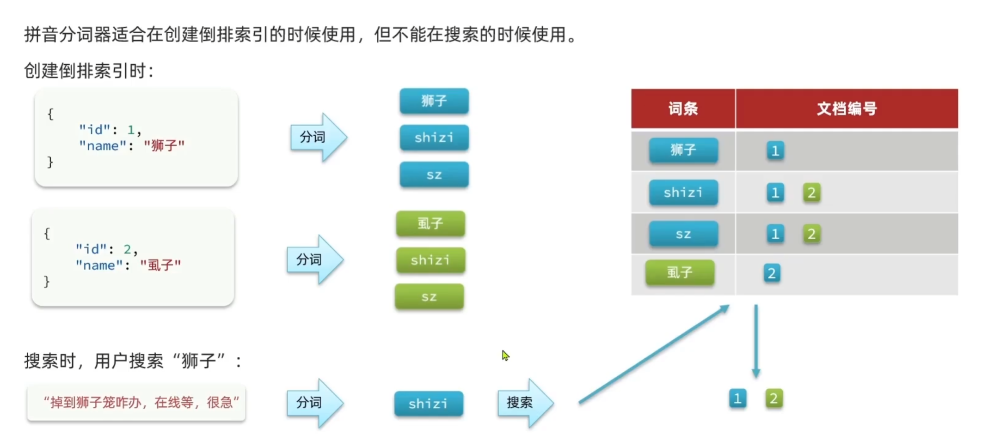

Elasticsearch（ES） 是基于 **倒排索引（Inverted Index）** 构建的 **分布式搜索引擎**，用于 **全文检索**、**日志分析** 和 **大数据查询**。它利用倒排索引大幅提升查询速度，使得对海量数据的搜索变得高效且可扩展。


### 一、基本概念

#### 1. 倒排索引

**倒排索引** 是一种高效的数据结构。它的核心思想是 **建立从“关键词”到“文档集合”之间的映射关系**，从而加快搜索速度。

1. 正排索引 vs 倒排索引

**正排索引（Forward Index）**：按照 **文档 ID** 组织数据，每篇文档存储它包含的所有关键词。

**倒排索引（Inverted Index）**：按照 **关键词** 组织数据，每个关键词对应包含该关键词的所有文档。

2. 倒排索引的组成：

   - **词典（Dictionary）**：存储所有出现过的关键词（Term）。

   - **倒排列表（Posting List）**：记录包含该关键词的所有文档 ID 以及位置信息。

3. 创建倒排索引

- 将每一个文档的数据利用算法分词，得到一个个词条

- 创建表，每行数据包括词条、词条所在文档id、位置等信息

- 因为词条唯一性，可以给词条创建索引，例如hash表结构索引

#### 2. ES相关概念

| 概念                 | 说明                                                         |
| -------------------- | ------------------------------------------------------------ |
| **Index（索引）**    | 存储相同类型的文档的集合，类似于数据库中的 "库"              |
| **Mapping**（映射）  | 用于定义索引中字段的**数据结构**和**数据类型**的方式，对字段的约束 |
| **Document（文档）** | 存储的基本单元，类似数据库中的一条记录（Row）。              |
| **Shard（分片）**    | 将索引拆分为多个小块，每个 Shard 负责存储部分数据，提高性能和扩展性。 |


#### 3. 安装elasticsearch和kibana

1. elasticsearch

```bash
// 拉取elasticsearch镜像	http://localhost:9200/
docker pull docker.elastic.co/elasticsearch/elasticsearch:8.6.2

sudo docker run -d --name elasticsearch \
  -p 9200:9200 -p 9300:9300 \
  -e "discovery.type=single-node" \
  -e "xpack.security.enabled=false" \
  docker.elastic.co/elasticsearch/elasticsearch:8.6.2
```

2. kibana

Kibana 是一个 **开源的数据可视化和管理工具**，主要用于 **Elasticsearch** 数据的可视化、分析和管理。我们一般通过它的 dev tools 编写语句操控elasticsearch

```bash
// 拉取kibana镜像    http://localhost:5601/
docker pull docker.elastic.co/kibana/kibana:8.6.2

sudo docker run -d --name kibana \
  -p 5601:5601 \
  --link elasticsearch:elasticsearch \
  docker.elastic.co/kibana/kibana:8.6.2
```


#### 4. es中的常见分词器

1. standard（标准分词器）： ES 默认的分词器，按照 Unicode 文本分隔规则拆分单词（会移除标点符号），自动转换文本为小写，并且过滤掉常见的停用词（如 "the", "and"）

2. simple（简单分词器）：按非字母字符（如空格、数字、标点符号）拆分文本，并转换为小写。
3. keyword（关键字分词器）：不进行分词，整个文本作为一个词项（Term），适用于精确匹配场景，如 ID、URL、标签等字段。

上面这些分词器更多是针对英语，比如标准分词器对于汉语的一句话不会进行分词，比如：我今天很开心，分词后还是 我今天很开心。

下面安装对中文分词支持比较好的分词器


#### 5. 安装ki分词器

ik分词器可以对中文进行分词，Elasticsearch 在存储数据时会利用**分词结果**创建**倒排索引**，其中它有两种工作模式：

1. **`ik_max_word`（最大切分）**
   - 会把句子尽可能多地拆分成词，比如 `"中国科学院"` → `["中国", "中华", "科学", "科学院", "学院"]`。
   
   - 适用于 **搜索匹配更全面** 的场景。
   
2. **`ik_smart`（最少切分）**

   - 只进行最基本的切分，比如 `"中国科学院"` → `["中国科学院"]`。

   - 适用于 **查询效率更高** 的场景。

```bash
// 下载ki 
// 先手动在浏览器下载对应的zip,   https://release.infinilabs.com/analysis-ik/stable/
sudo docker cp ~/Downloads/elasticsearch-analysis-ik-8.6.2.zip elasticsearch:/tmp

sudo docker exec -it --user root elasticsearch /bin/bash
cd /tmp
unzip elasticsearch-analysis-ik-8.6.2.zip -d ik
mv ik /usr/share/elasticsearch/plugins/

chown -R elasticsearch:elasticsearch /usr/share/elasticsearch/plugins/ik

exit
sudo docker restart elasticsearch

// 查看是否成功
curl -X GET "http://localhost:9200/_cat/plugins?v"
```

4. 添加和删除分词

```bash
// 添加和删除 词
vim IKAnalyzer.cfg.xml
ext.dic  stopword.dic
```


### 二、对索引的操作

```bash
// 1. 创建带 Mapping 的索引
PUT my_index
{
  "mappings": {
    "properties": {
      "name": {
        "type": "text"
      },
      "age": {
        "type": "integer"
      },
      "created_at": {
        "type": "date",
        "format": "yyyy-MM-dd HH:mm:ss"
      }
    }
  }
}

// 2. 查看某个索引的详细信息
GET my_index

// 3. 查看 Mapping 结构
GET my_index/_mapping

// 4. 删除索引
DELETE my_index
```


### 三、对文档的操作

```bash
// 1. 插入（新增）文档
POST my_index/_doc/1
{
  "name": "张三",
  "age": 25,
  "created_at": "2025-03-15 10:30:00"
}

// 2. 获取文档
GET my_index/_doc/1

// 3. 删除文档
DELETE my_index/_doc/1

// 4. 更新文档
POST my_index/_update/1
{
  "doc": {
    "age": 26
  }
}
// 4. 更新文档 （先删除id为1的，然后重新插入）
put my_index/_doc/1
```


### 四、查询语句

#### 1. 基本查询

```bash
// 1. 可以返回索引中的所有文档
GET products/_search
{
    "query": {
        "match_all": {}
    }
}

// 2. 查找名称中包含 “手表” 的产品
GET products/_search
{
    "query": {
        "match": {
            "name": "手表"
        }
    }
}

// 3. name 和 description 字段中同时搜索包含 “无线” 的产品
GET products/_search
{
    "query": {
        "multi_match": {
            "query": "无线",
            "fields": ["name", "description"]
        }
    }
}

// 4. 查找 id 为 3 的产品
GET products/_search
{
    "query": {
        "term": {
            "id": "3"
        }
    }
}

// 5. 查找 id 为 3 或 4 的产品
GET products/_search
{
    "query": {
        "terms": {
            "id": ["3", "4"]
        }
    }
}
```


#### 2. 多条件、范围、过滤字段查询

```bash
// 1. 查找名称中包含 “耳机” 且价格小于 300 的产品
GET products/_search
{
    "query": {
        "bool": {
            "must": [	// must 相当于 与；should相当于 或； must_not 非，不参与算分； filter 相当于 与，但不参与算分
                {
                    "match": {
                        "name": "耳机"
                    }
                },
                {
                    "range": {
                        "price": {
                            "lt": 300
                        }
                    }
                }
            ]
        }
    }
}

// 2. 查找价格在 200 到 500 之间的产品
GET products/_search
{
    "query": {
        "range": {
            "price": {
                "gte": 200,
                "lte": 500
            }
        }
    }
}

// 3. 使用 _source 字段指定要返回的字段
GET products/_search
{
    "query": {
        "match_all": {}
    },
    "_source": ["name", "price"]
}
```


#### 3. 排序查询

```bash
// 排序查询，默认是按照权重分排序
GET products/_search
{
    "query": {
        "match_all": {}   // 使用 match_all 查询表示查询 products 索引中的所有文档
    },
    "sort": [             // 排序的关键字，它是一个数组，可以包含多个排序规则。
        {
            "price": {    // 按照 price 字段进行升序排序
                "order": "asc"
            }
        }
    ]
}
```


#### 4. 分页查询

```bash
// 使用 from 和 size 参数实现分页,from + size 不能超过 10000
GET products/_search
{
    "query": {
        "match_all": {}	// 查询所有文档
    },
    "from": 2,			// 从下标为2的记录开始返回,下标从0开始
    "size": 2			// 一页的大小为2
}
```


#### 5. 聚合查询

1.  按单个字段分组并统计文档数量

```bash
// 按 price 字段分组并计算每组的平均价格
GET products/_search
{
    "size": 0,  // 不返回文档本身，只返回聚合结果
    "aggs": {	// 分组的关键字
        "group_price": { 			// 是自定义的聚合名称，可随意命名
            "terms": {   			// 属于聚合类型，用于按指定字段的值进行分组
                "field": "price"	// 按 price 字段进行分组。
            }
        }
    }
}


```

2. 按单个字段分组并计算聚合指标

```bash
GET products/_search
{
    "size": 0,	// 不返回文档本身，只返回聚合结果
    "aggs": {
        "group_id": {
            "terms": {
                "field": "id"
            },
            "aggs": {	// 聚合的关键字
                "avg_price": {	// 聚合名
                    "avg": {	// 求 price 的平均值
                        "field": "price"
                    }
                }
            }
        }
    }
}
```

3. 多字段嵌套分组

```bash
GET products/_search
{
    "size": 0,	// 不返回文档本身，只返回聚合结果
    "aggs": {
        "id_groups": {
            "terms": {
                "field": "id"
            },
            "aggs": {
                "price_groups": {
                    "terms": {
                        "field": "price"
                    }
                }
            }
        }
    }
}
```

4. 范围分组

```bash
GET products/_search
{
    "size": 0,
    "aggs": {
        "price_ranges": {
            "range": {
                "field": "price",
                "ranges": [
                    { "to": 200 },
                    { "from": 200, "to": 500 },
                    { "from": 500 }
                ]
            }
        }
    }
}
```

#### 6. `高亮`查询

```bash
GET /test/_search
{
  "query": {
    "match": {
      "address": "西湖"
    }
  },
  "highlight": {
    "fields": {
      "address": {
        "require_field_match": "false"
      }
    }
  }
}
```


### 五、SpringBoot中使用ES

#### 1. 依赖和配置

```xml
<dependency>
    <groupId>org.springframework.boot</groupId>
    <artifactId>spring-boot-starter-data-elasticsearch</artifactId>
</dependency>
```

```properties
spring.elasticsearch.uris=http://192.168.176.128:9200

spring.elasticsearch.connection-timeout=1s
spring.elasticsearch.socket-timeout=5s
```


#### 2. 测试代码

```java
@Data
@AllArgsConstructor
@NoArgsConstructor
@Document(indexName = "products") // 指定索引名称
public class Product {
    @Id
    private String id;

    @Field(type = FieldType.Text)
    private String name;

    @Field(type = FieldType.Text)
    private String description;

    @Field(type = FieldType.Double)
    private Double price;
}
```

```java
public interface ProductMapper extends ElasticsearchRepository<Product, String> {

}
```

```java
public interface ProductService {
    Product save(Product product);

    void delete(String id);

    Product findById(String id);

}
```

```java
@Service
public class ProductServiceImpl implements ProductService{
    @Autowired
    private ProductRepository productRepository;

    @Override
    public Product save(Product product) {
        return productRepository.save(product);
    }

    @Override
    public void delete(String id) {
        productRepository.deleteById(id);
    }

    @Override
    public Product findById(String id) {
        return productRepository.findById(id).orElse(null);
    }
}
```

```java
package com.es.learnes.controller;

import com.es.learnes.pojo.Product;
import com.es.learnes.service.ProductService;
import org.springframework.beans.factory.annotation.Autowired;
import org.springframework.web.bind.annotation.*;

@RestController
@RequestMapping("/api/products")
public class ProductController {

    @Autowired
    private ProductService productService;

    @PostMapping
    public Product create(@RequestBody Product product) {
        return productService.save(product);
    }

    @GetMapping("/{id}")
    public Product getById(@PathVariable String id) {
        return productService.findById(id);
    }

    @DeleteMapping("/{id}")
    public void delete(@PathVariable String id) {
        productService.delete(id);
    }
}
```


### 六、提示单词

#### 1. 安装`pinyin`分词器

```bash
// 先下载对应pinyin分词器的压缩包	https://release.infinilabs.com/analysis-pinyin/stable/
sudo docker cp ~/Downloads/elasticsearch-analysis-pinyin-8.6.2.zip elasticsearch:/tmp
sudo docker exec -it --user root elasticsearch /bin/bash
cd /tmp

unzip elasticsearch-analysis-pinyin-8.6.2.zip -d pinyin
mv pinyin /usr/share/elasticsearch/plugins/

chown -R elasticsearch:elasticsearch /usr/share/elasticsearch/plugins/pinyin
sudo docker restart elasticsearch
curl -X GET "http://localhost:9200/_cat/plugins?v"
```

```bash
// 在dev tools中测试
POST /_analyze
{
  "text": ["如家酒店还不错"],
  "analyzer": "pinyin"
}
```

目前的pinyin分词器只能对每个汉字转成拼音和整个语句转成拼音，然后形成倒排索引，还不能实现对中文词汇转成拼音


#### 2. 分词器的组成

Elasticsearch 中的 **分词器（Analyzer）** 是用于处理全文搜索的核心组件，它负责将文本拆分成更小的单元（即 **词项 tokens**），以便存储和搜索。分词器的组成一般包括下面三个部分。

| 组件                                | 作用                                                        | 示例                                                         |
| ----------------------------------- | ----------------------------------------------------------- | ------------------------------------------------------------ |
| **字符过滤器（Character Filters）** | 在分词前对文本进行预处理，如去除 HTML 标签、替换emoji字符等 | 把 `<br>` 替换成 `\n`，😊换成开心                             |
| **分词器（Tokenizer）**             | 将文本拆分成独立的词元（Tokens）                            | 把 `"I love Elasticsearch"` 拆分成 `["I", "love", "Elasticsearch"]` |
| **词元过滤器（Token Filters）**     | 在分词后处理词元，如大小写转换、删除停用词、词干提取等      | 把 `["Running"]` 转换成 `["run"]`                            |

1. 自定义分词器

```bash
PUT /test
{
  "settings": {
    "analysis": {
      "analyzer": {
        "my_analyzer": {	// 自定义分词器
          "type": "custom",
          "tokenizer": "ik_max_word",	// Tokenizer使用 ik 分词器
          "filter": "py"				// Token Filters使用 pinyin 分词器
        }
      },
      "filter": {
        "py": {
          "type": "pinyin",
          "keep_full_pinyin": false,
          "keep_joined_full_pinyin": true,
          "keep_original": true,
          "limit_first_letter_length": 16,
          "remove_duplicated_term": true,
          "none_chinese_pinyin_tokenize": false
        }
      }
    }
  },
  
  "mappings": {
    "properties": {
      "name" : {
        "type": "text",
        "analyzer": "my_analyzer",			// 决定文档在存储时如何分词
        "search_analyzer": "ik_smart"		// 决定查询时如何对输入的搜索词进行分词
      }
    }
  }
}
```

在上面代码中，我们设置了查询时的分词器，如果没有单独设置 `search_analyzer` ，默认使用的是 `my_analyzer`，那么 会导致汉字时出现字义不匹配的情况，如下，搜索狮子相关的，会出现虱子




#### 3. 实现根据关键词`补全功能`

示例：

```bash
POST /test2/_doc/1
{
  "name": ["华为", "手机"]
}


POST /test2/_doc/2
{
  "name": ["华为", "笔记本"]
}

POST /test2/_doc/3
{
  "name": ["小米", "手机"]
}

POST /test2/_doc/4
{
  "name": ["小米", "好手机"]
}

POST /test2/_search
{
  "suggest": {
    "name_suggest": {
      "text": "手机", 
      "completion": {
        "field": "name",
        "skip_duplicates" : true,	// 跳过重复的
        "size" : 10					// 返回前10条
      }
    }
  }
}
```


实现 all 字段 和 suggestion 字段

copy_to 在索引时将源字段（例如 name）的原始值复制到目标字段（例如 suggestion）。复制的值会经过**目标字段的分析器（analyzer）**处理，而不是源字段的分析器。搜索时，使用的分词器是目标字段的 analyzer 或 search_analyzer（如果定义了 search_analyzer），而不是源字段的。

```bash
PUT /test
{
  "settings": {
    "analysis": {
      "analyzer": {
        "text_analyzer": {
          "type": "custom",
          "tokenizer": "ik_max_word",
          "filter": ["py"]
        },
        "keyword_analyzer": {
          "type": "custom",
          "tokenizer": "keyword",
          "filter": ["py"]
        },
        "completion_analyzer": {
          "type": "custom",
          "tokenizer": "keyword",
          "filter": ["py"]
        }
      },
      "filter": {
        "py": {
          "type": "pinyin",
          "keep_full_pinyin": false,
          "keep_joined_full_pinyin": true,
          "keep_original": true,
          "limit_first_letter_length": 16,
          "remove_duplicated_term": true,
          "none_chinese_pinyin_tokenize": false
        }
      }
    }
  },
  
  "mappings": {
    "properties": {
      "name": {
        "type": "text",
        "analyzer": "keyword_analyzer",
        "search_analyzer": "ik_smart",
        "copy_to": ["all", "suggestion"]
      },
      "entend": {
        "type": "text",
        "analyzer": "keyword_analyzer",
        "search_analyzer": "ik_smart",
        "copy_to": ["all", "suggestion"]
      },
      "address": {
        "type": "text",
        "analyzer": "text_analyzer",
        "search_analyzer": "ik_smart",
        "copy_to": ["all", "suggestion"]
      },
      "age": {
        "type": "integer"
      },
      "self_intro": {
        "type": "text",
        "analyzer": "text_analyzer",
        "search_analyzer": "ik_smart",
        "copy_to": ["all"]
      },
      "all": {
        "type": "text",
        "analyzer": "text_analyzer",
        "search_analyzer": "ik_smart"
      },
      "suggestion": {
        "type": "completion",
        "analyzer": "completion_analyzer",
        "search_analyzer": "keyword"
      }
    }
  }
}
```


### 七、数据同步问题

#### 1. 常见的同步方式

1. 应用程序主动同步（代码层面）：应用层处理逻辑，每次对 MySQL 进行增、删、改时，同时更新 ES。

实现方式：

- 在 写 MySQL 时，同时写 ES。

- 通过 **消息队列（MQ）**异步同步。


2. 通过 MySQL Binlog 实时同步

监听 MySQL **二进制日志（Binlog）**，把数据变更（增、删、改）同步到 ES。

**实现方式：**

- **Canal**（阿里巴巴开源工具）：模拟 MySQL 复制，解析 Binlog 并推送到 ES。
- **Debezium**（Kafka 生态）：监听 Binlog，并通过 Kafka 推送到 ES。


### 八、集群部署

单机的elasticsearch做数据存储，必然面临两个问题：海量数据存储问题、单点故障问题。集群模式部署可以解决这两个问题。

- 海量数据存储问题：将索引库从逻辑上拆分为N个分片（shard），存储到多个节点
- 单点故障问题：将分片数据在不同节点备份（replica）索引库


#### 1. 集群部署

下面使用docker来集群部署，首先创建 `docker-compose.yml` 文件

```bash
version: '3'
services:
  es01:
    image: docker.elastic.co/elasticsearch/elasticsearch:8.6.2
    container_name: es01
    environment:
      - node.name=es01
      - cluster.name=es-cluster
      - discovery.seed_hosts=es02,es03
      - cluster.initial_master_nodes=es01,es02,es03
      - bootstrap.memory_lock=true
      - "ES_JAVA_OPTS=-Xms512m -Xmx512m"
      - xpack.security.enabled=false
    ulimits:
      memlock:
        soft: -1
        hard: -1
    volumes:
      - esdata01:/usr/share/elasticsearch/data
    ports:
      - "9200:9200"
    networks:
      - esnet

  es02:
    image: docker.elastic.co/elasticsearch/elasticsearch:8.6.2
    container_name: es02
    environment:
      - node.name=es02
      - cluster.name=es-cluster
      - discovery.seed_hosts=es01,es03
      - cluster.initial_master_nodes=es01,es02,es03
      - bootstrap.memory_lock=true
      - "ES_JAVA_OPTS=-Xms512m -Xmx512m"
      - xpack.security.enabled=false
    ulimits:
      memlock:
        soft: -1
        hard: -1
    volumes:
      - esdata02:/usr/share/elasticsearch/data
    networks:
      - esnet

  es03:
    image: docker.elastic.co/elasticsearch/elasticsearch:8.6.2
    container_name: es03
    environment:
      - node.name=es03
      - cluster.name=es-cluster
      - discovery.seed_hosts=es01,es02
      - cluster.initial_master_nodes=es01,es02,es03
      - bootstrap.memory_lock=true
      - "ES_JAVA_OPTS=-Xms512m -Xmx512m"
      - xpack.security.enabled=false
    ulimits:
      memlock:
        soft: -1
        hard: -1
    volumes:
      - esdata03:/usr/share/elasticsearch/data
    networks:
      - esnet

volumes:
  esdata01:
    driver: local
  esdata02:
    driver: local
  esdata03:
    driver: local

networks:
  esnet:

```

修改容量

```bash
sudo sysctl -w vm.max_map_count=262144
echo "vm.max_map_count=262144" | sudo tee -a /etc/sysctl.conf
sudo sysctl -p
```

```bash
// 如果之前开启的有，先关掉
docker-compose down
// 开启
docker-compose up -d
docker ps
curl -X GET http://localhost:9200
```


#### 2. 监控集群

```bash
// 下载并启动 Cerebro 
docker run -d --name cerebro -p 9000:9000 yannart/cerebro

// 访问 localhost:9000

// 可以通过 Cerebro 或 kinana创建集群式的索引，一般指定分片数量跟集群数量相同，备份数量为1
// 分片数量创建后不可修改，因为数据插入到不同分片时，根据的是切片数量，搜索时也是，修改的话之前的数据讲搜索不到
```


#### 3. 节点种类

Elasticsearch **默认情况下，每个节点都可以担任所有角色**，但在大型集群中，我们通常会**划分不同类型的节点**。


1. 主节点：负责 **集群管理**（创建/删除索引、跟踪节点状态、分配分片）。选举出的 **主节点** 负责整个集群的**健康管理**。

一般主节点不要用来存储数据，防止性能受影响！


2. 数据节点：负责 **存储索引数据**，执行**CRUD 操作**。参与 **搜索、聚合计算**，负担大部分计算任务。

数据节点应该有：**高 I/O 硬盘（SSD）**，**足够的 RAM**（推荐 heap_size ≈ 50% 总内存）


3. 协调节点：负责**负载均衡**，处理**用户的 REST API 请求**。把查询**分发到数据节点**，合并结果并返回。

协调节点 **不存储数据**，也**不是主节点**。适用于**大规模查询场景**，可以减轻其他节点的压力。


4. 冷存储节点：**Hot（热）节点**：存储最新、常查询的数据。**Warm（温）节点**：存储较旧数据，查询较少。**Cold（冷）节点**：存储**归档数据**，极少查询。

适合使用**廉价磁盘（HDD）**。主要用于 **归档数据**，访问速度较慢。


#### 4. 脑裂

**脑裂** 是指集群因主节点选举问题而出现多个主节点，导致数据不一致或丢失的情况。

预防脑裂：

1. Elasticsearch **默认**使用“**多数派（Quorum）机制**”来选举主节点，当至少有一半以上的可用节点，才能继续选主节点，否则集群会停止。
2. 通过 `discovery.seed_hosts` 让节点互相发现，如果不配置，节点可能会自己单独运行，无法形成集群，进而增加脑裂风险！

3. 通过 `gateway.recover_after_nodes` 设置最小启动节点，这样，单个节点不会因为误以为自己是唯一的存活节点，而错误地恢复数据！
4. 通过 `cluster.routing.allocation.enable=none` 暂停分片恢复，这样可以避免不必要的分片移动，导致数据混乱！


#### 5. 故障转移

如果主节点挂了，但还有其他合格的主节点候选者，集群会重新选举一个新的主节点。

某个数据节点宕机后，集群可能会变成 **黄色状态（Yellow）**，意味着部分分片不再有副本，但数据仍然可以读取。**Elasticsearch 会自动将故障节点上的分片迁移到正常节点上**。当故障节点恢复时，分片重新迁移回去。


