1. ​	

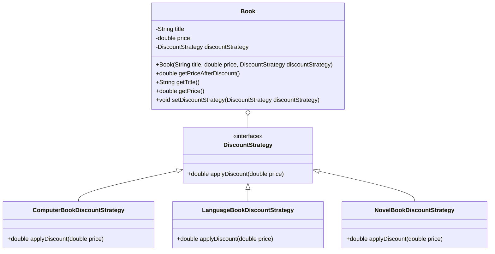

2. 

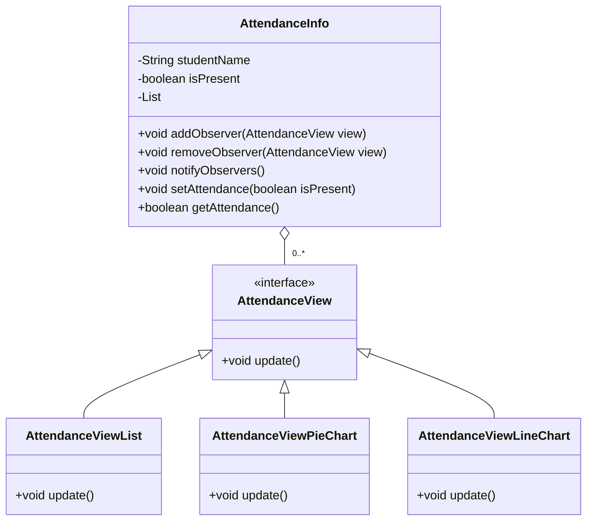

```java
import java.util.ArrayList;
import java.util.List;

// 被观察者（考勤信息）
class AttendanceInfo {
    private List<AttendanceView> observers = new ArrayList<>();
    private boolean isPresent;

    public void addObserver(AttendanceView view) {
        observers.add(view);
    }

    public void removeObserver(AttendanceView view) {
        observers.remove(view);
    }

    public void notifyObservers() {
        for (AttendanceView view : observers) {
            view.update();
        }
    }

    public void setAttendance(boolean isPresent) {
        this.isPresent = isPresent;
        notifyObservers();  // 通知所有观察者更新
    }

    public boolean getAttendance() {
        return isPresent;
    }
}

// 观察者接口
interface AttendanceView {
    void update();
}

// 具体观察者1 - 列表显示
class AttendanceViewList implements AttendanceView {
    @Override
    public void update() {
        System.out.println("Attendance updated in List View");
    }
}

// 具体观察者2 - 饼图显示
class AttendanceViewPieChart implements AttendanceView {
    @Override
    public void update() {
        System.out.println("Attendance updated in Pie Chart View");
    }
}

// 具体观察者3 - 折线图显示
class AttendanceViewLineChart implements AttendanceView {
    @Override
    public void update() {
        System.out.println("Attendance updated in Line Chart View");
    }
}

// 测试类
public class ObserverPatternDemo {
    public static void main(String[] args) {
        // 创建被观察者
        AttendanceInfo attendanceInfo = new AttendanceInfo();

        // 创建观察者
        AttendanceView listView = new AttendanceViewList();
        AttendanceView pieChartView = new AttendanceViewPieChart();
        AttendanceView lineChartView = new AttendanceViewLineChart();

        // 注册观察者
        attendanceInfo.addObserver(listView);
        attendanceInfo.addObserver(pieChartView);
        attendanceInfo.addObserver(lineChartView);

        attendanceInfo.setAttendance(true);
        attendanceInfo.removeObserver(pieChartView);
        attendanceInfo.setAttendance(false);
    }
}
```

3. 

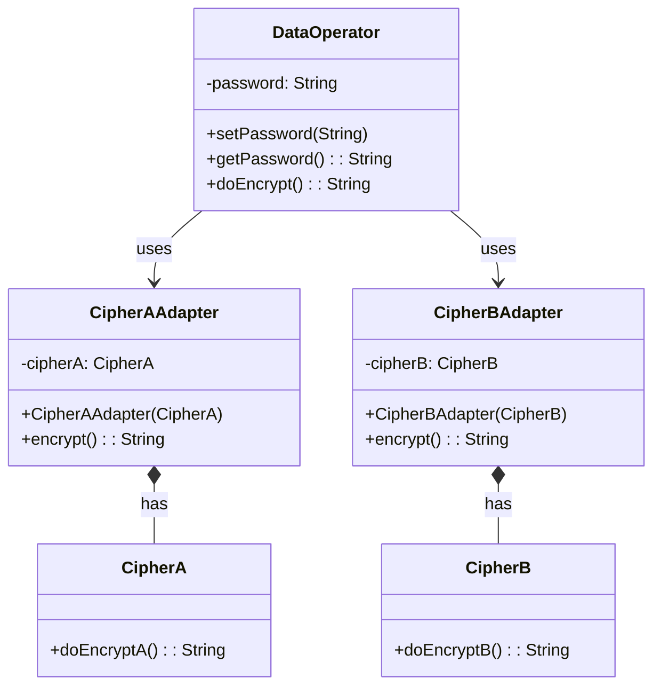


4. 

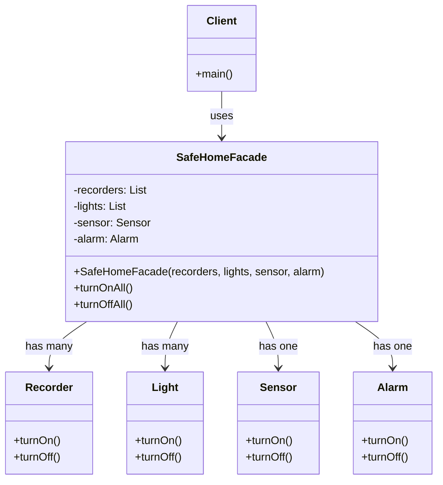

```java
// 报警器类
class Alarm {
    public void turnOn() {
        System.out.println("报警器已开启");
    }

    public void turnOff() {
        System.out.println("报警器已关闭");
    }
}    

// 电灯类
class Light {
    public void turnOn() {
        System.out.println("电灯已开启");
    }

    public void turnOff() {
        System.out.println("电灯已关闭");
    }
}    

// 录像机类
class Recorder {
    public void turnOn() {
        System.out.println("录像机已开启");
    }

    public void turnOff() {
        System.out.println("录像机已关闭");
    }
}    

import java.util.List;

// 保安系统外观类
class SafeHomeFacade {
    private List<Recorder> recorders;
    private List<Light> lights;
    private Sensor sensor;
    private Alarm alarm;

    public SafeHomeFacade(List<Recorder> recorders, List<Light> lights, Sensor sensor, Alarm alarm) {
        this.recorders = recorders;
        this.lights = lights;
        this.sensor = sensor;
        this.alarm = alarm;
    }

    // 开启所有设备
    public void turnOnAll() {
        for (Recorder recorder : recorders) {
            recorder.turnOn();
        }
        for (Light light : lights) {
            light.turnOn();
        }
        sensor.turnOn();
        alarm.turnOn();
    }

    // 关闭所有设备
    public void turnOffAll() {
        for (Recorder recorder : recorders) {
            recorder.turnOff();
        }
        for (Light light : lights) {
            light.turnOff();
        }
        sensor.turnOff();
        alarm.turnOff();
    }
}    

// 遥感器类
class Sensor {
    public void turnOn() {
        System.out.println("遥感器已开启");
    }

    public void turnOff() {
        System.out.println("遥感器已关闭");
    }
}    


import java.util.ArrayList;
import java.util.List;

// 客户端类
public class Client {
    public static void main(String[] args) {
        // 创建设备
        List<Recorder> recorders = new ArrayList<>();
        recorders.add(new Recorder());
        recorders.add(new Recorder());

        List<Light> lights = new ArrayList<>();
        lights.add(new Light());
        lights.add(new Light());
        lights.add(new Light());

        Sensor sensor = new Sensor();
        Alarm alarm = new Alarm();

        // 创建外观对象
        SafeHomeFacade facade = new SafeHomeFacade(recorders, lights, sensor, alarm);

        // 开启所有设备
        System.out.println("开启所有设备:");
        facade.turnOnAll();

        // 关闭所有设备
        System.out.println("\n关闭所有设备:");
        facade.turnOffAll();
    }
}    
```


### 项目2

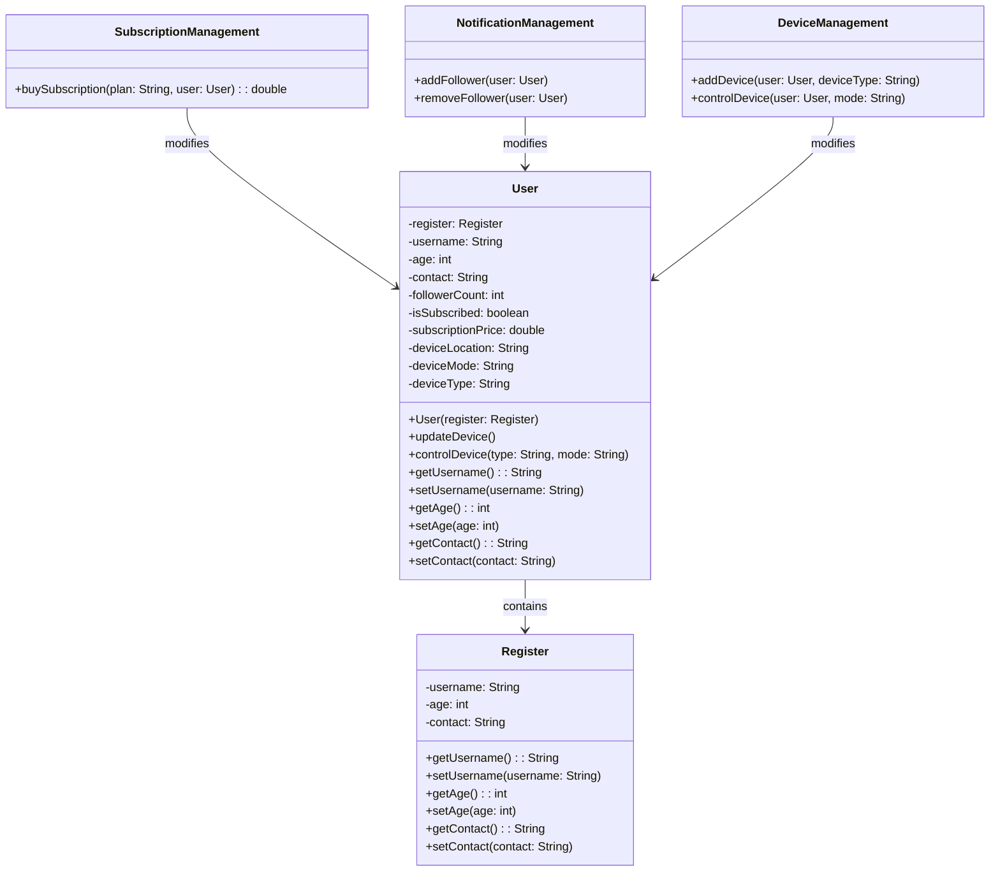


```mermaid
classDiagram
    %% 单例模式
    class Register {
        -username: String
        -age: int
        -contact: String
        -instance: Register$
        -Register(username: String, age: int, contact: String)$
        +getInstance(username: String, age: int, contact: String): Register$
        +getUsername(): String
        +setUsername(username: String)
        +getAge(): int
        +setAge(age: int)
        +getContact(): String
        +setContact(contact: String)
    }

    %% 观察者模式
    class Subject {
        <<interface>>
        +registerObserver(o: Observer)
        +removeObserver(o: Observer)
        +notifyObservers()
    }

    class Observer {
        <<interface>>
        +update(message: String)
    }

    class FamilyMember {
        -name: String
        +FamilyMember(name: String)
        +update(message: String)
    }

    %% 模板方法模式
    class DeviceControl {
        <<abstract>>
        -location: String
        -mode: String
        -type: String
        +prepareControl()$
        +setLocation()
        +setType()*
        +setMode()*
    }

    %% 策略模式
    class SubscriptionStrategy {
        <<interface>>
        +calculateCost(): double
    }

    class MonthlySubscription {
        -basePrice: double
        +calculateCost(): double
    }

    class QuarterlySubscription {
        -basePrice: double
        +calculateCost(): double
    }

    class YearlySubscription {
        -basePrice: double
        +calculateCost(): double
    }

    %% 装饰器模式
    class DeviceType {
        <<abstract>>
        -description: String
        +getDescription(): String
    }

    class LightDevice {
        +LightDevice()
    }

    class DeviceDecorator {
        <<abstract>>
        -device: DeviceType
        +getDescription(): String*
    }

    class DimmingDecorator {
        +DimmingDecorator(device: DeviceType)
        +getDescription(): String
    }

    %% 门面模式
    class SceneFacade {
        -light: LightControl
        -ac: ACControl
        -music: MusicControl
        +SceneFacade()
        +activateHomeMode()
    }

    class LightControl {
        +turnOn()
    }

    class ACControl {
        +setTemperature(temp: int)
    }

    class MusicControl {
        +play()
    }

    %% 用户类
    class User {
        -username: String
        -age: int
        -contact: String
        -observers: List~Observer~
        -subscription: SubscriptionStrategy
        -sceneFacade: SceneFacade
        -deviceType: DeviceType
        +User(register: Register, sceneFacade: SceneFacade)
        +setSubscription(subscription: SubscriptionStrategy)
        +querySubscriptionCost()
        +chooseDeviceType(type: DeviceType)
        +controlDevice(mode: String)
        +activateScene()
        +registerObserver(o: Observer)
        +removeObserver(o: Observer)
        +notifyObservers()
        +setType()
        +setMode()
        +getUsername(): String
        +setUsername(username: String)
        +getAge(): int
        +setAge(age: int)
        +getContact(): String
        +setContact(contact: String)
    }

    %% 关系
    User --> Register : contains
    User ..|> Subject : implements
    User --|> DeviceControl : extends
    User --> SubscriptionStrategy : uses
    User --> DeviceType : uses
    User --> SceneFacade : uses
    FamilyMember ..|> Observer : implements
    Subject --> Observer : notifies
    MonthlySubscription ..|> SubscriptionStrategy : implements
    QuarterlySubscription ..|> SubscriptionStrategy : implements
    YearlySubscription ..|> SubscriptionStrategy : implements
    LightDevice --|> DeviceType : extends
    DeviceDecorator --|> DeviceType : extends
    DimmingDecorator --|> DeviceDecorator : extends
    DimmingDecorator --> DeviceType : decorates
    SceneFacade --> LightControl : controls
    SceneFacade --> ACControl : controls
    SceneFacade --> MusicControl : controls

    %% 标注设计模式
    note for Register "Singleton Pattern"
    note for Subject "Observer Pattern"
    note for Observer "Observer Pattern"
    note for DeviceControl "Template Method Pattern"
    note for SubscriptionStrategy "Strategy Pattern"
    note for DeviceType "Decorator Pattern"
    note for DeviceDecorator "Decorator Pattern"
    note for SceneFacade "Facade Pattern"
```


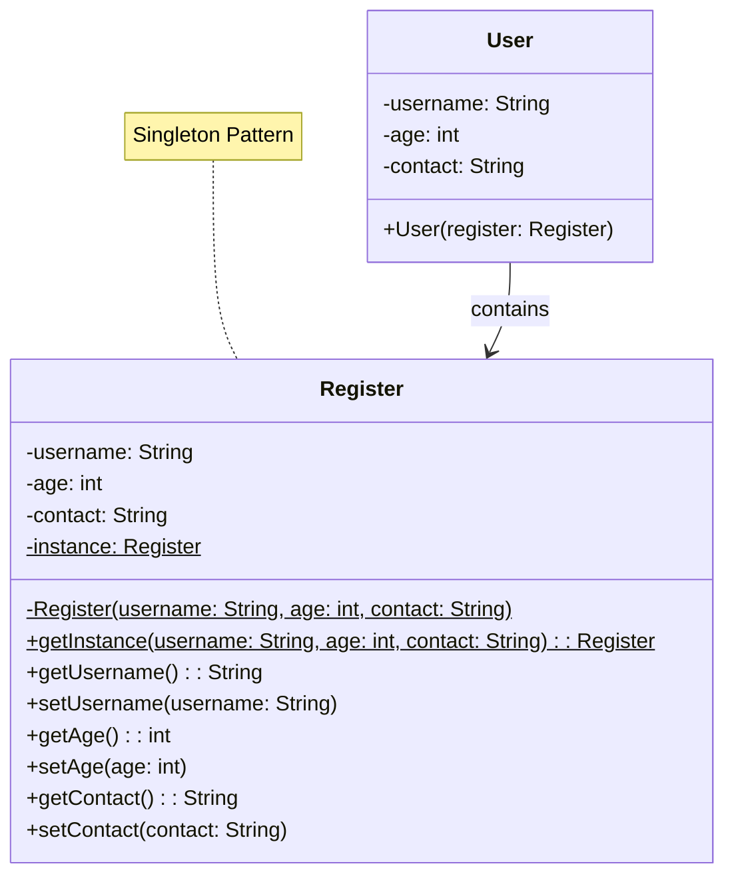

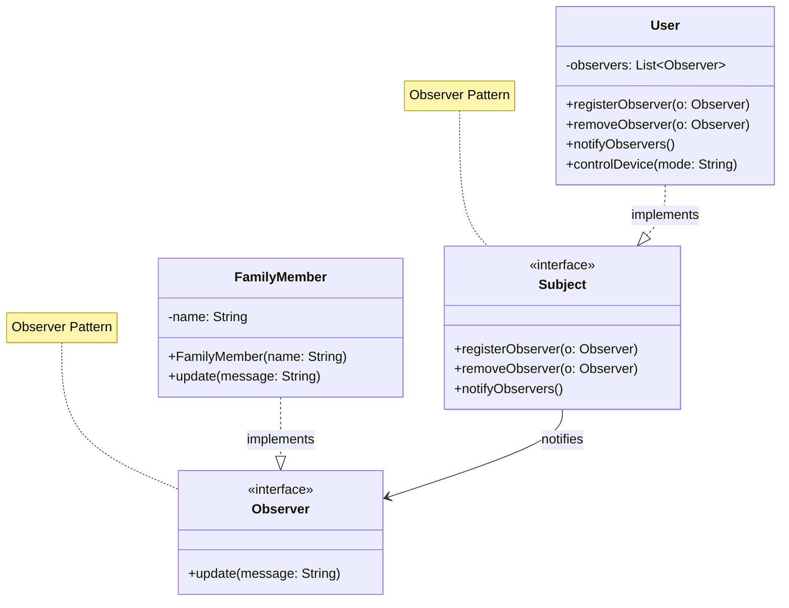

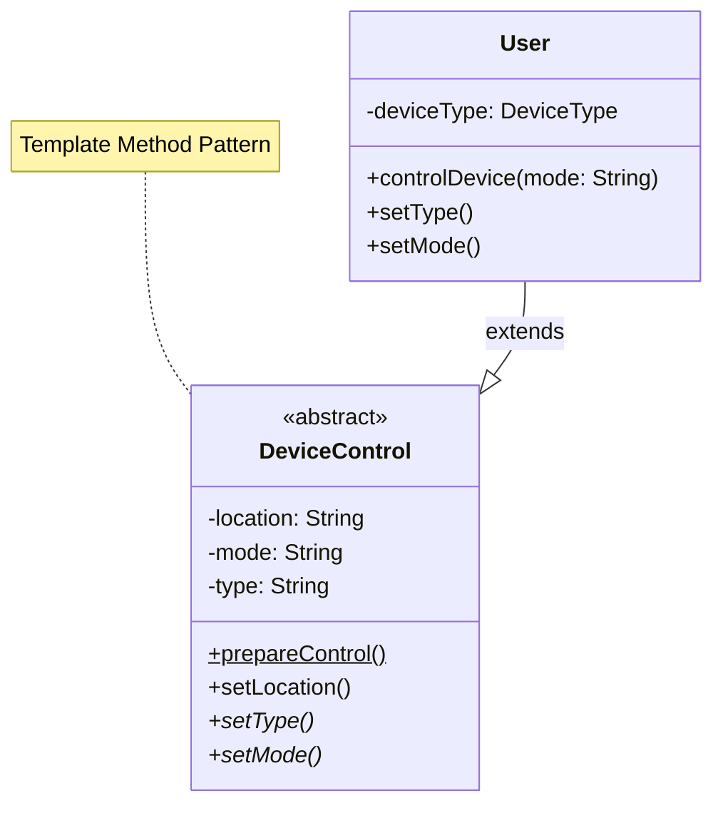

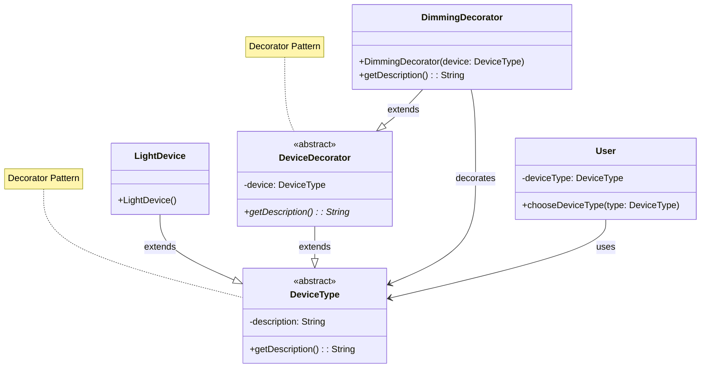

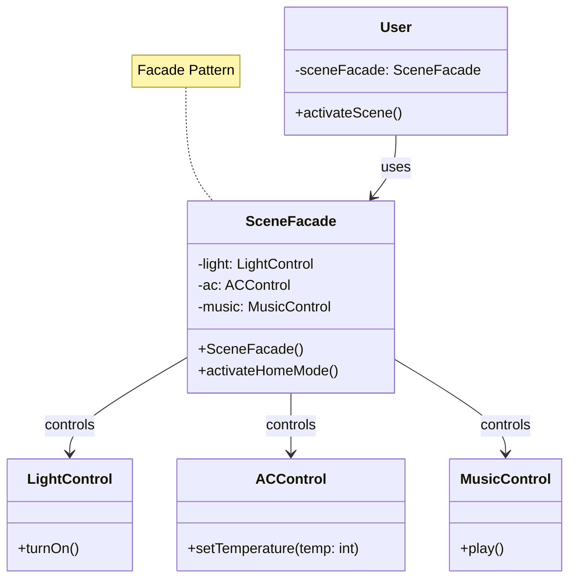

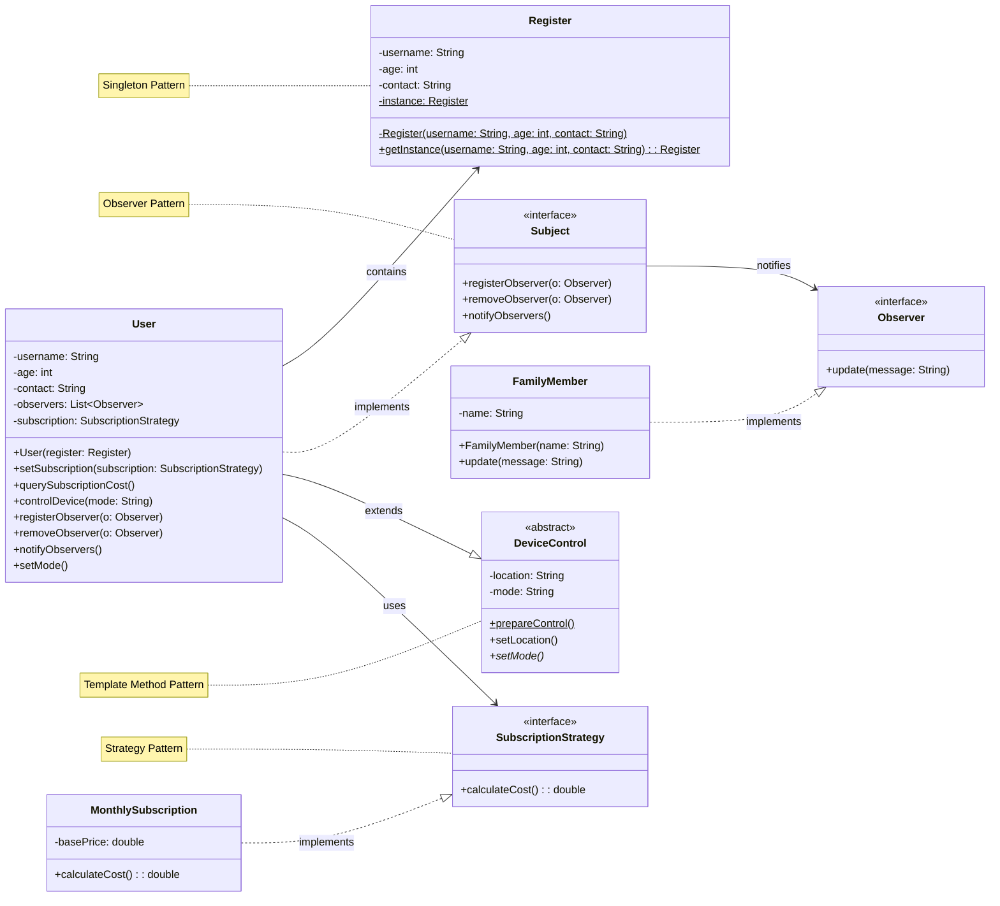

